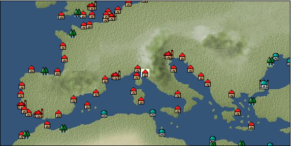

# Port: Pisa

import Tabs from '@theme/Tabs';
import TabItem from '@theme/TabItem';

## General Information

| Attribute | Details |
| :--- | :--- |
| **Port Name** | Pisa |
| **Port Type** | port of alliance |
| **Region** | western europe |
| **Sea Area** | ligurian sea |
| **Required Language** | italian |
| **Coordinates** | （361，2952） |
| **Investment Reward** | [sculpture of great figures](docs/Items/RecipeBooks/item_1033.md) （必要投資額：800,000ドゥカード） |

### Available Facilities

| guild | intermediary | exchange | tool shop | workshop craftsman | Painter | sculptor | peddler |
| --- | --- | --- | --- | --- | --- | --- | --- |
|   |   | ○ | ○ | ○ | ○ |   | ○ |
| Shipyard Master | Lumbermaker | Sail-maker | weapon craftsman | master | TavernFemale | archive | salesperson |
| --- | --- | --- | --- | --- | --- | --- | --- |
| ○ |   | ○ | ○ | ○ |   |   | ○ |
| Shipwright | 銀行 | street worker | 王宮 | Trading post | church | suburbs | translator |
| --- | --- | --- | --- | --- | --- | --- | --- |
| ○ | ○ | ○ |   |   |   |   |   |

### Description
An old city that was developed during the ancient Roman era. Famous for the Leaning Tower of Pisa. It was the first of the Italian cities to declare itself a city-state. The main products are fine textiles and marble statues. Advanced Navigator Training School Coach (moves to Florence) Cultural area: Italy/Southern France

<Tabs>
  <TabItem value="trade_goods_sales" label="Trade Goods Sales">

| Item | Group | Purchase Price | Allied Price | Remarks |
| --- | --- | --- | --- | --- |
| [crossbow](docs/Items/TradeGoods/TradeGoods-Weapons/item_537.md) | [Trading Items (Arms)](docs/Categories/category_16.md) | 936 | (819) |  |
| [dragonfly ball](docs/Items/TradeGoods/TradeGoods-Luxuries/item_294.md) | [Trading goods (artificial goods)](docs/Categories/category_13.md) | 1,113 | (974) |  |
| 要投資（必要投資額：720,000） EO第４章で追加 |
| [pickles](docs/Items/TradeGoods/TradeGoods-Sunddries/item_535.md) | [Trading goods (hobby goods)](docs/Categories/category_10.md) | 256 | 224 |  |
| When in alliance: confirmed at 100% |
| [hazelnut](docs/Items/TradeGoods/TradeGoods-Sunddries/item_125.md) | [Trading goods (hobby goods)](docs/Categories/category_10.md) | 383 | 336 |  |
| When in alliance: confirmed at 100% |
| [velvet](docs/Items/TradeGoods/TradeGoods-Fabrics/item_902.md) | [交易品（織物）](docs/Categories/category_20.md) | 3,315 | (2,901) |  |
| 要投資（必要投資額：240,000） |
| [rose](docs/Items/TradeGoods/TradeGoods-Perfume/item_536.md) | [Trading Goods (Spices)](docs/Categories/category_11.md) | 2,802 | (2,452) |  |
| [marble statue](docs/Items/TradeGoods/TradeGoods-Art/item_50.md) | [交易品（美術品）](docs/Categories/category_14.md) | 2,790 | 2,540 |  |
| [woolen fabric](docs/Items/TradeGoods/TradeGoods-Fabrics/item_163.md) | [交易品（織物）](docs/Categories/category_20.md) | 925 | (810) |  |
| [beef](docs/Items/TradeGoods/TradeGoods-Foodstuffs/item_26.md) | [Trading items (food items)](docs/Categories/category_3.md) | 648 | 568 |  |
| [ceramics](docs/Items/TradeGoods/TradeGoods-Luxuries/item_152.md) | [Trading goods (artificial goods)](docs/Categories/category_13.md) | 1,434 | 1,260 |  |
| 要投資（必要投資額：120,000） |
  </TabItem>
  <TabItem value="sale_specialty" label="Sale (Specialty)">

| Item | Group | sale price | Allied Price | Remarks |
| --- | --- | --- | --- | --- |

#### [交易品（繊維）](docs/Categories/category_1.md)

| [flax](docs/Items/TradeGoods/TradeGoods-Fibers/item_64.md) | 交易品（繊維） | (275) | 320 |  |
| When in alliance: confirmed at 100% |
| [Green ramie](docs/Items/TradeGoods/TradeGoods-Fibers/item_3428.md) | 交易品（繊維） | (32,888) | 38,375 |  |

#### [Trading Goods (Dye)](docs/Categories/category_2.md)

| [Indian indigo](docs/Items/TradeGoods/TradeGoods-Dye/item_157.md) | Trading Goods (Dye) | 1,347 | (1,515) |  |
| [Safflower](docs/Items/TradeGoods/TradeGoods-Dye/item_1059.md) | Trading Goods (Dye) | 659 | (741) |  |
| [mayan blue](docs/Items/TradeGoods/TradeGoods-Dye/item_1096.md) | Trading Goods (Dye) | 1,416 | (1,593) |  |

#### [Trading items (food items)](docs/Categories/category_3.md)

| [taro](docs/Items/TradeGoods/TradeGoods-Foodstuffs/item_1960.md) | Trading items (food items) | (235) | 274 |  |

#### [交易品（雑貨）](docs/Categories/category_5.md)

| [lantern](docs/Items/TradeGoods/TradeGoods-Misc/item_3683.md) | 交易品（雑貨） | (36,744) | 42,875 |  |

#### [Trading products (medical products)](docs/Categories/category_6.md)

| [Saikaku](docs/Items/TradeGoods/TradeGoods-Medicine/item_1959.md) | Trading products (medical products) | 4,322 | (4,862) |  |
| [Borei](docs/Items/TradeGoods/TradeGoods-Medicine/item_3678.md) | Trading products (medical products) | 45,000 | (50,629) |  |
| [Nothing](docs/Items/TradeGoods/TradeGoods-Medicine/item_1053.md) | Trading products (medical products) | 762 | (857) |  |

#### [Trading products (precious metals)](docs/Categories/category_8.md)

| [platinum](docs/Items/TradeGoods/TradeGoods-Metals/item_2178.md) | Trading products (precious metals) | (6,514) | 7,600 |  |

#### [交易品（酒類）](docs/Categories/category_9.md)

| [aquavit](docs/Items/TradeGoods/TradeGoods-Alcohol/item_572.md) | 交易品（酒類） | 810 | (911) |  |
| [whiskey](docs/Items/TradeGoods/TradeGoods-Alcohol/item_1.md) | 交易品（酒類） | (823) | 960 |  |
| [gin](docs/Items/TradeGoods/TradeGoods-Alcohol/item_291.md) | 交易品（酒類） | 875 | (984) |  |
| [fruit brandy](docs/Items/TradeGoods/TradeGoods-Alcohol/item_1440.md) | 交易品（酒類） | (667) | 778 |  |

#### [Trading goods (hobby goods)](docs/Categories/category_10.md)

| [dried figs](docs/Items/TradeGoods/TradeGoods-Sunddries/item_611.md) | Trading goods (hobby goods) | 363 | (408) |  |
| [black tea](docs/Items/TradeGoods/TradeGoods-Sunddries/item_675.md) | Trading goods (hobby goods) | (2,357) | 2,750 |  |

#### [Trading Goods (Spices)](docs/Categories/category_11.md)

| [ylang ylang](docs/Items/TradeGoods/TradeGoods-Perfume/item_1434.md) | Trading Goods (Spices) | (1,660) | 1,936 |  |
| [Osmanthus](docs/Items/TradeGoods/TradeGoods-Perfume/item_3925.md) | Trading Goods (Spices) | (25,309) | 29,532 |  |
| [gardenia](docs/Items/TradeGoods/TradeGoods-Perfume/item_1091.md) | Trading Goods (Spices) | (22,900) | 26,720 |  |
| [jasmine](docs/Items/TradeGoods/TradeGoods-Perfume/item_772.md) | Trading Goods (Spices) | 6,131 | (6,898) |  |
| [daffodil](docs/Items/TradeGoods/TradeGoods-Perfume/item_612.md) | Trading Goods (Spices) | 910 | (1,023) |  |
| [geranium](docs/Items/TradeGoods/TradeGoods-Perfume/item_145.md) | Trading Goods (Spices) | 1,191 | (1,340) |  |
| [sandalwood](docs/Items/TradeGoods/TradeGoods-Perfume/item_771.md) | Trading Goods (Spices) | (4,549) | 5,308 |  |
| [龍脳](docs/Items/TradeGoods/TradeGoods-Perfume/item_1676.md) | Trading Goods (Spices) | 3,315 | (3,729) |  |

#### [Trading Goods (Spices)](docs/Categories/category_12.md)

| [cloves](docs/Items/TradeGoods/TradeGoods-Spices/item_1092.md) | Trading Goods (Spices) | (11,544) | 13,470 |  |
| [pepper](docs/Items/TradeGoods/TradeGoods-Spices/item_58.md) | Trading Goods (Spices) | 5,530 | 9,263 |  |
| [mace](docs/Items/TradeGoods/TradeGoods-Spices/item_2100.md) | Trading Goods (Spices) | (12,616) | 14,720 |  |
| [Grapefruit](docs/Items/TradeGoods/TradeGoods-Spices/item_3422.md) | Trading Goods (Spices) | (34,425) | 40,169 |  |

#### [Trading goods (artificial goods)](docs/Categories/category_13.md)

| [Tumbaga](docs/Items/TradeGoods/TradeGoods-Luxuries/item_3028.md) | Trading goods (artificial goods) | 18,877 | (21,238) |  |

#### [交易品（美術品）](docs/Categories/category_14.md)

| [Mianzhu New Year Pictures](docs/Items/TradeGoods/TradeGoods-Art/item_4005.md) | 交易品（美術品） | (38,565) | 45,000 |  |

#### [Trading Items (Gemstones)](docs/Categories/category_15.md)

| [inca rose](docs/Items/TradeGoods/TradeGoods-Gems/item_3014.md) | Trading Items (Gemstones) | (15,972) | 18,637 |  |
| [opal](docs/Items/TradeGoods/TradeGoods-Gems/item_2006.md) | Trading Items (Gemstones) | (6,901) | 8,052 |  |
| [sapphire](docs/Items/TradeGoods/TradeGoods-Gems/item_676.md) | Trading Items (Gemstones) | (9,805) | 11,440 |  |
| [diamond](docs/Items/TradeGoods/TradeGoods-Gems/item_449.md) | Trading Items (Gemstones) | (6,089) | 7,104 |  |
| [topaz](docs/Items/TradeGoods/TradeGoods-Gems/item_1097.md) | Trading Items (Gemstones) | 5,034 | 6,159 |  |
| [pink diamond](docs/Items/TradeGoods/TradeGoods-Gems/item_2874.md) | Trading Items (Gemstones) | (12,941) | 15,100 |  |
| [ruby](docs/Items/TradeGoods/TradeGoods-Gems/item_773.md) | Trading Items (Gemstones) | (10,532) | 12,289 |  |
| [amber](docs/Items/TradeGoods/TradeGoods-Gems/item_618.md) | Trading Items (Gemstones) | (3,951) | 4,610 |  |

#### [Trading Items (Firearms)](docs/Categories/category_17.md)

| [tanegashima gun](docs/Items/TradeGoods/TradeGoods-Firearms/item_3423.md) | Trading Items (Firearms) | 25,455 | (28,639) |  |
| [銅手銃](docs/Items/TradeGoods/TradeGoods-Firearms/item_3700.md) | Trading Items (Firearms) | 30,426 | (34,232) |  |

#### [交易品（工業品）](docs/Categories/category_19.md)

| [papyrus](docs/Items/TradeGoods/TradeGoods-Wares/item_616.md) | 交易品（工業品） | 530 | (596) |  |
| [Japanese paper](docs/Items/TradeGoods/TradeGoods-Wares/item_3438.md) | 交易品（工業品） | (33,941) | 39,604 |  |
| [rosewood](docs/Items/TradeGoods/TradeGoods-Wares/item_5559.md) | 交易品（工業品） | (9,795) | 11,429 |  |

#### [交易品（織物）](docs/Categories/category_20.md)

| [Awaiyo](docs/Items/TradeGoods/TradeGoods-Fabrics/item_3002.md) | 交易品（織物） | (7,187) | 8,386 |  |
| [indian chintz](docs/Items/TradeGoods/TradeGoods-Fabrics/item_159.md) | 交易品（織物） | (2,384) | 2,781 |  |
| [dutch calico](docs/Items/TradeGoods/TradeGoods-Fabrics/item_1435.md) | 交易品（織物） | 1,317 | (1,481) |  |
| [gobelin weave](docs/Items/TradeGoods/TradeGoods-Fabrics/item_1276.md) | 交易品（織物） | (3,634) | 4,240 |  |
| [damask](docs/Items/TradeGoods/TradeGoods-Fabrics/item_614.md) | 交易品（織物） | (3,454) | 4,030 |  |
| [turkish rug](docs/Items/TradeGoods/TradeGoods-Fabrics/item_686.md) | 交易品（織物） | (4,285) | 5,000 |  |
| [flannel](docs/Items/TradeGoods/TradeGoods-Fabrics/item_149.md) | 交易品（織物） | 1,600 | (1,800) |  |
  </TabItem>
  <TabItem value="sale_no_specialty" label="Sale (No Specialty)">

| Item | Group | sale price | Allied Price | Remarks |
| --- | --- | --- | --- | --- |

#### [交易品（繊維）](docs/Categories/category_1.md)

| [camel hair](docs/Items/TradeGoods/TradeGoods-Fibers/item_577.md) | 交易品（繊維） | (443) | 516 |  |
| [goat hair](docs/Items/TradeGoods/TradeGoods-Fibers/item_770.md) | 交易品（繊維） | 1,500 | (1,687) |  |
| [fur](docs/Items/TradeGoods/TradeGoods-Fibers/item_634.md) | 交易品（繊維） | 2,456 | (2,763) |  |
| [raw silk](docs/Items/TradeGoods/TradeGoods-Fibers/item_677.md) | 交易品（繊維） | 2,200 | (2,475) |  |
| [leather](docs/Items/TradeGoods/TradeGoods-Fibers/item_44.md) | 交易品（繊維） | 612 | (688) |  |
| [cotton](docs/Items/TradeGoods/TradeGoods-Fibers/item_610.md) | 交易品（繊維） | 620 | 651 |  |
| [wool](docs/Items/TradeGoods/TradeGoods-Fibers/item_5.md) | 交易品（繊維） | 469 | (527) |  |
| [jute](docs/Items/TradeGoods/TradeGoods-Fibers/item_128.md) | 交易品（繊維） | (181) | 211 |  |

#### [Trading Goods (Dye)](docs/Categories/category_2.md)

| [ward](docs/Items/TradeGoods/TradeGoods-Dye/item_57.md) | Trading Goods (Dye) | 900 | (1,012) |  |
| [persian berry](docs/Items/TradeGoods/TradeGoods-Dye/item_693.md) | Trading Goods (Dye) | (1,223) | 1,426 |  |
| [貝紫](docs/Items/TradeGoods/TradeGoods-Dye/item_110.md) | Trading Goods (Dye) | 4,539 | 4,600 |  |

#### [Trading items (food items)](docs/Categories/category_3.md)

| [mushroom](docs/Items/TradeGoods/TradeGoods-Foodstuffs/item_160.md) | Trading items (food items) | (28) | 32 |  |
| [fava beans](docs/Items/TradeGoods/TradeGoods-Foodstuffs/item_102.md) | Trading items (food items) | 88 | (99) |  |
| [duck meat](docs/Items/TradeGoods/TradeGoods-Foodstuffs/item_32.md) | Trading items (food items) | 437 | 456 |  |
| [olive](docs/Items/TradeGoods/TradeGoods-Foodstuffs/item_47.md) | Trading items (food items) | (262) | 305 |  |
| [turnip](docs/Items/TradeGoods/TradeGoods-Foodstuffs/item_55.md) | Trading items (food items) | 80 | 84 |  |
| [Oat](docs/Items/TradeGoods/TradeGoods-Foodstuffs/item_275.md) | Trading items (food items) | (77) | 89 |  |
| [sausage](docs/Items/TradeGoods/TradeGoods-Foodstuffs/item_27.md) | Trading items (food items) | 542 | (609) |  |
| [cheese](docs/Items/TradeGoods/TradeGoods-Foodstuffs/item_20.md) | Trading items (food items) | (336) | 392 |  |
| [ham](docs/Items/TradeGoods/TradeGoods-Foodstuffs/item_290.md) | Trading items (food items) | 440 | (495) |  |
| [bacon](docs/Items/TradeGoods/TradeGoods-Foodstuffs/item_566.md) | Trading items (food items) | 435 | (489) |  |
| [mussels](docs/Items/TradeGoods/TradeGoods-Foodstuffs/item_876.md) | Trading items (food items) | 27 | (30) |  |
| [milk](docs/Items/TradeGoods/TradeGoods-Foodstuffs/item_254.md) | Trading items (food items) | 143 | (160) |  |
| [egg](docs/Items/TradeGoods/TradeGoods-Foodstuffs/item_40.md) | Trading items (food items) | (30) | 34 |  |
| [wheat](docs/Items/TradeGoods/TradeGoods-Foodstuffs/item_16.md) | Trading items (food items) | 63 | 65 |  |
| [Paddy rice](docs/Items/TradeGoods/TradeGoods-Foodstuffs/item_654.md) | Trading items (food items) | (93) | 108 |  |
| [seaweed](docs/Items/TradeGoods/TradeGoods-Foodstuffs/item_871.md) | Trading items (food items) | 3 | (3) |  |
| [pork](docs/Items/TradeGoods/TradeGoods-Foodstuffs/item_41.md) | Trading items (food items) | 388 | (436) |  |
| [red bean](docs/Items/TradeGoods/TradeGoods-Foodstuffs/item_123.md) | Trading items (food items) | 134 | 143 |  |
| [魚肉](docs/Items/TradeGoods/TradeGoods-Foodstuffs/item_10.md) | Trading items (food items) | 189 | 192 |  |
| [chicken meat](docs/Items/TradeGoods/TradeGoods-Foodstuffs/item_29.md) | Trading items (food items) | 311 | 331 |  |

#### [交易品（調味料）](docs/Categories/category_4.md)

| [olive oil](docs/Items/TradeGoods/TradeGoods-Seasonings/item_48.md) | 交易品（調味料） | 328 | 339 |  |
| [coconut vinegar](docs/Items/TradeGoods/TradeGoods-Seasonings/item_1988.md) | 交易品（調味料） | (444) | 518 |  |
| [white vinegar](docs/Items/TradeGoods/TradeGoods-Seasonings/item_56.md) | 交易品（調味料） | (155) | 180 |  |
| [lard](docs/Items/TradeGoods/TradeGoods-Seasonings/item_43.md) | 交易品（調味料） | 322 | (362) |  |
| [wine vinegar](docs/Items/TradeGoods/TradeGoods-Seasonings/item_429.md) | 交易品（調味料） | 580 | (652) |  |
| [salt](docs/Items/TradeGoods/TradeGoods-Seasonings/item_42.md) | 交易品（調味料） | 270 | 272 |  |
| [Honey](docs/Items/TradeGoods/TradeGoods-Seasonings/item_49.md) | 交易品（調味料） | 942 | 945 |  |

#### [交易品（雑貨）](docs/Categories/category_5.md)

| [Western books](docs/Items/TradeGoods/TradeGoods-Misc/item_293.md) | 交易品（雑貨） | 725 | (815) |  |

#### [Trading products (medical products)](docs/Categories/category_6.md)

| [digitalis](docs/Items/TradeGoods/TradeGoods-Medicine/item_2148.md) | Trading products (medical products) | 384 | (432) |  |
| [dandelion](docs/Items/TradeGoods/TradeGoods-Medicine/item_1089.md) | Trading products (medical products) | 290 | (326) |  |
| [Mandragora](docs/Items/TradeGoods/TradeGoods-Medicine/item_1054.md) | Trading products (medical products) | (883) | 1,030 |  |
| [mercury agent](docs/Items/TradeGoods/TradeGoods-Medicine/item_703.md) | Trading products (medical products) | (1,235) | 1,441 |  |

#### [Trading Items (Iron Stone)](docs/Categories/category_7.md)

| [tin ore](docs/Items/TradeGoods/TradeGoods-Minerals/item_23.md) | Trading Items (Iron Stone) | 582 | (654) |  |
| [iron ore](docs/Items/TradeGoods/TradeGoods-Minerals/item_146.md) | Trading Items (Iron Stone) | (672) | 784 |  |
| [lead ore](docs/Items/TradeGoods/TradeGoods-Minerals/item_21.md) | Trading Items (Iron Stone) | 501 | (563) |  |
| [copper ore](docs/Items/TradeGoods/TradeGoods-Minerals/item_65.md) | Trading Items (Iron Stone) | 918 | (1,032) |  |

#### [Trading products (precious metals)](docs/Categories/category_8.md)

| [gold dust](docs/Items/TradeGoods/TradeGoods-Metals/item_111.md) | Trading products (precious metals) | 4,576 | (5,148) |  |
| [gold](docs/Items/TradeGoods/TradeGoods-Metals/item_659.md) | Trading products (precious metals) | 8,720 | (9,810) |  |
| [silver](docs/Items/TradeGoods/TradeGoods-Metals/item_136.md) | Trading products (precious metals) | 2,630 | 2,880 |  |

#### [交易品（酒類）](docs/Categories/category_9.md)

| [sherry](docs/Items/TradeGoods/TradeGoods-Alcohol/item_844.md) | 交易品（酒類） | 498 | 518 |  |
| [Beer](docs/Items/TradeGoods/TradeGoods-Alcohol/item_2.md) | 交易品（酒類） | (366) | 427 |  |
| [brandy](docs/Items/TradeGoods/TradeGoods-Alcohol/item_9.md) | 交易品（酒類） | 794 | 794 |  |
| [rum](docs/Items/TradeGoods/TradeGoods-Alcohol/item_139.md) | 交易品（酒類） | 722 | (812) |  |
| [liqueur](docs/Items/TradeGoods/TradeGoods-Alcohol/item_18.md) | 交易品（酒類） | 642 | 647 |  |
| [wine](docs/Items/TradeGoods/TradeGoods-Alcohol/item_11.md) | 交易品（酒類） | 515 | 515 |  |

#### [Trading goods (hobby goods)](docs/Categories/category_10.md)

| [almond](docs/Items/TradeGoods/TradeGoods-Sunddries/item_367.md) | Trading goods (hobby goods) | 204 | (229) |  |
| [walnut](docs/Items/TradeGoods/TradeGoods-Sunddries/item_522.md) | Trading goods (hobby goods) | (419) | 488 |  |
| ▲Special products from the same cultural area |
| [prune](docs/Items/TradeGoods/TradeGoods-Sunddries/item_523.md) | Trading goods (hobby goods) | 356 | 374 |  |
| [dried strawberries](docs/Items/TradeGoods/TradeGoods-Sunddries/item_36.md) | Trading goods (hobby goods) | 1 | (1) |  |
| [raisins](docs/Items/TradeGoods/TradeGoods-Sunddries/item_35.md) | Trading goods (hobby goods) | (304) | 354 |  |

#### [Trading Goods (Spices)](docs/Categories/category_11.md)

| [oakmoss](docs/Items/TradeGoods/TradeGoods-Perfume/item_819.md) | Trading Goods (Spices) | 840 | (945) |  |
| [lavender](docs/Items/TradeGoods/TradeGoods-Perfume/item_150.md) | Trading Goods (Spices) | (772) | 900 |  |
| When in alliance: confirmed at 100% |
| [lemon oil](docs/Items/TradeGoods/TradeGoods-Perfume/item_151.md) | Trading Goods (Spices) | 571 | 571 |  |

#### [Trading Goods (Spices)](docs/Categories/category_12.md)

| [garlic](docs/Items/TradeGoods/TradeGoods-Spices/item_526.md) | Trading Goods (Spices) | (290) | 338 |  |
| [cumin](docs/Items/TradeGoods/TradeGoods-Spices/item_156.md) | Trading Goods (Spices) | 1,145 | (1,288) |  |
| [coriander](docs/Items/TradeGoods/TradeGoods-Spices/item_1044.md) | Trading Goods (Spices) | (415) | 484 |  |
| [celery](docs/Items/TradeGoods/TradeGoods-Spices/item_431.md) | Trading Goods (Spices) | 140 | 144 |  |
| [time](docs/Items/TradeGoods/TradeGoods-Spices/item_432.md) | Trading Goods (Spices) | 447 | (502) |  |
| [mustard](docs/Items/TradeGoods/TradeGoods-Spices/item_575.md) | Trading Goods (Spices) | 280 | (315) |  |

#### [Trading goods (artificial goods)](docs/Categories/category_13.md)

| [glasswork](docs/Items/TradeGoods/TradeGoods-Luxuries/item_60.md) | Trading goods (artificial goods) | (1,037) | 1,210 |  |
| [coral work](docs/Items/TradeGoods/TradeGoods-Luxuries/item_595.md) | Trading goods (artificial goods) | 2,957 | 3,016 |  |
| [dragonfly ball](docs/Items/TradeGoods/TradeGoods-Luxuries/item_294.md) | Trading goods (artificial goods) | 492 | (553) |  |
| 要投資（必要投資額：720,000） EO第４章で追加 |
| [lapidary work](docs/Items/TradeGoods/TradeGoods-Luxuries/item_153.md) | Trading goods (artificial goods) | (3,514) | 4,100 |  |
| When in alliance: confirmed at 100% |
| [皮革製品](docs/Items/TradeGoods/TradeGoods-Luxuries/item_12.md) | Trading goods (artificial goods) | (1,132) | 1,320 |  |
| [goldsmith](docs/Items/TradeGoods/TradeGoods-Luxuries/item_687.md) | Trading goods (artificial goods) | (2,597) | 3,030 |  |
| [silversmith](docs/Items/TradeGoods/TradeGoods-Luxuries/item_619.md) | Trading goods (artificial goods) | (2,597) | 3,030 |  |
| [luxury clothing](docs/Items/TradeGoods/TradeGoods-Luxuries/item_165.md) | Trading goods (artificial goods) | 4,263 | (4,796) |  |

#### [交易品（美術品）](docs/Categories/category_14.md)

| [古美術品](docs/Items/TradeGoods/TradeGoods-Art/item_51.md) | 交易品（美術品） | 3,579 | 3,580 |  |
| [oil painting](docs/Items/TradeGoods/TradeGoods-Art/item_1088.md) | 交易品（美術品） | (1,869) | 2,180 |  |
| [copperplate print](docs/Items/TradeGoods/TradeGoods-Art/item_1087.md) | 交易品（美術品） | (661) | 771 |  |
| [青銅像](docs/Items/TradeGoods/TradeGoods-Art/item_148.md) | 交易品（美術品） | (926) | 1,080 |  |
| When in alliance: confirmed at 100% |

#### [Trading Items (Gemstones)](docs/Categories/category_15.md)

| [emerald](docs/Items/TradeGoods/TradeGoods-Gems/item_777.md) | Trading Items (Gemstones) | 7,860 | (8,843) |  |
| [coral](docs/Items/TradeGoods/TradeGoods-Gems/item_141.md) | Trading Items (Gemstones) | 2,489 | (2,800) |  |
| [pearl](docs/Items/TradeGoods/TradeGoods-Gems/item_769.md) | Trading Items (Gemstones) | 9,087 | (10,223) |  |

#### [Trading Items (Arms)](docs/Categories/category_16.md)

| [two-handed sword](docs/Items/TradeGoods/TradeGoods-Weapons/item_24.md) | Trading Items (Arms) | 1,650 | (1,856) |  |
| [scimitar](docs/Items/TradeGoods/TradeGoods-Weapons/item_142.md) | Trading Items (Arms) | 1,060 | (1,192) |  |
| [dagger](docs/Items/TradeGoods/TradeGoods-Weapons/item_143.md) | Trading Items (Arms) | 914 | (1,028) |  |

#### [Trading Items (Firearms)](docs/Categories/category_17.md)

| [musket gun](docs/Items/TradeGoods/TradeGoods-Firearms/item_584.md) | Trading Items (Firearms) | (2,374) | 2,770 |  |
| [bullet](docs/Items/TradeGoods/TradeGoods-Firearms/item_13.md) | Trading Items (Firearms) | (783) | 913 |  |
| [cannonball](docs/Items/TradeGoods/TradeGoods-Firearms/item_144.md) | Trading Items (Firearms) | 1,736 | (1,953) |  |

#### [Trading Goods (Livestock)](docs/Categories/category_18.md)

| [chicken](docs/Items/TradeGoods/TradeGoods-Livestock/item_252.md) | Trading Goods (Livestock) | 54 | 55 |  |
| [sheep](docs/Items/TradeGoods/TradeGoods-Livestock/item_253.md) | Trading Goods (Livestock) | 131 | 134 |  |
| [pig](docs/Items/TradeGoods/TradeGoods-Livestock/item_37.md) | Trading Goods (Livestock) | 68 | (76) |  |
| [goat](docs/Items/TradeGoods/TradeGoods-Livestock/item_534.md) | Trading Goods (Livestock) | (174) | 203 |  |

#### [交易品（工業品）](docs/Categories/category_19.md)

| [alabaster](docs/Items/TradeGoods/TradeGoods-Wares/item_1086.md) | 交易品（工業品） | 618 | 661 |  |
| [wax](docs/Items/TradeGoods/TradeGoods-Wares/item_54.md) | 交易品（工業品） | (807) | 941 |  |
| [log](docs/Items/TradeGoods/TradeGoods-Wares/item_846.md) | 交易品（工業品） | 132 | (148) |  |
| [wood](docs/Items/TradeGoods/TradeGoods-Wares/item_277.md) | 交易品（工業品） | 1,024 | (1,152) |  |
| [水銀](docs/Items/TradeGoods/TradeGoods-Wares/item_15.md) | 交易品（工業品） | 1,220 | (1,372) |  |
| [brass](docs/Items/TradeGoods/TradeGoods-Wares/item_624.md) | 交易品（工業品） | 878 | (987) |  |
| [graphite](docs/Items/TradeGoods/TradeGoods-Wares/item_25.md) | 交易品（工業品） | 1,143 | (1,286) |  |
| [paper](docs/Items/TradeGoods/TradeGoods-Wares/item_625.md) | 交易品（工業品） | (276) | 322 |  |
| [羊皮紙](docs/Items/TradeGoods/TradeGoods-Wares/item_53.md) | 交易品（工業品） | 1,225 | (1,378) |  |
| [iron material](docs/Items/TradeGoods/TradeGoods-Wares/item_268.md) | 交易品（工業品） | 955 | (1,074) |  |
| [青銅](docs/Items/TradeGoods/TradeGoods-Wares/item_7.md) | 交易品（工業品） | 1,100 | (1,237) |  |

#### [交易品（織物）](docs/Categories/category_20.md)

| [corduroy](docs/Items/TradeGoods/TradeGoods-Fabrics/item_824.md) | 交易品（織物） | (840) | 979 |  |
| [georgette](docs/Items/TradeGoods/TradeGoods-Fabrics/item_1000.md) | 交易品（織物） | (2,529) | 2,950 |  |
| [tweed](docs/Items/TradeGoods/TradeGoods-Fabrics/item_31.md) | 交易品（織物） | 1,400 | (1,575) |  |
| [knit](docs/Items/TradeGoods/TradeGoods-Fabrics/item_164.md) | 交易品（織物） | 581 | 602 |  |
| [race](docs/Items/TradeGoods/TradeGoods-Fabrics/item_59.md) | 交易品（織物） | (1,640) | 1,913 |  |
| [cotton fabric](docs/Items/TradeGoods/TradeGoods-Fabrics/item_571.md) | 交易品（織物） | (917) | 1,070 |  |
  </TabItem>
  <TabItem value="guild_&_others" label="Guild & Others">

| Item | Group | Sales price | Handling NPC | Remarks |
| --- | --- | --- | --- | --- |

#### galileo galilei

| [Geography](docs/Skills/Skill-Adventure/item_343.md) | [Skill (adventure)](docs/Categories/category_39.md) | 5,000 | galileo galilei |  |
| [商品知識](docs/Skills/Skill-Trade/item_3580.md) | [Skill (trade)](docs/Categories/category_40.md) | 250,000 | galileo galilei |  |
| [first aid](docs/Skills/Skill-Battle/item_504.md) | [Skill (combat)](docs/Categories/category_41.md) | 2,000 | galileo galilei |  |

#### others

| [Graduation commemorative thumb book](docs/Items/Ships/item_4230.md) | [Boat](docs/Categories/category_43.md) |  |  |  |
| [Seasoning purchase order form](docs/Items/Consumables/Consumables-Documents/item_4777.md) | [Consumables (request documents)](docs/Categories/category_45.md) |  |  |  |
  </TabItem>
  <TabItem value="toolman" label="Toolman">

| Item | Group | Sales price | Handling NPC | Remarks |
| --- | --- | --- | --- | --- |

#### [recipe book](docs/Categories/category_22.md)

| [Wig manufacturing method](docs/Items/RecipeBooks/item_982.md) | recipe book | 300,000 | tool shop owner |  |
| [Baking bread for the first time](docs/Items/RecipeBooks/item_541.md) | recipe book | 7,000 | tool shop owner |  |
| [Mode Design Collection Volume 1](docs/Items/RecipeBooks/item_92.md) | recipe book | 10,000 | tool shop owner |  |
| [Mode Design Collection Volume 3](docs/Items/RecipeBooks/item_952.md) | recipe book | 100,000 | tool shop owner |  |
| [Sword training/application](docs/Items/RecipeBooks/item_589.md) | recipe book | 50,000 | tool shop owner |  |
| [Textile secrets/fabric book](docs/Items/RecipeBooks/item_91.md) | recipe book | 10,000 | tool shop owner |  |

#### [Equipment (head)](docs/Categories/category_23.md)

| [tricorne](docs/Items/Equipment/Equipment-Head/item_274.md) | Equipment (head) | 23,000 | tool shop owner |  |
| [bicorne](docs/Items/Equipment/Equipment-Head/item_539.md) | Equipment (head) | 23,000 | tool shop owner |  |
| [Tricorne with wings](docs/Items/Equipment/Equipment-Head/item_1537.md) | Equipment (head) | 33,000 | tool shop owner |  |
| 要投資（必要投資額：180,000） |
| [Bicorne with wings](docs/Items/Equipment/Equipment-Head/item_712.md) | Equipment (head) | 36,800 | tool shop owner |  |
| 要投資（必要投資額：180,000） |

#### [Equipment (body)](docs/Categories/category_24.md)

| [admiral coat](docs/Items/Equipment/Equipment-Body/item_1336.md) | Equipment (body) | 144,000 | tool shop owner |  |
| Investment required (Required investment amount: 180,000) Added in 2009.5.26 update |
| [cotton acton](docs/Items/Equipment/Equipment-Body/item_538.md) | Equipment (body) | 12,300 | tool shop owner |  |
| [buccaneer vest](docs/Items/Equipment/Equipment-Body/item_77.md) | Equipment (body) | 11,800 | tool shop owner |  |
| [linen petticoat](docs/Items/Equipment/Equipment-Body/item_272.md) | Equipment (body) | 8,300 | tool shop owner |  |

#### [Equipment (belongings)](docs/Categories/category_27.md)

| [priest's staff](docs/Items/Equipment/Equipment-Weapon/item_518.md) | Equipment (belongings) | 13,600 | tool shop owner |  |

#### [装備品（服飾品）](docs/Categories/category_28.md)

| [Tsukebokuro](docs/Items/Equipment/Equipment-Accessory/item_540.md) | 装備品（服飾品） | 5,000 | tool shop owner |  |

#### [Consumables (land battle/deck battle)](docs/Categories/category_29.md)

| [black kite feather](docs/Items/Consumables/Consumables-Landbattle/item_88.md) | Consumables (land battle/deck battle) | 100 | tool shop owner |  |
| [Assortment of wound medicine](docs/Items/Consumables/Consumables-Landbattle/item_90.md) | Consumables (land battle/deck battle) | 500 | tool shop owner |  |
| [therapeutic drug](docs/Items/Consumables/Consumables-Landbattle/item_89.md) | Consumables (land battle/deck battle) | 300 | tool shop owner |  |
  </TabItem>
  <TabItem value="kobo_craftsmen" label="Craftsman">

| Item | Group | Sales price | Handling NPC | Remarks |
| --- | --- | --- | --- | --- |

#### [recipe book](docs/Categories/category_22.md)

| [Furniture Manufacturing/Mediterranean Volume 2](docs/Items/RecipeBooks/item_2005.md) | recipe book | Fixed recipe | workshop craftsman |  |
| [特殊兵装縫製法](docs/Items/RecipeBooks/item_1356.md) | recipe book | 50,000 | workshop craftsman |  |
| 要投資（必要投資額：240） |
| [Shipwright Introduction/Craft Book](docs/Items/RecipeBooks/item_75.md) | recipe book | 10,000 | workshop craftsman |  |
| [Shipwright Introduction/Sewing Book](docs/Items/RecipeBooks/item_74.md) | recipe book | 10,000 | workshop craftsman |  |
| [Shipwright Introduction/Casting Book](docs/Items/RecipeBooks/item_76.md) | recipe book | 10,000 | workshop craftsman |  |

#### [Consumables (skill activation)](docs/Categories/category_31.md)

| [四分儀](docs/Items/Consumables/Consumables-Skill/item_346.md) | Consumables (skill activation) | 500 | workshop craftsman |  |

#### [shipbuilding materials](docs/Categories/category_47.md)

| [General purpose small square sail](docs/Items/ShipbuildingFS/item_3446.md) | shipbuilding materials | 30,000 | workshop craftsman |  |
| 要投資（必要投資額：300,000） |
| [General purpose small Latin sail](docs/Items/ShipbuildingFS/item_3445.md) | shipbuilding materials | 30,000 | workshop craftsman |  |
| 要投資（必要投資額：300,000） |
| [General-purpose small expansion cabin](docs/Items/ShipbuildingFS/item_3523.md) | shipbuilding materials | 80,000 | workshop craftsman |  |
| 要投資（必要投資額：680,000） |
| [General-purpose small improved rudder](docs/Items/ShipbuildingFS/item_3522.md) | shipbuilding materials | 80,000 | workshop craftsman |  |
| 要投資（必要投資額：680,000） |
| [General-purpose small anti-swaying water tank](docs/Items/ShipbuildingFS/item_3525.md) | shipbuilding materials | 80,000 | workshop craftsman |  |
| 要投資（必要投資額：680,000） |
| [General-purpose small gun port](docs/Items/ShipbuildingFS/item_3447.md) | shipbuilding materials | 30,000 | workshop craftsman |  |
| 要投資（必要投資額：300,000） |
| [General-purpose small hull](docs/Items/ShipbuildingFS/item_3443.md) | shipbuilding materials | 100,000 | workshop craftsman |  |
| 要投資（必要投資額：300,000） |

#### [furniture](docs/Categories/category_48.md)

| [cup board](docs/Items/Furniture/item_2001.md) | furniture | Fixed recipe | workshop craftsman |  |
| [open shelf for books](docs/Items/Furniture/item_1998.md) | furniture | Fixed recipe | workshop craftsman |  |
| [costume box](docs/Items/Furniture/item_2789.md) | furniture | Fixed recipe | workshop craftsman |  |
| [tool box](docs/Items/Furniture/item_1997.md) | furniture | Fixed recipe | workshop craftsman |  |
  </TabItem>
  <TabItem value="Painter" label="Painter">

| Item | Group | Sales price | Handling NPC | Remarks |
| --- | --- | --- | --- | --- |

#### [Ship parts (emblem)](docs/Categories/category_36.md)

| [admiral](docs/Items/ShipParts/Shipparts-Crests/item_548.md) | Ship parts (emblem) | 5,000 | Painter |  |
| [anchor](docs/Items/ShipParts/Shipparts-Crests/item_549.md) | Ship parts (emblem) | 5,000 | Painter |  |
| [circle cross](docs/Items/ShipParts/Shipparts-Crests/item_544.md) | Ship parts (emblem) | 5,000 | Painter |  |
| [shellfish](docs/Items/ShipParts/Shipparts-Crests/item_546.md) | Ship parts (emblem) | 5,000 | Painter |  |
| [Delphine](docs/Items/ShipParts/Shipparts-Crests/item_542.md) | Ship parts (emblem) | 5,000 | Painter |  |
| [butterfly](docs/Items/ShipParts/Shipparts-Crests/item_547.md) | Ship parts (emblem) | 5,000 | Painter |  |
| [fisherman](docs/Items/ShipParts/Shipparts-Crests/item_545.md) | Ship parts (emblem) | 5,000 | Painter |  |
| [lily](docs/Items/ShipParts/Shipparts-Crests/item_543.md) | Ship parts (emblem) | 5,000 | Painter |  |
  </TabItem>
  <TabItem value="peddler" label="peddler">

| Item | Group | Sales price | Handling NPC | Remarks |
| --- | --- | --- | --- | --- |

#### [Consumables (condition recovery)](docs/Categories/category_21.md)

| [spare sail](docs/Items/Consumables/Consumables-Recovery/item_242.md) | Consumables (condition recovery) |  | peddler |  |
| [hand bucket](docs/Items/Consumables/Consumables-Recovery/item_69.md) | Consumables (condition recovery) |  | peddler |  |
| [fire extinguishing sand](docs/Items/Consumables/Consumables-Recovery/item_68.md) | Consumables (condition recovery) |  | peddler |  |

#### [Consumables (land battle/deck battle)](docs/Categories/category_29.md)

| [javelin](docs/Items/Consumables/Consumables-Landbattle/item_1515.md) | Consumables (land battle/deck battle) |  | peddler |  |
| [煙玉](docs/Items/Consumables/Consumables-Landbattle/item_86.md) | Consumables (land battle/deck battle) |  | peddler |  |

#### [Consumables (naval/hand-to-hand combat)](docs/Categories/category_30.md)

| [手術道具](docs/Items/Consumables/Consumables-navalhand-to-hand combat/item_80.md) | Consumables (naval/hand-to-hand combat) |  | peddler |  |
| [flag of calm](docs/Items/Consumables/Consumables-navalhand-to-hand combat/item_84.md) | Consumables (naval/hand-to-hand combat) |  | peddler |  |

#### [Consumables (skill activation)](docs/Categories/category_31.md)

| [landmark ribbon](docs/Items/Consumables/Consumables-Skill/item_316.md) | Consumables (skill activation) |  | peddler |  |
  </TabItem>
  <TabItem value="salesperson" label="salesperson">

| Item | Group | Sales price | Handling NPC | Remarks |
| --- | --- | --- | --- | --- |

#### [Consumables (cooking)](docs/Categories/category_32.md)

| [cheese omelet](docs/Items/Consumables/Consumables-Cooking/item_642.md) | Consumables (cooking) |  | salesperson |  |
| [pound cake](docs/Items/Consumables/Consumables-Cooking/item_645.md) | Consumables (cooking) |  | salesperson |  |
| [fiadone](docs/Items/Consumables/Consumables-Cooking/item_1505.md) | Consumables (cooking) |  | salesperson |  |
| [focaccia](docs/Items/Consumables/Consumables-Cooking/item_1064.md) | Consumables (cooking) |  | salesperson |  |
| [Brioche with prunes](docs/Items/Consumables/Consumables-Cooking/item_987.md) | Consumables (cooking) |  | salesperson |  |
| [bagel](docs/Items/Consumables/Consumables-Cooking/item_1066.md) | Consumables (cooking) |  | salesperson |  |
| [meat pie](docs/Items/Consumables/Consumables-Cooking/item_1076.md) | Consumables (cooking) |  | salesperson |  |
  </TabItem>
  <TabItem value="translator" label="translator">

| Item | Group | Sales price | Handling NPC | Remarks |
| --- | --- | --- | --- | --- |

#### [Consumables (skill activation)](docs/Categories/category_31.md)

| [Romance languages ​​translation notes](docs/Items/Consumables/Consumables-Skill/item_2441.md) | Consumables (skill activation) |  | translator |  |
  </TabItem>
  <TabItem value="shipyard" label="Shipyard">

### Shipyard Master

| Item | Group | Sales price | Handling NPC | Remarks |
| --- | --- | --- | --- | --- |

#### [Boat](docs/Categories/category_43.md)

| [Galliot](docs/Items/Ships/item_210.md) | Boat | 156,000 | Shipyard Master |  |
| [galeas](docs/Items/Ships/item_1447.md) | Boat | 7,500,000 | Shipyard Master |  |
| [galleon](docs/Items/Ships/item_411.md) | Boat | 4,500,000 | Shipyard Master |  |
| [galley](docs/Items/Ships/item_227.md) | Boat | 645,000 | Shipyard Master |  |
| [carrack](docs/Items/Ships/item_236.md) | Boat | 720,000 | Shipyard Master |  |
| [caravelle](docs/Items/Ships/item_213.md) | Boat | 285,000 | Shipyard Master |  |
| [Talette](docs/Items/Ships/item_205.md) | Boat | 11,500 | Shipyard Master |  |
| [bus](docs/Items/Ships/item_244.md) | Boat | 880,000 | Shipyard Master |  |
| [Varsha](docs/Items/Ships/item_201.md) | Boat | 2,000 | Shipyard Master |  |
| [frigate](docs/Items/Ships/item_760.md) | Boat | 1,080,000 | Shipyard Master |  |
| [bergantine](docs/Items/Ships/item_208.md) | Boat | 148,800 | Shipyard Master |  |
| [la real](docs/Items/Ships/item_551.md) | Boat | 6,100,000 | Shipyard Master |  |
| [commercial galleon](docs/Items/Ships/item_412.md) | Boat | 4,600,000 | Shipyard Master |  |
| [commercial galley](docs/Items/Ships/item_229.md) | Boat | 650,000 | Shipyard Master |  |
| [commercial carrack](docs/Items/Ships/item_239.md) | Boat | 728,000 | Shipyard Master |  |
| [commercial caravel](docs/Items/Ships/item_215.md) | Boat | 290,000 | Shipyard Master |  |
| [commercial varsha](docs/Items/Ships/item_204.md) | Boat | 5,200 | Shipyard Master |  |
| [commercial large caravel](docs/Items/Ships/item_1513.md) | Boat | 1,632,000 | Shipyard Master |  |
| [large galley](docs/Items/Ships/item_250.md) | Boat | 2,250,000 | Shipyard Master |  |
| [large caravel](docs/Items/Ships/item_246.md) | Boat | 1,160,000 | Shipyard Master |  |
| [large frigate](docs/Items/Ships/item_2246.md) | Boat | 4,492,800 | Shipyard Master |  |
| 要投資（必要投資額：320,000） |
| [small galleon](docs/Items/Ships/item_406.md) | Boat | 830,000 | Shipyard Master |  |
| [small caravel](docs/Items/Ships/item_206.md) | Boat | 92,000 | Shipyard Master |  |
| [assault galley](docs/Items/Ships/item_224.md) | Boat | 640,000 | Shipyard Master |  |
| [Assault heavy caravel](docs/Items/Ships/item_1512.md) | Boat | 1,872,000 | Shipyard Master |  |
| [battle galleon](docs/Items/Ships/item_413.md) | Boat | 4,600,000 | Shipyard Master |  |
| [combat carrack](docs/Items/Ships/item_238.md) | Boat | 720,000 | Shipyard Master |  |
| [combat caravel](docs/Items/Ships/item_212.md) | Boat | 280,000 | Shipyard Master |  |
| [Battle Barsha](docs/Items/Ships/item_203.md) | Boat | 5,100 | Shipyard Master |  |
| [exploration barsha](docs/Items/Ships/item_202.md) | Boat | 5,000 | Shipyard Master |  |
| [light galleon](docs/Items/Ships/item_240.md) | Boat | 810,000 | Shipyard Master |  |
| [light galley](docs/Items/Ships/item_209.md) | Boat | 150,000 | Shipyard Master |  |
| [light caravelle](docs/Items/Ships/item_207.md) | Boat | 92,000 | Shipyard Master |  |
| [transport galleon](docs/Items/Ships/item_407.md) | Boat | 840,000 | Shipyard Master |  |
| [transportation galley](docs/Items/Ships/item_211.md) | Boat | 160,000 | Shipyard Master |  |
| [transport carrack](docs/Items/Ships/item_222.md) | Boat | 488,000 | Shipyard Master |  |
| [Large galley for transportation](docs/Items/Ships/item_251.md) | Boat | 2,280,000 | Shipyard Master |  |
| [heavy galley](docs/Items/Ships/item_550.md) | Boat | 2,650,000 | Shipyard Master |  |
| [heavy caravel](docs/Items/Ships/item_248.md) | Boat | 1,250,000 | Shipyard Master |  |

### Sail-maker

| Item | Group | Sales price | Handling NPC | Remarks |
| --- | --- | --- | --- | --- |

#### [recipe book](docs/Categories/category_22.md)

| [Book of Shipbuilding Materials and Sewing Volume 2](docs/Items/RecipeBooks/item_1686.md) | recipe book | Fixed recipe | Sail-maker |  |

#### [Ship parts (auxiliary sails)](docs/Categories/category_33.md)

| [outer jib](docs/Items/ShipParts/Shipparts-Studding-Sail/item_331.md) | Ship parts (auxiliary sails) | 18,000 | Sail-maker |  |
| [Outer & inner jib](docs/Items/ShipParts/Shipparts-Studding-Sail/item_332.md) | Ship parts (auxiliary sails) | 23,000 | Sail-maker |  |
| [inner jib](docs/Items/ShipParts/Shipparts-Studding-Sail/item_279.md) | Ship parts (auxiliary sails) | 1,700 | Sail-maker |  |
| [Vorgernstaisl](docs/Items/ShipParts/Shipparts-Studding-Sail/item_333.md) | Ship parts (auxiliary sails) | 22,000 | Sail-maker |  |
| [Vorgeln bonnet](docs/Items/ShipParts/Shipparts-Studding-Sail/item_929.md) | Ship parts (auxiliary sails) | 110,000 | Sail-maker |  |
| [Forestaisle](docs/Items/ShipParts/Shipparts-Studding-Sail/item_280.md) | Ship parts (auxiliary sails) | 8,300 | Sail-maker |  |
| [Foretop Gernsur](docs/Items/ShipParts/Shipparts-Studding-Sail/item_282.md) | Ship parts (auxiliary sails) | 2,400 | Sail-maker |  |
| [Foretop Royal Sur](docs/Items/ShipParts/Shipparts-Studding-Sail/item_403.md) | Ship parts (auxiliary sails) | 48,000 | Sail-maker |  |
| [Foreroyalgernsl](docs/Items/ShipParts/Shipparts-Studding-Sail/item_330.md) | Ship parts (auxiliary sails) | 26,000 | Sail-maker |  |
| [Fore Royal Stains](docs/Items/ShipParts/Shipparts-Studding-Sail/item_931.md) | Ship parts (auxiliary sails) | 70,000 | Sail-maker |  |
| [flying outer jib](docs/Items/ShipParts/Shipparts-Studding-Sail/item_400.md) | Ship parts (auxiliary sails) | 49,000 | Sail-maker |  |
| [flying inner jib](docs/Items/ShipParts/Shipparts-Studding-Sail/item_401.md) | Ship parts (auxiliary sails) | 58,000 | Sail-maker |  |
| [bonnet](docs/Items/ShipParts/Shipparts-Studding-Sail/item_329.md) | Ship parts (auxiliary sails) | 25,000 | Sail-maker |  |
| [mizungernstaisl](docs/Items/ShipParts/Shipparts-Studding-Sail/item_334.md) | Ship parts (auxiliary sails) | 22,000 | Sail-maker |  |
| [Mizungern bonnet](docs/Items/ShipParts/Shipparts-Studding-Sail/item_930.md) | Ship parts (auxiliary sails) | 130,000 | Sail-maker |  |
| [mizzen staple](docs/Items/ShipParts/Shipparts-Studding-Sail/item_281.md) | Ship parts (auxiliary sails) | 11,000 | Sail-maker |  |
| [mizzen top gelrunsle](docs/Items/ShipParts/Shipparts-Studding-Sail/item_283.md) | Ship parts (auxiliary sails) | 4,200 | Sail-maker |  |
| [Mizzen Top Royal Sur](docs/Items/ShipParts/Shipparts-Studding-Sail/item_404.md) | Ship parts (auxiliary sails) | 45,000 | Sail-maker |  |
| [mizzen royal gelrunsle](docs/Items/ShipParts/Shipparts-Studding-Sail/item_284.md) | Ship parts (auxiliary sails) | 21,000 | Sail-maker |  |
| [small inner jib](docs/Items/ShipParts/Shipparts-Studding-Sail/item_278.md) | Ship parts (auxiliary sails) | 500 | Sail-maker |  |
| [wide bonnet](docs/Items/ShipParts/Shipparts-Studding-Sail/item_356.md) | Ship parts (auxiliary sails) | 38,000 | Sail-maker |  |

#### [shipbuilding materials](docs/Categories/category_47.md)

| [medium gaff sail](docs/Items/ShipbuildingFS/item_1687.md) | shipbuilding materials | Fixed recipe | Sail-maker |  |
| [medium square sail](docs/Items/ShipbuildingFS/item_1797.md) | shipbuilding materials | Fixed recipe | Sail-maker |  |
  </TabItem>
  <TabItem value="weapon craftsman" label="weapon craftsman">

| Item | Group | Sales price | Handling NPC | Remarks |
| --- | --- | --- | --- | --- |

#### [Ship parts (special weapons)](docs/Categories/category_37.md)

| [Corvus](docs/Items/ShipParts/Shipparts-Special-Equipment/item_194.md) | Ship parts (special weapons) | 24,000 | weapon craftsman |  |
| [rum](docs/Items/ShipParts/Shipparts-Special-Equipment/item_191.md) | Ship parts (special weapons) | 4,800 | weapon craftsman |  |
| [medium sized ram](docs/Items/ShipParts/Shipparts-Special-Equipment/item_192.md) | Ship parts (special weapons) | 31,000 | weapon craftsman |  |
| [small corvus](docs/Items/ShipParts/Shipparts-Special-Equipment/item_193.md) | Ship parts (special weapons) | 3,000 | weapon craftsman |  |
| [small ram](docs/Items/ShipParts/Shipparts-Special-Equipment/item_190.md) | Ship parts (special weapons) | 1,000 | weapon craftsman |  |
| [small poop](docs/Items/ShipParts/Shipparts-Special-Equipment/item_198.md) | Ship parts (special weapons) | 39,000 | weapon craftsman |  |
| [small ship forecastle](docs/Items/ShipParts/Shipparts-Special-Equipment/item_195.md) | Ship parts (special weapons) | 5,000 | weapon craftsman |  |
| [additional spanker](docs/Items/ShipParts/Shipparts-Special-Equipment/item_200.md) | Ship parts (special weapons) | 55,000 | weapon craftsman |  |
| [additional split](docs/Items/ShipParts/Shipparts-Special-Equipment/item_197.md) | Ship parts (special weapons) | 44,000 | weapon craftsman |  |
| [additional small spanker](docs/Items/ShipParts/Shipparts-Special-Equipment/item_199.md) | Ship parts (special weapons) | 3,500 | weapon craftsman |  |
| [additional small split](docs/Items/ShipParts/Shipparts-Special-Equipment/item_196.md) | Ship parts (special weapons) | 2,000 | weapon craftsman |  |

#### [Ship parts (cannon)](docs/Categories/category_38.md)

| [4 amfer guns](docs/Items/ShipParts/Shipparts-Cannons/item_391.md) | Ship parts (cannon) | 26,600 | weapon craftsman |  |
| [6 Amfer cannons](docs/Items/ShipParts/Shipparts-Cannons/item_392.md) | Ship parts (cannon) | 81,000 | weapon craftsman |  |
| [2 Exploder guns](docs/Items/ShipParts/Shipparts-Cannons/item_1416.md) | Ship parts (cannon) | 7,100 | weapon craftsman |  |
| [4 Exploder guns](docs/Items/ShipParts/Shipparts-Cannons/item_1415.md) | Ship parts (cannon) | 28,500 | weapon craftsman |  |
| [6 Exploder guns](docs/Items/ShipParts/Shipparts-Cannons/item_1163.md) | Ship parts (cannon) | 64,000 | weapon craftsman |  |
| [8 Exploder guns](docs/Items/ShipParts/Shipparts-Cannons/item_1164.md) | Ship parts (cannon) | 113,900 | weapon craftsman |  |
| [10 angel cannons](docs/Items/ShipParts/Shipparts-Cannons/item_853.md) | Ship parts (cannon) | 249,400 | weapon craftsman |  |
| [2 angel cannons](docs/Items/ShipParts/Shipparts-Cannons/item_382.md) | Ship parts (cannon) | 10,000 | weapon craftsman |  |
| [4 angel cannons](docs/Items/ShipParts/Shipparts-Cannons/item_383.md) | Ship parts (cannon) | 39,900 | weapon craftsman |  |
| [6 angel cannons](docs/Items/ShipParts/Shipparts-Cannons/item_388.md) | Ship parts (cannon) | 89,800 | weapon craftsman |  |
| [8 angel cannons](docs/Items/ShipParts/Shipparts-Cannons/item_389.md) | Ship parts (cannon) | 159,600 | weapon craftsman |  |
| [4 Caprice guns](docs/Items/ShipParts/Shipparts-Cannons/item_395.md) | Ship parts (cannon) | 18,200 | weapon craftsman |  |
| [6 Caprice guns](docs/Items/ShipParts/Shipparts-Cannons/item_396.md) | Ship parts (cannon) | 55,500 | weapon craftsman |  |
| [8 Caprice guns](docs/Items/ShipParts/Shipparts-Cannons/item_397.md) | Ship parts (cannon) | 103,600 | weapon craftsman |  |
| [10 culverines](docs/Items/ShipParts/Shipparts-Cannons/item_375.md) | Ship parts (cannon) | 136,300 | weapon craftsman |  |
| [12 culverin guns](docs/Items/ShipParts/Shipparts-Cannons/item_744.md) | Ship parts (cannon) | 196,300 | weapon craftsman |  |
| [4 culverine guns](docs/Items/ShipParts/Shipparts-Cannons/item_372.md) | Ship parts (cannon) | 21,800 | weapon craftsman |  |
| [6 culverine guns](docs/Items/ShipParts/Shipparts-Cannons/item_373.md) | Ship parts (cannon) | 49,100 | weapon craftsman |  |
| [8 culverine guns](docs/Items/ShipParts/Shipparts-Cannons/item_374.md) | Ship parts (cannon) | 87,300 | weapon craftsman |  |
| [4 carronades](docs/Items/ShipParts/Shipparts-Cannons/item_836.md) | Ship parts (cannon) | 14,500 | weapon craftsman |  |
| [10 Cannon Pedro guns](docs/Items/ShipParts/Shipparts-Cannons/item_746.md) | Ship parts (cannon) | 190,900 | weapon craftsman |  |
| [12 Cannon Pedro guns](docs/Items/ShipParts/Shipparts-Cannons/item_834.md) | Ship parts (cannon) | 274,900 | weapon craftsman |  |
| [4 Cannon Pedro guns](docs/Items/ShipParts/Shipparts-Cannons/item_376.md) | Ship parts (cannon) | 30,500 | weapon craftsman |  |
| [6 Cannon Pedro guns](docs/Items/ShipParts/Shipparts-Cannons/item_377.md) | Ship parts (cannon) | 68,700 | weapon craftsman |  |
| [8 Cannon Pedro guns](docs/Items/ShipParts/Shipparts-Cannons/item_745.md) | Ship parts (cannon) | 122,200 | weapon craftsman |  |
| [10 Saker cannons](docs/Items/ShipParts/Shipparts-Cannons/item_187.md) | Ship parts (cannon) | 79,000 | weapon craftsman |  |
| [2 saker cannons](docs/Items/ShipParts/Shipparts-Cannons/item_183.md) | Ship parts (cannon) | 3,200 | weapon craftsman |  |
| [4 saker cannons](docs/Items/ShipParts/Shipparts-Cannons/item_184.md) | Ship parts (cannon) | 12,600 | weapon craftsman |  |
| [6 Saker cannons](docs/Items/ShipParts/Shipparts-Cannons/item_185.md) | Ship parts (cannon) | 28,400 | weapon craftsman |  |
| [8 Saker cannons](docs/Items/ShipParts/Shipparts-Cannons/item_186.md) | Ship parts (cannon) | 50,500 | weapon craftsman |  |
| [10 Seraphim cannons](docs/Items/ShipParts/Shipparts-Cannons/item_2293.md) | Ship parts (cannon) | 269,400 | weapon craftsman |  |
| [4 Seraphim cannons](docs/Items/ShipParts/Shipparts-Cannons/item_4018.md) | Ship parts (cannon) | 43,100 | weapon craftsman |  |
| [6 Seraphim cannons](docs/Items/ShipParts/Shipparts-Cannons/item_2291.md) | Ship parts (cannon) | 97,000 | weapon craftsman |  |
| [8 Seraphim cannons](docs/Items/ShipParts/Shipparts-Cannons/item_2292.md) | Ship parts (cannon) | 172,400 | weapon craftsman |  |
| [10 demi culverin cannons](docs/Items/ShipParts/Shipparts-Cannons/item_370.md) | Ship parts (cannon) | 10,100 | weapon craftsman |  |
| [12 demi culverin cannons](docs/Items/ShipParts/Shipparts-Cannons/item_371.md) | Ship parts (cannon) | 145,400 | weapon craftsman |  |
| [2 demi culverin cannons](docs/Items/ShipParts/Shipparts-Cannons/item_188.md) | Ship parts (cannon) | 4,000 | weapon craftsman |  |
| [4 demi culverin cannons](docs/Items/ShipParts/Shipparts-Cannons/item_189.md) | Ship parts (cannon) | 16,200 | weapon craftsman |  |
| [6 demi culverin cannons](docs/Items/ShipParts/Shipparts-Cannons/item_368.md) | Ship parts (cannon) | 36,400 | weapon craftsman |  |
| [8 demi culverin cannons](docs/Items/ShipParts/Shipparts-Cannons/item_369.md) | Ship parts (cannon) | 64,600 | weapon craftsman |  |
| [10 trench guns](docs/Items/ShipParts/Shipparts-Cannons/item_835.md) | Ship parts (cannon) | 163,600 | weapon craftsman |  |
| [2 trench guns](docs/Items/ShipParts/Shipparts-Cannons/item_378.md) | Ship parts (cannon) | 6,500 | weapon craftsman |  |
| [4 trench guns](docs/Items/ShipParts/Shipparts-Cannons/item_379.md) | Ship parts (cannon) | 26,200 | weapon craftsman |  |
| [6 trench guns](docs/Items/ShipParts/Shipparts-Cannons/item_380.md) | Ship parts (cannon) | 58,900 | weapon craftsman |  |
| [8 trench guns](docs/Items/ShipParts/Shipparts-Cannons/item_381.md) | Ship parts (cannon) | 104,700 | weapon craftsman |  |
| [4 Draconis cannons](docs/Items/ShipParts/Shipparts-Cannons/item_386.md) | Ship parts (cannon) | 18,200 | weapon craftsman |  |
| [6 Draconis cannons](docs/Items/ShipParts/Shipparts-Cannons/item_387.md) | Ship parts (cannon) | 55,500 | weapon craftsman |  |
| [8 Draconis cannons](docs/Items/ShipParts/Shipparts-Cannons/item_390.md) | Ship parts (cannon) | 103,600 | weapon craftsman |  |
| [4 Hyperier guns](docs/Items/ShipParts/Shipparts-Cannons/item_3062.md) | Ship parts (cannon) | 9,200 | weapon craftsman |  |
| [6 Hyperier guns](docs/Items/ShipParts/Shipparts-Cannons/item_3061.md) | Ship parts (cannon) | 36,800 | weapon craftsman |  |
| [8 Hyperier guns](docs/Items/ShipParts/Shipparts-Cannons/item_2437.md) | Ship parts (cannon) | 83,100 | weapon craftsman |  |
| [4 pyro cannons](docs/Items/ShipParts/Shipparts-Cannons/item_384.md) | Ship parts (cannon) | 12,500 | weapon craftsman |  |
| [6 pyro cannons](docs/Items/ShipParts/Shipparts-Cannons/item_385.md) | Ship parts (cannon) | 38,000 | weapon craftsman |  |
| [2 falcon guns](docs/Items/ShipParts/Shipparts-Cannons/item_174.md) | Ship parts (cannon) | 500 | weapon craftsman |  |
| [4 falcon guns](docs/Items/ShipParts/Shipparts-Cannons/item_175.md) | Ship parts (cannon) | 2,000 | weapon craftsman |  |
| [6 falcon guns](docs/Items/ShipParts/Shipparts-Cannons/item_176.md) | Ship parts (cannon) | 4,600 | weapon craftsman |  |
| [8 falcon guns](docs/Items/ShipParts/Shipparts-Cannons/item_177.md) | Ship parts (cannon) | 8,100 | weapon craftsman |  |
| [4 frango guns](docs/Items/ShipParts/Shipparts-Cannons/item_393.md) | Ship parts (cannon) | 12,500 | weapon craftsman |  |
| [6 frango guns](docs/Items/ShipParts/Shipparts-Cannons/item_394.md) | Ship parts (cannon) | 38,000 | weapon craftsman |  |
| [4 Perrier guns](docs/Items/ShipParts/Shipparts-Cannons/item_937.md) | Ship parts (cannon) | 26,600 | weapon craftsman |  |
| [6 Perrier guns](docs/Items/ShipParts/Shipparts-Cannons/item_938.md) | Ship parts (cannon) | 31,200 | weapon craftsman |  |
| [8 Perrier guns](docs/Items/ShipParts/Shipparts-Cannons/item_1152.md) | Ship parts (cannon) | 70,400 | weapon craftsman |  |
| [10 minion cannons](docs/Items/ShipParts/Shipparts-Cannons/item_182.md) | Ship parts (cannon) | 34,800 | weapon craftsman |  |
| [2 minion cannons](docs/Items/ShipParts/Shipparts-Cannons/item_178.md) | Ship parts (cannon) | 1,400 | weapon craftsman |  |
| [4 minion cannons](docs/Items/ShipParts/Shipparts-Cannons/item_179.md) | Ship parts (cannon) | 5,600 | weapon craftsman |  |
| [6 minion cannons](docs/Items/ShipParts/Shipparts-Cannons/item_180.md) | Ship parts (cannon) | 12,400 | weapon craftsman |  |
| [8 minion cannons](docs/Items/ShipParts/Shipparts-Cannons/item_181.md) | Ship parts (cannon) | 22,400 | weapon craftsman |  |
| [4 Meteora cannons](docs/Items/ShipParts/Shipparts-Cannons/item_398.md) | Ship parts (cannon) | 26,600 | weapon craftsman |  |
| [6 Meteora cannons](docs/Items/ShipParts/Shipparts-Cannons/item_399.md) | Ship parts (cannon) | 81,000 | weapon craftsman |  |
  </TabItem>
</Tabs>