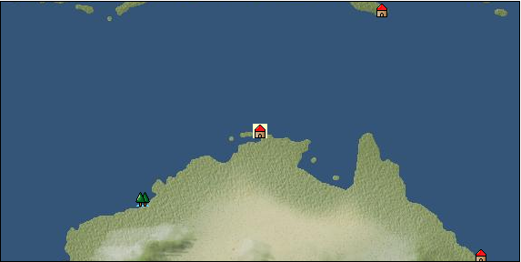

# Port: カカドゥ

import Tabs from '@theme/Tabs';
import TabItem from '@theme/TabItem';

## General Information

| Attribute | Details |
| :--- | :--- |
| **Port Name** | kakadu |
| **Port Type** | port of alliance |
| **Region** | Oceania |
| **Sea Area** | Arafura Sea |
| **Required Language** | Oceanian languages |
| **Coordinates** | （6332，5700） |
| **Investment Reward** | [Oceania costume sewing method](docs/Items/RecipeBooks/item_2280.md) （必要投資額：2,120,000ドゥカード） |

### Available Facilities

| guild | intermediary | exchange | tool shop | workshop craftsman | Painter | sculptor | peddler |
| --- | --- | --- | --- | --- | --- | --- | --- |
|   |   | ○ | ○ |   |   |   |   |
| Shipyard Master | Lumbermaker | Sail-maker | weapon craftsman | master | TavernFemale | archive | salesperson |
| --- | --- | --- | --- | --- | --- | --- | --- |
|   |   |   |   | ○ |   |   |   |
| Shipwright | 銀行 | street worker | 王宮 | Trading post | church | suburbs | translator |
| --- | --- | --- | --- | --- | --- | --- | --- |
| ○ | ○ | ○ |   |   |   |   |   |

### Description
A city located on the north coast of Australia. The name comes from the ethnic name called Gagju. The area is surrounded by wetlands and is home to a wide variety of flora and fauna. Additionally, many murals can be seen around Kakadu, suggesting that people have lived here for a long time. Cultural area: Oceania

<Tabs>
  <TabItem value="trade_goods_sales" label="Trade Goods Sales">

| item | group | purchase price | 同盟時 | remarks |
| --- | --- | --- | --- | --- |
| [tea tree](docs/Items/TradeGoods/TradeGoods-Medicine/item_2283.md) | [Trading products (medical products)](docs/Categories/category_6.md) | 516 | (452) |  |
| [peridot](docs/Items/TradeGoods/TradeGoods-Gems/item_1098.md) | [Trading Items (Gemstones)](docs/Categories/category_15.md) | (1,437) | 1,258 |  |
| 要投資（必要投資額：180,000） |
| [bauxite](docs/Items/TradeGoods/TradeGoods-Minerals/item_5160.md) | [Trading Items (Iron Stone)](docs/Categories/category_7.md) | 2,580 | (2,258) |  |
| 要投資（必要投資額：8,500,000） |
| [macadamia nuts](docs/Items/TradeGoods/TradeGoods-Sunddries/item_2282.md) | [Trading goods (hobby goods)](docs/Categories/category_10.md) | 379 | (332) |  |
| [mimosa](docs/Items/TradeGoods/TradeGoods-Dye/item_2281.md) | [Trading Goods (Dye)](docs/Categories/category_2.md) | 483 | (423) |  |
| [eucalyptus](docs/Items/TradeGoods/TradeGoods-Perfume/item_2278.md) | [Trading Goods (Spices)](docs/Categories/category_11.md) | (374) | 328 |  |
| It is a specialty product |
| [crocodile meat](docs/Items/TradeGoods/TradeGoods-Foodstuffs/item_2284.md) | [Trading items (food items)](docs/Categories/category_3.md) | 488 | (427) |  |
| [leather](docs/Items/TradeGoods/TradeGoods-Fibers/item_44.md) | [交易品（繊維）](docs/Categories/category_1.md) | 424 | (371) |  |
  </TabItem>
  <TabItem value="sale_specialty" label="Sale (Specialty)">

| item | group | sale price | 同盟時 | remarks |
| --- | --- | --- | --- | --- |

#### [交易品（繊維）](docs/Categories/category_1.md)

| [feather](docs/Items/TradeGoods/TradeGoods-Fibers/item_585.md) | 交易品（繊維） | 1,076 | (1,210) |  |

#### [Trading Goods (Dye)](docs/Categories/category_2.md)

| [Indian indigo](docs/Items/TradeGoods/TradeGoods-Dye/item_157.md) | Trading Goods (Dye) | 670 | (753) |  |

#### [Trading items (food items)](docs/Categories/category_3.md)

| [taro](docs/Items/TradeGoods/TradeGoods-Foodstuffs/item_1960.md) | Trading items (food items) | 96 | (108) |  |

#### [交易品（調味料）](docs/Categories/category_4.md)

| [Nyoc mam](docs/Items/TradeGoods/TradeGoods-Seasonings/item_1971.md) | 交易品（調味料） | 269 | (302) |  |

#### [交易品（雑貨）](docs/Categories/category_5.md)

| [rattan work](docs/Items/TradeGoods/TradeGoods-Misc/item_3698.md) | 交易品（雑貨） | 5,089 | (5,725) |  |

#### [Trading products (medical products)](docs/Categories/category_6.md)

| [Saikaku](docs/Items/TradeGoods/TradeGoods-Medicine/item_1959.md) | Trading products (medical products) | 2,165 | (2,435) |  |
| [Noni](docs/Items/TradeGoods/TradeGoods-Medicine/item_2099.md) | Trading products (medical products) | 608 | (684) |  |

#### [Trading goods (hobby goods)](docs/Categories/category_10.md)

| [tobacco](docs/Items/TradeGoods/TradeGoods-Sunddries/item_109.md) | Trading goods (hobby goods) | 1,613 | (1,814) |  |
| [banana](docs/Items/TradeGoods/TradeGoods-Sunddries/item_1947.md) | Trading goods (hobby goods) | 173 | (194) |  |
| [prune](docs/Items/TradeGoods/TradeGoods-Sunddries/item_523.md) | Trading goods (hobby goods) | 792 | (891) |  |
| [mango](docs/Items/TradeGoods/TradeGoods-Sunddries/item_2095.md) | Trading goods (hobby goods) | 430 | (483) |  |
| [dried figs](docs/Items/TradeGoods/TradeGoods-Sunddries/item_611.md) | Trading goods (hobby goods) | 582 | (654) |  |
| [dried apple](docs/Items/TradeGoods/TradeGoods-Sunddries/item_19.md) | Trading goods (hobby goods) | 662 | (744) |  |
| [black tea](docs/Items/TradeGoods/TradeGoods-Sunddries/item_675.md) | Trading goods (hobby goods) | 1,012 | (1,138) |  |

#### [Trading Goods (Spices)](docs/Categories/category_11.md)

| [jasmine](docs/Items/TradeGoods/TradeGoods-Perfume/item_772.md) | Trading Goods (Spices) | 4,155 | (4,674) |  |
| [patchouli](docs/Items/TradeGoods/TradeGoods-Perfume/item_1963.md) | Trading Goods (Spices) | 1,603 | (1,803) |  |
| [mastic](docs/Items/TradeGoods/TradeGoods-Perfume/item_680.md) | Trading Goods (Spices) | 1,718 | (1,932) |  |
| [benzoin](docs/Items/TradeGoods/TradeGoods-Perfume/item_1962.md) | Trading Goods (Spices) | 1,008 | (1,134) |  |
| [sandalwood](docs/Items/TradeGoods/TradeGoods-Perfume/item_771.md) | Trading Goods (Spices) | 1,879 | (2,114) |  |
| [龍脳](docs/Items/TradeGoods/TradeGoods-Perfume/item_1676.md) | Trading Goods (Spices) | 1,400 | (1,575) |  |

#### [Trading Goods (Spices)](docs/Categories/category_12.md)

| [cloves](docs/Items/TradeGoods/TradeGoods-Spices/item_1092.md) | Trading Goods (Spices) | 557 | (626) |  |
| [pepper](docs/Items/TradeGoods/TradeGoods-Spices/item_58.md) | Trading Goods (Spices) | 565 | (635) |  |
| [saffron](docs/Items/TradeGoods/TradeGoods-Spices/item_845.md) | Trading Goods (Spices) | 4,572 | (5,144) |  |
| [cinnamon](docs/Items/TradeGoods/TradeGoods-Spices/item_1432.md) | Trading Goods (Spices) | 506 | (569) |  |
| [star anise](docs/Items/TradeGoods/TradeGoods-Spices/item_3908.md) | Trading Goods (Spices) | (4,519) | 5,273 |  |
| [nutmeg](docs/Items/TradeGoods/TradeGoods-Spices/item_1969.md) | Trading Goods (Spices) | 576 | (648) |  |
| [mace](docs/Items/TradeGoods/TradeGoods-Spices/item_2100.md) | Trading Goods (Spices) | 733 | (824) |  |

#### [Trading goods (artificial goods)](docs/Categories/category_13.md)

| [Tumbaga](docs/Items/TradeGoods/TradeGoods-Luxuries/item_3028.md) | Trading goods (artificial goods) | 11,663 | (13,122) |  |

#### [Trading Items (Gemstones)](docs/Categories/category_15.md)

| [jade](docs/Items/TradeGoods/TradeGoods-Gems/item_2015.md) | Trading Items (Gemstones) | 2,418 | (2,720) |  |
| [Tortoiseshell](docs/Items/TradeGoods/TradeGoods-Gems/item_1980.md) | Trading Items (Gemstones) | 1,660 | (1,867) |  |
| [opal](docs/Items/TradeGoods/TradeGoods-Gems/item_2006.md) | Trading Items (Gemstones) | 6,837 | (7,692) |  |
| [sapphire](docs/Items/TradeGoods/TradeGoods-Gems/item_676.md) | Trading Items (Gemstones) | 4,307 | (4,845) |  |
| [diamond](docs/Items/TradeGoods/TradeGoods-Gems/item_449.md) | Trading Items (Gemstones) | 4,600 | (5,175) |  |

#### [Trading Items (Firearms)](docs/Categories/category_17.md)

| [musket gun](docs/Items/TradeGoods/TradeGoods-Firearms/item_584.md) | Trading Items (Firearms) | 4,549 | (5,118) |  |

#### [交易品（織物）](docs/Categories/category_20.md)

| [indian chintz](docs/Items/TradeGoods/TradeGoods-Fabrics/item_159.md) | 交易品（織物） | 1,537 | (1,729) |  |
| [java chintz](docs/Items/TradeGoods/TradeGoods-Fabrics/item_1970.md) | 交易品（織物） | 837 | (941) |  |
| [taffeta](docs/Items/TradeGoods/TradeGoods-Fabrics/item_1001.md) | 交易品（織物） | 3,267 | (3,675) |  |
| [velvet](docs/Items/TradeGoods/TradeGoods-Fabrics/item_902.md) | 交易品（織物） | (5,462) | 6,373 |  |
  </TabItem>
  <TabItem value="sale_no_specialty" label="Sale (No Specialty)">

| item | group | sale price | 同盟時 | remarks |
| --- | --- | --- | --- | --- |

#### [交易品（繊維）](docs/Categories/category_1.md)

| [fur](docs/Items/TradeGoods/TradeGoods-Fibers/item_634.md) | 交易品（繊維） | 1,265 | (1,423) |  |
| [raw silk](docs/Items/TradeGoods/TradeGoods-Fibers/item_677.md) | 交易品（繊維） | 2,392 | (2,691) |  |
| [cotton](docs/Items/TradeGoods/TradeGoods-Fibers/item_610.md) | 交易品（繊維） | 672 | (756) |  |
| [numb](docs/Items/TradeGoods/TradeGoods-Fibers/item_900.md) | 交易品（繊維） | (11) | 12 |  |

#### [Trading Goods (Dye)](docs/Categories/category_2.md)

| [pomegranate](docs/Items/TradeGoods/TradeGoods-Dye/item_907.md) | Trading Goods (Dye) | 465 | (523) |  |

#### [Trading items (food items)](docs/Categories/category_3.md)

| [fava beans](docs/Items/TradeGoods/TradeGoods-Foodstuffs/item_102.md) | Trading items (food items) | 130 | (146) |  |
| [kangaroo meat](docs/Items/TradeGoods/TradeGoods-Foodstuffs/item_2285.md) | Trading items (food items) | 342 | 342 |  |
| [sugar cane](docs/Items/TradeGoods/TradeGoods-Foodstuffs/item_93.md) | Trading items (food items) | 471 | (529) |  |
| [bacon](docs/Items/TradeGoods/TradeGoods-Foodstuffs/item_566.md) | Trading items (food items) | 527 | (592) |  |
| [Paddy rice](docs/Items/TradeGoods/TradeGoods-Foodstuffs/item_654.md) | Trading items (food items) | 100 | (112) |  |
| [魚肉](docs/Items/TradeGoods/TradeGoods-Foodstuffs/item_10.md) | Trading items (food items) | 200 | (225) |  |

#### [交易品（調味料）](docs/Categories/category_4.md)

| [anchovies](docs/Items/TradeGoods/TradeGoods-Seasonings/item_3004.md) | 交易品（調味料） | (138) | 161 |  |
| [lard](docs/Items/TradeGoods/TradeGoods-Seasonings/item_43.md) | 交易品（調味料） | 265 | (298) |  |
| [salt](docs/Items/TradeGoods/TradeGoods-Seasonings/item_42.md) | 交易品（調味料） | 268 | (301) |  |
| [Honey](docs/Items/TradeGoods/TradeGoods-Seasonings/item_49.md) | 交易品（調味料） | 914 | (1,028) |  |

#### [交易品（雑貨）](docs/Categories/category_5.md)

| [Western books](docs/Items/TradeGoods/TradeGoods-Misc/item_293.md) | 交易品（雑貨） | 520 | (585) |  |

#### [Trading products (medical products)](docs/Categories/category_6.md)

| [senna](docs/Items/TradeGoods/TradeGoods-Medicine/item_155.md) | Trading products (medical products) | 421 | (473) |  |
| [Maca](docs/Items/TradeGoods/TradeGoods-Medicine/item_3000.md) | Trading products (medical products) | 899 | (1,011) |  |

#### [Trading Items (Iron Stone)](docs/Categories/category_7.md)

| [iron ore](docs/Items/TradeGoods/TradeGoods-Minerals/item_146.md) | Trading Items (Iron Stone) | (560) | 653 |  |

#### [Trading products (precious metals)](docs/Categories/category_8.md)

| [gold](docs/Items/TradeGoods/TradeGoods-Metals/item_659.md) | Trading products (precious metals) | 4,760 | 5,113 |  |
| [silver](docs/Items/TradeGoods/TradeGoods-Metals/item_136.md) | Trading products (precious metals) | 2,778 | (3,125) |  |

#### [Trading goods (hobby goods)](docs/Categories/category_10.md)

| [coffee](docs/Items/TradeGoods/TradeGoods-Sunddries/item_445.md) | Trading goods (hobby goods) | 489 | (550) |  |
| [Yerba mate tea](docs/Items/TradeGoods/TradeGoods-Sunddries/item_1808.md) | Trading goods (hobby goods) | 399 | (448) |  |
| [lemon myrtle](docs/Items/TradeGoods/TradeGoods-Sunddries/item_2840.md) | Trading goods (hobby goods) | 585 | (658) |  |

#### [Trading Goods (Spices)](docs/Categories/category_11.md)

| [agarwood](docs/Items/TradeGoods/TradeGoods-Perfume/item_1058.md) | Trading Goods (Spices) | 1,902 | (2,139) |  |

#### [Trading goods (artificial goods)](docs/Categories/category_13.md)

| [embroidery thread](docs/Items/TradeGoods/TradeGoods-Luxuries/item_898.md) | Trading goods (artificial goods) | (1,890) | 2,205 |  |
| [皮革製品](docs/Items/TradeGoods/TradeGoods-Luxuries/item_12.md) | Trading goods (artificial goods) | 1,260 | (1,417) |  |
| [goldsmith](docs/Items/TradeGoods/TradeGoods-Luxuries/item_687.md) | Trading goods (artificial goods) | 3,432 | (3,861) |  |
| [silversmith](docs/Items/TradeGoods/TradeGoods-Luxuries/item_619.md) | Trading goods (artificial goods) | 3,000 | (3,375) |  |
| [leather thong](docs/Items/TradeGoods/TradeGoods-Luxuries/item_623.md) | Trading goods (artificial goods) | 387 | (435) |  |

#### [交易品（美術品）](docs/Categories/category_14.md)

| [wooden statue](docs/Items/TradeGoods/TradeGoods-Art/item_95.md) | 交易品（美術品） | 1,132 | (1,273) |  |

#### [Trading Items (Gemstones)](docs/Categories/category_15.md)

| [coral](docs/Items/TradeGoods/TradeGoods-Gems/item_141.md) | Trading Items (Gemstones) | (2,983) | 3,480 |  |
| When in alliance: confirmed at 100% |
| [nephrite](docs/Items/TradeGoods/TradeGoods-Gems/item_2314.md) | Trading Items (Gemstones) | 1,586 | (1,784) |  |
| [pink diamond](docs/Items/TradeGoods/TradeGoods-Gems/item_2874.md) | Trading Items (Gemstones) | 3,390 | (3,814) |  |
| [ruby](docs/Items/TradeGoods/TradeGoods-Gems/item_773.md) | Trading Items (Gemstones) | 5,466 | (6,149) |  |
| [pearl](docs/Items/TradeGoods/TradeGoods-Gems/item_769.md) | Trading Items (Gemstones) | 5,177 | (5,824) |  |
| [ivory](docs/Items/TradeGoods/TradeGoods-Gems/item_699.md) | Trading Items (Gemstones) | 2,151 | (2,420) |  |

#### [Trading Items (Firearms)](docs/Categories/category_17.md)

| [arquebus gun](docs/Items/TradeGoods/TradeGoods-Firearms/item_14.md) | Trading Items (Firearms) | (1,432) | 1,670 |  |
| [大砲](docs/Items/TradeGoods/TradeGoods-Firearms/item_4.md) | Trading Items (Firearms) | (2,784) | 3,248 |  |
| [bullet](docs/Items/TradeGoods/TradeGoods-Firearms/item_13.md) | Trading Items (Firearms) | (631) | 736 |  |
| [cannonball](docs/Items/TradeGoods/TradeGoods-Firearms/item_144.md) | Trading Items (Firearms) | (1,258) | 1,467 |  |

#### [交易品（工業品）](docs/Categories/category_19.md)

| [wood](docs/Items/TradeGoods/TradeGoods-Wares/item_277.md) | 交易品（工業品） | 813 | (914) |  |
| [oil](docs/Items/TradeGoods/TradeGoods-Wares/item_613.md) | 交易品（工業品） | 508 | 508 |  |
| [coal](docs/Items/TradeGoods/TradeGoods-Wares/item_359.md) | 交易品（工業品） | 542 | (609) |  |
| [paper](docs/Items/TradeGoods/TradeGoods-Wares/item_625.md) | 交易品（工業品） | 208 | (234) |  |
| [iron material](docs/Items/TradeGoods/TradeGoods-Wares/item_268.md) | 交易品（工業品） | 882 | (992) |  |
| [銅](docs/Items/TradeGoods/TradeGoods-Wares/item_894.md) | 交易品（工業品） | 1,051 | (1,182) |  |

#### [交易品（織物）](docs/Categories/category_20.md)

| [satin](docs/Items/TradeGoods/TradeGoods-Fabrics/item_996.md) | 交易品（織物） | (1,892) | 2,207 |  |
| [georgette](docs/Items/TradeGoods/TradeGoods-Fabrics/item_1000.md) | 交易品（織物） | (1,984) | 2,315 |  |
| [silk fabric](docs/Items/TradeGoods/TradeGoods-Fabrics/item_823.md) | 交易品（織物） | (2,450) | 2,858 |  |
| [cotton fabric](docs/Items/TradeGoods/TradeGoods-Fabrics/item_571.md) | 交易品（織物） | 1,125 | (1,265) |  |
  </TabItem>
  <TabItem value="guild_&_others" label="Guild & Others">

| item | group | Sales price | Handling NPC | remarks |
| --- | --- | --- | --- | --- |
| There is no sales information for the item |
| --- |
  </TabItem>
  <TabItem value="toolman" label="Toolman">

| item | group | Sales price | Handling NPC | remarks |
| --- | --- | --- | --- | --- |

#### [Equipment (belongings)](docs/Categories/category_27.md)

| [木槍](docs/Items/Equipment/Equipment-Weapon/item_438.md) | Equipment (belongings) | 34,400 | tool shop owner |  |
| [hunter's spear](docs/Items/Equipment/Equipment-Weapon/item_655.md) | Equipment (belongings) | 38,700 | tool shop owner |  |

#### [Consumables (land battle/deck battle)](docs/Categories/category_29.md)

| [boomerang](docs/Items/Consumables/Consumables-Landbattle/item_454.md) | Consumables (land battle/deck battle) | 150 | tool shop owner |  |
| [strong adhesive oil](docs/Items/Consumables/Consumables-Landbattle/item_662.md) | Consumables (land battle/deck battle) | 200 | tool shop owner |  |
| [catapult](docs/Items/Consumables/Consumables-Landbattle/item_311.md) | Consumables (land battle/deck battle) | 30 | tool shop owner |  |
| [Assortment of therapeutic drugs](docs/Items/Consumables/Consumables-Landbattle/item_564.md) | Consumables (land battle/deck battle) | 900 | tool shop owner |  |
| [secret cure](docs/Items/Consumables/Consumables-Landbattle/item_563.md) | Consumables (land battle/deck battle) | 600 | tool shop owner |  |

#### [Consumables (skill activation)](docs/Categories/category_31.md)

| [fishing gear](docs/Items/Consumables/Consumables-Skill/item_79.md) | Consumables (skill activation) | 2,500 | tool shop owner |  |

#### [Consumables (request documents)](docs/Categories/category_45.md)

| [Pharmaceutical purchase order](docs/Items/Consumables/Consumables-Documents/item_4924.md) | Consumables (request documents) | 20,000 | tool shop owner |  |
  </TabItem>
  <TabItem value="Tavern Master" label="Tavern Master">

| item | group | Sales price | Handling NPC | remarks |
| --- | --- | --- | --- | --- |

#### [recipe book](docs/Categories/category_22.md)

| [Oceania traditional cuisine collection](docs/Items/RecipeBooks/item_2286.md) | recipe book | Fixed recipe | Tavern Master |  |
| Fixed recipe |
  </TabItem>
</Tabs>