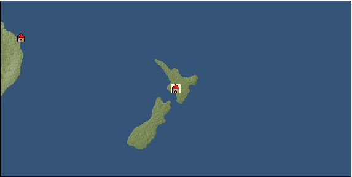

# Port: ワンガヌイ

import Tabs from '@theme/Tabs';
import TabItem from '@theme/TabItem';

## General Information

| Attribute | Details |
| :--- | :--- |
| **Port Name** | Whanganui |
| **Port Type** | port of alliance |
| **Region** | Oceania |
| **Sea Area** | tasman sea |
| **Required Language** | Oceanian languages |
| **Coordinates** | （8312，6582） |
| **Investment Reward** | [Oceania costume sewing method](docs/Items/RecipeBooks/item_2280.md) （必要投資額：2,120,000ドゥカード） |

### Available Facilities

| guild | intermediary | exchange | tool shop | workshop craftsman | Painter | sculptor | peddler |
| --- | --- | --- | --- | --- | --- | --- | --- |
|   |   | ○ | ○ |   |   |   |   |
| Shipyard Master | Lumbermaker | Sail-maker | weapon craftsman | master | TavernFemale | archive | salesperson |
| --- | --- | --- | --- | --- | --- | --- | --- |
|   |   |   |   | ○ |   |   |   |
| Shipwright | 銀行 | street worker | 王宮 | Trading post | church | suburbs | translator |
| --- | --- | --- | --- | --- | --- | --- | --- |
| ○ | ○ | ○ |   |   |   | ○ |   |

### Description
A town located on the southern coast of Aotearoa. It has been inhabited by Maori people since ancient times and was a trading hub. Whanganui is a Maori word meaning "big harbor". Suburbs: Whanganui West Cultural Area: Oceania

<Tabs>
  <TabItem value="trade_goods_sales" label="Trade Goods Sales">

| item | group | purchase price | 同盟時 | remarks |
| --- | --- | --- | --- | --- |
| [sweet potato](docs/Items/TradeGoods/TradeGoods-Foodstuffs/item_1931.md) | [Trading items (food items)](docs/Categories/category_3.md) | 76 | (67) |  |
| [taro](docs/Items/TradeGoods/TradeGoods-Foodstuffs/item_1960.md) | [Trading items (food items)](docs/Categories/category_3.md) | 77 | (68) |  |
| [nephrite](docs/Items/TradeGoods/TradeGoods-Gems/item_2314.md) | [Trading Items (Gemstones)](docs/Categories/category_15.md) | 1,115 | (976) |  |
| 要投資（必要投資額：320,000） |
| [wood](docs/Items/TradeGoods/TradeGoods-Wares/item_277.md) | [交易品（工業品）](docs/Categories/category_19.md) | 675 | (591) |  |
| [fur](docs/Items/TradeGoods/TradeGoods-Fibers/item_634.md) | [交易品（繊維）](docs/Categories/category_1.md) | 1,294 | (1,133) |  |
| [Honey](docs/Items/TradeGoods/TradeGoods-Seasonings/item_49.md) | [交易品（調味料）](docs/Categories/category_4.md) | 876 | 768 |  |
  </TabItem>
  <TabItem value="sale_specialty" label="Sale (Specialty)">

| item | group | sale price | 同盟時 | remarks |
| --- | --- | --- | --- | --- |

#### [交易品（繊維）](docs/Categories/category_1.md)

| [feather](docs/Items/TradeGoods/TradeGoods-Fibers/item_585.md) | 交易品（繊維） | 904 | (1,017) |  |
| [Green ramie](docs/Items/TradeGoods/TradeGoods-Fibers/item_3428.md) | 交易品（繊維） | 4,966 | (5,587) |  |
| [deerskin](docs/Items/TradeGoods/TradeGoods-Fibers/item_3648.md) | 交易品（繊維） | 4,596 | (5,171) |  |

#### [Trading Goods (Dye)](docs/Categories/category_2.md)

| [Shorou](docs/Items/TradeGoods/TradeGoods-Dye/item_3691.md) | Trading Goods (Dye) | 5,179 | (5,826) |  |

#### [交易品（調味料）](docs/Categories/category_4.md)

| [black vinegar](docs/Items/TradeGoods/TradeGoods-Seasonings/item_3475.md) | 交易品（調味料） | (1,833) | 2,138 |  |

#### [交易品（雑貨）](docs/Categories/category_5.md)

| [rattan work](docs/Items/TradeGoods/TradeGoods-Misc/item_3698.md) | 交易品（雑貨） | 5,067 | (5,700) |  |

#### [Trading products (medical products)](docs/Categories/category_6.md)

| [Saikaku](docs/Items/TradeGoods/TradeGoods-Medicine/item_1959.md) | Trading products (medical products) | 1,984 | (2,232) |  |

#### [Trading products (precious metals)](docs/Categories/category_8.md)

| [platinum](docs/Items/TradeGoods/TradeGoods-Metals/item_2178.md) | Trading products (precious metals) | (4,849) | 5,658 |  |
| [Jinguashijin](docs/Items/TradeGoods/TradeGoods-Metals/item_3693.md) | Trading products (precious metals) | 517 | (581) |  |

#### [Trading goods (hobby goods)](docs/Categories/category_10.md)

| [cashew nuts](docs/Items/TradeGoods/TradeGoods-Sunddries/item_2120.md) | Trading goods (hobby goods) | 1,006 | 1,117 |  |
| [tobacco](docs/Items/TradeGoods/TradeGoods-Sunddries/item_109.md) | Trading goods (hobby goods) | 1,533 | (1,724) |  |
| [eggplant](docs/Items/TradeGoods/TradeGoods-Sunddries/item_3426.md) | Trading goods (hobby goods) | 5,175 | (5,822) |  |
| [banana](docs/Items/TradeGoods/TradeGoods-Sunddries/item_1947.md) | Trading goods (hobby goods) | 175 | (196) |  |
| [prune](docs/Items/TradeGoods/TradeGoods-Sunddries/item_523.md) | Trading goods (hobby goods) | 811 | (912) |  |
| [dried figs](docs/Items/TradeGoods/TradeGoods-Sunddries/item_611.md) | Trading goods (hobby goods) | 552 | (621) |  |
| [dried apple](docs/Items/TradeGoods/TradeGoods-Sunddries/item_19.md) | Trading goods (hobby goods) | 606 | (681) |  |

#### [Trading Goods (Spices)](docs/Categories/category_11.md)

| [Hamanasu](docs/Items/TradeGoods/TradeGoods-Perfume/item_3692.md) | Trading Goods (Spices) | 5,319 | (5,984) |  |
| [patchouli](docs/Items/TradeGoods/TradeGoods-Perfume/item_1963.md) | Trading Goods (Spices) | 1,631 | (1,835) |  |
| [龍脳](docs/Items/TradeGoods/TradeGoods-Perfume/item_1676.md) | Trading Goods (Spices) | 1,397 | (1,571) |  |

#### [Trading Goods (Spices)](docs/Categories/category_12.md)

| [cloves](docs/Items/TradeGoods/TradeGoods-Spices/item_1092.md) | Trading Goods (Spices) | 580 | (652) |  |
| [star anise](docs/Items/TradeGoods/TradeGoods-Spices/item_3908.md) | Trading Goods (Spices) | 4,864 | (5,472) |  |
| [nutmeg](docs/Items/TradeGoods/TradeGoods-Spices/item_1969.md) | Trading Goods (Spices) | 566 | (636) |  |
| [mace](docs/Items/TradeGoods/TradeGoods-Spices/item_2100.md) | Trading Goods (Spices) | 777 | (874) |  |
| [chili pepper](docs/Items/TradeGoods/TradeGoods-Spices/item_1831.md) | Trading Goods (Spices) | 555 | 682 |  |
| [Grapefruit](docs/Items/TradeGoods/TradeGoods-Spices/item_3422.md) | Trading Goods (Spices) | 4,460 | (5,017) |  |
| [green chili pepper](docs/Items/TradeGoods/TradeGoods-Spices/item_1990.md) | Trading Goods (Spices) | 1,174 | (1,320) |  |

#### [Trading goods (artificial goods)](docs/Categories/category_13.md)

| [Tumbaga](docs/Items/TradeGoods/TradeGoods-Luxuries/item_3028.md) | Trading goods (artificial goods) | 10,094 | (11,356) |  |

#### [Trading Items (Gemstones)](docs/Categories/category_15.md)

| [Tortoiseshell](docs/Items/TradeGoods/TradeGoods-Gems/item_1980.md) | Trading Items (Gemstones) | 1,585 | (1,783) |  |
| [alexandrite](docs/Items/TradeGoods/TradeGoods-Gems/item_4429.md) | Trading Items (Gemstones) | (11,927) | 13,917 |  |
| [inca rose](docs/Items/TradeGoods/TradeGoods-Gems/item_3014.md) | Trading Items (Gemstones) | 10,613 | (11,940) |  |
| [opal](docs/Items/TradeGoods/TradeGoods-Gems/item_2006.md) | Trading Items (Gemstones) | 6,960 | (7,830) |  |
| [diamond](docs/Items/TradeGoods/TradeGoods-Gems/item_449.md) | Trading Items (Gemstones) | 5,303 | (5,966) |  |
| [ruby](docs/Items/TradeGoods/TradeGoods-Gems/item_773.md) | Trading Items (Gemstones) | 4,845 | (5,451) |  |
| [amethyst](docs/Items/TradeGoods/TradeGoods-Gems/item_3434.md) | Trading Items (Gemstones) | 5,372 | 5,372 |  |

#### [Trading Items (Firearms)](docs/Categories/category_17.md)

| [musket gun](docs/Items/TradeGoods/TradeGoods-Firearms/item_584.md) | Trading Items (Firearms) | (4,477) | 5,223 |  |
| [tanegashima gun](docs/Items/TradeGoods/TradeGoods-Firearms/item_3423.md) | Trading Items (Firearms) | 4,500 | (5,062) |  |

#### [Trading Goods (Livestock)](docs/Categories/category_18.md)

| [boar](docs/Items/TradeGoods/TradeGoods-Livestock/item_3476.md) | Trading Goods (Livestock) | 5,148 | (5,792) |  |

#### [交易品（工業品）](docs/Categories/category_19.md)

| [paint](docs/Items/TradeGoods/TradeGoods-Wares/item_3411.md) | 交易品（工業品） | 1,100 | (1,237) |  |

#### [交易品（織物）](docs/Categories/category_20.md)

| [Awaiyo](docs/Items/TradeGoods/TradeGoods-Fabrics/item_3002.md) | 交易品（織物） | (3,400) | 3,967 |  |
| [taffeta](docs/Items/TradeGoods/TradeGoods-Fabrics/item_1001.md) | 交易品（織物） | 2,734 | (3,076) |  |
  </TabItem>
  <TabItem value="sale_no_specialty" label="Sale (No Specialty)">

| item | group | sale price | 同盟時 | remarks |
| --- | --- | --- | --- | --- |

#### [交易品（繊維）](docs/Categories/category_1.md)

| [raw silk](docs/Items/TradeGoods/TradeGoods-Fibers/item_677.md) | 交易品（繊維） | 2,439 | (2,744) |  |
| [leather](docs/Items/TradeGoods/TradeGoods-Fibers/item_44.md) | 交易品（繊維） | 438 | (492) |  |
| [cotton](docs/Items/TradeGoods/TradeGoods-Fibers/item_610.md) | 交易品（繊維） | 688 | (774) |  |
| [numb](docs/Items/TradeGoods/TradeGoods-Fibers/item_900.md) | 交易品（繊維） | 12 | (13) |  |

#### [Trading Goods (Dye)](docs/Categories/category_2.md)

| [Gerep](docs/Items/TradeGoods/TradeGoods-Dye/item_1814.md) | Trading Goods (Dye) | (804) | 937 |  |
| [mimosa](docs/Items/TradeGoods/TradeGoods-Dye/item_2281.md) | Trading Goods (Dye) | 505 | (568) |  |

#### [Trading items (food items)](docs/Categories/category_3.md)

| [fava beans](docs/Items/TradeGoods/TradeGoods-Foodstuffs/item_102.md) | Trading items (food items) | 131 | (147) |  |
| [Quinoa](docs/Items/TradeGoods/TradeGoods-Foodstuffs/item_2994.md) | Trading items (food items) | (207) | 241 |  |
| [sugar cane](docs/Items/TradeGoods/TradeGoods-Foodstuffs/item_93.md) | Trading items (food items) | 470 | (528) |  |
| [ham](docs/Items/TradeGoods/TradeGoods-Foodstuffs/item_290.md) | Trading items (food items) | 593 | (667) |  |
| [bacon](docs/Items/TradeGoods/TradeGoods-Foodstuffs/item_566.md) | Trading items (food items) | 527 | (592) |  |
| [milk](docs/Items/TradeGoods/TradeGoods-Foodstuffs/item_254.md) | Trading items (food items) | 148 | (166) |  |
| [egg](docs/Items/TradeGoods/TradeGoods-Foodstuffs/item_40.md) | Trading items (food items) | 33 | (37) |  |
| [soybeans](docs/Items/TradeGoods/TradeGoods-Foodstuffs/item_1958.md) | Trading items (food items) | 102 | (114) |  |
| [Paddy rice](docs/Items/TradeGoods/TradeGoods-Foodstuffs/item_654.md) | Trading items (food items) | 101 | (113) |  |
| [beef](docs/Items/TradeGoods/TradeGoods-Foodstuffs/item_26.md) | Trading items (food items) | 773 | (869) |  |
| [pork](docs/Items/TradeGoods/TradeGoods-Foodstuffs/item_41.md) | Trading items (food items) | 516 | (580) |  |

#### [交易品（調味料）](docs/Categories/category_4.md)

| [anchovies](docs/Items/TradeGoods/TradeGoods-Seasonings/item_3004.md) | 交易品（調味料） | 161 | (181) |  |
| [lard](docs/Items/TradeGoods/TradeGoods-Seasonings/item_43.md) | 交易品（調味料） | 264 | (297) |  |
| [salt](docs/Items/TradeGoods/TradeGoods-Seasonings/item_42.md) | 交易品（調味料） | 262 | (294) |  |
| [Honey](docs/Items/TradeGoods/TradeGoods-Seasonings/item_49.md) | 交易品（調味料） | 330 | (371) |  |

#### [交易品（雑貨）](docs/Categories/category_5.md)

| [Western books](docs/Items/TradeGoods/TradeGoods-Misc/item_293.md) | 交易品（雑貨） | 555 | (624) |  |

#### [Trading products (medical products)](docs/Categories/category_6.md)

| [tea tree](docs/Items/TradeGoods/TradeGoods-Medicine/item_2283.md) | Trading products (medical products) | 497 | (559) |  |
| [Maca](docs/Items/TradeGoods/TradeGoods-Medicine/item_3000.md) | Trading products (medical products) | (844) | 984 |  |

#### [Trading Items (Iron Stone)](docs/Categories/category_7.md)

| [iron ore](docs/Items/TradeGoods/TradeGoods-Minerals/item_146.md) | Trading Items (Iron Stone) | 561 | (631) |  |
| [lead ore](docs/Items/TradeGoods/TradeGoods-Minerals/item_21.md) | Trading Items (Iron Stone) | 405 | (455) |  |
| [copper ore](docs/Items/TradeGoods/TradeGoods-Minerals/item_65.md) | Trading Items (Iron Stone) | 690 | (776) |  |

#### [Trading products (precious metals)](docs/Categories/category_8.md)

| [gold](docs/Items/TradeGoods/TradeGoods-Metals/item_659.md) | Trading products (precious metals) | 4,823 | (5,426) |  |
| [silver](docs/Items/TradeGoods/TradeGoods-Metals/item_136.md) | Trading products (precious metals) | (2,472) | 2,884 |  |

#### [Trading goods (hobby goods)](docs/Categories/category_10.md)

| [coffee](docs/Items/TradeGoods/TradeGoods-Sunddries/item_445.md) | Trading goods (hobby goods) | 489 | (550) |  |
| [macadamia nuts](docs/Items/TradeGoods/TradeGoods-Sunddries/item_2282.md) | Trading goods (hobby goods) | 385 | (433) |  |
| [Yerba mate tea](docs/Items/TradeGoods/TradeGoods-Sunddries/item_1808.md) | Trading goods (hobby goods) | 397 | (446) |  |
| [dried apricots](docs/Items/TradeGoods/TradeGoods-Sunddries/item_8.md) | Trading goods (hobby goods) | 384 | (432) |  |
| [dried strawberries](docs/Items/TradeGoods/TradeGoods-Sunddries/item_36.md) | Trading goods (hobby goods) | 336 | (378) |  |
| [dried mango](docs/Items/TradeGoods/TradeGoods-Sunddries/item_883.md) | Trading goods (hobby goods) | 389 | (437) |  |

#### [Trading Goods (Spices)](docs/Categories/category_11.md)

| [eucalyptus](docs/Items/TradeGoods/TradeGoods-Perfume/item_2278.md) | Trading Goods (Spices) | 351 | (394) |  |

#### [Trading goods (artificial goods)](docs/Categories/category_13.md)

| [皮革製品](docs/Items/TradeGoods/TradeGoods-Luxuries/item_12.md) | Trading goods (artificial goods) | 1,314 | (1,478) |  |
| [goldsmith](docs/Items/TradeGoods/TradeGoods-Luxuries/item_687.md) | Trading goods (artificial goods) | 3,506 | (3,944) |  |
| [silversmith](docs/Items/TradeGoods/TradeGoods-Luxuries/item_619.md) | Trading goods (artificial goods) | 3,042 | (3,422) |  |

#### [交易品（美術品）](docs/Categories/category_14.md)

| [wooden statue](docs/Items/TradeGoods/TradeGoods-Art/item_95.md) | 交易品（美術品） | 1,130 | (1,271) |  |

#### [Trading Items (Gemstones)](docs/Categories/category_15.md)

| [garnet](docs/Items/TradeGoods/TradeGoods-Gems/item_1005.md) | Trading Items (Gemstones) | 1,900 | (2,137) |  |
| [pink diamond](docs/Items/TradeGoods/TradeGoods-Gems/item_2874.md) | Trading Items (Gemstones) | 3,445 | (3,876) |  |

#### [Trading Goods (Livestock)](docs/Categories/category_18.md)

| [alpaca](docs/Items/TradeGoods/TradeGoods-Livestock/item_2995.md) | Trading Goods (Livestock) | (751) | 876 |  |

#### [交易品（工業品）](docs/Categories/category_19.md)

| [rubber](docs/Items/TradeGoods/TradeGoods-Wares/item_2819.md) | 交易品（工業品） | (1,051) | 1,226 |  |
| [wax](docs/Items/TradeGoods/TradeGoods-Wares/item_54.md) | 交易品（工業品） | 693 | (779) |  |
| [oil](docs/Items/TradeGoods/TradeGoods-Wares/item_613.md) | 交易品（工業品） | 437 | (491) |  |
| [paper](docs/Items/TradeGoods/TradeGoods-Wares/item_625.md) | 交易品（工業品） | 223 | (250) |  |
| [iron material](docs/Items/TradeGoods/TradeGoods-Wares/item_268.md) | 交易品（工業品） | 905 | (1,018) |  |
| [鉛](docs/Items/TradeGoods/TradeGoods-Wares/item_895.md) | 交易品（工業品） | 647 | (727) |  |
| [銅](docs/Items/TradeGoods/TradeGoods-Wares/item_894.md) | 交易品（工業品） | 968 | (1,089) |  |

#### [交易品（織物）](docs/Categories/category_20.md)

| [silk fabric](docs/Items/TradeGoods/TradeGoods-Fabrics/item_823.md) | 交易品（織物） | 2,843 | (3,198) |  |
| [cotton fabric](docs/Items/TradeGoods/TradeGoods-Fabrics/item_571.md) | 交易品（織物） | 1,167 | (1,313) |  |
  </TabItem>
  <TabItem value="guild_&_others" label="Guild & Others">

| item | group | Sales price | Handling NPC | remarks |
| --- | --- | --- | --- | --- |
| There is no sales information for the item |
| --- |
  </TabItem>
  <TabItem value="toolman" label="Toolman">

| item | group | Sales price | Handling NPC | remarks |
| --- | --- | --- | --- | --- |

#### [Equipment (belongings)](docs/Categories/category_27.md)

| [木槍](docs/Items/Equipment/Equipment-Weapon/item_438.md) | Equipment (belongings) | 34,400 | tool shop owner |  |
| [hunter's spear](docs/Items/Equipment/Equipment-Weapon/item_655.md) | Equipment (belongings) | 38,700 | tool shop owner |  |

#### [Consumables (land battle/deck battle)](docs/Categories/category_29.md)

| [boomerang](docs/Items/Consumables/Consumables-Landbattle/item_454.md) | Consumables (land battle/deck battle) | 150 | tool shop owner |  |
| [strong adhesive oil](docs/Items/Consumables/Consumables-Landbattle/item_662.md) | Consumables (land battle/deck battle) | 200 | tool shop owner |  |
| [catapult](docs/Items/Consumables/Consumables-Landbattle/item_311.md) | Consumables (land battle/deck battle) | 30 | tool shop owner |  |
| [Assortment of therapeutic drugs](docs/Items/Consumables/Consumables-Landbattle/item_564.md) | Consumables (land battle/deck battle) | 900 | tool shop owner |  |
| [secret cure](docs/Items/Consumables/Consumables-Landbattle/item_563.md) | Consumables (land battle/deck battle) | 600 | tool shop owner |  |

#### [Consumables (skill activation)](docs/Categories/category_31.md)

| [fishing gear](docs/Items/Consumables/Consumables-Skill/item_79.md) | Consumables (skill activation) | 2,500 | tool shop owner |  |
  </TabItem>
  <TabItem value="Tavern Master" label="Tavern Master">

| item | group | Sales price | Handling NPC | remarks |
| --- | --- | --- | --- | --- |

#### [recipe book](docs/Categories/category_22.md)

| [Oceania traditional cuisine collection](docs/Items/RecipeBooks/item_2286.md) | recipe book | Fixed recipe | Tavern Master |  |
| Fixed recipe |
  </TabItem>
</Tabs>