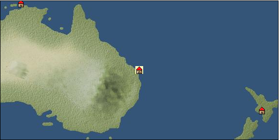

# Port: Kugari

import Tabs from '@theme/Tabs';
import TabItem from '@theme/TabItem';

## General Information

| Attribute | Details |
| :--- | :--- |
| **Port Name** | Kugari |
| **Port Type** | port of alliance |
| **Region** | Oceania |
| **Sea Area** | tasman sea |
| **Required Language** | Oceanian languages |
| **Coordinates** | （7303，6251） |
| **Investment Reward** | [Lot (NO.14)](docs/Items/Consumables/Consumables-Treasure-Chests/item_2901.md) （必要投資額：500,000ドゥカード） |

### Available Facilities

| guild | intermediary | exchange | tool shop | workshop craftsman | Painter | sculptor | peddler |
| --- | --- | --- | --- | --- | --- | --- | --- |
|   |   | ○ | ○ |   |   |   |   |
| Shipyard Master | Lumbermaker | Sail-maker | weapon craftsman | master | TavernFemale | archive | salesperson |
| --- | --- | --- | --- | --- | --- | --- | --- |
|   |   |   |   | ○ |   |   |   |
| Shipwright | 銀行 | street worker | 王宮 | Trading post | church | suburbs | translator |
| --- | --- | --- | --- | --- | --- | --- | --- |
| ○ | ○ |   |   |   |   |   |   |

### Description
A city located on the east coast of Australia. Means heaven in the indigenous language. With sandy beaches stretching 100km from north to south and the world's clearest lake in the forested interior, it is a place worthy of the name heaven. Cultural area: Oceania

<Tabs>
  <TabItem value="trade_goods_sales" label="Trade Goods Sales">

| Item | Group | Purchase Price | Allied Price | Remarks |
| --- | --- | --- | --- | --- |
| [coral](docs/Items/TradeGoods/TradeGoods-Gems/item_141.md) | [Trading Items (Gemstones)](docs/Categories/category_15.md) | 3,098 | (2,711) |  |
| [macadamia nuts](docs/Items/TradeGoods/TradeGoods-Sunddries/item_2282.md) | [Trading goods (hobby goods)](docs/Categories/category_10.md) | 379 | (332) |  |
| [eucalyptus](docs/Items/TradeGoods/TradeGoods-Perfume/item_2278.md) | [Trading Goods (Spices)](docs/Categories/category_11.md) | 374 | (328) |  |
| [lemon myrtle](docs/Items/TradeGoods/TradeGoods-Sunddries/item_2840.md) | [Trading goods (hobby goods)](docs/Categories/category_10.md) | 606 | (531) |  |
| [wood](docs/Items/TradeGoods/TradeGoods-Wares/item_277.md) | [交易品（工業品）](docs/Categories/category_19.md) | 675 | (591) |  |
| [coal](docs/Items/TradeGoods/TradeGoods-Wares/item_359.md) | [交易品（工業品）](docs/Categories/category_19.md) | 475 | (416) |  |
  </TabItem>
  <TabItem value="sale_specialty" label="Sale (Specialty)">

| Item | Group | sale price | Allied Price | Remarks |
| --- | --- | --- | --- | --- |

#### [交易品（繊維）](docs/Categories/category_1.md)

| [feather](docs/Items/TradeGoods/TradeGoods-Fibers/item_585.md) | 交易品（繊維） | 928 | (1,044) |  |
| [Green ramie](docs/Items/TradeGoods/TradeGoods-Fibers/item_3428.md) | 交易品（繊維） | 4,935 | (5,552) |  |
| [deerskin](docs/Items/TradeGoods/TradeGoods-Fibers/item_3648.md) | 交易品（繊維） | 4,600 | (5,175) |  |

#### [Trading Goods (Dye)](docs/Categories/category_2.md)

| [Shorou](docs/Items/TradeGoods/TradeGoods-Dye/item_3691.md) | Trading Goods (Dye) | 5,199 | (5,849) |  |

#### [交易品（雑貨）](docs/Categories/category_5.md)

| [rattan work](docs/Items/TradeGoods/TradeGoods-Misc/item_3698.md) | 交易品（雑貨） | 5,103 | (5,741) |  |

#### [Trading products (precious metals)](docs/Categories/category_8.md)

| [Jinguashijin](docs/Items/TradeGoods/TradeGoods-Metals/item_3693.md) | Trading products (precious metals) | 5,111 | (5,750) |  |

#### [Trading goods (hobby goods)](docs/Categories/category_10.md)

| [cashew nuts](docs/Items/TradeGoods/TradeGoods-Sunddries/item_2120.md) | Trading goods (hobby goods) | (986) | 1,150 |  |
| [tobacco](docs/Items/TradeGoods/TradeGoods-Sunddries/item_109.md) | Trading goods (hobby goods) | 1,862 | (2,094) |  |
| [eggplant](docs/Items/TradeGoods/TradeGoods-Sunddries/item_3426.md) | Trading goods (hobby goods) | 5,300 | (5,963) |  |

#### [Trading Goods (Spices)](docs/Categories/category_11.md)

| [Hamanasu](docs/Items/TradeGoods/TradeGoods-Perfume/item_3692.md) | Trading Goods (Spices) | 5,382 | (6,055) |  |

#### [Trading Goods (Spices)](docs/Categories/category_12.md)

| [cloves](docs/Items/TradeGoods/TradeGoods-Spices/item_1092.md) | Trading Goods (Spices) | 553 | (622) |  |
| [star anise](docs/Items/TradeGoods/TradeGoods-Spices/item_3908.md) | Trading Goods (Spices) | 4,929 | (5,545) |  |
| [nutmeg](docs/Items/TradeGoods/TradeGoods-Spices/item_1969.md) | Trading Goods (Spices) | 592 | (666) |  |
| [mace](docs/Items/TradeGoods/TradeGoods-Spices/item_2100.md) | Trading Goods (Spices) | 767 | (862) |  |
| [chili pepper](docs/Items/TradeGoods/TradeGoods-Spices/item_1831.md) | Trading Goods (Spices) | (561) | 654 |  |
| [Grapefruit](docs/Items/TradeGoods/TradeGoods-Spices/item_3422.md) | Trading Goods (Spices) | 4,495 | (5,057) |  |

#### [Trading goods (artificial goods)](docs/Categories/category_13.md)

| [Tumbaga](docs/Items/TradeGoods/TradeGoods-Luxuries/item_3028.md) | Trading goods (artificial goods) | 8,954 | (10,074) |  |

#### [Trading Items (Gemstones)](docs/Categories/category_15.md)

| [opal](docs/Items/TradeGoods/TradeGoods-Gems/item_2006.md) | Trading Items (Gemstones) | 7,092 | (7,979) |  |
| [diamond](docs/Items/TradeGoods/TradeGoods-Gems/item_449.md) | Trading Items (Gemstones) | 5,900 | (6,638) |  |
| [topaz](docs/Items/TradeGoods/TradeGoods-Gems/item_1097.md) | Trading Items (Gemstones) | 4,540 | (5,107) |  |

#### [Trading Items (Firearms)](docs/Categories/category_17.md)

| [musket gun](docs/Items/TradeGoods/TradeGoods-Firearms/item_584.md) | Trading Items (Firearms) | (4,243) | 4,950 |  |

#### [Trading Goods (Livestock)](docs/Categories/category_18.md)

| [boar](docs/Items/TradeGoods/TradeGoods-Livestock/item_3476.md) | Trading Goods (Livestock) | 4,410 | (4,961) |  |

#### [交易品（織物）](docs/Categories/category_20.md)

| [Awaiyo](docs/Items/TradeGoods/TradeGoods-Fabrics/item_3002.md) | 交易品（織物） | 3,970 | 4,319 |  |
| [taffeta](docs/Items/TradeGoods/TradeGoods-Fabrics/item_1001.md) | 交易品（織物） | 3,014 | (3,391) |  |
  </TabItem>
  <TabItem value="sale_no_specialty" label="Sale (No Specialty)">

| Item | Group | sale price | Allied Price | Remarks |
| --- | --- | --- | --- | --- |

#### [交易品（繊維）](docs/Categories/category_1.md)

| [fur](docs/Items/TradeGoods/TradeGoods-Fibers/item_634.md) | 交易品（繊維） | 1,265 | (1,423) |  |
| [raw silk](docs/Items/TradeGoods/TradeGoods-Fibers/item_677.md) | 交易品（繊維） | 2,379 | (2,676) |  |
| [leather](docs/Items/TradeGoods/TradeGoods-Fibers/item_44.md) | 交易品（繊維） | 432 | (486) |  |
| [cotton](docs/Items/TradeGoods/TradeGoods-Fibers/item_610.md) | 交易品（繊維） | 666 | (749) |  |
| [numb](docs/Items/TradeGoods/TradeGoods-Fibers/item_900.md) | 交易品（繊維） | (11) | 12 |  |

#### [Trading Goods (Dye)](docs/Categories/category_2.md)

| [Gerep](docs/Items/TradeGoods/TradeGoods-Dye/item_1814.md) | Trading Goods (Dye) | (800) | 933 |  |

#### [Trading items (food items)](docs/Categories/category_3.md)

| [fava beans](docs/Items/TradeGoods/TradeGoods-Foodstuffs/item_102.md) | Trading items (food items) | 130 | (146) |  |
| [kangaroo meat](docs/Items/TradeGoods/TradeGoods-Foodstuffs/item_2285.md) | Trading items (food items) | 343 | (385) |  |
| [Quinoa](docs/Items/TradeGoods/TradeGoods-Foodstuffs/item_2994.md) | Trading items (food items) | (207) | 241 |  |
| [sugar cane](docs/Items/TradeGoods/TradeGoods-Foodstuffs/item_93.md) | Trading items (food items) | 472 | (531) |  |
| [bacon](docs/Items/TradeGoods/TradeGoods-Foodstuffs/item_566.md) | Trading items (food items) | 528 | (594) |  |
| [milk](docs/Items/TradeGoods/TradeGoods-Foodstuffs/item_254.md) | Trading items (food items) | (127) | 148 |  |
| [egg](docs/Items/TradeGoods/TradeGoods-Foodstuffs/item_40.md) | Trading items (food items) | 34 | (38) |  |

#### [交易品（調味料）](docs/Categories/category_4.md)

| [anchovies](docs/Items/TradeGoods/TradeGoods-Seasonings/item_3004.md) | 交易品（調味料） | (138) | 161 |  |
| [lard](docs/Items/TradeGoods/TradeGoods-Seasonings/item_43.md) | 交易品（調味料） | 264 | (297) |  |
| [salt](docs/Items/TradeGoods/TradeGoods-Seasonings/item_42.md) | 交易品（調味料） | 268 | (301) |  |
| [Honey](docs/Items/TradeGoods/TradeGoods-Seasonings/item_49.md) | 交易品（調味料） | 1,028 | (1,156) |  |

#### [交易品（雑貨）](docs/Categories/category_5.md)

| [Western books](docs/Items/TradeGoods/TradeGoods-Misc/item_293.md) | 交易品（雑貨） | 521 | (586) |  |

#### [Trading products (medical products)](docs/Categories/category_6.md)

| [Maca](docs/Items/TradeGoods/TradeGoods-Medicine/item_3000.md) | Trading products (medical products) | (844) | 984 |  |

#### [Trading Items (Iron Stone)](docs/Categories/category_7.md)

| [iron ore](docs/Items/TradeGoods/TradeGoods-Minerals/item_146.md) | Trading Items (Iron Stone) | 561 | (631) |  |
| [copper ore](docs/Items/TradeGoods/TradeGoods-Minerals/item_65.md) | Trading Items (Iron Stone) | 800 | (900) |  |

#### [Trading products (precious metals)](docs/Categories/category_8.md)

| [gold](docs/Items/TradeGoods/TradeGoods-Metals/item_659.md) | Trading products (precious metals) | 5,114 | (5,753) |  |
| [silver](docs/Items/TradeGoods/TradeGoods-Metals/item_136.md) | Trading products (precious metals) | 2,683 | 2,880 |  |

#### [Trading goods (hobby goods)](docs/Categories/category_10.md)

| [coffee](docs/Items/TradeGoods/TradeGoods-Sunddries/item_445.md) | Trading goods (hobby goods) | 489 | (550) |  |
| [Yerba mate tea](docs/Items/TradeGoods/TradeGoods-Sunddries/item_1808.md) | Trading goods (hobby goods) | 396 | (445) |  |

#### [Trading goods (artificial goods)](docs/Categories/category_13.md)

| [皮革製品](docs/Items/TradeGoods/TradeGoods-Luxuries/item_12.md) | Trading goods (artificial goods) | 1,260 | (1,417) |  |
| [silversmith](docs/Items/TradeGoods/TradeGoods-Luxuries/item_619.md) | Trading goods (artificial goods) | 3,139 | (3,531) |  |
| [leather thong](docs/Items/TradeGoods/TradeGoods-Luxuries/item_623.md) | Trading goods (artificial goods) | 387 | (435) |  |

#### [交易品（美術品）](docs/Categories/category_14.md)

| [wooden statue](docs/Items/TradeGoods/TradeGoods-Art/item_95.md) | 交易品（美術品） | 1,114 | (1,253) |  |

#### [Trading Items (Gemstones)](docs/Categories/category_15.md)

| [nephrite](docs/Items/TradeGoods/TradeGoods-Gems/item_2314.md) | Trading Items (Gemstones) | 1,570 | (1,766) |  |
| [pink diamond](docs/Items/TradeGoods/TradeGoods-Gems/item_2874.md) | Trading Items (Gemstones) | 3,452 | (3,883) |  |

#### [Trading Items (Firearms)](docs/Categories/category_17.md)

| [tanegashima gun](docs/Items/TradeGoods/TradeGoods-Firearms/item_3423.md) | Trading Items (Firearms) | 4,470 | (5,029) |  |

#### [Trading Goods (Livestock)](docs/Categories/category_18.md)

| [alpaca](docs/Items/TradeGoods/TradeGoods-Livestock/item_2995.md) | Trading Goods (Livestock) | (751) | 876 |  |

#### [交易品（工業品）](docs/Categories/category_19.md)

| [rubber](docs/Items/TradeGoods/TradeGoods-Wares/item_2819.md) | 交易品（工業品） | (1,013) | 1,182 |  |
| [paint](docs/Items/TradeGoods/TradeGoods-Wares/item_3411.md) | 交易品（工業品） | 1,102 | (1,239) |  |
| [paper](docs/Items/TradeGoods/TradeGoods-Wares/item_625.md) | 交易品（工業品） | 209 | (235) |  |
| [iron material](docs/Items/TradeGoods/TradeGoods-Wares/item_268.md) | 交易品（工業品） | 805 | (905) |  |
| [銅](docs/Items/TradeGoods/TradeGoods-Wares/item_894.md) | 交易品（工業品） | 1,056 | (1,188) |  |

#### [交易品（織物）](docs/Categories/category_20.md)

| [silk fabric](docs/Items/TradeGoods/TradeGoods-Fabrics/item_823.md) | 交易品（織物） | 2,836 | (3,190) |  |
| [cotton fabric](docs/Items/TradeGoods/TradeGoods-Fabrics/item_571.md) | 交易品（織物） | 1,121 | (1,261) |  |
  </TabItem>
  <TabItem value="guild_&_others" label="Guild & Others">

| Item | Group | Sales price | Handling NPC | Remarks |
| --- | --- | --- | --- | --- |
| There is no sales information for the Item |
| --- |
  </TabItem>
  <TabItem value="toolman" label="Toolman">

| Item | Group | Sales price | Handling NPC | Remarks |
| --- | --- | --- | --- | --- |

#### [Equipment (belongings)](docs/Categories/category_27.md)

| [木槍](docs/Items/Equipment/Equipment-Weapon/item_438.md) | Equipment (belongings) | 34,400 | tool shop owner |  |
| [hunter's spear](docs/Items/Equipment/Equipment-Weapon/item_655.md) | Equipment (belongings) | 38,700 | tool shop owner |  |

#### [Consumables (land battle/deck battle)](docs/Categories/category_29.md)

| [boomerang](docs/Items/Consumables/Consumables-Landbattle/item_454.md) | Consumables (land battle/deck battle) | 150 | tool shop owner |  |
| [strong adhesive oil](docs/Items/Consumables/Consumables-Landbattle/item_662.md) | Consumables (land battle/deck battle) | 200 | tool shop owner |  |
| [catapult](docs/Items/Consumables/Consumables-Landbattle/item_311.md) | Consumables (land battle/deck battle) | 30 | tool shop owner |  |
| [Assortment of therapeutic drugs](docs/Items/Consumables/Consumables-Landbattle/item_564.md) | Consumables (land battle/deck battle) | 900 | tool shop owner |  |
| [secret cure](docs/Items/Consumables/Consumables-Landbattle/item_563.md) | Consumables (land battle/deck battle) | 600 | tool shop owner |  |

#### [Consumables (skill activation)](docs/Categories/category_31.md)

| [fishing gear](docs/Items/Consumables/Consumables-Skill/item_79.md) | Consumables (skill activation) | 2,500 | tool shop owner |  |
  </TabItem>
  <TabItem value="Tavern Master" label="Tavern Master">

| Item | Group | Sales price | Handling NPC | Remarks |
| --- | --- | --- | --- | --- |

#### [recipe book](docs/Categories/category_22.md)

| [Oceania traditional cuisine collection](docs/Items/RecipeBooks/item_2286.md) | recipe book | Fixed recipe | Tavern Master |  |
  </TabItem>
</Tabs>