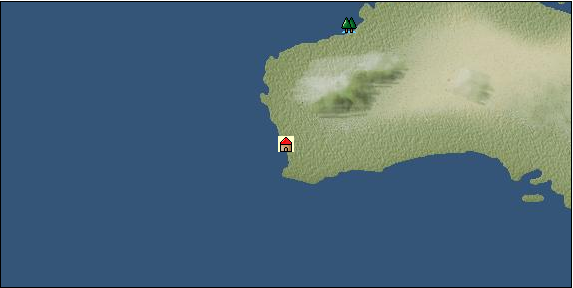

# Port: Pinjarra

import Tabs from '@theme/Tabs';
import TabItem from '@theme/TabItem';

## General Information

| Attribute | Details |
| :--- | :--- |
| **Port Name** | Pinjarra |
| **Port Type** | port of alliance |
| **Region** | Oceania |
| **Sea Area** | perth basin |
| **Required Language** | Oceanian languages |
| **Coordinates** | （5564，6477） |
| **Investment Reward** | [Lot (NO.14)](docs/Items/Consumables/Consumables-Treasure-Chests/item_2901.md) （必要投資額：500,000ドゥカード） |

### Available Facilities

| guild | intermediary | exchange | tool shop | workshop craftsman | Painter | sculptor | peddler |
| --- | --- | --- | --- | --- | --- | --- | --- |
|   |   | ○ | ○ |   |   |   |   |
| Shipyard Master | Lumbermaker | Sail-maker | weapon craftsman | master | TavernFemale | archive | salesperson |
| --- | --- | --- | --- | --- | --- | --- | --- |
|   |   |   |   | ○ |   |   |   |
| Shipwright | 銀行 | street worker | 王宮 | Trading post | church | suburbs | translator |
| --- | --- | --- | --- | --- | --- | --- | --- |
| ○ | ○ | ○ |   |   |   |   |   |

### Description
A town near the southwestern tip of Australia. The town's name is a corruption of an indigenous word referring to the nearby marshland. The inland area of ​​southwestern Australia is home to rich iron ore and gold mines, so it is attracting attention as a port for shipping these minerals. Cultural area: Oceania

<Tabs>
  <TabItem value="trade_goods_sales" label="Trade Goods Sales">

| Item | Group | Purchase Price | Allied Price | Remarks |
| --- | --- | --- | --- | --- |
| [kangaroo meat](docs/Items/TradeGoods/TradeGoods-Foodstuffs/item_2285.md) | [Trading items (food items)](docs/Categories/category_3.md) | 356 | (312) |  |
| [pink diamond](docs/Items/TradeGoods/TradeGoods-Gems/item_2874.md) | [Trading Items (Gemstones)](docs/Categories/category_15.md) | 3,388 | (2,965) |  |
| 要投資（必要投資額：600,000） |
| [eucalyptus](docs/Items/TradeGoods/TradeGoods-Perfume/item_2278.md) | [Trading Goods (Spices)](docs/Categories/category_11.md) | 373 | (327) |  |
| [salt](docs/Items/TradeGoods/TradeGoods-Seasonings/item_42.md) | [交易品（調味料）](docs/Categories/category_4.md) | 237 | 208 |  |
| [oil](docs/Items/TradeGoods/TradeGoods-Wares/item_613.md) | [交易品（工業品）](docs/Categories/category_19.md) | 579 | 508 |  |
| [gold](docs/Items/TradeGoods/TradeGoods-Metals/item_659.md) | [Trading products (precious metals)](docs/Categories/category_8.md) | 4,934 | (4,317) |  |
| [iron ore](docs/Items/TradeGoods/TradeGoods-Minerals/item_146.md) | [Trading Items (Iron Stone)](docs/Categories/category_7.md) | 647 | (567) |  |
  </TabItem>
  <TabItem value="sale_specialty" label="Sale (Specialty)">

| Item | Group | sale price | Allied Price | Remarks |
| --- | --- | --- | --- | --- |

#### [交易品（繊維）](docs/Categories/category_1.md)

| [feather](docs/Items/TradeGoods/TradeGoods-Fibers/item_585.md) | 交易品（繊維） | 890 | (1,001) |  |

#### [Trading goods (hobby goods)](docs/Categories/category_10.md)

| [tobacco](docs/Items/TradeGoods/TradeGoods-Sunddries/item_109.md) | Trading goods (hobby goods) | 1,709 | (1,922) |  |
| [black tea](docs/Items/TradeGoods/TradeGoods-Sunddries/item_675.md) | Trading goods (hobby goods) | (966) | 1,127 |  |

#### [Trading Goods (Spices)](docs/Categories/category_11.md)

| [jasmine](docs/Items/TradeGoods/TradeGoods-Perfume/item_772.md) | Trading Goods (Spices) | 3,858 | (4,340) |  |
| [benzoin](docs/Items/TradeGoods/TradeGoods-Perfume/item_1962.md) | Trading Goods (Spices) | 1,040 | (1,170) |  |
| [sandalwood](docs/Items/TradeGoods/TradeGoods-Perfume/item_771.md) | Trading Goods (Spices) | 1,819 | (2,046) |  |

#### [Trading Goods (Spices)](docs/Categories/category_12.md)

| [pepper](docs/Items/TradeGoods/TradeGoods-Spices/item_58.md) | Trading Goods (Spices) | (531) | 619 |  |
| [cinnamon](docs/Items/TradeGoods/TradeGoods-Spices/item_1432.md) | Trading Goods (Spices) | 506 | (569) |  |

#### [Trading goods (artificial goods)](docs/Categories/category_13.md)

| [glasswork](docs/Items/TradeGoods/TradeGoods-Luxuries/item_60.md) | Trading goods (artificial goods) | (2,685) | 3,132 |  |
| [Saori](docs/Items/TradeGoods/TradeGoods-Luxuries/item_3676.md) | Trading goods (artificial goods) | 2,770 | (3,116) |  |

#### [Trading Items (Gemstones)](docs/Categories/category_15.md)

| [opal](docs/Items/TradeGoods/TradeGoods-Gems/item_2006.md) | Trading Items (Gemstones) | 7,092 | (7,979) |  |
| [sapphire](docs/Items/TradeGoods/TradeGoods-Gems/item_676.md) | Trading Items (Gemstones) | 4,363 | (4,908) |  |
| [diamond](docs/Items/TradeGoods/TradeGoods-Gems/item_449.md) | Trading Items (Gemstones) | 4,953 | (5,572) |  |
| [topaz](docs/Items/TradeGoods/TradeGoods-Gems/item_1097.md) | Trading Items (Gemstones) | 4,226 | (4,754) |  |
| [ruby](docs/Items/TradeGoods/TradeGoods-Gems/item_773.md) | Trading Items (Gemstones) | (4,471) | 5,217 |  |

#### [Trading Items (Arms)](docs/Categories/category_16.md)

| [Japanese sword](docs/Items/TradeGoods/TradeGoods-Weapons/item_3437.md) | Trading Items (Arms) | (8,193) | 9,560 |  |

#### [交易品（織物）](docs/Categories/category_20.md)

| [Awaiyo](docs/Items/TradeGoods/TradeGoods-Fabrics/item_3002.md) | 交易品（織物） | (3,583) | 4,180 |  |
| [dutch calico](docs/Items/TradeGoods/TradeGoods-Fabrics/item_1435.md) | 交易品（織物） | 2,100 | (2,362) |  |
| [taffeta](docs/Items/TradeGoods/TradeGoods-Fabrics/item_1001.md) | 交易品（織物） | 2,929 | (3,295) |  |
| [damask](docs/Items/TradeGoods/TradeGoods-Fabrics/item_614.md) | 交易品（織物） | 7,360 | (8,280) |  |
  </TabItem>
  <TabItem value="sale_no_specialty" label="Sale (No Specialty)">

| Item | Group | sale price | Allied Price | Remarks |
| --- | --- | --- | --- | --- |

#### [交易品（繊維）](docs/Categories/category_1.md)

| [fur](docs/Items/TradeGoods/TradeGoods-Fibers/item_634.md) | 交易品（繊維） | 1,255 | (1,412) |  |
| [raw silk](docs/Items/TradeGoods/TradeGoods-Fibers/item_677.md) | 交易品（繊維） | 2,379 | (2,676) |  |
| [cotton](docs/Items/TradeGoods/TradeGoods-Fibers/item_610.md) | 交易品（繊維） | 670 | (753) |  |
| [numb](docs/Items/TradeGoods/TradeGoods-Fibers/item_900.md) | 交易品（繊維） | 12 | (13) |  |

#### [Trading Goods (Dye)](docs/Categories/category_2.md)

| [mimosa](docs/Items/TradeGoods/TradeGoods-Dye/item_2281.md) | Trading Goods (Dye) | 506 | (569) |  |

#### [Trading items (food items)](docs/Categories/category_3.md)

| [fava beans](docs/Items/TradeGoods/TradeGoods-Foodstuffs/item_102.md) | Trading items (food items) | 130 | (146) |  |
| [bacon](docs/Items/TradeGoods/TradeGoods-Foodstuffs/item_566.md) | Trading items (food items) | 526 | (591) |  |
| [crocodile meat](docs/Items/TradeGoods/TradeGoods-Foodstuffs/item_2284.md) | Trading items (food items) | 492 | (553) |  |

#### [交易品（調味料）](docs/Categories/category_4.md)

| [anchovies](docs/Items/TradeGoods/TradeGoods-Seasonings/item_3004.md) | 交易品（調味料） | 161 | (181) |  |
| [jam](docs/Items/TradeGoods/TradeGoods-Seasonings/item_427.md) | 交易品（調味料） | 575 | (646) |  |
| [lard](docs/Items/TradeGoods/TradeGoods-Seasonings/item_43.md) | 交易品（調味料） | 264 | (297) |  |
| [salt](docs/Items/TradeGoods/TradeGoods-Seasonings/item_42.md) | 交易品（調味料） | 104 | (117) |  |
| [Honey](docs/Items/TradeGoods/TradeGoods-Seasonings/item_49.md) | 交易品（調味料） | 914 | (1,028) |  |

#### [交易品（雑貨）](docs/Categories/category_5.md)

| [Western books](docs/Items/TradeGoods/TradeGoods-Misc/item_293.md) | 交易品（雑貨） | 520 | (585) |  |

#### [Trading products (medical products)](docs/Categories/category_6.md)

| [tea tree](docs/Items/TradeGoods/TradeGoods-Medicine/item_2283.md) | Trading products (medical products) | 497 | (559) |  |

#### [Trading products (precious metals)](docs/Categories/category_8.md)

| [silver](docs/Items/TradeGoods/TradeGoods-Metals/item_136.md) | Trading products (precious metals) | 2,667 | (3,000) |  |

#### [Trading goods (hobby goods)](docs/Categories/category_10.md)

| [coffee](docs/Items/TradeGoods/TradeGoods-Sunddries/item_445.md) | Trading goods (hobby goods) | 489 | (550) |  |
| [banana](docs/Items/TradeGoods/TradeGoods-Sunddries/item_1947.md) | Trading goods (hobby goods) | 184 | (207) |  |
| [macadamia nuts](docs/Items/TradeGoods/TradeGoods-Sunddries/item_2282.md) | Trading goods (hobby goods) | 385 | (433) |  |
| [Yerba mate tea](docs/Items/TradeGoods/TradeGoods-Sunddries/item_1808.md) | Trading goods (hobby goods) | 394 | (443) |  |
| [lemon myrtle](docs/Items/TradeGoods/TradeGoods-Sunddries/item_2840.md) | Trading goods (hobby goods) | 585 | (658) |  |

#### [Trading Goods (Spices)](docs/Categories/category_11.md)

| [eucalyptus](docs/Items/TradeGoods/TradeGoods-Perfume/item_2278.md) | Trading Goods (Spices) | 164 | (184) |  |
| [rose](docs/Items/TradeGoods/TradeGoods-Perfume/item_536.md) | Trading Goods (Spices) | 2,327 | (2,618) |  |

#### [Trading goods (artificial goods)](docs/Categories/category_13.md)

| [皮革製品](docs/Items/TradeGoods/TradeGoods-Luxuries/item_12.md) | Trading goods (artificial goods) | 1,266 | (1,424) |  |
| [silversmith](docs/Items/TradeGoods/TradeGoods-Luxuries/item_619.md) | Trading goods (artificial goods) | 2,963 | (3,333) |  |

#### [交易品（美術品）](docs/Categories/category_14.md)

| [wooden statue](docs/Items/TradeGoods/TradeGoods-Art/item_95.md) | 交易品（美術品） | 1,132 | (1,273) |  |

#### [Trading Items (Gemstones)](docs/Categories/category_15.md)

| [coral](docs/Items/TradeGoods/TradeGoods-Gems/item_141.md) | Trading Items (Gemstones) | 3,350 | (3,769) |  |
| [nephrite](docs/Items/TradeGoods/TradeGoods-Gems/item_2314.md) | Trading Items (Gemstones) | 1,575 | (1,772) |  |
| [peridot](docs/Items/TradeGoods/TradeGoods-Gems/item_1098.md) | Trading Items (Gemstones) | 1,921 | (2,161) |  |

#### [交易品（工業品）](docs/Categories/category_19.md)

| [coal](docs/Items/TradeGoods/TradeGoods-Wares/item_359.md) | 交易品（工業品） | 529 | (595) |  |
| [paper](docs/Items/TradeGoods/TradeGoods-Wares/item_625.md) | 交易品（工業品） | 209 | (235) |  |
| [iron material](docs/Items/TradeGoods/TradeGoods-Wares/item_268.md) | 交易品（工業品） | 867 | (975) |  |
| [銅](docs/Items/TradeGoods/TradeGoods-Wares/item_894.md) | 交易品（工業品） | 1,054 | (1,185) |  |

#### [交易品（織物）](docs/Categories/category_20.md)

| [cotton fabric](docs/Items/TradeGoods/TradeGoods-Fabrics/item_571.md) | 交易品（織物） | 1,146 | (1,289) |  |
  </TabItem>
  <TabItem value="guild_&_others" label="Guild & Others">

| Item | Group | Sales price | Handling NPC | Remarks |
| --- | --- | --- | --- | --- |
| There is no sales information for the Item |
| --- |
  </TabItem>
  <TabItem value="toolman" label="Toolman">

| Item | Group | Sales price | Handling NPC | Remarks |
| --- | --- | --- | --- | --- |

#### [Equipment (belongings)](docs/Categories/category_27.md)

| [木槍](docs/Items/Equipment/Equipment-Weapon/item_438.md) | Equipment (belongings) | 34,400 | tool shop owner |  |
| [hunter's spear](docs/Items/Equipment/Equipment-Weapon/item_655.md) | Equipment (belongings) | 38,700 | tool shop owner |  |

#### [Consumables (land battle/deck battle)](docs/Categories/category_29.md)

| [boomerang](docs/Items/Consumables/Consumables-Landbattle/item_454.md) | Consumables (land battle/deck battle) | 150 | tool shop owner |  |
| [strong adhesive oil](docs/Items/Consumables/Consumables-Landbattle/item_662.md) | Consumables (land battle/deck battle) | 200 | tool shop owner |  |
| [catapult](docs/Items/Consumables/Consumables-Landbattle/item_311.md) | Consumables (land battle/deck battle) | 30 | tool shop owner |  |
| [Assortment of therapeutic drugs](docs/Items/Consumables/Consumables-Landbattle/item_564.md) | Consumables (land battle/deck battle) | 900 | tool shop owner |  |
| [secret cure](docs/Items/Consumables/Consumables-Landbattle/item_563.md) | Consumables (land battle/deck battle) | 600 | tool shop owner |  |

#### [Consumables (skill activation)](docs/Categories/category_31.md)

| [fishing gear](docs/Items/Consumables/Consumables-Skill/item_79.md) | Consumables (skill activation) | 2,500 | tool shop owner |  |

#### [Consumables (request documents)](docs/Categories/category_45.md)

| [Pharmaceutical purchase order](docs/Items/Consumables/Consumables-Documents/item_4924.md) | Consumables (request documents) | 20,000 | tool shop owner |  |
  </TabItem>
  <TabItem value="Tavern Master" label="Tavern Master">

| Item | Group | Sales price | Handling NPC | Remarks |
| --- | --- | --- | --- | --- |

#### [recipe book](docs/Categories/category_22.md)

| [Oceania traditional cuisine collection](docs/Items/RecipeBooks/item_2286.md) | recipe book | Fixed recipe | Tavern Master |  |
  </TabItem>
</Tabs>