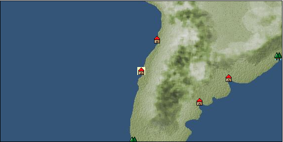

# Port: バルパライソ

import Tabs from '@theme/Tabs';
import TabItem from '@theme/TabItem';

## General Information

| Attribute | Details |
| :--- | :--- |
| **Port Name** | Valparaiso |
| **Port Type** | port of alliance |
| **Region** | South America |
| **Sea Area** | peruvian basin |
| **Required Language** | Quechua |
| **Coordinates** | （13015，6052） |
| **Investment Reward** | [Lot (NO.10)](docs/Items/Consumables/Consumables-Treasure-Chests/item_2993.md) （必要投資額：500,000ドゥカード） |

### Available Facilities

| guild | intermediary | exchange | tool shop | workshop craftsman | Painter | sculptor | peddler |
| --- | --- | --- | --- | --- | --- | --- | --- |
|   |   | ○ | ○ |   |   |   |   |
| Shipyard Master | Lumbermaker | Sail-maker | weapon craftsman | master | TavernFemale | archive | salesperson |
| --- | --- | --- | --- | --- | --- | --- | --- |
|   |   |   |   | ○ |   |   |   |
| Shipwright | 銀行 | street worker | 王宮 | Trading post | church | suburbs | translator |
| --- | --- | --- | --- | --- | --- | --- | --- |
| ○ | ○ | ○ |   |   |   |   |   |

### Description
A port town that prospered as a anchorage for ships passing through the Straits of Magellan. The name of the city means "Valley of Heaven". Cultural area: West coast of Central and South America

<Tabs>
  <TabItem value="trade_goods_sales" label="Trade Goods Sales">

| item | group | purchase price | 同盟時 | remarks |
| --- | --- | --- | --- | --- |
| [Yerba mate tea](docs/Items/TradeGoods/TradeGoods-Sunddries/item_1808.md) | [Trading goods (hobby goods)](docs/Categories/category_10.md) | 265 | (232) |  |
| [coconut fiber](docs/Items/TradeGoods/TradeGoods-Fibers/item_444.md) | [交易品（繊維）](docs/Categories/category_1.md) | 146 | (128) |  |
| [palm wine](docs/Items/TradeGoods/TradeGoods-Alcohol/item_436.md) | [交易品（酒類）](docs/Categories/category_9.md) | 292 | (256) |  |
| [rose hips](docs/Items/TradeGoods/TradeGoods-Medicine/item_904.md) | [Trading products (medical products)](docs/Categories/category_6.md) | 544 | (476) |  |
| [gold](docs/Items/TradeGoods/TradeGoods-Metals/item_659.md) | [Trading products (precious metals)](docs/Categories/category_8.md) | 3,466 | (3,033) |  |
| 要投資（必要投資額：400,000） |
| [青銅](docs/Items/TradeGoods/TradeGoods-Wares/item_7.md) | [交易品（工業品）](docs/Categories/category_19.md) | 1,177 | (1,030) |  |
  </TabItem>
  <TabItem value="sale_specialty" label="Sale (Specialty)">

| item | group | sale price | 同盟時 | remarks |
| --- | --- | --- | --- | --- |

#### [Trading goods (hobby goods)](docs/Categories/category_10.md)

| [cacao](docs/Items/TradeGoods/TradeGoods-Sunddries/item_140.md) | Trading goods (hobby goods) | 912 | (1,026) |  |
| [peanuts](docs/Items/TradeGoods/TradeGoods-Sunddries/item_134.md) | Trading goods (hobby goods) | 196 | (220) |  |

#### [Trading Items (Firearms)](docs/Categories/category_17.md)

| [musket gun](docs/Items/TradeGoods/TradeGoods-Firearms/item_584.md) | Trading Items (Firearms) | (4,941) | 5,765 |  |

#### [交易品（織物）](docs/Categories/category_20.md)

| [velvet](docs/Items/TradeGoods/TradeGoods-Fabrics/item_902.md) | 交易品（織物） | 6,106 | (6,869) |  |
  </TabItem>
  <TabItem value="sale_no_specialty" label="Sale (No Specialty)">

| item | group | sale price | 同盟時 | remarks |
| --- | --- | --- | --- | --- |

#### [交易品（繊維）](docs/Categories/category_1.md)

| [numb](docs/Items/TradeGoods/TradeGoods-Fibers/item_900.md) | 交易品（繊維） | 12 | (13) |  |

#### [Trading Goods (Dye)](docs/Categories/category_2.md)

| [Gerep](docs/Items/TradeGoods/TradeGoods-Dye/item_1814.md) | Trading Goods (Dye) | 670 | (753) |  |

#### [Trading items (food items)](docs/Categories/category_3.md)

| [milk](docs/Items/TradeGoods/TradeGoods-Foodstuffs/item_254.md) | Trading items (food items) | 148 | (166) |  |
| [beef](docs/Items/TradeGoods/TradeGoods-Foodstuffs/item_26.md) | Trading items (food items) | 840 | (945) |  |

#### [交易品（調味料）](docs/Categories/category_4.md)

| [sugar](docs/Items/TradeGoods/TradeGoods-Seasonings/item_94.md) | 交易品（調味料） | 992 | (1,116) |  |

#### [交易品（酒類）](docs/Categories/category_9.md)

| [Beer](docs/Items/TradeGoods/TradeGoods-Alcohol/item_2.md) | 交易品（酒類） | 408 | (459) |  |
| [rum](docs/Items/TradeGoods/TradeGoods-Alcohol/item_139.md) | 交易品（酒類） | 612 | (688) |  |

#### [Trading goods (hobby goods)](docs/Categories/category_10.md)

| [cashew nuts](docs/Items/TradeGoods/TradeGoods-Sunddries/item_2120.md) | Trading goods (hobby goods) | 389 | (437) |  |

#### [Trading Goods (Spices)](docs/Categories/category_12.md)

| [vanilla](docs/Items/TradeGoods/TradeGoods-Spices/item_1810.md) | Trading Goods (Spices) | 418 | (470) |  |
| [chili pepper](docs/Items/TradeGoods/TradeGoods-Spices/item_1831.md) | Trading Goods (Spices) | 316 | (355) |  |

#### [Trading goods (artificial goods)](docs/Categories/category_13.md)

| [silversmith](docs/Items/TradeGoods/TradeGoods-Luxuries/item_619.md) | Trading goods (artificial goods) | 3,430 | (3,859) |  |

#### [Trading Items (Gemstones)](docs/Categories/category_15.md)

| [topaz](docs/Items/TradeGoods/TradeGoods-Gems/item_1097.md) | Trading Items (Gemstones) | 2,010 | (2,261) |  |

#### [Trading Items (Arms)](docs/Categories/category_16.md)

| [dagger](docs/Items/TradeGoods/TradeGoods-Weapons/item_143.md) | Trading Items (Arms) | 943 | (1,060) |  |

#### [Trading Items (Firearms)](docs/Categories/category_17.md)

| [arquebus gun](docs/Items/TradeGoods/TradeGoods-Firearms/item_14.md) | Trading Items (Firearms) | (2,267) | 2,645 |  |

#### [交易品（工業品）](docs/Categories/category_19.md)

| [wood](docs/Items/TradeGoods/TradeGoods-Wares/item_277.md) | 交易品（工業品） | 785 | (883) |  |

#### [交易品（織物）](docs/Categories/category_20.md)

| [Awaiyo](docs/Items/TradeGoods/TradeGoods-Fabrics/item_3002.md) | 交易品（織物） | 1,920 | (2,160) |  |
| [linen fabric](docs/Items/TradeGoods/TradeGoods-Fabrics/item_135.md) | 交易品（織物） | 422 | (474) |  |
  </TabItem>
  <TabItem value="guild_&_others" label="Guild & Others">

| item | group | Sales price | Handling NPC | remarks |
| --- | --- | --- | --- | --- |
| There is no sales information for the item |
| --- |
  </TabItem>
  <TabItem value="toolman" label="Toolman">

| item | group | Sales price | Handling NPC | remarks |
| --- | --- | --- | --- | --- |

#### [Consumables (condition recovery)](docs/Categories/category_21.md)

| [Shrine Maiden Chicha](docs/Items/Consumables/Consumables-Recovery/item_2992.md) | Consumables (condition recovery) | 30,000 | tool shop owner |  |

#### [Equipment (body)](docs/Categories/category_24.md)

| [inka tunic](docs/Items/Equipment/Equipment-Body/item_2990.md) | Equipment (body) | 160,000 | tool shop owner |  |
| [Incavestid](docs/Items/Equipment/Equipment-Body/item_2991.md) | Equipment (body) | 160,000 | tool shop owner |  |

#### [Equipment (belongings)](docs/Categories/category_27.md)

| [木槍](docs/Items/Equipment/Equipment-Weapon/item_438.md) | Equipment (belongings) | 34,400 | tool shop owner |  |
| [hunter's spear](docs/Items/Equipment/Equipment-Weapon/item_655.md) | Equipment (belongings) | 38,700 | tool shop owner |  |

#### [Consumables (land battle/deck battle)](docs/Categories/category_29.md)

| [strong adhesive oil](docs/Items/Consumables/Consumables-Landbattle/item_662.md) | Consumables (land battle/deck battle) | 200 | tool shop owner |  |
| [tonic](docs/Items/Consumables/Consumables-Landbattle/item_1678.md) | Consumables (land battle/deck battle) | 300 | tool shop owner |  |
| [torch for throwing](docs/Items/Consumables/Consumables-Landbattle/item_313.md) | Consumables (land battle/deck battle) | 150 | tool shop owner |  |
| [secret cure](docs/Items/Consumables/Consumables-Landbattle/item_563.md) | Consumables (land battle/deck battle) | 600 | tool shop owner |  |

#### [Consumables (skill activation)](docs/Categories/category_31.md)

| [fishing gear](docs/Items/Consumables/Consumables-Skill/item_79.md) | Consumables (skill activation) | 2,500 | tool shop owner |  |

#### [Consumables (request documents)](docs/Categories/category_45.md)

| [Flavor purchase order form](docs/Items/Consumables/Consumables-Documents/item_5096.md) | Consumables (request documents) | 60,000 | tool shop owner |  |
  </TabItem>
</Tabs>