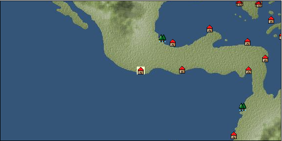

# Port: Acapulco

import Tabs from '@theme/Tabs';
import TabItem from '@theme/TabItem';

## General Information

| Attribute | Details |
| :--- | :--- |
| **Port Name** | Acapulco |
| **Port Type** | port of alliance |
| **Region** | Caribbean/Central America |
| **Sea Area** | Tehuantepec Bay |
| **Required Language** | Quechua |
| **Coordinates** | （11838，4267） |
| **Investment Reward** | [Lot (NO.10)](docs/Items/Consumables/Consumables-Treasure-Chests/item_2993.md) （必要投資額：500,000ドゥカード） |

### Available Facilities

| guild | intermediary | exchange | tool shop | workshop craftsman | Painter | sculptor | peddler |
| --- | --- | --- | --- | --- | --- | --- | --- |
|   |   | ○ | ○ |   |   |   |   |
| Shipyard Master | Lumbermaker | Sail-maker | weapon craftsman | master | TavernFemale | archive | salesperson |
| --- | --- | --- | --- | --- | --- | --- | --- |
| ○ |   |   |   |   |   |   |   |
| Shipwright | 銀行 | street worker | 王宮 | Trading post | church | suburbs | translator |
| --- | --- | --- | --- | --- | --- | --- | --- |
| ○ | ○ | ○ |   |   |   |   |   |

### Description
A town at the foot of a mountain range facing the Pacific Ocean. It has a perpetual summer climate with high temperatures throughout the year. Because of the thriving trade using silver, there is a constant flow of transport ships bound for Europe. *Spanish is also spoken Cultural area: West coast of Central and South America

<Tabs>
  <TabItem value="trade_goods_sales" label="Trade Goods Sales">

| Item | Group | Purchase Price | Allied Price | Remarks |
| --- | --- | --- | --- | --- |
| [zinc ore](docs/Items/TradeGoods/TradeGoods-Minerals/item_626.md) | [Trading Items (Iron Stone)](docs/Categories/category_7.md) | (384) | 336 |  |
| [chili pepper](docs/Items/TradeGoods/TradeGoods-Spices/item_1831.md) | [Trading Goods (Spices)](docs/Categories/category_12.md) | (256) | 224 |  |
| 要投資（必要投資額：120,000） |
| [Stone](docs/Items/TradeGoods/TradeGoods-Wares/item_276.md) | [交易品（工業品）](docs/Categories/category_19.md) | (653) | 572 |  |
| [iron ore](docs/Items/TradeGoods/TradeGoods-Minerals/item_146.md) | [Trading Items (Iron Stone)](docs/Categories/category_7.md) | (649) | 568 |  |
| [lead ore](docs/Items/TradeGoods/TradeGoods-Minerals/item_21.md) | [Trading Items (Iron Stone)](docs/Categories/category_7.md) | (448) | 392 |  |
| [silver](docs/Items/TradeGoods/TradeGoods-Metals/item_136.md) | [Trading products (precious metals)](docs/Categories/category_8.md) | (1,435) | 1,256 |  |
| [green chili pepper](docs/Items/TradeGoods/TradeGoods-Spices/item_1990.md) | [Trading Goods (Spices)](docs/Categories/category_12.md) | 401 | (351) |  |
| 要投資（必要投資額：180,000） |
| [魚肉](docs/Items/TradeGoods/TradeGoods-Foodstuffs/item_10.md) | [Trading items (food items)](docs/Categories/category_3.md) | (141) | 124 |  |
  </TabItem>
  <TabItem value="sale_specialty" label="Sale (Specialty)">

| Item | Group | sale price | Allied Price | Remarks |
| --- | --- | --- | --- | --- |

#### [Trading Goods (Dye)](docs/Categories/category_2.md)

| [ward](docs/Items/TradeGoods/TradeGoods-Dye/item_57.md) | Trading Goods (Dye) | 2,360 | (2,655) |  |

#### [Trading goods (hobby goods)](docs/Categories/category_10.md)

| [pineapple](docs/Items/TradeGoods/TradeGoods-Sunddries/item_867.md) | Trading goods (hobby goods) | 1,211 | (1,362) |  |
| [Korean tea](docs/Items/TradeGoods/TradeGoods-Sunddries/item_3751.md) | Trading goods (hobby goods) | 11,000 | (12,376) |  |

#### [Trading Items (Arms)](docs/Categories/category_16.md)

| [damascus sword](docs/Items/TradeGoods/TradeGoods-Weapons/item_903.md) | Trading Items (Arms) | 9,080 | (10,215) |  |

#### [Trading Items (Firearms)](docs/Categories/category_17.md)

| [musket gun](docs/Items/TradeGoods/TradeGoods-Firearms/item_584.md) | Trading Items (Firearms) | (5,170) | 6,032 |  |
  </TabItem>
  <TabItem value="sale_no_specialty" label="Sale (No Specialty)">

| Item | Group | sale price | Allied Price | Remarks |
| --- | --- | --- | --- | --- |

#### [交易品（繊維）](docs/Categories/category_1.md)

| [numb](docs/Items/TradeGoods/TradeGoods-Fibers/item_900.md) | 交易品（繊維） | 12 | (13) |  |

#### [Trading Goods (Dye)](docs/Categories/category_2.md)

| [貝紫](docs/Items/TradeGoods/TradeGoods-Dye/item_110.md) | Trading Goods (Dye) | 4,110 | (4,624) |  |

#### [Trading items (food items)](docs/Categories/category_3.md)

| [tomato](docs/Items/TradeGoods/TradeGoods-Foodstuffs/item_1809.md) | Trading items (food items) | 114 | (128) |  |
| [milk](docs/Items/TradeGoods/TradeGoods-Foodstuffs/item_254.md) | Trading items (food items) | 148 | (166) |  |
| [beef](docs/Items/TradeGoods/TradeGoods-Foodstuffs/item_26.md) | Trading items (food items) | 840 | (945) |  |

#### [交易品（調味料）](docs/Categories/category_4.md)

| [anchovies](docs/Items/TradeGoods/TradeGoods-Seasonings/item_3004.md) | 交易品（調味料） | 161 | (181) |  |

#### [Trading Items (Iron Stone)](docs/Categories/category_7.md)

| [copper ore](docs/Items/TradeGoods/TradeGoods-Minerals/item_65.md) | Trading Items (Iron Stone) | 934 | (1,050) |  |

#### [Trading goods (hobby goods)](docs/Categories/category_10.md)

| [cashew nuts](docs/Items/TradeGoods/TradeGoods-Sunddries/item_2120.md) | Trading goods (hobby goods) | 393 | (442) |  |

#### [Trading goods (artificial goods)](docs/Categories/category_13.md)

| [goldsmith](docs/Items/TradeGoods/TradeGoods-Luxuries/item_687.md) | Trading goods (artificial goods) | 3,150 | (3,544) |  |
| [silversmith](docs/Items/TradeGoods/TradeGoods-Luxuries/item_619.md) | Trading goods (artificial goods) | (3,129) | 3,650 |  |

#### [Trading Items (Gemstones)](docs/Categories/category_15.md)

| [emerald](docs/Items/TradeGoods/TradeGoods-Gems/item_777.md) | Trading Items (Gemstones) | 3,328 | (3,744) |  |
| [topaz](docs/Items/TradeGoods/TradeGoods-Gems/item_1097.md) | Trading Items (Gemstones) | 2,010 | (2,261) |  |

#### [Trading Items (Firearms)](docs/Categories/category_17.md)

| [arquebus gun](docs/Items/TradeGoods/TradeGoods-Firearms/item_14.md) | Trading Items (Firearms) | (2,275) | 2,654 |  |

#### [交易品（工業品）](docs/Categories/category_19.md)

| [rubber](docs/Items/TradeGoods/TradeGoods-Wares/item_2819.md) | 交易品（工業品） | 790 | (888) |  |

#### [交易品（織物）](docs/Categories/category_20.md)

| [Awaiyo](docs/Items/TradeGoods/TradeGoods-Fabrics/item_3002.md) | 交易品（織物） | 1,915 | (2,154) |  |
  </TabItem>
  <TabItem value="guild_&_others" label="Guild & Others">

| Item | Group | Sales price | Handling NPC | Remarks |
| --- | --- | --- | --- | --- |
| There is no sales information for the Item |
| --- |
  </TabItem>
  <TabItem value="toolman" label="Toolman">

| Item | Group | Sales price | Handling NPC | Remarks |
| --- | --- | --- | --- | --- |

#### [Equipment (belongings)](docs/Categories/category_27.md)

| [Replenishment hoe](docs/Items/Equipment/Equipment-Weapon/item_2298.md) | Equipment (belongings) | 1,000 | tool shop owner |  |

#### [装備品（服飾品）](docs/Categories/category_28.md)

| [refill candle](docs/Items/Equipment/Equipment-Accessory/item_2299.md) | 装備品（服飾品） | 1,000 | tool shop owner |  |
| [refill bell](docs/Items/Equipment/Equipment-Accessory/item_2300.md) | 装備品（服飾品） | 1,000 | tool shop owner |  |
| [補充用漁網](docs/Items/Equipment/Equipment-Accessory/item_2301.md) | 装備品（服飾品） | 1,000 | tool shop owner |  |

#### [Consumables (request documents)](docs/Categories/category_45.md)

| [grocery purchase order](docs/Items/Consumables/Consumables-Documents/item_5375.md) | Consumables (request documents) | 20,000 | tool shop owner |  |
| [spice purchase order](docs/Items/Consumables/Consumables-Documents/item_4918.md) | Consumables (request documents) | 60,000 | tool shop owner |  |
  </TabItem>
  <TabItem value="shipyard" label="Shipyard">

### Shipyard Master

| Item | Group | Sales price | Handling NPC | Remarks |
| --- | --- | --- | --- | --- |

#### [Boat](docs/Categories/category_43.md)

| [Varsha](docs/Items/Ships/item_201.md) | Boat | 2,000 | Shipyard Master |  |
| [bergantine](docs/Items/Ships/item_208.md) | Boat | 148,800 | Shipyard Master |  |
| [commercial varsha](docs/Items/Ships/item_204.md) | Boat | 5,200 | Shipyard Master |  |
| [small caravel](docs/Items/Ships/item_206.md) | Boat | 92,000 | Shipyard Master |  |
| [Battle Barsha](docs/Items/Ships/item_203.md) | Boat | 5,100 | Shipyard Master |  |
| [exploration barsha](docs/Items/Ships/item_202.md) | Boat | 5,000 | Shipyard Master |  |
| [light galleon](docs/Items/Ships/item_240.md) | Boat | 810,000 | Shipyard Master |  |
| [light carrack](docs/Items/Ships/item_218.md) | Boat | 478,000 | Shipyard Master |  |
| [transport galleon](docs/Items/Ships/item_407.md) | Boat | 840,000 | Shipyard Master |  |
| [transport carrack](docs/Items/Ships/item_222.md) | Boat | 488,000 | Shipyard Master |  |
  </TabItem>
</Tabs>