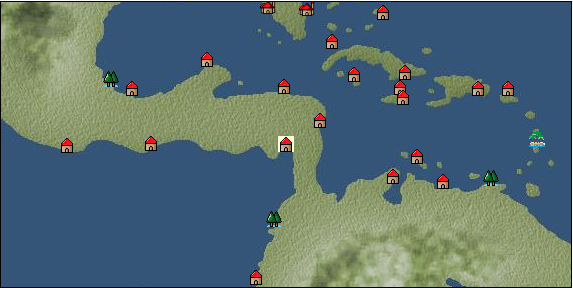

# Port: パナマ

import Tabs from '@theme/Tabs';
import TabItem from '@theme/TabItem';

## General Information

| Attribute | Details |
| :--- | :--- |
| **Port Name** | Panama |
| **Port Type** | port of alliance |
| **Region** | Caribbean/Central America |
| **Sea Area** | panama bay |
| **Required Language** | mayan languages |
| **Coordinates** | （12716，4260） |
| **Investment Reward** | [Andean costume sewing method volume 1](Items/Recipe Book/item_3008.md) （必要投資額：2,060,000ドゥカード） |

### Available Facilities

| guild | intermediary | exchange | tool shop | workshop craftsman | Painter | sculptor | peddler |
| --- | --- | --- | --- | --- | --- | --- | --- |
|   |   | ○ | ○ |   |   |   |   |
| Shipyard Master | Lumbermaker | Sail-maker | weapon craftsman | master | TavernFemale | archive | salesperson |
| --- | --- | --- | --- | --- | --- | --- | --- |
| ○ |   |   |   |   |   |   |   |
| Shipwright | 銀行 | street worker | 王宮 | Trading post | church | suburbs | translator |
| --- | --- | --- | --- | --- | --- | --- | --- |
| ○ | ○ | ○ |   |   |   | ○ |   |

### Description
A port city located on the border between North and South America. As the name suggests, ``a place rich in fish,'' fishing is popular here. The tropical rainforest surrounding the city is home to a variety of creatures. *Spanish is also spoken Panama Canal Suburbs: Northeastern Panama Cultural area: West coast of Central and South America

<Tabs>
  <TabItem value="trade_goods_sales" label="Trade Goods Sales">

| item | group | purchase price | 同盟時 | remarks |
| --- | --- | --- | --- | --- |
| [cashew nuts](Items/Trade Goods/TradeGoods-Sunddries/item_2120.md) | [Trading goods (hobby goods)](Categories/category_10.md) | (370) | 324 |  |
| [rubber](Items/Trade Goods/TradeGoods-Wares/item_2819.md) | [交易品（工業品）](Categories/category_19.md) | (704) | 616 |  |
| [pineapple](Items/Trade Goods/TradeGoods-Sunddries/item_867.md) | [Trading goods (hobby goods)](Categories/category_10.md) | (886) | 776 |  |
| [chili pepper](Items/Trade Goods/TradeGoods-Spices/item_1831.md) | [Trading Goods (Spices)](Categories/category_12.md) | (256) | 224 |  |
| [goldsmith](Items/Trade Goods/TradeGoods-Luxuries/item_687.md) | [Trading goods (artificial goods)](Categories/category_13.md) | 3,257 | (2,850) |  |
| 要投資（必要投資額：240,000） |
| [魚肉](Items/Trade Goods/TradeGoods-Foodstuffs/item_10.md) | [Trading items (food items)](Categories/category_3.md) | (146) | 128 |  |
  </TabItem>
  <TabItem value="sale_specialty" label="Sale (Specialty)">

| item | group | sale price | 同盟時 | remarks |
| --- | --- | --- | --- | --- |

#### [Trading items (food items)](Categories/category_3.md)

| [taro](Items/Trade Goods/TradeGoods-Foodstuffs/item_1960.md) | [Trading items (food items)](Categories/category_3.md) | 237 | (266) |  |

#### [Trading goods (hobby goods)](Categories/category_10.md)

| [banana](Items/Trade Goods/TradeGoods-Sunddries/item_1947.md) | [Trading goods (hobby goods)](Categories/category_10.md) | 520 | (585) |  |
| [black tea](Items/Trade Goods/TradeGoods-Sunddries/item_675.md) | [Trading goods (hobby goods)](Categories/category_10.md) | 2,625 | (2,953) |  |

#### [Trading Goods (Spices)](Categories/category_12.md)

| [pepper](Items/Trade Goods/TradeGoods-Spices/item_58.md) | [Trading Goods (Spices)](Categories/category_12.md) | 3,402 | (3,827) |  |
| [nutmeg](Items/Trade Goods/TradeGoods-Spices/item_1969.md) | [Trading Goods (Spices)](Categories/category_12.md) | 4,421 | (4,974) |  |

#### [Trading goods (artificial goods)](Categories/category_13.md)

| [glasswork](Items/Trade Goods/TradeGoods-Luxuries/item_60.md) | [Trading goods (artificial goods)](Categories/category_13.md) | 3,110 | (3,499) |  |

#### [Trading Items (Gemstones)](Categories/category_15.md)

| [opal](Items/Trade Goods/TradeGoods-Gems/item_2006.md) | [Trading Items (Gemstones)](Categories/category_15.md) | 2,746 | (3,089) |  |
| [sapphire](Items/Trade Goods/TradeGoods-Gems/item_676.md) | [Trading Items (Gemstones)](Categories/category_15.md) | 6,069 | (6,828) |  |

#### [Trading Items (Firearms)](Categories/category_17.md)

| [musket gun](Items/Trade Goods/TradeGoods-Firearms/item_584.md) | [Trading Items (Firearms)](Categories/category_17.md) | (5,090) | 5,939 |  |

#### [交易品（織物）](Categories/category_20.md)

| [velvet](Items/Trade Goods/TradeGoods-Fabrics/item_902.md) | [交易品（織物）](Categories/category_20.md) | 6,296 | (7,083) |  |
  </TabItem>
  <TabItem value="sale_no_specialty" label="Sale (No Specialty)">

| item | group | sale price | 同盟時 | remarks |
| --- | --- | --- | --- | --- |

#### [交易品（繊維）](Categories/category_1.md)

| [cotton](Items/Trade Goods/TradeGoods-Fibers/item_610.md) | [交易品（繊維）](Categories/category_1.md) | (515) | 600 |  |
| [numb](Items/Trade Goods/TradeGoods-Fibers/item_900.md) | [交易品（繊維）](Categories/category_1.md) | 12 | (13) |  |

#### [Trading Goods (Dye)](Categories/category_2.md)

| [Gerep](Items/Trade Goods/TradeGoods-Dye/item_1814.md) | [Trading Goods (Dye)](Categories/category_2.md) | (575) | 670 |  |
| [貝紫](Items/Trade Goods/TradeGoods-Dye/item_110.md) | [Trading Goods (Dye)](Categories/category_2.md) | 4,145 | (4,663) |  |

#### [Trading items (food items)](Categories/category_3.md)

| [alpaca meat](Items/Trade Goods/TradeGoods-Foodstuffs/item_2997.md) | [Trading items (food items)](Categories/category_3.md) | (651) | 759 |  |
| [sugar cane](Items/Trade Goods/TradeGoods-Foodstuffs/item_93.md) | [Trading items (food items)](Categories/category_3.md) | (239) | 278 |  |
| [milk](Items/Trade Goods/TradeGoods-Foodstuffs/item_254.md) | [Trading items (food items)](Categories/category_3.md) | 148 | (166) |  |
| [wheat](Items/Trade Goods/TradeGoods-Foodstuffs/item_16.md) | [Trading items (food items)](Categories/category_3.md) | 110 | (123) |  |
| [beef](Items/Trade Goods/TradeGoods-Foodstuffs/item_26.md) | [Trading items (food items)](Categories/category_3.md) | 840 | (945) |  |

#### [交易品（調味料）](Categories/category_4.md)

| [anchovies](Items/Trade Goods/TradeGoods-Seasonings/item_3004.md) | [交易品（調味料）](Categories/category_4.md) | 161 | (181) |  |
| [salt](Items/Trade Goods/TradeGoods-Seasonings/item_42.md) | [交易品（調味料）](Categories/category_4.md) | 234 | (263) |  |
| [sugar](Items/Trade Goods/TradeGoods-Seasonings/item_94.md) | [交易品（調味料）](Categories/category_4.md) | (935) | 1,091 |  |

#### [Trading Items (Iron Stone)](Categories/category_7.md)

| [copper ore](Items/Trade Goods/TradeGoods-Minerals/item_65.md) | [Trading Items (Iron Stone)](Categories/category_7.md) | 940 | (1,057) |  |

#### [Trading products (precious metals)](Categories/category_8.md)

| [gold](Items/Trade Goods/TradeGoods-Metals/item_659.md) | [Trading products (precious metals)](Categories/category_8.md) | 4,960 | (5,580) |  |
| [silver](Items/Trade Goods/TradeGoods-Metals/item_136.md) | [Trading products (precious metals)](Categories/category_8.md) | 1,486 | (1,671) |  |

#### [交易品（酒類）](Categories/category_9.md)

| [rum](Items/Trade Goods/TradeGoods-Alcohol/item_139.md) | [交易品（酒類）](Categories/category_9.md) | 610 | (686) |  |

#### [Trading Goods (Spices)](Categories/category_11.md)

| [rose](Items/Trade Goods/TradeGoods-Perfume/item_536.md) | [Trading Goods (Spices)](Categories/category_11.md) | 4,437 | (4,992) |  |

#### [Trading goods (artificial goods)](Categories/category_13.md)

| [Tumbaga](Items/Trade Goods/TradeGoods-Luxuries/item_3028.md) | [Trading goods (artificial goods)](Categories/category_13.md) | 6,203 | (6,979) |  |

#### [Trading Items (Gemstones)](Categories/category_15.md)

| [emerald](Items/Trade Goods/TradeGoods-Gems/item_777.md) | [Trading Items (Gemstones)](Categories/category_15.md) | 3,323 | (3,738) |  |
| [topaz](Items/Trade Goods/TradeGoods-Gems/item_1097.md) | [Trading Items (Gemstones)](Categories/category_15.md) | 2,010 | (2,261) |  |

#### [Trading Items (Firearms)](Categories/category_17.md)

| [arquebus gun](Items/Trade Goods/TradeGoods-Firearms/item_14.md) | [Trading Items (Firearms)](Categories/category_17.md) | (2,267) | 2,645 |  |

#### [Trading Goods (Livestock)](Categories/category_18.md)

| [alpaca](Items/Trade Goods/TradeGoods-Livestock/item_2995.md) | [Trading Goods (Livestock)](Categories/category_18.md) | (634) | 739 |  |
| [cow](Items/Trade Goods/TradeGoods-Livestock/item_17.md) | [Trading Goods (Livestock)](Categories/category_18.md) | (298) | 347 |  |

#### [交易品（工業品）](Categories/category_19.md)

| [wood](Items/Trade Goods/TradeGoods-Wares/item_277.md) | [交易品（工業品）](Categories/category_19.md) | 695 | (781) |  |
| [銅](Items/Trade Goods/TradeGoods-Wares/item_894.md) | [交易品（工業品）](Categories/category_19.md) | (957) | 1,116 |  |

#### [交易品（織物）](Categories/category_20.md)

| [Awaiyo](Items/Trade Goods/TradeGoods-Fabrics/item_3002.md) | [交易品（織物）](Categories/category_20.md) | 1,928 | (2,169) |  |
| [satin](Items/Trade Goods/TradeGoods-Fabrics/item_996.md) | [交易品（織物）](Categories/category_20.md) | 3,892 | (4,378) |  |
  </TabItem>
  <TabItem value="guild_&_others" label="Guild & Others">

| item | group | Sales price | Handling NPC | remarks |
| --- | --- | --- | --- | --- |
| There is no sales information for the item |
| --- |
  </TabItem>
  <TabItem value="toolman" label="Toolman">

| item | group | Sales price | Handling NPC | remarks |
| --- | --- | --- | --- | --- |

#### [Equipment (belongings)](Categories/category_27.md)

| [Replenishment hoe](Items/Equipment/Equipment-Weapon/item_2298.md) | [Equipment (belongings)](Categories/category_27.md) | 1,000 | tool shop owner |  |

#### [装備品（服飾品）](Categories/category_28.md)

| [refill candle](Items/Equipment/Equipment-Accessory/item_2299.md) | [装備品（服飾品）](Categories/category_28.md) | 1,000 | tool shop owner |  |
| [refill bell](Items/Equipment/Equipment-Accessory/item_2300.md) | [装備品（服飾品）](Categories/category_28.md) | 1,000 | tool shop owner |  |
| [補充用漁網](Items/Equipment/Equipment-Accessory/item_2301.md) | [装備品（服飾品）](Categories/category_28.md) | 1,000 | tool shop owner |  |

#### [Consumables (request documents)](Categories/category_45.md)

| [grocery purchase order](Items/Consumables/Consumables-Documents/item_5375.md) | [Consumables (request documents)](Categories/category_45.md) | 20,000 | tool shop owner |  |
  </TabItem>
  <TabItem value="shipyard" label="Shipyard">

### Shipyard Master

| item | group | Sales price | Handling NPC | remarks |
| --- | --- | --- | --- | --- |

#### [Boat](Categories/category_43.md)

| [Varsha](Items/Ships/item_201.md) | [Boat](Categories/category_43.md) | 2,000 | Shipyard Master |  |
| [bergantine](Items/Ships/item_208.md) | [Boat](Categories/category_43.md) | 148,800 | Shipyard Master |  |
| [commercial varsha](Items/Ships/item_204.md) | [Boat](Categories/category_43.md) | 5,200 | Shipyard Master |  |
| [small carrack](Items/Ships/item_219.md) | [Boat](Categories/category_43.md) | 480,000 | Shipyard Master |  |
| [small caravel](Items/Ships/item_206.md) | [Boat](Categories/category_43.md) | 92,000 | Shipyard Master |  |
| [Battle Barsha](Items/Ships/item_203.md) | [Boat](Categories/category_43.md) | 5,100 | Shipyard Master |  |
| [exploration barsha](Items/Ships/item_202.md) | [Boat](Categories/category_43.md) | 5,000 | Shipyard Master |  |
| [light galleon](Items/Ships/item_240.md) | [Boat](Categories/category_43.md) | 810,000 | Shipyard Master |  |
| [light carrack](Items/Ships/item_218.md) | [Boat](Categories/category_43.md) | 478,000 | Shipyard Master |  |
| [transport galleon](Items/Ships/item_407.md) | [Boat](Categories/category_43.md) | 840,000 | Shipyard Master |  |
| [transport carrack](Items/Ships/item_222.md) | [Boat](Categories/category_43.md) | 488,000 | Shipyard Master |  |
  </TabItem>
</Tabs>