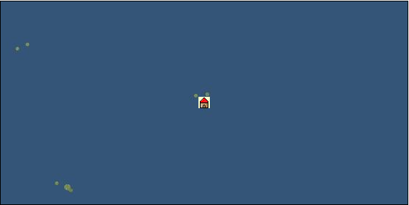

# Port: ヒバオア

import Tabs from '@theme/Tabs';
import TabItem from '@theme/TabItem';

## General Information

| Attribute | Details |
| :--- | :--- |
| **Port Name** | Hiva Oa |
| **Port Type** | port of alliance |
| **Region** | Caribbean/Central America |
| **Sea Area** | central pacific basin |
| **Required Language** | Oceanian languages |
| **Coordinates** | （10133，5007） |
| **Investment Reward** | [Lot (NO.14)](Items/Consumables/Consumables-Treasure-Chests/item_2901.md) （必要投資額：500,000ドゥカード） |

### Available Facilities

| guild | intermediary | exchange | tool shop | workshop craftsman | Painter | sculptor | peddler |
| --- | --- | --- | --- | --- | --- | --- | --- |
|   |   | ○ | ○ |   |   |   |   |
| Shipyard Master | Lumbermaker | Sail-maker | weapon craftsman | master | TavernFemale | archive | salesperson |
| --- | --- | --- | --- | --- | --- | --- | --- |
|   |   |   |   | ○ |   |   |   |
| Shipwright | 銀行 | street worker | 王宮 | Trading post | church | suburbs | translator |
| --- | --- | --- | --- | --- | --- | --- | --- |
| ○ | ○ |   |   |   |   |   |   |

### Description
A town on Hiva Oa Island in the southern part of the Marquesas Islands. It is a volcanic island characterized by a unique mountain range. Although it is in the tropics, the climate is warm and comfortable throughout the year due to the influence of the cool South Equatorial Current. Cultural area: West coast of Central and South America (music is from Oceania, but the Tavern menu is from the west coast of Central and South America)

<Tabs>
  <TabItem value="trade_goods_sales" label="Trade Goods Sales">

| item | group | purchase price | 同盟時 | remarks |
| --- | --- | --- | --- | --- |
| [Cassava](Items/Trade Goods/TradeGoods-Foodstuffs/item_1805.md) | [Trading items (food items)](Categories/category_3.md) | (68) | 60 |  |
| [coconut](Items/Trade Goods/TradeGoods-Sunddries/item_96.md) | [Trading goods (hobby goods)](Categories/category_10.md) | (292) | 256 |  |
| [taro](Items/Trade Goods/TradeGoods-Foodstuffs/item_1960.md) | [Trading items (food items)](Categories/category_3.md) | (77) | 68 |  |
| [banana](Items/Trade Goods/TradeGoods-Sunddries/item_1947.md) | [Trading goods (hobby goods)](Categories/category_10.md) | (150) | 132 |  |
| 要投資（必要投資額：400,000） |
| [vanilla](Items/Trade Goods/TradeGoods-Spices/item_1810.md) | [Trading Goods (Spices)](Categories/category_12.md) | (362) | 317 |  |
| [papaya](Items/Trade Goods/TradeGoods-Sunddries/item_1948.md) | [Trading goods (hobby goods)](Categories/category_10.md) | (347) | 304 |  |
| 要投資（必要投資額：180,000） |
| [mango](Items/Trade Goods/TradeGoods-Sunddries/item_2095.md) | [Trading goods (hobby goods)](Categories/category_10.md) | (361) | 316 |  |
| 要投資（必要投資額：400,000） |
| [魚肉](Items/Trade Goods/TradeGoods-Foodstuffs/item_10.md) | [Trading items (food items)](Categories/category_3.md) | 146 | 128 |  |
  </TabItem>
  <TabItem value="sale_specialty" label="Sale (Specialty)">

| item | group | sale price | 同盟時 | remarks |
| --- | --- | --- | --- | --- |

#### [Trading Goods (Dye)](Categories/category_2.md)

| [Indian indigo](Items/Trade Goods/TradeGoods-Dye/item_157.md) | [Trading Goods (Dye)](Categories/category_2.md) | 911 | (1,024) |  |

#### [交易品（調味料）](Categories/category_4.md)

| [tamarind](Items/Trade Goods/TradeGoods-Seasonings/item_1968.md) | [交易品（調味料）](Categories/category_4.md) | 1,605 | (1,805) |  |

#### [Trading products (medical products)](Categories/category_6.md)

| [calamus](Items/Trade Goods/TradeGoods-Medicine/item_3427.md) | [Trading products (medical products)](Categories/category_6.md) | 23,000 | (25,877) |  |

#### [交易品（酒類）](Categories/category_9.md)

| [Taiwan rice wine](Items/Trade Goods/TradeGoods-Alcohol/item_3672.md) | [交易品（酒類）](Categories/category_9.md) | 23,645 | (26,603) |  |

#### [Trading goods (hobby goods)](Categories/category_10.md)

| [durian](Items/Trade Goods/TradeGoods-Sunddries/item_1949.md) | [Trading goods (hobby goods)](Categories/category_10.md) | 1,937 | (2,179) |  |
| [macadamia nuts](Items/Trade Goods/TradeGoods-Sunddries/item_2282.md) | [Trading goods (hobby goods)](Categories/category_10.md) | 740 | (832) |  |
| [black tea](Items/Trade Goods/TradeGoods-Sunddries/item_675.md) | [Trading goods (hobby goods)](Categories/category_10.md) | 2,414 | (2,716) |  |
| [raspberry](Items/Trade Goods/TradeGoods-Sunddries/item_5419.md) | [Trading goods (hobby goods)](Categories/category_10.md) | 3,963 | (4,458) |  |

#### [Trading Goods (Spices)](Categories/category_11.md)

| [eucalyptus](Items/Trade Goods/TradeGoods-Perfume/item_2278.md) | [Trading Goods (Spices)](Categories/category_11.md) | 696 | (783) |  |
| [sandalwood](Items/Trade Goods/TradeGoods-Perfume/item_771.md) | [Trading Goods (Spices)](Categories/category_11.md) | 3,850 | (4,331) |  |
| 非同盟時100% |

#### [Trading Goods (Spices)](Categories/category_12.md)

| [pepper](Items/Trade Goods/TradeGoods-Spices/item_58.md) | [Trading Goods (Spices)](Categories/category_12.md) | 3,402 | (3,827) |  |
| [nutmeg](Items/Trade Goods/TradeGoods-Spices/item_1969.md) | [Trading Goods (Spices)](Categories/category_12.md) | 4,465 | (5,023) |  |
| [mace](Items/Trade Goods/TradeGoods-Spices/item_2100.md) | [Trading Goods (Spices)](Categories/category_12.md) | 5,043 | (5,673) |  |

#### [Trading Items (Gemstones)](Categories/category_15.md)

| [sapphire](Items/Trade Goods/TradeGoods-Gems/item_676.md) | [Trading Items (Gemstones)](Categories/category_15.md) | 6,450 | (7,256) |  |
| [amethyst](Items/Trade Goods/TradeGoods-Gems/item_3434.md) | [Trading Items (Gemstones)](Categories/category_15.md) | 12,841 | (14,447) |  |

#### [交易品（織物）](Categories/category_20.md)

| [indian chintz](Items/Trade Goods/TradeGoods-Fabrics/item_159.md) | [交易品（織物）](Categories/category_20.md) | 2,062 | (2,319) |  |
| [Nishijin textile](Items/Trade Goods/TradeGoods-Fabrics/item_3431.md) | [交易品（織物）](Categories/category_20.md) | 22,800 | (25,652) |  |
  </TabItem>
  <TabItem value="sale_no_specialty" label="Sale (No Specialty)">

| item | group | sale price | 同盟時 | remarks |
| --- | --- | --- | --- | --- |

#### [Trading items (food items)](Categories/category_3.md)

| [sardine](Items/Trade Goods/TradeGoods-Foodstuffs/item_39.md) | [Trading items (food items)](Categories/category_3.md) | 14 | (15) |  |
| [Yellowfin horse mackerel](Items/Trade Goods/TradeGoods-Foodstuffs/item_1532.md) | [Trading items (food items)](Categories/category_3.md) | 500 | (562) |  |
| [soybeans](Items/Trade Goods/TradeGoods-Foodstuffs/item_1958.md) | [Trading items (food items)](Categories/category_3.md) | 102 | (114) |  |
| [red bean](Items/Trade Goods/TradeGoods-Foodstuffs/item_123.md) | [Trading items (food items)](Categories/category_3.md) | 90 | (101) |  |

#### [Trading Goods (Spices)](Categories/category_12.md)

| [cumin](Items/Trade Goods/TradeGoods-Spices/item_156.md) | [Trading Goods (Spices)](Categories/category_12.md) | 1,164 | (1,309) |  |
| [ginger](Items/Trade Goods/TradeGoods-Spices/item_112.md) | [Trading Goods (Spices)](Categories/category_12.md) | 714 | (803) |  |
| [mint](Items/Trade Goods/TradeGoods-Spices/item_816.md) | [Trading Goods (Spices)](Categories/category_12.md) | 224 | (252) |  |

#### [Trading goods (artificial goods)](Categories/category_13.md)

| [embroidery thread](Items/Trade Goods/TradeGoods-Luxuries/item_898.md) | [Trading goods (artificial goods)](Categories/category_13.md) | 2,066 | (2,324) |  |
  </TabItem>
  <TabItem value="guild_&_others" label="Guild & Others">

| item | group | Sales price | Handling NPC | remarks |
| --- | --- | --- | --- | --- |
| There is no sales information for the item |
| --- |
  </TabItem>
  <TabItem value="toolman" label="Toolman">

| item | group | Sales price | Handling NPC | remarks |
| --- | --- | --- | --- | --- |

#### [Equipment (belongings)](Categories/category_27.md)

| [木槍](Items/Equipment/Equipment-Weapon/item_438.md) | [Equipment (belongings)](Categories/category_27.md) | 34,400 | tool shop owner |  |
| [hunter's spear](Items/Equipment/Equipment-Weapon/item_655.md) | [Equipment (belongings)](Categories/category_27.md) | 38,700 | tool shop owner |  |

#### [Consumables (land battle/deck battle)](Categories/category_29.md)

| [boomerang](Items/Consumables/Consumables-Landbattle/item_454.md) | [Consumables (land battle/deck battle)](Categories/category_29.md) | 150 | tool shop owner |  |
| [strong adhesive oil](Items/Consumables/Consumables-Landbattle/item_662.md) | [Consumables (land battle/deck battle)](Categories/category_29.md) | 200 | tool shop owner |  |
| [catapult](Items/Consumables/Consumables-Landbattle/item_311.md) | [Consumables (land battle/deck battle)](Categories/category_29.md) | 30 | tool shop owner |  |
| [Assortment of therapeutic drugs](Items/Consumables/Consumables-Landbattle/item_564.md) | [Consumables (land battle/deck battle)](Categories/category_29.md) | 900 | tool shop owner |  |
| [secret cure](Items/Consumables/Consumables-Landbattle/item_563.md) | [Consumables (land battle/deck battle)](Categories/category_29.md) | 600 | tool shop owner |  |

#### [Consumables (skill activation)](Categories/category_31.md)

| [fishing gear](Items/Consumables/Consumables-Skill/item_79.md) | [Consumables (skill activation)](Categories/category_31.md) | 2,500 | tool shop owner |  |

#### [Consumables (request documents)](Categories/category_45.md)

| [Pharmaceutical purchase order](Items/Consumables/Consumables-Documents/item_4924.md) | [Consumables (request documents)](Categories/category_45.md) | 20,000 | tool shop owner |  |
  </TabItem>
  <TabItem value="Tavern Master" label="Tavern Master">

| item | group | Sales price | Handling NPC | remarks |
| --- | --- | --- | --- | --- |

#### [recipe book](Categories/category_22.md)

| [Oceania traditional cuisine collection](Items/Recipe Book/item_2286.md) | [recipe book](Categories/category_22.md) | Fixed recipe | Tavern Master |  |
  </TabItem>
</Tabs>