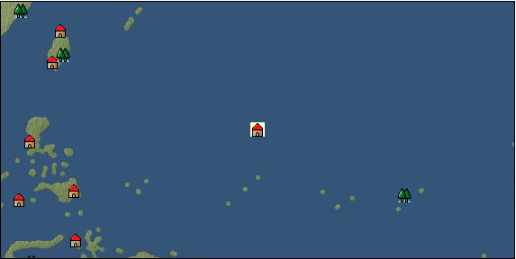

# Port: グアム

import Tabs from '@theme/Tabs';
import TabItem from '@theme/TabItem';

## General Information

| Attribute | Details |
| :--- | :--- |
| **Port Name** | Guam |
| **Port Type** | port of alliance |
| **Region** | Southeast Asia |
| **Sea Area** | East Caroline Basin |
| **Required Language** | Oceanian languages |
| **Coordinates** | （6584，4219） |
| **Investment Reward** | [Lot (NO.14)](Items/Consumables/Consumables-Treasure-Chests/item_2901.md) （必要投資額：500,000ドゥカード） |

### Available Facilities

| guild | intermediary | exchange | tool shop | workshop craftsman | Painter | sculptor | peddler |
| --- | --- | --- | --- | --- | --- | --- | --- |
|   |   | ○ | ○ |   |   |   |   |
| Shipyard Master | Lumbermaker | Sail-maker | weapon craftsman | master | TavernFemale | archive | salesperson |
| --- | --- | --- | --- | --- | --- | --- | --- |
|   |   |   |   | ○ |   |   |   |
| Shipwright | 銀行 | street worker | 王宮 | Trading post | church | suburbs | translator |
| --- | --- | --- | --- | --- | --- | --- | --- |
| ○ | ○ | ○ |   |   |   |   |   |

### Description
A city on the island of Guam, located at the southernmost tip of the Mariana Islands. With its hot and humid summer, you can swim in the sea all year round. Magellan also visited this area during his circumnavigation of the world. *Although it is Southeast Asia on the map, Indochina and Southeast Asian specialty products are treated as specialty products. Tuna comes out with an investment of 8,000,000 Cultural area: Oceania

<Tabs>
  <TabItem value="trade_goods_sales" label="Trade Goods Sales">

| item | group | purchase price | 同盟時 | remarks |
| --- | --- | --- | --- | --- |
| [Cassava](Items/Trade Goods/TradeGoods-Foodstuffs/item_1805.md) | [Trading items (food items)](Categories/category_3.md) | 65 | (57) |  |
| [coconut](Items/Trade Goods/TradeGoods-Sunddries/item_96.md) | [Trading goods (hobby goods)](Categories/category_10.md) | 276 | (242) |  |
| [coral](Items/Trade Goods/TradeGoods-Gems/item_141.md) | [Trading Items (Gemstones)](Categories/category_15.md) | 3,099 | (2,712) |  |
| 要投資（必要投資額：180,000） |
| [banana](Items/Trade Goods/TradeGoods-Sunddries/item_1947.md) | [Trading goods (hobby goods)](Categories/category_10.md) | 150 | 132 |  |
| 要投資（必要投資額：320,000） |
| [Tuna](Items/Trade Goods/TradeGoods-Foodstuffs/item_765.md) | [Trading items (food items)](Categories/category_3.md) | (5,200) | 4,550 |  |
| Required investment (required investment amount: 8,000,000) I could see it with an investment of 8M |
| [coconut oil](Items/Trade Goods/TradeGoods-Seasonings/item_446.md) | [交易品（調味料）](Categories/category_4.md) | 198 | (174) |  |
  </TabItem>
  <TabItem value="sale_specialty" label="Sale (Specialty)">

| item | group | sale price | 同盟時 | remarks |
| --- | --- | --- | --- | --- |

#### [交易品（繊維）](Categories/category_1.md)

| [Panya](Items/Trade Goods/TradeGoods-Fibers/item_2097.md) | 交易品（繊維） | (424) | 494 |  |
| [feather](Items/Trade Goods/TradeGoods-Fibers/item_585.md) | 交易品（繊維） | (946) | 1,103 |  |
| 同盟時98%=1080 |
| [deerskin](Items/Trade Goods/TradeGoods-Fibers/item_3648.md) | 交易品（繊維） | (4,545) | 5,303 |  |

#### [Trading Goods (Dye)](Categories/category_2.md)

| [Indian indigo](Items/Trade Goods/TradeGoods-Dye/item_157.md) | Trading Goods (Dye) | (604) | 704 |  |
| 同盟時82%=577 |
| [Shorou](Items/Trade Goods/TradeGoods-Dye/item_3691.md) | Trading Goods (Dye) | (4,510) | 5,262 |  |
| [turmeric](Items/Trade Goods/TradeGoods-Dye/item_1433.md) | Trading Goods (Dye) | (186) | 216 |  |
| [mangosteen](Items/Trade Goods/TradeGoods-Dye/item_1973.md) | Trading Goods (Dye) | (744) | 868 |  |

#### [交易品（調味料）](Categories/category_4.md)

| [Nampula](Items/Trade Goods/TradeGoods-Seasonings/item_1972.md) | 交易品（調味料） | (258) | 300 |  |

#### [Trading products (medical products)](Categories/category_6.md)

| [Korean ginseng](Items/Trade Goods/TradeGoods-Medicine/item_3738.md) | Trading products (medical products) | 14,513 | (16,328) |  |
| After implementation in China |

#### [Trading products (precious metals)](Categories/category_8.md)

| [platinum](Items/Trade Goods/TradeGoods-Metals/item_2178.md) | Trading products (precious metals) | 5,159 | (5,804) |  |
| [Jinguashijin](Items/Trade Goods/TradeGoods-Metals/item_3693.md) | Trading products (precious metals) | (4,627) | 5,398 |  |

#### [交易品（酒類）](Categories/category_9.md)

| [Taiwan rice wine](Items/Trade Goods/TradeGoods-Alcohol/item_3672.md) | 交易品（酒類） | 1 | (1) |  |
| Selling price is 0 |

#### [Trading goods (hobby goods)](Categories/category_10.md)

| [durian](Items/Trade Goods/TradeGoods-Sunddries/item_1949.md) | Trading goods (hobby goods) | (538) | 627 |  |
| [eggplant](Items/Trade Goods/TradeGoods-Sunddries/item_3426.md) | Trading goods (hobby goods) | (4,457) | 5,200 |  |
| [black tea](Items/Trade Goods/TradeGoods-Sunddries/item_675.md) | Trading goods (hobby goods) | (951) | 1,109 |  |
| 同盟時92%=1020 |

#### [Trading Goods (Spices)](Categories/category_11.md)

| [Hamanasu](Items/Trade Goods/TradeGoods-Perfume/item_3692.md) | Trading Goods (Spices) | (513) | 598 |  |
| [patchouli](Items/Trade Goods/TradeGoods-Perfume/item_1963.md) | Trading Goods (Spices) | (1,406) | 1,640 |  |
| [benzoin](Items/Trade Goods/TradeGoods-Perfume/item_1962.md) | Trading Goods (Spices) | (940) | 1,096 |  |
| [sandalwood](Items/Trade Goods/TradeGoods-Perfume/item_771.md) | Trading Goods (Spices) | (1,791) | 2,089 |  |
| 同盟時79%=1650 |

#### [Trading Goods (Spices)](Categories/category_12.md)

| [cloves](Items/Trade Goods/TradeGoods-Spices/item_1092.md) | Trading Goods (Spices) | (492) | 574 |  |
| [pepper](Items/Trade Goods/TradeGoods-Spices/item_58.md) | Trading Goods (Spices) | (530) | 618 |  |
| 同盟時103%=636 |
| [nutmeg](Items/Trade Goods/TradeGoods-Spices/item_1969.md) | Trading Goods (Spices) | 569 | 595 |  |
| [mace](Items/Trade Goods/TradeGoods-Spices/item_2100.md) | Trading Goods (Spices) | (700) | 816 |  |
| [Grapefruit](Items/Trade Goods/TradeGoods-Spices/item_3422.md) | Trading Goods (Spices) | (4,343) | 5,067 |  |

#### [Trading goods (artificial goods)](Categories/category_13.md)

| [Tumbaga](Items/Trade Goods/TradeGoods-Luxuries/item_3028.md) | Trading goods (artificial goods) | (10,756) | 12,550 |  |

#### [Trading Items (Gemstones)](Categories/category_15.md)

| [jade](Items/Trade Goods/TradeGoods-Gems/item_2015.md) | Trading Items (Gemstones) | (2,063) | 2,407 |  |
| 同盟時128%=3080 |
| [alexandrite](Items/Trade Goods/TradeGoods-Gems/item_4429.md) | Trading Items (Gemstones) | 11,138 | (12,531) |  |
| [ruby](Items/Trade Goods/TradeGoods-Gems/item_773.md) | Trading Items (Gemstones) | (4,685) | 5,466 |  |

#### [Trading Items (Arms)](Categories/category_16.md)

| [Japanese sword](Items/Trade Goods/TradeGoods-Weapons/item_3437.md) | Trading Items (Arms) | (4,397) | 5,130 |  |

#### [Trading Items (Firearms)](Categories/category_17.md)

| [tanegashima gun](Items/Trade Goods/TradeGoods-Firearms/item_3423.md) | Trading Items (Firearms) | 4,649 | 5,209 |  |

#### [Trading Goods (Livestock)](Categories/category_18.md)

| [boar](Items/Trade Goods/TradeGoods-Livestock/item_3476.md) | Trading Goods (Livestock) | (5,110) | 5,962 |  |

#### [交易品（工業品）](Categories/category_19.md)

| [paint](Items/Trade Goods/TradeGoods-Wares/item_3411.md) | 交易品（工業品） | (1,124) | 1,311 |  |

#### [交易品（織物）](Categories/category_20.md)

| [indian chintz](Items/Trade Goods/TradeGoods-Fabrics/item_159.md) | 交易品（織物） | (1,408) | 1,642 |  |
| 同盟時78%=1280 |
| [java chintz](Items/Trade Goods/TradeGoods-Fabrics/item_1970.md) | 交易品（織物） | (725) | 845 |  |
| 同盟時726=86% |
  </TabItem>
  <TabItem value="sale_no_specialty" label="Sale (No Specialty)">

| item | group | sale price | 同盟時 | remarks |
| --- | --- | --- | --- | --- |

#### [交易品（繊維）](Categories/category_1.md)

| [cotton](Items/Trade Goods/TradeGoods-Fibers/item_610.md) | 交易品（繊維） | 654 | 724 |  |
| [numb](Items/Trade Goods/TradeGoods-Fibers/item_900.md) | 交易品（繊維） | 12 | (13) |  |

#### [Trading items (food items)](Categories/category_3.md)

| [kangaroo meat](Items/Trade Goods/TradeGoods-Foodstuffs/item_2285.md) | Trading items (food items) | 342 | (384) |  |
| [taro](Items/Trade Goods/TradeGoods-Foodstuffs/item_1960.md) | Trading items (food items) | 97 | (109) |  |

#### [交易品（調味料）](Categories/category_4.md)

| [anchovies](Items/Trade Goods/TradeGoods-Seasonings/item_3004.md) | 交易品（調味料） | 161 | (181) |  |
| [coconut vinegar](Items/Trade Goods/TradeGoods-Seasonings/item_1988.md) | 交易品（調味料） | 442 | (497) |  |

#### [Trading Items (Iron Stone)](Categories/category_7.md)

| [iron ore](Items/Trade Goods/TradeGoods-Minerals/item_146.md) | Trading Items (Iron Stone) | 653 | 653 |  |

#### [Trading products (precious metals)](Categories/category_8.md)

| [gold](Items/Trade Goods/TradeGoods-Metals/item_659.md) | Trading products (precious metals) | 5,113 | 5,122 |  |

#### [Trading goods (hobby goods)](Categories/category_10.md)

| [papaya](Items/Trade Goods/TradeGoods-Sunddries/item_1948.md) | Trading goods (hobby goods) | (318) | 371 |  |

#### [Trading Goods (Spices)](Categories/category_12.md)

| [coriander](Items/Trade Goods/TradeGoods-Spices/item_1044.md) | Trading Goods (Spices) | (513) | 598 |  |

#### [Trading goods (artificial goods)](Categories/category_13.md)

| [embroidery thread](Items/Trade Goods/TradeGoods-Luxuries/item_898.md) | Trading goods (artificial goods) | (1,892) | 2,207 |  |
| 同盟時63%=1390 |

#### [Trading Items (Gemstones)](Categories/category_15.md)

| [pearl](Items/Trade Goods/TradeGoods-Gems/item_769.md) | Trading Items (Gemstones) | (4,728) | 5,516 |  |

#### [交易品（工業品）](Categories/category_19.md)

| [iron material](Items/Trade Goods/TradeGoods-Wares/item_268.md) | 交易品（工業品） | (804) | 937 |  |
  </TabItem>
  <TabItem value="guild_&_others" label="Guild & Others">

| item | group | Sales price | Handling NPC | remarks |
| --- | --- | --- | --- | --- |
| There is no sales information for the item |
| --- |
  </TabItem>
  <TabItem value="toolman" label="Toolman">

| item | group | Sales price | Handling NPC | remarks |
| --- | --- | --- | --- | --- |

#### [recipe book](Categories/category_22.md)

| [Traditional cuisine of tropical islands Volume 2](Items/Recipe Book/item_4697.md) | recipe book | 100,000 | tool shop owner |  |

#### [Equipment (belongings)](Categories/category_27.md)

| [木槍](Items/Equipment/Equipment-Weapon/item_438.md) | Equipment (belongings) | 34,400 | tool shop owner |  |
| Combat type |
| [hunter's spear](Items/Equipment/Equipment-Weapon/item_655.md) | Equipment (belongings) | 38,700 | tool shop owner |  |

#### [Consumables (land battle/deck battle)](Categories/category_29.md)

| [boomerang](Items/Consumables/Consumables-Landbattle/item_454.md) | Consumables (land battle/deck battle) | 150 | tool shop owner |  |
| [strong adhesive oil](Items/Consumables/Consumables-Landbattle/item_662.md) | Consumables (land battle/deck battle) | 200 | tool shop owner |  |
| [catapult](Items/Consumables/Consumables-Landbattle/item_311.md) | Consumables (land battle/deck battle) | 30 | tool shop owner |  |
| [Assortment of therapeutic drugs](Items/Consumables/Consumables-Landbattle/item_564.md) | Consumables (land battle/deck battle) | 900 | tool shop owner |  |
| [secret cure](Items/Consumables/Consumables-Landbattle/item_563.md) | Consumables (land battle/deck battle) | 600 | tool shop owner |  |

#### [Consumables (skill activation)](Categories/category_31.md)

| [fishing gear](Items/Consumables/Consumables-Skill/item_79.md) | Consumables (skill activation) | 2,500 | tool shop owner |  |

#### [Consumables (request documents)](Categories/category_45.md)

| [Pharmaceutical purchase order](Items/Consumables/Consumables-Documents/item_4924.md) | Consumables (request documents) | 20,000 | tool shop owner |  |
  </TabItem>
  <TabItem value="Tavern Master" label="Tavern Master">

| item | group | Sales price | Handling NPC | remarks |
| --- | --- | --- | --- | --- |

#### [recipe book](Categories/category_22.md)

| [Oceania traditional cuisine collection](Items/Recipe Book/item_2286.md) | recipe book | Fixed recipe | Tavern Master |  |
  </TabItem>
</Tabs>