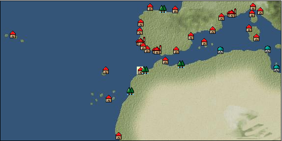

# Port: カサブランカ

import Tabs from '@theme/Tabs';
import TabItem from '@theme/TabItem';

## General Information

| Attribute | Details |
| :--- | :--- |
| **Port Name** | casablanca |
| **Port Type** | port of alliance |
| **Region** | western europe |
| **Sea Area** | off the coast of lisbon |
| **Required Language** | portuguese |
| **Coordinates** | （15773，3445） |
| **Investment Reward** | [Easy and nutritious bean dishes](Items/Recipe Book/item_755.md) （必要投資額：105,000ドゥカード） |

### Available Facilities

| guild | intermediary | exchange | tool shop | workshop craftsman | Painter | sculptor | peddler |
| --- | --- | --- | --- | --- | --- | --- | --- |
|   |   | ○ | ○ |   |   |   |   |
| Shipyard Master | Lumbermaker | Sail-maker | weapon craftsman | master | TavernFemale | archive | salesperson |
| --- | --- | --- | --- | --- | --- | --- | --- |
|   |   |   |   | ○ |   |   |   |
| Shipwright | 銀行 | street worker | 王宮 | Trading post | church | suburbs | translator |
| --- | --- | --- | --- | --- | --- | --- | --- |
| ○ | ○ | ○ |   |   |   |   |   |

### Description
A small city located in the northwest of the African continent. It was once home to a Berber dynasty and was a very prosperous trading city. It was destroyed by the Portuguese in the mid-15th century, so no trace of it remains. *Arabic is also spoken Cultural area: Iberia

<Tabs>
  <TabItem value="trade_goods_sales" label="Trade Goods Sales">

| item | group | purchase price | 同盟時 | remarks |
| --- | --- | --- | --- | --- |
| [fava beans](Items/Trade Goods/TradeGoods-Foodstuffs/item_102.md) | [Trading items (food items)](Categories/category_3.md) | 57 | 52 |  |
| [olive](Items/Trade Goods/TradeGoods-Foodstuffs/item_47.md) | [Trading items (food items)](Categories/category_3.md) | 253 | (222) |  |
| 要投資（必要投資額：600,000） EO第4章で追加 |
| [onion](Items/Trade Goods/TradeGoods-Foodstuffs/item_28.md) | [Trading items (food items)](Categories/category_3.md) | 82 | 72 |  |
| [Ryushu incense](Items/Trade Goods/TradeGoods-Perfume/item_101.md) | [Trading Goods (Spices)](Categories/category_11.md) | 3,569 | 3,213 |  |
| [陸稲](Items/Trade Goods/TradeGoods-Foodstuffs/item_100.md) | [Trading items (food items)](Categories/category_3.md) | 41 | (36) |  |
  </TabItem>
  <TabItem value="sale_specialty" label="Sale (Specialty)">

| item | group | sale price | 同盟時 | remarks |
| --- | --- | --- | --- | --- |

#### [交易品（繊維）](Categories/category_1.md)

| [feather](Items/Trade Goods/TradeGoods-Fibers/item_585.md) | 交易品（繊維） | (701) | 817 |  |

#### [Trading items (food items)](Categories/category_3.md)

| [buckwheat](Items/Trade Goods/TradeGoods-Foodstuffs/item_3430.md) | Trading items (food items) | (32,521) | 37,947 |  |
| [Chinese noodles](Items/Trade Goods/TradeGoods-Foodstuffs/item_3906.md) | Trading items (food items) | (23,097) | 26,950 |  |

#### [Trading products (medical products)](Categories/category_6.md)

| [Saikaku](Items/Trade Goods/TradeGoods-Medicine/item_1959.md) | Trading products (medical products) | 5,037 | (5,667) |  |
| [heath](Items/Trade Goods/TradeGoods-Medicine/item_63.md) | Trading products (medical products) | (333) | 388 |  |
| [Centennial grass](Items/Trade Goods/TradeGoods-Medicine/item_5503.md) | Trading products (medical products) | (9,529) | 11,118 |  |

#### [交易品（酒類）](Categories/category_9.md)

| [whiskey](Items/Trade Goods/TradeGoods-Alcohol/item_1.md) | 交易品（酒類） | (780) | 910 |  |
| [tequila](Items/Trade Goods/TradeGoods-Alcohol/item_108.md) | 交易品（酒類） | (1,840) | 2,146 |  |
| [Andong soju](Items/Trade Goods/TradeGoods-Alcohol/item_3757.md) | 交易品（酒類） | (22,854) | 26,667 |  |
| [Sake](Items/Trade Goods/TradeGoods-Alcohol/item_3424.md) | 交易品（酒類） | (34,361) | 40,094 |  |

#### [Trading goods (hobby goods)](Categories/category_10.md)

| [Aigyoku](Items/Trade Goods/TradeGoods-Sunddries/item_3677.md) | Trading goods (hobby goods) | (22,235) | 25,944 |  |
| [cacao](Items/Trade Goods/TradeGoods-Sunddries/item_140.md) | Trading goods (hobby goods) | (1,180) | 1,376 |  |
| [tobacco](Items/Trade Goods/TradeGoods-Sunddries/item_109.md) | Trading goods (hobby goods) | (1,307) | 1,524 |  |

#### [Trading Goods (Spices)](Categories/category_11.md)

| [gardenia](Items/Trade Goods/TradeGoods-Perfume/item_1091.md) | Trading Goods (Spices) | (32,031) | 37,375 |  |
| [geranium](Items/Trade Goods/TradeGoods-Perfume/item_145.md) | Trading Goods (Spices) | 1,100 | (1,237) |  |
| [Tang Muxiang](Items/Trade Goods/TradeGoods-Perfume/item_593.md) | Trading Goods (Spices) | 1,730 | (1,946) |  |
| [sandalwood](Items/Trade Goods/TradeGoods-Perfume/item_771.md) | Trading Goods (Spices) | 3,820 | (4,297) |  |
| [龍脳](Items/Trade Goods/TradeGoods-Perfume/item_1676.md) | Trading Goods (Spices) | 2,705 | (3,043) |  |

#### [Trading Goods (Spices)](Categories/category_12.md)

| [cloves](Items/Trade Goods/TradeGoods-Spices/item_1092.md) | Trading Goods (Spices) | 20,500 | 13,397 |  |
| [Kouzuku](Items/Trade Goods/TradeGoods-Spices/item_3690.md) | Trading Goods (Spices) | (23,442) | 27,353 |  |
| [pepper](Items/Trade Goods/TradeGoods-Spices/item_58.md) | Trading Goods (Spices) | (12,399) | 14,467 |  |
| [nutmeg](Items/Trade Goods/TradeGoods-Spices/item_1969.md) | Trading Goods (Spices) | 21,633 | 14,343 |  |
| [mace](Items/Trade Goods/TradeGoods-Spices/item_2100.md) | Trading Goods (Spices) | (12,698) | 14,816 |  |
| [Grapefruit](Items/Trade Goods/TradeGoods-Spices/item_3422.md) | Trading Goods (Spices) | (34,594) | 40,366 |  |

#### [Trading goods (artificial goods)](Categories/category_13.md)

| [Tumbaga](Items/Trade Goods/TradeGoods-Luxuries/item_3028.md) | Trading goods (artificial goods) | 19,125 | (21,517) |  |
| [Song Baici](Items/Trade Goods/TradeGoods-Luxuries/item_3904.md) | Trading goods (artificial goods) | (24,829) | 28,971 |  |
| [lacquerware](Items/Trade Goods/TradeGoods-Luxuries/item_3435.md) | Trading goods (artificial goods) | (36,034) | 42,046 |  |
| [brass work](Items/Trade Goods/TradeGoods-Luxuries/item_5561.md) | Trading goods (artificial goods) | (4,531) | 5,286 |  |

#### [Trading Items (Gemstones)](Categories/category_15.md)

| [aventurine](Items/Trade Goods/TradeGoods-Gems/item_678.md) | Trading Items (Gemstones) | 4,620 | (5,198) |  |
| [opal](Items/Trade Goods/TradeGoods-Gems/item_2006.md) | Trading Items (Gemstones) | (5,494) | 6,410 |  |
| [sapphire](Items/Trade Goods/TradeGoods-Gems/item_676.md) | Trading Items (Gemstones) | 10,000 | (11,251) |  |
| [diamond](Items/Trade Goods/TradeGoods-Gems/item_449.md) | Trading Items (Gemstones) | 5,917 | (6,657) |  |
| [amethyst](Items/Trade Goods/TradeGoods-Gems/item_3434.md) | Trading Items (Gemstones) | (37,007) | 43,182 |  |

#### [Trading Items (Firearms)](Categories/category_17.md)

| [tanegashima gun](Items/Trade Goods/TradeGoods-Firearms/item_3423.md) | Trading Items (Firearms) | 33,174 | 38,558 |  |

#### [交易品（工業品）](Categories/category_19.md)

| [Japanese paper](Items/Trade Goods/TradeGoods-Wares/item_3438.md) | 交易品（工業品） | (24,768) | 28,900 |  |
| [bamboo](Items/Trade Goods/TradeGoods-Wares/item_3899.md) | 交易品（工業品） | (24,526) | 28,618 |  |
| [rosewood](Items/Trade Goods/TradeGoods-Wares/item_5559.md) | 交易品（工業品） | (9,350) | 10,910 |  |

#### [交易品（織物）](Categories/category_20.md)

| [Awaiyo](Items/Trade Goods/TradeGoods-Fabrics/item_3002.md) | 交易品（織物） | (8,477) | 9,891 |  |
| [damask](Items/Trade Goods/TradeGoods-Fabrics/item_614.md) | 交易品（織物） | 4,550 | (5,119) |  |
| [flannel](Items/Trade Goods/TradeGoods-Fabrics/item_149.md) | 交易品（織物） | 1,546 | (1,739) |  |
| [persian rug](Items/Trade Goods/TradeGoods-Fabrics/item_606.md) | 交易品（織物） | 8,103 | (9,116) |  |
| [Nishijin textile](Items/Trade Goods/TradeGoods-Fabrics/item_3431.md) | 交易品（織物） | (35,480) | 41,400 |  |
  </TabItem>
  <TabItem value="sale_no_specialty" label="Sale (No Specialty)">

| item | group | sale price | 同盟時 | remarks |
| --- | --- | --- | --- | --- |

#### [交易品（繊維）](Categories/category_1.md)

| [fur](Items/Trade Goods/TradeGoods-Fibers/item_634.md) | 交易品（繊維） | (2,001) | 2,334 |  |
| [raw silk](Items/Trade Goods/TradeGoods-Fibers/item_677.md) | 交易品（繊維） | 2,269 | (2,552) |  |
| [wool](Items/Trade Goods/TradeGoods-Fibers/item_5.md) | 交易品（繊維） | (390) | 454 |  |
| [numb](Items/Trade Goods/TradeGoods-Fibers/item_900.md) | 交易品（繊維） | 12 | (13) |  |

#### [Trading Goods (Dye)](Categories/category_2.md)

| [ward](Items/Trade Goods/TradeGoods-Dye/item_57.md) | Trading Goods (Dye) | 1,100 | (1,237) |  |

#### [Trading items (food items)](Categories/category_3.md)

| [duck meat](Items/Trade Goods/TradeGoods-Foodstuffs/item_32.md) | Trading items (food items) | 419 | 466 |  |
| [sugar cane](Items/Trade Goods/TradeGoods-Foodstuffs/item_93.md) | Trading items (food items) | 232 | (261) |  |
| [cheese](Items/Trade Goods/TradeGoods-Foodstuffs/item_20.md) | Trading items (food items) | 402 | (452) |  |
| [egg](Items/Trade Goods/TradeGoods-Foodstuffs/item_40.md) | Trading items (food items) | 34 | 36 |  |
| [beef](Items/Trade Goods/TradeGoods-Foodstuffs/item_26.md) | Trading items (food items) | (565) | 659 |  |
| [mutton](Items/Trade Goods/TradeGoods-Foodstuffs/item_33.md) | Trading items (food items) | (414) | 483 |  |
| [pork](Items/Trade Goods/TradeGoods-Foodstuffs/item_41.md) | Trading items (food items) | 327 | (367) |  |
| [魚肉](Items/Trade Goods/TradeGoods-Foodstuffs/item_10.md) | Trading items (food items) | 156 | (175) |  |
| [chicken meat](Items/Trade Goods/TradeGoods-Foodstuffs/item_29.md) | Trading items (food items) | 340 | 377 |  |

#### [交易品（調味料）](Categories/category_4.md)

| [almond oil](Items/Trade Goods/TradeGoods-Seasonings/item_578.md) | 交易品（調味料） | 640 | (720) |  |
| [olive oil](Items/Trade Goods/TradeGoods-Seasonings/item_48.md) | 交易品（調味料） | 385 | 408 |  |
| [butter](Items/Trade Goods/TradeGoods-Seasonings/item_3.md) | 交易品（調味料） | (341) | 397 |  |
| [wine vinegar](Items/Trade Goods/TradeGoods-Seasonings/item_429.md) | 交易品（調味料） | 579 | (651) |  |
| [salt](Items/Trade Goods/TradeGoods-Seasonings/item_42.md) | 交易品（調味料） | (229) | 267 |  |
| [sugar](Items/Trade Goods/TradeGoods-Seasonings/item_94.md) | 交易品（調味料） | (799) | 932 |  |

#### [交易品（雑貨）](Categories/category_5.md)

| [Japanese books](Items/Trade Goods/TradeGoods-Misc/item_3439.md) | 交易品（雑貨） | 33,982 | (38,233) |  |
| [Western books](Items/Trade Goods/TradeGoods-Misc/item_293.md) | 交易品（雑貨） | 709 | (797) |  |

#### [Trading products (medical products)](Categories/category_6.md)

| [mercury agent](Items/Trade Goods/TradeGoods-Medicine/item_703.md) | Trading products (medical products) | 1,400 | (1,575) |  |

#### [Trading Items (Shishi)](Categories/category_7.md)

| [cinnabar](Items/Trade Goods/TradeGoods-Minerals/item_154.md) | [Trading Items (Iron Stone)](Categories/category_7.md) | 931 | (1,047) |  |
| [iron ore](Items/Trade Goods/TradeGoods-Minerals/item_146.md) | Trading Items (Shishi) | 752 | 784 |  |

#### [Trading products (precious metals)](Categories/category_8.md)

| [gold](Items/Trade Goods/TradeGoods-Metals/item_659.md) | Trading products (precious metals) | (7,424) | 8,662 |  |

#### [交易品（酒類）](Categories/category_9.md)

| [vodka](Items/Trade Goods/TradeGoods-Alcohol/item_579.md) | 交易品（酒類） | (630) | 734 |  |
| [Beer](Items/Trade Goods/TradeGoods-Alcohol/item_2.md) | 交易品（酒類） | 374 | (420) |  |
| [fruit brandy](Items/Trade Goods/TradeGoods-Alcohol/item_1440.md) | 交易品（酒類） | (545) | 635 |  |
| [brandy](Items/Trade Goods/TradeGoods-Alcohol/item_9.md) | 交易品（酒類） | 743 | 761 |  |
| [palm wine](Items/Trade Goods/TradeGoods-Alcohol/item_436.md) | 交易品（酒類） | (414) | 482 |  |
| [rum](Items/Trade Goods/TradeGoods-Alcohol/item_139.md) | 交易品（酒類） | (642) | 749 |  |
| [liqueur](Items/Trade Goods/TradeGoods-Alcohol/item_18.md) | 交易品（酒類） | 641 | 643 |  |
| [wine](Items/Trade Goods/TradeGoods-Alcohol/item_11.md) | 交易品（酒類） | (445) | 519 |  |

#### [Trading goods (hobby goods)](Categories/category_10.md)

| [almond](Items/Trade Goods/TradeGoods-Sunddries/item_367.md) | Trading goods (hobby goods) | 188 | (211) |  |
| [walnut](Items/Trade Goods/TradeGoods-Sunddries/item_522.md) | Trading goods (hobby goods) | 523 | (588) |  |
| [coffee](Items/Trade Goods/TradeGoods-Sunddries/item_445.md) | Trading goods (hobby goods) | (450) | 525 |  |
| [hazelnut](Items/Trade Goods/TradeGoods-Sunddries/item_125.md) | Trading goods (hobby goods) | 464 | (522) |  |

#### [Trading Goods (Spices)](Categories/category_11.md)

| [lira](Items/Trade Goods/TradeGoods-Perfume/item_30.md) | Trading Goods (Spices) | (672) | 783 |  |

#### [Trading Goods (Spices)](Categories/category_12.md)

| [oregano](Items/Trade Goods/TradeGoods-Spices/item_430.md) | Trading Goods (Spices) | (454) | 529 |  |
| [garlic](Items/Trade Goods/TradeGoods-Spices/item_526.md) | Trading Goods (Spices) | 327 | 335 |  |
| [Sesame](Items/Trade Goods/TradeGoods-Spices/item_437.md) | Trading Goods (Spices) | (286) | 333 |  |
| [saffron](Items/Trade Goods/TradeGoods-Spices/item_845.md) | Trading Goods (Spices) | 2,378 | (2,675) |  |
| [basil](Items/Trade Goods/TradeGoods-Spices/item_126.md) | Trading Goods (Spices) | (154) | 179 |  |
| [parsley](Items/Trade Goods/TradeGoods-Spices/item_46.md) | Trading Goods (Spices) | (132) | 154 |  |
| [rosemary](Items/Trade Goods/TradeGoods-Spices/item_428.md) | Trading Goods (Spices) | (334) | 389 |  |

#### [Trading goods (artificial goods)](Categories/category_13.md)

| [coral work](Items/Trade Goods/TradeGoods-Luxuries/item_595.md) | Trading goods (artificial goods) | 2,829 | (3,182) |  |
| [lapidary work](Items/Trade Goods/TradeGoods-Luxuries/item_153.md) | Trading goods (artificial goods) | 4,220 | (4,747) |  |
| [皮革製品](Items/Trade Goods/TradeGoods-Luxuries/item_12.md) | Trading goods (artificial goods) | 1,133 | (1,274) |  |

#### [Trading Items (Gemstones)](Categories/category_15.md)

| [coral](Items/Trade Goods/TradeGoods-Gems/item_141.md) | Trading Items (Gemstones) | 2,906 | (3,269) |  |
| [ruby](Items/Trade Goods/TradeGoods-Gems/item_773.md) | Trading Items (Gemstones) | (9,856) | 11,500 |  |
| [crystal](Items/Trade Goods/TradeGoods-Gems/item_893.md) | Trading Items (Gemstones) | (1,457) | 1,700 |  |
| [ivory](Items/Trade Goods/TradeGoods-Gems/item_699.md) | Trading Items (Gemstones) | 2,430 | (2,734) |  |

#### [Trading Items (Arms)](Categories/category_16.md)

| [crossbow](Items/Trade Goods/TradeGoods-Weapons/item_537.md) | Trading Items (Arms) | 1,050 | 1,070 |  |
| [dagger](Items/Trade Goods/TradeGoods-Weapons/item_143.md) | Trading Items (Arms) | 886 | (996) |  |

#### [Trading Items (Firearms)](Categories/category_17.md)

| [arquebus gun](Items/Trade Goods/TradeGoods-Firearms/item_14.md) | Trading Items (Firearms) | 1,780 | (2,002) |  |
| [musket gun](Items/Trade Goods/TradeGoods-Firearms/item_584.md) | Trading Items (Firearms) | 2,355 | (2,649) |  |
| [大砲](Items/Trade Goods/TradeGoods-Firearms/item_4.md) | Trading Items (Firearms) | 3,090 | (3,476) |  |
| [bullet](Items/Trade Goods/TradeGoods-Firearms/item_13.md) | Trading Items (Firearms) | 869 | (977) |  |
| [cannonball](Items/Trade Goods/TradeGoods-Firearms/item_144.md) | Trading Items (Firearms) | 1,400 | (1,575) |  |

#### [Trading Goods (Livestock)](Categories/category_18.md)

| [duck](Items/Trade Goods/TradeGoods-Livestock/item_38.md) | Trading Goods (Livestock) | 66 | (74) |  |
| [cow](Items/Trade Goods/TradeGoods-Livestock/item_17.md) | Trading Goods (Livestock) | 343 | (385) |  |
| [chicken](Items/Trade Goods/TradeGoods-Livestock/item_252.md) | Trading Goods (Livestock) | (48) | 55 |  |
| [pig](Items/Trade Goods/TradeGoods-Livestock/item_37.md) | Trading Goods (Livestock) | 67 | (75) |  |

#### [交易品（工業品）](Categories/category_19.md)

| [log](Items/Trade Goods/TradeGoods-Wares/item_846.md) | 交易品（工業品） | 132 | (148) |  |
| [wood](Items/Trade Goods/TradeGoods-Wares/item_277.md) | 交易品（工業品） | 842 | 873 |  |
| [水銀](Items/Trade Goods/TradeGoods-Wares/item_15.md) | 交易品（工業品） | 1,176 | (1,323) |  |
| [oil](Items/Trade Goods/TradeGoods-Wares/item_613.md) | 交易品（工業品） | 633 | (712) |  |
| [sulfur](Items/Trade Goods/TradeGoods-Wares/item_66.md) | 交易品（工業品） | (519) | 605 |  |
| [iron material](Items/Trade Goods/TradeGoods-Wares/item_268.md) | 交易品（工業品） | 924 | (1,039) |  |
| [鋼](Items/Trade Goods/TradeGoods-Wares/item_573.md) | 交易品（工業品） | 972 | (1,093) |  |

#### [交易品（織物）](Categories/category_20.md)

| [tweed](Items/Trade Goods/TradeGoods-Fabrics/item_31.md) | 交易品（織物） | (1,208) | 1,409 |  |
| [velvet](Items/Trade Goods/TradeGoods-Fabrics/item_902.md) | 交易品（織物） | (2,835) | 3,308 |  |
| [cotton fabric](Items/Trade Goods/TradeGoods-Fabrics/item_571.md) | 交易品（織物） | 1,065 | (1,198) |  |
  </TabItem>
  <TabItem value="guild_&_others" label="Guild & Others">

| item | group | Sales price | Handling NPC | remarks |
| --- | --- | --- | --- | --- |
| There is no sales information for the item |
| --- |
  </TabItem>
  <TabItem value="toolman" label="Toolman">

| item | group | Sales price | Handling NPC | remarks |
| --- | --- | --- | --- | --- |

#### [Equipment (belongings)](Categories/category_27.md)

| [matchlock shooting gun](Items/Equipment/Equipment-Weapon/item_103.md) | Equipment (belongings) | 3,000 | tool shop owner |  |

#### [Consumables (land battle/deck battle)](Categories/category_29.md)

| [tear gas powder bag](Items/Consumables/Consumables-Landbattle/item_104.md) | Consumables (land battle/deck battle) | 150 | tool shop owner |  |

#### [Consumables (skill activation)](Categories/category_31.md)

| [fishing gear](Items/Consumables/Consumables-Skill/item_79.md) | Consumables (skill activation) | 2,500 | tool shop owner |  |
| [釣餌](Items/Consumables/Consumables-Skill/item_307.md) | Consumables (skill activation) | 10 | tool shop owner |  |

#### [Consumables (request documents)](Categories/category_45.md)

| [spice purchase order](Items/Consumables/Consumables-Documents/item_4918.md) | Consumables (request documents) | 60,000 | tool shop owner |  |
  </TabItem>
  <TabItem value="shipyard" label="Shipyard">

### Shipwright

| item | group | Sales price | Handling NPC | remarks |
| --- | --- | --- | --- | --- |

#### [recipe book](Categories/category_22.md)

| [木製装材製造法](Items/Recipe Book/item_3567.md) | recipe book | Fixed recipe | Shipwright |  |
| 要投資（必要投資額：660,000） |
  </TabItem>
</Tabs>