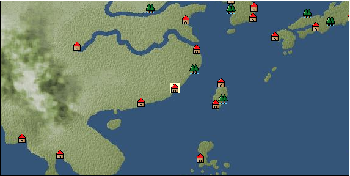

# Port: 泉州

import Tabs from '@theme/Tabs';
import TabItem from '@theme/TabItem';

## General Information

| Attribute | Details |
| :--- | :--- |
| **Port Name** | Quanzhou |
| **Port Type** | port of alliance |
| **Region** | east asia |
| **Sea Area** | western east asia |
| **Required Language** | Chinese |
| **Coordinates** | （5405，3809） |
| **Investment Reward** |  |

### Available Facilities

| guild | intermediary | exchange | tool shop | workshop craftsman | Painter | sculptor | peddler |
| --- | --- | --- | --- | --- | --- | --- | --- |
|   |   | ○ | ○ |   |   |   |   |
| Shipyard Master | Lumbermaker | Sail-maker | weapon craftsman | master | TavernFemale | archive | salesperson |
| --- | --- | --- | --- | --- | --- | --- | --- |
| ○ |   |   |   | ○ |   |   |   |
| Shipwright | 銀行 | street worker | 王宮 | Trading post | church | suburbs | translator |
| --- | --- | --- | --- | --- | --- | --- | --- |
| ○ | ○ | ○ |   |   |   |   |   |

### Description
The pronunciation is "chuwancho". A city that once prospered as a base for maritime trade. At the end of the Jin Dynasty, many immigrants came from the Central Plains, and the technology and culture of the Central Plains has been passed down.

<Tabs>
  <TabItem value="trade_goods_sales" label="Trade Goods Sales">

| item | group | purchase price | 同盟時 | remarks |
| --- | --- | --- | --- | --- |
| [Osmanthus](Items/Trade Goods/TradeGoods-Perfume/item_3925.md) | [Trading Goods (Spices)](Categories/category_11.md) | [Edit Purchase Price](Ports/port_170.md) |  |
| [star anise](Items/Trade Goods/TradeGoods-Spices/item_3908.md) | [Trading Goods (Spices)](Categories/category_12.md) | [Edit Purchase Price](Ports/port_170.md) |  |
| [Basho](Items/Trade Goods/TradeGoods-Fibers/item_3862.md) | [交易品（繊維）](Categories/category_1.md) | [Edit Purchase Price](Ports/port_170.md) |  |
| [Locao](Items/Trade Goods/TradeGoods-Dye/item_3909.md) | [Trading Goods (Dye)](Categories/category_2.md) | [Edit Purchase Price](Ports/port_170.md) |  |
| [donkey](Items/Trade Goods/TradeGoods-Livestock/item_3924.md) | [Trading Goods (Livestock)](Categories/category_18.md) | [Edit Purchase Price](Ports/port_170.md) |  |
| [chinese books](Items/Trade Goods/TradeGoods-Misc/item_3927.md) | [交易品（雑貨）](Categories/category_5.md) | [Edit Purchase Price](Ports/port_170.md) |  |
| [chinese calligraphy](Items/Trade Goods/TradeGoods-Art/item_3926.md) | [交易品（美術品）](Categories/category_14.md) | [Edit Purchase Price](Ports/port_170.md) |  |
| [Chinese tea](Items/Trade Goods/TradeGoods-Sunddries/item_3907.md) | [Trading goods (hobby goods)](Categories/category_10.md) | [Edit Purchase Price](Ports/port_170.md) |  |
| [Chinese noodles](Items/Trade Goods/TradeGoods-Foodstuffs/item_3906.md) | [Trading items (food items)](Categories/category_3.md) | [Edit Purchase Price](Ports/port_170.md) |  |
| [Cordyceps sinensis](Items/Trade Goods/TradeGoods-Medicine/item_3839.md) | [Trading products (medical products)](Categories/category_6.md) | [Edit Purchase Price](Ports/port_170.md) |  |
| [monocular gun](Items/Trade Goods/TradeGoods-Firearms/item_3916.md) | [Trading Items (Firearms)](Categories/category_17.md) | [Edit Purchase Price](Ports/port_170.md) |  |
| [唐錦](Items/Trade Goods/TradeGoods-Fabrics/item_3896.md) | [交易品（織物）](Categories/category_20.md) | [Edit Purchase Price](Ports/port_170.md) |  |
| [Song Baici](Items/Trade Goods/TradeGoods-Luxuries/item_3904.md) | [Trading goods (artificial goods)](Categories/category_13.md) | [Edit Purchase Price](Ports/port_170.md) |  |
| [湖筆](Items/Trade Goods/TradeGoods-Luxuries/item_3898.md) | [Trading goods (artificial goods)](Categories/category_13.md) | [Edit Purchase Price](Ports/port_170.md) |  |
| Cultural contribution level is required to be displayed (confirmed by me 44,000) |
| [bamboo](Items/Trade Goods/TradeGoods-Wares/item_3899.md) | [交易品（工業品）](Categories/category_19.md) | [Edit Purchase Price](Ports/port_170.md) |  |
| [紹興酒](Items/Trade Goods/TradeGoods-Alcohol/item_3882.md) | [交易品（酒類）](Categories/category_9.md) | [Edit Purchase Price](Ports/port_170.md) |  |
| [mutton fat white jade](Items/Trade Goods/TradeGoods-Gems/item_3903.md) | [Trading Items (Gemstones)](Categories/category_15.md) | [Edit Purchase Price](Ports/port_170.md) |  |
| [Bean sauce](Items/Trade Goods/TradeGoods-Seasonings/item_3875.md) | [交易品（調味料）](Categories/category_4.md) | [Edit Purchase Price](Ports/port_170.md) |  |
| [red copper ore](Items/Trade Goods/TradeGoods-Minerals/item_3863.md) | [Trading Items (Iron Stone)](Categories/category_7.md) | [Edit Purchase Price](Ports/port_170.md) |  |
| [雲南銀](Items/Trade Goods/TradeGoods-Metals/item_3905.md) | [Trading products (precious metals)](Categories/category_8.md) | [Edit Purchase Price](Ports/port_170.md) |  |
| [Blue dragon sword](Items/Trade Goods/TradeGoods-Weapons/item_3923.md) | [Trading Items (Arms)](Categories/category_16.md) | [Edit Purchase Price](Ports/port_170.md) |  |
  </TabItem>
  <TabItem value="sale_specialty" label="Sale (Specialty)">

| item | group | sale price | 同盟時 | remarks |
| --- | --- | --- | --- | --- |
| Sales information for trade items with specialty judgment set is not registered. |
  </TabItem>
  <TabItem value="sale_no_specialty" label="Sale (No Specialty)">

| item | group | sale price | 同盟時 | remarks |
| --- | --- | --- | --- | --- |
| There is no information on the sale of trade goods. |
  </TabItem>
  <TabItem value="guild_&_others" label="Guild & Others">

| item | group | Sales price | Handling NPC | remarks |
| --- | --- | --- | --- | --- |
| There is no sales information for the item |
| --- |
  </TabItem>
  <TabItem value="toolman" label="Toolman">

| item | group | Sales price | Handling NPC | remarks |
| --- | --- | --- | --- | --- |

#### [recipe book](Categories/category_22.md)

| [East Asian accessories/sewing edition](Items/Recipe Book/item_3387.md) | recipe book | 800,000 | tool shop owner |  |

#### [Equipment (head)](Categories/category_23.md)

| [Square flat towel](Items/Equipment/Equipment-Head/item_3607.md) | Equipment (head) | 102,000 | tool shop owner |  |
| [頭巾](Items/Equipment/Equipment-Head/item_3551.md) | Equipment (head) | 82,000 | tool shop owner |  |

#### [Equipment (body)](Categories/category_24.md)

| [Hufu](Items/Equipment/Equipment-Body/item_3874.md) | Equipment (body) | 154,000 | tool shop owner |  |

#### [Equipment (legs)](Categories/category_26.md)

| [shoe](Items/Equipment/Equipment-Feet/item_3603.md) | Equipment (legs) | 56,000 | tool shop owner |  |
| [shoes](Items/Equipment/Equipment-Feet/item_3471.md) | Equipment (legs) | 48,000 | tool shop owner |  |

#### [Consumables (land battle/deck battle)](Categories/category_29.md)

| [strong adhesive oil](Items/Consumables/Consumables-Landbattle/item_662.md) | Consumables (land battle/deck battle) | 200 | tool shop owner |  |
| [torch for throwing](Items/Consumables/Consumables-Landbattle/item_313.md) | Consumables (land battle/deck battle) | 150 | tool shop owner |  |
| [secret cure](Items/Consumables/Consumables-Landbattle/item_563.md) | Consumables (land battle/deck battle) | 600 | tool shop owner |  |

#### [Consumables (skill activation)](Categories/category_31.md)

| [fishing gear](Items/Consumables/Consumables-Skill/item_79.md) | Consumables (skill activation) | 2,500 | tool shop owner |  |
  </TabItem>
  <TabItem value="shipyard" label="Shipyard">

### Shipyard Master

| item | group | Sales price | Handling NPC | remarks |
| --- | --- | --- | --- | --- |

#### [Boat](Categories/category_43.md)

| [寧波船](Items/Ships/item_3915.md) | Boat | 16,200,000 | Shipyard Master |  |
| [Cruise ship](Items/Ships/item_3659.md) | Boat | 15,800,000 | Shipyard Master |  |
| [armed sand barge](Items/Ships/item_3914.md) | Boat | 7,600,000 | Shipyard Master |  |
| [sand ship](Items/Ships/item_3913.md) | Boat | 7,500,000 | Shipyard Master |  |
| [wide ship for transportation](Items/Ships/item_3658.md) | Boat | 15,600,000 | Shipyard Master |  |
  </TabItem>
</Tabs>