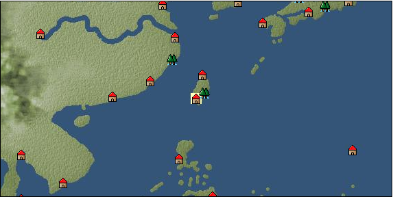

# Port: 安平

import Tabs from '@theme/Tabs';
import TabItem from '@theme/TabItem';

## General Information

| Attribute | Details |
| :--- | :--- |
| **Port Name** | Anping |
| **Port Type** | port of alliance |
| **Region** | east asia |
| **Sea Area** | eastern east asia |
| **Required Language** | Chinese |
| **Coordinates** | （5672，3914） |
| **Investment Reward** |  |

### Available Facilities

| guild | intermediary | exchange | tool shop | workshop craftsman | Painter | sculptor | peddler |
| --- | --- | --- | --- | --- | --- | --- | --- |
|   |   | ○ | ○ | ○ |   |   |   |
| Shipyard Master | Lumbermaker | Sail-maker | weapon craftsman | master | TavernFemale | archive | salesperson |
| --- | --- | --- | --- | --- | --- | --- | --- |
| ○ | ○ | ○ | ○ | ○ | ○ | ○ | ○ |
| Shipwright | 銀行 | street worker | 王宮 | Trading post | church | suburbs | translator |
| --- | --- | --- | --- | --- | --- | --- | --- |
| ○ | ○ | ○ |   |   |   |   |   |

### Description
The reading is "Anpin". The city is the political and military center of Taiwan Island. It was determined to be a suitable place to anchor ships, and it became a large port. ★Trade is not possible unless Taiwan's contribution level is increased Tavern girl: Mei Chuan (unreportable) Cheng Tian Fu (Zheng Chenggong) Cultural area: Taiwan Island Coordinates corrected on 5/27/2010. Old coordinates (5685, 3935)

<Tabs>
  <TabItem value="trade_goods_sales" label="Trade Goods Sales">

| item | group | purchase price | 同盟時 | remarks |
| --- | --- | --- | --- | --- |
| [Aigyoku](Items/Trade Goods/TradeGoods-Sunddries/item_3677.md) | [Trading goods (hobby goods)](Categories/category_10.md) | [Edit Purchase Price](Ports/port_171.md) |  |
| [Karasumi](Items/Trade Goods/TradeGoods-Foodstuffs/item_3687.md) | [Trading items (food items)](Categories/category_3.md) | [Edit Purchase Price](Ports/port_171.md) |  |
| [Kouzuku](Items/Trade Goods/TradeGoods-Spices/item_3690.md) | [Trading Goods (Spices)](Categories/category_12.md) | [Edit Purchase Price](Ports/port_171.md) |  |
| [Shorou](Items/Trade Goods/TradeGoods-Dye/item_3691.md) | [Trading Goods (Dye)](Categories/category_2.md) | [Edit Purchase Price](Ports/port_171.md) |  |
| [water buffalo](Items/Trade Goods/TradeGoods-Livestock/item_3688.md) | [Trading Goods (Livestock)](Categories/category_18.md) | [Edit Purchase Price](Ports/port_171.md) |  |
| [Hamanasu](Items/Trade Goods/TradeGoods-Perfume/item_3692.md) | [Trading Goods (Spices)](Categories/category_11.md) | [Edit Purchase Price](Ports/port_171.md) |  |
| [Borei](Items/Trade Goods/TradeGoods-Medicine/item_3678.md) | [Trading products (medical products)](Categories/category_6.md) | [Edit Purchase Price](Ports/port_171.md) |  |
| [Lingjiao](Items/Trade Goods/TradeGoods-Foodstuffs/item_3917.md) | [Trading items (food items)](Categories/category_3.md) | [Edit Purchase Price](Ports/port_171.md) |  |
| Contribution 46000+ |
| [Hokutolite](Items/Trade Goods/TradeGoods-Minerals/item_3694.md) | [Trading Items (Iron Stone)](Categories/category_7.md) | [Edit Purchase Price](Ports/port_171.md) |  |
| [taiwan sapphire](Items/Trade Goods/TradeGoods-Gems/item_3695.md) | [Trading Items (Gemstones)](Categories/category_15.md) | [Edit Purchase Price](Ports/port_171.md) |  |
| [taiwan wood carving](Items/Trade Goods/TradeGoods-Art/item_3697.md) | [交易品（美術品）](Categories/category_14.md) | [Edit Purchase Price](Ports/port_171.md) |  |
| [Taiwan rice wine](Items/Trade Goods/TradeGoods-Alcohol/item_3672.md) | [交易品（酒類）](Categories/category_9.md) | [Edit Purchase Price](Ports/port_171.md) |  |
| [Sha Cha Ji](Items/Trade Goods/TradeGoods-Seasonings/item_3689.md) | [交易品（調味料）](Categories/category_4.md) | [Edit Purchase Price](Ports/port_171.md) |  |
| [rattan](Items/Trade Goods/TradeGoods-Wares/item_3701.md) | [交易品（工業品）](Categories/category_19.md) | [Edit Purchase Price](Ports/port_171.md) |  |
| [rattan work](Items/Trade Goods/TradeGoods-Misc/item_3698.md) | [交易品（雑貨）](Categories/category_5.md) | [Edit Purchase Price](Ports/port_171.md) |  |
| [rattan armor](Items/Trade Goods/TradeGoods-Weapons/item_3699.md) | [Trading Items (Arms)](Categories/category_16.md) | [Edit Purchase Price](Ports/port_171.md) |  |
| [Corner work](Items/Trade Goods/TradeGoods-Luxuries/item_3696.md) | [Trading goods (artificial goods)](Categories/category_13.md) | [Edit Purchase Price](Ports/port_171.md) |  |
| [Jinguashijin](Items/Trade Goods/TradeGoods-Metals/item_3693.md) | [Trading products (precious metals)](Categories/category_8.md) | [Edit Purchase Price](Ports/port_171.md) |  |
| [銅手銃](Items/Trade Goods/TradeGoods-Firearms/item_3700.md) | [Trading Items (Firearms)](Categories/category_17.md) | [Edit Purchase Price](Ports/port_171.md) |  |
| [deerskin](Items/Trade Goods/TradeGoods-Fibers/item_3648.md) | [交易品（繊維）](Categories/category_1.md) | [Edit Purchase Price](Ports/port_171.md) |  |
| [麻織物](Items/Trade Goods/TradeGoods-Fabrics/item_3673.md) | [交易品（織物）](Categories/category_20.md) | [Edit Purchase Price](Ports/port_171.md) |  |
  </TabItem>
  <TabItem value="sale_specialty" label="Sale (Specialty)">

| item | group | sale price | 同盟時 | remarks |
| --- | --- | --- | --- | --- |
| Sales information for trade items with specialty judgment set is not registered. |
  </TabItem>
  <TabItem value="sale_no_specialty" label="Sale (No Specialty)">

| item | group | sale price | 同盟時 | remarks |
| --- | --- | --- | --- | --- |
| There is no information on the sale of trade goods. |
  </TabItem>
  <TabItem value="guild_&_others" label="Guild & Others">

| item | group | Sales price | Handling NPC | remarks |
| --- | --- | --- | --- | --- |

#### He Bin

| [Chinese](Skills/Skills-Language/item_3651.md) | [Skills (language)](Categories/category_42.md) | 500,000 | He Bin |  |
  </TabItem>
  <TabItem value="toolman" label="Toolman">

| item | group | Sales price | Handling NPC | remarks |
| --- | --- | --- | --- | --- |

#### [recipe book](Categories/category_22.md)

| [Swordsmith's Secret](Items/Recipe Book/item_3404.md) | [recipe book](Categories/category_22.md) | 2,500,000 | tool shop owner |  |
| [Famous dishes of Taiwan Island](Items/Recipe Book/item_3705.md) | [recipe book](Categories/category_22.md) | 350,000 | tool shop owner |  |
| [調味料大全・秘境編](Items/Recipe Book/item_3403.md) | [recipe book](Categories/category_22.md) | 700,000 | tool shop owner |  |

#### [Equipment (head)](Categories/category_23.md)

| [Ayuyo](Items/Equipment/Equipment-Head/item_3441.md) | [Equipment (head)](Categories/category_23.md) | 102,000 | tool shop owner |  |
| [Babel crown](Items/Equipment/Equipment-Head/item_3601.md) | [Equipment (head)](Categories/category_23.md) | 102,000 | tool shop owner |  |

#### [Equipment (body)](Categories/category_24.md)

| [Straight hem deep clothes](Items/Equipment/Equipment-Body/item_3662.md) | [Equipment (body)](Categories/category_24.md) | 404,000 | tool shop owner |  |
| [Narrow sleeve shirt](Items/Equipment/Equipment-Body/item_3667.md) | [Equipment (body)](Categories/category_24.md) | 404,000 | tool shop owner |  |
| [mattress skirt](Items/Equipment/Equipment-Body/item_3666.md) | [Equipment (body)](Categories/category_24.md) | 154,000 | tool shop owner |  |

#### [Equipment (legs)](Categories/category_26.md)

| [shoe](Items/Equipment/Equipment-Feet/item_3603.md) | [Equipment (legs)](Categories/category_26.md) | 56,000 | tool shop owner |  |
| [shoes](Items/Equipment/Equipment-Feet/item_3471.md) | [Equipment (legs)](Categories/category_26.md) | 48,000 | tool shop owner |  |

#### [Equipment (belongings)](Categories/category_27.md)

| [halberd](Items/Equipment/Equipment-Weapon/item_3684.md) | [Equipment (belongings)](Categories/category_27.md) | 700,000 | tool shop owner |  |

#### [Consumables (land battle/deck battle)](Categories/category_29.md)

| [strong adhesive oil](Items/Consumables/Consumables-Landbattle/item_662.md) | [Consumables (land battle/deck battle)](Categories/category_29.md) | 200 | tool shop owner |  |
| [torch for throwing](Items/Consumables/Consumables-Landbattle/item_313.md) | [Consumables (land battle/deck battle)](Categories/category_29.md) | 150 | tool shop owner |  |
| [Assortment of therapeutic drugs](Items/Consumables/Consumables-Landbattle/item_564.md) | [Consumables (land battle/deck battle)](Categories/category_29.md) | 900 | tool shop owner |  |
| [secret cure](Items/Consumables/Consumables-Landbattle/item_563.md) | [Consumables (land battle/deck battle)](Categories/category_29.md) | 600 | tool shop owner |  |

#### [Consumables (skill activation)](Categories/category_31.md)

| [捕獲網](Items/Consumables/Consumables-Skill/item_315.md) | [Consumables (skill activation)](Categories/category_31.md) | 300 | tool shop owner |  |
| [fishing gear](Items/Consumables/Consumables-Skill/item_79.md) | [Consumables (skill activation)](Categories/category_31.md) | 2,500 | tool shop owner |  |
  </TabItem>
  <TabItem value="kobo_craftsmen" label="Craftsman">

| item | group | Sales price | Handling NPC | remarks |
| --- | --- | --- | --- | --- |

#### [Consumables (condition recovery)](Categories/category_21.md)

| [Nostalgic carillon bell](Items/Consumables/Consumables-Recovery/item_245.md) | [Consumables (condition recovery)](Categories/category_21.md) | 200 | workshop craftsman |  |
| [Ship song sheet music](Items/Consumables/Consumables-Recovery/item_247.md) | [Consumables (condition recovery)](Categories/category_21.md) | 200 | workshop craftsman |  |

#### [recipe book](Categories/category_22.md)

| [Weapons of the Han people and islands](Items/Recipe Book/item_3783.md) | [recipe book](Categories/category_22.md) | Fixed recipe | workshop craftsman |  |

#### [Consumables (other)](Categories/category_44.md)

| [帆塗料](Items/Consumables/Consumables-Other/item_348.md) | [Consumables (other)](Categories/category_44.md) | 500 | workshop craftsman |  |
| [ship paint](Items/Consumables/Consumables-Other/item_347.md) | [Consumables (other)](Categories/category_44.md) | 500 | workshop craftsman |  |
  </TabItem>
  <TabItem value="peddler" label="peddler">

| item | group | Sales price | Handling NPC | remarks |
| --- | --- | --- | --- | --- |

#### [Consumables (condition recovery)](Categories/category_21.md)

| [Nekoirazu](Items/Consumables/Consumables-Recovery/item_70.md) | [Consumables (condition recovery)](Categories/category_21.md) |  | peddler |  |
| [spare sail](Items/Consumables/Consumables-Recovery/item_242.md) | [Consumables (condition recovery)](Categories/category_21.md) |  | peddler |  |
| [reserve rudder](Items/Consumables/Consumables-Recovery/item_243.md) | [Consumables (condition recovery)](Categories/category_21.md) |  | peddler |  |
| [fire extinguishing sand](Items/Consumables/Consumables-Recovery/item_68.md) | [Consumables (condition recovery)](Categories/category_21.md) |  | peddler |  |
| [cotton earplugs](Items/Consumables/Consumables-Recovery/item_85.md) | [Consumables (condition recovery)](Categories/category_21.md) |  | peddler |  |

#### [Consumables (naval/hand-to-hand combat)](Categories/category_30.md)

| [手術道具](Items/Consumables/Consumables-navalhand-to-hand combat/item_80.md) | [Consumables (naval/hand-to-hand combat)](Categories/category_30.md) |  | peddler |  |

#### [Consumables (skill activation)](Categories/category_31.md)

| [life aid](Items/Consumables/Consumables-Skill/item_67.md) | [Consumables (skill activation)](Categories/category_31.md) |  | peddler |  |
| [landmark ribbon](Items/Consumables/Consumables-Skill/item_316.md) | [Consumables (skill activation)](Categories/category_31.md) |  | peddler |  |
  </TabItem>
  <TabItem value="salesperson" label="salesperson">

| item | group | Sales price | Handling NPC | remarks |
| --- | --- | --- | --- | --- |

#### [Consumables (cooking)](Categories/category_32.md)

| [Oachen](Items/Consumables/Consumables-Cooking/item_3718.md) | [Consumables (cooking)](Categories/category_32.md) |  | salesperson |  |
| [Kwon wonton](Items/Consumables/Consumables-Cooking/item_3715.md) | [Consumables (cooking)](Categories/category_32.md) |  | salesperson |  |
| [Chushegao](Items/Consumables/Consumables-Cooking/item_3717.md) | [Consumables (cooking)](Categories/category_32.md) |  | salesperson |  |
| [diquacho](Items/Consumables/Consumables-Cooking/item_3714.md) | [Consumables (cooking)](Categories/category_32.md) |  | salesperson |  |
| [Loken](Items/Consumables/Consumables-Cooking/item_3716.md) | [Consumables (cooking)](Categories/category_32.md) |  | salesperson |  |
  </TabItem>
  <TabItem value="shipyard" label="Shipyard">

### Shipyard Master

| item | group | Sales price | Handling NPC | remarks |
| --- | --- | --- | --- | --- |

#### [recipe book](Categories/category_22.md)

| [East Asian hull manufacturing methods](Items/Recipe Book/item_3406.md) | [recipe book](Categories/category_22.md) | Fixed recipe | Shipyard Master |  |

#### [Boat](Categories/category_43.md)

| [Cruise ship](Items/Ships/item_3659.md) | [Boat](Categories/category_43.md) | 15,800,000 | Shipyard Master |  |
| [Hirofune](Items/Ships/item_3652.md) | [Boat](Categories/category_43.md) | 7,600,000 | Shipyard Master |  |
| [Research wide boat](Items/Ships/item_3657.md) | [Boat](Categories/category_43.md) | 15,200,000 | Shipyard Master |  |
| [護衛用広船](Items/Ships/item_3660.md) | [Boat](Categories/category_43.md) | 16,200,000 | Shipyard Master |  |
| [wide ship for transportation](Items/Ships/item_3658.md) | [Boat](Categories/category_43.md) | 15,600,000 | Shipyard Master |  |

#### [shipbuilding materials](Categories/category_47.md)

| [East Asia medium-sized hull](Items/Shipbuilding FS Material/item_3548.md) | [shipbuilding materials](Categories/category_47.md) | Fixed recipe | Shipyard Master |  |
| [east asia large paddle ship](Items/Shipbuilding FS Material/item_3488.md) | [shipbuilding materials](Categories/category_47.md) | Fixed recipe | Shipyard Master |  |
| [East Asia large hull](Items/Shipbuilding FS Material/item_3487.md) | [shipbuilding materials](Categories/category_47.md) | Fixed recipe | Shipyard Master |  |

### Lumbermaker

| item | group | Sales price | Handling NPC | remarks |
| --- | --- | --- | --- | --- |

#### [Ship parts (additional armor)](Categories/category_35.md)

| [Akagashi board](Items/Ship Parts/Shipparts-Plates/item_3654.md) | [Ship parts (additional armor)](Categories/category_35.md) | 70,000 | Lumbermaker |  |

### Sail-maker

| item | group | Sales price | Handling NPC | remarks |
| --- | --- | --- | --- | --- |

#### [recipe book](Categories/category_22.md)

| [Book of Shipbuilding Materials and Sewing Volume 3](Items/Recipe Book/item_1913.md) | [recipe book](Categories/category_22.md) | Fixed recipe | Sail-maker |  |

#### [Ship parts (auxiliary sails)](Categories/category_33.md)

| [Auxiliary junk sail](Items/Ship Parts/Shipparts-Studding-Sail/item_3653.md) | [Ship parts (auxiliary sails)](Categories/category_33.md) | 12,000 | Sail-maker |  |

#### [shipbuilding materials](Categories/category_47.md)

| [large gaff sail](Items/Shipbuilding FS Material/item_1917.md) | [shipbuilding materials](Categories/category_47.md) | Fixed recipe | Sail-maker |  |
| [large square sail](Items/Shipbuilding FS Material/item_1916.md) | [shipbuilding materials](Categories/category_47.md) | Fixed recipe | Sail-maker |  |
| [large lateen sail](Items/Shipbuilding FS Material/item_1915.md) | [shipbuilding materials](Categories/category_47.md) | Fixed recipe | Sail-maker |  |

### Shipwright

| item | group | Sales price | Handling NPC | remarks |
| --- | --- | --- | --- | --- |

#### [recipe book](Categories/category_22.md)

| [East Asian reinforced board manufacturing method](Items/Recipe Book/item_3472.md) | [recipe book](Categories/category_22.md) | Fixed recipe | Shipwright |  |
  </TabItem>
  <TabItem value="weapon craftsman" label="weapon craftsman">

| item | group | Sales price | Handling NPC | remarks |
| --- | --- | --- | --- | --- |

#### [recipe book](Categories/category_22.md)

| [Book of Shipbuilding Materials and Casting Volume 3](Items/Recipe Book/item_1912.md) | [recipe book](Categories/category_22.md) | Fixed recipe | weapon craftsman |  |

#### [Ship parts (special weapons)](Categories/category_37.md)

| [Boathouse](Items/Ship Parts/Shipparts-Special-Weapons/item_3394.md) | [Ship parts (special weapons)](Categories/category_37.md) | 35,000 | weapon craftsman |  |

#### [Ship parts (cannon)](Categories/category_38.md)

| [仏郎機砲10門](Items/Ship Parts/Shipparts-Cannons/item_3393.md) | [Ship parts (cannon)](Categories/category_38.md) | 200,000 | weapon craftsman |  |
| [仏郎機砲4門](Items/Ship Parts/Shipparts-Cannons/item_3390.md) | [Ship parts (cannon)](Categories/category_38.md) | 32,000 | weapon craftsman |  |
| [仏郎機砲6門](Items/Ship Parts/Shipparts-Cannons/item_3391.md) | [Ship parts (cannon)](Categories/category_38.md) | 70,000 | weapon craftsman |  |
| [仏郎機砲8門](Items/Ship Parts/Shipparts-Cannons/item_3392.md) | [Ship parts (cannon)](Categories/category_38.md) | 130,000 | weapon craftsman |  |

#### [shipbuilding materials](Categories/category_47.md)

| [改良大型砲門](Items/Shipbuilding FS Material/item_1914.md) | [shipbuilding materials](Categories/category_47.md) | Fixed recipe | weapon craftsman |  |
  </TabItem>
  <TabItem value="Tavern Master" label="Tavern Master">

| item | group | Sales price | Handling NPC | remarks |
| --- | --- | --- | --- | --- |

#### [adjutant](Categories/category_46.md)

| [孝偉](Items/Aides/item_3670.md) | [adjutant](Categories/category_46.md) | 100,000 | Tavern Master |  |
| [Mingmei](Items/Aides/item_3669.md) | [adjutant](Categories/category_46.md) | 100,000 | Tavern Master |  |
| [麗月](Items/Aides/item_3668.md) | [adjutant](Categories/category_46.md) | 100,000 | Tavern Master |  |
  </TabItem>
</Tabs>