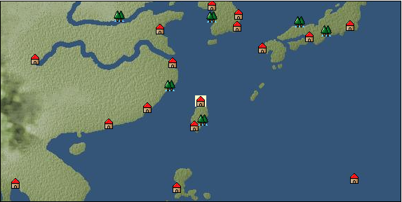

# Port: 淡水

import Tabs from '@theme/Tabs';
import TabItem from '@theme/TabItem';

## General Information

| Attribute | Details |
| :--- | :--- |
| **Port Name** | freshwater |
| **Port Type** | port of alliance |
| **Region** | east asia |
| **Sea Area** | eastern east asia |
| **Required Language** | Chinese |
| **Coordinates** | （5707，3776） |
| **Investment Reward** |  |

### Available Facilities

| guild | intermediary | exchange | tool shop | workshop craftsman | Painter | sculptor | peddler |
| --- | --- | --- | --- | --- | --- | --- | --- |
|   |   | ○ | ○ |   |   |   |   |
| Shipyard Master | Lumbermaker | Sail-maker | weapon craftsman | master | TavernFemale | archive | salesperson |
| --- | --- | --- | --- | --- | --- | --- | --- |
|   |   |   |   | ○ |   |   |   |
| Shipwright | 銀行 | street worker | 王宮 | Trading post | church | suburbs | translator |
| --- | --- | --- | --- | --- | --- | --- | --- |
| ○ | ○ | ○ |   |   |   | ○ |   |

### Description
The reading is "Dancey". It is a city located in the northern part of Taiwan Island, with a large river flowing nearby. It was a town founded by Zheng Chenggong who expelled the Dutch people. Waiter: Jianhong (unreportable) (Help girl: Chu Hime) Suburb: Southeast Tamsui Cultural area: Taiwan Island

<Tabs>
  <TabItem value="trade_goods_sales" label="Trade Goods Sales">

| item | group | purchase price | 同盟時 | remarks |
| --- | --- | --- | --- | --- |
| [Aigyoku](Items/Trade Goods/TradeGoods-Sunddries/item_3677.md) | [Trading goods (hobby goods)](Categories/category_10.md) | [Edit Purchase Price](Ports/port_172.md) |  |
| [Karasumi](Items/Trade Goods/TradeGoods-Foodstuffs/item_3687.md) | [Trading items (food items)](Categories/category_3.md) | [Edit Purchase Price](Ports/port_172.md) |  |
| [Kouzuku](Items/Trade Goods/TradeGoods-Spices/item_3690.md) | [Trading Goods (Spices)](Categories/category_12.md) | [Edit Purchase Price](Ports/port_172.md) |  |
| [Shorou](Items/Trade Goods/TradeGoods-Dye/item_3691.md) | [Trading Goods (Dye)](Categories/category_2.md) | [Edit Purchase Price](Ports/port_172.md) |  |
| [water buffalo](Items/Trade Goods/TradeGoods-Livestock/item_3688.md) | [Trading Goods (Livestock)](Categories/category_18.md) | [Edit Purchase Price](Ports/port_172.md) |  |
| [Hamanasu](Items/Trade Goods/TradeGoods-Perfume/item_3692.md) | [Trading Goods (Spices)](Categories/category_11.md) | [Edit Purchase Price](Ports/port_172.md) |  |
| [Borei](Items/Trade Goods/TradeGoods-Medicine/item_3678.md) | [Trading products (medical products)](Categories/category_6.md) | [Edit Purchase Price](Ports/port_172.md) |  |
| [Hokutolite](Items/Trade Goods/TradeGoods-Minerals/item_3694.md) | [Trading Items (Iron Stone)](Categories/category_7.md) | [Edit Purchase Price](Ports/port_172.md) |  |
| [taiwan sapphire](Items/Trade Goods/TradeGoods-Gems/item_3695.md) | [Trading Items (Gemstones)](Categories/category_15.md) | [Edit Purchase Price](Ports/port_172.md) |  |
| [taiwan wood carving](Items/Trade Goods/TradeGoods-Art/item_3697.md) | [交易品（美術品）](Categories/category_14.md) | [Edit Purchase Price](Ports/port_172.md) |  |
| [Taiwan rice wine](Items/Trade Goods/TradeGoods-Alcohol/item_3672.md) | [交易品（酒類）](Categories/category_9.md) | [Edit Purchase Price](Ports/port_172.md) |  |
| [Sha Cha Ji](Items/Trade Goods/TradeGoods-Seasonings/item_3689.md) | [交易品（調味料）](Categories/category_4.md) | [Edit Purchase Price](Ports/port_172.md) |  |
| [rattan](Items/Trade Goods/TradeGoods-Wares/item_3701.md) | [交易品（工業品）](Categories/category_19.md) | [Edit Purchase Price](Ports/port_172.md) |  |
| [rattan work](Items/Trade Goods/TradeGoods-Misc/item_3698.md) | [交易品（雑貨）](Categories/category_5.md) | [Edit Purchase Price](Ports/port_172.md) |  |
| [rattan armor](Items/Trade Goods/TradeGoods-Weapons/item_3699.md) | [Trading Items (Arms)](Categories/category_16.md) | [Edit Purchase Price](Ports/port_172.md) |  |
| [Corner work](Items/Trade Goods/TradeGoods-Luxuries/item_3696.md) | [Trading goods (artificial goods)](Categories/category_13.md) | [Edit Purchase Price](Ports/port_172.md) |  |
| [Jinguashijin](Items/Trade Goods/TradeGoods-Metals/item_3693.md) | [Trading products (precious metals)](Categories/category_8.md) | [Edit Purchase Price](Ports/port_172.md) |  |
| [金針花](Items/Trade Goods/TradeGoods-Sunddries/item_3739.md) | [Trading goods (hobby goods)](Categories/category_10.md) | [Edit Purchase Price](Ports/port_172.md) |  |
| Contribution 30000+ |
| [銅手銃](Items/Trade Goods/TradeGoods-Firearms/item_3700.md) | [Trading Items (Firearms)](Categories/category_17.md) | [Edit Purchase Price](Ports/port_172.md) |  |
| [deerskin](Items/Trade Goods/TradeGoods-Fibers/item_3648.md) | [交易品（繊維）](Categories/category_1.md) | [Edit Purchase Price](Ports/port_172.md) |  |
| [麻織物](Items/Trade Goods/TradeGoods-Fabrics/item_3673.md) | [交易品（織物）](Categories/category_20.md) | [Edit Purchase Price](Ports/port_172.md) |  |
  </TabItem>
  <TabItem value="sale_specialty" label="Sale (Specialty)">

| item | group | sale price | 同盟時 | remarks |
| --- | --- | --- | --- | --- |
| Sales information for trade items with specialty judgment set is not registered. |
  </TabItem>
  <TabItem value="sale_no_specialty" label="Sale (No Specialty)">

| item | group | sale price | 同盟時 | remarks |
| --- | --- | --- | --- | --- |
| There is no information on the sale of trade goods. |
  </TabItem>
  <TabItem value="guild_&_others" label="Guild & Others">

| item | group | Sales price | Handling NPC | remarks |
| --- | --- | --- | --- | --- |
| There is no sales information for the item |
| --- |
  </TabItem>
  <TabItem value="toolman" label="Toolman">

| item | group | Sales price | Handling NPC | remarks |
| --- | --- | --- | --- | --- |

#### [recipe book](Categories/category_22.md)

| [East Asian accessories and crafts](Items/Recipe Book/item_3409.md) | [recipe book](Categories/category_22.md) | 800,000 | tool shop owner |  |
| [East Asian accessories/sewing edition](Items/Recipe Book/item_3387.md) | [recipe book](Categories/category_22.md) | 800,000 | tool shop owner |  |

#### [Equipment (head)](Categories/category_23.md)

| [Ayuyo](Items/Equipment/Equipment-Head/item_3441.md) | [Equipment (head)](Categories/category_23.md) | 102,000 | tool shop owner |  |
| [Babel crown](Items/Equipment/Equipment-Head/item_3601.md) | [Equipment (head)](Categories/category_23.md) | 102,000 | tool shop owner |  |

#### [Equipment (body)](Categories/category_24.md)

| [mattress skirt](Items/Equipment/Equipment-Body/item_3666.md) | [Equipment (body)](Categories/category_24.md) | 154,000 | tool shop owner |  |

#### [Equipment (legs)](Categories/category_26.md)

| [shoe](Items/Equipment/Equipment-Feet/item_3603.md) | [Equipment (legs)](Categories/category_26.md) | 56,000 | tool shop owner |  |
| [shoes](Items/Equipment/Equipment-Feet/item_3471.md) | [Equipment (legs)](Categories/category_26.md) | 48,000 | tool shop owner |  |

#### [Consumables (land battle/deck battle)](Categories/category_29.md)

| [strong adhesive oil](Items/Consumables/Consumables-Landbattle/item_662.md) | [Consumables (land battle/deck battle)](Categories/category_29.md) | 200 | tool shop owner |  |
| [torch for throwing](Items/Consumables/Consumables-Landbattle/item_313.md) | [Consumables (land battle/deck battle)](Categories/category_29.md) | 150 | tool shop owner |  |
| [secret cure](Items/Consumables/Consumables-Landbattle/item_563.md) | [Consumables (land battle/deck battle)](Categories/category_29.md) | 600 | tool shop owner |  |

#### [Consumables (skill activation)](Categories/category_31.md)

| [fishing gear](Items/Consumables/Consumables-Skill/item_79.md) | [Consumables (skill activation)](Categories/category_31.md) | 2,500 | tool shop owner |  |
  </TabItem>
  <TabItem value="shipyard" label="Shipyard">

### Shipyard Master

| item | group | Sales price | Handling NPC | remarks |
| --- | --- | --- | --- | --- |

#### [recipe book](Categories/category_22.md)

| [East Asian sail making methods](Items/Recipe Book/item_3417.md) | [recipe book](Categories/category_22.md) | Fixed recipe | Shipyard Master |  |

#### [Boat](Categories/category_43.md)

| [Cruise ship](Items/Ships/item_3659.md) | [Boat](Categories/category_43.md) | 15,800,000 | Shipyard Master |  |
| [Hirofune](Items/Ships/item_3652.md) | [Boat](Categories/category_43.md) | 7,600,000 | Shipyard Master |  |
| [Research wide boat](Items/Ships/item_3657.md) | [Boat](Categories/category_43.md) | 15,200,000 | Shipyard Master |  |
| [護衛用広船](Items/Ships/item_3660.md) | [Boat](Categories/category_43.md) | 16,200,000 | Shipyard Master |  |
| [wide ship for transportation](Items/Ships/item_3658.md) | [Boat](Categories/category_43.md) | 15,600,000 | Shipyard Master |  |

#### [shipbuilding materials](Categories/category_47.md)

| [medium junk sail](Items/Shipbuilding FS Material/item_3559.md) | [shipbuilding materials](Categories/category_47.md) | Fixed recipe | Shipyard Master |  |
| [large junk sail](Items/Shipbuilding FS Material/item_3538.md) | [shipbuilding materials](Categories/category_47.md) | Fixed recipe | Shipyard Master |  |
| [small junk sail](Items/Shipbuilding FS Material/item_3558.md) | [shipbuilding materials](Categories/category_47.md) | Fixed recipe | Shipyard Master |  |

### Shipwright

| item | group | Sales price | Handling NPC | remarks |
| --- | --- | --- | --- | --- |

#### [recipe book](Categories/category_22.md)

| [East Asian cabin design methods](Items/Recipe Book/item_3397.md) | [recipe book](Categories/category_22.md) | Fixed recipe | Shipwright |  |

#### [shipbuilding materials](Categories/category_47.md)

| [assault cabin](Items/Shipbuilding FS Material/item_3568.md) | [shipbuilding materials](Categories/category_47.md) | Fixed recipe | Shipwright |  |
| [East Asia trade hold](Items/Shipbuilding FS Material/item_3537.md) | [shipbuilding materials](Categories/category_47.md) | Fixed recipe | Shipwright |  |
  </TabItem>
</Tabs>