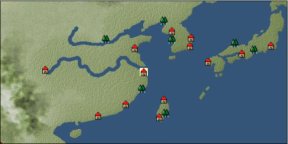

# Port: 杭州

import Tabs from '@theme/Tabs';
import TabItem from '@theme/TabItem';

## General Information

| Attribute | Details |
| :--- | :--- |
| **Port Name** | Hangzhou |
| **Port Type** | port of alliance |
| **Region** | east asia |
| **Sea Area** | western east asia |
| **Required Language** | Chinese |
| **Coordinates** | （5547，3552） |
| **Investment Reward** |  |

### Available Facilities

| guild | intermediary | exchange | tool shop | workshop craftsman | Painter | sculptor | peddler |
| --- | --- | --- | --- | --- | --- | --- | --- |
|   | ○ | ○ | ○ | ○ |   |   |   |
| Shipyard Master | Lumbermaker | Sail-maker | weapon craftsman | master | TavernFemale | archive | salesperson |
| --- | --- | --- | --- | --- | --- | --- | --- |
| ○ | ○ | ○ | ○ | ○ | ○ | ○ | ○ |
| Shipwright | 銀行 | street worker | 王宮 | Trading post | church | suburbs | translator |
| --- | --- | --- | --- | --- | --- | --- | --- |
| ○ | ○ | ○ |   |   | ○ |   |   |

### Description
The pronunciation is "Hancho". It is said that Marco Polo praised the city as a beautiful and gorgeous city. It is one of the birthplaces of civilization and is lined with many temples and historic sites. Tavern woman: Kogumo (unreportable)

<Tabs>
  <TabItem value="trade_goods_sales" label="Trade Goods Sales">

| item | group | purchase price | 同盟時 | remarks |
| --- | --- | --- | --- | --- |
| [Osmanthus](docs/Items/TradeGoods/TradeGoods-Perfume/item_3925.md) | [Trading Goods (Spices)](docs/Categories/category_11.md) | [Edit Purchase Price](docs/Ports/port_173.md) |  |
| [star anise](docs/Items/TradeGoods/TradeGoods-Spices/item_3908.md) | [Trading Goods (Spices)](docs/Categories/category_12.md) | [Edit Purchase Price](docs/Ports/port_173.md) |  |
| [Basho](docs/Items/TradeGoods/TradeGoods-Fibers/item_3862.md) | [交易品（繊維）](docs/Categories/category_1.md) | [Edit Purchase Price](docs/Ports/port_173.md) |  |
| [Locao](docs/Items/TradeGoods/TradeGoods-Dye/item_3909.md) | [Trading Goods (Dye)](docs/Categories/category_2.md) | [Edit Purchase Price](docs/Ports/port_173.md) |  |
| [donkey](docs/Items/TradeGoods/TradeGoods-Livestock/item_3924.md) | [Trading Goods (Livestock)](docs/Categories/category_18.md) | [Edit Purchase Price](docs/Ports/port_173.md) |  |
| [chinese books](docs/Items/TradeGoods/TradeGoods-Misc/item_3927.md) | [交易品（雑貨）](docs/Categories/category_5.md) | [Edit Purchase Price](docs/Ports/port_173.md) |  |
| [chinese calligraphy](docs/Items/TradeGoods/TradeGoods-Art/item_3926.md) | [交易品（美術品）](docs/Categories/category_14.md) | [Edit Purchase Price](docs/Ports/port_173.md) |  |
| [Chinese tea](docs/Items/TradeGoods/TradeGoods-Sunddries/item_3907.md) | [Trading goods (hobby goods)](docs/Categories/category_10.md) | [Edit Purchase Price](docs/Ports/port_173.md) |  |
| [Chinese noodles](docs/Items/TradeGoods/TradeGoods-Foodstuffs/item_3906.md) | [Trading items (food items)](docs/Categories/category_3.md) | [Edit Purchase Price](docs/Ports/port_173.md) |  |
| [Cordyceps sinensis](docs/Items/TradeGoods/TradeGoods-Medicine/item_3839.md) | [Trading products (medical products)](docs/Categories/category_6.md) | [Edit Purchase Price](docs/Ports/port_173.md) |  |
| [monocular gun](docs/Items/TradeGoods/TradeGoods-Firearms/item_3916.md) | [Trading Items (Firearms)](docs/Categories/category_17.md) | [Edit Purchase Price](docs/Ports/port_173.md) |  |
| [Kuresute](docs/Items/TradeGoods/TradeGoods-Luxuries/item_3897.md) | [Trading goods (artificial goods)](docs/Categories/category_13.md) | [Edit Purchase Price](docs/Ports/port_173.md) |  |
| [唐錦](docs/Items/TradeGoods/TradeGoods-Fabrics/item_3896.md) | [交易品（織物）](docs/Categories/category_20.md) | [Edit Purchase Price](docs/Ports/port_173.md) |  |
| [Song Baici](docs/Items/TradeGoods/TradeGoods-Luxuries/item_3904.md) | [Trading goods (artificial goods)](docs/Categories/category_13.md) | [Edit Purchase Price](docs/Ports/port_173.md) |  |
| [bamboo](docs/Items/TradeGoods/TradeGoods-Wares/item_3899.md) | [交易品（工業品）](docs/Categories/category_19.md) | [Edit Purchase Price](docs/Ports/port_173.md) |  |
| [紹興酒](docs/Items/TradeGoods/TradeGoods-Alcohol/item_3882.md) | [交易品（酒類）](docs/Categories/category_9.md) | [Edit Purchase Price](docs/Ports/port_173.md) |  |
| [mutton fat white jade](docs/Items/TradeGoods/TradeGoods-Gems/item_3903.md) | [Trading Items (Gemstones)](docs/Categories/category_15.md) | [Edit Purchase Price](docs/Ports/port_173.md) |  |
| [Bean sauce](docs/Items/TradeGoods/TradeGoods-Seasonings/item_3875.md) | [交易品（調味料）](docs/Categories/category_4.md) | [Edit Purchase Price](docs/Ports/port_173.md) |  |
| [red copper ore](docs/Items/TradeGoods/TradeGoods-Minerals/item_3863.md) | [Trading Items (Iron Stone)](docs/Categories/category_7.md) | [Edit Purchase Price](docs/Ports/port_173.md) |  |
| [雲南銀](docs/Items/TradeGoods/TradeGoods-Metals/item_3905.md) | [Trading products (precious metals)](docs/Categories/category_8.md) | [Edit Purchase Price](docs/Ports/port_173.md) |  |
| [Blue dragon sword](docs/Items/TradeGoods/TradeGoods-Weapons/item_3923.md) | [Trading Items (Arms)](docs/Categories/category_16.md) | [Edit Purchase Price](docs/Ports/port_173.md) |  |
  </TabItem>
  <TabItem value="sale_specialty" label="Sale (Specialty)">

| item | group | sale price | 同盟時 | remarks |
| --- | --- | --- | --- | --- |
| Sales information for trade items with specialty judgment set is not registered. |
  </TabItem>
  <TabItem value="sale_no_specialty" label="Sale (No Specialty)">

| item | group | sale price | 同盟時 | remarks |
| --- | --- | --- | --- | --- |
| There is no information on the sale of trade goods. |
  </TabItem>
  <TabItem value="guild_&_others" label="Guild & Others">

| item | group | Sales price | Handling NPC | remarks |
| --- | --- | --- | --- | --- |
| There is no sales information for the item |
| --- |
  </TabItem>
  <TabItem value="toolman" label="Toolman">

| item | group | Sales price | Handling NPC | remarks |
| --- | --- | --- | --- | --- |

#### [recipe book](docs/Categories/category_22.md)

| [Swordsmith's Secret](docs/Items/RecipeBooks/item_3404.md) | recipe book | 2,500,000 | tool shop owner |  |
| [Famous dishes of southern China](docs/Items/RecipeBooks/item_3880.md) | recipe book | 350,000 | tool shop owner |  |
| [調味料大全・秘境編](docs/Items/RecipeBooks/item_3403.md) | recipe book | 700,000 | tool shop owner |  |

#### [Equipment (head)](docs/Categories/category_23.md)

| [Square flat towel](docs/Items/Equipment/Equipment-Head/item_3607.md) | Equipment (head) | 102,000 | tool shop owner |  |
| [頭巾](docs/Items/Equipment/Equipment-Head/item_3551.md) | Equipment (head) | 82,000 | tool shop owner |  |

#### [Equipment (body)](docs/Categories/category_24.md)

| [official uniform](docs/Items/Equipment/Equipment-Body/item_3872.md) | Equipment (body) | 404,000 | tool shop owner |  |
| [Kosode back](docs/Items/Equipment/Equipment-Body/item_3810.md) | Equipment (body) | 404,000 | tool shop owner |  |
| [Hufu](docs/Items/Equipment/Equipment-Body/item_3874.md) | Equipment (body) | 154,000 | tool shop owner |  |

#### [Equipment (legs)](docs/Categories/category_26.md)

| [shoe](docs/Items/Equipment/Equipment-Feet/item_3603.md) | Equipment (legs) | 56,000 | tool shop owner |  |
| [shoes](docs/Items/Equipment/Equipment-Feet/item_3471.md) | Equipment (legs) | 48,000 | tool shop owner |  |

#### [Equipment (belongings)](docs/Categories/category_27.md)

| [Yan Yue Dao](docs/Items/Equipment/Equipment-Weapon/item_3951.md) | Equipment (belongings) | 700,000 | tool shop owner |  |

#### [Consumables (land battle/deck battle)](docs/Categories/category_29.md)

| [strong adhesive oil](docs/Items/Consumables/Consumables-Landbattle/item_662.md) | Consumables (land battle/deck battle) | 200 | tool shop owner |  |
| [torch for throwing](docs/Items/Consumables/Consumables-Landbattle/item_313.md) | Consumables (land battle/deck battle) | 150 | tool shop owner |  |
| [Assortment of therapeutic drugs](docs/Items/Consumables/Consumables-Landbattle/item_564.md) | Consumables (land battle/deck battle) | 900 | tool shop owner |  |
| [secret cure](docs/Items/Consumables/Consumables-Landbattle/item_563.md) | Consumables (land battle/deck battle) | 600 | tool shop owner |  |

#### [Consumables (skill activation)](docs/Categories/category_31.md)

| [捕獲網](docs/Items/Consumables/Consumables-Skill/item_315.md) | Consumables (skill activation) | 300 | tool shop owner |  |
| [fishing gear](docs/Items/Consumables/Consumables-Skill/item_79.md) | Consumables (skill activation) | 2,500 | tool shop owner |  |
  </TabItem>
  <TabItem value="kobo_craftsmen" label="Craftsman">

| item | group | Sales price | Handling NPC | remarks |
| --- | --- | --- | --- | --- |

#### [Consumables (condition recovery)](docs/Categories/category_21.md)

| [Nostalgic carillon bell](docs/Items/Consumables/Consumables-Recovery/item_245.md) | Consumables (condition recovery) | 200 | workshop craftsman |  |
| [Ship song sheet music](docs/Items/Consumables/Consumables-Recovery/item_247.md) | Consumables (condition recovery) | 200 | workshop craftsman |  |

#### [Consumables (other)](docs/Categories/category_44.md)

| [帆塗料](docs/Items/Consumables/Consumables-Other/item_348.md) | Consumables (other) | 500 | workshop craftsman |  |
| [ship paint](docs/Items/Consumables/Consumables-Other/item_347.md) | Consumables (other) | 500 | workshop craftsman |  |
  </TabItem>
  <TabItem value="peddler" label="peddler">

| item | group | Sales price | Handling NPC | remarks |
| --- | --- | --- | --- | --- |

#### [Consumables (condition recovery)](docs/Categories/category_21.md)

| [Nekoirazu](docs/Items/Consumables/Consumables-Recovery/item_70.md) | Consumables (condition recovery) |  | peddler |  |
| [spare sail](docs/Items/Consumables/Consumables-Recovery/item_242.md) | Consumables (condition recovery) |  | peddler |  |
| [reserve rudder](docs/Items/Consumables/Consumables-Recovery/item_243.md) | Consumables (condition recovery) |  | peddler |  |
| [rope of punishment](docs/Items/Consumables/Consumables-Recovery/item_71.md) | Consumables (condition recovery) |  | peddler |  |
| [fire extinguishing sand](docs/Items/Consumables/Consumables-Recovery/item_68.md) | Consumables (condition recovery) |  | peddler |  |

#### [Consumables (naval/hand-to-hand combat)](docs/Categories/category_30.md)

| [flag of calm](docs/Items/Consumables/Consumables-navalhand-to-hand combat/item_84.md) | Consumables (naval/hand-to-hand combat) |  | peddler |  |

#### [Consumables (skill activation)](docs/Categories/category_31.md)

| [life aid](docs/Items/Consumables/Consumables-Skill/item_67.md) | Consumables (skill activation) |  | peddler |  |
| [landmark ribbon](docs/Items/Consumables/Consumables-Skill/item_316.md) | Consumables (skill activation) |  | peddler |  |
  </TabItem>
  <TabItem value="salesperson" label="salesperson">

| item | group | Sales price | Handling NPC | remarks |
| --- | --- | --- | --- | --- |

#### [Consumables (cooking)](docs/Categories/category_32.md)

| [tousher markyu](docs/Items/Consumables/Consumables-Cooking/item_3974.md) | Consumables (cooking) |  | salesperson |  |
| [steamed stuffed bun](docs/Items/Consumables/Consumables-Cooking/item_3976.md) | Consumables (cooking) |  | salesperson |  |
| [月餅](docs/Items/Consumables/Consumables-Cooking/item_3973.md) | Consumables (cooking) |  | salesperson |  |
| [Almond tofu](docs/Items/Consumables/Consumables-Cooking/item_3975.md) | Consumables (cooking) |  | salesperson |  |
| [Shumai](docs/Items/Consumables/Consumables-Cooking/item_3972.md) | Consumables (cooking) |  | salesperson |  |
  </TabItem>
  <TabItem value="shipyard" label="Shipyard">

### Shipyard Master

| item | group | Sales price | Handling NPC | remarks |
| --- | --- | --- | --- | --- |

#### [recipe book](docs/Categories/category_22.md)

| [East Asian hull manufacturing methods](docs/Items/RecipeBooks/item_3406.md) | recipe book | Fixed recipe | Shipyard Master |  |

#### [Boat](docs/Categories/category_43.md)

| [Da'an houseboat](docs/Items/Ships/item_4205.md) | Boat | 12,000,000 | Shipyard Master |  |
| [寧波船](docs/Items/Ships/item_3915.md) | Boat | 16,200,000 | Shipyard Master |  |
| [armed sand barge](docs/Items/Ships/item_3914.md) | Boat | 7,600,000 | Shipyard Master |  |
| [sand ship](docs/Items/Ships/item_3913.md) | Boat | 7,500,000 | Shipyard Master |  |
| [wide ship for transportation](docs/Items/Ships/item_3658.md) | Boat | 15,600,000 | Shipyard Master |  |

#### [shipbuilding materials](docs/Categories/category_47.md)

| [East Asia large hull](docs/Items/ShipbuildingFS/item_3487.md) | shipbuilding materials | Fixed recipe | Shipyard Master |  |

### Lumbermaker

| item | group | Sales price | Handling NPC | remarks |
| --- | --- | --- | --- | --- |

#### [Ship parts (additional armor)](docs/Categories/category_35.md)

| [Akagashi board](docs/Items/ShipParts/Shipparts-Plates/item_3654.md) | Ship parts (additional armor) | 70,000 | Lumbermaker |  |

### Sail-maker

| item | group | Sales price | Handling NPC | remarks |
| --- | --- | --- | --- | --- |

#### [recipe book](docs/Categories/category_22.md)

| [Book of Shipbuilding Materials and Sewing Volume 3](docs/Items/RecipeBooks/item_1913.md) | recipe book | Fixed recipe | Sail-maker |  |

#### [Ship parts (auxiliary sails)](docs/Categories/category_33.md)

| [Auxiliary junk sail](docs/Items/ShipParts/Shipparts-Studding-Sail/item_3653.md) | Ship parts (auxiliary sails) | 12,000 | Sail-maker |  |
  </TabItem>
  <TabItem value="weapon craftsman" label="weapon craftsman">

| item | group | Sales price | Handling NPC | remarks |
| --- | --- | --- | --- | --- |

#### [Ship parts (special weapons)](docs/Categories/category_37.md)

| [Boathouse](docs/Items/ShipParts/Shipparts-Special-Weapons/item_3394.md) | Ship parts (special weapons) | 35,000 | weapon craftsman |  |

#### [Ship parts (cannon)](docs/Categories/category_38.md)

| [仏郎機砲10門](docs/Items/ShipParts/Shipparts-Cannons/item_3393.md) | Ship parts (cannon) | 200,000 | weapon craftsman |  |
| [仏郎機砲4門](docs/Items/ShipParts/Shipparts-Cannons/item_3390.md) | Ship parts (cannon) | 32,000 | weapon craftsman |  |
| [仏郎機砲6門](docs/Items/ShipParts/Shipparts-Cannons/item_3391.md) | Ship parts (cannon) | 70,000 | weapon craftsman |  |
| [仏郎機砲8門](docs/Items/ShipParts/Shipparts-Cannons/item_3392.md) | Ship parts (cannon) | 130,000 | weapon craftsman |  |
  </TabItem>
</Tabs>