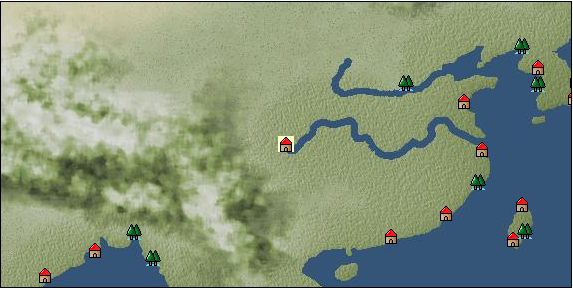

# Port: 重慶

import Tabs from '@theme/Tabs';
import TabItem from '@theme/TabItem';

## General Information

| Attribute | Details |
| :--- | :--- |
| **Port Name** | 重慶 |
| **Port Type** | port of alliance |
| **Region** | east asia |
| **Sea Area** | western east asia |
| **Required Language** | Chinese |
| **Coordinates** | （4764，3533） |
| **Investment Reward** |  |

### Available Facilities

| guild | intermediary | exchange | tool shop | workshop craftsman | Painter | sculptor | peddler |
| --- | --- | --- | --- | --- | --- | --- | --- |
|   |   | ○ | ○ | ○ |   |   |   |
| Shipyard Master | Lumbermaker | Sail-maker | weapon craftsman | master | TavernFemale | archive | salesperson |
| --- | --- | --- | --- | --- | --- | --- | --- |
| ○ | ○ | ○ | ○ | ○ |   |   |   |
| Shipwright | 銀行 | street worker | 王宮 | Trading post | church | suburbs | translator |
| --- | --- | --- | --- | --- | --- | --- | --- |
| ○ | ○ | ○ | ○ |   |   | ○ |   |

### Description
The pronunciation is "Chongchin". The city is located on the upper reaches of the Yangtze River and is surrounded by nature. Summers are extremely hot, but winters are relatively pleasant. It is said that this name was given because there were double auspicious events in this area. Waiter: Xiaofei (unreportable) Grand Governor's Office (Qin Liangyu) Suburbs: Southwest Chongqing (Yundai Mountain ⇔ Chongqing is now possible by coachman)

<Tabs>
  <TabItem value="trade_goods_sales" label="Trade Goods Sales">

| Item | Group | Purchase Price | Allied Price | Remarks |
| --- | --- | --- | --- | --- |
| [Osmanthus](docs/Items/TradeGoods/TradeGoods-Perfume/item_3925.md) | [Trading Goods (Spices)](docs/Categories/category_11.md) | [Edit Purchase Price](docs/Ports/port_174.md) |  |
| [star anise](docs/Items/TradeGoods/TradeGoods-Spices/item_3908.md) | [Trading Goods (Spices)](docs/Categories/category_12.md) | [Edit Purchase Price](docs/Ports/port_174.md) |  |
| [Basho](docs/Items/TradeGoods/TradeGoods-Fibers/item_3862.md) | [交易品（繊維）](docs/Categories/category_1.md) | [Edit Purchase Price](docs/Ports/port_174.md) |  |
| [Locao](docs/Items/TradeGoods/TradeGoods-Dye/item_3909.md) | [Trading Goods (Dye)](docs/Categories/category_2.md) | [Edit Purchase Price](docs/Ports/port_174.md) |  |
| [donkey](docs/Items/TradeGoods/TradeGoods-Livestock/item_3924.md) | [Trading Goods (Livestock)](docs/Categories/category_18.md) | [Edit Purchase Price](docs/Ports/port_174.md) |  |
| [chinese books](docs/Items/TradeGoods/TradeGoods-Misc/item_3927.md) | [交易品（雑貨）](docs/Categories/category_5.md) | [Edit Purchase Price](docs/Ports/port_174.md) |  |
| [chinese calligraphy](docs/Items/TradeGoods/TradeGoods-Art/item_3926.md) | [交易品（美術品）](docs/Categories/category_14.md) | [Edit Purchase Price](docs/Ports/port_174.md) |  |
| [Chinese tea](docs/Items/TradeGoods/TradeGoods-Sunddries/item_3907.md) | [Trading goods (hobby goods)](docs/Categories/category_10.md) | [Edit Purchase Price](docs/Ports/port_174.md) |  |
| [Chinese noodles](docs/Items/TradeGoods/TradeGoods-Foodstuffs/item_3906.md) | [Trading items (food items)](docs/Categories/category_3.md) | [Edit Purchase Price](docs/Ports/port_174.md) |  |
| [Cordyceps sinensis](docs/Items/TradeGoods/TradeGoods-Medicine/item_3839.md) | [Trading products (medical products)](docs/Categories/category_6.md) | [Edit Purchase Price](docs/Ports/port_174.md) |  |
| [monocular gun](docs/Items/TradeGoods/TradeGoods-Firearms/item_3916.md) | [Trading Items (Firearms)](docs/Categories/category_17.md) | [Edit Purchase Price](docs/Ports/port_174.md) |  |
| [唐錦](docs/Items/TradeGoods/TradeGoods-Fabrics/item_3896.md) | [交易品（織物）](docs/Categories/category_20.md) | [Edit Purchase Price](docs/Ports/port_174.md) |  |
| [Song Baici](docs/Items/TradeGoods/TradeGoods-Luxuries/item_3904.md) | [Trading goods (artificial goods)](docs/Categories/category_13.md) | [Edit Purchase Price](docs/Ports/port_174.md) |  |
| [bamboo](docs/Items/TradeGoods/TradeGoods-Wares/item_3899.md) | [交易品（工業品）](docs/Categories/category_19.md) | [Edit Purchase Price](docs/Ports/port_174.md) |  |
| [紹興酒](docs/Items/TradeGoods/TradeGoods-Alcohol/item_3882.md) | [交易品（酒類）](docs/Categories/category_9.md) | [Edit Purchase Price](docs/Ports/port_174.md) |  |
| [Mianzhu New Year Pictures](docs/Items/TradeGoods/TradeGoods-Art/item_4005.md) | [交易品（美術品）](docs/Categories/category_14.md) | [Edit Purchase Price](docs/Ports/port_174.md) |  |
| [mutton fat white jade](docs/Items/TradeGoods/TradeGoods-Gems/item_3903.md) | [Trading Items (Gemstones)](docs/Categories/category_15.md) | [Edit Purchase Price](docs/Ports/port_174.md) |  |
| [Bean sauce](docs/Items/TradeGoods/TradeGoods-Seasonings/item_3875.md) | [交易品（調味料）](docs/Categories/category_4.md) | [Edit Purchase Price](docs/Ports/port_174.md) |  |
| [red copper ore](docs/Items/TradeGoods/TradeGoods-Minerals/item_3863.md) | [Trading Items (Iron Stone)](docs/Categories/category_7.md) | [Edit Purchase Price](docs/Ports/port_174.md) |  |
| [雲南銀](docs/Items/TradeGoods/TradeGoods-Metals/item_3905.md) | [Trading products (precious metals)](docs/Categories/category_8.md) | [Edit Purchase Price](docs/Ports/port_174.md) |  |
| [Blue dragon sword](docs/Items/TradeGoods/TradeGoods-Weapons/item_3923.md) | [Trading Items (Arms)](docs/Categories/category_16.md) | [Edit Purchase Price](docs/Ports/port_174.md) |  |
  </TabItem>
  <TabItem value="sale_specialty" label="Sale (Specialty)">

| Item | Group | sale price | Allied Price | Remarks |
| --- | --- | --- | --- | --- |
| Sales information for trade items with specialty judgment set is not registered. |
  </TabItem>
  <TabItem value="sale_no_specialty" label="Sale (No Specialty)">

| Item | Group | sale price | Allied Price | Remarks |
| --- | --- | --- | --- | --- |
| There is no information on the sale of trade goods. |
  </TabItem>
  <TabItem value="guild_&_others" label="Guild & Others">

| Item | Group | Sales price | Handling NPC | Remarks |
| --- | --- | --- | --- | --- |
| There is no sales information for the Item |
| --- |
  </TabItem>
  <TabItem value="toolman" label="Toolman">

| Item | Group | Sales price | Handling NPC | Remarks |
| --- | --- | --- | --- | --- |

#### [recipe book](docs/Categories/category_22.md)

| [East Asian accessories and crafts](docs/Items/RecipeBooks/item_3409.md) | recipe book | 800,000 | tool shop owner |  |

#### [Equipment (head)](docs/Categories/category_23.md)

| [Square flat towel](docs/Items/Equipment/Equipment-Head/item_3607.md) | Equipment (head) | 102,000 | tool shop owner |  |
| [plum blossom hairpin](docs/Items/Equipment/Equipment-Head/item_3442.md) | Equipment (head) | 102,000 | tool shop owner |  |
| [頭巾](docs/Items/Equipment/Equipment-Head/item_3551.md) | Equipment (head) | 82,000 | tool shop owner |  |

#### [Equipment (body)](docs/Categories/category_24.md)

| [official uniform](docs/Items/Equipment/Equipment-Body/item_3872.md) | Equipment (body) | 404,000 | tool shop owner |  |
| [Hufu](docs/Items/Equipment/Equipment-Body/item_3874.md) | Equipment (body) | 154,000 | tool shop owner |  |

#### [Equipment (legs)](docs/Categories/category_26.md)

| [shoe](docs/Items/Equipment/Equipment-Feet/item_3603.md) | Equipment (legs) | 56,000 | tool shop owner |  |
| [shoes](docs/Items/Equipment/Equipment-Feet/item_3471.md) | Equipment (legs) | 48,000 | tool shop owner |  |

#### [Consumables (land battle/deck battle)](docs/Categories/category_29.md)

| [strong adhesive oil](docs/Items/Consumables/Consumables-Landbattle/item_662.md) | Consumables (land battle/deck battle) | 200 | tool shop owner |  |
| [torch for throwing](docs/Items/Consumables/Consumables-Landbattle/item_313.md) | Consumables (land battle/deck battle) | 150 | tool shop owner |  |
| [secret cure](docs/Items/Consumables/Consumables-Landbattle/item_563.md) | Consumables (land battle/deck battle) | 600 | tool shop owner |  |

#### [Consumables (skill activation)](docs/Categories/category_31.md)

| [fishing gear](docs/Items/Consumables/Consumables-Skill/item_79.md) | Consumables (skill activation) | 2,500 | tool shop owner |  |
  </TabItem>
  <TabItem value="kobo_craftsmen" label="Craftsman">

| Item | Group | Sales price | Handling NPC | Remarks |
| --- | --- | --- | --- | --- |

#### [Consumables (condition recovery)](docs/Categories/category_21.md)

| [Nostalgic carillon bell](docs/Items/Consumables/Consumables-Recovery/item_245.md) | Consumables (condition recovery) | 200 | workshop craftsman |  |
| [Ship song sheet music](docs/Items/Consumables/Consumables-Recovery/item_247.md) | Consumables (condition recovery) | 200 | workshop craftsman |  |

#### [recipe book](docs/Categories/category_22.md)

| [Weapons of the Han People: Inland Edition](docs/Items/RecipeBooks/item_3977.md) | recipe book | Fixed recipe | workshop craftsman |  |

#### [Consumables (other)](docs/Categories/category_44.md)

| [帆塗料](docs/Items/Consumables/Consumables-Other/item_348.md) | Consumables (other) | 500 | workshop craftsman |  |
| [ship paint](docs/Items/Consumables/Consumables-Other/item_347.md) | Consumables (other) | 500 | workshop craftsman |  |
  </TabItem>
  <TabItem value="shipyard" label="Shipyard">

### Shipyard Master

| Item | Group | Sales price | Handling NPC | Remarks |
| --- | --- | --- | --- | --- |

#### [Boat](docs/Categories/category_43.md)

| [寧波船](docs/Items/Ships/item_3915.md) | Boat | 16,200,000 | Shipyard Master |  |
| [Cruise ship](docs/Items/Ships/item_3659.md) | Boat | 15,800,000 | Shipyard Master |  |
| [armed sand barge](docs/Items/Ships/item_3914.md) | Boat | 7,600,000 | Shipyard Master |  |
| [sand ship](docs/Items/Ships/item_3913.md) | Boat | 7,500,000 | Shipyard Master |  |
| [wide ship for transportation](docs/Items/Ships/item_3658.md) | Boat | 15,600,000 | Shipyard Master |  |

### Lumbermaker

| Item | Group | Sales price | Handling NPC | Remarks |
| --- | --- | --- | --- | --- |

#### [Ship parts (additional armor)](docs/Categories/category_35.md)

| [Akagashi board](docs/Items/ShipParts/Shipparts-Plates/item_3654.md) | Ship parts (additional armor) | 70,000 | Lumbermaker |  |

### Sail-maker

| Item | Group | Sales price | Handling NPC | Remarks |
| --- | --- | --- | --- | --- |

#### [Ship parts (auxiliary sails)](docs/Categories/category_33.md)

| [Auxiliary junk sail](docs/Items/ShipParts/Shipparts-Studding-Sail/item_3653.md) | Ship parts (auxiliary sails) | 12,000 | Sail-maker |  |
  </TabItem>
  <TabItem value="weapon craftsman" label="weapon craftsman">

| Item | Group | Sales price | Handling NPC | Remarks |
| --- | --- | --- | --- | --- |

#### [Ship parts (special weapons)](docs/Categories/category_37.md)

| [Boathouse](docs/Items/ShipParts/Shipparts-Special-Equipment/item_3394.md) | Ship parts (special weapons) | 35,000 | weapon craftsman |  |

#### [Ship parts (cannon)](docs/Categories/category_38.md)

| [仏郎機砲10門](docs/Items/ShipParts/Shipparts-Cannons/item_3393.md) | Ship parts (cannon) | 200,000 | weapon craftsman |  |
| [仏郎機砲4門](docs/Items/ShipParts/Shipparts-Cannons/item_3390.md) | Ship parts (cannon) | 32,000 | weapon craftsman |  |
| [仏郎機砲6門](docs/Items/ShipParts/Shipparts-Cannons/item_3391.md) | Ship parts (cannon) | 70,000 | weapon craftsman |  |
| [仏郎機砲8門](docs/Items/ShipParts/Shipparts-Cannons/item_3392.md) | Ship parts (cannon) | 130,000 | weapon craftsman |  |
  </TabItem>
</Tabs>