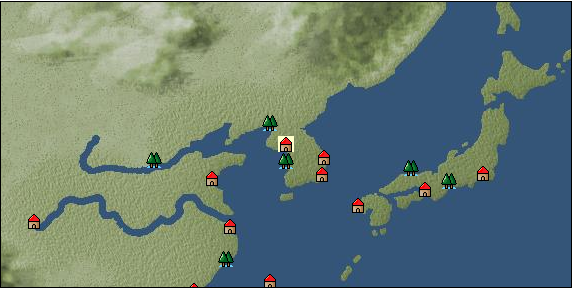

# Port: 漢陽

import Tabs from '@theme/Tabs';
import TabItem from '@theme/TabItem';

## General Information

| Attribute | Details |
| :--- | :--- |
| **Port Name** | 漢陽 |
| **Port Type** | port of alliance |
| **Region** | east asia |
| **Sea Area** | eastern east asia |
| **Required Language** | Korean |
| **Coordinates** | （5771，3225） |
| **Investment Reward** |  |

### Available Facilities

| guild | intermediary | exchange | tool shop | workshop craftsman | Painter | sculptor | peddler |
| --- | --- | --- | --- | --- | --- | --- | --- |
|   | ○ | ○ | ○ | ○ |   |   | ○ |
| Shipyard Master | Lumbermaker | Sail-maker | weapon craftsman | master | TavernFemale | archive | salesperson |
| --- | --- | --- | --- | --- | --- | --- | --- |
| ○ | ○ | ○ | ○ | ○ |   | ○ | ○ |
| Shipwright | 銀行 | street worker | 王宮 | Trading post | church | suburbs | translator |
| --- | --- | --- | --- | --- | --- | --- | --- |
| ○ |   |   |   |   |   |   |   |

### Description
The reading is "Hanyan". It has the meaning of ``the land north of Hansui''. It has a long history as it was the capital of the Baekje period, and many relics have been discovered. Tavern woman: Yonghye (unreportable) Cultural area: Korea

<Tabs>
  <TabItem value="trade_goods_sales" label="Trade Goods Sales">

| Item | Group | Purchase Price | Allied Price | Remarks |
| --- | --- | --- | --- | --- |
| [Sanshou](docs/Items/TradeGoods/TradeGoods-Spices/item_3794.md) | [Trading Goods (Spices)](docs/Categories/category_12.md) | [Edit Purchase Price](docs/Ports/port_176.md) |  |
| [Chamtashima](docs/Items/TradeGoods/TradeGoods-Foodstuffs/item_3771.md) | [Trading items (food items)](docs/Categories/category_3.md) | [Edit Purchase Price](docs/Ports/port_176.md) |  |
| [Choshi](docs/Items/TradeGoods/TradeGoods-Seasonings/item_3793.md) | [交易品（調味料）](docs/Categories/category_4.md) | [Edit Purchase Price](docs/Ports/port_176.md) |  |
| [Chindarle](docs/Items/TradeGoods/TradeGoods-Perfume/item_3795.md) | [Trading Goods (Spices)](docs/Categories/category_11.md) | [Edit Purchase Price](docs/Ports/port_176.md) |  |
| [broadsword](docs/Items/TradeGoods/TradeGoods-Weapons/item_3754.md) | [Trading Items (Arms)](docs/Categories/category_16.md) | [Edit Purchase Price](docs/Ports/port_176.md) |  |
| [Andong soju](docs/Items/TradeGoods/TradeGoods-Alcohol/item_3757.md) | [交易品（酒類）](docs/Categories/category_9.md) | [Edit Purchase Price](docs/Ports/port_176.md) |  |
| [throwing bomb](docs/Items/TradeGoods/TradeGoods-Firearms/item_3784.md) | [Trading Items (Firearms)](docs/Categories/category_17.md) | [Edit Purchase Price](docs/Ports/port_176.md) |  |
| [明紬](docs/Items/TradeGoods/TradeGoods-Fabrics/item_3753.md) | [交易品（織物）](docs/Categories/category_20.md) | [Edit Purchase Price](docs/Ports/port_176.md) |  |
| [Korean ginseng](docs/Items/TradeGoods/TradeGoods-Medicine/item_3738.md) | [Trading products (medical products)](docs/Categories/category_6.md) | [Edit Purchase Price](docs/Ports/port_176.md) |  |
| [Korean books](docs/Items/TradeGoods/TradeGoods-Misc/item_3750.md) | [交易品（雑貨）](docs/Categories/category_5.md) | [Edit Purchase Price](docs/Ports/port_176.md) |  |
| [Korean tea](docs/Items/TradeGoods/TradeGoods-Sunddries/item_3751.md) | [Trading goods (hobby goods)](docs/Categories/category_10.md) | [Edit Purchase Price](docs/Ports/port_176.md) |  |
| [Korean silver](docs/Items/TradeGoods/TradeGoods-Metals/item_3796.md) | [Trading products (precious metals)](docs/Categories/category_8.md) | [Edit Purchase Price](docs/Ports/port_176.md) |  |
| [purple root](docs/Items/TradeGoods/TradeGoods-Dye/item_3752.md) | [Trading Goods (Dye)](docs/Categories/category_2.md) | [Edit Purchase Price](docs/Ports/port_176.md) |  |
| [tiger skin](docs/Items/TradeGoods/TradeGoods-Fibers/item_3790.md) | [交易品（繊維）](docs/Categories/category_1.md) | [Edit Purchase Price](docs/Ports/port_176.md) |  |
| [tiger eye stone](docs/Items/TradeGoods/TradeGoods-Gems/item_3797.md) | [Trading Items (Gemstones)](docs/Categories/category_15.md) | [Edit Purchase Price](docs/Ports/port_176.md) |  |
| [Mother-of-pearl lacquerware](docs/Items/TradeGoods/TradeGoods-Art/item_3785.md) | [交易品（美術品）](docs/Categories/category_14.md) | [Edit Purchase Price](docs/Ports/port_176.md) |  |
| [韓牛](docs/Items/TradeGoods/TradeGoods-Livestock/item_3792.md) | [Trading Goods (Livestock)](docs/Categories/category_18.md) | [Edit Purchase Price](docs/Ports/port_176.md) |  |
| [韓紙](docs/Items/TradeGoods/TradeGoods-Wares/item_3755.md) | [交易品（工業品）](docs/Categories/category_19.md) | [Edit Purchase Price](docs/Ports/port_176.md) |  |
| [Goryeo celadon](docs/Items/TradeGoods/TradeGoods-Luxuries/item_3758.md) | [Trading goods (artificial goods)](docs/Categories/category_13.md) | [Edit Purchase Price](docs/Ports/port_176.md) |  |
| [medical stone](docs/Items/TradeGoods/TradeGoods-Minerals/item_3786.md) | [Trading Items (Iron Stone)](docs/Categories/category_7.md) | [Edit Purchase Price](docs/Ports/port_176.md) |  |
  </TabItem>
  <TabItem value="sale_specialty" label="Sale (Specialty)">

| Item | Group | sale price | Allied Price | Remarks |
| --- | --- | --- | --- | --- |
| Sales information for trade items with specialty judgment set is not registered. |
  </TabItem>
  <TabItem value="sale_no_specialty" label="Sale (No Specialty)">

| Item | Group | sale price | Allied Price | Remarks |
| --- | --- | --- | --- | --- |
| There is no information on the sale of trade goods. |
  </TabItem>
  <TabItem value="guild_&_others" label="Guild & Others">

| Item | Group | Sales price | Handling NPC | Remarks |
| --- | --- | --- | --- | --- |

#### 柳成龍

| [Korean](docs/Skills/Skills-Language/item_3744.md) | [Skills (language)](docs/Categories/category_42.md) | 600,000 | 柳成龍 |  |
  </TabItem>
  <TabItem value="toolman" label="Toolman">

| Item | Group | Sales price | Handling NPC | Remarks |
| --- | --- | --- | --- | --- |

#### [recipe book](docs/Categories/category_22.md)

| [Swordsmith's Secret](docs/Items/RecipeBooks/item_3404.md) | recipe book | 2,500,000 | tool shop owner |  |
| [Korean specialties](docs/Items/RecipeBooks/item_3770.md) | recipe book | 350,000 | tool shop owner |  |
| [調味料大全・秘境編](docs/Items/RecipeBooks/item_3403.md) | recipe book | 700,000 | tool shop owner |  |

#### [Equipment (head)](docs/Categories/category_23.md)

| [Ayanmo](docs/Items/Equipment/Equipment-Head/item_3605.md) | Equipment (head) | 102,000 | tool shop owner |  |
| [Samo](docs/Items/Equipment/Equipment-Head/item_3582.md) | Equipment (head) | 102,000 | tool shop owner |  |

#### [Equipment (body)](docs/Categories/category_24.md)

| [Satoboku](docs/Items/Equipment/Equipment-Body/item_3761.md) | Equipment (body) | 404,000 | tool shop owner |  |
| [Chimajeogori](docs/Items/Equipment/Equipment-Body/item_3748.md) | Equipment (body) | 404,000 | tool shop owner |  |
| [Bajijeogori](docs/Items/Equipment/Equipment-Body/item_3740.md) | Equipment (body) | 154,000 | tool shop owner |  |

#### [Equipment (legs)](docs/Categories/category_26.md)

| [Kossin](docs/Items/Equipment/Equipment-Feet/item_3554.md) | Equipment (legs) | 56,000 | tool shop owner |  |
| [Mocka](docs/Items/Equipment/Equipment-Feet/item_3440.md) | Equipment (legs) | 56,000 | tool shop owner |  |

#### [Equipment (belongings)](docs/Categories/category_27.md)

| [粧刀](docs/Items/Equipment/Equipment-Weapon/item_3763.md) | Equipment (belongings) | 700,000 | tool shop owner |  |

#### [Consumables (land battle/deck battle)](docs/Categories/category_29.md)

| [strong adhesive oil](docs/Items/Consumables/Consumables-Landbattle/item_662.md) | Consumables (land battle/deck battle) | 200 | tool shop owner |  |
| [torch for throwing](docs/Items/Consumables/Consumables-Landbattle/item_313.md) | Consumables (land battle/deck battle) | 150 | tool shop owner |  |
| [Assortment of therapeutic drugs](docs/Items/Consumables/Consumables-Landbattle/item_564.md) | Consumables (land battle/deck battle) | 900 | tool shop owner |  |
| [secret cure](docs/Items/Consumables/Consumables-Landbattle/item_563.md) | Consumables (land battle/deck battle) | 600 | tool shop owner |  |

#### [Consumables (skill activation)](docs/Categories/category_31.md)

| [捕獲網](docs/Items/Consumables/Consumables-Skill/item_315.md) | Consumables (skill activation) | 300 | tool shop owner |  |
| [fishing gear](docs/Items/Consumables/Consumables-Skill/item_79.md) | Consumables (skill activation) | 2,500 | tool shop owner |  |
  </TabItem>
  <TabItem value="kobo_craftsmen" label="Craftsman">

| Item | Group | Sales price | Handling NPC | Remarks |
| --- | --- | --- | --- | --- |

#### [Consumables (condition recovery)](docs/Categories/category_21.md)

| [Nostalgic carillon bell](docs/Items/Consumables/Consumables-Recovery/item_245.md) | Consumables (condition recovery) | 200 | workshop craftsman |  |
| [Ship song sheet music](docs/Items/Consumables/Consumables-Recovery/item_247.md) | Consumables (condition recovery) | 200 | workshop craftsman |  |

#### [recipe book](docs/Categories/category_22.md)

| [Korean weapons](docs/Items/RecipeBooks/item_3762.md) | recipe book | Fixed recipe | workshop craftsman |  |

#### [Consumables (other)](docs/Categories/category_44.md)

| [帆塗料](docs/Items/Consumables/Consumables-Other/item_348.md) | Consumables (other) | 500 | workshop craftsman |  |
| [ship paint](docs/Items/Consumables/Consumables-Other/item_347.md) | Consumables (other) | 500 | workshop craftsman |  |
  </TabItem>
  <TabItem value="peddler" label="peddler">

| Item | Group | Sales price | Handling NPC | Remarks |
| --- | --- | --- | --- | --- |

#### [Consumables (condition recovery)](docs/Categories/category_21.md)

| [Nekoirazu](docs/Items/Consumables/Consumables-Recovery/item_70.md) | Consumables (condition recovery) |  | peddler |  |
| [spare sail](docs/Items/Consumables/Consumables-Recovery/item_242.md) | Consumables (condition recovery) |  | peddler |  |
| [reserve rudder](docs/Items/Consumables/Consumables-Recovery/item_243.md) | Consumables (condition recovery) |  | peddler |  |
| [fire extinguishing sand](docs/Items/Consumables/Consumables-Recovery/item_68.md) | Consumables (condition recovery) |  | peddler |  |
| [clean deck brush](docs/Items/Consumables/Consumables-Recovery/item_72.md) | Consumables (condition recovery) |  | peddler |  |

#### [Consumables (naval/hand-to-hand combat)](docs/Categories/category_30.md)

| [evacuation bell](docs/Items/Consumables/Consumables-navalhand-to-hand combat/item_919.md) | Consumables (naval/hand-to-hand combat) |  | peddler |  |

#### [Consumables (skill activation)](docs/Categories/category_31.md)

| [life aid](docs/Items/Consumables/Consumables-Skill/item_67.md) | Consumables (skill activation) |  | peddler |  |
| [landmark ribbon](docs/Items/Consumables/Consumables-Skill/item_316.md) | Consumables (skill activation) |  | peddler |  |
  </TabItem>
  <TabItem value="salesperson" label="salesperson">

| Item | Group | Sales price | Handling NPC | Remarks |
| --- | --- | --- | --- | --- |

#### [Consumables (cooking)](docs/Categories/category_32.md)

| [Kujeolpan](docs/Items/Consumables/Consumables-Cooking/item_3776.md) | Consumables (cooking) |  | salesperson |  |
| [Tegutan](docs/Items/Consumables/Consumables-Cooking/item_3774.md) | Consumables (cooking) |  | salesperson |  |
| [Bulgogi](docs/Items/Consumables/Consumables-Cooking/item_3773.md) | Consumables (cooking) |  | salesperson |  |
| [Yakshiku](docs/Items/Consumables/Consumables-Cooking/item_3775.md) | Consumables (cooking) |  | salesperson |  |
| [Yukgaejang](docs/Items/Consumables/Consumables-Cooking/item_3772.md) | Consumables (cooking) |  | salesperson |  |
  </TabItem>
  <TabItem value="shipyard" label="Shipyard">

### Shipyard Master

| Item | Group | Sales price | Handling NPC | Remarks |
| --- | --- | --- | --- | --- |

#### [recipe book](docs/Categories/category_22.md)

| [East Asian hull manufacturing methods](docs/Items/RecipeBooks/item_3406.md) | recipe book | Fixed recipe | Shipyard Master |  |

#### [Boat](docs/Categories/category_43.md)

| [send ship](docs/Items/Ships/item_3766.md) | Boat | 8,400,000 | Shipyard Master |  |
| [Battleship](docs/Items/Ships/item_3767.md) | Boat | 16,600,000 | Shipyard Master |  |
| [漕運船](docs/Items/Ships/item_3765.md) | Boat | 7,900,000 | Shipyard Master |  |

#### [shipbuilding materials](docs/Categories/category_47.md)

| [east asia large paddle ship](docs/Items/ShipbuildingFS/item_3488.md) | shipbuilding materials | Fixed recipe | Shipyard Master |  |
| [East Asia large hull](docs/Items/ShipbuildingFS/item_3487.md) | shipbuilding materials | Fixed recipe | Shipyard Master |  |

### Lumbermaker

| Item | Group | Sales price | Handling NPC | Remarks |
| --- | --- | --- | --- | --- |

#### [Ship parts (additional armor)](docs/Categories/category_35.md)

| [Zelkova board](docs/Items/ShipParts/Shipparts-Plates/item_3395.md) | Ship parts (additional armor) | 50,000 | Lumbermaker |  |

### Sail-maker

| Item | Group | Sales price | Handling NPC | Remarks |
| --- | --- | --- | --- | --- |

#### [Ship parts (auxiliary sails)](docs/Categories/category_33.md)

| [Auxiliary junk sail](docs/Items/ShipParts/Shipparts-Studding-Sail/item_3653.md) | Ship parts (auxiliary sails) | 12,000 | Sail-maker |  |

### Shipwright

| Item | Group | Sales price | Handling NPC | Remarks |
| --- | --- | --- | --- | --- |

#### [recipe book](docs/Categories/category_22.md)

| [East Asian reinforced board manufacturing method](docs/Items/RecipeBooks/item_3472.md) | recipe book | Fixed recipe | Shipwright |  |

#### [shipbuilding materials](docs/Categories/category_47.md)

| [Deck reinforcement iron plate](docs/Items/ShipbuildingFS/item_3655.md) | shipbuilding materials | Fixed recipe | Shipwright |  |
| [hull bulkhead](docs/Items/ShipbuildingFS/item_3656.md) | shipbuilding materials | Fixed recipe | Shipwright |  |
  </TabItem>
  <TabItem value="weapon craftsman" label="weapon craftsman">

| Item | Group | Sales price | Handling NPC | Remarks |
| --- | --- | --- | --- | --- |

#### [Ship parts (special weapons)](docs/Categories/category_37.md)

| [Boathouse](docs/Items/ShipParts/Shipparts-Special-Equipment/item_3394.md) | Ship parts (special weapons) | 35,000 | weapon craftsman |  |

#### [Ship parts (cannon)](docs/Categories/category_38.md)

| [黄字銃筒10門](docs/Items/ShipParts/Shipparts-Cannons/item_3782.md) | Ship parts (cannon) | 110,000 | weapon craftsman |  |
| [黄字銃筒4門](docs/Items/ShipParts/Shipparts-Cannons/item_3779.md) | Ship parts (cannon) | 18,000 | weapon craftsman |  |
| [黄字銃筒6門](docs/Items/ShipParts/Shipparts-Cannons/item_3780.md) | Ship parts (cannon) | 38,000 | weapon craftsman |  |
| [黄字銃筒8門](docs/Items/ShipParts/Shipparts-Cannons/item_3781.md) | Ship parts (cannon) | 66,000 | weapon craftsman |  |
  </TabItem>
</Tabs>