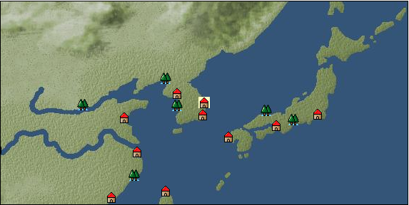

# Port: 浦項

import Tabs from '@theme/Tabs';
import TabItem from '@theme/TabItem';

## General Information

| Attribute | Details |
| :--- | :--- |
| **Port Name** | Pohang |
| **Port Type** | port of alliance |
| **Region** | east asia |
| **Sea Area** | eastern east asia |
| **Required Language** | Korean |
| **Coordinates** | （5923，3277） |
| **Investment Reward** |  |

### Available Facilities

| guild | intermediary | exchange | tool shop | workshop craftsman | Painter | sculptor | peddler |
| --- | --- | --- | --- | --- | --- | --- | --- |
|   |   | ○ | ○ |   |   |   |   |
| Shipyard Master | Lumbermaker | Sail-maker | weapon craftsman | master | TavernFemale | archive | salesperson |
| --- | --- | --- | --- | --- | --- | --- | --- |
| ○ |   |   |   | ○ |   |   |   |
| Shipwright | 銀行 | street worker | 王宮 | Trading post | church | suburbs | translator |
| --- | --- | --- | --- | --- | --- | --- | --- |
| ○ | ○ | ○ |   |   |   | ○ |   |

### Description
The reading is "Pohan". Located on the east coast of the Korean Peninsula. There are beautiful mountains near the city. Suburbs: Pohang West Cultural Area: Korea

<Tabs>
  <TabItem value="trade_goods_sales" label="Trade Goods Sales">

| item | group | purchase price | 同盟時 | remarks |
| --- | --- | --- | --- | --- |
| [Sanshou](docs/Items/TradeGoods/TradeGoods-Spices/item_3794.md) | [Trading Goods (Spices)](docs/Categories/category_12.md) | [Edit Purchase Price](docs/Ports/port_178.md) |  |
| [Chamtashima](docs/Items/TradeGoods/TradeGoods-Foodstuffs/item_3771.md) | [Trading items (food items)](docs/Categories/category_3.md) | [Edit Purchase Price](docs/Ports/port_178.md) |  |
| [Choshi](docs/Items/TradeGoods/TradeGoods-Seasonings/item_3793.md) | [交易品（調味料）](docs/Categories/category_4.md) | [Edit Purchase Price](docs/Ports/port_178.md) |  |
| [Chindarle](docs/Items/TradeGoods/TradeGoods-Perfume/item_3795.md) | [Trading Goods (Spices)](docs/Categories/category_11.md) | [Edit Purchase Price](docs/Ports/port_178.md) |  |
| [broadsword](docs/Items/TradeGoods/TradeGoods-Weapons/item_3754.md) | [Trading Items (Arms)](docs/Categories/category_16.md) | [Edit Purchase Price](docs/Ports/port_178.md) |  |
| [Andong soju](docs/Items/TradeGoods/TradeGoods-Alcohol/item_3757.md) | [交易品（酒類）](docs/Categories/category_9.md) | [Edit Purchase Price](docs/Ports/port_178.md) |  |
| [throwing bomb](docs/Items/TradeGoods/TradeGoods-Firearms/item_3784.md) | [Trading Items (Firearms)](docs/Categories/category_17.md) | [Edit Purchase Price](docs/Ports/port_178.md) |  |
| [明紬](docs/Items/TradeGoods/TradeGoods-Fabrics/item_3753.md) | [交易品（織物）](docs/Categories/category_20.md) | [Edit Purchase Price](docs/Ports/port_178.md) |  |
| [Korean ginseng](docs/Items/TradeGoods/TradeGoods-Medicine/item_3738.md) | [Trading products (medical products)](docs/Categories/category_6.md) | [Edit Purchase Price](docs/Ports/port_178.md) |  |
| [Korean books](docs/Items/TradeGoods/TradeGoods-Misc/item_3750.md) | [交易品（雑貨）](docs/Categories/category_5.md) | [Edit Purchase Price](docs/Ports/port_178.md) |  |
| [Korean tea](docs/Items/TradeGoods/TradeGoods-Sunddries/item_3751.md) | [Trading goods (hobby goods)](docs/Categories/category_10.md) | [Edit Purchase Price](docs/Ports/port_178.md) |  |
| [Korean silver](docs/Items/TradeGoods/TradeGoods-Metals/item_3796.md) | [Trading products (precious metals)](docs/Categories/category_8.md) | [Edit Purchase Price](docs/Ports/port_178.md) |  |
| [purple root](docs/Items/TradeGoods/TradeGoods-Dye/item_3752.md) | [Trading Goods (Dye)](docs/Categories/category_2.md) | [Edit Purchase Price](docs/Ports/port_178.md) |  |
| [tiger skin](docs/Items/TradeGoods/TradeGoods-Fibers/item_3790.md) | [交易品（繊維）](docs/Categories/category_1.md) | [Edit Purchase Price](docs/Ports/port_178.md) |  |
| [tiger eye stone](docs/Items/TradeGoods/TradeGoods-Gems/item_3797.md) | [Trading Items (Gemstones)](docs/Categories/category_15.md) | [Edit Purchase Price](docs/Ports/port_178.md) |  |
| [Mother-of-pearl lacquerware](docs/Items/TradeGoods/TradeGoods-Art/item_3785.md) | [交易品（美術品）](docs/Categories/category_14.md) | [Edit Purchase Price](docs/Ports/port_178.md) |  |
| [raspberry](docs/Items/TradeGoods/TradeGoods-Sunddries/item_5419.md) | [Trading goods (hobby goods)](docs/Categories/category_10.md) | [Edit Purchase Price](docs/Ports/port_178.md) |  |
| [韓牛](docs/Items/TradeGoods/TradeGoods-Livestock/item_3792.md) | [Trading Goods (Livestock)](docs/Categories/category_18.md) | [Edit Purchase Price](docs/Ports/port_178.md) |  |
| [韓紙](docs/Items/TradeGoods/TradeGoods-Wares/item_3755.md) | [交易品（工業品）](docs/Categories/category_19.md) | [Edit Purchase Price](docs/Ports/port_178.md) |  |
| [Goryeo celadon](docs/Items/TradeGoods/TradeGoods-Luxuries/item_3758.md) | [Trading goods (artificial goods)](docs/Categories/category_13.md) | [Edit Purchase Price](docs/Ports/port_178.md) |  |
| [medical stone](docs/Items/TradeGoods/TradeGoods-Minerals/item_3786.md) | [Trading Items (Iron Stone)](docs/Categories/category_7.md) | [Edit Purchase Price](docs/Ports/port_178.md) |  |
  </TabItem>
  <TabItem value="sale_specialty" label="Sale (Specialty)">

| item | group | sale price | 同盟時 | remarks |
| --- | --- | --- | --- | --- |
| Sales information for trade items with specialty judgment set is not registered. |
  </TabItem>
  <TabItem value="sale_no_specialty" label="Sale (No Specialty)">

| item | group | sale price | 同盟時 | remarks |
| --- | --- | --- | --- | --- |
| There is no information on the sale of trade goods. |
  </TabItem>
  <TabItem value="guild_&_others" label="Guild & Others">

| item | group | Sales price | Handling NPC | remarks |
| --- | --- | --- | --- | --- |
| There is no sales information for the item |
| --- |
  </TabItem>
  <TabItem value="toolman" label="Toolman">

| item | group | Sales price | Handling NPC | remarks |
| --- | --- | --- | --- | --- |

#### [recipe book](docs/Categories/category_22.md)

| [East Asian accessories/sewing edition](docs/Items/RecipeBooks/item_3387.md) | recipe book | 800,000 | tool shop owner |  |

#### [Equipment (head)](docs/Categories/category_23.md)

| [Ayanmo](docs/Items/Equipment/Equipment-Head/item_3605.md) | Equipment (head) | 102,000 | tool shop owner |  |
| [Samo](docs/Items/Equipment/Equipment-Head/item_3582.md) | Equipment (head) | 102,000 | tool shop owner |  |

#### [Equipment (body)](docs/Categories/category_24.md)

| [Bajijeogori](docs/Items/Equipment/Equipment-Body/item_3740.md) | Equipment (body) | 154,000 | tool shop owner |  |

#### [Equipment (legs)](docs/Categories/category_26.md)

| [Kossin](docs/Items/Equipment/Equipment-Feet/item_3554.md) | Equipment (legs) | 56,000 | tool shop owner |  |
| [zip thin](docs/Items/Equipment/Equipment-Feet/item_3619.md) | Equipment (legs) | 48,000 | tool shop owner |  |
| [Mocka](docs/Items/Equipment/Equipment-Feet/item_3440.md) | Equipment (legs) | 56,000 | tool shop owner |  |

#### [Consumables (land battle/deck battle)](docs/Categories/category_29.md)

| [strong adhesive oil](docs/Items/Consumables/Consumables-Landbattle/item_662.md) | Consumables (land battle/deck battle) | 200 | tool shop owner |  |
| [torch for throwing](docs/Items/Consumables/Consumables-Landbattle/item_313.md) | Consumables (land battle/deck battle) | 150 | tool shop owner |  |
| [secret cure](docs/Items/Consumables/Consumables-Landbattle/item_563.md) | Consumables (land battle/deck battle) | 600 | tool shop owner |  |

#### [Consumables (skill activation)](docs/Categories/category_31.md)

| [fishing gear](docs/Items/Consumables/Consumables-Skill/item_79.md) | Consumables (skill activation) | 2,500 | tool shop owner |  |
  </TabItem>
  <TabItem value="shipyard" label="Shipyard">

### Shipyard Master

| item | group | Sales price | Handling NPC | remarks |
| --- | --- | --- | --- | --- |

#### [Boat](docs/Categories/category_43.md)

| [send ship](docs/Items/Ships/item_3766.md) | Boat | 8,400,000 | Shipyard Master |  |
| [Battleship](docs/Items/Ships/item_3767.md) | Boat | 16,600,000 | Shipyard Master |  |
| [漕運船](docs/Items/Ships/item_3765.md) | Boat | 7,900,000 | Shipyard Master |  |

### Shipwright

| item | group | Sales price | Handling NPC | remarks |
| --- | --- | --- | --- | --- |

#### [recipe book](docs/Categories/category_22.md)

| [East Asian cabin design methods](docs/Items/RecipeBooks/item_3397.md) | recipe book | Fixed recipe | Shipwright |  |

#### [shipbuilding materials](docs/Categories/category_47.md)

| [assault cabin](docs/Items/ShipbuildingFS/item_3568.md) | shipbuilding materials | Fixed recipe | Shipwright |  |
| [East Asia trade hold](docs/Items/ShipbuildingFS/item_3537.md) | shipbuilding materials | Fixed recipe | Shipwright |  |
  </TabItem>
</Tabs>