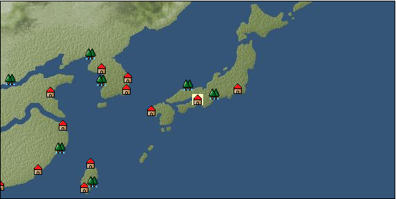

# Port: 堺

import Tabs from '@theme/Tabs';
import TabItem from '@theme/TabItem';

## General Information

| Attribute | Details |
| :--- | :--- |
| **Port Name** | Sakai |
| **Port Type** | port of alliance |
| **Region** | east asia |
| **Sea Area** | eastern east asia |
| **Required Language** | Japanese |
| **Coordinates** | （6329，3403） |
| **Investment Reward** |  |

### Available Facilities

| guild | intermediary | exchange | tool shop | workshop craftsman | Painter | sculptor | peddler |
| --- | --- | --- | --- | --- | --- | --- | --- |
|   | ○ | ○ | ○ | ○ |   |   | ○ |
| Shipyard Master | Lumbermaker | Sail-maker | weapon craftsman | master | TavernFemale | archive | salesperson |
| --- | --- | --- | --- | --- | --- | --- | --- |
| ○ | ○ | ○ | ○ | ○ | ○ | ○ | ○ |
| Shipwright | 銀行 | street worker | 王宮 | Trading post | church | suburbs | translator |
| --- | --- | --- | --- | --- | --- | --- | --- |
| ○ | ○ | ○ |   |   | ○ |   |   |

### Description
A port town facing Osaka Bay and thriving with trade. It is a land of free spirit where merchants gather. It seems that Japan's leading figures are also paying attention to this city's excellent economic structure. ★Trade is not possible unless Japan's contribution level is increased Tavern girl: Yuki Reportable Cultural area: Japan

<Tabs>
  <TabItem value="trade_goods_sales" label="Trade Goods Sales">

| item | group | purchase price | 同盟時 | remarks |
| --- | --- | --- | --- | --- |
| [buckwheat](Items/Trade Goods/TradeGoods-Foodstuffs/item_3430.md) | [Trading items (food items)](Categories/category_3.md) | [Edit Purchase Price](Ports/port_179.md) |  |
| [boar](Items/Trade Goods/TradeGoods-Livestock/item_3476.md) | [Trading Goods (Livestock)](Categories/category_18.md) | [Edit Purchase Price](Ports/port_179.md) |  |
| [gardenia](Items/Trade Goods/TradeGoods-Perfume/item_1091.md) | [Trading Goods (Spices)](Categories/category_11.md) | [Edit Purchase Price](Ports/port_179.md) |  |
| [eggplant](Items/Trade Goods/TradeGoods-Sunddries/item_3426.md) | [Trading goods (hobby goods)](Categories/category_10.md) | [Edit Purchase Price](Ports/port_179.md) |  |
| [gallnut](Items/Trade Goods/TradeGoods-Dye/item_3429.md) | [Trading Goods (Dye)](Categories/category_2.md) | [Edit Purchase Price](Ports/port_179.md) |  |
| [佐摩銀](Items/Trade Goods/TradeGoods-Metals/item_3432.md) | [Trading products (precious metals)](Categories/category_8.md) | [Edit Purchase Price](Ports/port_179.md) |  |
| [Japanese books](Items/Trade Goods/TradeGoods-Misc/item_3439.md) | [交易品（雑貨）](Categories/category_5.md) | [Edit Purchase Price](Ports/port_179.md) |  |
| [Japanese paper](Items/Trade Goods/TradeGoods-Wares/item_3438.md) | [交易品（工業品）](Categories/category_19.md) | [Edit Purchase Price](Ports/port_179.md) |  |
| [Japanese sword](Items/Trade Goods/TradeGoods-Weapons/item_3437.md) | [Trading Items (Arms)](Categories/category_16.md) | [Edit Purchase Price](Ports/port_179.md) |  |
| [Japanese painting](Items/Trade Goods/TradeGoods-Art/item_3436.md) | [交易品（美術品）](Categories/category_14.md) | [Edit Purchase Price](Ports/port_179.md) |  |
| [Grapefruit](Items/Trade Goods/TradeGoods-Spices/item_3422.md) | [Trading Goods (Spices)](Categories/category_12.md) | [Edit Purchase Price](Ports/port_179.md) |  |
| [Sake](Items/Trade Goods/TradeGoods-Alcohol/item_3424.md) | [交易品（酒類）](Categories/category_9.md) | [Edit Purchase Price](Ports/port_179.md) |  |
| [lacquerware](Items/Trade Goods/TradeGoods-Luxuries/item_3435.md) | [Trading goods (artificial goods)](Categories/category_13.md) | [Edit Purchase Price](Ports/port_179.md) |  |
| [Saori](Items/Trade Goods/TradeGoods-Luxuries/item_3676.md) | [Trading goods (artificial goods)](Categories/category_13.md) | [Edit Purchase Price](Ports/port_179.md) |  |
| How much will the contribution be? |
| [white porcelain ore](Items/Trade Goods/TradeGoods-Minerals/item_3433.md) | [Trading Items (Iron Stone)](Categories/category_7.md) | [Edit Purchase Price](Ports/port_179.md) |  |
| [tanegashima gun](Items/Trade Goods/TradeGoods-Firearms/item_3423.md) | [Trading Items (Firearms)](Categories/category_17.md) | [Edit Purchase Price](Ports/port_179.md) |  |
| [amethyst](Items/Trade Goods/TradeGoods-Gems/item_3434.md) | [Trading Items (Gemstones)](Categories/category_15.md) | [Edit Purchase Price](Ports/port_179.md) |  |
| [calamus](Items/Trade Goods/TradeGoods-Medicine/item_3427.md) | [Trading products (medical products)](Categories/category_6.md) | [Edit Purchase Price](Ports/port_179.md) |  |
| [Nishijin textile](Items/Trade Goods/TradeGoods-Fabrics/item_3431.md) | [交易品（織物）](Categories/category_20.md) | [Edit Purchase Price](Ports/port_179.md) |  |
| [soy sauce](Items/Trade Goods/TradeGoods-Seasonings/item_3425.md) | [交易品（調味料）](Categories/category_4.md) | [Edit Purchase Price](Ports/port_179.md) |  |
| [Green ramie](Items/Trade Goods/TradeGoods-Fibers/item_3428.md) | [交易品（繊維）](Categories/category_1.md) | [Edit Purchase Price](Ports/port_179.md) |  |
  </TabItem>
  <TabItem value="sale_specialty" label="Sale (Specialty)">

| item | group | sale price | 同盟時 | remarks |
| --- | --- | --- | --- | --- |
| Sales information for trade items with specialty judgment set is not registered. |
  </TabItem>
  <TabItem value="sale_no_specialty" label="Sale (No Specialty)">

| item | group | sale price | 同盟時 | remarks |
| --- | --- | --- | --- | --- |
| There is no information on the sale of trade goods. |
  </TabItem>
  <TabItem value="guild_&_others" label="Guild & Others">

| item | group | Sales price | Handling NPC | remarks |
| --- | --- | --- | --- | --- |
| There is no sales information for the item |
| --- |
  </TabItem>
  <TabItem value="toolman" label="Toolman">

| item | group | Sales price | Handling NPC | remarks |
| --- | --- | --- | --- | --- |

#### [recipe book](Categories/category_22.md)

| [Swordsmith's Secret](Items/Recipe Book/item_3404.md) | recipe book | 2,500,000 | tool shop owner |  |
| [Japanese specialties](Items/Recipe Book/item_3402.md) | recipe book | 350,000 | tool shop owner |  |
| [調味料大全・秘境編](Items/Recipe Book/item_3403.md) | recipe book | 700,000 | tool shop owner |  |

#### [Equipment (head)](Categories/category_23.md)

| [Hairpin](Items/Equipment/Equipment-Head/item_3384.md) | Equipment (head) | 102,000 | tool shop owner |  |
| [折烏帽子](Items/Equipment/Equipment-Head/item_3383.md) | Equipment (head) | 102,000 | tool shop owner |  |

#### [Equipment (body)](Categories/category_24.md)

| [Kosode (for women)](Items/Equipment/Equipment-Body/item_5077.md) | Equipment (body) | 154,000 | tool shop owner |  |
| [Kosode (for men)](Items/Equipment/Equipment-Body/item_3379.md) | Equipment (body) | 154,000 | tool shop owner |  |

#### [Equipment (legs)](Categories/category_26.md)

| [Zori sandals](Items/Equipment/Equipment-Feet/item_3386.md) | Equipment (legs) | 56,000 | tool shop owner |  |
| [Straw sandals](Items/Equipment/Equipment-Feet/item_3385.md) | Equipment (legs) | 48,000 | tool shop owner |  |

#### [Equipment (belongings)](Categories/category_27.md)

| [matchlock](Items/Equipment/Equipment-Weapon/item_3401.md) | Equipment (belongings) | 700,000 | tool shop owner |  |

#### [Consumables (land battle/deck battle)](Categories/category_29.md)

| [strong adhesive oil](Items/Consumables/Consumables-Landbattle/item_662.md) | Consumables (land battle/deck battle) | 200 | tool shop owner |  |
| [torch for throwing](Items/Consumables/Consumables-Landbattle/item_313.md) | Consumables (land battle/deck battle) | 150 | tool shop owner |  |
| [Assortment of therapeutic drugs](Items/Consumables/Consumables-Landbattle/item_564.md) | Consumables (land battle/deck battle) | 900 | tool shop owner |  |
| [secret cure](Items/Consumables/Consumables-Landbattle/item_563.md) | Consumables (land battle/deck battle) | 600 | tool shop owner |  |

#### [Consumables (skill activation)](Categories/category_31.md)

| [捕獲網](Items/Consumables/Consumables-Skill/item_315.md) | Consumables (skill activation) | 300 | tool shop owner |  |
| [fishing gear](Items/Consumables/Consumables-Skill/item_79.md) | Consumables (skill activation) | 2,500 | tool shop owner |  |
  </TabItem>
  <TabItem value="kobo_craftsmen" label="Craftsman">

| item | group | Sales price | Handling NPC | remarks |
| --- | --- | --- | --- | --- |

#### [Consumables (condition recovery)](Categories/category_21.md)

| [Nostalgic carillon bell](Items/Consumables/Consumables-Recovery/item_245.md) | Consumables (condition recovery) | 200 | workshop craftsman |  |
| [Ship song sheet music](Items/Consumables/Consumables-Recovery/item_247.md) | Consumables (condition recovery) | 200 | workshop craftsman |  |

#### [recipe book](Categories/category_22.md)

| [Japanese weapons](Items/Recipe Book/item_3405.md) | recipe book | Fixed recipe | workshop craftsman |  |

#### [Consumables (other)](Categories/category_44.md)

| [帆塗料](Items/Consumables/Consumables-Other/item_348.md) | Consumables (other) | 500 | workshop craftsman |  |
| [ship paint](Items/Consumables/Consumables-Other/item_347.md) | Consumables (other) | 500 | workshop craftsman |  |
  </TabItem>
  <TabItem value="peddler" label="peddler">

| item | group | Sales price | Handling NPC | remarks |
| --- | --- | --- | --- | --- |

#### [Consumables (condition recovery)](Categories/category_21.md)

| [Nekoirazu](Items/Consumables/Consumables-Recovery/item_70.md) | Consumables (condition recovery) |  | peddler |  |
| [spare sail](Items/Consumables/Consumables-Recovery/item_242.md) | Consumables (condition recovery) |  | peddler |  |
| [reserve rudder](Items/Consumables/Consumables-Recovery/item_243.md) | Consumables (condition recovery) |  | peddler |  |
| [carpentry tools](Items/Consumables/Consumables-Recovery/item_271.md) | Consumables (condition recovery) |  | peddler |  |
| [sleep hammock](Items/Consumables/Consumables-Recovery/item_73.md) | Consumables (condition recovery) |  | peddler |  |
| [fire extinguishing sand](Items/Consumables/Consumables-Recovery/item_68.md) | Consumables (condition recovery) |  | peddler |  |

#### [Consumables (skill activation)](Categories/category_31.md)

| [life aid](Items/Consumables/Consumables-Skill/item_67.md) | Consumables (skill activation) |  | peddler |  |
| [landmark ribbon](Items/Consumables/Consumables-Skill/item_316.md) | Consumables (skill activation) |  | peddler |  |
  </TabItem>
  <TabItem value="salesperson" label="salesperson">

| item | group | Sales price | Handling NPC | remarks |
| --- | --- | --- | --- | --- |

#### [Consumables (cooking)](Categories/category_32.md)

| [Onigiri](Items/Consumables/Consumables-Cooking/item_3407.md) | Consumables (cooking) |  | salesperson |  |
| [Zenzai](Items/Consumables/Consumables-Cooking/item_3415.md) | Consumables (cooking) |  | salesperson |  |
| [Miso soup with seaweed and tofu](Items/Consumables/Consumables-Cooking/item_3412.md) | Consumables (cooking) |  | salesperson |  |
| [Sweet potato miso dengaku](Items/Consumables/Consumables-Cooking/item_3413.md) | Consumables (cooking) |  | salesperson |  |
| [Tofu](Items/Consumables/Consumables-Cooking/item_3414.md) | Consumables (cooking) |  | salesperson |  |
  </TabItem>
  <TabItem value="shipyard" label="Shipyard">

### Shipyard Master

| item | group | Sales price | Handling NPC | remarks |
| --- | --- | --- | --- | --- |

#### [recipe book](Categories/category_22.md)

| [East Asian hull manufacturing methods](Items/Recipe Book/item_3406.md) | recipe book | Fixed recipe | Shipyard Master |  |

#### [Boat](Categories/category_43.md)

| [Hishigaki Kaisen](Items/Ships/item_3388.md) | Boat | 8,400,000 | Shipyard Master |  |

#### [shipbuilding materials](Categories/category_47.md)

| [East Asia large hull](Items/Shipbuilding FS Material/item_3487.md) | shipbuilding materials | Fixed recipe | Shipyard Master |  |

### Lumbermaker

| item | group | Sales price | Handling NPC | remarks |
| --- | --- | --- | --- | --- |

#### [Ship parts (additional armor)](Categories/category_35.md)

| [Zelkova board](Items/Ship Parts/Shipparts-Plates/item_3395.md) | Ship parts (additional armor) | 50,000 | Lumbermaker |  |

### Sail-maker

| item | group | Sales price | Handling NPC | remarks |
| --- | --- | --- | --- | --- |

#### [Ship parts (auxiliary sails)](Categories/category_33.md)

| [補助用和帆](Items/Ship Parts/Shipparts-Studding-Sail/item_3389.md) | Ship parts (auxiliary sails) | 13,000 | Sail-maker |  |

### Shipwright

| item | group | Sales price | Handling NPC | remarks |
| --- | --- | --- | --- | --- |

#### [recipe book](Categories/category_22.md)

| [East Asian cabin design methods](Items/Recipe Book/item_3397.md) | recipe book | Fixed recipe | Shipwright |  |

#### [shipbuilding materials](Categories/category_47.md)

| [assault cabin](Items/Shipbuilding FS Material/item_3568.md) | shipbuilding materials | Fixed recipe | Shipwright |  |
| [East Asia trade hold](Items/Shipbuilding FS Material/item_3537.md) | shipbuilding materials | Fixed recipe | Shipwright |  |
  </TabItem>
  <TabItem value="weapon craftsman" label="weapon craftsman">

| item | group | Sales price | Handling NPC | remarks |
| --- | --- | --- | --- | --- |

#### [Ship parts (special weapons)](Categories/category_37.md)

| [Boathouse](Items/Ship Parts/Shipparts-Special-Weapons/item_3394.md) | Ship parts (special weapons) | 35,000 | weapon craftsman |  |

#### [Ship parts (cannon)](Categories/category_38.md)

| [仏郎機砲10門](Items/Ship Parts/Shipparts-Cannons/item_3393.md) | Ship parts (cannon) | 200,000 | weapon craftsman |  |
| [仏郎機砲4門](Items/Ship Parts/Shipparts-Cannons/item_3390.md) | Ship parts (cannon) | 32,000 | weapon craftsman |  |
| [仏郎機砲6門](Items/Ship Parts/Shipparts-Cannons/item_3391.md) | Ship parts (cannon) | 70,000 | weapon craftsman |  |
| [仏郎機砲8門](Items/Ship Parts/Shipparts-Cannons/item_3392.md) | Ship parts (cannon) | 130,000 | weapon craftsman |  |
  </TabItem>
  <TabItem value="Tavern Master" label="Tavern Master">

| item | group | Sales price | Handling NPC | remarks |
| --- | --- | --- | --- | --- |

#### [adjutant](Categories/category_46.md)

| [cherry blossoms](Items/Aides/item_3399.md) | adjutant | 100,000 | Tavern Master |  |
| [Zhi'an](Items/Aides/item_3398.md) | adjutant | 100,000 | Tavern Master |  |
| [Miyo](Items/Aides/item_3400.md) | adjutant | 100,000 | Tavern Master |  |
  </TabItem>
</Tabs>