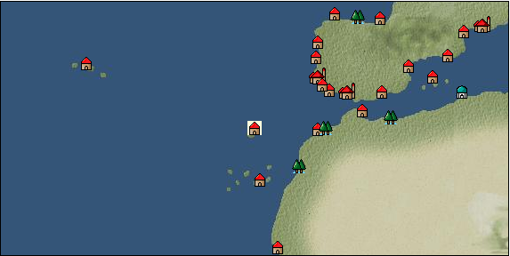

# Port: Madeira

import Tabs from '@theme/Tabs';
import TabItem from '@theme/TabItem';

## General Information

| Attribute | Details |
| :--- | :--- |
| **Port Name** | Madeira |
| **Port Type** | 領地 |
| **Region** | western europe |
| **Sea Area** | off the coast of Madeira |
| **Required Language** | portuguese |
| **Coordinates** | （15486，3439） |
| **Investment Reward** | [Renegotiation request form](docs/Items/Consumables/Consumables-Documents/item_2803.md) （必要投資額：2,000,000ドゥカード） |

### Available Facilities

| guild | intermediary | exchange | tool shop | workshop craftsman | Painter | sculptor | peddler |
| --- | --- | --- | --- | --- | --- | --- | --- |
|   |   | ○ | ○ | ○ |   |   |   |
| Shipyard Master | Lumbermaker | Sail-maker | weapon craftsman | master | TavernFemale | archive | salesperson |
| --- | --- | --- | --- | --- | --- | --- | --- |
|   |   |   | ○ |   |   |   |   |
| Shipwright | 銀行 | street worker | 王宮 | Trading post | church | suburbs | translator |
| --- | --- | --- | --- | --- | --- | --- | --- |
| ○ | ○ | ○ |   |   | ○ |   |   |

### Description
A town on an island southwest of the Iberian Peninsula. It was discovered in recent years and has begun to develop mainly in agriculture. Due to its low latitude and high temperature and humidity, sugarcane is cultivated here. The climate is also suitable for wine production. Cultural area: Iberia Investment fee: Renegotiation request form (1 piece for 2M)

<Tabs>
  <TabItem value="trade_goods_sales" label="Trade Goods Sales">

| Item | Group | Purchase Price | Allied Price | Remarks |
| --- | --- | --- | --- | --- |
| [sugar cane](docs/Items/TradeGoods/TradeGoods-Foodstuffs/item_93.md) | [Trading items (food items)](docs/Categories/category_3.md) | 219 | (192) |  |
| [liqueur](docs/Items/TradeGoods/TradeGoods-Alcohol/item_18.md) | [交易品（酒類）](docs/Categories/category_9.md) | 543 | (476) |  |
| [wine](docs/Items/TradeGoods/TradeGoods-Alcohol/item_11.md) | [交易品（酒類）](docs/Categories/category_9.md) | (429) | 376 |  |
| Investment required (Required investment amount: 180,000) A brewed liquor made from grapes. A drink with a very old history. |
| [raisins](docs/Items/TradeGoods/TradeGoods-Sunddries/item_35.md) | [Trading goods (hobby goods)](docs/Categories/category_10.md) | 238 | (209) |  |
| [wooden statue](docs/Items/TradeGoods/TradeGoods-Art/item_95.md) | [交易品（美術品）](docs/Categories/category_14.md) | 994 | (870) |  |
| [sugar](docs/Items/TradeGoods/TradeGoods-Seasonings/item_94.md) | [交易品（調味料）](docs/Categories/category_4.md) | 652 | (571) |  |
| [魚肉](docs/Items/TradeGoods/TradeGoods-Foodstuffs/item_10.md) | [Trading items (food items)](docs/Categories/category_3.md) | 146 | 128 |  |
  </TabItem>
  <TabItem value="sale_specialty" label="Sale (Specialty)">

| Item | Group | sale price | Allied Price | Remarks |
| --- | --- | --- | --- | --- |

#### [交易品（繊維）](docs/Categories/category_1.md)

| [Basho](docs/Items/TradeGoods/TradeGoods-Fibers/item_3862.md) | 交易品（繊維） | (26,838) | 31,316 |  |
| [tiger skin](docs/Items/TradeGoods/TradeGoods-Fibers/item_3790.md) | 交易品（繊維） | (22,563) | 26,327 |  |
| [Green ramie](docs/Items/TradeGoods/TradeGoods-Fibers/item_3428.md) | 交易品（繊維） | (23,996) | 28,000 |  |
| [deerskin](docs/Items/TradeGoods/TradeGoods-Fibers/item_3648.md) | 交易品（繊維） | (31,452) | 36,700 |  |

#### [Trading Goods (Dye)](docs/Categories/category_2.md)

| [Indian Akane](docs/Items/TradeGoods/TradeGoods-Dye/item_1037.md) | Trading Goods (Dye) | 1,145 | (1,288) |  |
| [Indian indigo](docs/Items/TradeGoods/TradeGoods-Dye/item_157.md) | Trading Goods (Dye) | 1,167 | (1,313) |  |
| [Shorou](docs/Items/TradeGoods/TradeGoods-Dye/item_3691.md) | Trading Goods (Dye) | (21,913) | 25,569 |  |
| [turmeric](docs/Items/TradeGoods/TradeGoods-Dye/item_1433.md) | Trading Goods (Dye) | (652) | 760 |  |
| [gallnut](docs/Items/TradeGoods/TradeGoods-Dye/item_3429.md) | Trading Goods (Dye) | (25,827) | 30,136 |  |

#### [Trading items (food items)](docs/Categories/category_3.md)

| [buckwheat](docs/Items/TradeGoods/TradeGoods-Foodstuffs/item_3430.md) | Trading items (food items) | (23,721) | 27,679 |  |

#### [交易品（調味料）](docs/Categories/category_4.md)

| [oyster sauce](docs/Items/TradeGoods/TradeGoods-Seasonings/item_3505.md) | 交易品（調味料） | (2,833) | 3,305 |  |
| [tamarind](docs/Items/TradeGoods/TradeGoods-Seasonings/item_1968.md) | 交易品（調味料） | 2,011 | (2,262) |  |
| [Choshi](docs/Items/TradeGoods/TradeGoods-Seasonings/item_3793.md) | 交易品（調味料） | (22,227) | 25,935 |  |
| [miso](docs/Items/TradeGoods/TradeGoods-Seasonings/item_3420.md) | 交易品（調味料） | (3,703) | 4,320 |  |
| [羅漢果](docs/Items/TradeGoods/TradeGoods-Seasonings/item_4004.md) | 交易品（調味料） | (9,513) | 11,100 |  |
| [Bean sauce](docs/Items/TradeGoods/TradeGoods-Seasonings/item_3875.md) | 交易品（調味料） | (31,913) | 37,237 |  |
| [soy sauce](docs/Items/TradeGoods/TradeGoods-Seasonings/item_3425.md) | 交易品（調味料） | (25,811) | 30,117 |  |
| [black vinegar](docs/Items/TradeGoods/TradeGoods-Seasonings/item_3475.md) | 交易品（調味料） | (4,556) | 5,316 |  |

#### [交易品（雑貨）](docs/Categories/category_5.md)

| [old ink stick](docs/Items/TradeGoods/TradeGoods-Misc/item_3921.md) | 交易品（雑貨） | (9,427) | 11,000 |  |
| [Japanese books](docs/Items/TradeGoods/TradeGoods-Misc/item_3439.md) | 交易品（雑貨） | (32,535) | 37,963 |  |
| [lantern](docs/Items/TradeGoods/TradeGoods-Misc/item_3683.md) | 交易品（雑貨） | (9,018) | 10,522 |  |

#### [Trading products (medical products)](docs/Categories/category_6.md)

| [heath](docs/Items/TradeGoods/TradeGoods-Medicine/item_63.md) | Trading products (medical products) | (335) | 390 |  |
| [Borei](docs/Items/TradeGoods/TradeGoods-Medicine/item_3678.md) | Trading products (medical products) | (31,832) | 37,143 |  |
| [calamus](docs/Items/TradeGoods/TradeGoods-Medicine/item_3427.md) | Trading products (medical products) | (24,961) | 29,125 |  |

#### [Trading products (precious metals)](docs/Categories/category_8.md)

| [platinum](docs/Items/TradeGoods/TradeGoods-Metals/item_2178.md) | Trading products (precious metals) | 6,620 | (7,448) |  |
| [佐摩銀](docs/Items/TradeGoods/TradeGoods-Metals/item_3432.md) | Trading products (precious metals) | (33,657) | 39,273 |  |

#### [交易品（酒類）](docs/Categories/category_9.md)

| [aquavit](docs/Items/TradeGoods/TradeGoods-Alcohol/item_572.md) | 交易品（酒類） | [Edit Sale Price](docs/Ports/port_18.md) |  |
| [whiskey](docs/Items/TradeGoods/TradeGoods-Alcohol/item_1.md) | 交易品（酒類） | (771) | 899 |  |
| [tequila](docs/Items/TradeGoods/TradeGoods-Alcohol/item_108.md) | 交易品（酒類） | 2,091 | 5,194 |  |
| [Taiwan rice wine](docs/Items/TradeGoods/TradeGoods-Alcohol/item_3672.md) | 交易品（酒類） | (22,655) | 26,435 |  |
| [Sake](docs/Items/TradeGoods/TradeGoods-Alcohol/item_3424.md) | 交易品（酒類） | (25,231) | 29,440 |  |

#### [Trading goods (hobby goods)](docs/Categories/category_10.md)

| [Aigyoku](docs/Items/TradeGoods/TradeGoods-Sunddries/item_3677.md) | Trading goods (hobby goods) | (22,125) | 25,816 |  |
| [cacao](docs/Items/TradeGoods/TradeGoods-Sunddries/item_140.md) | Trading goods (hobby goods) | 1,215 | 1,439 |  |
| [cashew nuts](docs/Items/TradeGoods/TradeGoods-Sunddries/item_2120.md) | Trading goods (hobby goods) | 949 | 1,047 |  |
| [tobacco](docs/Items/TradeGoods/TradeGoods-Sunddries/item_109.md) | Trading goods (hobby goods) | 1,280 | 5,510 |  |
| [eggplant](docs/Items/TradeGoods/TradeGoods-Sunddries/item_3426.md) | Trading goods (hobby goods) | (23,698) | 27,652 |  |
| [pineapple](docs/Items/TradeGoods/TradeGoods-Sunddries/item_867.md) | Trading goods (hobby goods) | 2,000 | 2,110 |  |
| [peanuts](docs/Items/TradeGoods/TradeGoods-Sunddries/item_134.md) | Trading goods (hobby goods) | 385 | (433) |  |
| [Korean tea](docs/Items/TradeGoods/TradeGoods-Sunddries/item_3751.md) | Trading goods (hobby goods) | (22,375) | 26,108 |  |
| [black tea](docs/Items/TradeGoods/TradeGoods-Sunddries/item_675.md) | Trading goods (hobby goods) | 2,210 | 2,582 |  |
| [raspberry](docs/Items/TradeGoods/TradeGoods-Sunddries/item_5419.md) | Trading goods (hobby goods) | (9,172) | 10,702 |  |

#### [Trading Goods (Spices)](docs/Categories/category_11.md)

| [oakmoss](docs/Items/TradeGoods/TradeGoods-Perfume/item_819.md) | Trading Goods (Spices) | 1,053 | (1,184) |  |
| [gardenia](docs/Items/TradeGoods/TradeGoods-Perfume/item_1091.md) | Trading Goods (Spices) | (21,838) | 25,481 |  |
| [jasmine](docs/Items/TradeGoods/TradeGoods-Perfume/item_772.md) | Trading Goods (Spices) | 6,147 | 6,270 |  |
| [geranium](docs/Items/TradeGoods/TradeGoods-Perfume/item_145.md) | Trading Goods (Spices) | 1,100 | 1,156 |  |
| [mastic](docs/Items/TradeGoods/TradeGoods-Perfume/item_680.md) | Trading Goods (Spices) | (2,269) | 2,647 |  |
| [sandalwood](docs/Items/TradeGoods/TradeGoods-Perfume/item_771.md) | Trading Goods (Spices) | 3,820 | (4,297) |  |
| [貝甲香](docs/Items/TradeGoods/TradeGoods-Perfume/item_776.md) | Trading Goods (Spices) | (2,096) | 2,445 |  |

#### [Trading Goods (Spices)](docs/Categories/category_12.md)

| [allspice](docs/Items/TradeGoods/TradeGoods-Spices/item_1848.md) | Trading Goods (Spices) | 1,607 | (1,808) |  |
| [cloves](docs/Items/TradeGoods/TradeGoods-Spices/item_1092.md) | Trading Goods (Spices) | (7,112) | 8,298 |  |
| [Kouzuku](docs/Items/TradeGoods/TradeGoods-Spices/item_3690.md) | Trading Goods (Spices) | (23,314) | 27,204 |  |
| [pepper](docs/Items/TradeGoods/TradeGoods-Spices/item_58.md) | Trading Goods (Spices) | 5,190 | 5,733 |  |
| [Sanshou](docs/Items/TradeGoods/TradeGoods-Spices/item_3794.md) | Trading Goods (Spices) | (31,395) | 36,633 |  |
| [cinnamon](docs/Items/TradeGoods/TradeGoods-Spices/item_1432.md) | Trading Goods (Spices) | 5,000 | 5,441 |  |
| [nutmeg](docs/Items/TradeGoods/TradeGoods-Spices/item_1969.md) | Trading Goods (Spices) | (20,876) | 24,359 |  |
| [mace](docs/Items/TradeGoods/TradeGoods-Spices/item_2100.md) | Trading Goods (Spices) | (19,544) | 22,804 |  |
| [chili pepper](docs/Items/TradeGoods/TradeGoods-Spices/item_1831.md) | Trading Goods (Spices) | 1,479 | 1,671 |  |
| [Grapefruit](docs/Items/TradeGoods/TradeGoods-Spices/item_3422.md) | Trading Goods (Spices) | (31,067) | 36,250 |  |

#### [Trading goods (artificial goods)](docs/Categories/category_13.md)

| [Tumbaga](docs/Items/TradeGoods/TradeGoods-Luxuries/item_3028.md) | Trading goods (artificial goods) | 16,035 | 22,097 |  |
| [Kuresute](docs/Items/TradeGoods/TradeGoods-Luxuries/item_3897.md) | Trading goods (artificial goods) | (10,386) | 12,118 |  |
| [湖筆](docs/Items/TradeGoods/TradeGoods-Luxuries/item_3898.md) | Trading goods (artificial goods) | (37,979) | 44,316 |  |
| [lacquerware](docs/Items/TradeGoods/TradeGoods-Luxuries/item_3435.md) | Trading goods (artificial goods) | (26,356) | 30,753 |  |
| [Saori](docs/Items/TradeGoods/TradeGoods-Luxuries/item_3676.md) | Trading goods (artificial goods) | (37,481) | 43,734 |  |

#### [交易品（美術品）](docs/Categories/category_14.md)

| [taiwan wood carving](docs/Items/TradeGoods/TradeGoods-Art/item_3697.md) | 交易品（美術品） | (32,946) | 38,443 |  |
| [Japanese painting](docs/Items/TradeGoods/TradeGoods-Art/item_3436.md) | 交易品（美術品） | (34,180) | 39,883 |  |
| [Mianzhu New Year Pictures](docs/Items/TradeGoods/TradeGoods-Art/item_4005.md) | 交易品（美術品） | (9,540) | 11,131 |  |

#### [Trading Items (Gemstones)](docs/Categories/category_15.md)

| [aventurine](docs/Items/TradeGoods/TradeGoods-Gems/item_678.md) | Trading Items (Gemstones) | 4,620 | (5,198) |  |
| [inca rose](docs/Items/TradeGoods/TradeGoods-Gems/item_3014.md) | Trading Items (Gemstones) | (13,999) | 16,334 |  |
| [cat's eye](docs/Items/TradeGoods/TradeGoods-Gems/item_1047.md) | Trading Items (Gemstones) | 9,195 | 8,571 |  |
| [sapphire](docs/Items/TradeGoods/TradeGoods-Gems/item_676.md) | Trading Items (Gemstones) | 10,000 | 11,736 |  |
| [turquoise](docs/Items/TradeGoods/TradeGoods-Gems/item_1006.md) | Trading Items (Gemstones) | 3,109 | (3,497) |  |
| [diamond](docs/Items/TradeGoods/TradeGoods-Gems/item_449.md) | Trading Items (Gemstones) | 5,619 | 5,417 |  |
| [topaz](docs/Items/TradeGoods/TradeGoods-Gems/item_1097.md) | Trading Items (Gemstones) | (4,489) | 5,237 |  |
| [lapis lazuli](docs/Items/TradeGoods/TradeGoods-Gems/item_995.md) | Trading Items (Gemstones) | 5,366 | 5,447 |  |
| [ruby](docs/Items/TradeGoods/TradeGoods-Gems/item_773.md) | Trading Items (Gemstones) | 11,037 | 11,500 |  |
| [amethyst](docs/Items/TradeGoods/TradeGoods-Gems/item_3434.md) | Trading Items (Gemstones) | (26,945) | 31,441 |  |

#### [Trading Items (Firearms)](docs/Categories/category_17.md)

| [tanegashima gun](docs/Items/TradeGoods/TradeGoods-Firearms/item_3423.md) | Trading Items (Firearms) | (33,081) | 38,600 |  |
| [銅手銃](docs/Items/TradeGoods/TradeGoods-Firearms/item_3700.md) | Trading Items (Firearms) | (30,035) | 35,046 |  |

#### [Trading Goods (Livestock)](docs/Categories/category_18.md)

| [boar](docs/Items/TradeGoods/TradeGoods-Livestock/item_3476.md) | Trading Goods (Livestock) | (23,616) | 27,556 |  |
| [donkey](docs/Items/TradeGoods/TradeGoods-Livestock/item_3924.md) | Trading Goods (Livestock) | (1,983) | 2,313 |  |

#### [交易品（工業品）](docs/Categories/category_19.md)

| [Japanese paper](docs/Items/TradeGoods/TradeGoods-Wares/item_3438.md) | 交易品（工業品） | (24,853) | 29,000 |  |
| [paint](docs/Items/TradeGoods/TradeGoods-Wares/item_3411.md) | 交易品（工業品） | (2,591) | 3,023 |  |

#### [交易品（織物）](docs/Categories/category_20.md)

| [indian chintz](docs/Items/TradeGoods/TradeGoods-Fabrics/item_159.md) | 交易品（織物） | 2,208 | (2,484) |  |
| [persian rug](docs/Items/TradeGoods/TradeGoods-Fabrics/item_606.md) | 交易品（織物） | 8,103 | (9,116) |  |
| [明紬](docs/Items/TradeGoods/TradeGoods-Fabrics/item_3753.md) | 交易品（織物） | (22,854) | 26,667 |  |
| [Nishijin textile](docs/Items/TradeGoods/TradeGoods-Fabrics/item_3431.md) | 交易品（織物） | (26,221) | 30,596 |  |
  </TabItem>
  <TabItem value="sale_no_specialty" label="Sale (No Specialty)">

| Item | Group | sale price | Allied Price | Remarks |
| --- | --- | --- | --- | --- |

#### [交易品（繊維）](docs/Categories/category_1.md)

| [fur](docs/Items/TradeGoods/TradeGoods-Fibers/item_634.md) | 交易品（繊維） | (2,001) | 2,334 |  |
| [leather](docs/Items/TradeGoods/TradeGoods-Fibers/item_44.md) | 交易品（繊維） | 502 | (564) |  |
| [wool](docs/Items/TradeGoods/TradeGoods-Fibers/item_5.md) | 交易品（繊維） | (390) | 454 |  |
| [numb](docs/Items/TradeGoods/TradeGoods-Fibers/item_900.md) | 交易品（繊維） | 12 | (13) |  |
| [jute](docs/Items/TradeGoods/TradeGoods-Fibers/item_128.md) | 交易品（繊維） | (176) | 205 |  |

#### [Trading Goods (Dye)](docs/Categories/category_2.md)

| [ward](docs/Items/TradeGoods/TradeGoods-Dye/item_57.md) | Trading Goods (Dye) | 1,100 | (1,237) |  |

#### [Trading items (food items)](docs/Categories/category_3.md)

| [fava beans](docs/Items/TradeGoods/TradeGoods-Foodstuffs/item_102.md) | Trading items (food items) | 113 | (127) |  |
| [duck meat](docs/Items/TradeGoods/TradeGoods-Foodstuffs/item_32.md) | Trading items (food items) | 407 | 466 |  |
| [pumpkin](docs/Items/TradeGoods/TradeGoods-Foodstuffs/item_137.md) | Trading items (food items) | 255 | (286) |  |
| [sweet potato](docs/Items/TradeGoods/TradeGoods-Foodstuffs/item_1931.md) | Trading items (food items) | 215 | (241) |  |
| [sugar cane](docs/Items/TradeGoods/TradeGoods-Foodstuffs/item_93.md) | Trading items (food items) | 96 | (108) |  |
| [sausage](docs/Items/TradeGoods/TradeGoods-Foodstuffs/item_27.md) | Trading items (food items) | 358 | (402) |  |
| [onion](docs/Items/TradeGoods/TradeGoods-Foodstuffs/item_28.md) | Trading items (food items) | 110 | (123) |  |
| [corn](docs/Items/TradeGoods/TradeGoods-Foodstuffs/item_138.md) | Trading items (food items) | 199 | (223) |  |
| [ham](docs/Items/TradeGoods/TradeGoods-Foodstuffs/item_290.md) | Trading items (food items) | (378) | 440 |  |
| [bacon](docs/Items/TradeGoods/TradeGoods-Foodstuffs/item_566.md) | Trading items (food items) | 346 | (389) |  |
| [egg](docs/Items/TradeGoods/TradeGoods-Foodstuffs/item_40.md) | Trading items (food items) | 35 | (39) |  |
| [barley](docs/Items/TradeGoods/TradeGoods-Foodstuffs/item_124.md) | Trading items (food items) | (72) | 83 |  |
| [flour](docs/Items/TradeGoods/TradeGoods-Foodstuffs/item_605.md) | Trading items (food items) | (48) | 56 |  |
| [beef](docs/Items/TradeGoods/TradeGoods-Foodstuffs/item_26.md) | Trading items (food items) | 659 | 659 |  |
| [mutton](docs/Items/TradeGoods/TradeGoods-Foodstuffs/item_33.md) | Trading items (food items) | (414) | 483 |  |
| [pork](docs/Items/TradeGoods/TradeGoods-Foodstuffs/item_41.md) | Trading items (food items) | 360 | (405) |  |
| [red bean](docs/Items/TradeGoods/TradeGoods-Foodstuffs/item_123.md) | Trading items (food items) | (123) | 143 |  |
| [魚肉](docs/Items/TradeGoods/TradeGoods-Foodstuffs/item_10.md) | Trading items (food items) | 55 | (61) |  |
| [chicken meat](docs/Items/TradeGoods/TradeGoods-Foodstuffs/item_29.md) | Trading items (food items) | 330 | (371) |  |

#### [交易品（調味料）](docs/Categories/category_4.md)

| [almond oil](docs/Items/TradeGoods/TradeGoods-Seasonings/item_578.md) | 交易品（調味料） | 628 | (706) |  |
| [olive oil](docs/Items/TradeGoods/TradeGoods-Seasonings/item_48.md) | 交易品（調味料） | (350) | 408 |  |
| [lard](docs/Items/TradeGoods/TradeGoods-Seasonings/item_43.md) | 交易品（調味料） | 265 | (298) |  |
| [wine vinegar](docs/Items/TradeGoods/TradeGoods-Seasonings/item_429.md) | 交易品（調味料） | 531 | 579 |  |
| [salt](docs/Items/TradeGoods/TradeGoods-Seasonings/item_42.md) | 交易品（調味料） | 260 | 267 |  |
| [sugar](docs/Items/TradeGoods/TradeGoods-Seasonings/item_94.md) | 交易品（調味料） | 286 | (321) |  |

#### [交易品（雑貨）](docs/Categories/category_5.md)

| [Western books](docs/Items/TradeGoods/TradeGoods-Misc/item_293.md) | 交易品（雑貨） | 702 | 709 |  |

#### [Trading products (medical products)](docs/Categories/category_6.md)

| [Maca](docs/Items/TradeGoods/TradeGoods-Medicine/item_3000.md) | Trading products (medical products) | 1,884 | 2,128 |  |
| [lemon balm](docs/Items/TradeGoods/TradeGoods-Medicine/item_127.md) | Trading products (medical products) | (266) | 310 |  |

#### [Trading Items (Iron Stone)](docs/Categories/category_7.md)

| [tin ore](docs/Items/TradeGoods/TradeGoods-Minerals/item_23.md) | Trading Items (Iron Stone) | 557 | (626) |  |
| [iron ore](docs/Items/TradeGoods/TradeGoods-Minerals/item_146.md) | Trading Items (Iron Stone) | (672) | 784 |  |
| [copper ore](docs/Items/TradeGoods/TradeGoods-Minerals/item_65.md) | Trading Items (Iron Stone) | (801) | 934 |  |

#### [Trading products (precious metals)](docs/Categories/category_8.md)

| [gold](docs/Items/TradeGoods/TradeGoods-Metals/item_659.md) | Trading products (precious metals) | 8,438 | 8,663 |  |

#### [交易品（酒類）](docs/Categories/category_9.md)

| [vodka](docs/Items/TradeGoods/TradeGoods-Alcohol/item_579.md) | 交易品（酒類） | (630) | 734 |  |
| [sherry](docs/Items/TradeGoods/TradeGoods-Alcohol/item_844.md) | 交易品（酒類） | 453 | 461 |  |
| [Beer](docs/Items/TradeGoods/TradeGoods-Alcohol/item_2.md) | 交易品（酒類） | 374 | (420) |  |
| [fruit brandy](docs/Items/TradeGoods/TradeGoods-Alcohol/item_1440.md) | 交易品（酒類） | 635 | 635 |  |
| [brandy](docs/Items/TradeGoods/TradeGoods-Alcohol/item_9.md) | 交易品（酒類） | 760 | 760 |  |
| [palm wine](docs/Items/TradeGoods/TradeGoods-Alcohol/item_436.md) | 交易品（酒類） | (414) | 482 |  |
| [rum](docs/Items/TradeGoods/TradeGoods-Alcohol/item_139.md) | 交易品（酒類） | 694 | 749 |  |

#### [Trading goods (hobby goods)](docs/Categories/category_10.md)

| [almond](docs/Items/TradeGoods/TradeGoods-Sunddries/item_367.md) | Trading goods (hobby goods) | 194 | 198 |  |
| [walnut](docs/Items/TradeGoods/TradeGoods-Sunddries/item_522.md) | Trading goods (hobby goods) | 523 | (588) |  |
| [coffee](docs/Items/TradeGoods/TradeGoods-Sunddries/item_445.md) | Trading goods (hobby goods) | (450) | 525 |  |
| [hazelnut](docs/Items/TradeGoods/TradeGoods-Sunddries/item_125.md) | Trading goods (hobby goods) | 484 | 484 |  |

#### [Trading Goods (Spices)](docs/Categories/category_11.md)

| [lira](docs/Items/TradeGoods/TradeGoods-Perfume/item_30.md) | Trading Goods (Spices) | (672) | 783 |  |
| [Ryushu incense](docs/Items/TradeGoods/TradeGoods-Perfume/item_101.md) | Trading Goods (Spices) | 3,877 | 3,950 |  |
| [Musk](docs/Items/TradeGoods/TradeGoods-Perfume/item_158.md) | Trading Goods (Spices) | 4,521 | (5,086) |  |

#### [Trading Goods (Spices)](docs/Categories/category_12.md)

| [oregano](docs/Items/TradeGoods/TradeGoods-Spices/item_430.md) | Trading Goods (Spices) | (454) | 529 |  |
| [coriander](docs/Items/TradeGoods/TradeGoods-Spices/item_1044.md) | Trading Goods (Spices) | 397 | (446) |  |
| [Sesame](docs/Items/TradeGoods/TradeGoods-Spices/item_437.md) | Trading Goods (Spices) | (285) | 332 |  |
| [basil](docs/Items/TradeGoods/TradeGoods-Spices/item_126.md) | Trading Goods (Spices) | 171 | 179 |  |

#### [Trading goods (artificial goods)](docs/Categories/category_13.md)

| [embroidery thread](docs/Items/TradeGoods/TradeGoods-Luxuries/item_898.md) | Trading goods (artificial goods) | (1,960) | 2,286 |  |
| [皮革製品](docs/Items/TradeGoods/TradeGoods-Luxuries/item_12.md) | Trading goods (artificial goods) | 1,142 | (1,284) |  |
| [ceramics](docs/Items/TradeGoods/TradeGoods-Luxuries/item_152.md) | Trading goods (artificial goods) | (1,274) | 1,486 |  |

#### [交易品（美術品）](docs/Categories/category_14.md)

| [青銅像](docs/Items/TradeGoods/TradeGoods-Art/item_148.md) | 交易品（美術品） | (981) | 1,144 |  |

#### [Trading Items (Gemstones)](docs/Categories/category_15.md)

| [Agate](docs/Items/TradeGoods/TradeGoods-Gems/item_107.md) | Trading Items (Gemstones) | 4,982 | (5,605) |  |
| [emerald](docs/Items/TradeGoods/TradeGoods-Gems/item_777.md) | Trading Items (Gemstones) | 6,800 | 6,953 |  |
| [coral](docs/Items/TradeGoods/TradeGoods-Gems/item_141.md) | Trading Items (Gemstones) | 2,640 | (2,970) |  |
| [malachite](docs/Items/TradeGoods/TradeGoods-Gems/item_679.md) | Trading Items (Gemstones) | (1,753) | 2,045 |  |
| [crystal](docs/Items/TradeGoods/TradeGoods-Gems/item_893.md) | Trading Items (Gemstones) | (1,463) | 1,706 |  |
| [pearl](docs/Items/TradeGoods/TradeGoods-Gems/item_769.md) | Trading Items (Gemstones) | 8,390 | 8,899 |  |
| [ivory](docs/Items/TradeGoods/TradeGoods-Gems/item_699.md) | Trading Items (Gemstones) | 2,286 | (2,572) |  |

#### [Trading Items (Arms)](docs/Categories/category_16.md)

| [crossbow](docs/Items/TradeGoods/TradeGoods-Weapons/item_537.md) | Trading Items (Arms) | 1,050 | 1,070 |  |
| [dagger](docs/Items/TradeGoods/TradeGoods-Weapons/item_143.md) | Trading Items (Arms) | 886 | 886 |  |

#### [Trading Items (Firearms)](docs/Categories/category_17.md)

| [arquebus gun](docs/Items/TradeGoods/TradeGoods-Firearms/item_14.md) | Trading Items (Firearms) | 1,810 | (2,036) |  |
| [musket gun](docs/Items/TradeGoods/TradeGoods-Firearms/item_584.md) | Trading Items (Firearms) | 2,355 | (2,649) |  |
| [大砲](docs/Items/TradeGoods/TradeGoods-Firearms/item_4.md) | Trading Items (Firearms) | 3,090 | (3,476) |  |
| [gunpowder](docs/Items/TradeGoods/TradeGoods-Firearms/item_352.md) | Trading Items (Firearms) | 768 | (864) |  |
| [cannonball](docs/Items/TradeGoods/TradeGoods-Firearms/item_144.md) | Trading Items (Firearms) | 1,400 | 1,630 |  |

#### [Trading Goods (Livestock)](docs/Categories/category_18.md)

| [duck](docs/Items/TradeGoods/TradeGoods-Livestock/item_38.md) | Trading Goods (Livestock) | 61 | (68) |  |
| [alpaca](docs/Items/TradeGoods/TradeGoods-Livestock/item_2995.md) | Trading Goods (Livestock) | 1,260 | 1,385 |  |
| [chicken](docs/Items/TradeGoods/TradeGoods-Livestock/item_252.md) | Trading Goods (Livestock) | 49 | 55 |  |
| [pig](docs/Items/TradeGoods/TradeGoods-Livestock/item_37.md) | Trading Goods (Livestock) | 67 | (75) |  |

#### [交易品（工業品）](docs/Categories/category_19.md)

| [rubber](docs/Items/TradeGoods/TradeGoods-Wares/item_2819.md) | 交易品（工業品） | 1,455 | (1,637) |  |
| [oil](docs/Items/TradeGoods/TradeGoods-Wares/item_613.md) | 交易品（工業品） | 633 | (712) |  |
| [sulfur](docs/Items/TradeGoods/TradeGoods-Wares/item_66.md) | 交易品（工業品） | (519) | 605 |  |
| [iron material](docs/Items/TradeGoods/TradeGoods-Wares/item_268.md) | 交易品（工業品） | (805) | 939 |  |
| [銅](docs/Items/TradeGoods/TradeGoods-Wares/item_894.md) | 交易品（工業品） | (966) | 1,127 |  |
| [鋼](docs/Items/TradeGoods/TradeGoods-Wares/item_573.md) | 交易品（工業品） | (834) | 972 |  |

#### [交易品（織物）](docs/Categories/category_20.md)

| [tweed](docs/Items/TradeGoods/TradeGoods-Fabrics/item_31.md) | 交易品（織物） | (1,212) | 1,414 |  |
| [knit](docs/Items/TradeGoods/TradeGoods-Fabrics/item_164.md) | 交易品（織物） | (588) | 686 |  |
  </TabItem>
  <TabItem value="guild_&_others" label="Guild & Others">

| Item | Group | Sales price | Handling NPC | Remarks |
| --- | --- | --- | --- | --- |

#### others

| [Renegotiation request form](docs/Items/Consumables/Consumables-Documents/item_2803.md) | [Consumables (request documents)](docs/Categories/category_45.md) |  |  |  |
  </TabItem>
  <TabItem value="toolman" label="Toolman">

| Item | Group | Sales price | Handling NPC | Remarks |
| --- | --- | --- | --- | --- |

#### [recipe book](docs/Categories/category_22.md)

| [Mode Design Collection Volume 1](docs/Items/RecipeBooks/item_92.md) | recipe book | 10,000 | tool shop owner |  |
| [Textile secrets/fabric book](docs/Items/RecipeBooks/item_91.md) | recipe book | 10,000 | tool shop owner |  |

#### [Equipment (body)](docs/Categories/category_24.md)

| [gilet](docs/Items/Equipment/Equipment-Body/item_78.md) | Equipment (body) | 27,500 | tool shop owner |  |
| [buccaneer vest](docs/Items/Equipment/Equipment-Body/item_77.md) | Equipment (body) | 11,800 | tool shop owner |  |

#### [Consumables (land battle/deck battle)](docs/Categories/category_29.md)

| [black kite feather](docs/Items/Consumables/Consumables-Landbattle/item_88.md) | Consumables (land battle/deck battle) | 100 | tool shop owner |  |
| [Assortment of wound medicine](docs/Items/Consumables/Consumables-Landbattle/item_90.md) | Consumables (land battle/deck battle) | 500 | tool shop owner |  |
| [therapeutic drug](docs/Items/Consumables/Consumables-Landbattle/item_89.md) | Consumables (land battle/deck battle) | 300 | tool shop owner |  |
| [antidote](docs/Items/Consumables/Consumables-Landbattle/item_270.md) | Consumables (land battle/deck battle) | 100 | tool shop owner |  |

#### [Consumables (skill activation)](docs/Categories/category_31.md)

| [fishing gear](docs/Items/Consumables/Consumables-Skill/item_79.md) | Consumables (skill activation) | 2,500 | tool shop owner |  |
  </TabItem>
  <TabItem value="kobo_craftsmen" label="Craftsman">

| Item | Group | Sales price | Handling NPC | Remarks |
| --- | --- | --- | --- | --- |

#### [recipe book](docs/Categories/category_22.md)

| [Shipwright Introduction/Craft Book](docs/Items/RecipeBooks/item_75.md) | recipe book | 10,000 | workshop craftsman |  |
| [Shipwright Introduction/Sewing Book](docs/Items/RecipeBooks/item_74.md) | recipe book | 10,000 | workshop craftsman |  |
| [Shipwright Introduction/Casting Book](docs/Items/RecipeBooks/item_76.md) | recipe book | 10,000 | workshop craftsman |  |

#### [Consumables (skill activation)](docs/Categories/category_31.md)

| [四分儀](docs/Items/Consumables/Consumables-Skill/item_346.md) | Consumables (skill activation) | 500 | workshop craftsman |  |
| [simple salvage rope](docs/Items/Consumables/Consumables-Skill/item_2294.md) | Consumables (skill activation) | 500 | workshop craftsman |  |
| [Simple towing auxiliary rope](docs/Items/Consumables/Consumables-Skill/item_2295.md) | Consumables (skill activation) | 500 | workshop craftsman |  |

#### [shipbuilding materials](docs/Categories/category_47.md)

| [General purpose small square sail](docs/Items/ShipbuildingFS/item_3446.md) | shipbuilding materials | 30,000 | workshop craftsman |  |
| 要投資（必要投資額：300,000） |
| [General purpose small Latin sail](docs/Items/ShipbuildingFS/item_3445.md) | shipbuilding materials | 30,000 | workshop craftsman |  |
| 要投資（必要投資額：300,000） |
| [General-purpose small gun port](docs/Items/ShipbuildingFS/item_3447.md) | shipbuilding materials | 30,000 | workshop craftsman |  |
| 要投資（必要投資額：300,000） |
| [General-purpose small hull](docs/Items/ShipbuildingFS/item_3443.md) | shipbuilding materials | 100,000 | workshop craftsman |  |
| 要投資（必要投資額：300,000） |
  </TabItem>
</Tabs>