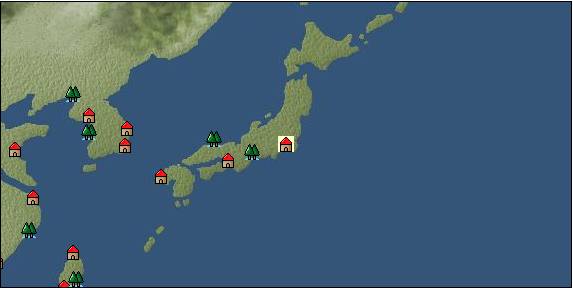

# Port: Edo

import Tabs from '@theme/Tabs';
import TabItem from '@theme/TabItem';

## General Information

| Attribute | Details |
| :--- | :--- |
| **Port Name** | Edo |
| **Port Type** | port of alliance |
| **Region** | east asia |
| **Sea Area** | eastern east asia |
| **Required Language** | Japanese |
| **Coordinates** | （6559，3339） |
| **Investment Reward** |  |

### Available Facilities

| guild | intermediary | exchange | tool shop | workshop craftsman | Painter | sculptor | peddler |
| --- | --- | --- | --- | --- | --- | --- | --- |
|   |   | ○ | ○ | ○ |   |   |   |
| Shipyard Master | Lumbermaker | Sail-maker | weapon craftsman | master | TavernFemale | archive | salesperson |
| --- | --- | --- | --- | --- | --- | --- | --- |
| ○ |   |   |   | ○ |   |   |   |
| Shipwright | 銀行 | street worker | 王宮 | Trading post | church | suburbs | translator |
| --- | --- | --- | --- | --- | --- | --- | --- |
| ○ | ○ | ○ |   |   |   | ○ |   |

### Description
A city on the Pacific coast that has been rapidly developing in recent years. Planned town development is underway under the leadership of influential people, including reclaiming coves and creating residential areas. Daimyo mansion Suburb: North of Edo Cultural area: Japan

<Tabs>
  <TabItem value="trade_goods_sales" label="Trade Goods Sales">

| Item | Group | Purchase Price | Allied Price | Remarks |
| --- | --- | --- | --- | --- |
| [buckwheat](docs/Items/TradeGoods/TradeGoods-Foodstuffs/item_3430.md) | [Trading items (food items)](docs/Categories/category_3.md) | [Edit Purchase Price](docs/Ports/port_180.md) |  |
| [boar](docs/Items/TradeGoods/TradeGoods-Livestock/item_3476.md) | [Trading Goods (Livestock)](docs/Categories/category_18.md) | [Edit Purchase Price](docs/Ports/port_180.md) |  |
| [gardenia](docs/Items/TradeGoods/TradeGoods-Perfume/item_1091.md) | [Trading Goods (Spices)](docs/Categories/category_11.md) | [Edit Purchase Price](docs/Ports/port_180.md) |  |
| [eggplant](docs/Items/TradeGoods/TradeGoods-Sunddries/item_3426.md) | [Trading goods (hobby goods)](docs/Categories/category_10.md) | [Edit Purchase Price](docs/Ports/port_180.md) |  |
| [gallnut](docs/Items/TradeGoods/TradeGoods-Dye/item_3429.md) | [Trading Goods (Dye)](docs/Categories/category_2.md) | [Edit Purchase Price](docs/Ports/port_180.md) |  |
| [佐摩銀](docs/Items/TradeGoods/TradeGoods-Metals/item_3432.md) | [Trading products (precious metals)](docs/Categories/category_8.md) | [Edit Purchase Price](docs/Ports/port_180.md) |  |
| [Japanese books](docs/Items/TradeGoods/TradeGoods-Misc/item_3439.md) | [交易品（雑貨）](docs/Categories/category_5.md) | [Edit Purchase Price](docs/Ports/port_180.md) |  |
| [Japanese paper](docs/Items/TradeGoods/TradeGoods-Wares/item_3438.md) | [交易品（工業品）](docs/Categories/category_19.md) | [Edit Purchase Price](docs/Ports/port_180.md) |  |
| [lantern](docs/Items/TradeGoods/TradeGoods-Misc/item_3683.md) | [交易品（雑貨）](docs/Categories/category_5.md) | [Edit Purchase Price](docs/Ports/port_180.md) |  |
| [Japanese sword](docs/Items/TradeGoods/TradeGoods-Weapons/item_3437.md) | [Trading Items (Arms)](docs/Categories/category_16.md) | [Edit Purchase Price](docs/Ports/port_180.md) |  |
| [Japanese painting](docs/Items/TradeGoods/TradeGoods-Art/item_3436.md) | [交易品（美術品）](docs/Categories/category_14.md) | [Edit Purchase Price](docs/Ports/port_180.md) |  |
| [Grapefruit](docs/Items/TradeGoods/TradeGoods-Spices/item_3422.md) | [Trading Goods (Spices)](docs/Categories/category_12.md) | [Edit Purchase Price](docs/Ports/port_180.md) |  |
| [Sake](docs/Items/TradeGoods/TradeGoods-Alcohol/item_3424.md) | [交易品（酒類）](docs/Categories/category_9.md) | [Edit Purchase Price](docs/Ports/port_180.md) |  |
| [lacquerware](docs/Items/TradeGoods/TradeGoods-Luxuries/item_3435.md) | [Trading goods (artificial goods)](docs/Categories/category_13.md) | [Edit Purchase Price](docs/Ports/port_180.md) |  |
| [white porcelain ore](docs/Items/TradeGoods/TradeGoods-Minerals/item_3433.md) | [Trading Items (Iron Stone)](docs/Categories/category_7.md) | [Edit Purchase Price](docs/Ports/port_180.md) |  |
| [tanegashima gun](docs/Items/TradeGoods/TradeGoods-Firearms/item_3423.md) | [Trading Items (Firearms)](docs/Categories/category_17.md) | [Edit Purchase Price](docs/Ports/port_180.md) |  |
| [amethyst](docs/Items/TradeGoods/TradeGoods-Gems/item_3434.md) | [Trading Items (Gemstones)](docs/Categories/category_15.md) | [Edit Purchase Price](docs/Ports/port_180.md) |  |
| [calamus](docs/Items/TradeGoods/TradeGoods-Medicine/item_3427.md) | [Trading products (medical products)](docs/Categories/category_6.md) | [Edit Purchase Price](docs/Ports/port_180.md) |  |
| [Nishijin textile](docs/Items/TradeGoods/TradeGoods-Fabrics/item_3431.md) | [交易品（織物）](docs/Categories/category_20.md) | [Edit Purchase Price](docs/Ports/port_180.md) |  |
| [soy sauce](docs/Items/TradeGoods/TradeGoods-Seasonings/item_3425.md) | [交易品（調味料）](docs/Categories/category_4.md) | [Edit Purchase Price](docs/Ports/port_180.md) |  |
| [Green ramie](docs/Items/TradeGoods/TradeGoods-Fibers/item_3428.md) | [交易品（繊維）](docs/Categories/category_1.md) | [Edit Purchase Price](docs/Ports/port_180.md) |  |
  </TabItem>
  <TabItem value="sale_specialty" label="Sale (Specialty)">

| Item | Group | sale price | Allied Price | Remarks |
| --- | --- | --- | --- | --- |
| Sales information for trade items with specialty judgment set is not registered. |
  </TabItem>
  <TabItem value="sale_no_specialty" label="Sale (No Specialty)">

| Item | Group | sale price | Allied Price | Remarks |
| --- | --- | --- | --- | --- |
| There is no information on the sale of trade goods. |
  </TabItem>
  <TabItem value="guild_&_others" label="Guild & Others">

| Item | Group | Sales price | Handling NPC | Remarks |
| --- | --- | --- | --- | --- |
| There is no sales information for the Item |
| --- |
  </TabItem>
  <TabItem value="toolman" label="Toolman">

| Item | Group | Sales price | Handling NPC | Remarks |
| --- | --- | --- | --- | --- |

#### [recipe book](docs/Categories/category_22.md)

| [East Asian accessories and crafts](docs/Items/RecipeBooks/item_3409.md) | recipe book | 800,000 | tool shop owner |  |

#### [Equipment (head)](docs/Categories/category_23.md)

| [Hairpin](docs/Items/Equipment/Equipment-Head/item_3384.md) | Equipment (head) | 102,000 | tool shop owner |  |
| [折烏帽子](docs/Items/Equipment/Equipment-Head/item_3383.md) | Equipment (head) | 102,000 | tool shop owner |  |

#### [Equipment (body)](docs/Categories/category_24.md)

| [Kosode (for women)](docs/Items/Equipment/Equipment-Body/item_5077.md) | Equipment (body) | 154,000 | tool shop owner |  |
| [Kosode (for men)](docs/Items/Equipment/Equipment-Body/item_3379.md) | Equipment (body) | 154,000 | tool shop owner |  |
| [crested haori hakama](docs/Items/Equipment/Equipment-Body/item_3408.md) | Equipment (body) | 404,000 | tool shop owner |  |

#### [Equipment (legs)](docs/Categories/category_26.md)

| [Zori sandals](docs/Items/Equipment/Equipment-Feet/item_3386.md) | Equipment (legs) | 56,000 | tool shop owner |  |
| [Straw sandals](docs/Items/Equipment/Equipment-Feet/item_3385.md) | Equipment (legs) | 48,000 | tool shop owner |  |

#### [Consumables (land battle/deck battle)](docs/Categories/category_29.md)

| [strong adhesive oil](docs/Items/Consumables/Consumables-Landbattle/item_662.md) | Consumables (land battle/deck battle) | 200 | tool shop owner |  |
| [torch for throwing](docs/Items/Consumables/Consumables-Landbattle/item_313.md) | Consumables (land battle/deck battle) | 150 | tool shop owner |  |
| [secret cure](docs/Items/Consumables/Consumables-Landbattle/item_563.md) | Consumables (land battle/deck battle) | 600 | tool shop owner |  |

#### [Consumables (skill activation)](docs/Categories/category_31.md)

| [fishing gear](docs/Items/Consumables/Consumables-Skill/item_79.md) | Consumables (skill activation) | 2,500 | tool shop owner |  |
  </TabItem>
  <TabItem value="kobo_craftsmen" label="Craftsman">

| Item | Group | Sales price | Handling NPC | Remarks |
| --- | --- | --- | --- | --- |

#### [Consumables (condition recovery)](docs/Categories/category_21.md)

| [Nostalgic carillon bell](docs/Items/Consumables/Consumables-Recovery/item_245.md) | Consumables (condition recovery) | 200 | workshop craftsman |  |
| [Ship song sheet music](docs/Items/Consumables/Consumables-Recovery/item_247.md) | Consumables (condition recovery) | 200 | workshop craftsman |  |

#### [recipe book](docs/Categories/category_22.md)

| [Japanese weapons](docs/Items/RecipeBooks/item_3405.md) | recipe book | Fixed recipe | workshop craftsman |  |

#### [Consumables (other)](docs/Categories/category_44.md)

| [帆塗料](docs/Items/Consumables/Consumables-Other/item_348.md) | Consumables (other) | 500 | workshop craftsman |  |
| [ship paint](docs/Items/Consumables/Consumables-Other/item_347.md) | Consumables (other) | 500 | workshop craftsman |  |
  </TabItem>
  <TabItem value="shipyard" label="Shipyard">

### Shipyard Master

| Item | Group | Sales price | Handling NPC | Remarks |
| --- | --- | --- | --- | --- |

#### [Boat](docs/Categories/category_43.md)

| [Hishigaki Kaisen](docs/Items/Ships/item_3388.md) | Boat | 8,400,000 | Shipyard Master |  |

### Shipwright

| Item | Group | Sales price | Handling NPC | Remarks |
| --- | --- | --- | --- | --- |

#### [recipe book](docs/Categories/category_22.md)

| [East Asian reinforced board manufacturing method](docs/Items/RecipeBooks/item_3472.md) | recipe book | Fixed recipe | Shipwright |  |
  </TabItem>
</Tabs>