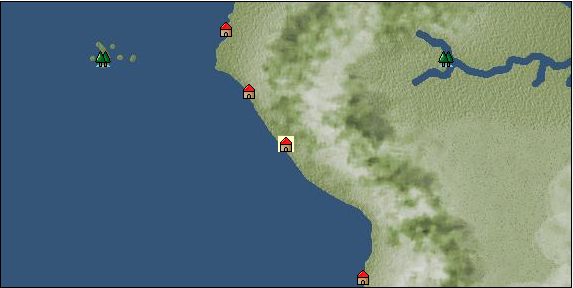

# Port: マチュピチュ

import Tabs from '@theme/Tabs';
import TabItem from '@theme/TabItem';

## General Information

| Attribute | Details |
| :--- | :--- |
| **Port Name** | machu picchu |
| **Port Type** | port of alliance |
| **Region** | South America |
| **Sea Area** |  |
| **Required Language** | Quechua |
| **Coordinates** | （，） |
| **Investment Reward** |  |

### Available Facilities

| guild | intermediary | exchange | tool shop | workshop craftsman | Painter | sculptor | peddler |
| --- | --- | --- | --- | --- | --- | --- | --- |
|   |   |   | ○ |   |   |   |   |
| Shipyard Master | Lumbermaker | Sail-maker | weapon craftsman | master | TavernFemale | archive | salesperson |
| --- | --- | --- | --- | --- | --- | --- | --- |
|   |   |   |   | ○ |   |   |   |
| Shipwright | 銀行 | street worker | 王宮 | Trading post | church | suburbs | translator |
| --- | --- | --- | --- | --- | --- | --- | --- |
|   |   |   |   |   |   |   |   |

### Description
A city of the Inca Empire surrounded by high peaks in the hinterland northeast of Lima. Means "old peak" in Quechua. The terraced fields, living quarters, and temples are laid out in a planned manner, demonstrating the Inca's advanced architectural techniques.

<Tabs>
  <TabItem value="trade_goods_sales" label="Trade Goods Sales">

| item | group | purchase price | 同盟時 | remarks |
| --- | --- | --- | --- | --- |
| There is no purchase information for trade goods. |
  </TabItem>
  <TabItem value="sale_specialty" label="Sale (Specialty)">

| item | group | sale price | 同盟時 | remarks |
| --- | --- | --- | --- | --- |
| Sales information for trade items with specialty judgment set is not registered. |
  </TabItem>
  <TabItem value="sale_no_specialty" label="Sale (No Specialty)">

| item | group | sale price | 同盟時 | remarks |
| --- | --- | --- | --- | --- |
| There is no information on the sale of trade goods. |
  </TabItem>
  <TabItem value="guild_&_others" label="Guild & Others">

| item | group | Sales price | Handling NPC | remarks |
| --- | --- | --- | --- | --- |
| There is no sales information for the item |
| --- |
  </TabItem>
  <TabItem value="toolman" label="Toolman">

| item | group | Sales price | Handling NPC | remarks |
| --- | --- | --- | --- | --- |

#### [Consumables (condition recovery)](Categories/category_21.md)

| [Shrine Maiden Chicha](Items/Consumables/Consumables-Recovery/item_2992.md) | [Consumables (condition recovery)](Categories/category_21.md) | 30,000 | tool shop owner |  |

#### [Equipment (head)](Categories/category_23.md)

| [inca kerchief](Items/Equipment/Equipment-Head/item_3036.md) | [Equipment (head)](Categories/category_23.md) | 200,000 | tool shop owner |  |
| [Inca folk hat](Items/Equipment/Equipment-Head/item_3044.md) | [Equipment (head)](Categories/category_23.md) | 200,000 | tool shop owner |  |
| [gold filigree headdress](Items/Equipment/Equipment-Head/item_3055.md) | [Equipment (head)](Categories/category_23.md) | 300,000 | tool shop owner |  |

#### [Equipment (belongings)](Categories/category_27.md)

| [木槍](Items/Equipment/Equipment-Weapon/item_438.md) | [Equipment (belongings)](Categories/category_27.md) | 34,400 | tool shop owner |  |
| [hunter's spear](Items/Equipment/Equipment-Weapon/item_655.md) | [Equipment (belongings)](Categories/category_27.md) | 38,700 | tool shop owner |  |

#### [Consumables (land battle/deck battle)](Categories/category_29.md)

| [strong adhesive oil](Items/Consumables/Consumables-Landbattle/item_662.md) | [Consumables (land battle/deck battle)](Categories/category_29.md) | 200 | tool shop owner |  |
| [tonic](Items/Consumables/Consumables-Landbattle/item_1678.md) | [Consumables (land battle/deck battle)](Categories/category_29.md) | 300 | tool shop owner |  |
| [torch for throwing](Items/Consumables/Consumables-Landbattle/item_313.md) | [Consumables (land battle/deck battle)](Categories/category_29.md) | 150 | tool shop owner |  |
| [secret cure](Items/Consumables/Consumables-Landbattle/item_563.md) | [Consumables (land battle/deck battle)](Categories/category_29.md) | 600 | tool shop owner |  |

#### [Consumables (skill activation)](Categories/category_31.md)

| [fishing gear](Items/Consumables/Consumables-Skill/item_79.md) | [Consumables (skill activation)](Categories/category_31.md) | 2,500 | tool shop owner |  |
  </TabItem>
</Tabs>