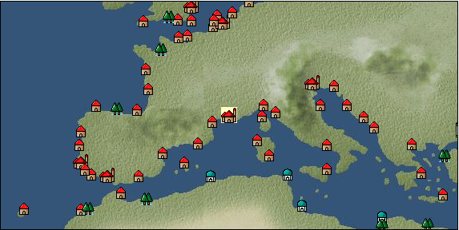

# Port: Paris

import Tabs from '@theme/Tabs';
import TabItem from '@theme/TabItem';

## General Information

| Attribute | Details |
| :--- | :--- |
| **Port Name** | Paris |
| **Port Type** | 領地 |
| **Region** | western europe |
| **Sea Area** |  |
| **Required Language** | French |
| **Coordinates** | （，） |
| **Investment Reward** |  |

### Available Facilities

| guild | intermediary | exchange | tool shop | workshop craftsman | Painter | sculptor | peddler |
| --- | --- | --- | --- | --- | --- | --- | --- |
|   |   |   | ○ | ○ |   |   |   |
| Shipyard Master | Lumbermaker | Sail-maker | weapon craftsman | master | TavernFemale | archive | salesperson |
| --- | --- | --- | --- | --- | --- | --- | --- |
|   |   |   |   | ○ |   |   |   |
| Shipwright | 銀行 | street worker | 王宮 | Trading post | church | suburbs | translator |
| --- | --- | --- | --- | --- | --- | --- | --- |
|   | ○ |   |   |   | ○ |   |   |

### Description
The city is said to have developed from the Ile de la Cité, an island in the Seine River. A wall was built around the Île de la Cité and expanded to become what is now Paris. The climate is relatively warm. Museum *Move by horse-drawn carriage from Place de Marseille

<Tabs>
  <TabItem value="trade_goods_sales" label="Trade Goods Sales">

| Item | Group | Purchase Price | Allied Price | Remarks |
| --- | --- | --- | --- | --- |
| There is no purchase information for trade goods. |
  </TabItem>
  <TabItem value="sale_specialty" label="Sale (Specialty)">

| Item | Group | sale price | Allied Price | Remarks |
| --- | --- | --- | --- | --- |
| Sales information for trade items with specialty judgment set is not registered. |
  </TabItem>
  <TabItem value="sale_no_specialty" label="Sale (No Specialty)">

| Item | Group | sale price | Allied Price | Remarks |
| --- | --- | --- | --- | --- |
| There is no information on the sale of trade goods. |
  </TabItem>
  <TabItem value="guild_&_others" label="Guild & Others">

| Item | Group | Sales price | Handling NPC | Remarks |
| --- | --- | --- | --- | --- |
| There is no sales information for the Item |
| --- |
  </TabItem>
  <TabItem value="toolman" label="Toolman">

| Item | Group | Sales price | Handling NPC | Remarks |
| --- | --- | --- | --- | --- |

#### [Equipment (head)](docs/Categories/category_23.md)

| [Wimple](docs/Items/Equipment/Equipment-Head/item_1414.md) | Equipment (head) | 6,600 | tool shop owner |  |
| [Kartif](docs/Items/Equipment/Equipment-Head/item_262.md) | Equipment (head) | 2,300 | tool shop owner |  |
| [spanish talk](docs/Items/Equipment/Equipment-Head/item_260.md) | Equipment (head) | 12,400 | tool shop owner |  |
| [Spanish talk with feathers](docs/Items/Equipment/Equipment-Head/item_261.md) | Equipment (head) | 20,000 | tool shop owner |  |

#### [Equipment (body)](docs/Categories/category_24.md)

| [handler](docs/Items/Equipment/Equipment-Body/item_515.md) | Equipment (body) | 26,400 | tool shop owner |  |
| [pool point](docs/Items/Equipment/Equipment-Body/item_414.md) | Equipment (body) | 40,700 | tool shop owner |  |
| [velvet tunic](docs/Items/Equipment/Equipment-Body/item_516.md) | Equipment (body) | 6,700 | tool shop owner |  |
| [petticoat](docs/Items/Equipment/Equipment-Body/item_415.md) | Equipment (body) | 3,800 | tool shop owner |  |

#### [Equipment (legs)](docs/Categories/category_26.md)

| [poulaine](docs/Items/Equipment/Equipment-Feet/item_513.md) | Equipment (legs) | 14,700 | tool shop owner |  |

#### [Equipment (belongings)](docs/Categories/category_27.md)

| [estoc](docs/Items/Equipment/Equipment-Weapon/item_1011.md) | Equipment (belongings) | 19,000 | tool shop owner |  |

#### [Consumables (land battle/deck battle)](docs/Categories/category_29.md)

| [傷薬](docs/Items/Consumables/Consumables-Landbattle/item_317.md) | Consumables (land battle/deck battle) | 150 | tool shop owner |  |
| [antidote](docs/Items/Consumables/Consumables-Landbattle/item_270.md) | Consumables (land battle/deck battle) | 100 | tool shop owner |  |

#### [Consumables (naval/hand-to-hand combat)](docs/Categories/category_30.md)

| [Flag of La Pucelle](docs/Items/Consumables/Consumables-navalhand-to-hand combat/item_762.md) | Consumables (naval/hand-to-hand combat) | 3,000 | tool shop owner |  |
| 時代限定（15世紀第2期） |

#### [Consumables (skill activation)](docs/Categories/category_31.md)

| [card](docs/Items/Consumables/Consumables-Skill/item_855.md) | Consumables (skill activation) | 500 | tool shop owner |  |
| [片眼鏡](docs/Items/Consumables/Consumables-Skill/item_306.md) | Consumables (skill activation) | 500 | tool shop owner |  |

#### [Consumables (other)](docs/Categories/category_44.md)

| [Dyed powder](docs/Items/Consumables/Consumables-Other/item_3370.md) | Consumables (other) | 2,000 | tool shop owner |  |
| [white powder](docs/Items/Consumables/Consumables-Other/item_1953.md) | Consumables (other) | 1,000 | tool shop owner |  |
  </TabItem>
  <TabItem value="kobo_craftsmen" label="Craftsman">

| Item | Group | Sales price | Handling NPC | Remarks |
| --- | --- | --- | --- | --- |

#### [Consumables (condition recovery)](docs/Categories/category_21.md)

| [Nostalgic carillon bell](docs/Items/Consumables/Consumables-Recovery/item_245.md) | Consumables (condition recovery) | 200 | workshop craftsman |  |
| [Ship song sheet music](docs/Items/Consumables/Consumables-Recovery/item_247.md) | Consumables (condition recovery) | 200 | workshop craftsman |  |

#### [Consumables (skill activation)](docs/Categories/category_31.md)

| [四分儀](docs/Items/Consumables/Consumables-Skill/item_346.md) | Consumables (skill activation) | 500 | workshop craftsman |  |

#### [Consumables (other)](docs/Categories/category_44.md)

| [帆塗料](docs/Items/Consumables/Consumables-Other/item_348.md) | Consumables (other) | 500 | workshop craftsman |  |
| [ship paint](docs/Items/Consumables/Consumables-Other/item_347.md) | Consumables (other) | 500 | workshop craftsman |  |

#### [furniture](docs/Categories/category_48.md)

| [Mannequin (usually female)](docs/Items/Furniture/item_2234.md) | furniture | 3,000 | workshop craftsman |  |
| [Mannequin (usually male)](docs/Items/Furniture/item_2233.md) | furniture | 3,000 | workshop craftsman |  |
  </TabItem>
</Tabs>