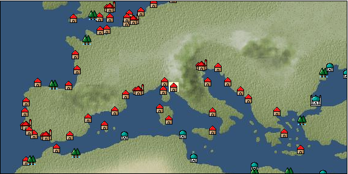

# Port: Florence

import Tabs from '@theme/Tabs';
import TabItem from '@theme/TabItem';

## General Information

| Attribute | Details |
| :--- | :--- |
| **Port Name** | Florence |
| **Port Type** | 領地 |
| **Region** | western europe |
| **Sea Area** |  |
| **Required Language** |  |
| **Coordinates** | （，） |
| **Investment Reward** |  |

### Available Facilities

| guild | intermediary | exchange | tool shop | workshop craftsman | Painter | sculptor | peddler |
| --- | --- | --- | --- | --- | --- | --- | --- |
|   |   |   | ○ |   |   |   |   |
| Shipyard Master | Lumbermaker | Sail-maker | weapon craftsman | master | TavernFemale | archive | salesperson |
| --- | --- | --- | --- | --- | --- | --- | --- |
|   |   |   |   | ○ |   |   |   |
| Shipwright | 銀行 | street worker | 王宮 | Trading post | church | suburbs | translator |
| --- | --- | --- | --- | --- | --- | --- | --- |
|   | ○ |   |   |   |   |   |   |

### Description
A city that developed through manufacturing, trade, and finance. Many merchants and craftsmen, including the Medici family, who became famous for their financial business, gathered there, creating strong ties. It is said that the city got its current name from the name Florentia during the ancient Roman era. Chamber of Commerce and Industry Palace *Traveling by horse-drawn carriage from the back of Pisa Bank (traveling to Venice is now possible with the 9/19 update)

<Tabs>
  <TabItem value="trade_goods_sales" label="Trade Goods Sales">

| Item | Group | Purchase Price | Allied Price | Remarks |
| --- | --- | --- | --- | --- |
| There is no purchase information for trade goods. |
  </TabItem>
  <TabItem value="sale_specialty" label="Sale (Specialty)">

| Item | Group | sale price | Allied Price | Remarks |
| --- | --- | --- | --- | --- |
| Sales information for trade items with specialty judgment set is not registered. |
  </TabItem>
  <TabItem value="sale_no_specialty" label="Sale (No Specialty)">

| Item | Group | sale price | Allied Price | Remarks |
| --- | --- | --- | --- | --- |
| There is no information on the sale of trade goods. |
  </TabItem>
  <TabItem value="guild_&_others" label="Guild & Others">

| Item | Group | Sales price | Handling NPC | Remarks |
| --- | --- | --- | --- | --- |
| There is no sales information for the Item |
| --- |
  </TabItem>
  <TabItem value="toolman" label="Toolman">

| Item | Group | Sales price | Handling NPC | Remarks |
| --- | --- | --- | --- | --- |

#### [Equipment (head)](docs/Categories/category_23.md)

| [breton](docs/Items/Equipment/Equipment-Head/item_299.md) | Equipment (head) | 3,800 | tool shop owner |  |
| [Breton with wings](docs/Items/Equipment/Equipment-Head/item_587.md) | Equipment (head) | 8,400 | tool shop owner |  |

#### [Equipment (body)](docs/Categories/category_24.md)

| [jerkin](docs/Items/Equipment/Equipment-Body/item_323.md) | Equipment (body) | 12,500 | tool shop owner |  |
| [felt tunic](docs/Items/Equipment/Equipment-Body/item_324.md) | Equipment (body) | 3,800 | tool shop owner |  |
| [petticoat](docs/Items/Equipment/Equipment-Body/item_415.md) | Equipment (body) | 3,800 | tool shop owner |  |

#### [Equipment (legs)](docs/Categories/category_26.md)

| [buckle boots](docs/Items/Equipment/Equipment-Feet/item_417.md) | Equipment (legs) | 100 | tool shop owner |  |
| [ribbon shoes](docs/Items/Equipment/Equipment-Feet/item_704.md) | Equipment (legs) | 10,000 | tool shop owner |  |

#### [Equipment (belongings)](docs/Categories/category_27.md)

| [short sword](docs/Items/Equipment/Equipment-Weapon/item_301.md) | Equipment (belongings) | 9,300 | tool shop owner |  |
| [priest's cane](docs/Items/Equipment/Equipment-Weapon/item_517.md) | Equipment (belongings) | 10,900 | tool shop owner |  |

#### [Consumables (land battle/deck battle)](docs/Categories/category_29.md)

| [傷薬](docs/Items/Consumables/Consumables-Landbattle/item_317.md) | Consumables (land battle/deck battle) | 150 | tool shop owner |  |
| [Assortment of wound medicine](docs/Items/Consumables/Consumables-Landbattle/item_90.md) | Consumables (land battle/deck battle) | 500 | tool shop owner |  |
| [antidote](docs/Items/Consumables/Consumables-Landbattle/item_270.md) | Consumables (land battle/deck battle) | 100 | tool shop owner |  |

#### [Consumables (skill activation)](docs/Categories/category_31.md)

| [card](docs/Items/Consumables/Consumables-Skill/item_855.md) | Consumables (skill activation) | 500 | tool shop owner |  |
| [片眼鏡](docs/Items/Consumables/Consumables-Skill/item_306.md) | Consumables (skill activation) | 500 | tool shop owner |  |

#### [Consumables (other)](docs/Categories/category_44.md)

| [Dyed powder](docs/Items/Consumables/Consumables-Other/item_3370.md) | Consumables (other) | 2,000 | tool shop owner |  |
| [sewing tools](docs/Items/Consumables/Consumables-Other/item_310.md) | Consumables (other) | 10,000 | tool shop owner |  |

#### [Consumables (request documents)](docs/Categories/category_45.md)

| [投資申請書](docs/Items/Consumables/Consumables-Documents/item_1483.md) | Consumables (request documents) | 1,000 | tool shop owner |  |
| 時代限定（15世紀第3期、15世紀第4期、15世紀第5期） |
  </TabItem>
  <TabItem value="chamber of commerce" label="chamber of commerce">

| Item | Group | Sales price | Handling NPC | Remarks |
| --- | --- | --- | --- | --- |

#### [recipe book](docs/Categories/category_22.md)

| [Florence Recipe (Lorenzo Medici)](docs/Items/RecipeBooks/item_4726.md) | recipe book | Fixed recipe | chamber of commerce |  |
| lorenzo medici |
| [Florence Recipe (Craftsman)](docs/Items/RecipeBooks/item_4724.md) | recipe book | Fixed recipe | chamber of commerce |  |
| chamber of commerce |
| [Florence Recipe (Sewing Craftsman)](docs/Items/RecipeBooks/item_4727.md) | recipe book | Fixed recipe | chamber of commerce |  |
| chamber of commerce |
| [Florence Recipe (Cook)](docs/Items/RecipeBooks/item_4494.md) | recipe book | Fixed recipe | chamber of commerce |  |
| chamber of commerce |
| [Florence Recipe (Foundry Craftsman)](docs/Items/RecipeBooks/item_4725.md) | recipe book | Fixed recipe | chamber of commerce |  |
| chamber of commerce |
| [Florence Storage Recipe (Nadia)](docs/Items/RecipeBooks/item_4525.md) | recipe book | Fixed recipe | chamber of commerce |  |
| nadia |
| [Florence Crafts Recipes (Anita)](docs/Items/RecipeBooks/item_4091.md) | recipe book | Fixed recipe | chamber of commerce |  |
| Anita |
| [Florence sewing recipe (Roberta)](docs/Items/RecipeBooks/item_4101.md) | recipe book | Fixed recipe | chamber of commerce |  |
| roberta |
| [Florentine cooking recipes (Monica)](docs/Items/RecipeBooks/item_4097.md) | recipe book | Fixed recipe | chamber of commerce |  |
| Monica |
| [Florence casting recipe (Zita)](docs/Items/RecipeBooks/item_4104.md) | recipe book | Fixed recipe | chamber of commerce |  |
| Zita |
  </TabItem>
</Tabs>