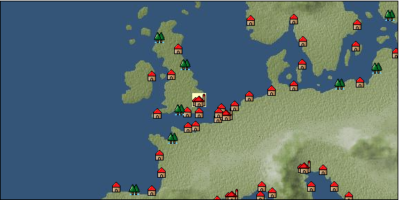

# Port: オクスフォード

import Tabs from '@theme/Tabs';
import TabItem from '@theme/TabItem';

## General Information

| Attribute | Details |
| :--- | :--- |
| **Port Name** | Oxford |
| **Port Type** | 領地 |
| **Region** | northern europe |
| **Sea Area** | Southern Britain |
| **Required Language** | English |
| **Coordinates** | （，） |
| **Investment Reward** |  |

### Available Facilities

| guild | intermediary | exchange | tool shop | workshop craftsman | Painter | sculptor | peddler |
| --- | --- | --- | --- | --- | --- | --- | --- |
|   |   |   | ○ | ○ |   |   |   |
| Shipyard Master | Lumbermaker | Sail-maker | weapon craftsman | master | TavernFemale | archive | salesperson |
| --- | --- | --- | --- | --- | --- | --- | --- |
|   |   |   |   | ○ |   |   |   |
| Shipwright | 銀行 | street worker | 王宮 | Trading post | church | suburbs | translator |
| --- | --- | --- | --- | --- | --- | --- | --- |
|   | ○ |   |   |   |   |   |   |

### Description
An academic city located northwest of London. It flourished as a distribution center for wool, but a convent was founded in the 8th century. In the 12th century, scholars began to gather there and developed as a capital of learning. *Travel by horse-drawn carriage from London *There is a "university".

<Tabs>
  <TabItem value="trade_goods_sales" label="Trade Goods Sales">

| item | group | purchase price | 同盟時 | remarks |
| --- | --- | --- | --- | --- |
| There is no purchase information for trade goods. |
  </TabItem>
  <TabItem value="sale_specialty" label="Sale (Specialty)">

| item | group | sale price | 同盟時 | remarks |
| --- | --- | --- | --- | --- |
| Sales information for trade items with specialty judgment set is not registered. |
  </TabItem>
  <TabItem value="sale_no_specialty" label="Sale (No Specialty)">

| item | group | sale price | 同盟時 | remarks |
| --- | --- | --- | --- | --- |
| There is no information on the sale of trade goods. |
  </TabItem>
  <TabItem value="guild_&_others" label="Guild & Others">

| item | group | Sales price | Handling NPC | remarks |
| --- | --- | --- | --- | --- |

#### robert boyle

| [religious studies](Skills/Skill-Adventure/item_340.md) | [Skill (adventure)](Categories/category_39.md) | 8,000 | robert boyle |  |
| [測量](Skills/Skill-Adventure/item_344.md) | [Skill (adventure)](Categories/category_39.md) | 8,000 | robert boyle |  |
| [Visual recognition](Skills/Skill-Adventure/item_458.md) | [Skill (adventure)](Categories/category_39.md) | 3,000 | robert boyle |  |
  </TabItem>
  <TabItem value="toolman" label="Toolman">

| item | group | Sales price | Handling NPC | remarks |
| --- | --- | --- | --- | --- |

#### [Equipment (head)](Categories/category_23.md)

| [puritan hat](Items/Equipment/Equipment-Head/item_1013.md) | [Equipment (head)](Categories/category_23.md) | 26,000 | tool shop owner |  |

#### [Equipment (body)](Categories/category_24.md)

| [Surcoat](Items/Equipment/Equipment-Body/item_131.md) | [Equipment (body)](Categories/category_24.md) | 30,000 | tool shop owner |  |
| [buccaneer vest](Items/Equipment/Equipment-Body/item_77.md) | [Equipment (body)](Categories/category_24.md) | 11,800 | tool shop owner |  |
| [petticoat](Items/Equipment/Equipment-Body/item_415.md) | [Equipment (body)](Categories/category_24.md) | 3,800 | tool shop owner |  |

#### [Equipment (legs)](Categories/category_26.md)

| [lace up boots](Items/Equipment/Equipment-Feet/item_418.md) | [Equipment (legs)](Categories/category_26.md) | 17,400 | tool shop owner |  |

#### [Equipment (belongings)](Categories/category_27.md)

| [short sword](Items/Equipment/Equipment-Weapon/item_301.md) | [Equipment (belongings)](Categories/category_27.md) | 9,300 | tool shop owner |  |
| [bishop's cane](Items/Equipment/Equipment-Weapon/item_1133.md) | [Equipment (belongings)](Categories/category_27.md) | 10,900 | tool shop owner |  |

#### [Consumables (land battle/deck battle)](Categories/category_29.md)

| [傷薬](Items/Consumables/Consumables-Landbattle/item_317.md) | [Consumables (land battle/deck battle)](Categories/category_29.md) | 150 | tool shop owner |  |
| [Assortment of wound medicine](Items/Consumables/Consumables-Landbattle/item_90.md) | [Consumables (land battle/deck battle)](Categories/category_29.md) | 500 | tool shop owner |  |
| [poison](Items/Consumables/Consumables-Landbattle/item_269.md) | [Consumables (land battle/deck battle)](Categories/category_29.md) | 250 | tool shop owner |  |
| [antidote](Items/Consumables/Consumables-Landbattle/item_270.md) | [Consumables (land battle/deck battle)](Categories/category_29.md) | 100 | tool shop owner |  |

#### [Consumables (skill activation)](Categories/category_31.md)

| [card](Items/Consumables/Consumables-Skill/item_855.md) | [Consumables (skill activation)](Categories/category_31.md) | 500 | tool shop owner |  |
| [dowsing rod](Items/Consumables/Consumables-Skill/item_304.md) | [Consumables (skill activation)](Categories/category_31.md) | 500 | tool shop owner |  |
| [research monocle](Items/Consumables/Consumables-Skill/item_120.md) | [Consumables (skill activation)](Categories/category_31.md) | 2,500 | tool shop owner |  |

#### [Consumables (other)](Categories/category_44.md)

| [Dyed powder](Items/Consumables/Consumables-Other/item_3370.md) | [Consumables (other)](Categories/category_44.md) | 2,000 | tool shop owner |  |
| [sewing tools](Items/Consumables/Consumables-Other/item_310.md) | [Consumables (other)](Categories/category_44.md) | 10,000 | tool shop owner |  |
  </TabItem>
  <TabItem value="shop owner" label="shop owner">

| item | group | Sales price | Handling NPC | remarks |
| --- | --- | --- | --- | --- |

#### [recipe book](Categories/category_22.md)

| [Easy recipes anyone can do](Items/Recipe Book/item_554.md) | [recipe book](Categories/category_22.md) | 5,000 | shop owner |  |

#### [Equipment (head)](Categories/category_23.md)

| [mortar board](Items/Equipment/Equipment-Head/item_4379.md) | [Equipment (head)](Categories/category_23.md) | 150,000 | shop owner |  |

#### [Equipment (body)](Categories/category_24.md)

| [academic dress](Items/Equipment/Equipment-Body/item_4378.md) | [Equipment (body)](Categories/category_24.md) | 240,000 | shop owner |  |

#### [Equipment (legs)](Categories/category_26.md)

| [strap shoes](Items/Equipment/Equipment-Feet/item_1018.md) | [Equipment (legs)](Categories/category_26.md) | 5,200 | shop owner |  |
| [buckle boots](Items/Equipment/Equipment-Feet/item_417.md) | [Equipment (legs)](Categories/category_26.md) | 100 | shop owner |  |

#### [Equipment (belongings)](Categories/category_27.md)

| [violin](Items/Equipment/Equipment-Weapon/item_556.md) | [Equipment (belongings)](Categories/category_27.md) | 12,000 | shop owner |  |
  </TabItem>
</Tabs>