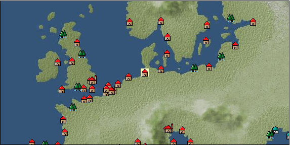

# Port: フランクフルト

import Tabs from '@theme/Tabs';
import TabItem from '@theme/TabItem';

## General Information

| Attribute | Details |
| :--- | :--- |
| **Port Name** | frankfurt |
| **Port Type** | 領地 |
| **Region** | northern europe |
| **Sea Area** | Off the coast of Jutland |
| **Required Language** | german |
| **Coordinates** | （357，2364） |
| **Investment Reward** |  |

### Available Facilities

| guild | intermediary | exchange | tool shop | workshop craftsman | Painter | sculptor | peddler |
| --- | --- | --- | --- | --- | --- | --- | --- |
|   |   |   | ○ | ○ |   |   |   |
| Shipyard Master | Lumbermaker | Sail-maker | weapon craftsman | master | TavernFemale | archive | salesperson |
| --- | --- | --- | --- | --- | --- | --- | --- |
|   |   |   |   | ○ |   |   |   |
| Shipwright | 銀行 | street worker | 王宮 | Trading post | church | suburbs | translator |
| --- | --- | --- | --- | --- | --- | --- | --- |
|   | ○ |   |   |   |   |   |   |

### Description
A city located in midwestern Germany that developed as the center of the Holy Roman Empire. The origin of the name is said to have been because the Frankish kingdom chose it as a crossing point across the River Main in the 5th century. Bartholomew's Cathedral is designated as the site of the election of emperors, and is also where coronation ceremonies are held. *Transfer by horse-drawn carriage from Hamburg *There is a "Cathedral". Tavern has an alias. (Unlocks the upper limit of Lv77→80, 80→85, 85→90)

<Tabs>
  <TabItem value="trade_goods_sales" label="Trade Goods Sales">

| item | group | purchase price | 同盟時 | remarks |
| --- | --- | --- | --- | --- |
| There is no purchase information for trade goods. |
  </TabItem>
  <TabItem value="sale_specialty" label="Sale (Specialty)">

| item | group | sale price | 同盟時 | remarks |
| --- | --- | --- | --- | --- |
| Sales information for trade items with specialty judgment set is not registered. |
  </TabItem>
  <TabItem value="sale_no_specialty" label="Sale (No Specialty)">

| item | group | sale price | 同盟時 | remarks |
| --- | --- | --- | --- | --- |
| There is no information on the sale of trade goods. |
  </TabItem>
  <TabItem value="guild_&_others" label="Guild & Others">

| item | group | Sales price | Handling NPC | remarks |
| --- | --- | --- | --- | --- |

#### others

| [宮廷顧問用衣装縫製法](Items/Recipe Book/item_4299.md) | [recipe book](Categories/category_22.md) | Fixed recipe |  |  |
| In front of Frankfurt Cathedral Young servant fixed recipe |
| [How to sew accessories for court advisors](Items/Recipe Book/item_4300.md) | [recipe book](Categories/category_22.md) | Fixed recipe |  |  |
| In front of Frankfurt Tavern Noble youth fixed recipe |
| [book on making musical instruments](Items/Recipe Book/item_4291.md) | [recipe book](Categories/category_22.md) | Fixed recipe |  |  |
| 16th century traveling entertainer |
  </TabItem>
  <TabItem value="toolman" label="Toolman">

| item | group | Sales price | Handling NPC | remarks |
| --- | --- | --- | --- | --- |

#### [Equipment (body)](Categories/category_24.md)

| [apron dress](Items/Equipment/Equipment-Body/item_620.md) | Equipment (body) | 5,000 | tool shop owner |  |
| [Surcoat](Items/Equipment/Equipment-Body/item_131.md) | Equipment (body) | 30,000 | tool shop owner |  |
| [felt tunic](Items/Equipment/Equipment-Body/item_324.md) | Equipment (body) | 3,800 | tool shop owner |  |

#### [Equipment (legs)](Categories/category_26.md)

| [ribbon shoes](Items/Equipment/Equipment-Feet/item_704.md) | Equipment (legs) | 10,000 | tool shop owner |  |

#### [Equipment (belongings)](Categories/category_27.md)

| [short sword](Items/Equipment/Equipment-Weapon/item_301.md) | Equipment (belongings) | 9,300 | tool shop owner |  |
| [violin](Items/Equipment/Equipment-Weapon/item_556.md) | Equipment (belongings) | 12,000 | tool shop owner |  |
| [bishop's cane](Items/Equipment/Equipment-Weapon/item_1133.md) | Equipment (belongings) | 10,900 | tool shop owner |  |

#### [Consumables (land battle/deck battle)](Categories/category_29.md)

| [torch for throwing](Items/Consumables/Consumables-Landbattle/item_313.md) | Consumables (land battle/deck battle) | 150 | tool shop owner |  |
| [Assortment of therapeutic drugs](Items/Consumables/Consumables-Landbattle/item_564.md) | Consumables (land battle/deck battle) | 900 | tool shop owner |  |

#### [Consumables (skill activation)](Categories/category_31.md)

| [dowsing rod](Items/Consumables/Consumables-Skill/item_304.md) | Consumables (skill activation) | 500 | tool shop owner |  |
| [簡易望遠鏡](Items/Consumables/Consumables-Skill/item_303.md) | Consumables (skill activation) | 500 | tool shop owner |  |

#### [Consumables (other)](Categories/category_44.md)

| [Dyed powder](Items/Consumables/Consumables-Other/item_3370.md) | Consumables (other) | 2,000 | tool shop owner |  |
| [sewing tools](Items/Consumables/Consumables-Other/item_310.md) | Consumables (other) | 10,000 | tool shop owner |  |
  </TabItem>
  <TabItem value="kobo_craftsmen" label="Craftsman">

| item | group | Sales price | Handling NPC | remarks |
| --- | --- | --- | --- | --- |

#### [Consumables (condition recovery)](Categories/category_21.md)

| [Nostalgic carillon bell](Items/Consumables/Consumables-Recovery/item_245.md) | Consumables (condition recovery) | 200 | workshop craftsman |  |
| [Ship song sheet music](Items/Consumables/Consumables-Recovery/item_247.md) | Consumables (condition recovery) | 200 | workshop craftsman |  |

#### [Consumables (skill activation)](Categories/category_31.md)

| [四分儀](Items/Consumables/Consumables-Skill/item_346.md) | Consumables (skill activation) | 500 | workshop craftsman |  |

#### [Consumables (other)](Categories/category_44.md)

| [帆塗料](Items/Consumables/Consumables-Other/item_348.md) | Consumables (other) | 500 | workshop craftsman |  |
| [ship paint](Items/Consumables/Consumables-Other/item_347.md) | Consumables (other) | 500 | workshop craftsman |  |

#### [furniture](Categories/category_48.md)

| [Mannequin (usually female)](Items/Furniture/item_2234.md) | furniture | 3,000 | workshop craftsman |  |
| [Mannequin (usually male)](Items/Furniture/item_2233.md) | furniture | 3,000 | workshop craftsman |  |
  </TabItem>
</Tabs>