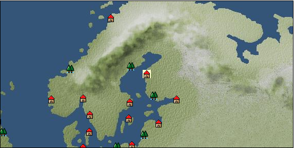

# Port: コッコラ

import Tabs from '@theme/Tabs';
import TabItem from '@theme/TabItem';

## General Information

| Attribute | Details |
| :--- | :--- |
| **Port Name** | Kokkola |
| **Port Type** | port of alliance |
| **Region** | northern europe |
| **Sea Area** | baltic sea |
| **Required Language** | Norse |
| **Coordinates** | （979，1760） |
| **Investment Reward** |  |

### Available Facilities

| guild | intermediary | exchange | tool shop | workshop craftsman | Painter | sculptor | peddler |
| --- | --- | --- | --- | --- | --- | --- | --- |
|   |   | ○ | ○ | ○ |   |   |   |
| Shipyard Master | Lumbermaker | Sail-maker | weapon craftsman | master | TavernFemale | archive | salesperson |
| --- | --- | --- | --- | --- | --- | --- | --- |
| ○ | ○ | ○ | ○ | ○ |   |   |   |
| Shipwright | 銀行 | street worker | 王宮 | Trading post | church | suburbs | translator |
| --- | --- | --- | --- | --- | --- | --- | --- |
| ○ | ○ |   |   |   | ○ |   |   |

### Description
A Finnish city located in the center of the Gulf of Bothnia. It was built by Gustav II Adolf. It was originally a port for trading industrial goods, but eventually became an important center for shipbuilding and prospered.

<Tabs>
  <TabItem value="trade_goods_sales" label="Trade Goods Sales">

| item | group | purchase price | 同盟時 | remarks |
| --- | --- | --- | --- | --- |
| [Oat](Items/Trade Goods/TradeGoods-Foodstuffs/item_275.md) | [Trading items (food items)](Categories/category_3.md) | 28 | (25) |  |
| [rye](Items/Trade Goods/TradeGoods-Foodstuffs/item_61.md) | [Trading items (food items)](Categories/category_3.md) | 28 | (25) |  |
| [log](Items/Trade Goods/TradeGoods-Wares/item_846.md) | [交易品（工業品）](Categories/category_19.md) | 130 | (114) |  |
| [zinc ore](Items/Trade Goods/TradeGoods-Minerals/item_626.md) | [Trading Items (Iron Stone)](Categories/category_7.md) | 302 | (265) |  |
| [white ore](Items/Trade Goods/TradeGoods-Minerals/item_891.md) | [Trading Items (Iron Stone)](Categories/category_7.md) | (6,995) | 6,120 |  |
| 要投資（必要投資額：720,000） |
| [brass](Items/Trade Goods/TradeGoods-Wares/item_624.md) | [交易品（工業品）](Categories/category_19.md) | (877) | 768 |  |
| 要投資（必要投資額：600,000） |
| [iron ore](Items/Trade Goods/TradeGoods-Minerals/item_146.md) | [Trading Items (Iron Stone)](Categories/category_7.md) | 544 | (476) |  |
| [copper ore](Items/Trade Goods/TradeGoods-Minerals/item_65.md) | [Trading Items (Iron Stone)](Categories/category_7.md) | 551 | (483) |  |
| [鋼](Items/Trade Goods/TradeGoods-Wares/item_573.md) | [交易品（工業品）](Categories/category_19.md) | (891) | 780 |  |
| 要投資（必要投資額：700,000） |
  </TabItem>
  <TabItem value="sale_specialty" label="Sale (Specialty)">

| item | group | sale price | 同盟時 | remarks |
| --- | --- | --- | --- | --- |

#### [交易品（美術品）](Categories/category_14.md)

| [oil painting](Items/Trade Goods/TradeGoods-Art/item_1088.md) | [交易品（美術品）](Categories/category_14.md) | (2,383) | 2,780 |  |
  </TabItem>
  <TabItem value="sale_no_specialty" label="Sale (No Specialty)">

| item | group | sale price | 同盟時 | remarks |
| --- | --- | --- | --- | --- |

#### [Trading items (food items)](Categories/category_3.md)

| [Pacific saury](Items/Trade Goods/TradeGoods-Foodstuffs/item_700.md) | [Trading items (food items)](Categories/category_3.md) | 29 | (32) |  |

#### [Trading products (medical products)](Categories/category_6.md)

| [heath](Items/Trade Goods/TradeGoods-Medicine/item_63.md) | [Trading products (medical products)](Categories/category_6.md) | 216 | (243) |  |
| ▲Special products from the same cultural area |

#### [Trading Items (Iron Stone)](Categories/category_7.md)

| [cinnabar](Items/Trade Goods/TradeGoods-Minerals/item_154.md) | [Trading Items (Iron Stone)](Categories/category_7.md) | 777 | (874) |  |

#### [交易品（酒類）](Categories/category_9.md)

| [aquavit](Items/Trade Goods/TradeGoods-Alcohol/item_572.md) | [交易品（酒類）](Categories/category_9.md) | 565 | (635) |  |
| ▲Special products from the same cultural area |
| [whiskey](Items/Trade Goods/TradeGoods-Alcohol/item_1.md) | [交易品（酒類）](Categories/category_9.md) | 737 | (829) |  |
| ▲Special products from neighboring cultural areas |
| [vodka](Items/Trade Goods/TradeGoods-Alcohol/item_579.md) | [交易品（酒類）](Categories/category_9.md) | 655 | (736) |  |
| [Beer](Items/Trade Goods/TradeGoods-Alcohol/item_2.md) | [交易品（酒類）](Categories/category_9.md) | 299 | (336) |  |

#### [Trading Items (Arms)](Categories/category_16.md)

| [western armor](Items/Trade Goods/TradeGoods-Weapons/item_6.md) | [Trading Items (Arms)](Categories/category_16.md) | 2,870 | (3,229) |  |
| ▲Special products from neighboring cultural areas |
| [長弓](Items/Trade Goods/TradeGoods-Weapons/item_1049.md) | [Trading Items (Arms)](Categories/category_16.md) | 766 | (861) |  |

#### [交易品（工業品）](Categories/category_19.md)

| [log](Items/Trade Goods/TradeGoods-Wares/item_846.md) | [交易品（工業品）](Categories/category_19.md) | 61 | (68) |  |
| [wood](Items/Trade Goods/TradeGoods-Wares/item_277.md) | [交易品（工業品）](Categories/category_19.md) | 833 | (937) |  |
| [sulfur](Items/Trade Goods/TradeGoods-Wares/item_66.md) | [交易品（工業品）](Categories/category_19.md) | 417 | (469) |  |
  </TabItem>
  <TabItem value="guild_&_others" label="Guild & Others">

| item | group | Sales price | Handling NPC | remarks |
| --- | --- | --- | --- | --- |
| There is no sales information for the item |
| --- |
  </TabItem>
  <TabItem value="toolman" label="Toolman">

| item | group | Sales price | Handling NPC | remarks |
| --- | --- | --- | --- | --- |

#### [recipe book](Categories/category_22.md)

| [Spear training/application](Items/Recipe Book/item_1141.md) | [recipe book](Categories/category_22.md) | 50,000 | tool shop owner |  |
| 要投資（必要投資額：不明） |

#### [Equipment (belongings)](Categories/category_27.md)

| [snap lock shooting gun](Items/Equipment/Equipment-Weapon/item_267.md) | [Equipment (belongings)](Categories/category_27.md) | 8,000 | tool shop owner |  |

#### [Consumables (land battle/deck battle)](Categories/category_29.md)

| [poison](Items/Consumables/Consumables-Landbattle/item_269.md) | [Consumables (land battle/deck battle)](Categories/category_29.md) | 250 | tool shop owner |  |
| [antidote](Items/Consumables/Consumables-Landbattle/item_270.md) | [Consumables (land battle/deck battle)](Categories/category_29.md) | 100 | tool shop owner |  |

#### [Consumables (skill activation)](Categories/category_31.md)

| [fishing gear](Items/Consumables/Consumables-Skill/item_79.md) | [Consumables (skill activation)](Categories/category_31.md) | 2,500 | tool shop owner |  |

#### [Consumables (request documents)](Categories/category_45.md)

| [Alcoholic beverage purchase order form](Items/Consumables/Consumables-Documents/item_5117.md) | [Consumables (request documents)](Categories/category_45.md) | 40,000 | tool shop owner |  |
  </TabItem>
  <TabItem value="shipyard" label="Shipyard">

### Shipyard Master

| item | group | Sales price | Handling NPC | remarks |
| --- | --- | --- | --- | --- |

#### [Boat](Categories/category_43.md)

| [2 mast cogs](Items/Ships/item_265.md) | [Boat](Categories/category_43.md) | 96,000 | Shipyard Master |  |
| [warwick cog](Items/Ships/item_336.md) | [Boat](Categories/category_43.md) | 230,000 | Shipyard Master |  |
| [carrack](Items/Ships/item_236.md) | [Boat](Categories/category_43.md) | 720,000 | Shipyard Master |  |
| [Hansa Cog](Items/Ships/item_263.md) | [Boat](Categories/category_43.md) | 24,000 | Shipyard Master |  |
| [Varsha](Items/Ships/item_201.md) | [Boat](Categories/category_43.md) | 2,000 | Shipyard Master |  |
| [pinnace](Items/Ships/item_767.md) | [Boat](Categories/category_43.md) | 950,000 | Shipyard Master |  |
| [flute](Items/Ships/item_569.md) | [Boat](Categories/category_43.md) | 410,000 | Shipyard Master |  |
| [hooker](Items/Ships/item_335.md) | [Boat](Categories/category_43.md) | 220,000 | Shipyard Master |  |
| [commercial carrack](Items/Ships/item_239.md) | [Boat](Categories/category_43.md) | 728,000 | Shipyard Master |  |
| [commercial pinnace](Items/Ships/item_768.md) | [Boat](Categories/category_43.md) | 960,000 | Shipyard Master |  |
| [commercial flute](Items/Ships/item_570.md) | [Boat](Categories/category_43.md) | 420,000 | Shipyard Master |  |
| [commercial large carrack](Items/Ships/item_409.md) | [Boat](Categories/category_43.md) | 1,840,000 | Shipyard Master |  |
| [commercial armed carrack](Items/Ships/item_1502.md) | [Boat](Categories/category_43.md) | 4,000,000 | Shipyard Master |  |
| [large carrack](Items/Ships/item_408.md) | [Boat](Categories/category_43.md) | 1,800,000 | Shipyard Master |  |
| [small carrack](Items/Ships/item_219.md) | [Boat](Categories/category_43.md) | 480,000 | Shipyard Master |  |
| [small caravel](Items/Ships/item_206.md) | [Boat](Categories/category_43.md) | 92,000 | Shipyard Master |  |
| [combat carrack](Items/Ships/item_238.md) | [Boat](Categories/category_43.md) | 720,000 | Shipyard Master |  |
| [combat pinnace](Items/Ships/item_766.md) | [Boat](Categories/category_43.md) | 950,000 | Shipyard Master |  |
| [combat flute](Items/Ships/item_568.md) | [Boat](Categories/category_43.md) | 400,000 | Shipyard Master |  |
| [Large exploration carrack](Items/Ships/item_1503.md) | [Boat](Categories/category_43.md) | 3,360,000 | Shipyard Master |  |
| [armed cog](Items/Ships/item_264.md) | [Boat](Categories/category_43.md) | 25,000 | Shipyard Master |  |
| [light carrack](Items/Ships/item_218.md) | [Boat](Categories/category_43.md) | 478,000 | Shipyard Master |  |
| [light caravelle](Items/Ships/item_207.md) | [Boat](Categories/category_43.md) | 92,000 | Shipyard Master |  |
| [transport carrack](Items/Ships/item_222.md) | [Boat](Categories/category_43.md) | 488,000 | Shipyard Master |  |
| [Small caravel for transport](Items/Ships/item_3674.md) | [Boat](Categories/category_43.md) | 92,000 | Shipyard Master |  |

### Lumbermaker

| item | group | Sales price | Handling NPC | remarks |
| --- | --- | --- | --- | --- |

#### [Ship parts (additional armor)](Categories/category_35.md)

| [elm board](Items/Ship Parts/Shipparts-Plates/item_328.md) | [Ship parts (additional armor)](Categories/category_35.md) | 13,000 | Lumbermaker |  |
| [Simple iron plate](Items/Ship Parts/Shipparts-Plates/item_1389.md) | [Ship parts (additional armor)](Categories/category_35.md) | 80,000 | Lumbermaker |  |
| [簡易銅板](Items/Ship Parts/Shipparts-Plates/item_617.md) | [Ship parts (additional armor)](Categories/category_35.md) | 41,000 | Lumbermaker |  |
| [lightweight oak board](Items/Ship Parts/Shipparts-Plates/item_533.md) | [Ship parts (additional armor)](Categories/category_35.md) | 38,000 | Lumbermaker |  |
| [lightweight cedar board](Items/Ship Parts/Shipparts-Plates/item_325.md) | [Ship parts (additional armor)](Categories/category_35.md) | 880 | Lumbermaker |  |
| [lightweight beach board](Items/Ship Parts/Shipparts-Plates/item_532.md) | [Ship parts (additional armor)](Categories/category_35.md) | 7,000 | Lumbermaker |  |
| [Lightweight red pine board](Items/Ship Parts/Shipparts-Plates/item_531.md) | [Ship parts (additional armor)](Categories/category_35.md) | 3,000 | Lumbermaker |  |

### Sail-maker

| item | group | Sales price | Handling NPC | remarks |
| --- | --- | --- | --- | --- |

#### [Ship parts (auxiliary sails)](Categories/category_33.md)

| [outer jib](Items/Ship Parts/Shipparts-Studding-Sail/item_331.md) | [Ship parts (auxiliary sails)](Categories/category_33.md) | 18,000 | Sail-maker |  |
| [Outer & inner jib](Items/Ship Parts/Shipparts-Studding-Sail/item_332.md) | [Ship parts (auxiliary sails)](Categories/category_33.md) | 23,000 | Sail-maker |  |
| [inner jib](Items/Ship Parts/Shipparts-Studding-Sail/item_279.md) | [Ship parts (auxiliary sails)](Categories/category_33.md) | 1,700 | Sail-maker |  |
| [Vorgernstaisl](Items/Ship Parts/Shipparts-Studding-Sail/item_333.md) | [Ship parts (auxiliary sails)](Categories/category_33.md) | 22,000 | Sail-maker |  |
| [Vorgeln bonnet](Items/Ship Parts/Shipparts-Studding-Sail/item_929.md) | [Ship parts (auxiliary sails)](Categories/category_33.md) | 110,000 | Sail-maker |  |
| [Forestaisle](Items/Ship Parts/Shipparts-Studding-Sail/item_280.md) | [Ship parts (auxiliary sails)](Categories/category_33.md) | 8,300 | Sail-maker |  |
| [Foretop Gernsur](Items/Ship Parts/Shipparts-Studding-Sail/item_282.md) | [Ship parts (auxiliary sails)](Categories/category_33.md) | 2,400 | Sail-maker |  |
| [Foretop staysle](Items/Ship Parts/Shipparts-Studding-Sail/item_357.md) | [Ship parts (auxiliary sails)](Categories/category_33.md) | 29,000 | Sail-maker |  |
| [Foretop Royal Sur](Items/Ship Parts/Shipparts-Studding-Sail/item_403.md) | [Ship parts (auxiliary sails)](Categories/category_33.md) | 48,000 | Sail-maker |  |
| [Foreroyalgernsl](Items/Ship Parts/Shipparts-Studding-Sail/item_330.md) | [Ship parts (auxiliary sails)](Categories/category_33.md) | 26,000 | Sail-maker |  |
| [flying outer jib](Items/Ship Parts/Shipparts-Studding-Sail/item_400.md) | [Ship parts (auxiliary sails)](Categories/category_33.md) | 49,000 | Sail-maker |  |
| [flying inner jib](Items/Ship Parts/Shipparts-Studding-Sail/item_401.md) | [Ship parts (auxiliary sails)](Categories/category_33.md) | 58,000 | Sail-maker |  |
| [bonnet](Items/Ship Parts/Shipparts-Studding-Sail/item_329.md) | [Ship parts (auxiliary sails)](Categories/category_33.md) | 25,000 | Sail-maker |  |
| [mizungernstaisl](Items/Ship Parts/Shipparts-Studding-Sail/item_334.md) | [Ship parts (auxiliary sails)](Categories/category_33.md) | 22,000 | Sail-maker |  |
| [Mizungern bonnet](Items/Ship Parts/Shipparts-Studding-Sail/item_930.md) | [Ship parts (auxiliary sails)](Categories/category_33.md) | 130,000 | Sail-maker |  |
| [mizzen staple](Items/Ship Parts/Shipparts-Studding-Sail/item_281.md) | [Ship parts (auxiliary sails)](Categories/category_33.md) | 11,000 | Sail-maker |  |
| [mizzen top gelrunsle](Items/Ship Parts/Shipparts-Studding-Sail/item_283.md) | [Ship parts (auxiliary sails)](Categories/category_33.md) | 4,200 | Sail-maker |  |
| [mizzen top staysle](Items/Ship Parts/Shipparts-Studding-Sail/item_402.md) | [Ship parts (auxiliary sails)](Categories/category_33.md) | 35,000 | Sail-maker |  |
| [Mizzen Top Royal Sur](Items/Ship Parts/Shipparts-Studding-Sail/item_404.md) | [Ship parts (auxiliary sails)](Categories/category_33.md) | 45,000 | Sail-maker |  |
| [mizzen royal gelrunsle](Items/Ship Parts/Shipparts-Studding-Sail/item_284.md) | [Ship parts (auxiliary sails)](Categories/category_33.md) | 21,000 | Sail-maker |  |
| [small inner jib](Items/Ship Parts/Shipparts-Studding-Sail/item_278.md) | [Ship parts (auxiliary sails)](Categories/category_33.md) | 500 | Sail-maker |  |
| [wide bonnet](Items/Ship Parts/Shipparts-Studding-Sail/item_356.md) | [Ship parts (auxiliary sails)](Categories/category_33.md) | 38,000 | Sail-maker |  |
  </TabItem>
  <TabItem value="weapon craftsman" label="weapon craftsman">

| item | group | Sales price | Handling NPC | remarks |
| --- | --- | --- | --- | --- |

#### [Ship parts (special weapons)](Categories/category_37.md)

| [small corvus](Items/Ship Parts/Shipparts-Special-Weapons/item_193.md) | [Ship parts (special weapons)](Categories/category_37.md) | 3,000 | weapon craftsman |  |
| [small ram](Items/Ship Parts/Shipparts-Special-Weapons/item_190.md) | [Ship parts (special weapons)](Categories/category_37.md) | 1,000 | weapon craftsman |  |
| [small poop](Items/Ship Parts/Shipparts-Special-Weapons/item_198.md) | [Ship parts (special weapons)](Categories/category_37.md) | 39,000 | weapon craftsman |  |
| [small ship forecastle](Items/Ship Parts/Shipparts-Special-Weapons/item_195.md) | [Ship parts (special weapons)](Categories/category_37.md) | 5,000 | weapon craftsman |  |
| [poop](Items/Ship Parts/Shipparts-Special-Weapons/item_837.md) | [Ship parts (special weapons)](Categories/category_37.md) | 130,000 | weapon craftsman |  |
| [forecastle](Items/Ship Parts/Shipparts-Special-Weapons/item_241.md) | [Ship parts (special weapons)](Categories/category_37.md) | 16,000 | weapon craftsman |  |
| [additional spanker](Items/Ship Parts/Shipparts-Special-Weapons/item_200.md) | [Ship parts (special weapons)](Categories/category_37.md) | 55,000 | weapon craftsman |  |
| [additional split](Items/Ship Parts/Shipparts-Special-Weapons/item_197.md) | [Ship parts (special weapons)](Categories/category_37.md) | 44,000 | weapon craftsman |  |
| [additional small spanker](Items/Ship Parts/Shipparts-Special-Weapons/item_199.md) | [Ship parts (special weapons)](Categories/category_37.md) | 3,500 | weapon craftsman |  |
| [additional small split](Items/Ship Parts/Shipparts-Special-Weapons/item_196.md) | [Ship parts (special weapons)](Categories/category_37.md) | 2,000 | weapon craftsman |  |

#### [Ship parts (cannon)](Categories/category_38.md)

| [4 amfer guns](Items/Ship Parts/Shipparts-Cannons/item_391.md) | [Ship parts (cannon)](Categories/category_38.md) | 26,600 | weapon craftsman |  |
| [6 Amfer cannons](Items/Ship Parts/Shipparts-Cannons/item_392.md) | [Ship parts (cannon)](Categories/category_38.md) | 81,000 | weapon craftsman |  |
| [4 Caprice guns](Items/Ship Parts/Shipparts-Cannons/item_395.md) | [Ship parts (cannon)](Categories/category_38.md) | 18,200 | weapon craftsman |  |
| [6 Caprice guns](Items/Ship Parts/Shipparts-Cannons/item_396.md) | [Ship parts (cannon)](Categories/category_38.md) | 55,500 | weapon craftsman |  |
| [8 Caprice guns](Items/Ship Parts/Shipparts-Cannons/item_397.md) | [Ship parts (cannon)](Categories/category_38.md) | 103,600 | weapon craftsman |  |
| [10 culverines](Items/Ship Parts/Shipparts-Cannons/item_375.md) | [Ship parts (cannon)](Categories/category_38.md) | 136,300 | weapon craftsman |  |
| [12 culverin guns](Items/Ship Parts/Shipparts-Cannons/item_744.md) | [Ship parts (cannon)](Categories/category_38.md) | 196,300 | weapon craftsman |  |
| [4 culverine guns](Items/Ship Parts/Shipparts-Cannons/item_372.md) | [Ship parts (cannon)](Categories/category_38.md) | 21,800 | weapon craftsman |  |
| [6 culverine guns](Items/Ship Parts/Shipparts-Cannons/item_373.md) | [Ship parts (cannon)](Categories/category_38.md) | 49,100 | weapon craftsman |  |
| [8 culverine guns](Items/Ship Parts/Shipparts-Cannons/item_374.md) | [Ship parts (cannon)](Categories/category_38.md) | 87,300 | weapon craftsman |  |
| [4 carronades](Items/Ship Parts/Shipparts-Cannons/item_836.md) | [Ship parts (cannon)](Categories/category_38.md) | 14,500 | weapon craftsman |  |
| [4 Shumine cannons](Items/Ship Parts/Shipparts-Cannons/item_2967.md) | [Ship parts (cannon)](Categories/category_38.md) | 29,300 | weapon craftsman |  |
| [6 Shumine cannons](Items/Ship Parts/Shipparts-Cannons/item_2968.md) | [Ship parts (cannon)](Categories/category_38.md) | 89,100 | weapon craftsman |  |
| [10 Saker cannons](Items/Ship Parts/Shipparts-Cannons/item_187.md) | [Ship parts (cannon)](Categories/category_38.md) | 79,000 | weapon craftsman |  |
| [2 saker cannons](Items/Ship Parts/Shipparts-Cannons/item_183.md) | [Ship parts (cannon)](Categories/category_38.md) | 3,200 | weapon craftsman |  |
| [4 saker cannons](Items/Ship Parts/Shipparts-Cannons/item_184.md) | [Ship parts (cannon)](Categories/category_38.md) | 12,600 | weapon craftsman |  |
| [6 Saker cannons](Items/Ship Parts/Shipparts-Cannons/item_185.md) | [Ship parts (cannon)](Categories/category_38.md) | 28,400 | weapon craftsman |  |
| [8 Saker cannons](Items/Ship Parts/Shipparts-Cannons/item_186.md) | [Ship parts (cannon)](Categories/category_38.md) | 50,500 | weapon craftsman |  |
| [10 demi culverin cannons](Items/Ship Parts/Shipparts-Cannons/item_370.md) | [Ship parts (cannon)](Categories/category_38.md) | 101,000 | weapon craftsman |  |
| [12 demi culverin cannons](Items/Ship Parts/Shipparts-Cannons/item_371.md) | [Ship parts (cannon)](Categories/category_38.md) | 145,400 | weapon craftsman |  |
| [2 demi culverin cannons](Items/Ship Parts/Shipparts-Cannons/item_188.md) | [Ship parts (cannon)](Categories/category_38.md) | 4,000 | weapon craftsman |  |
| [4 demi culverin cannons](Items/Ship Parts/Shipparts-Cannons/item_189.md) | [Ship parts (cannon)](Categories/category_38.md) | 16,200 | weapon craftsman |  |
| [6 demi culverin cannons](Items/Ship Parts/Shipparts-Cannons/item_368.md) | [Ship parts (cannon)](Categories/category_38.md) | 36,400 | weapon craftsman |  |
| [8 demi culverin cannons](Items/Ship Parts/Shipparts-Cannons/item_369.md) | [Ship parts (cannon)](Categories/category_38.md) | 64,600 | weapon craftsman |  |
| [4 Draconis cannons](Items/Ship Parts/Shipparts-Cannons/item_386.md) | [Ship parts (cannon)](Categories/category_38.md) | 18,200 | weapon craftsman |  |
| [6 Draconis cannons](Items/Ship Parts/Shipparts-Cannons/item_387.md) | [Ship parts (cannon)](Categories/category_38.md) | 55,500 | weapon craftsman |  |
| [8 Draconis cannons](Items/Ship Parts/Shipparts-Cannons/item_390.md) | [Ship parts (cannon)](Categories/category_38.md) | 103,600 | weapon craftsman |  |
| [4 pyro cannons](Items/Ship Parts/Shipparts-Cannons/item_384.md) | [Ship parts (cannon)](Categories/category_38.md) | 12,500 | weapon craftsman |  |
| [6 pyro cannons](Items/Ship Parts/Shipparts-Cannons/item_385.md) | [Ship parts (cannon)](Categories/category_38.md) | 38,000 | weapon craftsman |  |
| [2 falcon guns](Items/Ship Parts/Shipparts-Cannons/item_174.md) | [Ship parts (cannon)](Categories/category_38.md) | 500 | weapon craftsman |  |
| [4 falcon guns](Items/Ship Parts/Shipparts-Cannons/item_175.md) | [Ship parts (cannon)](Categories/category_38.md) | 2,000 | weapon craftsman |  |
| [6 falcon guns](Items/Ship Parts/Shipparts-Cannons/item_176.md) | [Ship parts (cannon)](Categories/category_38.md) | 4,600 | weapon craftsman |  |
| [8 falcon guns](Items/Ship Parts/Shipparts-Cannons/item_177.md) | [Ship parts (cannon)](Categories/category_38.md) | 8,100 | weapon craftsman |  |
| [4 frango guns](Items/Ship Parts/Shipparts-Cannons/item_393.md) | [Ship parts (cannon)](Categories/category_38.md) | 12,500 | weapon craftsman |  |
| [6 frango guns](Items/Ship Parts/Shipparts-Cannons/item_394.md) | [Ship parts (cannon)](Categories/category_38.md) | 38,000 | weapon craftsman |  |
| [10 Heitzer guns](Items/Ship Parts/Shipparts-Cannons/item_947.md) | [Ship parts (cannon)](Categories/category_38.md) | 226,800 | weapon craftsman |  |
| [2 Heutzer guns](Items/Ship Parts/Shipparts-Cannons/item_633.md) | [Ship parts (cannon)](Categories/category_38.md) | 9,100 | weapon craftsman |  |
| [4 Heitzer guns](Items/Ship Parts/Shipparts-Cannons/item_1390.md) | [Ship parts (cannon)](Categories/category_38.md) | 36,300 | weapon craftsman |  |
| [6 Heutzer guns](Items/Ship Parts/Shipparts-Cannons/item_945.md) | [Ship parts (cannon)](Categories/category_38.md) | 81,700 | weapon craftsman |  |
| [8 Heutzer guns](Items/Ship Parts/Shipparts-Cannons/item_946.md) | [Ship parts (cannon)](Categories/category_38.md) | 145,200 | weapon craftsman |  |
| [10 minion cannons](Items/Ship Parts/Shipparts-Cannons/item_182.md) | [Ship parts (cannon)](Categories/category_38.md) | 34,800 | weapon craftsman |  |
| [2 minion cannons](Items/Ship Parts/Shipparts-Cannons/item_178.md) | [Ship parts (cannon)](Categories/category_38.md) | 1,400 | weapon craftsman |  |
| [4 minion cannons](Items/Ship Parts/Shipparts-Cannons/item_179.md) | [Ship parts (cannon)](Categories/category_38.md) | 5,600 | weapon craftsman |  |
| [6 minion cannons](Items/Ship Parts/Shipparts-Cannons/item_180.md) | [Ship parts (cannon)](Categories/category_38.md) | 12,400 | weapon craftsman |  |
| [8 minion cannons](Items/Ship Parts/Shipparts-Cannons/item_181.md) | [Ship parts (cannon)](Categories/category_38.md) | 22,400 | weapon craftsman |  |
| [4 Meteora cannons](Items/Ship Parts/Shipparts-Cannons/item_398.md) | [Ship parts (cannon)](Categories/category_38.md) | 26,600 | weapon craftsman |  |
| [6 Meteora cannons](Items/Ship Parts/Shipparts-Cannons/item_399.md) | [Ship parts (cannon)](Categories/category_38.md) | 81,000 | weapon craftsman |  |
| [4 Volcan guns](Items/Ship Parts/Shipparts-Cannons/item_2965.md) | [Ship parts (cannon)](Categories/category_38.md) | 29,300 | weapon craftsman |  |
| [6 Volcan guns](Items/Ship Parts/Shipparts-Cannons/item_2966.md) | [Ship parts (cannon)](Categories/category_38.md) | 89,100 | weapon craftsman |  |
  </TabItem>
</Tabs>