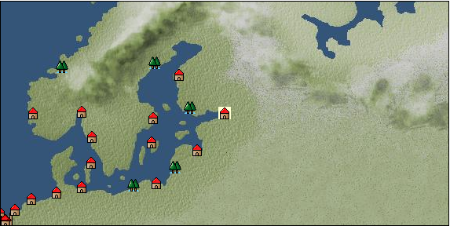

# Port: サンクトペテルブルク

import Tabs from '@theme/Tabs';
import TabItem from '@theme/TabItem';

## General Information

| Attribute | Details |
| :--- | :--- |
| **Port Name** | st petersburg |
| **Port Type** | Headquarters |
| **Region** | northern europe |
| **Sea Area** | baltic sea |
| **Required Language** | arctic languages |
| **Coordinates** | （1211，1956） |
| **Investment Reward** | [Craftsman's training book](Items/Recipe Book/item_918.md) （必要投資額：320,000ドゥカード） |

### Available Facilities

| guild | intermediary | exchange | tool shop | workshop craftsman | Painter | sculptor | peddler |
| --- | --- | --- | --- | --- | --- | --- | --- |
| ○ | ○ | ○ | ○ | ○ |   |   | ○ |
| Shipyard Master | Lumbermaker | Sail-maker | weapon craftsman | master | TavernFemale | archive | salesperson |
| --- | --- | --- | --- | --- | --- | --- | --- |
| ○ | ○ | ○ | ○ | ○ | ○ | ○ |   |
| Shipwright | 銀行 | street worker | 王宮 | Trading post | church | suburbs | translator |
| --- | --- | --- | --- | --- | --- | --- | --- |
| ○ | ○ | ○ | ○ |   | ○ |   |   |

### Description
*To enter the port, you must accept the Stockholm trade quest "Delivery Request for the Russian Capital." *Skill training location (for each profession guild master)

<Tabs>
  <TabItem value="trade_goods_sales" label="Trade Goods Sales">

| item | group | purchase price | 同盟時 | remarks |
| --- | --- | --- | --- | --- |
| [alexandrite](Items/Trade Goods/TradeGoods-Gems/item_4429.md) | [Trading Items (Gemstones)](Categories/category_15.md) | 3,562 | (3,117) |  |
| 時代限定（17世紀第5期、18世紀第1期、18世紀第2期、18世紀第3期） |
| [vodka](Items/Trade Goods/TradeGoods-Alcohol/item_579.md) | [交易品（酒類）](Categories/category_9.md) | 452 | (396) |  |
| [rabbit hair](Items/Trade Goods/TradeGoods-Fibers/item_1036.md) | [交易品（繊維）](Categories/category_1.md) | 721 | (631) |  |
| 要投資（必要投資額：8,500,000） 7.7M以下　2017-6確認 |
| [felt](Items/Trade Goods/TradeGoods-Fabrics/item_4439.md) | [交易品（織物）](Categories/category_20.md) | 792 | (693) |  |
| Investment required (Required investment amount: 7,394,000) Required investment amount is between 7.014M and 7.394M Confirmed on 2024.1.13 |
| [wood](Items/Trade Goods/TradeGoods-Wares/item_277.md) | [交易品（工業品）](Categories/category_19.md) | 506 | (443) |  |
| [fur](Items/Trade Goods/TradeGoods-Fibers/item_634.md) | [交易品（繊維）](Categories/category_1.md) | 1,040 | (910) |  |
| 要投資（必要投資額：240,000） |
| [oil](Items/Trade Goods/TradeGoods-Wares/item_613.md) | [交易品（工業品）](Categories/category_19.md) | 580 | (508) |  |
| [paper](Items/Trade Goods/TradeGoods-Wares/item_625.md) | [交易品（工業品）](Categories/category_19.md) | 274 | (240) |  |
| 要投資（必要投資額：180,000） |
| [gold](Items/Trade Goods/TradeGoods-Metals/item_659.md) | [Trading products (precious metals)](Categories/category_8.md) | 8,657 | (7,574) |  |
| 要投資（必要投資額：8,500,000） |
| [iron material](Items/Trade Goods/TradeGoods-Wares/item_268.md) | [交易品（工業品）](Categories/category_19.md) | 807 | (707) |  |
| 要投資（必要投資額：120,000） |
  </TabItem>
  <TabItem value="sale_specialty" label="Sale (Specialty)">

| item | group | sale price | 同盟時 | remarks |
| --- | --- | --- | --- | --- |

#### [交易品（雑貨）](Categories/category_5.md)

| [old ink stick](Items/Trade Goods/TradeGoods-Misc/item_3921.md) | [交易品（雑貨）](Categories/category_5.md) | 37,900 | (42,641) |  |

#### [Trading goods (hobby goods)](Categories/category_10.md)

| [raspberry](Items/Trade Goods/TradeGoods-Sunddries/item_5419.md) | [Trading goods (hobby goods)](Categories/category_10.md) | 9,948 | (11,192) |  |

#### [Trading goods (artificial goods)](Categories/category_13.md)

| [african wood carving](Items/Trade Goods/TradeGoods-Luxuries/item_5558.md) | [Trading goods (artificial goods)](Categories/category_13.md) | 4,487 | (5,048) |  |

#### [交易品（美術品）](Categories/category_14.md)

| [oil painting](Items/Trade Goods/TradeGoods-Art/item_1088.md) | [交易品（美術品）](Categories/category_14.md) | 2,790 | (3,139) |  |

#### [交易品（工業品）](Categories/category_19.md)

| [Japanese paper](Items/Trade Goods/TradeGoods-Wares/item_3438.md) | [交易品（工業品）](Categories/category_19.md) | 25,100 | (28,240) |  |
  </TabItem>
  <TabItem value="sale_no_specialty" label="Sale (No Specialty)">

| item | group | sale price | 同盟時 | remarks |
| --- | --- | --- | --- | --- |

#### [Trading Items (Gemstones)](Categories/category_15.md)

| [coral](Items/Trade Goods/TradeGoods-Gems/item_141.md) | [Trading Items (Gemstones)](Categories/category_15.md) | 4,521 | (5,086) |  |
  </TabItem>
  <TabItem value="guild_&_others" label="Guild & Others">

| item | group | Sales price | Handling NPC | remarks |
| --- | --- | --- | --- | --- |

#### adventure guild

| [trap](Skills/Skill-Adventure/item_3579.md) | [Skill (adventure)](Categories/category_39.md) | 100,000 | adventure guild |  |

#### merchant guild

| [alchemy](Skills/Skill-Trade/item_1727.md) | [Skill (trade)](Categories/category_40.md) | 5,000,000 | merchant guild |  |
| [Norse](Skills/Skills-Language/item_601.md) | [Skills (language)](Categories/category_42.md) | 1,000 | merchant guild |  |

#### maritime guild

| [Slavic languages](Skills/Skills-Language/item_286.md) | [Skills (language)](Categories/category_42.md) | 4,000 | maritime guild |  |

#### Daikokuya Kodayu

| [Survive](Skills/Skill-Adventure/item_462.md) | [Skill (adventure)](Categories/category_39.md) | 3,000 | Daikokuya Kodayu |  |
| [Japanese](Skills/Skills-Language/item_3396.md) | [Skills (language)](Categories/category_42.md) | 600,000 | Daikokuya Kodayu |  |
| [arctic languages](Skills/Skills-Language/item_4414.md) | [Skills (language)](Categories/category_42.md) | 1,000,000 | Daikokuya Kodayu |  |

#### others

| [Eastern European folk costume sewing method](Items/Recipe Book/item_4523.md) | [recipe book](Categories/category_22.md) | Fixed recipe |  |  |
| 時代限定（18世紀第3期） 街娘 |
| [Eastern European ornament manufacturing method](Items/Recipe Book/item_4492.md) | [recipe book](Categories/category_22.md) | Fixed recipe |  |  |
| 時代限定（18世紀第3期） 18世紀第3期　旅商人 |
| [Eastern European armor casting method](Items/Recipe Book/item_4487.md) | [recipe book](Categories/category_22.md) | Fixed recipe |  |  |
| Limited period (3rd period of 18th century) Attendant |
  </TabItem>
  <TabItem value="toolman" label="Toolman">

| item | group | Sales price | Handling NPC | remarks |
| --- | --- | --- | --- | --- |

#### [recipe book](Categories/category_22.md)

| [Mode Design Collection Volume 1](Items/Recipe Book/item_92.md) | [recipe book](Categories/category_22.md) | 10,000 | tool shop owner |  |
| [traditional russian cuisine](Items/Recipe Book/item_4491.md) | [recipe book](Categories/category_22.md) | 100,000 | tool shop owner |  |
| 時代限定（17世紀第5期、18世紀第1期、18世紀第2期、18世紀第3期） |
| [Sword training/application](Items/Recipe Book/item_589.md) | [recipe book](Categories/category_22.md) | 50,000 | tool shop owner |  |
| 要投資（必要投資額：不明） |
| [Far North costume sewing method](Items/Recipe Book/item_5452.md) | [recipe book](Categories/category_22.md) | Fixed recipe | tool shop owner |  |
| [Textile secrets/fabric book](Items/Recipe Book/item_91.md) | [recipe book](Categories/category_22.md) | 10,000 | tool shop owner |  |

#### [Equipment (head)](Categories/category_23.md)

| [Kichka](Items/Equipment/Equipment-Head/item_4422.md) | [Equipment (head)](Categories/category_23.md) | 15,000 | tool shop owner |  |
| Period-specific (17th century 5th period, 18th century 1st period, 18th century 2nd period, 18th century 3rd period) Requires the title of one who knows time (18th century-3) |
| [kokoshnik](Items/Equipment/Equipment-Head/item_4421.md) | [Equipment (head)](Categories/category_23.md) | 15,000 | tool shop owner |  |
| Period-specific (17th century 5th period, 18th century 1st period, 18th century 2nd period, 18th century 3rd period) Requires the title of one who knows time (18th century-3) |
| [cossack cap](Items/Equipment/Equipment-Head/item_4425.md) | [Equipment (head)](Categories/category_23.md) | 15,000 | tool shop owner |  |
| Period-specific (17th century 5th period, 18th century 1st period, 18th century 2nd period, 18th century 3rd period) Requires the title of one who knows time (18th century-3) |
| [Shapka](Items/Equipment/Equipment-Head/item_4420.md) | [Equipment (head)](Categories/category_23.md) | 15,000 | tool shop owner |  |
| Period-specific (17th century 5th period, 18th century 1st period, 18th century 2nd period, 18th century 3rd period) Requires the title of one who knows time (18th century-3) |
| [secrets](Items/Equipment/Equipment-Head/item_4426.md) | [Equipment (head)](Categories/category_23.md) | 15,000 | tool shop owner |  |
| Period-specific (17th century 5th period, 18th century 1st period, 18th century 2nd period, 18th century 3rd period) Requires the title of one who knows time (18th century-3) |
| [boyar](Items/Equipment/Equipment-Head/item_4423.md) | [Equipment (head)](Categories/category_23.md) | 15,000 | tool shop owner |  |
| Period-specific (17th century 5th period, 18th century 1st period, 18th century 2nd period, 18th century 3rd period) Requires the title of one who knows time (18th century-3) |
| [sea ​​otter fur ushanka](Items/Equipment/Equipment-Head/item_4424.md) | [Equipment (head)](Categories/category_23.md) | 15,000 | tool shop owner |  |
| Period-specific (17th century 5th period, 18th century 1st period, 18th century 2nd period, 18th century 3rd period) Requires the title of one who knows time (18th century-3) |

#### [Equipment (body)](Categories/category_24.md)

| [Kaftan](Items/Equipment/Equipment-Body/item_4415.md) | [Equipment (body)](Categories/category_24.md) | 20,000 | tool shop owner |  |
| Period-specific (17th century 5th period, 18th century 1st period, 18th century 2nd period, 18th century 3rd period) Requires the title of one who knows time (18th century-3) |
| [cossack kaftan](Items/Equipment/Equipment-Body/item_4418.md) | [Equipment (body)](Categories/category_24.md) | 20,000 | tool shop owner |  |
| Period-specific (17th century 5th period, 18th century 1st period, 18th century 2nd period, 18th century 3rd period) Requires the title of one who knows time (18th century-3) |
| [sarafan](Items/Equipment/Equipment-Body/item_4417.md) | [Equipment (body)](Categories/category_24.md) | 20,000 | tool shop owner |  |
| Period-specific (17th century 5th period, 18th century 1st period, 18th century 2nd period, 18th century 3rd period) Requires the title of one who knows time (18th century-3) |
| [Ferreze & Half Kaftan](Items/Equipment/Equipment-Body/item_4416.md) | [Equipment (body)](Categories/category_24.md) | 20,000 | tool shop owner |  |
| Period-specific (17th century 5th period, 18th century 1st period, 18th century 2nd period, 18th century 3rd period) Requires the title of one who knows time (18th century-3) |
| [lamellar armor](Items/Equipment/Equipment-Body/item_4419.md) | [Equipment (body)](Categories/category_24.md) | 20,000 | tool shop owner |  |
| Period-specific (17th century 5th period, 18th century 1st period, 18th century 2nd period, 18th century 3rd period) Requires the title of one who knows time (18th century-3) |

#### [Equipment (hands)](Categories/category_25.md)

| [jewelry glove](Items/Equipment/Equipment-Hands/item_4428.md) | [Equipment (hands)](Categories/category_25.md) | 10,000 | tool shop owner |  |
| Period-specific (17th century 5th period, 18th century 1st period, 18th century 2nd period, 18th century 3rd period) Requires the title of one who knows time (18th century-3) |

#### [Equipment (legs)](Categories/category_26.md)

| [russian boots](Items/Equipment/Equipment-Feet/item_4427.md) | [Equipment (legs)](Categories/category_26.md) | 10,000 | tool shop owner |  |
| Period-specific (17th century 5th period, 18th century 1st period, 18th century 2nd period, 18th century 3rd period) Requires the title of one who knows time (18th century-3) |

#### [Consumables (land battle/deck battle)](Categories/category_29.md)

| [black kite feather](Items/Consumables/Consumables-Landbattle/item_88.md) | [Consumables (land battle/deck battle)](Categories/category_29.md) | 100 | tool shop owner |  |
| [Assortment of wound medicine](Items/Consumables/Consumables-Landbattle/item_90.md) | [Consumables (land battle/deck battle)](Categories/category_29.md) | 500 | tool shop owner |  |
| [therapeutic drug](Items/Consumables/Consumables-Landbattle/item_89.md) | [Consumables (land battle/deck battle)](Categories/category_29.md) | 300 | tool shop owner |  |
| [antidote](Items/Consumables/Consumables-Landbattle/item_270.md) | [Consumables (land battle/deck battle)](Categories/category_29.md) | 100 | tool shop owner |  |
  </TabItem>
  <TabItem value="kobo_craftsmen" label="Craftsman">

| item | group | Sales price | Handling NPC | remarks |
| --- | --- | --- | --- | --- |

#### [Consumables (condition recovery)](Categories/category_21.md)

| [Nostalgic carillon bell](Items/Consumables/Consumables-Recovery/item_245.md) | [Consumables (condition recovery)](Categories/category_21.md) | 200 | workshop craftsman |  |
| [Ship song sheet music](Items/Consumables/Consumables-Recovery/item_247.md) | [Consumables (condition recovery)](Categories/category_21.md) | 200 | workshop craftsman |  |

#### [recipe book](Categories/category_22.md)

| [Marine life sculpture](Items/Recipe Book/item_273.md) | [recipe book](Categories/category_22.md) | 10,000 | workshop craftsman |  |
| [Shipwright Introduction/Craft Book](Items/Recipe Book/item_75.md) | [recipe book](Categories/category_22.md) | 10,000 | workshop craftsman |  |
| [Shipwright Introduction/Sewing Book](Items/Recipe Book/item_74.md) | [recipe book](Categories/category_22.md) | 10,000 | workshop craftsman |  |
| [Shipwright Introduction/Casting Book](Items/Recipe Book/item_76.md) | [recipe book](Categories/category_22.md) | 10,000 | workshop craftsman |  |

#### [Consumables (skill activation)](Categories/category_31.md)

| [四分儀](Items/Consumables/Consumables-Skill/item_346.md) | [Consumables (skill activation)](Categories/category_31.md) | 500 | workshop craftsman |  |
| [simple salvage rope](Items/Consumables/Consumables-Skill/item_2294.md) | [Consumables (skill activation)](Categories/category_31.md) | 500 | workshop craftsman |  |
| [Simple towing auxiliary rope](Items/Consumables/Consumables-Skill/item_2295.md) | [Consumables (skill activation)](Categories/category_31.md) | 500 | workshop craftsman |  |
  </TabItem>
  <TabItem value="peddler" label="peddler">

| item | group | Sales price | Handling NPC | remarks |
| --- | --- | --- | --- | --- |

#### [Consumables (condition recovery)](Categories/category_21.md)

| [spare sail](Items/Consumables/Consumables-Recovery/item_242.md) | [Consumables (condition recovery)](Categories/category_21.md) |  | peddler |  |
| [reserve rudder](Items/Consumables/Consumables-Recovery/item_243.md) | [Consumables (condition recovery)](Categories/category_21.md) |  | peddler |  |
| [sleep hammock](Items/Consumables/Consumables-Recovery/item_73.md) | [Consumables (condition recovery)](Categories/category_21.md) |  | peddler |  |
| [rope of punishment](Items/Consumables/Consumables-Recovery/item_71.md) | [Consumables (condition recovery)](Categories/category_21.md) |  | peddler |  |

#### [Consumables (naval/hand-to-hand combat)](Categories/category_30.md)

| [ceasefire agreement](Items/Consumables/Consumables-navalhand-to-hand combat/item_129.md) | [Consumables (naval/hand-to-hand combat)](Categories/category_30.md) |  | peddler |  |
| [手術道具](Items/Consumables/Consumables-navalhand-to-hand combat/item_80.md) | [Consumables (naval/hand-to-hand combat)](Categories/category_30.md) |  | peddler |  |
| [flag of calm](Items/Consumables/Consumables-navalhand-to-hand combat/item_84.md) | [Consumables (naval/hand-to-hand combat)](Categories/category_30.md) |  | peddler |  |

#### [Consumables (skill activation)](Categories/category_31.md)

| [landmark ribbon](Items/Consumables/Consumables-Skill/item_316.md) | [Consumables (skill activation)](Categories/category_31.md) |  | peddler |  |
  </TabItem>
  <TabItem value="shipyard" label="Shipyard">

### Lumbermaker

| item | group | Sales price | Handling NPC | remarks |
| --- | --- | --- | --- | --- |

#### [Ship parts (additional armor)](Categories/category_35.md)

| [elm board](Items/Ship Parts/Shipparts-Plates/item_328.md) | [Ship parts (additional armor)](Categories/category_35.md) | 13,000 | Lumbermaker |  |
| [oak board](Items/Ship Parts/Shipparts-Plates/item_354.md) | [Ship parts (additional armor)](Categories/category_35.md) | 34,000 | Lumbermaker |  |
| [cedar board](Items/Ship Parts/Shipparts-Plates/item_353.md) | [Ship parts (additional armor)](Categories/category_35.md) | 800 | Lumbermaker |  |
| [beach board](Items/Ship Parts/Shipparts-Plates/item_327.md) | [Ship parts (additional armor)](Categories/category_35.md) | 6,400 | Lumbermaker |  |
| [red pine board](Items/Ship Parts/Shipparts-Plates/item_326.md) | [Ship parts (additional armor)](Categories/category_35.md) | 2,700 | Lumbermaker |  |
| [lightweight oak board](Items/Ship Parts/Shipparts-Plates/item_533.md) | [Ship parts (additional armor)](Categories/category_35.md) | 38,000 | Lumbermaker |  |
| [lightweight cedar board](Items/Ship Parts/Shipparts-Plates/item_325.md) | [Ship parts (additional armor)](Categories/category_35.md) | 880 | Lumbermaker |  |
| [lightweight beach board](Items/Ship Parts/Shipparts-Plates/item_532.md) | [Ship parts (additional armor)](Categories/category_35.md) | 7,000 | Lumbermaker |  |
| [Lightweight red pine board](Items/Ship Parts/Shipparts-Plates/item_531.md) | [Ship parts (additional armor)](Categories/category_35.md) | 3,000 | Lumbermaker |  |

### Sail-maker

| item | group | Sales price | Handling NPC | remarks |
| --- | --- | --- | --- | --- |

#### [Ship parts (auxiliary sails)](Categories/category_33.md)

| [outer jib](Items/Ship Parts/Shipparts-Studding-Sail/item_331.md) | [Ship parts (auxiliary sails)](Categories/category_33.md) | 18,000 | Sail-maker |  |
| [Outer & inner jib](Items/Ship Parts/Shipparts-Studding-Sail/item_332.md) | [Ship parts (auxiliary sails)](Categories/category_33.md) | 23,000 | Sail-maker |  |
| [inner jib](Items/Ship Parts/Shipparts-Studding-Sail/item_279.md) | [Ship parts (auxiliary sails)](Categories/category_33.md) | 1,700 | Sail-maker |  |
| [Vorgernstaisl](Items/Ship Parts/Shipparts-Studding-Sail/item_333.md) | [Ship parts (auxiliary sails)](Categories/category_33.md) | 22,000 | Sail-maker |  |
| [Forestaisle](Items/Ship Parts/Shipparts-Studding-Sail/item_280.md) | [Ship parts (auxiliary sails)](Categories/category_33.md) | 8,300 | Sail-maker |  |
| [Foretop Gernsur](Items/Ship Parts/Shipparts-Studding-Sail/item_282.md) | [Ship parts (auxiliary sails)](Categories/category_33.md) | 2,400 | Sail-maker |  |
| [Foretop staysle](Items/Ship Parts/Shipparts-Studding-Sail/item_357.md) | [Ship parts (auxiliary sails)](Categories/category_33.md) | 29,000 | Sail-maker |  |
| [Foreroyalgernsl](Items/Ship Parts/Shipparts-Studding-Sail/item_330.md) | [Ship parts (auxiliary sails)](Categories/category_33.md) | 26,000 | Sail-maker |  |
| [bonnet](Items/Ship Parts/Shipparts-Studding-Sail/item_329.md) | [Ship parts (auxiliary sails)](Categories/category_33.md) | 25,000 | Sail-maker |  |
| [mizungernstaisl](Items/Ship Parts/Shipparts-Studding-Sail/item_334.md) | [Ship parts (auxiliary sails)](Categories/category_33.md) | 22,000 | Sail-maker |  |
| [mizzen staple](Items/Ship Parts/Shipparts-Studding-Sail/item_281.md) | [Ship parts (auxiliary sails)](Categories/category_33.md) | 11,000 | Sail-maker |  |
| [mizzen top gelrunsle](Items/Ship Parts/Shipparts-Studding-Sail/item_283.md) | [Ship parts (auxiliary sails)](Categories/category_33.md) | 4,200 | Sail-maker |  |
| [mizzen royal gelrunsle](Items/Ship Parts/Shipparts-Studding-Sail/item_284.md) | [Ship parts (auxiliary sails)](Categories/category_33.md) | 21,000 | Sail-maker |  |
| [small inner jib](Items/Ship Parts/Shipparts-Studding-Sail/item_278.md) | [Ship parts (auxiliary sails)](Categories/category_33.md) | 500 | Sail-maker |  |
| [wide bonnet](Items/Ship Parts/Shipparts-Studding-Sail/item_356.md) | [Ship parts (auxiliary sails)](Categories/category_33.md) | 38,000 | Sail-maker |  |
  </TabItem>
  <TabItem value="weapon craftsman" label="weapon craftsman">

| item | group | Sales price | Handling NPC | remarks |
| --- | --- | --- | --- | --- |

#### [Ship parts (special weapons)](Categories/category_37.md)

| [Corvus](Items/Ship Parts/Shipparts-Special-Weapons/item_194.md) | [Ship parts (special weapons)](Categories/category_37.md) | 24,000 | weapon craftsman |  |
| [rum](Items/Ship Parts/Shipparts-Special-Weapons/item_191.md) | [Ship parts (special weapons)](Categories/category_37.md) | 4,800 | weapon craftsman |  |
| [small corvus](Items/Ship Parts/Shipparts-Special-Weapons/item_193.md) | [Ship parts (special weapons)](Categories/category_37.md) | 3,000 | weapon craftsman |  |
| [small ram](Items/Ship Parts/Shipparts-Special-Weapons/item_190.md) | [Ship parts (special weapons)](Categories/category_37.md) | 1,000 | weapon craftsman |  |
| [small poop](Items/Ship Parts/Shipparts-Special-Weapons/item_198.md) | [Ship parts (special weapons)](Categories/category_37.md) | 39,000 | weapon craftsman |  |
| [small ship forecastle](Items/Ship Parts/Shipparts-Special-Weapons/item_195.md) | [Ship parts (special weapons)](Categories/category_37.md) | 5,000 | weapon craftsman |  |
| [forecastle](Items/Ship Parts/Shipparts-Special-Weapons/item_241.md) | [Ship parts (special weapons)](Categories/category_37.md) | 16,000 | weapon craftsman |  |
| [additional spanker](Items/Ship Parts/Shipparts-Special-Weapons/item_200.md) | [Ship parts (special weapons)](Categories/category_37.md) | 55,000 | weapon craftsman |  |
| [additional split](Items/Ship Parts/Shipparts-Special-Weapons/item_197.md) | [Ship parts (special weapons)](Categories/category_37.md) | 44,000 | weapon craftsman |  |
| [additional small spanker](Items/Ship Parts/Shipparts-Special-Weapons/item_199.md) | [Ship parts (special weapons)](Categories/category_37.md) | 3,500 | weapon craftsman |  |
| [additional small split](Items/Ship Parts/Shipparts-Special-Weapons/item_196.md) | [Ship parts (special weapons)](Categories/category_37.md) | 2,000 | weapon craftsman |  |

#### [Ship parts (cannon)](Categories/category_38.md)

| [12 carronades](Items/Ship Parts/Shipparts-Cannons/item_1162.md) | [Ship parts (cannon)](Categories/category_38.md) |  | weapon craftsman |  |
| [10 Saker cannons](Items/Ship Parts/Shipparts-Cannons/item_187.md) | [Ship parts (cannon)](Categories/category_38.md) | 79,000 | weapon craftsman |  |
| [2 saker cannons](Items/Ship Parts/Shipparts-Cannons/item_183.md) | [Ship parts (cannon)](Categories/category_38.md) | 3,200 | weapon craftsman |  |
| [4 saker cannons](Items/Ship Parts/Shipparts-Cannons/item_184.md) | [Ship parts (cannon)](Categories/category_38.md) | 12,600 | weapon craftsman |  |
| [6 Saker cannons](Items/Ship Parts/Shipparts-Cannons/item_185.md) | [Ship parts (cannon)](Categories/category_38.md) | 28,400 | weapon craftsman |  |
| [8 Saker cannons](Items/Ship Parts/Shipparts-Cannons/item_186.md) | [Ship parts (cannon)](Categories/category_38.md) | 50,500 | weapon craftsman |  |
| [2 demi culverin cannons](Items/Ship Parts/Shipparts-Cannons/item_188.md) | [Ship parts (cannon)](Categories/category_38.md) | 4,000 | weapon craftsman |  |
| [4 demi culverin cannons](Items/Ship Parts/Shipparts-Cannons/item_189.md) | [Ship parts (cannon)](Categories/category_38.md) | 16,200 | weapon craftsman |  |
| [2 falcon guns](Items/Ship Parts/Shipparts-Cannons/item_174.md) | [Ship parts (cannon)](Categories/category_38.md) | 500 | weapon craftsman |  |
| [4 falcon guns](Items/Ship Parts/Shipparts-Cannons/item_175.md) | [Ship parts (cannon)](Categories/category_38.md) | 2,000 | weapon craftsman |  |
| [6 falcon guns](Items/Ship Parts/Shipparts-Cannons/item_176.md) | [Ship parts (cannon)](Categories/category_38.md) | 4,600 | weapon craftsman |  |
| [8 falcon guns](Items/Ship Parts/Shipparts-Cannons/item_177.md) | [Ship parts (cannon)](Categories/category_38.md) | 8,100 | weapon craftsman |  |
| [10 minion cannons](Items/Ship Parts/Shipparts-Cannons/item_182.md) | [Ship parts (cannon)](Categories/category_38.md) | 34,800 | weapon craftsman |  |
| [2 minion cannons](Items/Ship Parts/Shipparts-Cannons/item_178.md) | [Ship parts (cannon)](Categories/category_38.md) | 1,400 | weapon craftsman |  |
| [4 minion cannons](Items/Ship Parts/Shipparts-Cannons/item_179.md) | [Ship parts (cannon)](Categories/category_38.md) | 5,600 | weapon craftsman |  |
| [6 minion cannons](Items/Ship Parts/Shipparts-Cannons/item_180.md) | [Ship parts (cannon)](Categories/category_38.md) | 12,400 | weapon craftsman |  |
| [8 minion cannons](Items/Ship Parts/Shipparts-Cannons/item_181.md) | [Ship parts (cannon)](Categories/category_38.md) | 22,400 | weapon craftsman |  |
  </TabItem>
  <TabItem value="Tavern Master" label="Tavern Master">

| item | group | Sales price | Handling NPC | remarks |
| --- | --- | --- | --- | --- |

#### [recipe book](Categories/category_22.md)

| [Russian Tavern cuisine](Items/Recipe Book/item_4511.md) | [recipe book](Categories/category_22.md) | Fixed recipe | Tavern Master |  |
| It doesn't seem to be time limited. |
  </TabItem>
</Tabs>