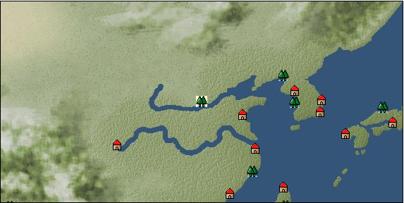

# Port: Xanadu

import Tabs from '@theme/Tabs';
import TabItem from '@theme/TabItem';

## General Information

| Attribute | Details |
| :--- | :--- |
| **Port Name** | Xanadu |
| **Port Type** | Landing point |
| **Region** | east asia |
| **Sea Area** | western east asia |
| **Required Language** | Chinese |
| **Coordinates** | （5242，3288） |
| **Investment Reward** |  |

### Available Facilities

| guild | intermediary | exchange | tool shop | workshop craftsman | Painter | sculptor | peddler |
| --- | --- | --- | --- | --- | --- | --- | --- |
|   |   |   | ○ |   |   |   |   |
| Shipyard Master | Lumbermaker | Sail-maker | weapon craftsman | master | TavernFemale | archive | salesperson |
| --- | --- | --- | --- | --- | --- | --- | --- |
|   |   |   |   | ○ |   |   |   |
| Shipwright | 銀行 | street worker | 王宮 | Trading post | church | suburbs | translator |
| --- | --- | --- | --- | --- | --- | --- | --- |
|   |   |   |   |   |   | ○ |   |

### Description
A city in the southern part of the Mongolian Plateau. It was built by the emperor of the Yuan Dynasty and served as the capital during the summer. It was described in "Touhou Kenroku" as an elegant city with the highest level of technology, and became the object of admiration for many navigators. Found in the future where the quest promise was given. To enter after that, you need to have accepted the quest or have the title ``Those Who Know Time (14th Century).'' Enter from the pointed rock

<Tabs>
  <TabItem value="trade_goods_sales" label="Trade Goods Sales">

| Item | Group | Purchase Price | Allied Price | Remarks |
| --- | --- | --- | --- | --- |
| There is no purchase information for trade goods. |
  </TabItem>
  <TabItem value="sale_specialty" label="Sale (Specialty)">

| Item | Group | sale price | Allied Price | Remarks |
| --- | --- | --- | --- | --- |
| Sales information for trade items with specialty judgment set is not registered. |
  </TabItem>
  <TabItem value="sale_no_specialty" label="Sale (No Specialty)">

| Item | Group | sale price | Allied Price | Remarks |
| --- | --- | --- | --- | --- |
| There is no information on the sale of trade goods. |
  </TabItem>
  <TabItem value="guild_&_others" label="Guild & Others">

| Item | Group | Sales price | Handling NPC | Remarks |
| --- | --- | --- | --- | --- |
| There is no sales information for the Item |
| --- |
  </TabItem>
  <TabItem value="toolman" label="Toolman">

| Item | Group | Sales price | Handling NPC | Remarks |
| --- | --- | --- | --- | --- |

#### [Equipment (head)](docs/Categories/category_23.md)

| [Unegune Margai](docs/Items/Equipment/Equipment-Head/item_4763.md) | Equipment (head) | 15,000 | tool shop owner |  |
| 時代限定（14世紀） 14世紀限定 |
| [Janjin Margai](docs/Items/Equipment/Equipment-Head/item_4766.md) | Equipment (head) | 15,000 | tool shop owner |  |
| 時代限定（14世紀） 14世紀限定 |
| [Mongolian bag](docs/Items/Equipment/Equipment-Head/item_4761.md) | Equipment (head) | 15,000 | tool shop owner |  |
| 時代限定（14世紀） 14世紀限定 |

#### [Equipment (body)](docs/Categories/category_24.md)

| [Ustadale (for women)](docs/Items/Equipment/Equipment-Body/item_4765.md) | Equipment (body) | 20,000 | tool shop owner |  |
| 時代限定（14世紀） 14世紀限定 |
| [Ustadale (for men)](docs/Items/Equipment/Equipment-Body/item_4764.md) | Equipment (body) | 20,000 | tool shop owner |  |
| 時代限定（14世紀） 14世紀限定 |
| [蒙古鎧](docs/Items/Equipment/Equipment-Body/item_4760.md) | Equipment (body) | 20,000 | tool shop owner |  |
| 時代限定（14世紀） 14世紀限定 |

#### [Equipment (legs)](docs/Categories/category_26.md)

| [Gotal](docs/Items/Equipment/Equipment-Feet/item_4762.md) | Equipment (legs) | 10,000 | tool shop owner |  |
| 時代限定（14世紀） 14世紀限定 |

#### [Consumables (land battle/deck battle)](docs/Categories/category_29.md)

| [tonic](docs/Items/Consumables/Consumables-Landbattle/item_1678.md) | Consumables (land battle/deck battle) | 300 | tool shop owner |  |
| [throwing knife](docs/Items/Consumables/Consumables-Landbattle/item_560.md) | Consumables (land battle/deck battle) | 150 | tool shop owner |  |
| [torch for throwing](docs/Items/Consumables/Consumables-Landbattle/item_313.md) | Consumables (land battle/deck battle) | 150 | tool shop owner |  |
  </TabItem>
</Tabs>