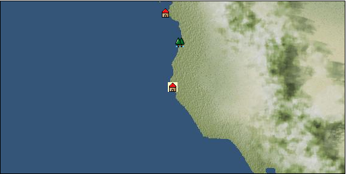

# Port: San francisco

import Tabs from '@theme/Tabs';
import TabItem from '@theme/TabItem';

## General Information

| Attribute | Details |
| :--- | :--- |
| **Port Name** | San francisco |
| **Port Type** | port of alliance |
| **Region** | west coast of north america |
| **Sea Area** | Off the coast of San Francisco |
| **Required Language** | North American languages |
| **Coordinates** | （10568，3100） |
| **Investment Reward** | [Lot (NO.5)](docs/Items/Consumables/Consumables-Treasure-Chests/item_3017.md) （必要投資額：500,000ドゥカード） |

### Available Facilities

| guild | intermediary | exchange | tool shop | workshop craftsman | Painter | sculptor | peddler |
| --- | --- | --- | --- | --- | --- | --- | --- |
| ○ | ○ | ○ | ○ | ○ |   |   | ○ |
| Shipyard Master | Lumbermaker | Sail-maker | weapon craftsman | master | TavernFemale | archive | salesperson |
| --- | --- | --- | --- | --- | --- | --- | --- |
| ○ | ○ | ○ | ○ | ○ | ○ | ○ |   |
| Shipwright | 銀行 | street worker | 王宮 | Trading post | church | suburbs | translator |
| --- | --- | --- | --- | --- | --- | --- | --- |
| ○ | ○ | ○ |   |   | ○ |   |   |

### Description
*To enter the port, you must accept the Marseille adventure quest ``Seeking a New Land.''

<Tabs>
  <TabItem value="trade_goods_sales" label="Trade Goods Sales">

| Item | Group | Purchase Price | Allied Price | Remarks |
| --- | --- | --- | --- | --- |
| [cow](docs/Items/TradeGoods/TradeGoods-Livestock/item_17.md) | [Trading Goods (Livestock)](docs/Categories/category_18.md) | 319 | (280) |  |
| [cheese](docs/Items/TradeGoods/TradeGoods-Foodstuffs/item_20.md) | [Trading items (food items)](docs/Categories/category_3.md) | 520 | (455) |  |
| [corn](docs/Items/TradeGoods/TradeGoods-Foodstuffs/item_138.md) | [Trading items (food items)](docs/Categories/category_3.md) | 55 | (49) |  |
| [ham](docs/Items/TradeGoods/TradeGoods-Foodstuffs/item_290.md) | [Trading items (food items)](docs/Categories/category_3.md) | 643 | (563) |  |
| [blueberry](docs/Items/TradeGoods/TradeGoods-Sunddries/item_4657.md) | [Trading goods (hobby goods)](docs/Categories/category_10.md) | 479 | (420) |  |
| 要投資（必要投資額：210,000） |
| [raspberry](docs/Items/TradeGoods/TradeGoods-Sunddries/item_4658.md) | [Trading goods (hobby goods)](docs/Categories/category_10.md) | 397 | (348) |  |
| 要投資（必要投資額：250,000） |
| [wheat](docs/Items/TradeGoods/TradeGoods-Foodstuffs/item_16.md) | [Trading items (food items)](docs/Categories/category_3.md) | 46 | (41) |  |
| [gold dust](docs/Items/TradeGoods/TradeGoods-Metals/item_111.md) | [Trading products (precious metals)](docs/Categories/category_8.md) | 6,470 | (5,661) |  |
| 要投資（必要投資額：300,000） |
  </TabItem>
  <TabItem value="sale_specialty" label="Sale (Specialty)">

| Item | Group | sale price | Allied Price | Remarks |
| --- | --- | --- | --- | --- |

#### [交易品（繊維）](docs/Categories/category_1.md)

| [deerskin](docs/Items/TradeGoods/TradeGoods-Fibers/item_3648.md) | 交易品（繊維） | 12,165 | (13,686) |  |

#### [交易品（雑貨）](docs/Categories/category_5.md)

| [lantern](docs/Items/TradeGoods/TradeGoods-Misc/item_3683.md) | 交易品（雑貨） | (2,666) | 3,110 |  |

#### [Trading products (medical products)](docs/Categories/category_6.md)

| [Korean ginseng](docs/Items/TradeGoods/TradeGoods-Medicine/item_3738.md) | Trading products (medical products) | 13,853 | (15,586) |  |

#### [Trading products (precious metals)](docs/Categories/category_8.md)

| [佐摩銀](docs/Items/TradeGoods/TradeGoods-Metals/item_3432.md) | Trading products (precious metals) | 6,000 | (6,750) |  |

#### [Trading goods (hobby goods)](docs/Categories/category_10.md)

| [raspberry](docs/Items/TradeGoods/TradeGoods-Sunddries/item_5419.md) | Trading goods (hobby goods) | (2,820) | 3,290 |  |

#### [Trading Goods (Spices)](docs/Categories/category_11.md)

| [gardenia](docs/Items/TradeGoods/TradeGoods-Perfume/item_1091.md) | Trading Goods (Spices) | 10,300 | (11,588) |  |

#### [Trading Goods (Spices)](docs/Categories/category_12.md)

| [cloves](docs/Items/TradeGoods/TradeGoods-Spices/item_1092.md) | Trading Goods (Spices) | 4,317 | (4,857) |  |
| [nutmeg](docs/Items/TradeGoods/TradeGoods-Spices/item_1969.md) | Trading Goods (Spices) | 4,562 | (5,132) |  |
| [mace](docs/Items/TradeGoods/TradeGoods-Spices/item_2100.md) | Trading Goods (Spices) | 5,162 | (5,807) |  |

#### [Trading goods (artificial goods)](docs/Categories/category_13.md)

| [african wood carving](docs/Items/TradeGoods/TradeGoods-Luxuries/item_5558.md) | Trading goods (artificial goods) | 3,389 | (3,812) |  |
| [glasswork](docs/Items/TradeGoods/TradeGoods-Luxuries/item_60.md) | Trading goods (artificial goods) | 3,137 | (3,529) |  |
| [Saori](docs/Items/TradeGoods/TradeGoods-Luxuries/item_3676.md) | Trading goods (artificial goods) | 2,848 | (3,204) |  |

#### [交易品（美術品）](docs/Categories/category_14.md)

| [oil painting](docs/Items/TradeGoods/TradeGoods-Art/item_1088.md) | 交易品（美術品） | 4,894 | (5,506) |  |
| [Mianzhu New Year Pictures](docs/Items/TradeGoods/TradeGoods-Art/item_4005.md) | 交易品（美術品） | 3,512 | (3,951) |  |

#### [Trading Items (Arms)](docs/Categories/category_16.md)

| [Japanese sword](docs/Items/TradeGoods/TradeGoods-Weapons/item_3437.md) | Trading Items (Arms) | 11,931 | (13,423) |  |

#### [Trading Items (Firearms)](docs/Categories/category_17.md)

| [tanegashima gun](docs/Items/TradeGoods/TradeGoods-Firearms/item_3423.md) | Trading Items (Firearms) | 11,809 | (13,286) |  |

#### [交易品（織物）](docs/Categories/category_20.md)

| [Nishijin textile](docs/Items/TradeGoods/TradeGoods-Fabrics/item_3431.md) | 交易品（織物） | 12,686 | (14,273) |  |
  </TabItem>
  <TabItem value="sale_no_specialty" label="Sale (No Specialty)">

| Item | Group | sale price | Allied Price | Remarks |
| --- | --- | --- | --- | --- |

#### [交易品（繊維）](docs/Categories/category_1.md)

| [fur](docs/Items/TradeGoods/TradeGoods-Fibers/item_634.md) | 交易品（繊維） | 1,409 | (1,585) |  |

#### [交易品（調味料）](docs/Categories/category_4.md)

| [salt](docs/Items/TradeGoods/TradeGoods-Seasonings/item_42.md) | 交易品（調味料） | 272 | (306) |  |

#### [交易品（酒類）](docs/Categories/category_9.md)

| [rum](docs/Items/TradeGoods/TradeGoods-Alcohol/item_139.md) | 交易品（酒類） | 645 | (725) |  |

#### [Trading goods (artificial goods)](docs/Categories/category_13.md)

| [goldsmith](docs/Items/TradeGoods/TradeGoods-Luxuries/item_687.md) | Trading goods (artificial goods) | 3,130 | (3,521) |  |

#### [交易品（美術品）](docs/Categories/category_14.md)

| [wooden statue](docs/Items/TradeGoods/TradeGoods-Art/item_95.md) | 交易品（美術品） | 1,012 | (1,138) |  |
| [stone statue](docs/Items/TradeGoods/TradeGoods-Art/item_899.md) | 交易品（美術品） | 1,478 | (1,662) |  |

#### [Trading Goods (Livestock)](docs/Categories/category_18.md)

| [rat](docs/Items/TradeGoods/TradeGoods-Livestock/item_2710.md) | Trading Goods (Livestock) | 17 | (19) |  |

#### [交易品（工業品）](docs/Categories/category_19.md)

| [oil](docs/Items/TradeGoods/TradeGoods-Wares/item_613.md) | 交易品（工業品） | 636 | (715) |  |
| [coal](docs/Items/TradeGoods/TradeGoods-Wares/item_359.md) | 交易品（工業品） | 466 | (524) |  |
| [鋼](docs/Items/TradeGoods/TradeGoods-Wares/item_573.md) | 交易品（工業品） | 1,254 | (1,410) |  |

#### [交易品（織物）](docs/Categories/category_20.md)

| [satin](docs/Items/TradeGoods/TradeGoods-Fabrics/item_996.md) | 交易品（織物） | 3,825 | (4,303) |  |
| [georgette](docs/Items/TradeGoods/TradeGoods-Fabrics/item_1000.md) | 交易品（織物） | 3,728 | (4,194) |  |
| [race](docs/Items/TradeGoods/TradeGoods-Fabrics/item_59.md) | 交易品（織物） | 2,413 | (2,714) |  |
  </TabItem>
  <TabItem value="guild_&_others" label="Guild & Others">

| Item | Group | Sales price | Handling NPC | Remarks |
| --- | --- | --- | --- | --- |

#### adventure guild

| [explore](docs/Skills/Skill-Adventure/item_257.md) | [Skill (adventure)](docs/Categories/category_39.md) | 15,000 | adventure guild |  |
| [行軍](docs/Skills/Skill-Adventure/item_461.md) | [Skill (adventure)](docs/Categories/category_39.md) | 3,000 | adventure guild |  |

#### merchant guild

| [North American languages](docs/Skills/Skills-Language/item_4478.md) | [Skills (language)](docs/Categories/category_42.md) | 1,000,000 | merchant guild |  |

#### maritime guild

| [first aid](docs/Skills/Skill-Battle/item_504.md) | [Skill (combat)](docs/Categories/category_41.md) | 2,000 | maritime guild |  |
| [shooting](docs/Skills/Skill-Battle/item_500.md) | [Skill (combat)](docs/Categories/category_41.md) | 5,000 | maritime guild |  |

#### Brannan

| [craft trade](docs/Skills/Skill-Trade/item_258.md) | [Skill (trade)](docs/Categories/category_40.md) |  | Brannan |  |
| [Precious metal trading](docs/Skills/Skill-Trade/item_487.md) | [Skill (trade)](docs/Categories/category_40.md) | 80,000 | Brannan |  |
| [casting](docs/Skills/Skill-Trade/item_475.md) | [Skill (trade)](docs/Categories/category_40.md) | 6,000 | Brannan |  |
  </TabItem>
  <TabItem value="toolman" label="Toolman">

| Item | Group | Sales price | Handling NPC | Remarks |
| --- | --- | --- | --- | --- |

#### [recipe book](docs/Categories/category_22.md)

| [Mode Design Collection Volume 1](docs/Items/RecipeBooks/item_92.md) | recipe book | 10,000 | tool shop owner |  |
| [Sword training/application](docs/Items/RecipeBooks/item_589.md) | recipe book | 50,000 | tool shop owner |  |
| [Textile secrets/fabric book](docs/Items/RecipeBooks/item_91.md) | recipe book | 10,000 | tool shop owner |  |

#### [Equipment (head)](docs/Categories/category_23.md)

| [mexican sombrero](docs/Items/Equipment/Equipment-Head/item_4743.md) | Equipment (head) | 35,000 | tool shop owner |  |
| 時代限定（19世紀） 【時代固定】19世紀 |

#### [Equipment (body)](docs/Categories/category_24.md)

| [Shirts & denim pants](docs/Items/Equipment/Equipment-Body/item_4751.md) | Equipment (body) | 20,000 | tool shop owner |  |
| 時代限定（19世紀） 【時代限定】19世紀 |
| [Trache de Vaquero](docs/Items/Equipment/Equipment-Body/item_4752.md) | Equipment (body) | 65,000 | tool shop owner |  |
| 時代限定（19世紀） 【時代固定】19世紀 |

#### [Equipment (legs)](docs/Categories/category_26.md)

| [mexican boots](docs/Items/Equipment/Equipment-Feet/item_4742.md) | Equipment (legs) | 44,000 | tool shop owner |  |
| 時代限定（19世紀） 【時代固定】19世紀 |

#### [Consumables (land battle/deck battle)](docs/Categories/category_29.md)

| [black kite feather](docs/Items/Consumables/Consumables-Landbattle/item_88.md) | Consumables (land battle/deck battle) | 100 | tool shop owner |  |
| [Assortment of wound medicine](docs/Items/Consumables/Consumables-Landbattle/item_90.md) | Consumables (land battle/deck battle) | 500 | tool shop owner |  |
| [therapeutic drug](docs/Items/Consumables/Consumables-Landbattle/item_89.md) | Consumables (land battle/deck battle) | 300 | tool shop owner |  |
| [antidote](docs/Items/Consumables/Consumables-Landbattle/item_270.md) | Consumables (land battle/deck battle) | 100 | tool shop owner |  |

#### [Consumables (skill activation)](docs/Categories/category_31.md)

| [miner's ice ax](docs/Items/Consumables/Consumables-Skill/item_4687.md) | Consumables (skill activation) | 10,000 | tool shop owner |  |

#### [Consumables (other)](docs/Categories/category_44.md)

| [fossil fuel](docs/Items/Consumables/Consumables-Other/item_5425.md) | Consumables (other) | 100,000 | tool shop owner |  |

#### [Consumables (request documents)](docs/Categories/category_45.md)

| [Luxury goods purchase order form](docs/Items/Consumables/Consumables-Documents/item_4778.md) | Consumables (request documents) | 40,000 | tool shop owner |  |
| [Seasoning purchase order form](docs/Items/Consumables/Consumables-Documents/item_4777.md) | Consumables (request documents) | 20,000 | tool shop owner |  |

#### [Consumables (lots, treasure chests)](docs/Categories/category_50.md)

| [Fun box (NO.1)](docs/Items/Consumables/Consumables-Treasure-Chests/item_4753.md) | Consumables (lots, treasure chests) | 50,000,000 | tool shop owner |  |
| [Fun box (NO.4)](docs/Items/Consumables/Consumables-Treasure-Chests/item_4754.md) | Consumables (lots, treasure chests) | 50,000,000 | tool shop owner |  |
  </TabItem>
  <TabItem value="kobo_craftsmen" label="Craftsman">

| Item | Group | Sales price | Handling NPC | Remarks |
| --- | --- | --- | --- | --- |

#### [recipe book](docs/Categories/category_22.md)

| [特殊兵装縫製法](docs/Items/RecipeBooks/item_1356.md) | recipe book | 50,000 | workshop craftsman |  |
| [Shipwright Introduction/Craft Book](docs/Items/RecipeBooks/item_75.md) | recipe book | 10,000 | workshop craftsman |  |
| [Shipwright Introduction/Sewing Book](docs/Items/RecipeBooks/item_74.md) | recipe book | 10,000 | workshop craftsman |  |
| [Shipwright Introduction/Casting Book](docs/Items/RecipeBooks/item_76.md) | recipe book | 10,000 | workshop craftsman |  |

#### [Consumables (skill activation)](docs/Categories/category_31.md)

| [四分儀](docs/Items/Consumables/Consumables-Skill/item_346.md) | Consumables (skill activation) | 500 | workshop craftsman |  |
| [simple salvage rope](docs/Items/Consumables/Consumables-Skill/item_2294.md) | Consumables (skill activation) | 500 | workshop craftsman |  |
| [Simple towing auxiliary rope](docs/Items/Consumables/Consumables-Skill/item_2295.md) | Consumables (skill activation) | 500 | workshop craftsman |  |

#### [shipbuilding materials](docs/Categories/category_47.md)

| [North American teak upholstery](docs/Items/ShipbuildingFS/item_4857.md) | shipbuilding materials | 10,000,000 | workshop craftsman |  |
| 19世紀限定 |
| [North American style rosewood veneer](docs/Items/ShipbuildingFS/item_4856.md) | shipbuilding materials | 15,000,000 | workshop craftsman |  |
| 19世紀限定 |
| [General purpose small square sail](docs/Items/ShipbuildingFS/item_3446.md) | shipbuilding materials | 30,000 | workshop craftsman |  |
| [General purpose small Latin sail](docs/Items/ShipbuildingFS/item_3445.md) | shipbuilding materials | 30,000 | workshop craftsman |  |
| [General-purpose small oar](docs/Items/ShipbuildingFS/item_3521.md) | shipbuilding materials | 50,000 | workshop craftsman |  |
| [General-purpose small reinforcement board](docs/Items/ShipbuildingFS/item_3527.md) | shipbuilding materials | 50,000 | workshop craftsman |  |
| [General-purpose small expansion warehouse](docs/Items/ShipbuildingFS/item_3524.md) | shipbuilding materials | 80,000 | workshop craftsman |  |
| [General-purpose small expansion cabin](docs/Items/ShipbuildingFS/item_3523.md) | shipbuilding materials | 80,000 | workshop craftsman |  |
| [General-purpose small improved rudder](docs/Items/ShipbuildingFS/item_3522.md) | shipbuilding materials | 80,000 | workshop craftsman |  |
| [General-purpose small paddle boat](docs/Items/ShipbuildingFS/item_3444.md) | shipbuilding materials | 100,000 | workshop craftsman |  |
| [General-purpose small anti-swaying water tank](docs/Items/ShipbuildingFS/item_3525.md) | shipbuilding materials | 80,000 | workshop craftsman |  |
| [General-purpose small gun port](docs/Items/ShipbuildingFS/item_3447.md) | shipbuilding materials | 30,000 | workshop craftsman |  |
| [General-purpose small hull](docs/Items/ShipbuildingFS/item_3443.md) | shipbuilding materials | 100,000 | workshop craftsman |  |
| [General-purpose small armor plate](docs/Items/ShipbuildingFS/item_3526.md) | shipbuilding materials | 50,000 | workshop craftsman |  |
  </TabItem>
  <TabItem value="peddler" label="peddler">

| Item | Group | Sales price | Handling NPC | Remarks |
| --- | --- | --- | --- | --- |

#### [Consumables (condition recovery)](docs/Categories/category_21.md)

| [Nekoirazu](docs/Items/Consumables/Consumables-Recovery/item_70.md) | Consumables (condition recovery) |  | peddler |  |
| [lime juice](docs/Items/Consumables/Consumables-Recovery/item_121.md) | Consumables (condition recovery) |  | peddler |  |
| [spare sail](docs/Items/Consumables/Consumables-Recovery/item_242.md) | Consumables (condition recovery) |  | peddler |  |
| [fire extinguishing sand](docs/Items/Consumables/Consumables-Recovery/item_68.md) | Consumables (condition recovery) |  | peddler |  |
| [clean deck brush](docs/Items/Consumables/Consumables-Recovery/item_72.md) | Consumables (condition recovery) |  | peddler |  |

#### [Consumables (land battle/deck battle)](docs/Categories/category_29.md)

| [frankisca](docs/Items/Consumables/Consumables-Landbattle/item_1484.md) | Consumables (land battle/deck battle) |  | peddler |  |

#### [Consumables (skill activation)](docs/Categories/category_31.md)

| [life aid](docs/Items/Consumables/Consumables-Skill/item_67.md) | Consumables (skill activation) |  | peddler |  |
  </TabItem>
  <TabItem value="shipyard" label="Shipyard">

### Shipyard Master

| Item | Group | Sales price | Handling NPC | Remarks |
| --- | --- | --- | --- | --- |

#### [Boat](docs/Categories/category_43.md)

| [galleon](docs/Items/Ships/item_411.md) | Boat | 4,500,000 | Shipyard Master |  |
| [carrack](docs/Items/Ships/item_236.md) | Boat | 720,000 | Shipyard Master |  |
| [caravelle](docs/Items/Ships/item_213.md) | Boat | 285,000 | Shipyard Master |  |
| [Varsha](docs/Items/Ships/item_201.md) | Boat | 2,000 | Shipyard Master |  |
| [frigate](docs/Items/Ships/item_760.md) | Boat | 1,080,000 | Shipyard Master |  |
| [hooker](docs/Items/Ships/item_335.md) | Boat | 220,000 | Shipyard Master |  |
| [bergantine](docs/Items/Ships/item_208.md) | Boat | 148,800 | Shipyard Master |  |
| [commercial galleon](docs/Items/Ships/item_412.md) | Boat | 4,600,000 | Shipyard Master |  |
| [commercial carrack](docs/Items/Ships/item_239.md) | Boat | 728,000 | Shipyard Master |  |
| [commercial caravel](docs/Items/Ships/item_215.md) | Boat | 290,000 | Shipyard Master |  |
| [commercial large carrack](docs/Items/Ships/item_409.md) | Boat | 1,840,000 | Shipyard Master |  |
| [commercial armed carrack](docs/Items/Ships/item_1502.md) | Boat | 4,000,000 | Shipyard Master |  |
| [large carrack](docs/Items/Ships/item_408.md) | Boat | 1,800,000 | Shipyard Master |  |
| [small galleon](docs/Items/Ships/item_406.md) | Boat | 830,000 | Shipyard Master |  |
| [small carrack](docs/Items/Ships/item_219.md) | Boat | 480,000 | Shipyard Master |  |
| [small caravel](docs/Items/Ships/item_206.md) | Boat | 92,000 | Shipyard Master |  |
| [battle galleon](docs/Items/Ships/item_413.md) | Boat | 4,600,000 | Shipyard Master |  |
| [combat carrack](docs/Items/Ships/item_238.md) | Boat | 720,000 | Shipyard Master |  |
| [combat caravel](docs/Items/Ships/item_212.md) | Boat | 280,000 | Shipyard Master |  |
| [Large exploration carrack](docs/Items/Ships/item_1503.md) | Boat | 3,360,000 | Shipyard Master |  |
| [refurbished heavy carrack](docs/Items/Ships/item_1504.md) | Boat | 7,000,000 | Shipyard Master |  |
| [armed cog](docs/Items/Ships/item_264.md) | Boat | 25,000 | Shipyard Master |  |
| [light galleon](docs/Items/Ships/item_240.md) | Boat | 810,000 | Shipyard Master |  |
| [light carrack](docs/Items/Ships/item_218.md) | Boat | 478,000 | Shipyard Master |  |
| [light caravelle](docs/Items/Ships/item_207.md) | Boat | 92,000 | Shipyard Master |  |
| [transport galleon](docs/Items/Ships/item_407.md) | Boat | 840,000 | Shipyard Master |  |
| [transport carrack](docs/Items/Ships/item_222.md) | Boat | 488,000 | Shipyard Master |  |
| [Small caravel for transport](docs/Items/Ships/item_3674.md) | Boat | 92,000 | Shipyard Master |  |

### Lumbermaker

| Item | Group | Sales price | Handling NPC | Remarks |
| --- | --- | --- | --- | --- |

#### [Ship parts (additional armor)](docs/Categories/category_35.md)

| [cedar board](docs/Items/ShipParts/Shipparts-Plates/item_353.md) | Ship parts (additional armor) | 800 | Lumbermaker |  |
| [red pine board](docs/Items/ShipParts/Shipparts-Plates/item_326.md) | Ship parts (additional armor) | 2,700 | Lumbermaker |  |
| [Stripped cedar board](docs/Items/ShipParts/Shipparts-Plates/item_2243.md) | Ship parts (additional armor) | 910 | Lumbermaker |  |
| [stripped red pine board](docs/Items/ShipParts/Shipparts-Plates/item_4694.md) | Ship parts (additional armor) | 3,100 | Lumbermaker |  |
| [North American style rolled iron plate](docs/Items/ShipParts/Shipparts-Plates/item_4858.md) | Ship parts (additional armor) | 1,220,000 | Lumbermaker |  |
| [North American style hardened live oak board](docs/Items/ShipParts/Shipparts-Plates/item_4860.md) | Ship parts (additional armor) | 1,240,000 | Lumbermaker |  |
| [North American style hardened rosewood board](docs/Items/ShipParts/Shipparts-Plates/item_4859.md) | Ship parts (additional armor) | 1,160,000 | Lumbermaker |  |
| [lightweight iron plate](docs/Items/ShipParts/Shipparts-Plates/item_1043.md) | Ship parts (additional armor) | 150,000 | Lumbermaker |  |
| [lightweight copper plate](docs/Items/ShipParts/Shipparts-Plates/item_1042.md) | Ship parts (additional armor) | 80,000 | Lumbermaker |  |
  </TabItem>
  <TabItem value="weapon craftsman" label="weapon craftsman">

| Item | Group | Sales price | Handling NPC | Remarks |
| --- | --- | --- | --- | --- |

#### [Ship parts (special weapons)](docs/Categories/category_37.md)

| [Corvus](docs/Items/ShipParts/Shipparts-Special-Weapons/item_194.md) | Ship parts (special weapons) | 24,000 | weapon craftsman |  |
| [rum](docs/Items/ShipParts/Shipparts-Special-Weapons/item_191.md) | Ship parts (special weapons) | 4,800 | weapon craftsman |  |
| [medium sized ram](docs/Items/ShipParts/Shipparts-Special-Weapons/item_192.md) | Ship parts (special weapons) | 31,000 | weapon craftsman |  |
| [large corvus](docs/Items/ShipParts/Shipparts-Special-Weapons/item_1204.md) | Ship parts (special weapons) | 190,000 | weapon craftsman |  |
| [large ram](docs/Items/ShipParts/Shipparts-Special-Weapons/item_788.md) | Ship parts (special weapons) | 100,000 | weapon craftsman |  |
| [small corvus](docs/Items/ShipParts/Shipparts-Special-Weapons/item_193.md) | Ship parts (special weapons) | 3,000 | weapon craftsman |  |
| [small ram](docs/Items/ShipParts/Shipparts-Special-Weapons/item_190.md) | Ship parts (special weapons) | 1,000 | weapon craftsman |  |
| [small poop](docs/Items/ShipParts/Shipparts-Special-Weapons/item_198.md) | Ship parts (special weapons) | 39,000 | weapon craftsman |  |
| [small ship forecastle](docs/Items/ShipParts/Shipparts-Special-Weapons/item_195.md) | Ship parts (special weapons) | 5,000 | weapon craftsman |  |
| [poop](docs/Items/ShipParts/Shipparts-Special-Weapons/item_837.md) | Ship parts (special weapons) | 130,000 | weapon craftsman |  |
| [forecastle](docs/Items/ShipParts/Shipparts-Special-Weapons/item_241.md) | Ship parts (special weapons) | 16,000 | weapon craftsman |  |
| [additional spanker](docs/Items/ShipParts/Shipparts-Special-Weapons/item_200.md) | Ship parts (special weapons) | 55,000 | weapon craftsman |  |
| [additional split](docs/Items/ShipParts/Shipparts-Special-Weapons/item_197.md) | Ship parts (special weapons) | 44,000 | weapon craftsman |  |
| [additional small spanker](docs/Items/ShipParts/Shipparts-Special-Weapons/item_199.md) | Ship parts (special weapons) | 3,500 | weapon craftsman |  |
| [additional small split](docs/Items/ShipParts/Shipparts-Special-Weapons/item_196.md) | Ship parts (special weapons) | 2,000 | weapon craftsman |  |

#### [Ship parts (cannon)](docs/Categories/category_38.md)

| [2 Exploder guns](docs/Items/ShipParts/Shipparts-Cannons/item_1416.md) | Ship parts (cannon) | 7,100 | weapon craftsman |  |
| [10 culverines](docs/Items/ShipParts/Shipparts-Cannons/item_375.md) | Ship parts (cannon) | 136,300 | weapon craftsman |  |
| [12 culverin guns](docs/Items/ShipParts/Shipparts-Cannons/item_744.md) | Ship parts (cannon) | 196,300 | weapon craftsman |  |
| [4 culverine guns](docs/Items/ShipParts/Shipparts-Cannons/item_372.md) | Ship parts (cannon) | 21,800 | weapon craftsman |  |
| [6 culverine guns](docs/Items/ShipParts/Shipparts-Cannons/item_373.md) | Ship parts (cannon) | 49,100 | weapon craftsman |  |
| [8 culverine guns](docs/Items/ShipParts/Shipparts-Cannons/item_374.md) | Ship parts (cannon) | 87,300 | weapon craftsman |  |
| [12 carronades](docs/Items/ShipParts/Shipparts-Cannons/item_1162.md) | Ship parts (cannon) |  | weapon craftsman |  |
| [14 carronades](docs/Items/ShipParts/Shipparts-Cannons/item_958.md) | Ship parts (cannon) | 452,500 | weapon craftsman |  |
| [14 cannons](docs/Items/ShipParts/Shipparts-Cannons/item_1177.md) | Ship parts (cannon) | 368,900 | weapon craftsman |  |
| [14 Shumine cannons](docs/Items/ShipParts/Shipparts-Cannons/item_2568.md) | Ship parts (cannon) | 390,700 | weapon craftsman |  |
| [10 Saker cannons](docs/Items/ShipParts/Shipparts-Cannons/item_187.md) | Ship parts (cannon) | 79,000 | weapon craftsman |  |
| [2 saker cannons](docs/Items/ShipParts/Shipparts-Cannons/item_183.md) | Ship parts (cannon) | 3,200 | weapon craftsman |  |
| [4 saker cannons](docs/Items/ShipParts/Shipparts-Cannons/item_184.md) | Ship parts (cannon) | 12,600 | weapon craftsman |  |
| [6 Saker cannons](docs/Items/ShipParts/Shipparts-Cannons/item_185.md) | Ship parts (cannon) | 28,400 | weapon craftsman |  |
| [8 Saker cannons](docs/Items/ShipParts/Shipparts-Cannons/item_186.md) | Ship parts (cannon) | 50,500 | weapon craftsman |  |
| [14 Seraphim cannons](docs/Items/ShipParts/Shipparts-Cannons/item_3864.md) | Ship parts (cannon) | 398,500 | weapon craftsman |  |
| [2 demi culverin cannons](docs/Items/ShipParts/Shipparts-Cannons/item_188.md) | Ship parts (cannon) | 4,000 | weapon craftsman |  |
| [4 demi culverin cannons](docs/Items/ShipParts/Shipparts-Cannons/item_189.md) | Ship parts (cannon) | 16,200 | weapon craftsman |  |
| [6 demi culverin cannons](docs/Items/ShipParts/Shipparts-Cannons/item_368.md) | Ship parts (cannon) | 36,400 | weapon craftsman |  |
| [8 demi culverin cannons](docs/Items/ShipParts/Shipparts-Cannons/item_369.md) | Ship parts (cannon) | 64,600 | weapon craftsman |  |
| [12 demi cannons](docs/Items/ShipParts/Shipparts-Cannons/item_944.md) | Ship parts (cannon) | 155,200 | weapon craftsman |  |
| [14 demi cannons](docs/Items/ShipParts/Shipparts-Cannons/item_1041.md) | Ship parts (cannon) | 235,200 | weapon craftsman |  |
| [4 demi cannons](docs/Items/ShipParts/Shipparts-Cannons/item_941.md) | Ship parts (cannon) | 6,200 | weapon craftsman |  |
| [6 demi cannons](docs/Items/ShipParts/Shipparts-Cannons/item_942.md) | Ship parts (cannon) | 24,800 | weapon craftsman |  |
| [12 Hyperier guns](docs/Items/ShipParts/Shipparts-Cannons/item_3059.md) | Ship parts (cannon) | 230,700 | weapon craftsman |  |
| [14 Hyperier guns](docs/Items/ShipParts/Shipparts-Cannons/item_3060.md) | Ship parts (cannon) | 336,300 | weapon craftsman |  |
| [14 pyro cannons](docs/Items/ShipParts/Shipparts-Cannons/item_3167.md) | Ship parts (cannon) | 185,000 | weapon craftsman |  |
| [2 falcon guns](docs/Items/ShipParts/Shipparts-Cannons/item_174.md) | Ship parts (cannon) | 500 | weapon craftsman |  |
| [4 falcon guns](docs/Items/ShipParts/Shipparts-Cannons/item_175.md) | Ship parts (cannon) | 2,000 | weapon craftsman |  |
| [6 falcon guns](docs/Items/ShipParts/Shipparts-Cannons/item_176.md) | Ship parts (cannon) | 4,600 | weapon craftsman |  |
| [8 falcon guns](docs/Items/ShipParts/Shipparts-Cannons/item_177.md) | Ship parts (cannon) | 8,100 | weapon craftsman |  |
| [10 minion cannons](docs/Items/ShipParts/Shipparts-Cannons/item_182.md) | Ship parts (cannon) | 34,800 | weapon craftsman |  |
| [2 minion cannons](docs/Items/ShipParts/Shipparts-Cannons/item_178.md) | Ship parts (cannon) | 1,400 | weapon craftsman |  |
| [4 minion cannons](docs/Items/ShipParts/Shipparts-Cannons/item_179.md) | Ship parts (cannon) | 5,600 | weapon craftsman |  |
| [6 minion cannons](docs/Items/ShipParts/Shipparts-Cannons/item_180.md) | Ship parts (cannon) | 12,400 | weapon craftsman |  |
| [8 minion cannons](docs/Items/ShipParts/Shipparts-Cannons/item_181.md) | Ship parts (cannon) | 22,400 | weapon craftsman |  |
| [12 Meteora cannons](docs/Items/ShipParts/Shipparts-Cannons/item_1172.md) | Ship parts (cannon) |  | weapon craftsman |  |
| [12 motor guns](docs/Items/ShipParts/Shipparts-Cannons/item_1715.md) | Ship parts (cannon) | 330,000 | weapon craftsman |  |
| [14 motor guns](docs/Items/ShipParts/Shipparts-Cannons/item_1668.md) | Ship parts (cannon) | 355,000 | weapon craftsman |  |
| [2 motor guns](docs/Items/ShipParts/Shipparts-Cannons/item_933.md) | Ship parts (cannon) | 15,300 | weapon craftsman |  |
| [4 motor guns](docs/Items/ShipParts/Shipparts-Cannons/item_934.md) | Ship parts (cannon) | 61,300 | weapon craftsman |  |
| [14 rapid fire guns](docs/Items/ShipParts/Shipparts-Cannons/item_1712.md) | Ship parts (cannon) | 244,000 | weapon craftsman |  |
| [14 Volcan guns](docs/Items/ShipParts/Shipparts-Cannons/item_2312.md) | Ship parts (cannon) | 390,700 | weapon craftsman |  |
| [16 North American Rapid Fire guns](docs/Items/ShipParts/Shipparts-Cannons/item_4853.md) | Ship parts (cannon) | 1,013,000 | weapon craftsman |  |
| [16 North American style cannons](docs/Items/ShipParts/Shipparts-Cannons/item_4852.md) | Ship parts (cannon) | 1,418,900 | weapon craftsman |  |
| [16 North American Chemine guns](docs/Items/ShipParts/Shipparts-Cannons/item_4855.md) | Ship parts (cannon) | 1,340,000 | weapon craftsman |  |
| [16 North American Hyperier guns](docs/Items/ShipParts/Shipparts-Cannons/item_4854.md) | Ship parts (cannon) | 1,386,300 | weapon craftsman |  |
| [Stern demi-culverin gun](docs/Items/ShipParts/Shipparts-Cannons/item_1197.md) | Ship parts (cannon) | 34,400 | weapon craftsman |  |
| [bow demi culverine gun](docs/Items/ShipParts/Shipparts-Cannons/item_1193.md) | Ship parts (cannon) | 16,200 | weapon craftsman |  |
  </TabItem>
  <TabItem value="Tavern Master" label="Tavern Master">

| Item | Group | Sales price | Handling NPC | Remarks |
| --- | --- | --- | --- | --- |

#### [recipe book](docs/Categories/category_22.md)

| [North American Tavern Cuisine - Western Edition](docs/Items/RecipeBooks/item_4704.md) | recipe book | Fixed recipe | Tavern Master |  |
  </TabItem>
</Tabs>