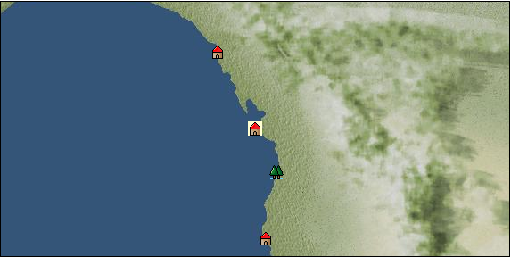

# Port: タコマ

import Tabs from '@theme/Tabs';
import TabItem from '@theme/TabItem';

## General Information

| Attribute | Details |
| :--- | :--- |
| **Port Name** | tacoma |
| **Port Type** | port of alliance |
| **Region** | west coast of north america |
| **Sea Area** | off the coast of alexander |
| **Required Language** | North American languages |
| **Coordinates** | （10521，2603） |
| **Investment Reward** | [Lot (NO.5)](docs/Items/Consumables/Consumables-Treasure-Chests/item_3017.md) （必要投資額：500,000ドゥカード） |

### Available Facilities

| guild | intermediary | exchange | tool shop | workshop craftsman | Painter | sculptor | peddler |
| --- | --- | --- | --- | --- | --- | --- | --- |
|   |   | ○ | ○ |   |   |   |   |
| Shipyard Master | Lumbermaker | Sail-maker | weapon craftsman | master | TavernFemale | archive | salesperson |
| --- | --- | --- | --- | --- | --- | --- | --- |
|   |   |   |   | ○ |   |   |   |
| Shipwright | 銀行 | street worker | 王宮 | Trading post | church | suburbs | translator |
| --- | --- | --- | --- | --- | --- | --- | --- |
| ○ | ○ | ○ |   |   | ○ | ○ |   |

### Description
A city in western North America that flourishes as a port city. There is a vast forest in the eastern part of the city, and the lumber industry is thriving. Ore purchase order

<Tabs>
  <TabItem value="trade_goods_sales" label="Trade Goods Sales">

| item | group | purchase price | 同盟時 | remarks |
| --- | --- | --- | --- | --- |
| [ice wine](docs/Items/TradeGoods/TradeGoods-Alcohol/item_4659.md) | [交易品（酒類）](docs/Categories/category_9.md) | (1,177) | 1,030 |  |
| 時代限定（19世紀） |
| [pewter](docs/Items/TradeGoods/TradeGoods-Wares/item_4660.md) | [交易品（工業品）](docs/Categories/category_19.md) | (1,280) | 1,120 |  |
| 時代限定（19世紀） |
| [blueberry](docs/Items/TradeGoods/TradeGoods-Sunddries/item_4657.md) | [Trading goods (hobby goods)](docs/Categories/category_10.md) | (480) | 420 |  |
| 要投資（必要投資額：240,000） |
| [raspberry](docs/Items/TradeGoods/TradeGoods-Sunddries/item_4658.md) | [Trading goods (hobby goods)](docs/Categories/category_10.md) | (397) | 348 |  |
| 要投資（必要投資額：320,000） |
| [barley](docs/Items/TradeGoods/TradeGoods-Foodstuffs/item_124.md) | [Trading items (food items)](docs/Categories/category_3.md) | (36) | 32 |  |
| [wheat](docs/Items/TradeGoods/TradeGoods-Foodstuffs/item_16.md) | [Trading items (food items)](docs/Categories/category_3.md) | (45) | 40 |  |
| [wood](docs/Items/TradeGoods/TradeGoods-Wares/item_277.md) | [交易品（工業品）](docs/Categories/category_19.md) | (676) | 592 |  |
| [fur](docs/Items/TradeGoods/TradeGoods-Fibers/item_634.md) | [交易品（繊維）](docs/Categories/category_1.md) | (1,291) | 1,130 |  |
| 要投資（必要投資額：320,000） |
| [oil](docs/Items/TradeGoods/TradeGoods-Wares/item_613.md) | [交易品（工業品）](docs/Categories/category_19.md) | (580) | 508 |  |
| 要投資（必要投資額：500,000） |
  </TabItem>
  <TabItem value="sale_specialty" label="Sale (Specialty)">

| item | group | sale price | 同盟時 | remarks |
| --- | --- | --- | --- | --- |

#### [交易品（繊維）](docs/Categories/category_1.md)

| [Green ramie](docs/Items/TradeGoods/TradeGoods-Fibers/item_3428.md) | 交易品（繊維） | 12,182 | (13,706) |  |
| [deerskin](docs/Items/TradeGoods/TradeGoods-Fibers/item_3648.md) | 交易品（繊維） | 12,646 | (14,228) |  |

#### [交易品（雑貨）](docs/Categories/category_5.md)

| [lantern](docs/Items/TradeGoods/TradeGoods-Misc/item_3683.md) | 交易品（雑貨） | (2,691) | 3,140 |  |

#### [交易品（酒類）](docs/Categories/category_9.md)

| [aquavit](docs/Items/TradeGoods/TradeGoods-Alcohol/item_572.md) | 交易品（酒類） | (1,505) | 1,755 |  |
| [Taiwan rice wine](docs/Items/TradeGoods/TradeGoods-Alcohol/item_3672.md) | 交易品（酒類） | 12,150 | (13,670) |  |
| [Sake](docs/Items/TradeGoods/TradeGoods-Alcohol/item_3424.md) | 交易品（酒類） | 11,861 | (13,344) |  |

#### [Trading goods (hobby goods)](docs/Categories/category_10.md)

| [Aigyoku](docs/Items/TradeGoods/TradeGoods-Sunddries/item_3677.md) | Trading goods (hobby goods) | 11,803 | (13,279) |  |
| [cranberry](docs/Items/TradeGoods/TradeGoods-Sunddries/item_4008.md) | Trading goods (hobby goods) | (766) | 893 |  |
| [raspberry](docs/Items/TradeGoods/TradeGoods-Sunddries/item_5419.md) | Trading goods (hobby goods) | 2,957 | (3,326) |  |

#### [Trading goods (artificial goods)](docs/Categories/category_13.md)

| [Darla Hest](docs/Items/TradeGoods/TradeGoods-Luxuries/item_6190.md) | Trading goods (artificial goods) | (7,859) | 9,170 |  |
| [湖筆](docs/Items/TradeGoods/TradeGoods-Luxuries/item_3898.md) | Trading goods (artificial goods) | 3,234 | (3,638) |  |

#### [交易品（美術品）](docs/Categories/category_14.md)

| [taiwan wood carving](docs/Items/TradeGoods/TradeGoods-Art/item_3697.md) | 交易品（美術品） | 12,212 | (13,739) |  |
  </TabItem>
  <TabItem value="sale_no_specialty" label="Sale (No Specialty)">

| item | group | sale price | 同盟時 | remarks |
| --- | --- | --- | --- | --- |

#### [Trading items (food items)](docs/Categories/category_3.md)

| [european crayfish](docs/Items/TradeGoods/TradeGoods-Foodstuffs/item_6188.md) | Trading items (food items) | (5,434) | 6,340 |  |

#### [Trading products (medical products)](docs/Categories/category_6.md)

| [nettle](docs/Items/TradeGoods/TradeGoods-Medicine/item_6189.md) | Trading products (medical products) | (559) | 652 |  |

#### [交易品（酒類）](docs/Categories/category_9.md)

| [vodka](docs/Items/TradeGoods/TradeGoods-Alcohol/item_579.md) | 交易品（酒類） | (1,128) | 1,316 |  |

#### [交易品（美術品）](docs/Categories/category_14.md)

| [wooden statue](docs/Items/TradeGoods/TradeGoods-Art/item_95.md) | 交易品（美術品） | (1,009) | 1,177 |  |
| [stone statue](docs/Items/TradeGoods/TradeGoods-Art/item_899.md) | 交易品（美術品） | (1,475) | 1,721 |  |

#### [Trading Goods (Livestock)](docs/Categories/category_18.md)

| [rat](docs/Items/TradeGoods/TradeGoods-Livestock/item_2710.md) | Trading Goods (Livestock) | 18 | (20) |  |

#### [交易品（工業品）](docs/Categories/category_19.md)

| [coal](docs/Items/TradeGoods/TradeGoods-Wares/item_359.md) | 交易品（工業品） | (466) | 543 |  |
  </TabItem>
  <TabItem value="guild_&_others" label="Guild & Others">

| item | group | Sales price | Handling NPC | remarks |
| --- | --- | --- | --- | --- |
| There is no sales information for the item |
| --- |
  </TabItem>
  <TabItem value="toolman" label="Toolman">

| item | group | Sales price | Handling NPC | remarks |
| --- | --- | --- | --- | --- |

#### [recipe book](docs/Categories/category_22.md)

| [Mode Design Collection Volume 1](docs/Items/RecipeBooks/item_92.md) | recipe book | 10,000 | tool shop owner |  |
| [Sword training/application](docs/Items/RecipeBooks/item_589.md) | recipe book | 50,000 | tool shop owner |  |
| [Textile secrets/fabric book](docs/Items/RecipeBooks/item_91.md) | recipe book | 10,000 | tool shop owner |  |

#### [Equipment (body)](docs/Categories/category_24.md)

| [gunslinger's wear](docs/Items/Equipment/Equipment-Body/item_4689.md) | Equipment (body) | 76,000 | tool shop owner |  |
| 時代限定（19世紀） １９世紀限定 |
| [gunslingers vest](docs/Items/Equipment/Equipment-Body/item_4740.md) | Equipment (body) | 76,000 | tool shop owner |  |
| 時代限定（19世紀） 【時代固定】19世紀 |

#### [Equipment (legs)](docs/Categories/category_26.md)

| [work boots](docs/Items/Equipment/Equipment-Feet/item_4863.md) | Equipment (legs) | 8,000 | tool shop owner |  |
| 時代限定（19世紀） 19世紀限定 |

#### [Consumables (land battle/deck battle)](docs/Categories/category_29.md)

| [black kite feather](docs/Items/Consumables/Consumables-Landbattle/item_88.md) | Consumables (land battle/deck battle) | 100 | tool shop owner |  |
| [Assortment of wound medicine](docs/Items/Consumables/Consumables-Landbattle/item_90.md) | Consumables (land battle/deck battle) | 500 | tool shop owner |  |
| [therapeutic drug](docs/Items/Consumables/Consumables-Landbattle/item_89.md) | Consumables (land battle/deck battle) | 300 | tool shop owner |  |
| [antidote](docs/Items/Consumables/Consumables-Landbattle/item_270.md) | Consumables (land battle/deck battle) | 100 | tool shop owner |  |

#### [Consumables (other)](docs/Categories/category_44.md)

| [fossil fuel](docs/Items/Consumables/Consumables-Other/item_5425.md) | Consumables (other) | 100,000 | tool shop owner |  |

#### [Consumables (request documents)](docs/Categories/category_45.md)

| [Seasoning purchase order form](docs/Items/Consumables/Consumables-Documents/item_4777.md) | Consumables (request documents) | 20,000 | tool shop owner |  |
| [Ore purchase order](docs/Items/Consumables/Consumables-Documents/item_5461.md) | Consumables (request documents) | 60,000 | tool shop owner |  |
  </TabItem>
</Tabs>