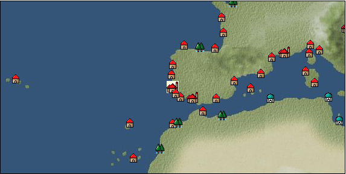

# Port: Lisbon

import Tabs from '@theme/Tabs';
import TabItem from '@theme/TabItem';

## General Information

| Attribute | Details |
| :--- | :--- |
| **Port Name** | Lisbon |
| **Port Type** | Headquarters |
| **Region** | Western Europe |
| **Sea Area** | off the coast of lisbon |
| **Required Language** | Portuguese |
| **Coordinates** | （15782，3205） |
| **Investment Reward** | [Collection of Western Mediterranean specialties](docs/Items/RecipeBooks/item_750.md) （Required Investment：1,000,000 Ducats） |

### Available Facilities

| guild | intermediary | exchange | tool shop | workshop craftsman | Painter | sculptor | peddler |
| --- | --- | --- | --- | --- | --- | --- | --- |
| ○ | ○ | ○ | ○ | ○ |   |   | ○ |
| Shipyard Master | Lumbermaker | Sail-maker | weapon craftsman | master | TavernFemale | archive | salesperson |
| --- | --- | --- | --- | --- | --- | --- | --- |
| ○ | ○ | ○ | ○ | ○ | ○ | ○ | ○ |
| Shipwright | 銀行 | street worker | 王宮 | Trading post | church | suburbs | translator |
| --- | --- | --- | --- | --- | --- | --- | --- |
| ○ | ○ |   | ○ | ○ | ○ |   | ○ |

### Description
An old city built by the Phoenicians. It developed greatly during the period when it was ruled by Islamic forces and flourished as an important port. It is said to be the most beautiful city in Western Europe. Good quality ceramics are manufactured. Tavern Girl: Christina (Help Girl: Carlota) Beginner Navigator Training School Cultural Area: Iberia Rich Merchant: Between the Trading Post Shop and the Church

<Tabs>
  <TabItem value="trade_goods_sales" label="Trade Goods Sales">

| Item | Group | Purchase Price | Allied Price | Remarks |
| --- | --- | --- | --- | --- |
| [almond](docs/Items/TradeGoods/TradeGoods-Sunddries/item_367.md) | [Trading goods (hobby goods)](docs/Categories/category_10.md) | 141 | 124 |  |
| [almond oil](docs/Items/TradeGoods/TradeGoods-Seasonings/item_578.md) | [交易品（調味料）](docs/Categories/category_4.md) | (512) | 448 |  |
| 要投資（必要投資額：120,000） |
| [chicken](docs/Items/TradeGoods/TradeGoods-Livestock/item_252.md) | [Trading Goods (Livestock)](docs/Categories/category_18.md) | 50 | 44 |  |
| [ham](docs/Items/TradeGoods/TradeGoods-Foodstuffs/item_290.md) | [Trading items (food items)](docs/Categories/category_3.md) | 429 | 376 |  |
| [brandy](docs/Items/TradeGoods/TradeGoods-Alcohol/item_9.md) | [交易品（酒類）](docs/Categories/category_9.md) | 749 | 656 |  |
| [Western books](docs/Items/TradeGoods/TradeGoods-Misc/item_293.md) | [交易品（雑貨）](docs/Categories/category_5.md) | 652 | 572 |  |
| [dagger](docs/Items/TradeGoods/TradeGoods-Weapons/item_143.md) | [Trading Items (Arms)](docs/Categories/category_16.md) | 868 | 764 |  |
| [cannonball](docs/Items/TradeGoods/TradeGoods-Firearms/item_144.md) | [Trading Items (Firearms)](docs/Categories/category_17.md) | 1,670 | 1,465 |  |
| [copper ore](docs/Items/TradeGoods/TradeGoods-Minerals/item_65.md) | [Trading Items (Iron Stone)](docs/Categories/category_7.md) | (790) | 692 |  |
| Investment required (Required investment amount: 600,000) Investment required for development level 60k or higher |
| [ceramics](docs/Items/TradeGoods/TradeGoods-Luxuries/item_152.md) | [Trading goods (artificial goods)](docs/Categories/category_13.md) | (1,440) | 1,260 |  |
| 要投資（必要投資額：24,000） |
  </TabItem>
  <TabItem value="sale_specialty" label="Sale (Specialty)">

| Item | Group | Purchase Price | Allied Price | Remarks |

| --- | --- | --- | --- | --- |

#### [交易品（繊維）](docs/Categories/category_1.md)

| [Rush](docs/Items/TradeGoods/TradeGoods-Fibers/item_3675.md) | 交易品（繊維） | 3,473 | (3,907) |  |
| [sisal hemp](docs/Items/TradeGoods/TradeGoods-Fibers/item_1766.md) | 交易品（繊維） | (315) | 367 |  |
| [Basho](docs/Items/TradeGoods/TradeGoods-Fibers/item_3862.md) | 交易品（繊維） | (26,520) | 30,944 |  |
| [flax](docs/Items/TradeGoods/TradeGoods-Fibers/item_64.md) | 交易品（繊維） | 279 | 288 |  |
| [feather](docs/Items/TradeGoods/TradeGoods-Fibers/item_585.md) | 交易品（繊維） | 700 | 795 |  |
| [tiger skin](docs/Items/TradeGoods/TradeGoods-Fibers/item_3790.md) | 交易品（繊維） | (22,460) | 26,207 |  |
| [Green ramie](docs/Items/TradeGoods/TradeGoods-Fibers/item_3428.md) | 交易品（繊維） | (24,168) | 28,200 |  |
| [deerskin](docs/Items/TradeGoods/TradeGoods-Fibers/item_3648.md) | 交易品（繊維） | (31,517) | 36,775 |  |

#### [Trading Goods (Dye)](docs/Categories/category_2.md)

| [Indian Akane](docs/Items/TradeGoods/TradeGoods-Dye/item_1037.md) | Trading Goods (Dye) | 1,199 | (1,349) |  |
| [Indian indigo](docs/Items/TradeGoods/TradeGoods-Dye/item_157.md) | Trading Goods (Dye) | 1,128 | (1,269) |  |
| [cochineal](docs/Items/TradeGoods/TradeGoods-Dye/item_1817.md) | Trading Goods (Dye) | (1,492) | 1,740 |  |
| [Shorou](docs/Items/TradeGoods/TradeGoods-Dye/item_3691.md) | Trading Goods (Dye) | (22,161) | 25,858 |  |
| [turmeric](docs/Items/TradeGoods/TradeGoods-Dye/item_1433.md) | Trading Goods (Dye) | (616) | 718 |  |
| [Safflower](docs/Items/TradeGoods/TradeGoods-Dye/item_1059.md) | Trading Goods (Dye) | 672 | (756) |  |
| [mangosteen](docs/Items/TradeGoods/TradeGoods-Dye/item_1973.md) | Trading Goods (Dye) | 2,110 | (2,373) |  |
| [mimosa](docs/Items/TradeGoods/TradeGoods-Dye/item_2281.md) | Trading Goods (Dye) | (1,248) | 1,456 |  |
| [gallnut](docs/Items/TradeGoods/TradeGoods-Dye/item_3429.md) | Trading Goods (Dye) | (25,477) | 29,728 |  |

#### [Trading items (food items)](docs/Categories/category_3.md)

| [buckwheat](docs/Items/TradeGoods/TradeGoods-Foodstuffs/item_3430.md) | Trading items (food items) | (23,911) | 27,900 |  |
| [Karasumi](docs/Items/TradeGoods/TradeGoods-Foodstuffs/item_3687.md) | Trading items (food items) | 32,531 | (36,600) |  |
| [kangaroo meat](docs/Items/TradeGoods/TradeGoods-Foodstuffs/item_2285.md) | Trading items (food items) | 813 | (914) |  |
| [Chinese noodles](docs/Items/TradeGoods/TradeGoods-Foodstuffs/item_3906.md) | Trading items (food items) | (23,139) | 27,000 |  |

#### [交易品（調味料）](docs/Categories/category_4.md)

| [oyster sauce](docs/Items/TradeGoods/TradeGoods-Seasonings/item_3505.md) | 交易品（調味料） | (2,691) | 3,140 |  |
| [tamarind](docs/Items/TradeGoods/TradeGoods-Seasonings/item_1968.md) | 交易品（調味料） | 2,014 | (2,265) |  |
| [Choshi](docs/Items/TradeGoods/TradeGoods-Seasonings/item_3793.md) | 交易品（調味料） | (22,486) | 26,237 |  |
| [miso](docs/Items/TradeGoods/TradeGoods-Seasonings/item_3420.md) | 交易品（調味料） | (3,664) | 4,275 |  |
| [Sha Cha Ji](docs/Items/TradeGoods/TradeGoods-Seasonings/item_3689.md) | 交易品（調味料） | 44,953 | (50,577) |  |
| [羅漢果](docs/Items/TradeGoods/TradeGoods-Seasonings/item_4004.md) | 交易品（調味料） | (9,350) | 10,910 |  |
| [Bean sauce](docs/Items/TradeGoods/TradeGoods-Seasonings/item_3875.md) | 交易品（調味料） | (31,728) | 37,022 |  |
| [soy sauce](docs/Items/TradeGoods/TradeGoods-Seasonings/item_3425.md) | 交易品（調味料） | (25,628) | 29,904 |  |
| [black vinegar](docs/Items/TradeGoods/TradeGoods-Seasonings/item_3475.md) | 交易品（調味料） | (4,353) | 5,079 |  |

#### [交易品（雑貨）](docs/Categories/category_5.md)

| [old ink stick](docs/Items/TradeGoods/TradeGoods-Misc/item_3921.md) | 交易品（雑貨） | (9,427) | 11,000 |  |
| [Japanese books](docs/Items/TradeGoods/TradeGoods-Misc/item_3439.md) | 交易品（雑貨） | 33,880 | (38,118) |  |
| [lantern](docs/Items/TradeGoods/TradeGoods-Misc/item_3683.md) | 交易品（雑貨） | (9,427) | 11,000 |  |
| [Korean books](docs/Items/TradeGoods/TradeGoods-Misc/item_3750.md) | 交易品（雑貨） | 32,789 | (36,891) |  |
| [rattan work](docs/Items/TradeGoods/TradeGoods-Misc/item_3698.md) | 交易品（雑貨） | 31,837 | (35,820) |  |

#### [Trading products (medical products)](docs/Categories/category_6.md)

| [chamomile](docs/Items/TradeGoods/TradeGoods-Medicine/item_292.md) | Trading products (medical products) | 513 | (577) |  |
| [Saikaku](docs/Items/TradeGoods/TradeGoods-Medicine/item_1959.md) | Trading products (medical products) | 4,330 | 4,610 |  |
| [tea tree](docs/Items/TradeGoods/TradeGoods-Medicine/item_2283.md) | Trading products (medical products) | (1,086) | 1,267 |  |
| [heath](docs/Items/TradeGoods/TradeGoods-Medicine/item_63.md) | Trading products (medical products) | (325) | 379 |  |
| [Borei](docs/Items/TradeGoods/TradeGoods-Medicine/item_3678.md) | Trading products (medical products) | 32,858 | (36,968) |  |
| [Nothing](docs/Items/TradeGoods/TradeGoods-Medicine/item_1053.md) | Trading products (medical products) | 769 | (865) |  |
| [Centennial grass](docs/Items/TradeGoods/TradeGoods-Medicine/item_5503.md) | Trading products (medical products) | (9,485) | 11,067 |  |
| [calamus](docs/Items/TradeGoods/TradeGoods-Medicine/item_3427.md) | Trading products (medical products) | (24,809) | 28,948 |  |

#### [Trading Items (Iron Stone)](docs/Categories/category_7.md)

| [Hokutolite](docs/Items/TradeGoods/TradeGoods-Minerals/item_3694.md) | Trading Items (Iron Stone) | 32,689 | (36,778) |  |
| [white porcelain ore](docs/Items/TradeGoods/TradeGoods-Minerals/item_3433.md) | Trading Items (Iron Stone) | (25,516) | 29,773 |  |

#### [Trading products (precious metals)](docs/Categories/category_8.md)

| [platinum](docs/Items/TradeGoods/TradeGoods-Metals/item_2178.md) | Trading products (precious metals) | (6,759) | 7,886 |  |
| [佐摩銀](docs/Items/TradeGoods/TradeGoods-Metals/item_3432.md) | Trading products (precious metals) | (33,209) | 38,750 |  |
| [雲南銀](docs/Items/TradeGoods/TradeGoods-Metals/item_3905.md) | Trading products (precious metals) | (25,828) | 30,137 |  |

#### [交易品（酒類）](docs/Categories/category_9.md)

| [aquavit](docs/Items/TradeGoods/TradeGoods-Alcohol/item_572.md) | 交易品（酒類） | 714 | 771 |  |
| [whiskey](docs/Items/TradeGoods/TradeGoods-Alcohol/item_1.md) | 交易品（酒類） | 815 | 915 |  |
| [gin](docs/Items/TradeGoods/TradeGoods-Alcohol/item_291.md) | 交易品（酒類） | 813 | 817 |  |
| [tequila](docs/Items/TradeGoods/TradeGoods-Alcohol/item_108.md) | 交易品（酒類） | (4,417) | 5,154 |  |
| [Taiwan rice wine](docs/Items/TradeGoods/TradeGoods-Alcohol/item_3672.md) | 交易品（酒類） | (22,854) | 26,667 |  |
| [Andong soju](docs/Items/TradeGoods/TradeGoods-Alcohol/item_3757.md) | 交易品（酒類） | (22,999) | 26,836 |  |
| [Sake](docs/Items/TradeGoods/TradeGoods-Alcohol/item_3424.md) | 交易品（酒類） | (25,282) | 29,500 |  |

#### [Trading goods (hobby goods)](docs/Categories/category_10.md)

| [Aigyoku](docs/Items/TradeGoods/TradeGoods-Sunddries/item_3677.md) | Trading goods (hobby goods) | (22,553) | 26,316 |  |
| [cacao](docs/Items/TradeGoods/TradeGoods-Sunddries/item_140.md) | Trading goods (hobby goods) | (1,252) | 1,460 |  |
| [cashew nuts](docs/Items/TradeGoods/TradeGoods-Sunddries/item_2120.md) | Trading goods (hobby goods) | (883) | 1,030 |  |
| [cranberry](docs/Items/TradeGoods/TradeGoods-Sunddries/item_4008.md) | Trading goods (hobby goods) | (952) | 1,110 |  |
| [tobacco](docs/Items/TradeGoods/TradeGoods-Sunddries/item_109.md) | Trading goods (hobby goods) | (4,825) | 5,630 |  |
| [chicle](docs/Items/TradeGoods/TradeGoods-Sunddries/item_4083.md) | Trading goods (hobby goods) | (1,583) | 1,846 |  |
| Home country 2310-130% |
| [durian](docs/Items/TradeGoods/TradeGoods-Sunddries/item_1949.md) | Trading goods (hobby goods) | 1,571 | (1,767) |  |
| [eggplant](docs/Items/TradeGoods/TradeGoods-Sunddries/item_3426.md) | Trading goods (hobby goods) | (24,111) | 28,134 |  |
| [banana](docs/Items/TradeGoods/TradeGoods-Sunddries/item_1947.md) | Trading goods (hobby goods) | 468 | 493 |  |
| [pineapple](docs/Items/TradeGoods/TradeGoods-Sunddries/item_867.md) | Trading goods (hobby goods) | (1,708) | 1,992 |  |
| [peanuts](docs/Items/TradeGoods/TradeGoods-Sunddries/item_134.md) | Trading goods (hobby goods) | (382) | 445 |  |
| [blueberry](docs/Items/TradeGoods/TradeGoods-Sunddries/item_4657.md) | Trading goods (hobby goods) | (1,072) | 1,250 |  |
| [macadamia nuts](docs/Items/TradeGoods/TradeGoods-Sunddries/item_2282.md) | Trading goods (hobby goods) | (1,025) | 1,195 |  |
| [raspberry](docs/Items/TradeGoods/TradeGoods-Sunddries/item_4658.md) | Trading goods (hobby goods) | (900) | 1,050 |  |
| [lemon myrtle](docs/Items/TradeGoods/TradeGoods-Sunddries/item_2840.md) | Trading goods (hobby goods) | 1,958 | (2,202) |  |
| [dried figs](docs/Items/TradeGoods/TradeGoods-Sunddries/item_611.md) | Trading goods (hobby goods) | 400 | (450) |  |
| [Korean tea](docs/Items/TradeGoods/TradeGoods-Sunddries/item_3751.md) | Trading goods (hobby goods) | (22,673) | 26,456 |  |
| [black tea](docs/Items/TradeGoods/TradeGoods-Sunddries/item_675.md) | Trading goods (hobby goods) | 2,241 | 5,530 |  |
| [raspberry](docs/Items/TradeGoods/TradeGoods-Sunddries/item_5419.md) | Trading goods (hobby goods) | (9,224) | 10,762 |  |
| [金針花](docs/Items/TradeGoods/TradeGoods-Sunddries/item_3739.md) | Trading goods (hobby goods) | 9,715 | (10,930) |  |

#### [Trading Goods (Spices)](docs/Categories/category_11.md)

| [orange oil](docs/Items/TradeGoods/TradeGoods-Perfume/item_778.md) | Trading Goods (Spices) | (1,096) | 1,278 |  |
| [oakmoss](docs/Items/TradeGoods/TradeGoods-Perfume/item_819.md) | Trading Goods (Spices) | (892) | 1,040 |  |
| ●Balkan specialties |
| [gardenia](docs/Items/TradeGoods/TradeGoods-Perfume/item_1091.md) | Trading Goods (Spices) | (21,854) | 25,500 |  |
| [jasmine](docs/Items/TradeGoods/TradeGoods-Perfume/item_772.md) | Trading Goods (Spices) | 5,307 | 6,270 |  |
| [daffodil](docs/Items/TradeGoods/TradeGoods-Perfume/item_612.md) | Trading Goods (Spices) | 973 | (1,094) |  |
| [lily of the valley](docs/Items/TradeGoods/TradeGoods-Perfume/item_358.md) | Trading Goods (Spices) | 1,372 | 1,343 |  |
| [geranium](docs/Items/TradeGoods/TradeGoods-Perfume/item_145.md) | Trading Goods (Spices) | 1,100 | 1,163 |  |
| [Hamanasu](docs/Items/TradeGoods/TradeGoods-Perfume/item_3692.md) | Trading Goods (Spices) | 31,200 | 35,850 |  |
| [patchouli](docs/Items/TradeGoods/TradeGoods-Perfume/item_1963.md) | Trading Goods (Spices) | (2,424) | 2,828 |  |
| [eucalyptus](docs/Items/TradeGoods/TradeGoods-Perfume/item_2278.md) | Trading Goods (Spices) | 869 | (977) |  |
| [mastic](docs/Items/TradeGoods/TradeGoods-Perfume/item_680.md) | Trading Goods (Spices) | (4,783) | 5,580 |  |
| [Tang Muxiang](docs/Items/TradeGoods/TradeGoods-Perfume/item_593.md) | Trading Goods (Spices) | (1,499) | 1,748 |  |
| [benzoin](docs/Items/TradeGoods/TradeGoods-Perfume/item_1962.md) | Trading Goods (Spices) | (1,454) | 1,696 |  |
| [sandalwood](docs/Items/TradeGoods/TradeGoods-Perfume/item_771.md) | Trading Goods (Spices) | (5,083) | 5,930 |  |
| [龍脳](docs/Items/TradeGoods/TradeGoods-Perfume/item_1676.md) | Trading Goods (Spices) | (2,332) | 2,720 |  |

#### [Trading Goods (Spices)](docs/Categories/category_12.md)

| [allspice](docs/Items/TradeGoods/TradeGoods-Spices/item_1848.md) | Trading Goods (Spices) | (3,634) | 4,240 |  |
| [cardamom](docs/Items/TradeGoods/TradeGoods-Spices/item_1431.md) | Trading Goods (Spices) | (4,857) | 5,667 |  |
| [garam masala](docs/Items/TradeGoods/TradeGoods-Spices/item_965.md) | Trading Goods (Spices) | 667 | (750) |  |
| [cloves](docs/Items/TradeGoods/TradeGoods-Spices/item_1092.md) | Trading Goods (Spices) | (19,556) | 22,819 |  |
| [Kouzuku](docs/Items/TradeGoods/TradeGoods-Spices/item_3690.md) | Trading Goods (Spices) | (23,367) | 27,265 |  |
| [pepper](docs/Items/TradeGoods/TradeGoods-Spices/item_58.md) | Trading Goods (Spices) | 12,844 | 14,424 |  |
| [Sanshou](docs/Items/TradeGoods/TradeGoods-Spices/item_3794.md) | Trading Goods (Spices) | (31,340) | 36,569 |  |
| [cinnamon](docs/Items/TradeGoods/TradeGoods-Spices/item_1432.md) | Trading Goods (Spices) | 4,914 | (5,528) |  |
| [nutmeg](docs/Items/TradeGoods/TradeGoods-Spices/item_1969.md) | Trading Goods (Spices) | (20,814) | 24,286 |  |
| [mace](docs/Items/TradeGoods/TradeGoods-Spices/item_2100.md) | Trading Goods (Spices) | (19,767) | 23,065 |  |
| [Laurier](docs/Items/TradeGoods/TradeGoods-Spices/item_615.md) | Trading Goods (Spices) | 169 | (190) |  |
| ●Balkan specialties |
| [chili pepper](docs/Items/TradeGoods/TradeGoods-Spices/item_1831.md) | Trading Goods (Spices) | (6,231) | 7,270 |  |
| [Grapefruit](docs/Items/TradeGoods/TradeGoods-Spices/item_3422.md) | Trading Goods (Spices) | (31,173) | 36,374 |  |
| [green chili pepper](docs/Items/TradeGoods/TradeGoods-Spices/item_1990.md) | Trading Goods (Spices) | (6,197) | 7,230 |  |

#### [Trading goods (artificial goods)](docs/Categories/category_13.md)

| [african wood carving](docs/Items/TradeGoods/TradeGoods-Luxuries/item_5558.md) | Trading goods (artificial goods) | (3,727) | 4,348 |  |
| [Darla Hest](docs/Items/TradeGoods/TradeGoods-Luxuries/item_6190.md) | Trading goods (artificial goods) | (3,617) | 4,220 |  |
| [Tumbaga](docs/Items/TradeGoods/TradeGoods-Luxuries/item_3028.md) | Trading goods (artificial goods) | 17,858 | 19,388 |  |
| [Kuresute](docs/Items/TradeGoods/TradeGoods-Luxuries/item_3897.md) | Trading goods (artificial goods) | (10,195) | 11,895 |  |
| [Song Baici](docs/Items/TradeGoods/TradeGoods-Luxuries/item_3904.md) | Trading goods (artificial goods) | (24,323) | 28,381 |  |
| [ethnic costume](docs/Items/TradeGoods/TradeGoods-Luxuries/item_4050.md) | Trading goods (artificial goods) | (4,440) | 5,180 |  |
| [lacquerware](docs/Items/TradeGoods/TradeGoods-Luxuries/item_3435.md) | Trading goods (artificial goods) | 36,100 | 42,180 |  |
| [Saori](docs/Items/TradeGoods/TradeGoods-Luxuries/item_3676.md) | Trading goods (artificial goods) | (36,893) | 43,048 |  |
| [Corner work](docs/Items/TradeGoods/TradeGoods-Luxuries/item_3696.md) | Trading goods (artificial goods) | 31,154 | (35,051) |  |

#### [交易品（美術品）](docs/Categories/category_14.md)

| [chinese calligraphy](docs/Items/TradeGoods/TradeGoods-Art/item_3926.md) | 交易品（美術品） | (24,862) | 29,010 |  |
| [taiwan wood carving](docs/Items/TradeGoods/TradeGoods-Art/item_3697.md) | 交易品（美術品） | (33,068) | 38,585 |  |
| [Japanese painting](docs/Items/TradeGoods/TradeGoods-Art/item_3436.md) | 交易品（美術品） | 34,900 | (39,266) |  |

#### [Trading Items (Gemstones)](docs/Categories/category_15.md)

| [Tortoiseshell](docs/Items/TradeGoods/TradeGoods-Gems/item_1980.md) | Trading Items (Gemstones) | (3,394) | 3,960 |  |
| [aventurine](docs/Items/TradeGoods/TradeGoods-Gems/item_678.md) | Trading Items (Gemstones) | 4,620 | (5,198) |  |
| [alexandrite](docs/Items/TradeGoods/TradeGoods-Gems/item_4429.md) | Trading Items (Gemstones) | 4,467 | (5,025) |  |
| [inca rose](docs/Items/TradeGoods/TradeGoods-Gems/item_3014.md) | Trading Items (Gemstones) | 18,208 | 19,057 |  |
| [opal](docs/Items/TradeGoods/TradeGoods-Gems/item_2006.md) | Trading Items (Gemstones) | 6,337 | (7,129) |  |
| [cat's eye](docs/Items/TradeGoods/TradeGoods-Gems/item_1047.md) | Trading Items (Gemstones) | 8,314 | (9,354) |  |
| [sapphire](docs/Items/TradeGoods/TradeGoods-Gems/item_676.md) | Trading Items (Gemstones) | 10,000 | (11,251) |  |
| [turquoise](docs/Items/TradeGoods/TradeGoods-Gems/item_1006.md) | Trading Items (Gemstones) | 3,109 | (3,497) |  |
| [diamond](docs/Items/TradeGoods/TradeGoods-Gems/item_449.md) | Trading Items (Gemstones) | 5,500 | 5,598 |  |
| [topaz](docs/Items/TradeGoods/TradeGoods-Gems/item_1097.md) | Trading Items (Gemstones) | (4,489) | 5,237 |  |
| [pink diamond](docs/Items/TradeGoods/TradeGoods-Gems/item_2874.md) | Trading Items (Gemstones) | (11,802) | 13,771 |  |
| [lapis lazuli](docs/Items/TradeGoods/TradeGoods-Gems/item_995.md) | Trading Items (Gemstones) | 5,250 | (5,906) |  |
| [ruby](docs/Items/TradeGoods/TradeGoods-Gems/item_773.md) | Trading Items (Gemstones) | 10,093 | 10,661 |  |
| [amber](docs/Items/TradeGoods/TradeGoods-Gems/item_618.md) | Trading Items (Gemstones) | 3,711 | (4,175) |  |
| [amethyst](docs/Items/TradeGoods/TradeGoods-Gems/item_3434.md) | Trading Items (Gemstones) | (27,185) | 31,721 |  |

#### [Trading Items (Arms)](docs/Categories/category_16.md)

| [Japanese bow](docs/Items/TradeGoods/TradeGoods-Weapons/item_3469.md) | Trading Items (Arms) | 11,347 | (12,766) |  |
| [Japanese sword](docs/Items/TradeGoods/TradeGoods-Weapons/item_3437.md) | Trading Items (Arms) | (33,285) | 38,838 |  |
| [japanese armor](docs/Items/TradeGoods/TradeGoods-Weapons/item_3590.md) | Trading Items (Arms) | 11,167 | (12,564) |  |
| [western armor](docs/Items/TradeGoods/TradeGoods-Weapons/item_6.md) | Trading Items (Arms) | 3,179 | (3,576) |  |

#### [Trading Items (Firearms)](docs/Categories/category_17.md)

| [tanegashima gun](docs/Items/TradeGoods/TradeGoods-Firearms/item_3423.md) | Trading Items (Firearms) | 33,261 | 38,696 |  |
| [銅手銃](docs/Items/TradeGoods/TradeGoods-Firearms/item_3700.md) | Trading Items (Firearms) | 31,355 | (35,277) |  |

#### [Trading Goods (Livestock)](docs/Categories/category_18.md)

| [boar](docs/Items/TradeGoods/TradeGoods-Livestock/item_3476.md) | Trading Goods (Livestock) | (23,482) | 27,400 |  |
| [donkey](docs/Items/TradeGoods/TradeGoods-Livestock/item_3924.md) | Trading Goods (Livestock) | (1,722) | 2,009 |  |

#### [交易品（工業品）](docs/Categories/category_19.md)

| [rubber](docs/Items/TradeGoods/TradeGoods-Wares/item_2819.md) | 交易品（工業品） | 1,439 | (1,619) |  |
| [papyrus](docs/Items/TradeGoods/TradeGoods-Wares/item_616.md) | 交易品（工業品） | 534 | (600) |  |
| [Japanese paper](docs/Items/TradeGoods/TradeGoods-Wares/item_3438.md) | 交易品（工業品） | (24,768) | 28,900 |  |
| [marble](docs/Items/TradeGoods/TradeGoods-Wares/item_52.md) | 交易品（工業品） | (1,372) | 1,600 |  |
| [paint](docs/Items/TradeGoods/TradeGoods-Wares/item_3411.md) | 交易品（工業品） | (2,601) | 3,035 |  |
| [rattan](docs/Items/TradeGoods/TradeGoods-Wares/item_3701.md) | 交易品（工業品） | 31,400 | (35,328) |  |
| [羊皮紙](docs/Items/TradeGoods/TradeGoods-Wares/item_53.md) | 交易品（工業品） | (1,209) | 1,410 |  |

#### [交易品（織物）](docs/Categories/category_20.md)

| [Awaiyo](docs/Items/TradeGoods/TradeGoods-Fabrics/item_3002.md) | 交易品（織物） | 8,484 | 8,991 |  |
| [indian chintz](docs/Items/TradeGoods/TradeGoods-Fabrics/item_159.md) | 交易品（織物） | 2,389 | 3,942 |  |
| [dutch calico](docs/Items/TradeGoods/TradeGoods-Fabrics/item_1435.md) | 交易品（織物） | 1,382 | (1,554) |  |
| [java chintz](docs/Items/TradeGoods/TradeGoods-Fabrics/item_1970.md) | 交易品（織物） | 3,273 | 3,708 |  |
| [taffeta](docs/Items/TradeGoods/TradeGoods-Fabrics/item_1001.md) | 交易品（織物） | (4,468) | 5,213 |  |
| [damask](docs/Items/TradeGoods/TradeGoods-Fabrics/item_614.md) | 交易品（織物） | (4,272) | 4,984 |  |
| [turkish rug](docs/Items/TradeGoods/TradeGoods-Fabrics/item_686.md) | 交易品（織物） | (4,783) | 5,580 |  |
| [flannel](docs/Items/TradeGoods/TradeGoods-Fabrics/item_149.md) | 交易品（織物） | 1,534 | 1,577 |  |
| [persian rug](docs/Items/TradeGoods/TradeGoods-Fabrics/item_606.md) | 交易品（織物） | (8,331) | 9,720 |  |
| [China Duantong](docs/Items/TradeGoods/TradeGoods-Fabrics/item_3478.md) | 交易品（織物） | 17,500 | (19,689) |  |
| [唐錦](docs/Items/TradeGoods/TradeGoods-Fabrics/item_3896.md) | 交易品（織物） | 26,100 | (29,365) |  |
| [明紬](docs/Items/TradeGoods/TradeGoods-Fabrics/item_3753.md) | 交易品（織物） | (24,568) | 28,667 |  |
| [Bingata](docs/Items/TradeGoods/TradeGoods-Fabrics/item_3479.md) | 交易品（織物） | 18,847 | (21,204) |  |
| [Nishijin textile](docs/Items/TradeGoods/TradeGoods-Fabrics/item_3431.md) | 交易品（織物） | (27,388) | 31,957 |  |
| [麻織物](docs/Items/TradeGoods/TradeGoods-Fabrics/item_3673.md) | 交易品（織物） | (31,326) | 36,552 |  |
  </TabItem>
  <TabItem value="sale_no_specialty" label="Sale (No Specialty)">

| Item | Group | sale price | Allied Price | Remarks |
| --- | --- | --- | --- | --- |

#### [交易品（繊維）](docs/Categories/category_1.md)

| [coconut fiber](docs/Items/TradeGoods/TradeGoods-Fibers/item_444.md) | 交易品（繊維） | (182) | 212 |  |
| [camel hair](docs/Items/TradeGoods/TradeGoods-Fibers/item_577.md) | 交易品（繊維） | 484 | (544) |  |
| [fur](docs/Items/TradeGoods/TradeGoods-Fibers/item_634.md) | 交易品（繊維） | 2,161 | 2,337 |  |
| [raw silk](docs/Items/TradeGoods/TradeGoods-Fibers/item_677.md) | 交易品（繊維） | (2,267) | 2,645 |  |
| [leather](docs/Items/TradeGoods/TradeGoods-Fibers/item_44.md) | 交易品（繊維） | 571 | 502 |  |
| [cotton](docs/Items/TradeGoods/TradeGoods-Fibers/item_610.md) | 交易品（繊維） | 585 | (658) |  |
| [wool](docs/Items/TradeGoods/TradeGoods-Fibers/item_5.md) | 交易品（繊維） | (392) | 457 |  |
| [numb](docs/Items/TradeGoods/TradeGoods-Fibers/item_900.md) | 交易品（繊維） | 12 | (13) |  |

#### [Trading Goods (Dye)](docs/Categories/category_2.md)

| [ward](docs/Items/TradeGoods/TradeGoods-Dye/item_57.md) | Trading Goods (Dye) | 1,100 | (1,237) |  |
| [persian berry](docs/Items/TradeGoods/TradeGoods-Dye/item_693.md) | Trading Goods (Dye) | 1,388 | (1,561) |  |
| [Grass](docs/Items/TradeGoods/TradeGoods-Dye/item_906.md) | Trading Goods (Dye) | 4 | (4) |  |
| [貝紫](docs/Items/TradeGoods/TradeGoods-Dye/item_110.md) | Trading Goods (Dye) | 4,257 | (4,789) |  |

#### [Trading items (food items)](docs/Categories/category_3.md)

| [fava beans](docs/Items/TradeGoods/TradeGoods-Foodstuffs/item_102.md) | Trading items (food items) | 113 | 122 |  |
| [duck meat](docs/Items/TradeGoods/TradeGoods-Foodstuffs/item_32.md) | Trading items (food items) | 445 | 466 |  |
| [Black-spotted trout](docs/Items/TradeGoods/TradeGoods-Foodstuffs/item_953.md) | Trading items (food items) | (138) | 160 |  |
| [olive](docs/Items/TradeGoods/TradeGoods-Foodstuffs/item_47.md) | Trading items (food items) | 292 | (328) |  |
| [Bonito](docs/Items/TradeGoods/TradeGoods-Foodstuffs/item_764.md) | Trading items (food items) | (172) | 200 |  |
| [Japanese Spanish mackerel](docs/Items/TradeGoods/TradeGoods-Foodstuffs/item_1539.md) | Trading items (food items) | (343) | 400 |  |
| [Quinoa](docs/Items/TradeGoods/TradeGoods-Foodstuffs/item_2994.md) | Trading items (food items) | 357 | (401) |  |
| [sugar cane](docs/Items/TradeGoods/TradeGoods-Foodstuffs/item_93.md) | Trading items (food items) | (204) | 238 |  |
| [mackerel](docs/Items/TradeGoods/TradeGoods-Foodstuffs/item_97.md) | Trading items (food items) | (42) | 48 |  |
| [Spanish mackerel](docs/Items/TradeGoods/TradeGoods-Foodstuffs/item_2187.md) | Trading items (food items) | (343) | 400 |  |
| [potato](docs/Items/TradeGoods/TradeGoods-Foodstuffs/item_106.md) | Trading items (food items) | (338) | 394 |  |
| [Jambu](docs/Items/TradeGoods/TradeGoods-Foodstuffs/item_1827.md) | Trading items (food items) | 211 | (237) |  |
| [Souda bonito](docs/Items/TradeGoods/TradeGoods-Foodstuffs/item_775.md) | Trading items (food items) | (42) | 48 |  |
| [sausage](docs/Items/TradeGoods/TradeGoods-Foodstuffs/item_27.md) | Trading items (food items) | 403 | (453) |  |
| [onion](docs/Items/TradeGoods/TradeGoods-Foodstuffs/item_28.md) | Trading items (food items) | 110 | (123) |  |
| [cheese](docs/Items/TradeGoods/TradeGoods-Foodstuffs/item_20.md) | Trading items (food items) | 399 | 410 |  |
| [corn](docs/Items/TradeGoods/TradeGoods-Foodstuffs/item_138.md) | Trading items (food items) | 211 | (237) |  |
| [carrot](docs/Items/TradeGoods/TradeGoods-Foodstuffs/item_2708.md) | Trading items (food items) | 108 | (121) |  |
| [grouper](docs/Items/TradeGoods/TradeGoods-Foodstuffs/item_1541.md) | Trading items (food items) | (172) | 200 |  |
| [bacon](docs/Items/TradeGoods/TradeGoods-Foodstuffs/item_566.md) | Trading items (food items) | 395 | (444) |  |
| [great white shark](docs/Items/TradeGoods/TradeGoods-Foodstuffs/item_967.md) | Trading items (food items) | (631) | 736 |  |
| [Tuna](docs/Items/TradeGoods/TradeGoods-Foodstuffs/item_765.md) | Trading items (food items) | (1,115) | 1,300 |  |
| [sunfish](docs/Items/TradeGoods/TradeGoods-Foodstuffs/item_878.md) | Trading items (food items) | (3,428) | 4,000 |  |
| [lamprey](docs/Items/TradeGoods/TradeGoods-Foodstuffs/item_6167.md) | Trading items (food items) | (186) | 216 |  |
| [european crayfish](docs/Items/TradeGoods/TradeGoods-Foodstuffs/item_6188.md) | Trading items (food items) | (4,183) | 4,880 |  |
| [rye](docs/Items/TradeGoods/TradeGoods-Foodstuffs/item_61.md) | Trading items (food items) | (55) | 64 |  |
| [crocodile meat](docs/Items/TradeGoods/TradeGoods-Foodstuffs/item_2284.md) | Trading items (food items) | (619) | 722 |  |
| [milk](docs/Items/TradeGoods/TradeGoods-Foodstuffs/item_254.md) | Trading items (food items) | 148 | (166) |  |
| [egg](docs/Items/TradeGoods/TradeGoods-Foodstuffs/item_40.md) | Trading items (food items) | 34 | (38) |  |
| [barley](docs/Items/TradeGoods/TradeGoods-Foodstuffs/item_124.md) | Trading items (food items) | 77 | (86) |  |
| [Red bean](docs/Items/TradeGoods/TradeGoods-Foodstuffs/item_3419.md) | Trading items (food items) | (264) | 308 |  |
| When in alliance: confirmed at 100% |
| [wheat](docs/Items/TradeGoods/TradeGoods-Foodstuffs/item_16.md) | Trading items (food items) | 61 | 65 |  |
| [flour](docs/Items/TradeGoods/TradeGoods-Foodstuffs/item_605.md) | Trading items (food items) | (48) | 56 |  |
| [nuts](docs/Items/TradeGoods/TradeGoods-Foodstuffs/item_851.md) | Trading items (food items) | (11) | 12 |  |
| [beef](docs/Items/TradeGoods/TradeGoods-Foodstuffs/item_26.md) | Trading items (food items) | 575 | 659 |  |
| [mutton](docs/Items/TradeGoods/TradeGoods-Foodstuffs/item_33.md) | Trading items (food items) | (414) | 483 |  |
| [pork](docs/Items/TradeGoods/TradeGoods-Foodstuffs/item_41.md) | Trading items (food items) | 327 | 362 |  |
| [red bean](docs/Items/TradeGoods/TradeGoods-Foodstuffs/item_123.md) | Trading items (food items) | 133 | (149) |  |
| [taro](docs/Items/TradeGoods/TradeGoods-Foodstuffs/item_3421.md) | Trading items (food items) | 302 | (339) |  |
| [陸稲](docs/Items/TradeGoods/TradeGoods-Foodstuffs/item_100.md) | Trading items (food items) | 98 | (110) |  |
| [餡](docs/Items/TradeGoods/TradeGoods-Foodstuffs/item_3474.md) | Trading items (food items) | (1,286) | 1,500 |  |
| When in alliance: confirmed at 100% |
| [魚肉](docs/Items/TradeGoods/TradeGoods-Foodstuffs/item_10.md) | Trading items (food items) | (156) | 182 |  |
| [chicken meat](docs/Items/TradeGoods/TradeGoods-Foodstuffs/item_29.md) | Trading items (food items) | 330 | 377 |  |

#### [交易品（調味料）](docs/Categories/category_4.md)

| [anchovies](docs/Items/TradeGoods/TradeGoods-Seasonings/item_3004.md) | 交易品（調味料） | 288 | (324) |  |
| [olive oil](docs/Items/TradeGoods/TradeGoods-Seasonings/item_48.md) | 交易品（調味料） | (350) | 408 |  |
| [coconut vinegar](docs/Items/TradeGoods/TradeGoods-Seasonings/item_1988.md) | 交易品（調味料） | 518 | (582) |  |
| [butter](docs/Items/TradeGoods/TradeGoods-Seasonings/item_3.md) | 交易品（調味料） | (341) | 397 |  |
| [white vinegar](docs/Items/TradeGoods/TradeGoods-Seasonings/item_56.md) | 交易品（調味料） | (156) | 182 |  |
| [lard](docs/Items/TradeGoods/TradeGoods-Seasonings/item_43.md) | 交易品（調味料） | 301 | (338) |  |
| [apple cider vinegar](docs/Items/TradeGoods/TradeGoods-Seasonings/item_882.md) | 交易品（調味料） | 428 | (481) |  |
| [wine vinegar](docs/Items/TradeGoods/TradeGoods-Seasonings/item_429.md) | 交易品（調味料） | (497) | 579 |  |
| [salt](docs/Items/TradeGoods/TradeGoods-Seasonings/item_42.md) | 交易品（調味料） | 258 | 267 |  |
| [sugar](docs/Items/TradeGoods/TradeGoods-Seasonings/item_94.md) | 交易品（調味料） | 871 | 932 |  |
| [Honey](docs/Items/TradeGoods/TradeGoods-Seasonings/item_49.md) | 交易品（調味料） | 1,014 | (1,140) |  |

#### [Trading products (medical products)](docs/Categories/category_6.md)

| [nettle](docs/Items/TradeGoods/TradeGoods-Medicine/item_6189.md) | Trading products (medical products) | (632) | 737 |  |
| [cinchona bark](docs/Items/TradeGoods/TradeGoods-Medicine/item_2121.md) | Trading products (medical products) | 940 | (1,057) |  |
| [Kyonin](docs/Items/TradeGoods/TradeGoods-Medicine/item_964.md) | Trading products (medical products) | (474) | 552 |  |
| [senna](docs/Items/TradeGoods/TradeGoods-Medicine/item_155.md) | Trading products (medical products) | (425) | 495 |  |
| [belladonna](docs/Items/TradeGoods/TradeGoods-Medicine/item_1056.md) | Trading products (medical products) | 537 | (604) |  |
| [Maca](docs/Items/TradeGoods/TradeGoods-Medicine/item_3000.md) | Trading products (medical products) | (1,827) | 2,131 |  |
| [rose hips](docs/Items/TradeGoods/TradeGoods-Medicine/item_904.md) | Trading products (medical products) | (403) | 470 |  |
| [mercury agent](docs/Items/TradeGoods/TradeGoods-Medicine/item_703.md) | Trading products (medical products) | 1,400 | (1,575) |  |

#### [Trading Items (Iron Stone)](docs/Categories/category_7.md)

| [tin ore](docs/Items/TradeGoods/TradeGoods-Minerals/item_23.md) | Trading Items (Iron Stone) | 557 | (626) |  |
| [cinnabar](docs/Items/TradeGoods/TradeGoods-Minerals/item_154.md) | Trading Items (Iron Stone) | (811) | 946 |  |
| [iron ore](docs/Items/TradeGoods/TradeGoods-Minerals/item_146.md) | Trading Items (Iron Stone) | 754 | 784 |  |
| [lead ore](docs/Items/TradeGoods/TradeGoods-Minerals/item_21.md) | Trading Items (Iron Stone) | (438) | 510 |  |
| [copper ore](docs/Items/TradeGoods/TradeGoods-Minerals/item_65.md) | Trading Items (Iron Stone) | 364 | (409) |  |
| Investment required (Required investment amount: 600,000) Investment required for development level 60k or higher |

#### [Trading products (precious metals)](docs/Categories/category_8.md)

| [gold dust](docs/Items/TradeGoods/TradeGoods-Metals/item_111.md) | Trading products (precious metals) | 4,567 | (5,138) |  |
| [gold](docs/Items/TradeGoods/TradeGoods-Metals/item_659.md) | Trading products (precious metals) | 8,317 | 8,664 |  |
| [silver](docs/Items/TradeGoods/TradeGoods-Metals/item_136.md) | Trading products (precious metals) | 3,093 | (3,479) |  |

#### [交易品（酒類）](docs/Categories/category_9.md)

| [vodka](docs/Items/TradeGoods/TradeGoods-Alcohol/item_579.md) | 交易品（酒類） | (630) | 734 |  |
| [sherry](docs/Items/TradeGoods/TradeGoods-Alcohol/item_844.md) | 交易品（酒類） | (389) | 453 |  |
| [Beer](docs/Items/TradeGoods/TradeGoods-Alcohol/item_2.md) | 交易品（酒類） | 374 | 383 |  |
| [fruit brandy](docs/Items/TradeGoods/TradeGoods-Alcohol/item_1440.md) | 交易品（酒類） | 628 | 659 |  |
| [brandy](docs/Items/TradeGoods/TradeGoods-Alcohol/item_9.md) | 交易品（酒類） | (282) | 328 |  |
| [palm wine](docs/Items/TradeGoods/TradeGoods-Alcohol/item_436.md) | 交易品（酒類） | 454 | 482 |  |
| [rum](docs/Items/TradeGoods/TradeGoods-Alcohol/item_139.md) | 交易品（酒類） | (642) | 749 |  |
| [liqueur](docs/Items/TradeGoods/TradeGoods-Alcohol/item_18.md) | 交易品（酒類） | 643 | (723) |  |
| [wine](docs/Items/TradeGoods/TradeGoods-Alcohol/item_11.md) | 交易品（酒類） | 510 | 519 |  |
| [Shochu](docs/Items/TradeGoods/TradeGoods-Alcohol/item_3449.md) | 交易品（酒類） | (6,222) | 7,260 |  |

#### [Trading goods (hobby goods)](docs/Categories/category_10.md)

| [coconut](docs/Items/TradeGoods/TradeGoods-Sunddries/item_96.md) | Trading goods (hobby goods) | (334) | 389 |  |
| [coffee](docs/Items/TradeGoods/TradeGoods-Sunddries/item_445.md) | Trading goods (hobby goods) | (451) | 526 |  |
| [pickles](docs/Items/TradeGoods/TradeGoods-Sunddries/item_535.md) | Trading goods (hobby goods) | (281) | 327 |  |
| [prune](docs/Items/TradeGoods/TradeGoods-Sunddries/item_523.md) | Trading goods (hobby goods) | 420 | (472) |  |
| [hazelnut](docs/Items/TradeGoods/TradeGoods-Sunddries/item_125.md) | Trading goods (hobby goods) | 484 | 484 |  |
| [Yerba mate tea](docs/Items/TradeGoods/TradeGoods-Sunddries/item_1808.md) | Trading goods (hobby goods) | 411 | (462) |  |
| [dried strawberries](docs/Items/TradeGoods/TradeGoods-Sunddries/item_36.md) | Trading goods (hobby goods) | 428 | (481) |  |
| [raisins](docs/Items/TradeGoods/TradeGoods-Sunddries/item_35.md) | Trading goods (hobby goods) | (276) | 321 |  |
| [dried apple](docs/Items/TradeGoods/TradeGoods-Sunddries/item_19.md) | Trading goods (hobby goods) | 372 | 372 |  |

#### [Trading Goods (Spices)](docs/Categories/category_11.md)

| [cedar wood](docs/Items/TradeGoods/TradeGoods-Perfume/item_905.md) | Trading Goods (Spices) | (452) | 527 |  |
| [lavender](docs/Items/TradeGoods/TradeGoods-Perfume/item_150.md) | Trading Goods (Spices) | 989 | 1,028 |  |
| [lira](docs/Items/TradeGoods/TradeGoods-Perfume/item_30.md) | Trading Goods (Spices) | 773 | 783 |  |
| [lemon oil](docs/Items/TradeGoods/TradeGoods-Perfume/item_151.md) | Trading Goods (Spices) | 533 | (599) |  |
| [rose](docs/Items/TradeGoods/TradeGoods-Perfume/item_536.md) | Trading Goods (Spices) | 2,701 | 2,701 |  |
| [Fragrance under the moon](docs/Items/TradeGoods/TradeGoods-Perfume/item_1057.md) | Trading Goods (Spices) | (1,128) | 1,316 |  |
| [agarwood](docs/Items/TradeGoods/TradeGoods-Perfume/item_1058.md) | Trading Goods (Spices) | (2,143) | 2,500 |  |
| [Ryushu incense](docs/Items/TradeGoods/TradeGoods-Perfume/item_101.md) | Trading Goods (Spices) | 3,963 | (4,458) |  |
| [fragrant wood](docs/Items/TradeGoods/TradeGoods-Perfume/item_1094.md) | Trading Goods (Spices) | (79) | 92 |  |
| [Musk](docs/Items/TradeGoods/TradeGoods-Perfume/item_158.md) | Trading Goods (Spices) | 4,496 | 4,776 |  |

#### [Trading Goods (Spices)](docs/Categories/category_12.md)

| [oregano](docs/Items/TradeGoods/TradeGoods-Spices/item_430.md) | Trading Goods (Spices) | (454) | 529 |  |
| [garlic](docs/Items/TradeGoods/TradeGoods-Spices/item_526.md) | Trading Goods (Spices) | 325 | 335 |  |
| [cumin](docs/Items/TradeGoods/TradeGoods-Spices/item_156.md) | Trading Goods (Spices) | 1,072 | 1,090 |  |
| [coriander](docs/Items/TradeGoods/TradeGoods-Spices/item_1044.md) | Trading Goods (Spices) | 393 | (442) |  |
| [Sesame](docs/Items/TradeGoods/TradeGoods-Spices/item_437.md) | Trading Goods (Spices) | 333 | (374) |  |
| [ginger](docs/Items/TradeGoods/TradeGoods-Spices/item_112.md) | Trading Goods (Spices) | (1,758) | 2,051 |  |
| [celery](docs/Items/TradeGoods/TradeGoods-Spices/item_431.md) | Trading Goods (Spices) | 141 | (158) |  |
| [time](docs/Items/TradeGoods/TradeGoods-Spices/item_432.md) | Trading Goods (Spices) | 394 | (443) |  |
| [dill](docs/Items/TradeGoods/TradeGoods-Spices/item_1093.md) | Trading Goods (Spices) | (204) | 237 |  |
| [basil](docs/Items/TradeGoods/TradeGoods-Spices/item_126.md) | Trading Goods (Spices) | 171 | 179 |  |
| [parsley](docs/Items/TradeGoods/TradeGoods-Spices/item_46.md) | Trading Goods (Spices) | 151 | 154 |  |
| [fennel](docs/Items/TradeGoods/TradeGoods-Spices/item_1045.md) | Trading Goods (Spices) | 293 | (329) |  |
| [mint](docs/Items/TradeGoods/TradeGoods-Spices/item_816.md) | Trading Goods (Spices) | 169 | 185 |  |
| [rosemary](docs/Items/TradeGoods/TradeGoods-Spices/item_428.md) | Trading Goods (Spices) | 385 | 395 |  |

#### [Trading goods (artificial goods)](docs/Categories/category_13.md)

| [embroidery thread](docs/Items/TradeGoods/TradeGoods-Luxuries/item_898.md) | Trading goods (artificial goods) | (1,960) | 2,286 |  |
| [glasswork](docs/Items/TradeGoods/TradeGoods-Luxuries/item_60.md) | Trading goods (artificial goods) | 1,651 | (1,857) |  |
| [dragonfly ball](docs/Items/TradeGoods/TradeGoods-Luxuries/item_294.md) | Trading goods (artificial goods) | 1,200 | (1,350) |  |
| [lapidary work](docs/Items/TradeGoods/TradeGoods-Luxuries/item_153.md) | Trading goods (artificial goods) | 4,256 | (4,788) |  |
| [皮革製品](docs/Items/TradeGoods/TradeGoods-Luxuries/item_12.md) | Trading goods (artificial goods) | 1,164 | 1,185 |  |
| [Ivory work](docs/Items/TradeGoods/TradeGoods-Luxuries/item_1090.md) | Trading goods (artificial goods) | 2,926 | (3,292) |  |
| [goldsmith](docs/Items/TradeGoods/TradeGoods-Luxuries/item_687.md) | Trading goods (artificial goods) | 3,270 | (3,679) |  |
| [silversmith](docs/Items/TradeGoods/TradeGoods-Luxuries/item_619.md) | Trading goods (artificial goods) | 3,220 | (3,622) |  |
| [luxury clothing](docs/Items/TradeGoods/TradeGoods-Luxuries/item_165.md) | Trading goods (artificial goods) | 4,204 | (4,729) |  |

#### [交易品（美術品）](docs/Categories/category_14.md)

| [古美術品](docs/Items/TradeGoods/TradeGoods-Art/item_51.md) | 交易品（美術品） | 3,608 | (4,059) |  |
| [wooden statue](docs/Items/TradeGoods/TradeGoods-Art/item_95.md) | 交易品（美術品） | (1,104) | 1,288 |  |
| [stone statue](docs/Items/TradeGoods/TradeGoods-Art/item_899.md) | 交易品（美術品） | (1,558) | 1,817 |  |
| [copperplate print](docs/Items/TradeGoods/TradeGoods-Art/item_1087.md) | 交易品（美術品） | 833 | (937) |  |
| [青銅像](docs/Items/TradeGoods/TradeGoods-Art/item_148.md) | 交易品（美術品） | 1,137 | (1,279) |  |

#### [Trading Items (Gemstones)](docs/Categories/category_15.md)

| [Agate](docs/Items/TradeGoods/TradeGoods-Gems/item_107.md) | Trading Items (Gemstones) | 4,911 | 5,410 |  |
| [emerald](docs/Items/TradeGoods/TradeGoods-Gems/item_777.md) | Trading Items (Gemstones) | 6,776 | 6,957 |  |
| [garnet](docs/Items/TradeGoods/TradeGoods-Gems/item_1005.md) | Trading Items (Gemstones) | (3,631) | 4,236 |  |
| [coral](docs/Items/TradeGoods/TradeGoods-Gems/item_141.md) | Trading Items (Gemstones) | (2,512) | 2,930 |  |
| [nephrite](docs/Items/TradeGoods/TradeGoods-Gems/item_2314.md) | Trading Items (Gemstones) | 2,399 | (2,699) |  |
| [peridot](docs/Items/TradeGoods/TradeGoods-Gems/item_1098.md) | Trading Items (Gemstones) | (2,406) | 2,807 |  |
| [malachite](docs/Items/TradeGoods/TradeGoods-Gems/item_679.md) | Trading Items (Gemstones) | 2,063 | (2,321) |  |
| [crystal](docs/Items/TradeGoods/TradeGoods-Gems/item_893.md) | Trading Items (Gemstones) | (1,456) | 1,698 |  |
| [pearl](docs/Items/TradeGoods/TradeGoods-Gems/item_769.md) | Trading Items (Gemstones) | 8,447 | 8,920 |  |
| [ivory](docs/Items/TradeGoods/TradeGoods-Gems/item_699.md) | Trading Items (Gemstones) | 2,430 | (2,734) |  |

#### [Trading Items (Arms)](docs/Categories/category_16.md)

| [crossbow](docs/Items/TradeGoods/TradeGoods-Weapons/item_537.md) | Trading Items (Arms) | 1,050 | 1,070 |  |
| [scimitar](docs/Items/TradeGoods/TradeGoods-Weapons/item_142.md) | Trading Items (Arms) | 1,071 | (1,204) |  |
| [one handed sword](docs/Items/TradeGoods/TradeGoods-Weapons/item_433.md) | Trading Items (Arms) | 1,060 | (1,192) |  |
| [長弓](docs/Items/TradeGoods/TradeGoods-Weapons/item_1049.md) | Trading Items (Arms) | 800 | (900) |  |

#### [Trading Items (Firearms)](docs/Categories/category_17.md)

| [arquebus gun](docs/Items/TradeGoods/TradeGoods-Firearms/item_14.md) | Trading Items (Firearms) | 1,798 | (2,022) |  |
| [musket gun](docs/Items/TradeGoods/TradeGoods-Firearms/item_584.md) | Trading Items (Firearms) | 2,349 | (2,642) |  |
| [大砲](docs/Items/TradeGoods/TradeGoods-Firearms/item_4.md) | Trading Items (Firearms) | 3,090 | (3,476) |  |
| [bullet](docs/Items/TradeGoods/TradeGoods-Firearms/item_13.md) | Trading Items (Firearms) | 868 | (976) |  |

#### [Trading Goods (Livestock)](docs/Categories/category_18.md)

| [duck](docs/Items/TradeGoods/TradeGoods-Livestock/item_38.md) | Trading Goods (Livestock) | 65 | 69 |  |
| [cow](docs/Items/TradeGoods/TradeGoods-Livestock/item_17.md) | Trading Goods (Livestock) | 338 | 347 |  |
| [horse](docs/Items/TradeGoods/TradeGoods-Livestock/item_1811.md) | Trading Goods (Livestock) | 168 | (189) |  |
| [pig](docs/Items/TradeGoods/TradeGoods-Livestock/item_37.md) | Trading Goods (Livestock) | 66 | 69 |  |

#### [交易品（工業品）](docs/Categories/category_19.md)

| [log](docs/Items/TradeGoods/TradeGoods-Wares/item_846.md) | 交易品（工業品） | 132 | 152 |  |
| [wood](docs/Items/TradeGoods/TradeGoods-Wares/item_277.md) | 交易品（工業品） | 760 | 873 |  |
| [vegetable oil](docs/Items/TradeGoods/TradeGoods-Wares/item_842.md) | 交易品（工業品） | (83) | 96 |  |
| [水銀](docs/Items/TradeGoods/TradeGoods-Wares/item_15.md) | 交易品（工業品） | 1,160 | (1,305) |  |
| [graphite](docs/Items/TradeGoods/TradeGoods-Wares/item_25.md) | 交易品（工業品） | (964) | 1,124 |  |
| [Stone](docs/Items/TradeGoods/TradeGoods-Wares/item_276.md) | 交易品（工業品） | 873 | (982) |  |
| [oil](docs/Items/TradeGoods/TradeGoods-Wares/item_613.md) | 交易品（工業品） | 635 | (714) |  |
| [sulfur](docs/Items/TradeGoods/TradeGoods-Wares/item_66.md) | 交易品（工業品） | (519) | 605 |  |
| [iron material](docs/Items/TradeGoods/TradeGoods-Wares/item_268.md) | 交易品（工業品） | 1,128 | 1,128 |  |
| [鉛](docs/Items/TradeGoods/TradeGoods-Wares/item_895.md) | 交易品（工業品） | 720 | (810) |  |
| [銅](docs/Items/TradeGoods/TradeGoods-Wares/item_894.md) | 交易品（工業品） | (969) | 1,130 |  |
| [鋼](docs/Items/TradeGoods/TradeGoods-Wares/item_573.md) | 交易品（工業品） | (1,003) | 1,170 |  |
| [青銅](docs/Items/TradeGoods/TradeGoods-Wares/item_7.md) | 交易品（工業品） | 1,100 | (1,237) |  |
| [ebony](docs/Items/TradeGoods/TradeGoods-Wares/item_2094.md) | 交易品（工業品） | 2,110 | (2,373) |  |

#### [交易品（織物）](docs/Categories/category_20.md)

| [corduroy](docs/Items/TradeGoods/TradeGoods-Fabrics/item_824.md) | 交易品（織物） | 911 | (1,024) |  |
| [satin](docs/Items/TradeGoods/TradeGoods-Fabrics/item_996.md) | 交易品（織物） | 3,000 | (3,375) |  |
| [georgette](docs/Items/TradeGoods/TradeGoods-Fabrics/item_1000.md) | 交易品（織物） | 3,210 | (3,611) |  |
| [tweed](docs/Items/TradeGoods/TradeGoods-Fabrics/item_31.md) | 交易品（織物） | 1,412 | 1,412 |  |
| [knit](docs/Items/TradeGoods/TradeGoods-Fabrics/item_164.md) | 交易品（織物） | 680 | (765) |  |
| [velvet](docs/Items/TradeGoods/TradeGoods-Fabrics/item_902.md) | 交易品（織物） | 3,266 | 3,313 |  |
| [race](docs/Items/TradeGoods/TradeGoods-Fabrics/item_59.md) | 交易品（織物） | 2,131 | (2,397) |  |
| [woolen fabric](docs/Items/TradeGoods/TradeGoods-Fabrics/item_163.md) | 交易品（織物） | 1,037 | (1,166) |  |
| [silk fabric](docs/Items/TradeGoods/TradeGoods-Fabrics/item_823.md) | 交易品（織物） | (2,666) | 3,110 |  |
| [cotton fabric](docs/Items/TradeGoods/TradeGoods-Fabrics/item_571.md) | 交易品（織物） | 1,070 | (1,203) |  |
| [linen fabric](docs/Items/TradeGoods/TradeGoods-Fabrics/item_135.md) | 交易品（織物） | 478 | (537) |  |
  </TabItem>
  <TabItem value="guild_&_others" label="Guild & Others">

| Item | Group | Sales price | Handling NPC | Remarks |
| --- | --- | --- | --- | --- |

#### adventure guild

| [biology](docs/Skills/Skill-Adventure/item_434.md) | [Skill (adventure)](docs/Categories/category_39.md) | 5,000 | adventure guild |  |
| [Visual recognition](docs/Skills/Skill-Adventure/item_458.md) | [Skill (adventure)](docs/Categories/category_39.md) | 3,000 | adventure guild |  |
| [Treasure appraisal](docs/Skills/Skill-Adventure/item_439.md) | [Skill (adventure)](docs/Categories/category_39.md) | 3,000 | adventure guild |  |

#### merchant guild

| [social contact](docs/Skills/Skill-Trade/item_467.md) | [Skill (trade)](docs/Categories/category_40.md) | 2,000 | merchant guild |  |
| [運用](docs/Skills/Skill-Trade/item_469.md) | [Skill (trade)](docs/Categories/category_40.md) | 8,000 | merchant guild |  |
| [Miscellaneous goods trading](docs/Skills/Skill-Trade/item_485.md) | [Skill (trade)](docs/Categories/category_40.md) | 3,000 | merchant guild |  |

#### maritime guild

| [repair](docs/Skills/Skill-Battle/item_502.md) | [Skill (combat)](docs/Categories/category_41.md) | 8,000 | maritime guild |  |
| [request for reinforcements](docs/Skills/Skill-Battle/item_510.md) | [Skill (combat)](docs/Categories/category_41.md) | 5,000 | maritime guild |  |
| [lookout](docs/Skills/Skill-Battle/item_508.md) | [Skill (combat)](docs/Categories/category_41.md) | 1,000 | maritime guild |  |

#### Admiral Diaz

| [How to sew costumes for advanced adventurers](docs/Items/RecipeBooks/item_4497.md) | [recipe book](docs/Categories/category_22.md) | Fixed recipe | Admiral Diaz |  |
| [測量](docs/Skills/Skill-Adventure/item_344.md) | [Skill (adventure)](docs/Categories/category_39.md) | 8,000 | Admiral Diaz |  |
| [rowing boat](docs/Skills/Skill-Battle/item_424.md) | [Skill (combat)](docs/Categories/category_41.md) | 5,000 | Admiral Diaz |  |
| [spanish](docs/Skills/Skills-Language/item_425.md) | [Skills (language)](docs/Categories/category_42.md) | 1,000 | Admiral Diaz |  |

#### President Baldi

| [ore trading](docs/Skills/Skill-Trade/item_420.md) | [Skill (trade)](docs/Categories/category_40.md) | 8,000 | President Baldi |  |
| [grocery trading](docs/Skills/Skill-Trade/item_421.md) | [Skill (trade)](docs/Categories/category_40.md) | 7,000 | President Baldi |  |
| [italian](docs/Skills/Skills-Language/item_422.md) | [Skills (language)](docs/Categories/category_42.md) | 1,000 | President Baldi |  |

#### Nzinga Nbemba

| [How to create a dictionary of African languages](docs/Items/RecipeBooks/item_2011.md) | [recipe book](docs/Categories/category_22.md) | Fixed recipe | Nzinga Nbemba |  |
| Fixed recipe |
| [採集](docs/Skills/Skill-Adventure/item_423.md) | [Skill (adventure)](docs/Categories/category_39.md) | 4,000 | Nzinga Nbemba |  |
| [fishing](docs/Skills/Skill-Adventure/item_339.md) | [Skill (adventure)](docs/Categories/category_39.md) | 3,000 | Nzinga Nbemba |  |
| [Swahili](docs/Skills/Skills-Language/item_426.md) | [Skills (language)](docs/Categories/category_42.md) | 10,000 | Nzinga Nbemba |  |

#### others

| [How to sew Indian folk costumes](docs/Items/RecipeBooks/item_1333.md) | [recipe book](docs/Categories/category_22.md) | Fixed recipe |  |  |
| Period-limited (1st period of the 16th century) Farmer's Daughter (square fountain icon, trainer, apartment, around the middle of the three items). |
| [Set cooking collection Volume 1](docs/Items/RecipeBooks/item_2217.md) | [recipe book](docs/Categories/category_22.md) | Fixed recipe |  |  |
| [超文明服飾縫製法](docs/Items/RecipeBooks/item_5018.md) | [recipe book](docs/Categories/category_22.md) | Fixed recipe |  |  |
| 書記官 |
  </TabItem>
  <TabItem value="toolman" label="Toolman">

| Item | Group | Sales price | Handling NPC | Remarks |
| --- | --- | --- | --- | --- |

#### [recipe book](docs/Categories/category_22.md)

| [Sword training/introduction](docs/Items/RecipeBooks/item_754.md) | recipe book | 20,000 | tool shop owner |  |
| [Fisherman's tips: How to preserve fresh fish](docs/Items/RecipeBooks/item_319.md) | recipe book | 5,000 | tool shop owner |  |
| [Book of textile secrets and materials](docs/Items/RecipeBooks/item_321.md) | recipe book | 5,000 | tool shop owner |  |
| [Textile secrets/book of high quality fabrics](docs/Items/RecipeBooks/item_756.md) | recipe book | 100,000 | tool shop owner |  |
| 要投資（必要投資額：240,000） |
| [Sailor's Seafood Dishes](docs/Items/RecipeBooks/item_419.md) | recipe book | 7,000 | tool shop owner |  |
| [How to sew golden priest clothes](docs/Items/RecipeBooks/item_753.md) | recipe book | 800,000 | tool shop owner |  |
| 要投資（必要投資額：不明） |
| [Armor craftsman's craft techniques](docs/Items/RecipeBooks/item_1469.md) | recipe book | 300,000 | tool shop owner |  |
| 要投資（必要投資額：不明） |
| [High quality delivery packaging (NO.2)](docs/Items/RecipeBooks/item_4200.md) | recipe book | Fixed recipe | tool shop owner |  |
| [How to sew a luxury hat](docs/Items/RecipeBooks/item_752.md) | recipe book | 200,000 | tool shop owner |  |
| 要投資（必要投資額：不明） |

#### [Equipment (head)](docs/Categories/category_23.md)

| [admiral hat](docs/Items/Equipment/Equipment-Head/item_363.md) | Equipment (head) | 6,600 | tool shop owner |  |
| [coif](docs/Items/Equipment/Equipment-Head/item_416.md) | Equipment (head) | 800 | tool shop owner |  |
| [sombrero](docs/Items/Equipment/Equipment-Head/item_133.md) | Equipment (head) | 19,500 | tool shop owner |  |
| [feathered sombrero](docs/Items/Equipment/Equipment-Head/item_608.md) | Equipment (head) |  | tool shop owner |  |
| 要投資（必要投資額：不明） 王宮投資 |

#### [Equipment (body)](docs/Categories/category_24.md)

| [acton](docs/Items/Equipment/Equipment-Body/item_259.md) | Equipment (body) | 3,800 | tool shop owner |  |
| [jerkin](docs/Items/Equipment/Equipment-Body/item_323.md) | Equipment (body) | 12,500 | tool shop owner |  |
| [breast plate](docs/Items/Equipment/Equipment-Body/item_609.md) | Equipment (body) | 104,000 | tool shop owner |  |
| 要投資（必要投資額：不明） |
| [pool point](docs/Items/Equipment/Equipment-Body/item_414.md) | Equipment (body) | 40,700 | tool shop owner |  |
| [petticoat](docs/Items/Equipment/Equipment-Body/item_415.md) | Equipment (body) | 3,800 | tool shop owner |  |

#### [Equipment (legs)](docs/Categories/category_26.md)

| [buckle boots](docs/Items/Equipment/Equipment-Feet/item_417.md) | Equipment (legs) | 100 | tool shop owner |  |
| [lace up boots](docs/Items/Equipment/Equipment-Feet/item_418.md) | Equipment (legs) | 17,400 | tool shop owner |  |

#### [Equipment (belongings)](docs/Categories/category_27.md)

| [short sword](docs/Items/Equipment/Equipment-Weapon/item_301.md) | Equipment (belongings) | 9,300 | tool shop owner |  |
| [long sword](docs/Items/Equipment/Equipment-Weapon/item_302.md) | Equipment (belongings) | 15,400 | tool shop owner |  |
| [Short bow (equipment)](docs/Items/Equipment/Equipment-Weapon/item_3871.md) | Equipment (belongings) | 32,000 | tool shop owner |  |
| Added in EO Chapter 4 |

#### [装備品（服飾品）](docs/Categories/category_28.md)

| [Strange Hands Guide Volume 1](docs/Items/Equipment/Equipment-Accessory/item_2232.md) | 装備品（服飾品） | 10,000 | tool shop owner |  |
| 要投資（必要投資額：120,000） |
| [Strategy Guide Volume 1](docs/Items/Equipment/Equipment-Accessory/item_3382.md) | 装備品（服飾品） | 10,000 | tool shop owner |  |

#### [Consumables (land battle/deck battle)](docs/Categories/category_29.md)

| [傷薬](docs/Items/Consumables/Consumables-Landbattle/item_317.md) | Consumables (land battle/deck battle) | 150 | tool shop owner |  |
| [dart](docs/Items/Consumables/Consumables-Landbattle/item_312.md) | Consumables (land battle/deck battle) | 50 | tool shop owner |  |
| [torch for throwing](docs/Items/Consumables/Consumables-Landbattle/item_313.md) | Consumables (land battle/deck battle) | 150 | tool shop owner |  |
| [catapult](docs/Items/Consumables/Consumables-Landbattle/item_311.md) | Consumables (land battle/deck battle) | 30 | tool shop owner |  |
| [explosive powder](docs/Items/Consumables/Consumables-Landbattle/item_230.md) | Consumables (land battle/deck battle) | 150 | tool shop owner |  |
| [antidote](docs/Items/Consumables/Consumables-Landbattle/item_270.md) | Consumables (land battle/deck battle) | 100 | tool shop owner |  |

#### [Consumables (skill activation)](docs/Categories/category_31.md)

| [card](docs/Items/Consumables/Consumables-Skill/item_855.md) | Consumables (skill activation) | 500 | tool shop owner |  |
| [dowsing rod](docs/Items/Consumables/Consumables-Skill/item_304.md) | Consumables (skill activation) | 500 | tool shop owner |  |
| [捕獲網](docs/Items/Consumables/Consumables-Skill/item_315.md) | Consumables (skill activation) | 300 | tool shop owner |  |
| [Traveler's Notes](docs/Items/Consumables/Consumables-Skill/item_305.md) | Consumables (skill activation) | 500 | tool shop owner |  |
| [片眼鏡](docs/Items/Consumables/Consumables-Skill/item_306.md) | Consumables (skill activation) | 500 | tool shop owner |  |
| [mysterious spice](docs/Items/Consumables/Consumables-Skill/item_661.md) | Consumables (skill activation) | 10,000 | tool shop owner |  |
| 時代限定（15世紀第5期、16世紀第1期、16世紀第2期、16世紀第3期） |
| [簡易望遠鏡](docs/Items/Consumables/Consumables-Skill/item_303.md) | Consumables (skill activation) | 500 | tool shop owner |  |
| [釣餌](docs/Items/Consumables/Consumables-Skill/item_307.md) | Consumables (skill activation) | 10 | tool shop owner |  |

#### [Consumables (other)](docs/Categories/category_44.md)

| [Dyed powder](docs/Items/Consumables/Consumables-Other/item_3370.md) | Consumables (other) | 2,000 | tool shop owner |  |
| [Dyeing agent](docs/Items/Consumables/Consumables-Other/item_309.md) | Consumables (other) | 1,000 | tool shop owner |  |
| [sewing tools](docs/Items/Consumables/Consumables-Other/item_310.md) | Consumables (other) | 10,000 | tool shop owner |  |
  </TabItem>
  <TabItem value="kobo_craftsmen" label="Craftsman">

| Item | Group | Sales price | Handling NPC | Remarks |
| --- | --- | --- | --- | --- |

#### [Consumables (condition recovery)](docs/Categories/category_21.md)

| [Nostalgic carillon bell](docs/Items/Consumables/Consumables-Recovery/item_245.md) | Consumables (condition recovery) | 200 | workshop craftsman |  |
| [Ship song sheet music](docs/Items/Consumables/Consumables-Recovery/item_247.md) | Consumables (condition recovery) | 200 | workshop craftsman |  |

#### [recipe book](docs/Categories/category_22.md)

| [Medium cannon casting method](docs/Items/RecipeBooks/item_926.md) | recipe book | 100,000 | workshop craftsman |  |
| 要投資（必要投資額：不明） |
| [Full rigging auxiliary sail assembly method](docs/Items/RecipeBooks/item_607.md) | recipe book | 100,000 | workshop craftsman |  |
| 要投資（必要投資額：不明） |
| [Single sail auxiliary sail sewing method](docs/Items/RecipeBooks/item_349.md) | recipe book | 15,000 | workshop craftsman |  |
| [Large cannon casting method](docs/Items/RecipeBooks/item_927.md) | recipe book | 200,000 | workshop craftsman |  |
| 要投資（必要投資額：不明） |
| [Small cannon casting method](docs/Items/RecipeBooks/item_351.md) | recipe book | 10,000 | workshop craftsman |  |
| [How to create additional wood armor](docs/Items/RecipeBooks/item_350.md) | recipe book | 15,000 | workshop craftsman |  |
| [Shipwright Introduction/Sewing Book](docs/Items/RecipeBooks/item_74.md) | recipe book | Fixed recipe | workshop craftsman |  |
| [複合補助帆縫製法](docs/Items/RecipeBooks/item_924.md) | recipe book | 50,000 | workshop craftsman |  |
| 要投資（必要投資額：不明） |
| [複帆補助帆縫製法](docs/Items/RecipeBooks/item_923.md) | recipe book | 30,000 | workshop craftsman |  |
| 要投資（必要投資額：不明） |
| [通常大砲強化法](docs/Items/RecipeBooks/item_928.md) | recipe book | 800,000 | workshop craftsman |  |
| 要投資（必要投資額：不明） |
| [How to create additional metal armor](docs/Items/RecipeBooks/item_925.md) | recipe book | 40,000 | workshop craftsman |  |
| 要投資（必要投資額：不明） |

#### [Consumables (naval/hand-to-hand combat)](docs/Categories/category_30.md)

| [rope of assault](docs/Items/Consumables/Consumables-navalhand-to-hand combat/item_3805.md) | Consumables (naval/hand-to-hand combat) | 100,000 | workshop craftsman |  |

#### [Consumables (skill activation)](docs/Categories/category_31.md)

| [四分儀](docs/Items/Consumables/Consumables-Skill/item_346.md) | Consumables (skill activation) | 500 | workshop craftsman |  |

#### [Consumables (other)](docs/Categories/category_44.md)

| [帆塗料](docs/Items/Consumables/Consumables-Other/item_348.md) | Consumables (other) | 500 | workshop craftsman |  |
| [ship paint](docs/Items/Consumables/Consumables-Other/item_347.md) | Consumables (other) | 500 | workshop craftsman |  |

#### [shipbuilding materials](docs/Categories/category_47.md)

| [General purpose large square sail](docs/Items/ShipbuildingFS/item_3462.md) | shipbuilding materials | 1,500,000 | workshop craftsman |  |
| 要投資（必要投資額：720,000） |
| [General purpose large Latin sail](docs/Items/ShipbuildingFS/item_3461.md) | shipbuilding materials | 1,500,000 | workshop craftsman |  |
| 要投資（必要投資額：720,000） |
| [General-purpose large reinforcement board](docs/Items/ShipbuildingFS/item_3531.md) | shipbuilding materials | 2,500,000 | workshop craftsman |  |
| 要投資（必要投資額：720,000） |
| [General-purpose large expansion cabin](docs/Items/ShipbuildingFS/item_3529.md) | shipbuilding materials | 4,000,000 | workshop craftsman |  |
| 要投資（必要投資額：720,000） |
| [General-purpose large paddle boat](docs/Items/ShipbuildingFS/item_3459.md) | shipbuilding materials | 5,000,000 | workshop craftsman |  |
| 要投資（必要投資額：720,000） |
| [General-purpose large gun port](docs/Items/ShipbuildingFS/item_3464.md) | shipbuilding materials | 1,500,000 | workshop craftsman |  |
| 要投資（必要投資額：720,000） |
| [General-purpose large hull](docs/Items/ShipbuildingFS/item_3460.md) | shipbuilding materials | 5,000,000 | workshop craftsman |  |
| 要投資（必要投資額：720,000） |

#### [furniture](docs/Categories/category_48.md)

| [Mannequin (usually female)](docs/Items/Furniture/item_2234.md) | furniture | 3,000 | workshop craftsman |  |
| [Mannequin (usually male)](docs/Items/Furniture/item_2233.md) | furniture | 3,000 | workshop craftsman |  |
  </TabItem>
  <TabItem value="peddler" label="peddler">

| Item | Group | Sales price | Handling NPC | Remarks |
| --- | --- | --- | --- | --- |

#### [Consumables (condition recovery)](docs/Categories/category_21.md)

| [Nekoirazu](docs/Items/Consumables/Consumables-Recovery/item_70.md) | Consumables (condition recovery) |  | peddler |  |
| [lime juice](docs/Items/Consumables/Consumables-Recovery/item_121.md) | Consumables (condition recovery) |  | peddler |  |
| [spare sail](docs/Items/Consumables/Consumables-Recovery/item_242.md) | Consumables (condition recovery) |  | peddler |  |
| [carpentry tools](docs/Items/Consumables/Consumables-Recovery/item_271.md) | Consumables (condition recovery) |  | peddler |  |
| [fire extinguishing sand](docs/Items/Consumables/Consumables-Recovery/item_68.md) | Consumables (condition recovery) |  | peddler |  |
| [clean deck brush](docs/Items/Consumables/Consumables-Recovery/item_72.md) | Consumables (condition recovery) |  | peddler |  |

#### [Consumables (land battle/deck battle)](docs/Categories/category_29.md)

| [frankisca](docs/Items/Consumables/Consumables-Landbattle/item_1484.md) | Consumables (land battle/deck battle) |  | peddler |  |

#### [Consumables (skill activation)](docs/Categories/category_31.md)

| [life aid](docs/Items/Consumables/Consumables-Skill/item_67.md) | Consumables (skill activation) |  | peddler |  |
  </TabItem>
  <TabItem value="trading merchant" label="trading merchant">

| Item | Group | Sales price | Handling NPC | Remarks |
| --- | --- | --- | --- | --- |

#### [Consumables (condition recovery)](docs/Categories/category_21.md)

| [reserve rudder](docs/Items/Consumables/Consumables-Recovery/item_243.md) | Consumables (condition recovery) |  | trading merchant |  |
| [recreational sake barrel](docs/Items/Consumables/Consumables-Recovery/item_83.md) | Consumables (condition recovery) |  | trading merchant |  |
| [Special drug for epidemics](docs/Items/Consumables/Consumables-Recovery/item_308.md) | Consumables (condition recovery) | 1,818 | trading merchant |  |

#### [Consumables (naval/hand-to-hand combat)](docs/Categories/category_30.md)

| [ceasefire agreement](docs/Items/Consumables/Consumables-navalhand-to-hand combat/item_129.md) | Consumables (naval/hand-to-hand combat) |  | trading merchant |  |
| [evacuation bell](docs/Items/Consumables/Consumables-navalhand-to-hand combat/item_919.md) | Consumables (naval/hand-to-hand combat) |  | trading merchant |  |
| [flag of calm](docs/Items/Consumables/Consumables-navalhand-to-hand combat/item_84.md) | Consumables (naval/hand-to-hand combat) |  | trading merchant |  |
  </TabItem>
  <TabItem value="salesperson" label="salesperson">

| Item | Group | Sales price | Handling NPC | Remarks |
| --- | --- | --- | --- | --- |

#### [Consumables (cooking)](docs/Categories/category_32.md)

| [almond biscuit](docs/Items/Consumables/Consumables-Cooking/item_1073.md) | Consumables (cooking) |  | salesperson |  |
| [galette](docs/Items/Consumables/Consumables-Cooking/item_1610.md) | Consumables (cooking) |  | salesperson |  |
| [garlic cheese](docs/Items/Consumables/Consumables-Cooking/item_1060.md) | Consumables (cooking) | 225 | salesperson |  |
| [Ham and cheese sauté](docs/Items/Consumables/Consumables-Cooking/item_1063.md) | Consumables (cooking) |  | salesperson |  |
| [fondant mille crepe](docs/Items/Consumables/Consumables-Cooking/item_1612.md) | Consumables (cooking) |  | salesperson |  |
| [Portuguese style bouillabaisse](docs/Items/Consumables/Consumables-Cooking/item_1108.md) | Consumables (cooking) |  | salesperson |  |
| [bean and bacon soup](docs/Items/Consumables/Consumables-Cooking/item_868.md) | Consumables (cooking) |  | salesperson |  |
  </TabItem>
  <TabItem value="translator" label="translator">

| Item | Group | Sales price | Handling NPC | Remarks |
| --- | --- | --- | --- | --- |

#### [Consumables (skill activation)](docs/Categories/category_31.md)

| [Romance languages ​​translation notes](docs/Items/Consumables/Consumables-Skill/item_2441.md) | Consumables (skill activation) |  | translator |  |
  </TabItem>
  <TabItem value="wealthy merchant" label="wealthy merchant">

| Item | Group | Sales price | Handling NPC | Remarks |
| --- | --- | --- | --- | --- |

#### [Consumables (naval/hand-to-hand combat)](docs/Categories/category_30.md)

| [Delivery to local pirates](docs/Items/Consumables/Consumables-navalhand-to-hand combat/item_1945.md) | Consumables (naval/hand-to-hand combat) |  | wealthy merchant |  |
| 31,047 |
| [高級上納品（中型船用）](docs/Items/Consumables/Consumables-navalhand-to-hand combat/item_1700.md) | Consumables (naval/hand-to-hand combat) |  | wealthy merchant |  |
| [高級上納品（大型船用）](docs/Items/Consumables/Consumables-navalhand-to-hand combat/item_1701.md) | Consumables (naval/hand-to-hand combat) |  | wealthy merchant |  |
| [高級上納品（小型船用）](docs/Items/Consumables/Consumables-navalhand-to-hand combat/item_1698.md) | Consumables (naval/hand-to-hand combat) |  | wealthy merchant |  |
  </TabItem>
  <TabItem value="trainer" label="trainer">

| Item | Group | Sales price | Handling NPC | Remarks |
| --- | --- | --- | --- | --- |

#### [recipe book](docs/Categories/category_22.md)

| [feeding master](docs/Items/RecipeBooks/item_2717.md) | recipe book | Fixed recipe | trainer |  |
  </TabItem>
  <TabItem value="shipyard" label="Shipyard">

### Shipyard Master

| Item | Group | Sales price | Handling NPC | Remarks |
| --- | --- | --- | --- | --- |

#### [recipe book](docs/Categories/category_22.md)

| [Book of Shipbuilding Materials and Hulls Volume 1](docs/Items/RecipeBooks/item_1703.md) | recipe book | Fixed recipe | Shipyard Master |  |
| 要投資（必要投資額：不明） |

#### [Boat](docs/Categories/category_43.md)

| [Galliot](docs/Items/Ships/item_210.md) | Boat | 156,000 | Shipyard Master |  |
| [galleon](docs/Items/Ships/item_411.md) | Boat | 4,500,000 | Shipyard Master |  |
| [galley](docs/Items/Ships/item_227.md) | Boat | 645,000 | Shipyard Master |  |
| [carrack](docs/Items/Ships/item_236.md) | Boat | 720,000 | Shipyard Master |  |
| [caravelle](docs/Items/Ships/item_213.md) | Boat | 285,000 | Shipyard Master |  |
| [Talette](docs/Items/Ships/item_205.md) | Boat | 11,500 | Shipyard Master |  |
| [Nao](docs/Items/Ships/item_355.md) | Boat | 1,250,000 | Shipyard Master |  |
| [Hansa Cog](docs/Items/Ships/item_263.md) | Boat | 24,000 | Shipyard Master |  |
| [Varsha](docs/Items/Ships/item_201.md) | Boat | 2,000 | Shipyard Master |  |
| [frigate](docs/Items/Ships/item_760.md) | Boat | 1,080,000 | Shipyard Master |  |
| [bergantine](docs/Items/Ships/item_208.md) | Boat | 148,800 | Shipyard Master |  |
| [commercial galleon](docs/Items/Ships/item_412.md) | Boat | 4,600,000 | Shipyard Master |  |
| [commercial galley](docs/Items/Ships/item_229.md) | Boat | 650,000 | Shipyard Master |  |
| [commercial carrack](docs/Items/Ships/item_239.md) | Boat | 728,000 | Shipyard Master |  |
| [commercial caravel](docs/Items/Ships/item_215.md) | Boat | 290,000 | Shipyard Master |  |
| [commercial varsha](docs/Items/Ships/item_204.md) | Boat | 5,200 | Shipyard Master |  |
| [commercial large carrack](docs/Items/Ships/item_409.md) | Boat | 1,840,000 | Shipyard Master |  |
| [commercial large caravel](docs/Items/Ships/item_1513.md) | Boat | 1,632,000 | Shipyard Master |  |
| [commercial armed carrack](docs/Items/Ships/item_1502.md) | Boat | 4,000,000 | Shipyard Master |  |
| [large carrack](docs/Items/Ships/item_408.md) | Boat | 1,800,000 | Shipyard Master |  |
| [large caravel](docs/Items/Ships/item_246.md) | Boat | 1,160,000 | Shipyard Master |  |
| [small galleon](docs/Items/Ships/item_406.md) | Boat | 830,000 | Shipyard Master |  |
| [small carrack](docs/Items/Ships/item_219.md) | Boat | 480,000 | Shipyard Master |  |
| [small caravel](docs/Items/Ships/item_206.md) | Boat | 92,000 | Shipyard Master |  |
| [assault galley](docs/Items/Ships/item_224.md) | Boat | 640,000 | Shipyard Master |  |
| [Assault heavy caravel](docs/Items/Ships/item_1512.md) | Boat | 1,872,000 | Shipyard Master |  |
| [ship of the line](docs/Items/Ships/item_1630.md) | Boat |  | Shipyard Master |  |
| [battle galleon](docs/Items/Ships/item_413.md) | Boat | 4,600,000 | Shipyard Master |  |
| [combat carrack](docs/Items/Ships/item_238.md) | Boat | 720,000 | Shipyard Master |  |
| [combat caravel](docs/Items/Ships/item_212.md) | Boat | 280,000 | Shipyard Master |  |
| [Battle Barsha](docs/Items/Ships/item_203.md) | Boat | 5,100 | Shipyard Master |  |
| [Nao for exploration](docs/Items/Ships/item_1511.md) | Boat | 1,704,000 | Shipyard Master |  |
| [exploration barsha](docs/Items/Ships/item_202.md) | Boat | 5,000 | Shipyard Master |  |
| [Large exploration carrack](docs/Items/Ships/item_1503.md) | Boat | 3,360,000 | Shipyard Master |  |
| [refurbished heavy carrack](docs/Items/Ships/item_1504.md) | Boat | 7,000,000 | Shipyard Master |  |
| [armed cog](docs/Items/Ships/item_264.md) | Boat | 25,000 | Shipyard Master |  |
| [light galleon](docs/Items/Ships/item_240.md) | Boat | 810,000 | Shipyard Master |  |
| [light galley](docs/Items/Ships/item_209.md) | Boat | 150,000 | Shipyard Master |  |
| [light carrack](docs/Items/Ships/item_218.md) | Boat | 478,000 | Shipyard Master |  |
| [light caravelle](docs/Items/Ships/item_207.md) | Boat | 92,000 | Shipyard Master |  |
| [transport galleon](docs/Items/Ships/item_407.md) | Boat | 840,000 | Shipyard Master |  |
| [transportation galley](docs/Items/Ships/item_211.md) | Boat | 160,000 | Shipyard Master |  |
| [transport carrack](docs/Items/Ships/item_222.md) | Boat | 488,000 | Shipyard Master |  |
| [heavy carrack](docs/Items/Ships/item_410.md) | Boat | 3,600,000 | Shipyard Master |  |
| [heavy caravel](docs/Items/Ships/item_248.md) | Boat | 1,250,000 | Shipyard Master |  |

#### [shipbuilding materials](docs/Categories/category_47.md)

| [Flat deck small hull](docs/Items/ShipbuildingFS/item_1702.md) | shipbuilding materials | Fixed recipe | Shipyard Master |  |

### Lumbermaker

| Item | Group | Sales price | Handling NPC | Remarks |
| --- | --- | --- | --- | --- |

#### [recipe book](docs/Categories/category_22.md)

| [Book of Shipbuilding Materials and Crafts Volume 1](docs/Items/RecipeBooks/item_1692.md) | recipe book | Fixed recipe | Lumbermaker |  |

#### [Ship parts (additional armor)](docs/Categories/category_35.md)

| [elm board](docs/Items/ShipParts/Shipparts-Plates/item_328.md) | Ship parts (additional armor) | 13,000 | Lumbermaker |  |
| [oak board](docs/Items/ShipParts/Shipparts-Plates/item_354.md) | Ship parts (additional armor) | 34,000 | Lumbermaker |  |
| [cedar board](docs/Items/ShipParts/Shipparts-Plates/item_353.md) | Ship parts (additional armor) | 800 | Lumbermaker |  |
| [beach board](docs/Items/ShipParts/Shipparts-Plates/item_327.md) | Ship parts (additional armor) | 6,400 | Lumbermaker |  |
| [red pine board](docs/Items/ShipParts/Shipparts-Plates/item_326.md) | Ship parts (additional armor) | 2,700 | Lumbermaker |  |
| [iron plate](docs/Items/ShipParts/Shipparts-Plates/item_921.md) | Ship parts (additional armor) | 130,000 | Lumbermaker |  |
| [銅板](docs/Items/ShipParts/Shipparts-Plates/item_405.md) | Ship parts (additional armor) | 73,000 | Lumbermaker |  |

#### [shipbuilding materials](docs/Categories/category_47.md)

| [small mast](docs/Items/ShipbuildingFS/item_1690.md) | shipbuilding materials | Fixed recipe | Lumbermaker |  |

### Sail-maker

| Item | Group | Sales price | Handling NPC | Remarks |
| --- | --- | --- | --- | --- |

#### [recipe book](docs/Categories/category_22.md)

| [Book of Shipbuilding Materials and Sewing Volume 1](docs/Items/RecipeBooks/item_1680.md) | recipe book | Fixed recipe | Sail-maker |  |

#### [Ship parts (auxiliary sails)](docs/Categories/category_33.md)

| [outer jib](docs/Items/ShipParts/Shipparts-Studding-Sail/item_331.md) | Ship parts (auxiliary sails) | 18,000 | Sail-maker |  |
| [Outer & inner jib](docs/Items/ShipParts/Shipparts-Studding-Sail/item_332.md) | Ship parts (auxiliary sails) | 23,000 | Sail-maker |  |
| [inner jib](docs/Items/ShipParts/Shipparts-Studding-Sail/item_279.md) | Ship parts (auxiliary sails) | 1,700 | Sail-maker |  |
| [Vorgernstaisl](docs/Items/ShipParts/Shipparts-Studding-Sail/item_333.md) | Ship parts (auxiliary sails) | 22,000 | Sail-maker |  |
| [Vorgeln bonnet](docs/Items/ShipParts/Shipparts-Studding-Sail/item_929.md) | Ship parts (auxiliary sails) | 110,000 | Sail-maker |  |
| [Forestaisle](docs/Items/ShipParts/Shipparts-Studding-Sail/item_280.md) | Ship parts (auxiliary sails) | 8,300 | Sail-maker |  |
| [Foretop Gernsur](docs/Items/ShipParts/Shipparts-Studding-Sail/item_282.md) | Ship parts (auxiliary sails) | 2,400 | Sail-maker |  |
| [Foretop staysle](docs/Items/ShipParts/Shipparts-Studding-Sail/item_357.md) | Ship parts (auxiliary sails) | 29,000 | Sail-maker |  |
| [Foretop Royal Sur](docs/Items/ShipParts/Shipparts-Studding-Sail/item_403.md) | Ship parts (auxiliary sails) | 48,000 | Sail-maker |  |
| [Foreroyalgernsl](docs/Items/ShipParts/Shipparts-Studding-Sail/item_330.md) | Ship parts (auxiliary sails) | 26,000 | Sail-maker |  |
| [Fore Royal Stains](docs/Items/ShipParts/Shipparts-Studding-Sail/item_931.md) | Ship parts (auxiliary sails) | 70,000 | Sail-maker |  |
| [flying outer jib](docs/Items/ShipParts/Shipparts-Studding-Sail/item_400.md) | Ship parts (auxiliary sails) | 49,000 | Sail-maker |  |
| [flying inner jib](docs/Items/ShipParts/Shipparts-Studding-Sail/item_401.md) | Ship parts (auxiliary sails) | 58,000 | Sail-maker |  |
| [bonnet](docs/Items/ShipParts/Shipparts-Studding-Sail/item_329.md) | Ship parts (auxiliary sails) | 25,000 | Sail-maker |  |
| [mizungernstaisl](docs/Items/ShipParts/Shipparts-Studding-Sail/item_334.md) | Ship parts (auxiliary sails) | 22,000 | Sail-maker |  |
| [Mizungern bonnet](docs/Items/ShipParts/Shipparts-Studding-Sail/item_930.md) | Ship parts (auxiliary sails) | 130,000 | Sail-maker |  |
| [mizzen staple](docs/Items/ShipParts/Shipparts-Studding-Sail/item_281.md) | Ship parts (auxiliary sails) | 11,000 | Sail-maker |  |
| [mizzen top gelrunsle](docs/Items/ShipParts/Shipparts-Studding-Sail/item_283.md) | Ship parts (auxiliary sails) | 4,200 | Sail-maker |  |
| [mizzen top staysle](docs/Items/ShipParts/Shipparts-Studding-Sail/item_402.md) | Ship parts (auxiliary sails) | 35,000 | Sail-maker |  |
| [Mizzen Top Royal Sur](docs/Items/ShipParts/Shipparts-Studding-Sail/item_404.md) | Ship parts (auxiliary sails) | 48,000 | Sail-maker |  |
| [mizzen royal gelrunsle](docs/Items/ShipParts/Shipparts-Studding-Sail/item_284.md) | Ship parts (auxiliary sails) | 21,000 | Sail-maker |  |
| [small inner jib](docs/Items/ShipParts/Shipparts-Studding-Sail/item_278.md) | Ship parts (auxiliary sails) | 500 | Sail-maker |  |
| [wide bonnet](docs/Items/ShipParts/Shipparts-Studding-Sail/item_356.md) | Ship parts (auxiliary sails) | 38,000 | Sail-maker |  |

#### [shipbuilding materials](docs/Categories/category_47.md)

| [quality rigging](docs/Items/ShipbuildingFS/item_1688.md) | shipbuilding materials | Fixed recipe | Sail-maker |  |
| [small gaff sail](docs/Items/ShipbuildingFS/item_1683.md) | shipbuilding materials | Fixed recipe | Sail-maker |  |
| [small square sail](docs/Items/ShipbuildingFS/item_1681.md) | shipbuilding materials | Fixed recipe | Sail-maker |  |
| [small latin sails](docs/Items/ShipbuildingFS/item_1682.md) | shipbuilding materials | Fixed recipe | Sail-maker |  |

### Shipwright

| Item | Group | Sales price | Handling NPC | Remarks |
| --- | --- | --- | --- | --- |

#### [recipe book](docs/Categories/category_22.md)

| [How to make official equipment for each country's armed forces](docs/Items/RecipeBooks/item_5321.md) | recipe book | Fixed recipe | Shipwright |  |
| 要投資（必要投資額：2,000,000） |
  </TabItem>
  <TabItem value="weapon craftsman" label="weapon craftsman">

| Item | Group | Sales price | Handling NPC | Remarks |
| --- | --- | --- | --- | --- |

#### [recipe book](docs/Categories/category_22.md)

| [Book of Shipbuilding Materials and Casting Volume 1](docs/Items/RecipeBooks/item_1697.md) | recipe book | Fixed recipe | weapon craftsman |  |

#### [Ship parts (special weapons)](docs/Categories/category_37.md)

| [Corvus](docs/Items/ShipParts/Shipparts-Special-Equipment/item_194.md) | Ship parts (special weapons) | 24,000 | weapon craftsman |  |
| [rum](docs/Items/ShipParts/Shipparts-Special-Equipment/item_191.md) | Ship parts (special weapons) | 4,800 | weapon craftsman |  |
| [medium sized ram](docs/Items/ShipParts/Shipparts-Special-Equipment/item_192.md) | Ship parts (special weapons) | 31,000 | weapon craftsman |  |
| [small corvus](docs/Items/ShipParts/Shipparts-Special-Equipment/item_193.md) | Ship parts (special weapons) | 3,000 | weapon craftsman |  |
| [small ram](docs/Items/ShipParts/Shipparts-Special-Equipment/item_190.md) | Ship parts (special weapons) | 1,000 | weapon craftsman |  |
| [small poop](docs/Items/ShipParts/Shipparts-Special-Equipment/item_198.md) | Ship parts (special weapons) | 39,000 | weapon craftsman |  |
| [small ship forecastle](docs/Items/ShipParts/Shipparts-Special-Equipment/item_195.md) | Ship parts (special weapons) | 5,000 | weapon craftsman |  |
| [additional spanker](docs/Items/ShipParts/Shipparts-Special-Equipment/item_200.md) | Ship parts (special weapons) | 55,000 | weapon craftsman |  |
| [additional split](docs/Items/ShipParts/Shipparts-Special-Equipment/item_197.md) | Ship parts (special weapons) | 44,000 | weapon craftsman |  |
| [additional small spanker](docs/Items/ShipParts/Shipparts-Special-Equipment/item_199.md) | Ship parts (special weapons) | 3,500 | weapon craftsman |  |
| [additional small split](docs/Items/ShipParts/Shipparts-Special-Equipment/item_196.md) | Ship parts (special weapons) | 2,000 | weapon craftsman |  |

#### [Ship parts (cannon)](docs/Categories/category_38.md)

| [4 amfer guns](docs/Items/ShipParts/Shipparts-Cannons/item_391.md) | Ship parts (cannon) | 26,600 | weapon craftsman |  |
| [6 Amfer cannons](docs/Items/ShipParts/Shipparts-Cannons/item_392.md) | Ship parts (cannon) | 81,000 | weapon craftsman |  |
| [10 angel cannons](docs/Items/ShipParts/Shipparts-Cannons/item_853.md) | Ship parts (cannon) | 249,400 | weapon craftsman |  |
| [2 angel cannons](docs/Items/ShipParts/Shipparts-Cannons/item_382.md) | Ship parts (cannon) | 10,000 | weapon craftsman |  |
| [4 angel cannons](docs/Items/ShipParts/Shipparts-Cannons/item_383.md) | Ship parts (cannon) | 39,900 | weapon craftsman |  |
| [6 angel cannons](docs/Items/ShipParts/Shipparts-Cannons/item_388.md) | Ship parts (cannon) | 89,800 | weapon craftsman |  |
| [8 angel cannons](docs/Items/ShipParts/Shipparts-Cannons/item_389.md) | Ship parts (cannon) | 159,600 | weapon craftsman |  |
| [4 Caprice guns](docs/Items/ShipParts/Shipparts-Cannons/item_395.md) | Ship parts (cannon) | 18,200 | weapon craftsman |  |
| [6 Caprice guns](docs/Items/ShipParts/Shipparts-Cannons/item_396.md) | Ship parts (cannon) | 55,500 | weapon craftsman |  |
| [8 Caprice guns](docs/Items/ShipParts/Shipparts-Cannons/item_397.md) | Ship parts (cannon) | 103,600 | weapon craftsman |  |
| [10 culverines](docs/Items/ShipParts/Shipparts-Cannons/item_375.md) | Ship parts (cannon) | 136,300 | weapon craftsman |  |
| [12 culverin guns](docs/Items/ShipParts/Shipparts-Cannons/item_744.md) | Ship parts (cannon) | 196,300 | weapon craftsman |  |
| [4 culverine guns](docs/Items/ShipParts/Shipparts-Cannons/item_372.md) | Ship parts (cannon) | 21,800 | weapon craftsman |  |
| [6 culverine guns](docs/Items/ShipParts/Shipparts-Cannons/item_373.md) | Ship parts (cannon) | 49,100 | weapon craftsman |  |
| [8 culverine guns](docs/Items/ShipParts/Shipparts-Cannons/item_374.md) | Ship parts (cannon) | 87,300 | weapon craftsman |  |
| [4 carronades](docs/Items/ShipParts/Shipparts-Cannons/item_836.md) | Ship parts (cannon) | 14,500 | weapon craftsman |  |
| [10 Cannon Pedro guns](docs/Items/ShipParts/Shipparts-Cannons/item_746.md) | Ship parts (cannon) | 190,900 | weapon craftsman |  |
| [12 Cannon Pedro guns](docs/Items/ShipParts/Shipparts-Cannons/item_834.md) | Ship parts (cannon) | 274,900 | weapon craftsman |  |
| [4 Cannon Pedro guns](docs/Items/ShipParts/Shipparts-Cannons/item_376.md) | Ship parts (cannon) | 30,500 | weapon craftsman |  |
| [6 Cannon Pedro guns](docs/Items/ShipParts/Shipparts-Cannons/item_377.md) | Ship parts (cannon) | 68,700 | weapon craftsman |  |
| [8 Cannon Pedro guns](docs/Items/ShipParts/Shipparts-Cannons/item_745.md) | Ship parts (cannon) | 122,200 | weapon craftsman |  |
| [10 Saker cannons](docs/Items/ShipParts/Shipparts-Cannons/item_187.md) | Ship parts (cannon) | 79,000 | weapon craftsman |  |
| [2 saker cannons](docs/Items/ShipParts/Shipparts-Cannons/item_183.md) | Ship parts (cannon) | 3,200 | weapon craftsman |  |
| [4 saker cannons](docs/Items/ShipParts/Shipparts-Cannons/item_184.md) | Ship parts (cannon) | 12,600 | weapon craftsman |  |
| [6 Saker cannons](docs/Items/ShipParts/Shipparts-Cannons/item_185.md) | Ship parts (cannon) | 28,400 | weapon craftsman |  |
| [8 Saker cannons](docs/Items/ShipParts/Shipparts-Cannons/item_186.md) | Ship parts (cannon) | 50,500 | weapon craftsman |  |
| [10 demi culverin cannons](docs/Items/ShipParts/Shipparts-Cannons/item_370.md) | Ship parts (cannon) | 10,100 | weapon craftsman |  |
| [12 demi culverin cannons](docs/Items/ShipParts/Shipparts-Cannons/item_371.md) | Ship parts (cannon) | 145,400 | weapon craftsman |  |
| [2 demi culverin cannons](docs/Items/ShipParts/Shipparts-Cannons/item_188.md) | Ship parts (cannon) | 4,000 | weapon craftsman |  |
| [4 demi culverin cannons](docs/Items/ShipParts/Shipparts-Cannons/item_189.md) | Ship parts (cannon) | 16,200 | weapon craftsman |  |
| [6 demi culverin cannons](docs/Items/ShipParts/Shipparts-Cannons/item_368.md) | Ship parts (cannon) | 36,400 | weapon craftsman |  |
| [8 demi culverin cannons](docs/Items/ShipParts/Shipparts-Cannons/item_369.md) | Ship parts (cannon) | 64,600 | weapon craftsman |  |
| [10 trench guns](docs/Items/ShipParts/Shipparts-Cannons/item_835.md) | Ship parts (cannon) | 163,600 | weapon craftsman |  |
| [2 trench guns](docs/Items/ShipParts/Shipparts-Cannons/item_378.md) | Ship parts (cannon) | 6,500 | weapon craftsman |  |
| [4 trench guns](docs/Items/ShipParts/Shipparts-Cannons/item_379.md) | Ship parts (cannon) | 26,200 | weapon craftsman |  |
| [6 trench guns](docs/Items/ShipParts/Shipparts-Cannons/item_380.md) | Ship parts (cannon) | 58,900 | weapon craftsman |  |
| [8 trench guns](docs/Items/ShipParts/Shipparts-Cannons/item_381.md) | Ship parts (cannon) | 104,700 | weapon craftsman |  |
| [4 Draconis cannons](docs/Items/ShipParts/Shipparts-Cannons/item_386.md) | Ship parts (cannon) | 18,200 | weapon craftsman |  |
| [6 Draconis cannons](docs/Items/ShipParts/Shipparts-Cannons/item_387.md) | Ship parts (cannon) | 55,500 | weapon craftsman |  |
| [8 Draconis cannons](docs/Items/ShipParts/Shipparts-Cannons/item_390.md) | Ship parts (cannon) | 103,600 | weapon craftsman |  |
| [4 Hyperier guns](docs/Items/ShipParts/Shipparts-Cannons/item_3062.md) | Ship parts (cannon) | 9,200 | weapon craftsman |  |
| [6 Hyperier guns](docs/Items/ShipParts/Shipparts-Cannons/item_3061.md) | Ship parts (cannon) | 36,800 | weapon craftsman |  |
| [8 Hyperier guns](docs/Items/ShipParts/Shipparts-Cannons/item_2437.md) | Ship parts (cannon) | 83,100 | weapon craftsman |  |
| [4 pyro cannons](docs/Items/ShipParts/Shipparts-Cannons/item_384.md) | Ship parts (cannon) | 12,500 | weapon craftsman |  |
| [6 pyro cannons](docs/Items/ShipParts/Shipparts-Cannons/item_385.md) | Ship parts (cannon) | 38,000 | weapon craftsman |  |
| [2 falcon guns](docs/Items/ShipParts/Shipparts-Cannons/item_174.md) | Ship parts (cannon) | 500 | weapon craftsman |  |
| [4 falcon guns](docs/Items/ShipParts/Shipparts-Cannons/item_175.md) | Ship parts (cannon) | 2,000 | weapon craftsman |  |
| [6 falcon guns](docs/Items/ShipParts/Shipparts-Cannons/item_176.md) | Ship parts (cannon) | 4,600 | weapon craftsman |  |
| [8 falcon guns](docs/Items/ShipParts/Shipparts-Cannons/item_177.md) | Ship parts (cannon) | 8,100 | weapon craftsman |  |
| [4 frango guns](docs/Items/ShipParts/Shipparts-Cannons/item_393.md) | Ship parts (cannon) | 12,500 | weapon craftsman |  |
| [6 frango guns](docs/Items/ShipParts/Shipparts-Cannons/item_394.md) | Ship parts (cannon) | 38,000 | weapon craftsman |  |
| [4 Perrier guns](docs/Items/ShipParts/Shipparts-Cannons/item_937.md) | Ship parts (cannon) | 7,800 | weapon craftsman |  |
| [6 Perrier guns](docs/Items/ShipParts/Shipparts-Cannons/item_938.md) | Ship parts (cannon) | 31,200 | weapon craftsman |  |
| [8 Perrier guns](docs/Items/ShipParts/Shipparts-Cannons/item_1152.md) | Ship parts (cannon) | 70,400 | weapon craftsman |  |
| [10 minion cannons](docs/Items/ShipParts/Shipparts-Cannons/item_182.md) | Ship parts (cannon) | 34,800 | weapon craftsman |  |
| [2 minion cannons](docs/Items/ShipParts/Shipparts-Cannons/item_178.md) | Ship parts (cannon) | 1,400 | weapon craftsman |  |
| [4 minion cannons](docs/Items/ShipParts/Shipparts-Cannons/item_179.md) | Ship parts (cannon) | 5,600 | weapon craftsman |  |
| [6 minion cannons](docs/Items/ShipParts/Shipparts-Cannons/item_180.md) | Ship parts (cannon) | 12,400 | weapon craftsman |  |
| [8 minion cannons](docs/Items/ShipParts/Shipparts-Cannons/item_181.md) | Ship parts (cannon) | 22,400 | weapon craftsman |  |
| [4 Meteora cannons](docs/Items/ShipParts/Shipparts-Cannons/item_398.md) | Ship parts (cannon) | 26,600 | weapon craftsman |  |
| [6 Meteora cannons](docs/Items/ShipParts/Shipparts-Cannons/item_399.md) | Ship parts (cannon) | 81,000 | weapon craftsman |  |
| [2 motor guns](docs/Items/ShipParts/Shipparts-Cannons/item_933.md) | Ship parts (cannon) | 15,300 | weapon craftsman |  |
| [4 motor guns](docs/Items/ShipParts/Shipparts-Cannons/item_934.md) | Ship parts (cannon) | 61,300 | weapon craftsman |  |
| [6 motor guns](docs/Items/ShipParts/Shipparts-Cannons/item_935.md) | Ship parts (cannon) | 137,900 | weapon craftsman |  |
| [8 motor guns](docs/Items/ShipParts/Shipparts-Cannons/item_936.md) | Ship parts (cannon) | 245,200 | weapon craftsman |  |

#### [shipbuilding materials](docs/Categories/category_47.md)

| [改良小型砲門](docs/Items/ShipbuildingFS/item_1696.md) | shipbuilding materials | Fixed recipe | weapon craftsman |  |
  </TabItem>
  <TabItem value="Tavern Master" label="Tavern Master">

| Item | Group | Sales price | Handling NPC | Remarks |
| --- | --- | --- | --- | --- |

#### [adjutant](docs/Categories/category_46.md)

| [Isaac](docs/Items/Aides/item_1572.md) | adjutant | 100,000 | Tavern Master |  |
| [Uriel](docs/Items/Aides/item_1551.md) | adjutant | 100,000 | Tavern Master |  |
| [esmeralda](docs/Items/Aides/item_1573.md) | adjutant | 100,000 | Tavern Master |  |
| [Caldina](docs/Items/Aides/item_1570.md) | adjutant | 100,000 | Tavern Master |  |
| [hermann](docs/Items/Aides/item_1574.md) | adjutant | 100,000 | Tavern Master |  |
| [Ricardo](docs/Items/Aides/item_1571.md) | adjutant | 100,000 | Tavern Master |  |
| [Lewis](docs/Items/Aides/item_1575.md) | adjutant | 100,000 | Tavern Master |  |
| [valerie](docs/Items/Aides/item_1553.md) | adjutant | 100,000 | Tavern Master |  |
  </TabItem>
</Tabs>