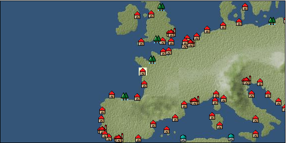

# Port: ナント

import Tabs from '@theme/Tabs';
import TabItem from '@theme/TabItem';

## General Information

| Attribute | Details |
| :--- | :--- |
| **Port Name** | Nantes |
| **Port Type** | 領地 |
| **Region** | northern europe |
| **Sea Area** | bay of biscay |
| **Required Language** | French |
| **Coordinates** | （16097，2737） |
| **Investment Reward** |  |

### Available Facilities

| guild | intermediary | exchange | tool shop | workshop craftsman | Painter | sculptor | peddler |
| --- | --- | --- | --- | --- | --- | --- | --- |
|   |   | ○ | ○ | ○ | ○ |   |   |
| Shipyard Master | Lumbermaker | Sail-maker | weapon craftsman | master | TavernFemale | archive | salesperson |
| --- | --- | --- | --- | --- | --- | --- | --- |
| ○ | ○ |   |   | ○ |   |   |   |
| Shipwright | 銀行 | street worker | 王宮 | Trading post | church | suburbs | translator |
| --- | --- | --- | --- | --- | --- | --- | --- |
| ○ | ○ | ○ |   |   | ○ | ○ |   |

### Description
A historic city that has existed since Roman times. Located near the Loire River, it has flourished as an important transportation and trade hub since ancient times. In addition to producing crops and textiles, spices are an important product. Suburbs: Nantes South Cultural Area: Northern France

<Tabs>
  <TabItem value="trade_goods_sales" label="Trade Goods Sales">

| item | group | purchase price | 同盟時 | remarks |
| --- | --- | --- | --- | --- |
| [sausage](docs/Items/TradeGoods/TradeGoods-Foodstuffs/item_27.md) | [Trading items (food items)](docs/Categories/category_3.md) | 369 | 324 |  |
| [onion](docs/Items/TradeGoods/TradeGoods-Foodstuffs/item_28.md) | [Trading items (food items)](docs/Categories/category_3.md) | 82 | 72 |  |
| [tweed](docs/Items/TradeGoods/TradeGoods-Fabrics/item_31.md) | [交易品（織物）](docs/Categories/category_20.md) | 1,279 | (1,119) |  |
| [butter](docs/Items/TradeGoods/TradeGoods-Seasonings/item_3.md) | [交易品（調味料）](docs/Categories/category_4.md) | 310 | (272) |  |
| [fennel](docs/Items/TradeGoods/TradeGoods-Spices/item_1045.md) | [Trading Goods (Spices)](docs/Categories/category_12.md) | (219) | 192 |  |
| 要投資（必要投資額：120,000） |
| [fruit brandy](docs/Items/TradeGoods/TradeGoods-Alcohol/item_1440.md) | [交易品（酒類）](docs/Categories/category_9.md) | 573 | (502) |  |
| [lira](docs/Items/TradeGoods/TradeGoods-Perfume/item_30.md) | [Trading Goods (Spices)](docs/Categories/category_11.md) | 666 | (583) |  |
| [wheat](docs/Items/TradeGoods/TradeGoods-Foodstuffs/item_16.md) | [Trading items (food items)](docs/Categories/category_3.md) | 45 | 40 |  |
| [beef](docs/Items/TradeGoods/TradeGoods-Foodstuffs/item_26.md) | [Trading items (food items)](docs/Categories/category_3.md) | 647 | 568 |  |
| [chicken meat](docs/Items/TradeGoods/TradeGoods-Foodstuffs/item_29.md) | [Trading items (food items)](docs/Categories/category_3.md) | 328 | 288 |  |
  </TabItem>
  <TabItem value="sale_specialty" label="Sale (Specialty)">

| item | group | sale price | 同盟時 | remarks |
| --- | --- | --- | --- | --- |

#### [交易品（繊維）](docs/Categories/category_1.md)

| [flax](docs/Items/TradeGoods/TradeGoods-Fibers/item_64.md) | 交易品（繊維） | [Edit Sale Price](docs/Ports/port_20.md) |  |
| [feather](docs/Items/TradeGoods/TradeGoods-Fibers/item_585.md) | 交易品（繊維） | [Edit Sale Price](docs/Ports/port_20.md) |  |
| [Green ramie](docs/Items/TradeGoods/TradeGoods-Fibers/item_3428.md) | 交易品（繊維） | 33,000 | (37,128) |  |

#### [Trading Goods (Dye)](docs/Categories/category_2.md)

| [Indian Akane](docs/Items/TradeGoods/TradeGoods-Dye/item_1037.md) | Trading Goods (Dye) | 1,213 | (1,364) |  |
| [Indian indigo](docs/Items/TradeGoods/TradeGoods-Dye/item_157.md) | Trading Goods (Dye) | 1,245 | (1,400) |  |
| [ward](docs/Items/TradeGoods/TradeGoods-Dye/item_57.md) | Trading Goods (Dye) | 1,234 | (1,388) |  |
| [Safflower](docs/Items/TradeGoods/TradeGoods-Dye/item_1059.md) | Trading Goods (Dye) | 768 | (864) |  |

#### [Trading items (food items)](docs/Categories/category_3.md)

| [taro](docs/Items/TradeGoods/TradeGoods-Foodstuffs/item_1960.md) | Trading items (food items) | 245 | (275) |  |

#### [交易品（調味料）](docs/Categories/category_4.md)

| [tamarind](docs/Items/TradeGoods/TradeGoods-Seasonings/item_1968.md) | 交易品（調味料） | 2,275 | (2,559) |  |

#### [Trading products (medical products)](docs/Categories/category_6.md)

| [Saikaku](docs/Items/TradeGoods/TradeGoods-Medicine/item_1959.md) | Trading products (medical products) | 5,055 | (5,687) |  |
| [Nothing](docs/Items/TradeGoods/TradeGoods-Medicine/item_1053.md) | Trading products (medical products) | 832 | (936) |  |
| [calamus](docs/Items/TradeGoods/TradeGoods-Medicine/item_3427.md) | Trading products (medical products) | 33,900 | (38,141) |  |

#### [交易品（酒類）](docs/Categories/category_9.md)

| [aquavit](docs/Items/TradeGoods/TradeGoods-Alcohol/item_572.md) | 交易品（酒類） | 670 | (753) |  |
| [gin](docs/Items/TradeGoods/TradeGoods-Alcohol/item_291.md) | 交易品（酒類） | 681 | (766) |  |

#### [Trading goods (hobby goods)](docs/Categories/category_10.md)

| [walnut](docs/Items/TradeGoods/TradeGoods-Sunddries/item_522.md) | Trading goods (hobby goods) | 754 | (848) |  |
| [prune](docs/Items/TradeGoods/TradeGoods-Sunddries/item_523.md) | Trading goods (hobby goods) | 429 | (482) |  |
| [dried figs](docs/Items/TradeGoods/TradeGoods-Sunddries/item_611.md) | Trading goods (hobby goods) | 467 | (525) |  |
| [black tea](docs/Items/TradeGoods/TradeGoods-Sunddries/item_675.md) | Trading goods (hobby goods) | 2,566 | (2,887) |  |
| [金針花](docs/Items/TradeGoods/TradeGoods-Sunddries/item_3739.md) | Trading goods (hobby goods) | 10,600 | (11,926) |  |

#### [Trading Goods (Spices)](docs/Categories/category_11.md)

| [oakmoss](docs/Items/TradeGoods/TradeGoods-Perfume/item_819.md) | Trading Goods (Spices) | 1,133 | (1,274) |  |
| [jasmine](docs/Items/TradeGoods/TradeGoods-Perfume/item_772.md) | Trading Goods (Spices) | 6,686 | (7,522) |  |
| [daffodil](docs/Items/TradeGoods/TradeGoods-Perfume/item_612.md) | Trading Goods (Spices) | 1,210 | (1,361) |  |
| [lily of the valley](docs/Items/TradeGoods/TradeGoods-Perfume/item_358.md) | Trading Goods (Spices) | 1,088 | (1,224) |  |
| [geranium](docs/Items/TradeGoods/TradeGoods-Perfume/item_145.md) | Trading Goods (Spices) | 1,245 | (1,400) |  |
| [龍脳](docs/Items/TradeGoods/TradeGoods-Perfume/item_1676.md) | Trading Goods (Spices) | 2,708 | (3,046) |  |

#### [Trading Goods (Spices)](docs/Categories/category_12.md)

| [allspice](docs/Items/TradeGoods/TradeGoods-Spices/item_1848.md) | Trading Goods (Spices) | 1,690 | (1,901) |  |
| [cloves](docs/Items/TradeGoods/TradeGoods-Spices/item_1092.md) | Trading Goods (Spices) | (19,366) | 22,597 |  |
| [pepper](docs/Items/TradeGoods/TradeGoods-Spices/item_58.md) | Trading Goods (Spices) | 5,260 | 14,555 |  |
| [cinnamon](docs/Items/TradeGoods/TradeGoods-Spices/item_1432.md) | Trading Goods (Spices) | 5,050 | (5,681) |  |
| [nutmeg](docs/Items/TradeGoods/TradeGoods-Spices/item_1969.md) | Trading Goods (Spices) | (20,551) | 23,980 |  |
| [mace](docs/Items/TradeGoods/TradeGoods-Spices/item_2100.md) | Trading Goods (Spices) | (11,896) | 13,880 |  |
| [Grapefruit](docs/Items/TradeGoods/TradeGoods-Spices/item_3422.md) | Trading Goods (Spices) | 34,600 | (38,928) |  |

#### [Trading goods (artificial goods)](docs/Categories/category_13.md)

| [glasswork](docs/Items/TradeGoods/TradeGoods-Luxuries/item_60.md) | Trading goods (artificial goods) | 1,920 | (2,160) |  |
| [Tumbaga](docs/Items/TradeGoods/TradeGoods-Luxuries/item_3028.md) | Trading goods (artificial goods) | 19,663 | (22,123) |  |
| [lacquerware](docs/Items/TradeGoods/TradeGoods-Luxuries/item_3435.md) | Trading goods (artificial goods) | 36,200 | (40,728) |  |
| [Saori](docs/Items/TradeGoods/TradeGoods-Luxuries/item_3676.md) | Trading goods (artificial goods) | (9,744) | 11,369 |  |

#### [Trading Items (Gemstones)](docs/Categories/category_15.md)

| [aventurine](docs/Items/TradeGoods/TradeGoods-Gems/item_678.md) | Trading Items (Gemstones) | 6,350 | (7,144) |  |
| [cat's eye](docs/Items/TradeGoods/TradeGoods-Gems/item_1047.md) | Trading Items (Gemstones) | 11,238 | (12,643) |  |
| [sapphire](docs/Items/TradeGoods/TradeGoods-Gems/item_676.md) | Trading Items (Gemstones) | 10,455 | (11,763) |  |
| [turquoise](docs/Items/TradeGoods/TradeGoods-Gems/item_1006.md) | Trading Items (Gemstones) | 3,636 | (4,090) |  |
| [diamond](docs/Items/TradeGoods/TradeGoods-Gems/item_449.md) | Trading Items (Gemstones) | 6,745 | (7,588) |  |
| [topaz](docs/Items/TradeGoods/TradeGoods-Gems/item_1097.md) | Trading Items (Gemstones) | (4,851) | 5,660 |  |
| [pink diamond](docs/Items/TradeGoods/TradeGoods-Gems/item_2874.md) | Trading Items (Gemstones) | 13,208 | (14,860) |  |
| [lapis lazuli](docs/Items/TradeGoods/TradeGoods-Gems/item_995.md) | Trading Items (Gemstones) | 5,847 | (6,578) |  |
| [ruby](docs/Items/TradeGoods/TradeGoods-Gems/item_773.md) | Trading Items (Gemstones) | 13,810 | (15,537) |  |
| [amber](docs/Items/TradeGoods/TradeGoods-Gems/item_618.md) | Trading Items (Gemstones) | 3,660 | (4,117) |  |
| [amethyst](docs/Items/TradeGoods/TradeGoods-Gems/item_3434.md) | Trading Items (Gemstones) | 37,400 | (42,079) |  |

#### [Trading Items (Arms)](docs/Categories/category_16.md)

| [crossbow](docs/Items/TradeGoods/TradeGoods-Weapons/item_537.md) | Trading Items (Arms) | 1,378 | (1,550) |  |

#### [Trading Items (Firearms)](docs/Categories/category_17.md)

| [musket gun](docs/Items/TradeGoods/TradeGoods-Firearms/item_584.md) | Trading Items (Firearms) | 2,943 | (3,311) |  |

#### [交易品（織物）](docs/Categories/category_20.md)

| [indian chintz](docs/Items/TradeGoods/TradeGoods-Fabrics/item_159.md) | 交易品（織物） | 2,635 | (2,964) |  |
| [dutch calico](docs/Items/TradeGoods/TradeGoods-Fabrics/item_1435.md) | 交易品（織物） | 1,019 | (1,146) |  |
| [damask](docs/Items/TradeGoods/TradeGoods-Fabrics/item_614.md) | 交易品（織物） | (4,851) | 5,660 |  |
| [turkish rug](docs/Items/TradeGoods/TradeGoods-Fabrics/item_686.md) | 交易品（織物） | 6,694 | (7,531) |  |
| [velvet](docs/Items/TradeGoods/TradeGoods-Fabrics/item_902.md) | 交易品（織物） | 4,152 | (4,671) |  |
| [persian rug](docs/Items/TradeGoods/TradeGoods-Fabrics/item_606.md) | 交易品（織物） | 9,627 | (10,831) |  |
| [Bingata](docs/Items/TradeGoods/TradeGoods-Fabrics/item_3479.md) | 交易品（織物） | 18,470 | (20,780) |  |
| [Nishijin textile](docs/Items/TradeGoods/TradeGoods-Fabrics/item_3431.md) | 交易品（織物） | 35,600 | 41,600 |  |
  </TabItem>
  <TabItem value="sale_no_specialty" label="Sale (No Specialty)">

| item | group | sale price | 同盟時 | remarks |
| --- | --- | --- | --- | --- |

#### [交易品（繊維）](docs/Categories/category_1.md)

| [wool](docs/Items/TradeGoods/TradeGoods-Fibers/item_5.md) | 交易品（繊維） | 530 | (596) |  |
| [numb](docs/Items/TradeGoods/TradeGoods-Fibers/item_900.md) | 交易品（繊維） | 12 | (13) |  |

#### [Trading Goods (Dye)](docs/Categories/category_2.md)

| [Grass](docs/Items/TradeGoods/TradeGoods-Dye/item_906.md) | Trading Goods (Dye) | 4 | (4) |  |

#### [Trading items (food items)](docs/Categories/category_3.md)

| [duck meat](docs/Items/TradeGoods/TradeGoods-Foodstuffs/item_32.md) | Trading items (food items) | 445 | (500) |  |
| [olive](docs/Items/TradeGoods/TradeGoods-Foodstuffs/item_47.md) | Trading items (food items) | (288) | 336 |  |
| [onion](docs/Items/TradeGoods/TradeGoods-Foodstuffs/item_28.md) | Trading items (food items) | 36 | (40) |  |
| [ham](docs/Items/TradeGoods/TradeGoods-Foodstuffs/item_290.md) | Trading items (food items) | 481 | 418 |  |
| [puff pastry](docs/Items/TradeGoods/TradeGoods-Foodstuffs/item_874.md) | Trading items (food items) | 168 | (189) |  |
| [pasta](docs/Items/TradeGoods/TradeGoods-Foodstuffs/item_635.md) | Trading items (food items) | 64 | (72) |  |
| [bacon](docs/Items/TradeGoods/TradeGoods-Foodstuffs/item_566.md) | Trading items (food items) | 382 | (429) |  |
| [rye](docs/Items/TradeGoods/TradeGoods-Foodstuffs/item_61.md) | Trading items (food items) | 58 | (65) |  |
| [wheat](docs/Items/TradeGoods/TradeGoods-Foodstuffs/item_16.md) | Trading items (food items) | 20 | (22) |  |
| [flour](docs/Items/TradeGoods/TradeGoods-Foodstuffs/item_605.md) | Trading items (food items) | 51 | (57) |  |
| [mutton](docs/Items/TradeGoods/TradeGoods-Foodstuffs/item_33.md) | Trading items (food items) | 466 | (524) |  |
| [pork](docs/Items/TradeGoods/TradeGoods-Foodstuffs/item_41.md) | Trading items (food items) | (340) | 396 |  |
| [魚肉](docs/Items/TradeGoods/TradeGoods-Foodstuffs/item_10.md) | Trading items (food items) | 192 | (216) |  |

#### [交易品（調味料）](docs/Categories/category_4.md)

| [anchovies](docs/Items/TradeGoods/TradeGoods-Seasonings/item_3004.md) | 交易品（調味料） | 267 | (300) |  |
| [olive oil](docs/Items/TradeGoods/TradeGoods-Seasonings/item_48.md) | 交易品（調味料） | 389 | (437) |  |
| [coconut vinegar](docs/Items/TradeGoods/TradeGoods-Seasonings/item_1988.md) | 交易品（調味料） | 538 | (605) |  |
| [lard](docs/Items/TradeGoods/TradeGoods-Seasonings/item_43.md) | 交易品（調味料） | 308 | (346) |  |
| [apple cider vinegar](docs/Items/TradeGoods/TradeGoods-Seasonings/item_882.md) | 交易品（調味料） | 382 | (429) |  |
| [wine vinegar](docs/Items/TradeGoods/TradeGoods-Seasonings/item_429.md) | 交易品（調味料） | (522) | 609 |  |

#### [交易品（雑貨）](docs/Categories/category_5.md)

| [Western books](docs/Items/TradeGoods/TradeGoods-Misc/item_293.md) | 交易品（雑貨） | 735 | (826) |  |

#### [Trading products (medical products)](docs/Categories/category_6.md)

| [Elder](docs/Items/TradeGoods/TradeGoods-Medicine/item_34.md) | Trading products (medical products) | 247 | (277) |  |
| [chamomile](docs/Items/TradeGoods/TradeGoods-Medicine/item_292.md) | Trading products (medical products) | 444 | (499) |  |
| [lemon balm](docs/Items/TradeGoods/TradeGoods-Medicine/item_127.md) | Trading products (medical products) | (347) | 404 |  |
| [rose hips](docs/Items/TradeGoods/TradeGoods-Medicine/item_904.md) | Trading products (medical products) | 485 | (545) |  |

#### [Trading Items (Iron Stone)](docs/Categories/category_7.md)

| [iron ore](docs/Items/TradeGoods/TradeGoods-Minerals/item_146.md) | Trading Items (Iron Stone) | 772 | (868) |  |

#### [Trading products (precious metals)](docs/Categories/category_8.md)

| [gold](docs/Items/TradeGoods/TradeGoods-Metals/item_659.md) | Trading products (precious metals) | (7,588) | 8,854 |  |
| [silver](docs/Items/TradeGoods/TradeGoods-Metals/item_136.md) | Trading products (precious metals) | (3,223) | 3,760 |  |

#### [交易品（酒類）](docs/Categories/category_9.md)

| [whiskey](docs/Items/TradeGoods/TradeGoods-Alcohol/item_1.md) | 交易品（酒類） | 728 | (819) |  |
| [sherry](docs/Items/TradeGoods/TradeGoods-Alcohol/item_844.md) | 交易品（酒類） | 471 | 480 |  |
| [Beer](docs/Items/TradeGoods/TradeGoods-Alcohol/item_2.md) | 交易品（酒類） | 313 | (352) |  |
| [fruit brandy](docs/Items/TradeGoods/TradeGoods-Alcohol/item_1440.md) | 交易品（酒類） | 256 | (288) |  |
| [brandy](docs/Items/TradeGoods/TradeGoods-Alcohol/item_9.md) | 交易品（酒類） | 760 | (855) |  |
| [liqueur](docs/Items/TradeGoods/TradeGoods-Alcohol/item_18.md) | 交易品（酒類） | 670 | (753) |  |
| [wine](docs/Items/TradeGoods/TradeGoods-Alcohol/item_11.md) | 交易品（酒類） | 511 | (574) |  |

#### [Trading goods (hobby goods)](docs/Categories/category_10.md)

| [almond](docs/Items/TradeGoods/TradeGoods-Sunddries/item_367.md) | Trading goods (hobby goods) | 190 | (213) |  |
| [pickles](docs/Items/TradeGoods/TradeGoods-Sunddries/item_535.md) | Trading goods (hobby goods) | 320 | (360) |  |
| [dried strawberries](docs/Items/TradeGoods/TradeGoods-Sunddries/item_36.md) | Trading goods (hobby goods) | 413 | (464) |  |
| [raisins](docs/Items/TradeGoods/TradeGoods-Sunddries/item_35.md) | Trading goods (hobby goods) | 263 | (295) |  |
| [dried apple](docs/Items/TradeGoods/TradeGoods-Sunddries/item_19.md) | Trading goods (hobby goods) | 372 | 538 |  |

#### [Trading Goods (Spices)](docs/Categories/category_11.md)

| [Musk](docs/Items/TradeGoods/TradeGoods-Perfume/item_158.md) | Trading Goods (Spices) | 4,726 | (5,317) |  |

#### [Trading Goods (Spices)](docs/Categories/category_12.md)

| [saffron](docs/Items/TradeGoods/TradeGoods-Spices/item_845.md) | Trading Goods (Spices) | 2,592 | (2,916) |  |
| [fennel](docs/Items/TradeGoods/TradeGoods-Spices/item_1045.md) | Trading Goods (Spices) | 106 | (119) |  |
| 要投資（必要投資額：120,000） |
| [mint](docs/Items/TradeGoods/TradeGoods-Spices/item_816.md) | Trading Goods (Spices) | 181 | (203) |  |

#### [Trading goods (artificial goods)](docs/Categories/category_13.md)

| [dragonfly ball](docs/Items/TradeGoods/TradeGoods-Luxuries/item_294.md) | Trading goods (artificial goods) | 1,185 | (1,333) |  |
| [lapidary work](docs/Items/TradeGoods/TradeGoods-Luxuries/item_153.md) | Trading goods (artificial goods) | 5,300 | (5,963) |  |
| [goldsmith](docs/Items/TradeGoods/TradeGoods-Luxuries/item_687.md) | Trading goods (artificial goods) | 3,506 | (3,944) |  |
| [silversmith](docs/Items/TradeGoods/TradeGoods-Luxuries/item_619.md) | Trading goods (artificial goods) | 4,240 | (4,770) |  |
| [luxury furniture](docs/Items/TradeGoods/TradeGoods-Luxuries/item_1048.md) | Trading goods (artificial goods) | 2,750 | (3,094) |  |
| Curry's mistake. sorry. |
| [luxury clothing](docs/Items/TradeGoods/TradeGoods-Luxuries/item_165.md) | Trading goods (artificial goods) | 4,740 | (5,333) |  |

#### [交易品（美術品）](docs/Categories/category_14.md)

| [古美術品](docs/Items/TradeGoods/TradeGoods-Art/item_51.md) | 交易品（美術品） | 4,524 | (5,089) |  |
| [wooden statue](docs/Items/TradeGoods/TradeGoods-Art/item_95.md) | 交易品（美術品） | 1,296 | (1,458) |  |
| [copperplate print](docs/Items/TradeGoods/TradeGoods-Art/item_1087.md) | 交易品（美術品） | 754 | (848) |  |
| [青銅像](docs/Items/TradeGoods/TradeGoods-Art/item_148.md) | 交易品（美術品） | 1,190 | (1,338) |  |

#### [Trading Items (Gemstones)](docs/Categories/category_15.md)

| [emerald](docs/Items/TradeGoods/TradeGoods-Gems/item_777.md) | Trading Items (Gemstones) | 7,632 | (8,586) |  |
| [pearl](docs/Items/TradeGoods/TradeGoods-Gems/item_769.md) | Trading Items (Gemstones) | 10,174 | (11,446) |  |
| [ivory](docs/Items/TradeGoods/TradeGoods-Gems/item_699.md) | Trading Items (Gemstones) | 3,637 | (4,092) |  |

#### [Trading Items (Arms)](docs/Categories/category_16.md)

| [scimitar](docs/Items/TradeGoods/TradeGoods-Weapons/item_142.md) | Trading Items (Arms) | 1,045 | (1,175) |  |
| [dagger](docs/Items/TradeGoods/TradeGoods-Weapons/item_143.md) | Trading Items (Arms) | 947 | (1,065) |  |
| [western armor](docs/Items/TradeGoods/TradeGoods-Weapons/item_6.md) | Trading Items (Arms) | 2,702 | (3,040) |  |

#### [Trading Items (Firearms)](docs/Categories/category_17.md)

| [大砲](docs/Items/TradeGoods/TradeGoods-Firearms/item_4.md) | Trading Items (Firearms) | 3,445 | (3,876) |  |

#### [Trading Goods (Livestock)](docs/Categories/category_18.md)

| [duck](docs/Items/TradeGoods/TradeGoods-Livestock/item_38.md) | Trading Goods (Livestock) | (60) | 69 |  |
| [cow](docs/Items/TradeGoods/TradeGoods-Livestock/item_17.md) | Trading Goods (Livestock) | (298) | 347 |  |
| [horse](docs/Items/TradeGoods/TradeGoods-Livestock/item_1811.md) | Trading Goods (Livestock) | 168 | (189) |  |
| [pig](docs/Items/TradeGoods/TradeGoods-Livestock/item_37.md) | Trading Goods (Livestock) | (60) | 69 |  |
| [goat](docs/Items/TradeGoods/TradeGoods-Livestock/item_534.md) | Trading Goods (Livestock) | 196 | (220) |  |

#### [交易品（工業品）](docs/Categories/category_19.md)

| [wood](docs/Items/TradeGoods/TradeGoods-Wares/item_277.md) | 交易品（工業品） | 836 | (940) |  |
| [水銀](docs/Items/TradeGoods/TradeGoods-Wares/item_15.md) | 交易品（工業品） | 1,273 | (1,432) |  |
| [graphite](docs/Items/TradeGoods/TradeGoods-Wares/item_25.md) | 交易品（工業品） | 982 | (1,104) |  |
| [Stone](docs/Items/TradeGoods/TradeGoods-Wares/item_276.md) | 交易品（工業品） | 777 | (874) |  |
| [oil](docs/Items/TradeGoods/TradeGoods-Wares/item_613.md) | 交易品（工業品） | 633 | (712) |  |
| [coal](docs/Items/TradeGoods/TradeGoods-Wares/item_359.md) | 交易品（工業品） | 538 | (605) |  |
| [iron material](docs/Items/TradeGoods/TradeGoods-Wares/item_268.md) | 交易品（工業品） | 858 | (965) |  |
| [青銅](docs/Items/TradeGoods/TradeGoods-Wares/item_7.md) | 交易品（工業品） | 1,070 | (1,203) |  |

#### [交易品（織物）](docs/Categories/category_20.md)

| [knit](docs/Items/TradeGoods/TradeGoods-Fabrics/item_164.md) | 交易品（織物） | 639 | (718) |  |
| [race](docs/Items/TradeGoods/TradeGoods-Fabrics/item_59.md) | 交易品（織物） | 2,025 | (2,278) |  |
| [woolen fabric](docs/Items/TradeGoods/TradeGoods-Fabrics/item_163.md) | 交易品（織物） | 1,057 | (1,189) |  |
| [linen fabric](docs/Items/TradeGoods/TradeGoods-Fabrics/item_135.md) | 交易品（織物） | 461 | (518) |  |
  </TabItem>
  <TabItem value="guild_&_others" label="Guild & Others">

| item | group | Sales price | Handling NPC | remarks |
| --- | --- | --- | --- | --- |

#### princess marguerite

| [supply](docs/Skills/Skill-Adventure/item_455.md) | [Skill (adventure)](docs/Categories/category_39.md) | 2,000 | princess marguerite |  |
| [portuguese](docs/Skills/Skills-Language/item_345.md) | [Skills (language)](docs/Categories/category_42.md) | 1,000 | princess marguerite |  |

#### others

| [馬上槍鋳造法](docs/Items/RecipeBooks/item_4307.md) | [recipe book](docs/Categories/category_22.md) | Fixed recipe |  |  |
| 時代限定（15世紀第4期、15世紀第5期、16世紀第1期） |
  </TabItem>
  <TabItem value="toolman" label="Toolman">

| item | group | Sales price | Handling NPC | remarks |
| --- | --- | --- | --- | --- |

#### [recipe book](docs/Categories/category_22.md)

| [Mode Design Collection Volume 2](docs/Items/RecipeBooks/item_709.md) | recipe book | 30,000 | tool shop owner |  |
| [medicine formula book](docs/Items/RecipeBooks/item_724.md) | recipe book | 5,000 | tool shop owner |  |
| [Wand forging/application](docs/Items/RecipeBooks/item_710.md) | recipe book | 50,000 | tool shop owner |  |
| [Livestock secrets/Cow chapter](docs/Items/RecipeBooks/item_643.md) | recipe book | 8,000 | tool shop owner |  |
| [Book of land battle props and crafts](docs/Items/RecipeBooks/item_521.md) | recipe book | 10,000 | tool shop owner |  |

#### [Equipment (head)](docs/Categories/category_23.md)

| [tricorne](docs/Items/Equipment/Equipment-Head/item_274.md) | Equipment (head) | 23,000 | tool shop owner |  |
| [Tricorne with wings](docs/Items/Equipment/Equipment-Head/item_1537.md) | Equipment (head) | 33,000 | tool shop owner |  |

#### [Equipment (body)](docs/Categories/category_24.md)

| [Surcoat](docs/Items/Equipment/Equipment-Body/item_131.md) | Equipment (body) | 30,000 | tool shop owner |  |
| [tweed petticoat](docs/Items/Equipment/Equipment-Body/item_723.md) | Equipment (body) | 12,300 | tool shop owner |  |

#### [Equipment (belongings)](docs/Categories/category_27.md)

| [matchlock shooting gun](docs/Items/Equipment/Equipment-Weapon/item_103.md) | Equipment (belongings) | 3,000 | tool shop owner |  |
| [roundel dagger](docs/Items/Equipment/Equipment-Weapon/item_1670.md) | Equipment (belongings) | 24,500 | tool shop owner |  |

#### [装備品（服飾品）](docs/Categories/category_28.md)

| [Utilization guidebook volume 1](docs/Items/Equipment/Equipment-Accessory/item_2209.md) | 装備品（服飾品） | 10,000 | tool shop owner |  |
| [Consecutive Attack Guide Volume 1](docs/Items/Equipment/Equipment-Accessory/item_2208.md) | 装備品（服飾品） | 10,000 | tool shop owner |  |

#### [Consumables (land battle/deck battle)](docs/Categories/category_29.md)

| [hawk feather](docs/Items/Consumables/Consumables-Landbattle/item_562.md) | Consumables (land battle/deck battle) | 200 | tool shop owner |  |
| [throwing knife](docs/Items/Consumables/Consumables-Landbattle/item_560.md) | Consumables (land battle/deck battle) | 150 | tool shop owner |  |
| [Assortment of therapeutic drugs](docs/Items/Consumables/Consumables-Landbattle/item_564.md) | Consumables (land battle/deck battle) | 900 | tool shop owner |  |
| [secret cure](docs/Items/Consumables/Consumables-Landbattle/item_563.md) | Consumables (land battle/deck battle) | 600 | tool shop owner |  |
| [intoxicating liquor](docs/Items/Consumables/Consumables-Landbattle/item_529.md) | Consumables (land battle/deck battle) | 500 | tool shop owner |  |

#### [Consumables (naval/hand-to-hand combat)](docs/Categories/category_30.md)

| [forged correspondence](docs/Items/Consumables/Consumables-navalhand-to-hand combat/item_559.md) | Consumables (naval/hand-to-hand combat) | 3,000 | tool shop owner |  |

#### [Consumables (skill activation)](docs/Categories/category_31.md)

| [fishing gear](docs/Items/Consumables/Consumables-Skill/item_79.md) | Consumables (skill activation) | 2,500 | tool shop owner |  |
  </TabItem>
  <TabItem value="kobo_craftsmen" label="Craftsman">

| item | group | Sales price | Handling NPC | remarks |
| --- | --- | --- | --- | --- |

#### [Consumables (condition recovery)](docs/Categories/category_21.md)

| [Nostalgic carillon bell](docs/Items/Consumables/Consumables-Recovery/item_245.md) | Consumables (condition recovery) | 200 | workshop craftsman |  |
| [Ship song sheet music](docs/Items/Consumables/Consumables-Recovery/item_247.md) | Consumables (condition recovery) | 200 | workshop craftsman |  |

#### [Consumables (skill activation)](docs/Categories/category_31.md)

| [四分儀](docs/Items/Consumables/Consumables-Skill/item_346.md) | Consumables (skill activation) | 500 | workshop craftsman |  |

#### [shipbuilding materials](docs/Categories/category_47.md)

| [General purpose medium square sail](docs/Items/ShipbuildingFS/item_3453.md) | shipbuilding materials | 300,000 | workshop craftsman |  |
| 要投資（必要投資額：500,000） |
| [General purpose medium latin sail](docs/Items/ShipbuildingFS/item_3452.md) | shipbuilding materials | 300,000 | workshop craftsman |  |
| 要投資（必要投資額：不明） |
| [General-purpose medium-sized paddle boat](docs/Items/ShipbuildingFS/item_3451.md) | shipbuilding materials | 1,000,000 | workshop craftsman |  |
| 要投資（必要投資額：500,000） |
| [General purpose medium gun port](docs/Items/ShipbuildingFS/item_3455.md) | shipbuilding materials | 300,000 | workshop craftsman |  |
| 要投資（必要投資額：500,000） |
| [General-purpose medium-sized hull](docs/Items/ShipbuildingFS/item_3450.md) | shipbuilding materials | 1,000,000 | workshop craftsman |  |
| 要投資（必要投資額：500,000） |
  </TabItem>
  <TabItem value="Painter" label="Painter">

| item | group | Sales price | Handling NPC | remarks |
| --- | --- | --- | --- | --- |

#### [Ship parts (emblem)](docs/Categories/category_36.md)

| [admiral](docs/Items/ShipParts/Shipparts-Crests/item_548.md) | Ship parts (emblem) | 5,000 | Painter |  |
| [anchor](docs/Items/ShipParts/Shipparts-Crests/item_549.md) | Ship parts (emblem) | 5,000 | Painter |  |
| [circle cross](docs/Items/ShipParts/Shipparts-Crests/item_544.md) | Ship parts (emblem) | 5,000 | Painter |  |
| [shellfish](docs/Items/ShipParts/Shipparts-Crests/item_546.md) | Ship parts (emblem) | 5,000 | Painter |  |
| [Delphine](docs/Items/ShipParts/Shipparts-Crests/item_542.md) | Ship parts (emblem) | 5,000 | Painter |  |
| [butterfly](docs/Items/ShipParts/Shipparts-Crests/item_547.md) | Ship parts (emblem) | 5,000 | Painter |  |
| [fisherman](docs/Items/ShipParts/Shipparts-Crests/item_545.md) | Ship parts (emblem) | 5,000 | Painter |  |
| [maiden](docs/Items/ShipParts/Shipparts-Crests/item_722.md) | Ship parts (emblem) | 5,000 | Painter |  |
  </TabItem>
  <TabItem value="shipyard" label="Shipyard">

### Shipyard Master

| item | group | Sales price | Handling NPC | remarks |
| --- | --- | --- | --- | --- |

#### [recipe book](docs/Categories/category_22.md)

| [Book of Shipbuilding Materials and Hulls Volume 2](docs/Items/RecipeBooks/item_1719.md) | recipe book | Fixed recipe | Shipyard Master |  |

#### [Boat](docs/Categories/category_43.md)

| [2 mast cogs](docs/Items/Ships/item_265.md) | Boat | 96,000 | Shipyard Master |  |
| [warwick cog](docs/Items/Ships/item_336.md) | Boat | 230,000 | Shipyard Master |  |
| [Galliot](docs/Items/Ships/item_210.md) | Boat | 156,000 | Shipyard Master |  |
| [galleon](docs/Items/Ships/item_411.md) | Boat | 4,500,000 | Shipyard Master |  |
| [carrack](docs/Items/Ships/item_236.md) | Boat | 720,000 | Shipyard Master |  |
| [caravelle](docs/Items/Ships/item_213.md) | Boat | 285,000 | Shipyard Master |  |
| [Hansa Cog](docs/Items/Ships/item_263.md) | Boat | 24,000 | Shipyard Master |  |
| [Varsha](docs/Items/Ships/item_201.md) | Boat | 2,000 | Shipyard Master |  |
| [frigate](docs/Items/Ships/item_760.md) | Boat | 1,080,000 | Shipyard Master |  |
| [flute](docs/Items/Ships/item_569.md) | Boat | 410,000 | Shipyard Master |  |
| [hooker](docs/Items/Ships/item_335.md) | Boat | 220,000 | Shipyard Master |  |
| [bergantine](docs/Items/Ships/item_208.md) | Boat | 148,800 | Shipyard Master |  |
| [la real](docs/Items/Ships/item_551.md) | Boat | 6,100,000 | Shipyard Master |  |
| [commercial galleon](docs/Items/Ships/item_412.md) | Boat | 4,600,000 | Shipyard Master |  |
| [commercial carrack](docs/Items/Ships/item_239.md) | Boat | 728,000 | Shipyard Master |  |
| [commercial caravel](docs/Items/Ships/item_215.md) | Boat | 290,000 | Shipyard Master |  |
| [commercial varsha](docs/Items/Ships/item_204.md) | Boat | 5,200 | Shipyard Master |  |
| [commercial flute](docs/Items/Ships/item_570.md) | Boat | 420,000 | Shipyard Master |  |
| [commercial large carrack](docs/Items/Ships/item_409.md) | Boat | 1,840,000 | Shipyard Master |  |
| [commercial armed carrack](docs/Items/Ships/item_1502.md) | Boat | 4,000,000 | Shipyard Master |  |
| [large carrack](docs/Items/Ships/item_408.md) | Boat | 1,800,000 | Shipyard Master |  |
| [large caravel](docs/Items/Ships/item_246.md) | Boat | 1,160,000 | Shipyard Master |  |
| [small galleon](docs/Items/Ships/item_406.md) | Boat | 830,000 | Shipyard Master |  |
| [small carrack](docs/Items/Ships/item_219.md) | Boat | 480,000 | Shipyard Master |  |
| [small caravel](docs/Items/Ships/item_206.md) | Boat | 92,000 | Shipyard Master |  |
| [battle galleon](docs/Items/Ships/item_413.md) | Boat | 4,600,000 | Shipyard Master |  |
| [combat carrack](docs/Items/Ships/item_238.md) | Boat | 720,000 | Shipyard Master |  |
| [combat caravel](docs/Items/Ships/item_212.md) | Boat | 280,000 | Shipyard Master |  |
| [Battle Barsha](docs/Items/Ships/item_203.md) | Boat | 5,100 | Shipyard Master |  |
| [combat flute](docs/Items/Ships/item_568.md) | Boat | 400,000 | Shipyard Master |  |
| [exploration barsha](docs/Items/Ships/item_202.md) | Boat | 5,000 | Shipyard Master |  |
| [Large exploration carrack](docs/Items/Ships/item_1503.md) | Boat | 3,360,000 | Shipyard Master |  |
| [refurbished heavy carrack](docs/Items/Ships/item_1504.md) | Boat | 7,000,000 | Shipyard Master |  |
| [armed cog](docs/Items/Ships/item_264.md) | Boat | 25,000 | Shipyard Master |  |
| [light galleon](docs/Items/Ships/item_240.md) | Boat | 810,000 | Shipyard Master |  |
| [light galley](docs/Items/Ships/item_209.md) | Boat | 150,000 | Shipyard Master |  |
| [light carrack](docs/Items/Ships/item_218.md) | Boat | 478,000 | Shipyard Master |  |
| [light caravelle](docs/Items/Ships/item_207.md) | Boat | 92,000 | Shipyard Master |  |
| [transport galleon](docs/Items/Ships/item_407.md) | Boat | 840,000 | Shipyard Master |  |
| [transportation galley](docs/Items/Ships/item_211.md) | Boat | 160,000 | Shipyard Master |  |
| [transport carrack](docs/Items/Ships/item_222.md) | Boat | 488,000 | Shipyard Master |  |
| [heavy carrack](docs/Items/Ships/item_410.md) | Boat | 3,000,000 | Shipyard Master |  |
| [heavy caravel](docs/Items/Ships/item_248.md) | Boat | 1,250,000 | Shipyard Master |  |

#### [shipbuilding materials](docs/Categories/category_47.md)

| [2-deck medium-sized hull](docs/Items/ShipbuildingFS/item_1721.md) | shipbuilding materials | Fixed recipe | Shipyard Master |  |
| [3-deck medium-sized hull](docs/Items/ShipbuildingFS/item_1935.md) | shipbuilding materials | Fixed recipe | Shipyard Master |  |
| [Flat deck medium-sized hull](docs/Items/ShipbuildingFS/item_1720.md) | shipbuilding materials | Fixed recipe | Shipyard Master |  |

### Lumbermaker

| item | group | Sales price | Handling NPC | remarks |
| --- | --- | --- | --- | --- |

#### [recipe book](docs/Categories/category_22.md)

| [Book of Shipbuilding Materials and Crafts Volume 2](docs/Items/RecipeBooks/item_1717.md) | recipe book | Fixed recipe | Lumbermaker |  |

#### [Ship parts (additional armor)](docs/Categories/category_35.md)

| [elm board](docs/Items/ShipParts/Shipparts-Plates/item_328.md) | Ship parts (additional armor) | 13,000 | Lumbermaker |  |
| [oak board](docs/Items/ShipParts/Shipparts-Plates/item_354.md) | Ship parts (additional armor) | 34,000 | Lumbermaker |  |
| [cedar board](docs/Items/ShipParts/Shipparts-Plates/item_353.md) | Ship parts (additional armor) | 800 | Lumbermaker |  |
| [beach board](docs/Items/ShipParts/Shipparts-Plates/item_327.md) | Ship parts (additional armor) | 6,400 | Lumbermaker |  |
| [red pine board](docs/Items/ShipParts/Shipparts-Plates/item_326.md) | Ship parts (additional armor) | 2,700 | Lumbermaker |  |
| [銅板](docs/Items/ShipParts/Shipparts-Plates/item_405.md) | Ship parts (additional armor) | 73,000 | Lumbermaker |  |

#### [shipbuilding materials](docs/Categories/category_47.md)

| [middle mast](docs/Items/ShipbuildingFS/item_1718.md) | shipbuilding materials | Fixed recipe | Lumbermaker |  |

### Shipwright

| item | group | Sales price | Handling NPC | remarks |
| --- | --- | --- | --- | --- |

#### [recipe book](docs/Categories/category_22.md)

| [Shipbuilding materials/ropes](docs/Items/RecipeBooks/item_1704.md) | recipe book | Fixed recipe | Shipwright |  |

#### [shipbuilding materials](docs/Categories/category_47.md)

| [rope](docs/Items/ShipbuildingFS/item_1684.md) | shipbuilding materials | Fixed recipe | Shipwright |  |
  </TabItem>
</Tabs>