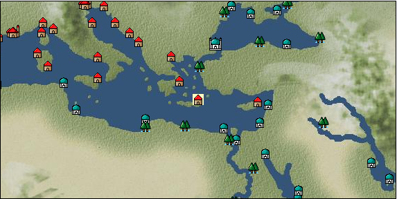

# Port: Acropolis

import Tabs from '@theme/Tabs';
import TabItem from '@theme/TabItem';

## General Information

| Attribute | Details |
| :--- | :--- |
| **Port Name** | Acropolis |
| **Port Type** | port of alliance |
| **Region** | atlantis |
| **Sea Area** | North Atlantic |
| **Required Language** |  |
| **Coordinates** | （，） |
| **Investment Reward** |  |

### Available Facilities

| guild | intermediary | exchange | tool shop | workshop craftsman | Painter | sculptor | peddler |
| --- | --- | --- | --- | --- | --- | --- | --- |
|   | ○ |   | ○ |   |   |   |   |
| Shipyard Master | Lumbermaker | Sail-maker | weapon craftsman | master | TavernFemale | archive | salesperson |
| --- | --- | --- | --- | --- | --- | --- | --- |
|   |   |   |   |   |   |   |   |
| Shipwright | 銀行 | street worker | 王宮 | Trading post | church | suburbs | translator |
| --- | --- | --- | --- | --- | --- | --- | --- |
| ○ |   |   |   |   |   |   |   |

### Description
The capital of the legendary land of Atlantis. It is an impregnable fortified city with a circular structure, surrounded by canals, and protected by high walls. There is also a warehouse guard and a temple (Temple of Poseidon). Traveling on the Ship of the Sun Secret Quest [2015/12/3 Phone@Administrator] For convenience, the icon on the map has been set at the same location as Candia. Also, since you can receive imperial command quests from Sokoban, there is a "middleman" for the sake of the quest database.

<Tabs>
  <TabItem value="trade_goods_sales" label="Trade Goods Sales">

| Item | Group | Purchase Price | Allied Price | Remarks |
| --- | --- | --- | --- | --- |
| There is no purchase information for trade goods. |
  </TabItem>
  <TabItem value="sale_specialty" label="Sale (Specialty)">

| Item | Group | sale price | Allied Price | Remarks |
| --- | --- | --- | --- | --- |
| Sales information for trade items with specialty judgment set is not registered. |
  </TabItem>
  <TabItem value="sale_no_specialty" label="Sale (No Specialty)">

| Item | Group | sale price | Allied Price | Remarks |
| --- | --- | --- | --- | --- |
| There is no information on the sale of trade goods. |
  </TabItem>
  <TabItem value="guild_&_others" label="Guild & Others">

| Item | Group | Sales price | Handling NPC | Remarks |
| --- | --- | --- | --- | --- |

#### Sokoban

| [Super civilization casting method](docs/Items/RecipeBooks/item_6442.md) | [recipe book](docs/Categories/category_22.md) | Fixed recipe | Sokoban |  |
  </TabItem>
  <TabItem value="toolman" label="Toolman">

| Item | Group | Sales price | Handling NPC | Remarks |
| --- | --- | --- | --- | --- |

#### [Equipment (head)](docs/Categories/category_23.md)

| [access world](docs/Items/Equipment/Equipment-Head/item_5017.md) | Equipment (head) | 5,000 | tool shop owner |  |

#### [Equipment (body)](docs/Categories/category_24.md)

| [Pruha](docs/Items/Equipment/Equipment-Body/item_5016.md) | Equipment (body) | 5,000 | tool shop owner |  |
| [Protos Pruha (for women)](docs/Items/Equipment/Equipment-Body/item_5014.md) | Equipment (body) | 50,000 | tool shop owner |  |
| [Protos Pruha (for men)](docs/Items/Equipment/Equipment-Body/item_5015.md) | Equipment (body) | 50,000 | tool shop owner |  |

#### [Consumables (land battle/deck battle)](docs/Categories/category_29.md)

| [傷薬](docs/Items/Consumables/Consumables-Landbattle/item_317.md) | Consumables (land battle/deck battle) | 150 | tool shop owner |  |
| [throwing knife](docs/Items/Consumables/Consumables-Landbattle/item_560.md) | Consumables (land battle/deck battle) | 150 | tool shop owner |  |
| [hellfire torch](docs/Items/Consumables/Consumables-Landbattle/item_233.md) | Consumables (land battle/deck battle) | 300 | tool shop owner |  |
| [antidote](docs/Items/Consumables/Consumables-Landbattle/item_270.md) | Consumables (land battle/deck battle) | 100 | tool shop owner |  |

#### [Consumables (skill activation)](docs/Categories/category_31.md)

| [fishing gear](docs/Items/Consumables/Consumables-Skill/item_79.md) | Consumables (skill activation) | 2,500 | tool shop owner |  |

#### [Consumables (other)](docs/Categories/category_44.md)

| [ancient knowledge book](docs/Items/Consumables/Consumables-Other/item_5103.md) | Consumables (other) | 3,000,000 | tool shop owner |  |
| [The lost ancient celestial globe](docs/Items/Consumables/Consumables-Other/item_5102.md) | Consumables (other) | 400,000 | tool shop owner |  |
| [Special rice made with lots of love](docs/Items/Consumables/Consumables-Other/item_5105.md) | Consumables (other) | 3,000,000 | tool shop owner |  |
| [War beast amulet](docs/Items/Consumables/Consumables-Other/item_5104.md) | Consumables (other) | 1,500,000 | tool shop owner |  |
| [stone chalice](docs/Items/Consumables/Consumables-Other/item_5019.md) | Consumables (other) | 10,000,000 | tool shop owner |  |
  </TabItem>
</Tabs>