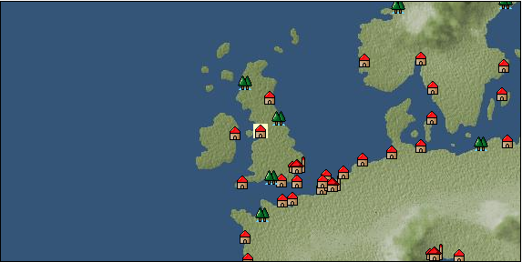

# Port: マンチェスター

import Tabs from '@theme/Tabs';
import TabItem from '@theme/TabItem';

## General Information

| Attribute | Details |
| :--- | :--- |
| **Port Name** | manchester |
| **Port Type** | port of alliance |
| **Region** | northern europe |
| **Sea Area** | northern britain |
| **Required Language** | English |
| **Coordinates** | （16164，2271） |
| **Investment Reward** | [Improved large cannon casting method](Items/Recipe Book/item_5127.md) （必要投資額：3,000,000ドゥカード） |

### Available Facilities

| guild | intermediary | exchange | tool shop | workshop craftsman | Painter | sculptor | peddler |
| --- | --- | --- | --- | --- | --- | --- | --- |
|   |   | ○ | ○ | ○ |   |   | ○ |
| Shipyard Master | Lumbermaker | Sail-maker | weapon craftsman | master | TavernFemale | archive | salesperson |
| --- | --- | --- | --- | --- | --- | --- | --- |
| ○ | ○ | ○ | ○ | ○ |   |   |   |
| Shipwright | 銀行 | street worker | 王宮 | Trading post | church | suburbs | translator |
| --- | --- | --- | --- | --- | --- | --- | --- |
| ○ | ○ | ○ |   |   | ○ |   |   |

### Description
A town located in the western part of Britain. It originates from Mancunium, an outpost fort built by the Roman Empire around the 1st century. From the end of the 18th century, the cotton textile industry, which used steam engines, became popular and experienced rapid growth.

<Tabs>
  <TabItem value="trade_goods_sales" label="Trade Goods Sales">

| item | group | purchase price | 同盟時 | remarks |
| --- | --- | --- | --- | --- |
| [tweed](Items/Trade Goods/TradeGoods-Fabrics/item_31.md) | [交易品（織物）](Categories/category_20.md) | (1,283) | 1,123 |  |
| 要投資（必要投資額：500,000） |
| [flax](Items/Trade Goods/TradeGoods-Fibers/item_64.md) | [交易品（繊維）](Categories/category_1.md) | (192) | 168 |  |
| [wood](Items/Trade Goods/TradeGoods-Wares/item_277.md) | [交易品（工業品）](Categories/category_19.md) | (676) | 592 |  |
| [woolen fabric](Items/Trade Goods/TradeGoods-Fabrics/item_163.md) | [交易品（織物）](Categories/category_20.md) | (928) | 812 |  |
| [coal](Items/Trade Goods/TradeGoods-Wares/item_359.md) | [交易品（工業品）](Categories/category_19.md) | (475) | 416 |  |
| 要投資（必要投資額：120,000） |
| [cotton fabric](Items/Trade Goods/TradeGoods-Fabrics/item_571.md) | [交易品（織物）](Categories/category_20.md) | (916) | 802 |  |
| 要投資（必要投資額：320,000） |
| [wool](Items/Trade Goods/TradeGoods-Fibers/item_5.md) | [交易品（繊維）](Categories/category_1.md) | (352) | 308 |  |
  </TabItem>
  <TabItem value="sale_specialty" label="Sale (Specialty)">

| item | group | sale price | 同盟時 | remarks |
| --- | --- | --- | --- | --- |

#### [Trading products (medical products)](Categories/category_6.md)

| [Borei](Items/Trade Goods/TradeGoods-Medicine/item_3678.md) | [Trading products (medical products)](Categories/category_6.md) | (23,437) | 27,347 |  |

#### [Trading Items (Iron Stone)](Categories/category_7.md)

| [white porcelain ore](Items/Trade Goods/TradeGoods-Minerals/item_3433.md) | [Trading Items (Iron Stone)](Categories/category_7.md) | (25,627) | 29,903 |  |

#### [Trading goods (hobby goods)](Categories/category_10.md)

| [pineapple](Items/Trade Goods/TradeGoods-Sunddries/item_867.md) | [Trading goods (hobby goods)](Categories/category_10.md) | (2,103) | 2,453 |  |
| [macadamia nuts](Items/Trade Goods/TradeGoods-Sunddries/item_2282.md) | [Trading goods (hobby goods)](Categories/category_10.md) | (1,062) | 1,239 |  |
| [raspberry](Items/Trade Goods/TradeGoods-Sunddries/item_4658.md) | [Trading goods (hobby goods)](Categories/category_10.md) | (980) | 1,143 |  |
| [lemon myrtle](Items/Trade Goods/TradeGoods-Sunddries/item_2840.md) | [Trading goods (hobby goods)](Categories/category_10.md) | (2,085) | 2,432 |  |
| [black tea](Items/Trade Goods/TradeGoods-Sunddries/item_675.md) | [Trading goods (hobby goods)](Categories/category_10.md) | (8,351) | 9,744 |  |
| [raspberry](Items/Trade Goods/TradeGoods-Sunddries/item_5419.md) | [Trading goods (hobby goods)](Categories/category_10.md) | 10,189 | (11,463) |  |

#### [Trading Goods (Spices)](Categories/category_11.md)

| [eucalyptus](Items/Trade Goods/TradeGoods-Perfume/item_2278.md) | [Trading Goods (Spices)](Categories/category_11.md) | (923) | 1,076 |  |
| [benzoin](Items/Trade Goods/TradeGoods-Perfume/item_1962.md) | [Trading Goods (Spices)](Categories/category_11.md) | (1,692) | 1,974 |  |
| [sandalwood](Items/Trade Goods/TradeGoods-Perfume/item_771.md) | [Trading Goods (Spices)](Categories/category_11.md) | (6,293) | 7,342 |  |

#### [Trading Goods (Spices)](Categories/category_12.md)

| [cloves](Items/Trade Goods/TradeGoods-Spices/item_1092.md) | [Trading Goods (Spices)](Categories/category_12.md) | (19,322) | 22,546 |  |
| [pepper](Items/Trade Goods/TradeGoods-Spices/item_58.md) | [Trading Goods (Spices)](Categories/category_12.md) | (12,520) | 14,608 |  |
| [cinnamon](Items/Trade Goods/TradeGoods-Spices/item_1432.md) | [Trading Goods (Spices)](Categories/category_12.md) | (6,731) | 7,853 |  |
| [nutmeg](Items/Trade Goods/TradeGoods-Spices/item_1969.md) | [Trading Goods (Spices)](Categories/category_12.md) | (20,487) | 23,905 |  |
| [mace](Items/Trade Goods/TradeGoods-Spices/item_2100.md) | [Trading Goods (Spices)](Categories/category_12.md) | (19,259) | 22,472 |  |

#### [Trading goods (artificial goods)](Categories/category_13.md)

| [Kuresute](Items/Trade Goods/TradeGoods-Luxuries/item_3897.md) | [Trading goods (artificial goods)](Categories/category_13.md) | (40,325) | 47,053 |  |

#### [Trading Items (Gemstones)](Categories/category_15.md)

| [sapphire](Items/Trade Goods/TradeGoods-Gems/item_676.md) | [Trading Items (Gemstones)](Categories/category_15.md) | 14,473 | (16,283) |  |
| [ruby](Items/Trade Goods/TradeGoods-Gems/item_773.md) | [Trading Items (Gemstones)](Categories/category_15.md) | 13,070 | (14,705) |  |

#### [Trading Items (Firearms)](Categories/category_17.md)

| [monocular gun](Items/Trade Goods/TradeGoods-Firearms/item_3916.md) | [Trading Items (Firearms)](Categories/category_17.md) | (24,729) | 28,855 |  |

#### [交易品（織物）](Categories/category_20.md)

| [明紬](Items/Trade Goods/TradeGoods-Fabrics/item_3753.md) | [交易品（織物）](Categories/category_20.md) | (32,587) | 38,024 |  |
  </TabItem>
  <TabItem value="sale_no_specialty" label="Sale (No Specialty)">

| item | group | sale price | 同盟時 | remarks |
| --- | --- | --- | --- | --- |

#### [Trading goods (hobby goods)](Categories/category_10.md)

| [papaya](Items/Trade Goods/TradeGoods-Sunddries/item_1948.md) | [Trading goods (hobby goods)](Categories/category_10.md) | (469) | 547 |  |

#### [Trading Items (Gemstones)](Categories/category_15.md)

| [garnet](Items/Trade Goods/TradeGoods-Gems/item_1005.md) | [Trading Items (Gemstones)](Categories/category_15.md) | 4,585 | (5,158) |  |
  </TabItem>
  <TabItem value="guild_&_others" label="Guild & Others">

| item | group | Sales price | Handling NPC | remarks |
| --- | --- | --- | --- | --- |

#### John Kay

| [Crafts](Skills/Skill-Trade/item_476.md) | [Skill (trade)](Categories/category_40.md) | 20,000 | John Kay |  |
| [body language](Skills/Skill-Trade/item_468.md) | [Skill (trade)](Categories/category_40.md) | 12,500 | John Kay |  |
| [gunpowder science](Skills/Skill-Battle/item_6200.md) | [Skill (combat)](Categories/category_41.md) | 5,000,000 | John Kay |  |
  </TabItem>
  <TabItem value="toolman" label="Toolman">

| item | group | Sales price | Handling NPC | remarks |
| --- | --- | --- | --- | --- |

#### [recipe book](Categories/category_22.md)

| [Mode Design Collection Volume 1](Items/Recipe Book/item_92.md) | [recipe book](Categories/category_22.md) | 10,000 | tool shop owner |  |
| [Sword training/application](Items/Recipe Book/item_589.md) | [recipe book](Categories/category_22.md) | 50,000 | tool shop owner |  |
| [Textile secrets/fabric book](Items/Recipe Book/item_91.md) | [recipe book](Categories/category_22.md) | 10,000 | tool shop owner |  |

#### [Equipment (head)](Categories/category_23.md)

| [lace brim](Items/Equipment/Equipment-Head/item_5126.md) | [Equipment (head)](Categories/category_23.md) | 450,000 | tool shop owner |  |
| 要投資（必要投資額：8,500,000） |
| [working cap](Items/Equipment/Equipment-Head/item_5121.md) | [Equipment (head)](Categories/category_23.md) | 2,000 | tool shop owner |  |
| 要投資（必要投資額：180,000） |
| [fedora hat](Items/Equipment/Equipment-Head/item_4720.md) | [Equipment (head)](Categories/category_23.md) | 450,000 | tool shop owner |  |
| 要投資（必要投資額：8,500,000） |

#### [Equipment (body)](Categories/category_24.md)

| [butler suit](Items/Equipment/Equipment-Body/item_5124.md) | [Equipment (body)](Categories/category_24.md) | 500,000 | tool shop owner |  |
| 要投資（必要投資額：8,500,000） |
| [maid dress](Items/Equipment/Equipment-Body/item_5125.md) | [Equipment (body)](Categories/category_24.md) | 500,000 | tool shop owner |  |
| 要投資（必要投資額：8,500,000） |
| [working vest](Items/Equipment/Equipment-Body/item_5120.md) | [Equipment (body)](Categories/category_24.md) | 5,000 | tool shop owner |  |
| 要投資（必要投資額：180,000） |

#### [Equipment (belongings)](Categories/category_27.md)

| [flintlock pistol](Items/Equipment/Equipment-Weapon/item_5122.md) | [Equipment (belongings)](Categories/category_27.md) | 3,000 | tool shop owner |  |
| 要投資（必要投資額：180,000） |
| [light crossbow](Items/Equipment/Equipment-Weapon/item_5123.md) | [Equipment (belongings)](Categories/category_27.md) | 15,000 | tool shop owner |  |
| 要投資（必要投資額：180,000） |

#### [Consumables (land battle/deck battle)](Categories/category_29.md)

| [black kite feather](Items/Consumables/Consumables-Landbattle/item_88.md) | [Consumables (land battle/deck battle)](Categories/category_29.md) | 100 | tool shop owner |  |
| [Assortment of wound medicine](Items/Consumables/Consumables-Landbattle/item_90.md) | [Consumables (land battle/deck battle)](Categories/category_29.md) | 500 | tool shop owner |  |
| [therapeutic drug](Items/Consumables/Consumables-Landbattle/item_89.md) | [Consumables (land battle/deck battle)](Categories/category_29.md) | 300 | tool shop owner |  |
| [Assortment of therapeutic drugs](Items/Consumables/Consumables-Landbattle/item_564.md) | [Consumables (land battle/deck battle)](Categories/category_29.md) | 900 | tool shop owner |  |
| [antidote](Items/Consumables/Consumables-Landbattle/item_270.md) | [Consumables (land battle/deck battle)](Categories/category_29.md) | 100 | tool shop owner |  |

#### [Consumables (lots, treasure chests)](Categories/category_50.md)

| [Fun box (NO.1)](Items/Consumables/Consumables-Treasure-Chests/item_4753.md) | [Consumables (lots, treasure chests)](Categories/category_50.md) | 50,000,000 | tool shop owner |  |
  </TabItem>
  <TabItem value="kobo_craftsmen" label="Craftsman">

| item | group | Sales price | Handling NPC | remarks |
| --- | --- | --- | --- | --- |

#### [recipe book](Categories/category_22.md)

| [特殊兵装縫製法](Items/Recipe Book/item_1356.md) | [recipe book](Categories/category_22.md) | 50,000 | workshop craftsman |  |
| [Shipwright Introduction/Craft Book](Items/Recipe Book/item_75.md) | [recipe book](Categories/category_22.md) | 10,000 | workshop craftsman |  |
| [Shipwright Introduction/Sewing Book](Items/Recipe Book/item_74.md) | [recipe book](Categories/category_22.md) | 10,000 | workshop craftsman |  |
| [Shipwright Introduction/Casting Book](Items/Recipe Book/item_76.md) | [recipe book](Categories/category_22.md) | 10,000 | workshop craftsman |  |

#### [Consumables (skill activation)](Categories/category_31.md)

| [四分儀](Items/Consumables/Consumables-Skill/item_346.md) | [Consumables (skill activation)](Categories/category_31.md) | 500 | workshop craftsman |  |
| [simple salvage rope](Items/Consumables/Consumables-Skill/item_2294.md) | [Consumables (skill activation)](Categories/category_31.md) | 500 | workshop craftsman |  |
| [Simple towing auxiliary rope](Items/Consumables/Consumables-Skill/item_2295.md) | [Consumables (skill activation)](Categories/category_31.md) | 500 | workshop craftsman |  |

#### [shipbuilding materials](Categories/category_47.md)

| [General purpose small square sail](Items/Shipbuilding FS Material/item_3446.md) | [shipbuilding materials](Categories/category_47.md) | 30,000 | workshop craftsman |  |
| [General purpose small Latin sail](Items/Shipbuilding FS Material/item_3445.md) | [shipbuilding materials](Categories/category_47.md) | 30,000 | workshop craftsman |  |
| [General-purpose small oar](Items/Shipbuilding FS Material/item_3521.md) | [shipbuilding materials](Categories/category_47.md) |  | workshop craftsman |  |
| [General-purpose small reinforcement board](Items/Shipbuilding FS Material/item_3527.md) | [shipbuilding materials](Categories/category_47.md) |  | workshop craftsman |  |
| [General-purpose small expansion warehouse](Items/Shipbuilding FS Material/item_3524.md) | [shipbuilding materials](Categories/category_47.md) |  | workshop craftsman |  |
| [General-purpose small expansion cabin](Items/Shipbuilding FS Material/item_3523.md) | [shipbuilding materials](Categories/category_47.md) |  | workshop craftsman |  |
| [General-purpose small improved rudder](Items/Shipbuilding FS Material/item_3522.md) | [shipbuilding materials](Categories/category_47.md) |  | workshop craftsman |  |
| [General-purpose small paddle boat](Items/Shipbuilding FS Material/item_3444.md) | [shipbuilding materials](Categories/category_47.md) | 100,000 | workshop craftsman |  |
| [General-purpose small anti-swaying water tank](Items/Shipbuilding FS Material/item_3525.md) | [shipbuilding materials](Categories/category_47.md) |  | workshop craftsman |  |
| [General-purpose small gun port](Items/Shipbuilding FS Material/item_3447.md) | [shipbuilding materials](Categories/category_47.md) | 30,000 | workshop craftsman |  |
| [General-purpose small hull](Items/Shipbuilding FS Material/item_3443.md) | [shipbuilding materials](Categories/category_47.md) | 100,000 | workshop craftsman |  |
| [General-purpose small armor plate](Items/Shipbuilding FS Material/item_3526.md) | [shipbuilding materials](Categories/category_47.md) | 50,000 | workshop craftsman |  |
  </TabItem>
  <TabItem value="production factory" label="production factory">

| item | group | Sales price | Handling NPC | remarks |
| --- | --- | --- | --- | --- |

#### [recipe book](Categories/category_22.md)

| [Production technology book/storage basics (canning machine)](Items/Recipe Book/item_5132.md) | [recipe book](Categories/category_22.md) | Fixed recipe | production factory |  |
| [Production technology book/craft basic edition (printing machine)](Items/Recipe Book/item_5134.md) | [recipe book](Categories/category_22.md) | Fixed recipe | production factory |  |
| [Production technology book/Basic sewing edition (loom)](Items/Recipe Book/item_5133.md) | [recipe book](Categories/category_22.md) | Fixed recipe | production factory |  |
| [Production technology book/Cooking basics (cooking table)](Items/Recipe Book/item_5135.md) | [recipe book](Categories/category_22.md) | Fixed recipe | production factory |  |
| [Production technology manual / Casting basics (blast furnace)](Items/Recipe Book/item_5131.md) | [recipe book](Categories/category_22.md) | Fixed recipe | production factory |  |
  </TabItem>
</Tabs>