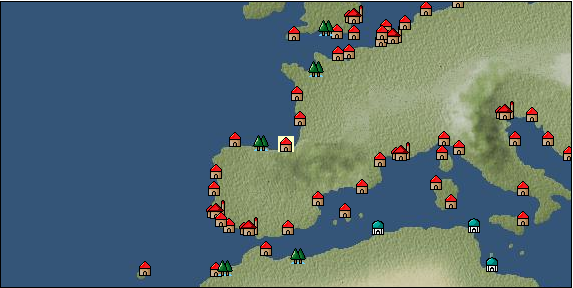

# Port: ビルバオ

import Tabs from '@theme/Tabs';
import TabItem from '@theme/TabItem';

## General Information

| Attribute | Details |
| :--- | :--- |
| **Port Name** | bilbao |
| **Port Type** | 領地 |
| **Region** | western europe |
| **Sea Area** | bay of biscay |
| **Required Language** | spanish |
| **Coordinates** | （16051，2942） |
| **Investment Reward** | [Improved large cannon casting method](Items/Recipe Book/item_5127.md) （必要投資額：2,120,000ドゥカード） |

### Available Facilities

| guild | intermediary | exchange | tool shop | workshop craftsman | Painter | sculptor | peddler |
| --- | --- | --- | --- | --- | --- | --- | --- |
|   |   | ○ | ○ |   |   |   |   |
| Shipyard Master | Lumbermaker | Sail-maker | weapon craftsman | master | TavernFemale | archive | salesperson |
| --- | --- | --- | --- | --- | --- | --- | --- |
|   |   |   |   | ○ |   |   |   |
| Shipwright | 銀行 | street worker | 王宮 | Trading post | church | suburbs | translator |
| --- | --- | --- | --- | --- | --- | --- | --- |
| ○ | ○ |   |   |   |   |   |   |

<Tabs>
  <TabItem value="trade_goods_sales" label="Trade Goods Sales">

| item | group | purchase price | 同盟時 | remarks |
| --- | --- | --- | --- | --- |
| [corn](Items/Trade Goods/TradeGoods-Foodstuffs/item_138.md) | [Trading items (food items)](Categories/category_3.md) | [Edit Purchase Price](Ports/port_205.md) |  |
| 要投資（必要投資額：500,000） |
| [sheep](Items/Trade Goods/TradeGoods-Livestock/item_253.md) | [Trading Goods (Livestock)](Categories/category_18.md) | 122 | (107) |  |
| [musket gun](Items/Trade Goods/TradeGoods-Firearms/item_584.md) | [Trading Items (Firearms)](Categories/category_17.md) | [Edit Purchase Price](Ports/port_205.md) |  |
| 要投資（必要投資額：320,000） |
| [rye](Items/Trade Goods/TradeGoods-Foodstuffs/item_61.md) | [Trading items (food items)](Categories/category_3.md) | 36 | (32) |  |
| [paper](Items/Trade Goods/TradeGoods-Wares/item_625.md) | [交易品（工業品）](Categories/category_19.md) | (274) | 240 |  |
| Investment required (Required investment amount: 8,500,000) Does not appear at investment amount of 8305000, appears at 8525000 |
| [wool](Items/Trade Goods/TradeGoods-Fibers/item_5.md) | [交易品（繊維）](Categories/category_1.md) | 366 | (321) |  |
| [iron ore](Items/Trade Goods/TradeGoods-Minerals/item_146.md) | [Trading Items (Iron Stone)](Categories/category_7.md) | 642 | (562) |  |
  </TabItem>
  <TabItem value="sale_specialty" label="Sale (Specialty)">

| item | group | sale price | 同盟時 | remarks |
| --- | --- | --- | --- | --- |

#### [Trading products (precious metals)](Categories/category_8.md)

| [佐摩銀](Items/Trade Goods/TradeGoods-Metals/item_3432.md) | [Trading products (precious metals)](Categories/category_8.md) | (32,630) | 38,074 |  |

#### [Trading Items (Firearms)](Categories/category_17.md)

| [tanegashima gun](Items/Trade Goods/TradeGoods-Firearms/item_3423.md) | [Trading Items (Firearms)](Categories/category_17.md) | (32,951) | 38,449 |  |
  </TabItem>
  <TabItem value="sale_no_specialty" label="Sale (No Specialty)">

| item | group | sale price | 同盟時 | remarks |
| --- | --- | --- | --- | --- |

#### [交易品（繊維）](Categories/category_1.md)

| [wool](Items/Trade Goods/TradeGoods-Fibers/item_5.md) | [交易品（繊維）](Categories/category_1.md) | 158 | (177) |  |

#### [Trading Items (Iron Stone)](Categories/category_7.md)

| [iron ore](Items/Trade Goods/TradeGoods-Minerals/item_146.md) | [Trading Items (Iron Stone)](Categories/category_7.md) | 284 | (319) |  |

#### [Trading Goods (Livestock)](Categories/category_18.md)

| [sheep](Items/Trade Goods/TradeGoods-Livestock/item_253.md) | [Trading Goods (Livestock)](Categories/category_18.md) | 54 | (60) |  |

#### [交易品（工業品）](Categories/category_19.md)

| [paper](Items/Trade Goods/TradeGoods-Wares/item_625.md) | [交易品（工業品）](Categories/category_19.md) | (235) | 274 |  |
| Investment required (Required investment amount: 8,500,000) Does not appear at investment amount of 8305000, appears at 8525000 |
  </TabItem>
  <TabItem value="guild_&_others" label="Guild & Others">

| item | group | Sales price | Handling NPC | remarks |
| --- | --- | --- | --- | --- |
| There is no sales information for the item |
| --- |
  </TabItem>
  <TabItem value="toolman" label="Toolman">

| item | group | Sales price | Handling NPC | remarks |
| --- | --- | --- | --- | --- |

#### [recipe book](Categories/category_22.md)

| [Mode Design Collection Volume 1](Items/Recipe Book/item_92.md) | [recipe book](Categories/category_22.md) | 10,000 | tool shop owner |  |
| [Sword training/application](Items/Recipe Book/item_589.md) | [recipe book](Categories/category_22.md) | 50,000 | tool shop owner |  |
| [Textile secrets/fabric book](Items/Recipe Book/item_91.md) | [recipe book](Categories/category_22.md) | 10,000 | tool shop owner |  |

#### [Equipment (belongings)](Categories/category_27.md)

| [flintlock pistol](Items/Equipment/Equipment-Weapon/item_5122.md) | [Equipment (belongings)](Categories/category_27.md) | 3,000 | tool shop owner |  |
| 要投資（必要投資額：180,000） |

#### [Consumables (land battle/deck battle)](Categories/category_29.md)

| [black kite feather](Items/Consumables/Consumables-Landbattle/item_88.md) | [Consumables (land battle/deck battle)](Categories/category_29.md) | 100 | tool shop owner |  |
| [Assortment of wound medicine](Items/Consumables/Consumables-Landbattle/item_90.md) | [Consumables (land battle/deck battle)](Categories/category_29.md) | 500 | tool shop owner |  |
| [therapeutic drug](Items/Consumables/Consumables-Landbattle/item_89.md) | [Consumables (land battle/deck battle)](Categories/category_29.md) | 300 | tool shop owner |  |
| [antidote](Items/Consumables/Consumables-Landbattle/item_270.md) | [Consumables (land battle/deck battle)](Categories/category_29.md) | 100 | tool shop owner |  |

#### [Consumables (other)](Categories/category_44.md)

| [fossil fuel](Items/Consumables/Consumables-Other/item_5425.md) | [Consumables (other)](Categories/category_44.md) | 100,000 | tool shop owner |  |
  </TabItem>
  <TabItem value="production factory" label="production factory">

| item | group | Sales price | Handling NPC | remarks |
| --- | --- | --- | --- | --- |

#### [recipe book](Categories/category_22.md)

| [Production technology book/storage application edition (canning machine)](Items/Recipe Book/item_5149.md) | [recipe book](Categories/category_22.md) | Fixed recipe | production factory |  |
| [Production technology book/Craft application edition (printing machine)](Items/Recipe Book/item_5147.md) | [recipe book](Categories/category_22.md) | Fixed recipe | production factory |  |
| [Production technology book/Sewing application edition (loom)](Items/Recipe Book/item_5145.md) | [recipe book](Categories/category_22.md) | Fixed recipe | production factory |  |
| [Production technology book/Cooking application edition (cooking table)](Items/Recipe Book/item_5150.md) | [recipe book](Categories/category_22.md) | Fixed recipe | production factory |  |
| [Production technology book/casting application edition (blast furnace)](Items/Recipe Book/item_5148.md) | [recipe book](Categories/category_22.md) | Fixed recipe | production factory |  |
  </TabItem>
</Tabs>