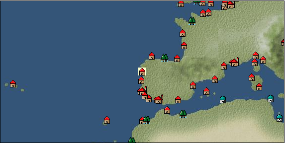

# Port: ヴィアナドカステロ

import Tabs from '@theme/Tabs';
import TabItem from '@theme/TabItem';

## General Information

| Attribute | Details |
| :--- | :--- |
| **Port Name** | Viana do Castelo |
| **Port Type** | 領地 |
| **Region** | western europe |
| **Sea Area** | northeast atlantic |
| **Required Language** | portuguese |
| **Coordinates** | （15770，3052） |
| **Investment Reward** | [Improved large cannon casting method](Items/Recipe Book/item_5127.md) （必要投資額：1,800,000ドゥカード） |

### Available Facilities

| guild | intermediary | exchange | tool shop | workshop craftsman | Painter | sculptor | peddler |
| --- | --- | --- | --- | --- | --- | --- | --- |
|   |   | ○ | ○ |   |   |   |   |
| Shipyard Master | Lumbermaker | Sail-maker | weapon craftsman | master | TavernFemale | archive | salesperson |
| --- | --- | --- | --- | --- | --- | --- | --- |
|   |   |   |   | ○ |   |   |   |
| Shipwright | 銀行 | street worker | 王宮 | Trading post | church | suburbs | translator |
| --- | --- | --- | --- | --- | --- | --- | --- |
| ○ | ○ |   |   |   |   |   |   |

<Tabs>
  <TabItem value="trade_goods_sales" label="Trade Goods Sales">

| item | group | purchase price | 同盟時 | remarks |
| --- | --- | --- | --- | --- |
| [olive oil](Items/Trade Goods/TradeGoods-Seasonings/item_48.md) | [交易品（調味料）](Categories/category_4.md) | (315) | 276 |  |
| 要投資（必要投資額：1,280,000） |
| [tomato](Items/Trade Goods/TradeGoods-Foodstuffs/item_1809.md) | [Trading items (food items)](Categories/category_3.md) | (180) | 158 |  |
| 要投資（必要投資額：8,405,000） |
| [bergamot](Items/Trade Goods/TradeGoods-Spices/item_879.md) | [Trading Goods (Spices)](Categories/category_12.md) | 538 | 472 |  |
| [wine](Items/Trade Goods/TradeGoods-Alcohol/item_11.md) | [交易品（酒類）](Categories/category_9.md) | 429 | 376 |  |
| [log](Items/Trade Goods/TradeGoods-Wares/item_846.md) | [交易品（工業品）](Categories/category_19.md) | 380 | 334 |  |
| [leather thong](Items/Trade Goods/TradeGoods-Luxuries/item_623.md) | [Trading goods (artificial goods)](Categories/category_13.md) | (896) | 784 |  |
| 要投資（必要投資額：7,128,000） |
  </TabItem>
  <TabItem value="sale_specialty" label="Sale (Specialty)">

| item | group | sale price | 同盟時 | remarks |
| --- | --- | --- | --- | --- |

#### [交易品（繊維）](Categories/category_1.md)

| [Green ramie](Items/Trade Goods/TradeGoods-Fibers/item_3428.md) | [交易品（繊維）](Categories/category_1.md) | (23,716) | 27,673 |  |
| [deerskin](Items/Trade Goods/TradeGoods-Fibers/item_3648.md) | [交易品（繊維）](Categories/category_1.md) | (31,517) | 36,775 |  |

#### [Trading products (medical products)](Categories/category_6.md)

| [Cordyceps sinensis](Items/Trade Goods/TradeGoods-Medicine/item_3839.md) | [Trading products (medical products)](Categories/category_6.md) | (24,728) | 28,853 |  |
| [Centennial grass](Items/Trade Goods/TradeGoods-Medicine/item_5503.md) | [Trading products (medical products)](Categories/category_6.md) | (9,529) | 11,118 |  |

#### [交易品（酒類）](Categories/category_9.md)

| [whiskey](Items/Trade Goods/TradeGoods-Alcohol/item_1.md) | [交易品（酒類）](Categories/category_9.md) | (771) | 899 |  |
| [Taiwan rice wine](Items/Trade Goods/TradeGoods-Alcohol/item_3672.md) | [交易品（酒類）](Categories/category_9.md) | (22,711) | 26,500 |  |
| [Andong soju](Items/Trade Goods/TradeGoods-Alcohol/item_3757.md) | [交易品（酒類）](Categories/category_9.md) | (22,921) | 26,745 |  |
| [Sake](Items/Trade Goods/TradeGoods-Alcohol/item_3424.md) | [交易品（酒類）](Categories/category_9.md) | (25,108) | 29,297 |  |
| Home territory 100% confirmed |
| [紹興酒](Items/Trade Goods/TradeGoods-Alcohol/item_3882.md) | [交易品（酒類）](Categories/category_9.md) | (25,354) | 29,584 |  |

#### [Trading goods (hobby goods)](Categories/category_10.md)

| [Aigyoku](Items/Trade Goods/TradeGoods-Sunddries/item_3677.md) | [Trading goods (hobby goods)](Categories/category_10.md) | (22,594) | 26,364 |  |
| [cacao](Items/Trade Goods/TradeGoods-Sunddries/item_140.md) | [Trading goods (hobby goods)](Categories/category_10.md) | (1,234) | 1,439 |  |
| [cranberry](Items/Trade Goods/TradeGoods-Sunddries/item_4008.md) | [Trading goods (hobby goods)](Categories/category_10.md) | (948) | 1,106 |  |
| [tobacco](Items/Trade Goods/TradeGoods-Sunddries/item_109.md) | [Trading goods (hobby goods)](Categories/category_10.md) | (4,723) | 5,510 |  |
| [chicle](Items/Trade Goods/TradeGoods-Sunddries/item_4083.md) | [Trading goods (hobby goods)](Categories/category_10.md) | (1,788) | 2,086 |  |
| [pineapple](Items/Trade Goods/TradeGoods-Sunddries/item_867.md) | [Trading goods (hobby goods)](Categories/category_10.md) | (1,738) | 2,028 |  |
| [peanuts](Items/Trade Goods/TradeGoods-Sunddries/item_134.md) | [Trading goods (hobby goods)](Categories/category_10.md) | (374) | 436 |  |

#### [Trading Goods (Spices)](Categories/category_12.md)

| [mace](Items/Trade Goods/TradeGoods-Spices/item_2100.md) | [Trading Goods (Spices)](Categories/category_12.md) | (19,505) | 22,759 |  |

#### [Trading goods (artificial goods)](Categories/category_13.md)

| [湖筆](Items/Trade Goods/TradeGoods-Luxuries/item_3898.md) | [Trading goods (artificial goods)](Categories/category_13.md) | (37,966) | 44,300 |  |

#### [交易品（美術品）](Categories/category_14.md)

| [taiwan wood carving](Items/Trade Goods/TradeGoods-Art/item_3697.md) | [交易品（美術品）](Categories/category_14.md) | (32,946) | 38,443 |  |

#### [Trading Items (Gemstones)](Categories/category_15.md)

| [ruby](Items/Trade Goods/TradeGoods-Gems/item_773.md) | [Trading Items (Gemstones)](Categories/category_15.md) | (10,592) | 12,359 |  |
  </TabItem>
  <TabItem value="sale_no_specialty" label="Sale (No Specialty)">

| item | group | sale price | 同盟時 | remarks |
| --- | --- | --- | --- | --- |

#### [Trading items (food items)](Categories/category_3.md)

| [horse mackerel](Items/Trade Goods/TradeGoods-Foodstuffs/item_161.md) | [Trading items (food items)](Categories/category_3.md) | (28) | 32 |  |
| [sardine](Items/Trade Goods/TradeGoods-Foodstuffs/item_39.md) | [Trading items (food items)](Categories/category_3.md) | (14) | 16 |  |
| [Flatfish](Items/Trade Goods/TradeGoods-Foodstuffs/item_255.md) | [Trading items (food items)](Categories/category_3.md) | (28) | 32 |  |
| [Kinmedai](Items/Trade Goods/TradeGoods-Foodstuffs/item_2185.md) | [Trading items (food items)](Categories/category_3.md) | (70) | 81 |  |
| [Pacific saury](Items/Trade Goods/TradeGoods-Foodstuffs/item_700.md) | [Trading items (food items)](Categories/category_3.md) | (28) | 32 |  |
| [sole](Items/Trade Goods/TradeGoods-Foodstuffs/item_45.md) | [Trading items (food items)](Categories/category_3.md) | (98) | 114 |  |
| [herring](Items/Trade Goods/TradeGoods-Foodstuffs/item_698.md) | [Trading items (food items)](Categories/category_3.md) | (28) | 32 |  |
| [Gurnard](Items/Trade Goods/TradeGoods-Foodstuffs/item_2202.md) | [Trading items (food items)](Categories/category_3.md) | (28) | 32 |  |
| [Squid](Items/Trade Goods/TradeGoods-Foodstuffs/item_524.md) | [Trading items (food items)](Categories/category_3.md) | (53) | 61 |  |

#### [Trading Items (Iron Stone)](Categories/category_7.md)

| [iron ore](Items/Trade Goods/TradeGoods-Minerals/item_146.md) | [Trading Items (Iron Stone)](Categories/category_7.md) | (672) | 784 |  |

#### [交易品（酒類）](Categories/category_9.md)

| [rum](Items/Trade Goods/TradeGoods-Alcohol/item_139.md) | [交易品（酒類）](Categories/category_9.md) | (642) | 749 |  |

#### [Trading Goods (Spices)](Categories/category_12.md)

| [bergamot](Items/Trade Goods/TradeGoods-Spices/item_879.md) | [Trading Goods (Spices)](Categories/category_12.md) | (203) | 236 |  |
  </TabItem>
  <TabItem value="guild_&_others" label="Guild & Others">

| item | group | Sales price | Handling NPC | remarks |
| --- | --- | --- | --- | --- |
| There is no sales information for the item |
| --- |
  </TabItem>
  <TabItem value="toolman" label="Toolman">

| item | group | Sales price | Handling NPC | remarks |
| --- | --- | --- | --- | --- |

#### [recipe book](Categories/category_22.md)

| [Mode Design Collection Volume 1](Items/Recipe Book/item_92.md) | [recipe book](Categories/category_22.md) | 10,000 | tool shop owner |  |
| [Sword training/application](Items/Recipe Book/item_589.md) | [recipe book](Categories/category_22.md) | 50,000 | tool shop owner |  |
| [Textile secrets/fabric book](Items/Recipe Book/item_91.md) | [recipe book](Categories/category_22.md) | 10,000 | tool shop owner |  |

#### [Equipment (belongings)](Categories/category_27.md)

| [flintlock pistol](Items/Equipment/Equipment-Weapon/item_5122.md) | [Equipment (belongings)](Categories/category_27.md) | 3,000 | tool shop owner |  |
| 要投資（必要投資額：180,000） |

#### [Consumables (land battle/deck battle)](Categories/category_29.md)

| [black kite feather](Items/Consumables/Consumables-Landbattle/item_88.md) | [Consumables (land battle/deck battle)](Categories/category_29.md) | 100 | tool shop owner |  |
| [Assortment of wound medicine](Items/Consumables/Consumables-Landbattle/item_90.md) | [Consumables (land battle/deck battle)](Categories/category_29.md) | 500 | tool shop owner |  |
| [therapeutic drug](Items/Consumables/Consumables-Landbattle/item_89.md) | [Consumables (land battle/deck battle)](Categories/category_29.md) | 300 | tool shop owner |  |
| [antidote](Items/Consumables/Consumables-Landbattle/item_270.md) | [Consumables (land battle/deck battle)](Categories/category_29.md) | 100 | tool shop owner |  |

#### [Consumables (other)](Categories/category_44.md)

| [fossil fuel](Items/Consumables/Consumables-Other/item_5425.md) | [Consumables (other)](Categories/category_44.md) | 100,000 | tool shop owner |  |
  </TabItem>
  <TabItem value="production factory" label="production factory">

| item | group | Sales price | Handling NPC | remarks |
| --- | --- | --- | --- | --- |

#### [recipe book](Categories/category_22.md)

| [Production technology book/storage application edition (canning machine)](Items/Recipe Book/item_5149.md) | [recipe book](Categories/category_22.md) | Fixed recipe | production factory |  |
| [Production technology book/Craft application edition (printing machine)](Items/Recipe Book/item_5147.md) | [recipe book](Categories/category_22.md) | Fixed recipe | production factory |  |
| [Production technology book/Sewing application edition (loom)](Items/Recipe Book/item_5145.md) | [recipe book](Categories/category_22.md) | Fixed recipe | production factory |  |
| [Production technology book/Cooking application edition (cooking table)](Items/Recipe Book/item_5150.md) | [recipe book](Categories/category_22.md) | Fixed recipe | production factory |  |
| [Production technology book/casting application edition (blast furnace)](Items/Recipe Book/item_5148.md) | [recipe book](Categories/category_22.md) | Fixed recipe | production factory |  |

#### [Boat](Categories/category_43.md)

| [Clermont](Items/Ships/item_5421.md) | [Boat](Categories/category_43.md) | Fixed recipe | production factory |  |
  </TabItem>
</Tabs>