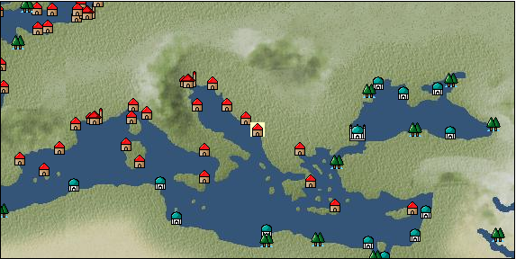

# Port: Cattaro

import Tabs from '@theme/Tabs';
import TabItem from '@theme/TabItem';

## General Information

| Attribute | Details |
| :--- | :--- |
| **Port Name** | Cattaro |
| **Port Type** | 領地 |
| **Region** | eastern europe |
| **Sea Area** | adriatic sea |
| **Required Language** |  |
| **Coordinates** | （852，3030） |
| **Investment Reward** | [Improved large cannon casting method](docs/Items/RecipeBooks/item_5127.md) （必要投資額：2,120,000ドゥカード） |

### Available Facilities

| guild | intermediary | exchange | tool shop | workshop craftsman | Painter | sculptor | peddler |
| --- | --- | --- | --- | --- | --- | --- | --- |
|   |   | ○ | ○ |   |   |   |   |
| Shipyard Master | Lumbermaker | Sail-maker | weapon craftsman | master | TavernFemale | archive | salesperson |
| --- | --- | --- | --- | --- | --- | --- | --- |
|   |   |   |   | ○ |   |   |   |
| Shipwright | 銀行 | street worker | 王宮 | Trading post | church | suburbs | translator |
| --- | --- | --- | --- | --- | --- | --- | --- |
| ○ | ○ |   |   |   |   |   |   |

<Tabs>
  <TabItem value="trade_goods_sales" label="Trade Goods Sales">

| Item | Group | Purchase Price | Allied Price | Remarks |
| --- | --- | --- | --- | --- |
| [basil](docs/Items/TradeGoods/TradeGoods-Spices/item_126.md) | [Trading Goods (Spices)](docs/Categories/category_12.md) | (118) | 104 |  |
| 要投資（必要投資額：1,120,000） |
| [prune](docs/Items/TradeGoods/TradeGoods-Sunddries/item_523.md) | [Trading goods (hobby goods)](docs/Categories/category_10.md) | 288 | (252) |  |
| 要投資（必要投資額：1,120,000） |
| [wheat](docs/Items/TradeGoods/TradeGoods-Foodstuffs/item_16.md) | [Trading items (food items)](docs/Categories/category_3.md) | (45) | 40 |  |
| [wood](docs/Items/TradeGoods/TradeGoods-Wares/item_277.md) | [交易品（工業品）](docs/Categories/category_19.md) | (676) | 592 |  |
| [iron material](docs/Items/TradeGoods/TradeGoods-Wares/item_268.md) | [交易品（工業品）](docs/Categories/category_19.md) | (804) | 704 |  |
| [鋼](docs/Items/TradeGoods/TradeGoods-Wares/item_573.md) | [交易品（工業品）](docs/Categories/category_19.md) | 975 | (854) |  |
| Investment required (Required investment amount: 8,500,000) Development level 85000 |
| [魚肉](docs/Items/TradeGoods/TradeGoods-Foodstuffs/item_10.md) | [Trading items (food items)](docs/Categories/category_3.md) | (146) | 128 |  |
  </TabItem>
  <TabItem value="sale_specialty" label="Sale (Specialty)">

| Item | Group | sale price | Allied Price | Remarks |
| --- | --- | --- | --- | --- |

#### [交易品（繊維）](docs/Categories/category_1.md)

| [Basho](docs/Items/TradeGoods/TradeGoods-Fibers/item_3862.md) | 交易品（繊維） | (27,507) | 32,096 |  |
| [flax](docs/Items/TradeGoods/TradeGoods-Fibers/item_64.md) | 交易品（繊維） | (279) | 325 |  |

#### [交易品（調味料）](docs/Categories/category_4.md)

| [Sha Cha Ji](docs/Items/TradeGoods/TradeGoods-Seasonings/item_3689.md) | 交易品（調味料） | (32,352) | 37,750 |  |

#### [交易品（雑貨）](docs/Categories/category_5.md)

| [lantern](docs/Items/TradeGoods/TradeGoods-Misc/item_3683.md) | 交易品（雑貨） | (36,446) | 42,527 |  |

#### [Trading products (medical products)](docs/Categories/category_6.md)

| [heath](docs/Items/TradeGoods/TradeGoods-Medicine/item_63.md) | Trading products (medical products) | (366) | 427 |  |

#### [交易品（酒類）](docs/Categories/category_9.md)

| [aquavit](docs/Items/TradeGoods/TradeGoods-Alcohol/item_572.md) | 交易品（酒類） | (808) | 942 |  |

#### [Trading Goods (Spices)](docs/Categories/category_11.md)

| [gardenia](docs/Items/TradeGoods/TradeGoods-Perfume/item_1091.md) | Trading Goods (Spices) | (23,821) | 27,795 |  |

#### [Trading Goods (Spices)](docs/Categories/category_12.md)

| [nutmeg](docs/Items/TradeGoods/TradeGoods-Spices/item_1969.md) | Trading Goods (Spices) | (20,737) | 24,197 |  |
| [mace](docs/Items/TradeGoods/TradeGoods-Spices/item_2100.md) | Trading Goods (Spices) | (19,609) | 22,880 |  |

#### [Trading goods (artificial goods)](docs/Categories/category_13.md)

| [african wood carving](docs/Items/TradeGoods/TradeGoods-Luxuries/item_5558.md) | Trading goods (artificial goods) | (3,914) | 4,567 |  |
| [Song Baici](docs/Items/TradeGoods/TradeGoods-Luxuries/item_3904.md) | Trading goods (artificial goods) | (33,280) | 38,832 |  |

#### [Trading Items (Gemstones)](docs/Categories/category_15.md)

| [alexandrite](docs/Items/TradeGoods/TradeGoods-Gems/item_4429.md) | Trading Items (Gemstones) | (5,228) | 6,100 |  |

#### [交易品（織物）](docs/Categories/category_20.md)

| [dutch calico](docs/Items/TradeGoods/TradeGoods-Fabrics/item_1435.md) | 交易品（織物） | (1,197) | 1,396 |  |
| [felt](docs/Items/TradeGoods/TradeGoods-Fabrics/item_4439.md) | 交易品（織物） | (1,149) | 1,340 |  |
  </TabItem>
  <TabItem value="sale_no_specialty" label="Sale (No Specialty)">

| Item | Group | sale price | Allied Price | Remarks |
| --- | --- | --- | --- | --- |

#### [交易品（繊維）](docs/Categories/category_1.md)

| [rabbit hair](docs/Items/TradeGoods/TradeGoods-Fibers/item_1036.md) | 交易品（繊維） | (837) | 976 |  |

#### [Trading items (food items)](docs/Categories/category_3.md)

| [european crayfish](docs/Items/TradeGoods/TradeGoods-Foodstuffs/item_6188.md) | Trading items (food items) | (5,436) | 6,343 |  |

#### [交易品（雑貨）](docs/Categories/category_5.md)

| [Western books](docs/Items/TradeGoods/TradeGoods-Misc/item_293.md) | 交易品（雑貨） | (628) | 732 |  |

#### [Trading Items (Iron Stone)](docs/Categories/category_7.md)

| [iron ore](docs/Items/TradeGoods/TradeGoods-Minerals/item_146.md) | Trading Items (Iron Stone) | (804) | 938 |  |

#### [Trading products (precious metals)](docs/Categories/category_8.md)

| [gold](docs/Items/TradeGoods/TradeGoods-Metals/item_659.md) | Trading products (precious metals) | (8,921) | 10,409 |  |

#### [交易品（酒類）](docs/Categories/category_9.md)

| [vodka](docs/Items/TradeGoods/TradeGoods-Alcohol/item_579.md) | 交易品（酒類） | (634) | 739 |  |

#### [Trading Items (Gemstones)](docs/Categories/category_15.md)

| [crystal](docs/Items/TradeGoods/TradeGoods-Gems/item_893.md) | Trading Items (Gemstones) | (1,846) | 2,154 |  |

#### [交易品（工業品）](docs/Categories/category_19.md)

| [oil](docs/Items/TradeGoods/TradeGoods-Wares/item_613.md) | 交易品（工業品） | (540) | 630 |  |
  </TabItem>
  <TabItem value="guild_&_others" label="Guild & Others">

| Item | Group | Sales price | Handling NPC | Remarks |
| --- | --- | --- | --- | --- |
| There is no sales information for the Item |
| --- |
  </TabItem>
  <TabItem value="toolman" label="Toolman">

| Item | Group | Sales price | Handling NPC | Remarks |
| --- | --- | --- | --- | --- |

#### [recipe book](docs/Categories/category_22.md)

| [Mode Design Collection Volume 1](docs/Items/RecipeBooks/item_92.md) | recipe book | 10,000 | tool shop owner |  |
| [Sword training/application](docs/Items/RecipeBooks/item_589.md) | recipe book | 50,000 | tool shop owner |  |
| [Textile secrets/fabric book](docs/Items/RecipeBooks/item_91.md) | recipe book | 10,000 | tool shop owner |  |

#### [Equipment (belongings)](docs/Categories/category_27.md)

| [flintlock pistol](docs/Items/Equipment/Equipment-Weapon/item_5122.md) | Equipment (belongings) | 3,000 | tool shop owner |  |
| 要投資（必要投資額：180,000） |

#### [Consumables (land battle/deck battle)](docs/Categories/category_29.md)

| [black kite feather](docs/Items/Consumables/Consumables-Landbattle/item_88.md) | Consumables (land battle/deck battle) | 100 | tool shop owner |  |
| [Assortment of wound medicine](docs/Items/Consumables/Consumables-Landbattle/item_90.md) | Consumables (land battle/deck battle) | 500 | tool shop owner |  |
| [therapeutic drug](docs/Items/Consumables/Consumables-Landbattle/item_89.md) | Consumables (land battle/deck battle) | 300 | tool shop owner |  |
| [antidote](docs/Items/Consumables/Consumables-Landbattle/item_270.md) | Consumables (land battle/deck battle) | 100 | tool shop owner |  |

#### [Consumables (other)](docs/Categories/category_44.md)

| [fossil fuel](docs/Items/Consumables/Consumables-Other/item_5425.md) | Consumables (other) | 100,000 | tool shop owner |  |
  </TabItem>
  <TabItem value="production factory" label="production factory">

| Item | Group | Sales price | Handling NPC | Remarks |
| --- | --- | --- | --- | --- |

#### [recipe book](docs/Categories/category_22.md)

| [Production technology book/storage application edition (canning machine)](docs/Items/RecipeBooks/item_5149.md) | recipe book | Fixed recipe | production factory |  |
| [Production technology book/Craft application edition (printing machine)](docs/Items/RecipeBooks/item_5147.md) | recipe book | Fixed recipe | production factory |  |
| [Production technology book/Sewing application edition (loom)](docs/Items/RecipeBooks/item_5145.md) | recipe book | Fixed recipe | production factory |  |
| [Production technology book/Cooking application edition (cooking table)](docs/Items/RecipeBooks/item_5150.md) | recipe book | Fixed recipe | production factory |  |
| [Production technology book/casting application edition (blast furnace)](docs/Items/RecipeBooks/item_5148.md) | recipe book | Fixed recipe | production factory |  |
  </TabItem>
</Tabs>