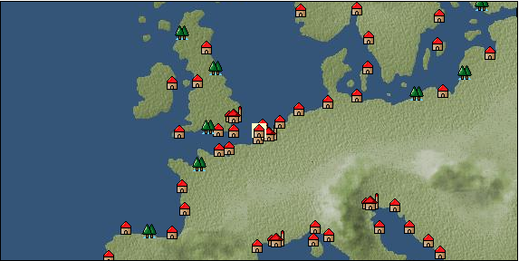

# Port: ロッテルダム

import Tabs from '@theme/Tabs';
import TabItem from '@theme/TabItem';

## General Information

| Attribute | Details |
| :--- | :--- |
| **Port Name** | rotterdam |
| **Port Type** | 領地 |
| **Region** | northern europe |
| **Sea Area** | North Sea |
| **Required Language** | dutch |
| **Coordinates** | （52，2492） |
| **Investment Reward** | [Improved large cannon casting method](Items/Recipe Book/item_5127.md) （必要投資額：2,000,000ドゥカード） |

### Available Facilities

| guild | intermediary | exchange | tool shop | workshop craftsman | Painter | sculptor | peddler |
| --- | --- | --- | --- | --- | --- | --- | --- |
|   |   | ○ | ○ |   |   |   |   |
| Shipyard Master | Lumbermaker | Sail-maker | weapon craftsman | master | TavernFemale | archive | salesperson |
| --- | --- | --- | --- | --- | --- | --- | --- |
|   |   |   |   | ○ |   |   |   |
| Shipwright | 銀行 | street worker | 王宮 | Trading post | church | suburbs | translator |
| --- | --- | --- | --- | --- | --- | --- | --- |
| ○ | ○ |   |   |   |   |   |   |

### Description
A city facing the North Sea. It is located at the point where several rivers, including the Rhine, flow into the North Sea. It developed as a port city from around the 16th century and has become a key point in Atlantic trade. Cultural area: Low Countries

<Tabs>
  <TabItem value="trade_goods_sales" label="Trade Goods Sales">

| item | group | purchase price | 同盟時 | remarks |
| --- | --- | --- | --- | --- |
| [potato](Items/Trade Goods/TradeGoods-Foodstuffs/item_106.md) | [Trading items (food items)](Categories/category_3.md) | (265) | 232 |  |
| [tin ore](Items/Trade Goods/TradeGoods-Minerals/item_23.md) | [Trading Items (Iron Stone)](Categories/category_7.md) | (484) | 424 |  |
| 要投資（必要投資額：600,000） |
| [onion](Items/Trade Goods/TradeGoods-Foodstuffs/item_28.md) | [Trading items (food items)](Categories/category_3.md) | (82) | 72 |  |
| [wax](Items/Trade Goods/TradeGoods-Wares/item_54.md) | [交易品（工業品）](Categories/category_19.md) | (768) | 672 |  |
| [zinc ore](Items/Trade Goods/TradeGoods-Minerals/item_626.md) | [Trading Items (Iron Stone)](Categories/category_7.md) | (384) | 336 |  |
| 要投資（必要投資額：600,000） |
| [oil](Items/Trade Goods/TradeGoods-Wares/item_613.md) | [交易品（工業品）](Categories/category_19.md) | (580) | 508 |  |
| 要投資（必要投資額：8,500,000） |
| [pork](Items/Trade Goods/TradeGoods-Foodstuffs/item_41.md) | [Trading items (food items)](Categories/category_3.md) | (347) | 304 |  |
  </TabItem>
  <TabItem value="sale_specialty" label="Sale (Specialty)">

| item | group | sale price | 同盟時 | remarks |
| --- | --- | --- | --- | --- |

#### [交易品（酒類）](Categories/category_9.md)

| [Andong soju](Items/Trade Goods/TradeGoods-Alcohol/item_3757.md) | 交易品（酒類） | 32,500 | 37,700 |  |

#### [交易品（美術品）](Categories/category_14.md)

| [oil painting](Items/Trade Goods/TradeGoods-Art/item_1088.md) | 交易品（美術品） | (2,280) | 2,660 |  |
  </TabItem>
  <TabItem value="sale_no_specialty" label="Sale (No Specialty)">

| item | group | sale price | 同盟時 | remarks |
| --- | --- | --- | --- | --- |

#### [Trading Items (Firearms)](Categories/category_17.md)

| [cannonball](Items/Trade Goods/TradeGoods-Firearms/item_144.md) | Trading Items (Firearms) | (1,552) | 1,810 |  |
  </TabItem>
  <TabItem value="guild_&_others" label="Guild & Others">

| item | group | Sales price | Handling NPC | remarks |
| --- | --- | --- | --- | --- |
| There is no sales information for the item |
| --- |
  </TabItem>
  <TabItem value="toolman" label="Toolman">

| item | group | Sales price | Handling NPC | remarks |
| --- | --- | --- | --- | --- |

#### [recipe book](Categories/category_22.md)

| [Mode Design Collection Volume 1](Items/Recipe Book/item_92.md) | recipe book | 10,000 | tool shop owner |  |
| [Sword training/application](Items/Recipe Book/item_589.md) | recipe book | 50,000 | tool shop owner |  |
| [Textile secrets/fabric book](Items/Recipe Book/item_91.md) | recipe book | 10,000 | tool shop owner |  |

#### [Equipment (belongings)](Categories/category_27.md)

| [flintlock pistol](Items/Equipment/Equipment-Weapon/item_5122.md) | Equipment (belongings) | 3,000 | tool shop owner |  |
| 要投資（必要投資額：180,000） |

#### [Consumables (land battle/deck battle)](Categories/category_29.md)

| [black kite feather](Items/Consumables/Consumables-Landbattle/item_88.md) | Consumables (land battle/deck battle) | 100 | tool shop owner |  |
| [Assortment of wound medicine](Items/Consumables/Consumables-Landbattle/item_90.md) | Consumables (land battle/deck battle) | 500 | tool shop owner |  |
| [therapeutic drug](Items/Consumables/Consumables-Landbattle/item_89.md) | Consumables (land battle/deck battle) | 300 | tool shop owner |  |
| [antidote](Items/Consumables/Consumables-Landbattle/item_270.md) | Consumables (land battle/deck battle) | 100 | tool shop owner |  |

#### [Consumables (other)](Categories/category_44.md)

| [fossil fuel](Items/Consumables/Consumables-Other/item_5425.md) | Consumables (other) | 100,000 | tool shop owner |  |
  </TabItem>
  <TabItem value="production factory" label="production factory">

| item | group | Sales price | Handling NPC | remarks |
| --- | --- | --- | --- | --- |

#### [recipe book](Categories/category_22.md)

| [Production technology book/storage application edition (canning machine)](Items/Recipe Book/item_5149.md) | recipe book | Fixed recipe | production factory |  |
| [Production technology book/Craft application edition (printing machine)](Items/Recipe Book/item_5147.md) | recipe book | Fixed recipe | production factory |  |
| [Production technology book/Sewing application edition (loom)](Items/Recipe Book/item_5145.md) | recipe book | Fixed recipe | production factory |  |
| [Production technology book/Cooking application edition (cooking table)](Items/Recipe Book/item_5150.md) | recipe book | Fixed recipe | production factory |  |
| [Production technology book/casting application edition (blast furnace)](Items/Recipe Book/item_5148.md) | recipe book | Fixed recipe | production factory |  |
  </TabItem>
</Tabs>