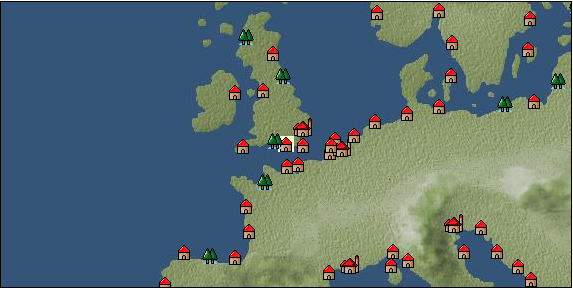

# Port: ポーツマス

import Tabs from '@theme/Tabs';
import TabItem from '@theme/TabItem';

## General Information

| Attribute | Details |
| :--- | :--- |
| **Port Name** | portsmouth |
| **Port Type** | 領地 |
| **Region** | northern europe |
| **Sea Area** | Southern Britain |
| **Required Language** | English |
| **Coordinates** | （16256，2488） |
| **Investment Reward** | [Improved large cannon casting method](Items/Recipe Book/item_5127.md) （必要投資額：2,000,000ドゥカード） |

### Available Facilities

| guild | intermediary | exchange | tool shop | workshop craftsman | Painter | sculptor | peddler |
| --- | --- | --- | --- | --- | --- | --- | --- |
|   |   | ○ | ○ |   |   |   |   |
| Shipyard Master | Lumbermaker | Sail-maker | weapon craftsman | master | TavernFemale | archive | salesperson |
| --- | --- | --- | --- | --- | --- | --- | --- |
|   |   |   |   | ○ |   |   |   |
| Shipwright | 銀行 | street worker | 王宮 | Trading post | church | suburbs | translator |
| --- | --- | --- | --- | --- | --- | --- | --- |
| ○ | ○ |   |   |   |   |   |   |

### Description
A town in southern Britain. It served as a military port during the Crusades and the war with France. Following the industrial revolution, the country developed around shipbuilding. industrial revolution city

<Tabs>
  <TabItem value="trade_goods_sales" label="Trade Goods Sales">

| item | group | purchase price | 同盟時 | remarks |
| --- | --- | --- | --- | --- |
| [garlic](Items/Trade Goods/TradeGoods-Spices/item_526.md) | [Trading Goods (Spices)](Categories/category_12.md) | (278) | 244 |  |
| [bacon](Items/Trade Goods/TradeGoods-Foodstuffs/item_566.md) | [Trading items (food items)](Categories/category_3.md) | (370) | 324 |  |
| 要投資（必要投資額：不明） 251k以上270k以下 |
| [大砲](Items/Trade Goods/TradeGoods-Firearms/item_4.md) | [Trading Items (Firearms)](Categories/category_17.md) | 3,575 | (3,128) |  |
| 要投資（必要投資額：8,500,000） |
| [woolen fabric](Items/Trade Goods/TradeGoods-Fabrics/item_163.md) | [交易品（織物）](Categories/category_20.md) | (928) | 812 |  |
| [coal](Items/Trade Goods/TradeGoods-Wares/item_359.md) | [交易品（工業品）](Categories/category_19.md) | (475) | 416 |  |
| 要投資（必要投資額：不明） 291k以上310k以下 |
| [mutton](Items/Trade Goods/TradeGoods-Foodstuffs/item_33.md) | [Trading items (food items)](Categories/category_3.md) | (361) | 316 |  |
| [pork](Items/Trade Goods/TradeGoods-Foodstuffs/item_41.md) | [Trading items (food items)](Categories/category_3.md) | (347) | 304 |  |
  </TabItem>
  <TabItem value="sale_specialty" label="Sale (Specialty)">

| item | group | sale price | 同盟時 | remarks |
| --- | --- | --- | --- | --- |

#### [交易品（繊維）](Categories/category_1.md)

| [Green ramie](Items/Trade Goods/TradeGoods-Fibers/item_3428.md) | 交易品（繊維） | (24,128) | 28,153 |  |
| [deerskin](Items/Trade Goods/TradeGoods-Fibers/item_3648.md) | 交易品（繊維） | (23,092) | 26,945 |  |

#### [交易品（雑貨）](Categories/category_5.md)

| [old ink stick](Items/Trade Goods/TradeGoods-Misc/item_3921.md) | 交易品（雑貨） | (10,027) | 11,700 |  |

#### [Trading products (medical products)](Categories/category_6.md)

| [Borei](Items/Trade Goods/TradeGoods-Medicine/item_3678.md) | Trading products (medical products) | (23,339) | 27,233 |  |

#### [Trading Items (Iron Stone)](Categories/category_7.md)

| [white porcelain ore](Items/Trade Goods/TradeGoods-Minerals/item_3433.md) | Trading Items (Iron Stone) | (25,808) | 30,114 |  |

#### [交易品（酒類）](Categories/category_9.md)

| [Taiwan rice wine](Items/Trade Goods/TradeGoods-Alcohol/item_3672.md) | 交易品（酒類） | (32,309) | 37,700 |  |
| 2017.11.12 Home country 100% = 37,700 confirmed |
| [Sake](Items/Trade Goods/TradeGoods-Alcohol/item_3424.md) | 交易品（酒類） | (25,945) | 30,274 |  |

#### [Trading goods (hobby goods)](Categories/category_10.md)

| [Aigyoku](Items/Trade Goods/TradeGoods-Sunddries/item_3677.md) | Trading goods (hobby goods) | (22,520) | 26,277 |  |
| [cacao](Items/Trade Goods/TradeGoods-Sunddries/item_140.md) | Trading goods (hobby goods) | (1,524) | 1,778 |  |
| [cranberry](Items/Trade Goods/TradeGoods-Sunddries/item_4008.md) | Trading goods (hobby goods) | (1,083) | 1,263 |  |
| [tobacco](Items/Trade Goods/TradeGoods-Sunddries/item_109.md) | Trading goods (hobby goods) | (4,815) | 5,618 |  |
| [chicle](Items/Trade Goods/TradeGoods-Sunddries/item_4083.md) | Trading goods (hobby goods) | (2,117) | 2,470 |  |
| [pineapple](Items/Trade Goods/TradeGoods-Sunddries/item_867.md) | Trading goods (hobby goods) | (2,018) | 2,354 |  |
| [peanuts](Items/Trade Goods/TradeGoods-Sunddries/item_134.md) | Trading goods (hobby goods) | (387) | 451 |  |

#### [Trading goods (artificial goods)](Categories/category_13.md)

| [Kuresute](Items/Trade Goods/TradeGoods-Luxuries/item_3897.md) | Trading goods (artificial goods) | (40,289) | 47,011 |  |

#### [交易品（美術品）](Categories/category_14.md)

| [taiwan wood carving](Items/Trade Goods/TradeGoods-Art/item_3697.md) | 交易品（美術品） | (33,172) | 38,707 |  |

#### [Trading Goods (Livestock)](Categories/category_18.md)

| [boar](Items/Trade Goods/TradeGoods-Livestock/item_3476.md) | Trading Goods (Livestock) | (23,825) | 27,800 |  |

#### [交易品（工業品）](Categories/category_19.md)

| [Japanese paper](Items/Trade Goods/TradeGoods-Wares/item_3438.md) | 交易品（工業品） | (32,652) | 38,100 |  |

#### [交易品（織物）](Categories/category_20.md)

| [Nishijin textile](Items/Trade Goods/TradeGoods-Fabrics/item_3431.md) | 交易品（織物） | (33,771) | 39,405 |  |
  </TabItem>
  <TabItem value="sale_no_specialty" label="Sale (No Specialty)">

| item | group | sale price | 同盟時 | remarks |
| --- | --- | --- | --- | --- |
| There is no information on the sale of trade goods. |
  </TabItem>
  <TabItem value="guild_&_others" label="Guild & Others">

| item | group | Sales price | Handling NPC | remarks |
| --- | --- | --- | --- | --- |
| There is no sales information for the item |
| --- |
  </TabItem>
  <TabItem value="toolman" label="Toolman">

| item | group | Sales price | Handling NPC | remarks |
| --- | --- | --- | --- | --- |

#### [recipe book](Categories/category_22.md)

| [Mode Design Collection Volume 1](Items/Recipe Book/item_92.md) | recipe book | 10,000 | tool shop owner |  |
| [Sword training/application](Items/Recipe Book/item_589.md) | recipe book | 50,000 | tool shop owner |  |
| [Textile secrets/fabric book](Items/Recipe Book/item_91.md) | recipe book | 10,000 | tool shop owner |  |

#### [Equipment (belongings)](Categories/category_27.md)

| [flintlock pistol](Items/Equipment/Equipment-Weapon/item_5122.md) | Equipment (belongings) | 3,000 | tool shop owner |  |
| 要投資（必要投資額：180,000） |

#### [Consumables (land battle/deck battle)](Categories/category_29.md)

| [black kite feather](Items/Consumables/Consumables-Landbattle/item_88.md) | Consumables (land battle/deck battle) | 100 | tool shop owner |  |
| [Assortment of wound medicine](Items/Consumables/Consumables-Landbattle/item_90.md) | Consumables (land battle/deck battle) | 500 | tool shop owner |  |
| [therapeutic drug](Items/Consumables/Consumables-Landbattle/item_89.md) | Consumables (land battle/deck battle) | 300 | tool shop owner |  |
| [antidote](Items/Consumables/Consumables-Landbattle/item_270.md) | Consumables (land battle/deck battle) | 100 | tool shop owner |  |

#### [Consumables (other)](Categories/category_44.md)

| [fossil fuel](Items/Consumables/Consumables-Other/item_5425.md) | Consumables (other) | 100,000 | tool shop owner |  |
  </TabItem>
  <TabItem value="production factory" label="production factory">

| item | group | Sales price | Handling NPC | remarks |
| --- | --- | --- | --- | --- |

#### [recipe book](Categories/category_22.md)

| [Production technology book/storage application edition (canning machine)](Items/Recipe Book/item_5149.md) | recipe book | Fixed recipe | production factory |  |
| [Production technology book/Craft application edition (printing machine)](Items/Recipe Book/item_5147.md) | recipe book | Fixed recipe | production factory |  |
| [Production technology book/Sewing application edition (loom)](Items/Recipe Book/item_5145.md) | recipe book | Fixed recipe | production factory |  |
| [Production technology book/Cooking application edition (cooking table)](Items/Recipe Book/item_5150.md) | recipe book | Fixed recipe | production factory |  |
| [Production technology book/casting application edition (blast furnace)](Items/Recipe Book/item_5148.md) | recipe book | Fixed recipe | production factory |  |
  </TabItem>
</Tabs>