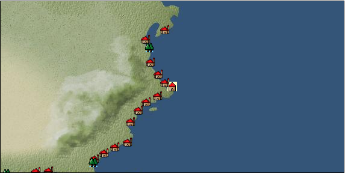

# Port: ボストン

import Tabs from '@theme/Tabs';
import TabItem from '@theme/TabItem';

## General Information

| Attribute | Details |
| :--- | :--- |
| **Port Name** | boston |
| **Port Type** | port of alliance |
| **Region** | east coast of north america |
| **Sea Area** |  |
| **Required Language** |  |
| **Coordinates** | （13239，3058） |
| **Investment Reward** | [Lot (NO.5)](Items/Consumables/Consumables-Treasure-Chests/item_3017.md) （必要投資額：2,120,000ドゥカード） |

### Available Facilities

| guild | intermediary | exchange | tool shop | workshop craftsman | Painter | sculptor | peddler |
| --- | --- | --- | --- | --- | --- | --- | --- |
|   |   | ○ | ○ |   |   |   |   |
| Shipyard Master | Lumbermaker | Sail-maker | weapon craftsman | master | TavernFemale | archive | salesperson |
| --- | --- | --- | --- | --- | --- | --- | --- |
| ○ |   |   |   | ○ |   |   |   |
| Shipwright | 銀行 | street worker | 王宮 | Trading post | church | suburbs | translator |
| --- | --- | --- | --- | --- | --- | --- | --- |
| ○ | ○ | ○ |   |   |   |   |   |

### Description
I was able to see all trade items with an investment of 720,000. ↑Investment ranker benefits? Leather products were not confirmed, but they were not visible at 7,680,000, and luxury clothing, steel, and tea were visible at 8,500,000. (2016/09/15) Leather products were seen at 720,000. (2020/08/21) If you have permission to enter a Caribbean port, you can land.

<Tabs>
  <TabItem value="trade_goods_sales" label="Trade Goods Sales">

| item | group | purchase price | 同盟時 | remarks |
| --- | --- | --- | --- | --- |
| [tobacco](Items/Trade Goods/TradeGoods-Sunddries/item_109.md) | [Trading goods (hobby goods)](Categories/category_10.md) | (1,028) | 900 |  |
| 要投資（必要投資額：500,000） |
| [rum](Items/Trade Goods/TradeGoods-Alcohol/item_139.md) | [交易品（酒類）](Categories/category_9.md) | (1,188) | 1,040 |  |
| [salt](Items/Trade Goods/TradeGoods-Seasonings/item_42.md) | [交易品（調味料）](Categories/category_4.md) | (356) | 312 |  |
| [皮革製品](Items/Trade Goods/TradeGoods-Luxuries/item_12.md) | [Trading goods (artificial goods)](Categories/category_13.md) | (1,691) | 1,480 |  |
| 要投資（必要投資額：不明） |
| [oil](Items/Trade Goods/TradeGoods-Wares/item_613.md) | [交易品（工業品）](Categories/category_19.md) | (580) | 508 |  |
| 要投資（必要投資額：240,000） |
| [black tea](Items/Trade Goods/TradeGoods-Sunddries/item_675.md) | [Trading goods (hobby goods)](Categories/category_10.md) | (3,680) | 3,220 |  |
| 要投資（必要投資額：8,500,000） 必要投資額：7,680,000以上8,500,000以下 |
| [鋼](Items/Trade Goods/TradeGoods-Wares/item_573.md) | [交易品（工業品）](Categories/category_19.md) | (1,112) | 973 |  |
| 要投資（必要投資額：8,500,000） 必要投資額：7,680,000以上8,500,000以下 |
| [luxury clothing](Items/Trade Goods/TradeGoods-Luxuries/item_165.md) | [Trading goods (artificial goods)](Categories/category_13.md) | (6,252) | 5,470 |  |
| 要投資（必要投資額：8,500,000） 必要投資額：7,680,000以上8,500,000以下 |
| [魚肉](Items/Trade Goods/TradeGoods-Foodstuffs/item_10.md) | [Trading items (food items)](Categories/category_3.md) | (219) | 192 |  |
  </TabItem>
  <TabItem value="sale_specialty" label="Sale (Specialty)">

| item | group | sale price | 同盟時 | remarks |
| --- | --- | --- | --- | --- |

#### [交易品（繊維）](Categories/category_1.md)

| [flax](Items/Trade Goods/TradeGoods-Fibers/item_64.md) | [交易品（繊維）](Categories/category_1.md) | 396 | (445) |  |
| [feather](Items/Trade Goods/TradeGoods-Fibers/item_585.md) | [交易品（繊維）](Categories/category_1.md) | 1,038 | (1,167) |  |
| [Green ramie](Items/Trade Goods/TradeGoods-Fibers/item_3428.md) | [交易品（繊維）](Categories/category_1.md) | (14,116) | 16,471 |  |
| [deerskin](Items/Trade Goods/TradeGoods-Fibers/item_3648.md) | [交易品（繊維）](Categories/category_1.md) | (13,995) | 16,330 |  |

#### [交易品（雑貨）](Categories/category_5.md)

| [lantern](Items/Trade Goods/TradeGoods-Misc/item_3683.md) | [交易品（雑貨）](Categories/category_5.md) | (3,420) | 3,990 |  |

#### [交易品（酒類）](Categories/category_9.md)

| [aquavit](Items/Trade Goods/TradeGoods-Alcohol/item_572.md) | [交易品（酒類）](Categories/category_9.md) | 1,091 | 1,361 |  |
| [whiskey](Items/Trade Goods/TradeGoods-Alcohol/item_1.md) | [交易品（酒類）](Categories/category_9.md) | (1,126) | 1,313 |  |
| [gin](Items/Trade Goods/TradeGoods-Alcohol/item_291.md) | [交易品（酒類）](Categories/category_9.md) | 1,000 | 1,234 |  |
| [Taiwan rice wine](Items/Trade Goods/TradeGoods-Alcohol/item_3672.md) | [交易品（酒類）](Categories/category_9.md) | (13,599) | 15,868 |  |
| [Sake](Items/Trade Goods/TradeGoods-Alcohol/item_3424.md) | [交易品（酒類）](Categories/category_9.md) | (13,127) | 15,317 |  |

#### [Trading goods (hobby goods)](Categories/category_10.md)

| [Aigyoku](Items/Trade Goods/TradeGoods-Sunddries/item_3677.md) | [Trading goods (hobby goods)](Categories/category_10.md) | (12,787) | 14,920 |  |
| [blueberry](Items/Trade Goods/TradeGoods-Sunddries/item_4657.md) | [Trading goods (hobby goods)](Categories/category_10.md) | (726) | 847 |  |
| [raspberry](Items/Trade Goods/TradeGoods-Sunddries/item_4658.md) | [Trading goods (hobby goods)](Categories/category_10.md) | (594) | 693 |  |
| [raspberry](Items/Trade Goods/TradeGoods-Sunddries/item_5419.md) | [Trading goods (hobby goods)](Categories/category_10.md) | (3,163) | 3,690 |  |

#### [Trading Goods (Spices)](Categories/category_12.md)

| [cloves](Items/Trade Goods/TradeGoods-Spices/item_1092.md) | [Trading Goods (Spices)](Categories/category_12.md) | 5,164 | (5,810) |  |
| [nutmeg](Items/Trade Goods/TradeGoods-Spices/item_1969.md) | [Trading Goods (Spices)](Categories/category_12.md) | 5,672 | (6,381) |  |
| [mace](Items/Trade Goods/TradeGoods-Spices/item_2100.md) | [Trading Goods (Spices)](Categories/category_12.md) | 5,786 | (6,509) |  |

#### [Trading goods (artificial goods)](Categories/category_13.md)

| [Darla Hest](Items/Trade Goods/TradeGoods-Luxuries/item_6190.md) | [Trading goods (artificial goods)](Categories/category_13.md) | (6,419) | 7,490 |  |

#### [交易品（美術品）](Categories/category_14.md)

| [taiwan wood carving](Items/Trade Goods/TradeGoods-Art/item_3697.md) | [交易品（美術品）](Categories/category_14.md) | (13,864) | 16,177 |  |

#### [Trading Items (Gemstones)](Categories/category_15.md)

| [alexandrite](Items/Trade Goods/TradeGoods-Gems/item_4429.md) | [Trading Items (Gemstones)](Categories/category_15.md) | 9,870 | 12,400 |  |
| [amber](Items/Trade Goods/TradeGoods-Gems/item_618.md) | [Trading Items (Gemstones)](Categories/category_15.md) | (3,422) | 3,992 |  |

#### [Trading Items (Arms)](Categories/category_16.md)

| [Japanese sword](Items/Trade Goods/TradeGoods-Weapons/item_3437.md) | [Trading Items (Arms)](Categories/category_16.md) | 14,036 | (15,792) |  |
| [western armor](Items/Trade Goods/TradeGoods-Weapons/item_6.md) | [Trading Items (Arms)](Categories/category_16.md) | (2,713) | 3,165 |  |

#### [交易品（織物）](Categories/category_20.md)

| [felt](Items/Trade Goods/TradeGoods-Fabrics/item_4439.md) | [交易品（織物）](Categories/category_20.md) | 2,162 | 2,411 |  |
  </TabItem>
  <TabItem value="sale_no_specialty" label="Sale (No Specialty)">

| item | group | sale price | 同盟時 | remarks |
| --- | --- | --- | --- | --- |

#### [Trading items (food items)](Categories/category_3.md)

| [european crayfish](Items/Trade Goods/TradeGoods-Foodstuffs/item_6188.md) | [Trading items (food items)](Categories/category_3.md) | (4,594) | 5,360 |  |
| [barley](Items/Trade Goods/TradeGoods-Foodstuffs/item_124.md) | [Trading items (food items)](Categories/category_3.md) | (42) | 49 |  |

#### [Trading products (medical products)](Categories/category_6.md)

| [nettle](Items/Trade Goods/TradeGoods-Medicine/item_6189.md) | [Trading products (medical products)](Categories/category_6.md) | (559) | 652 |  |

#### [Trading products (precious metals)](Categories/category_8.md)

| [gold dust](Items/Trade Goods/TradeGoods-Metals/item_111.md) | [Trading products (precious metals)](Categories/category_8.md) | 1,290 | (1,451) |  |
| [gold](Items/Trade Goods/TradeGoods-Metals/item_659.md) | [Trading products (precious metals)](Categories/category_8.md) | 1,775 | (1,997) |  |

#### [Trading goods (hobby goods)](Categories/category_10.md)

| [pineapple](Items/Trade Goods/TradeGoods-Sunddries/item_867.md) | [Trading goods (hobby goods)](Categories/category_10.md) | (732) | 854 |  |

#### [交易品（美術品）](Categories/category_14.md)

| [wooden statue](Items/Trade Goods/TradeGoods-Art/item_95.md) | [交易品（美術品）](Categories/category_14.md) | 1,013 | (1,139) |  |
| [stone statue](Items/Trade Goods/TradeGoods-Art/item_899.md) | [交易品（美術品）](Categories/category_14.md) | 738 | (830) |  |

#### [Trading Goods (Livestock)](Categories/category_18.md)

| [rat](Items/Trade Goods/TradeGoods-Livestock/item_2710.md) | [Trading Goods (Livestock)](Categories/category_18.md) | (18) | 20 |  |

#### [交易品（工業品）](Categories/category_19.md)

| [coal](Items/Trade Goods/TradeGoods-Wares/item_359.md) | [交易品（工業品）](Categories/category_19.md) | 233 | (262) |  |
  </TabItem>
  <TabItem value="guild_&_others" label="Guild & Others">

| item | group | Sales price | Handling NPC | remarks |
| --- | --- | --- | --- | --- |

#### others

| [Traditional North American headdress sewing method](Items/Recipe Book/item_5335.md) | [recipe book](Categories/category_22.md) | Fixed recipe |  |  |
| Boston NPC Traveler (appears during the Great Thanksgiving) |
  </TabItem>
  <TabItem value="toolman" label="Toolman">

| item | group | Sales price | Handling NPC | remarks |
| --- | --- | --- | --- | --- |

#### [recipe book](Categories/category_22.md)

| [Mode Design Collection Volume 1](Items/Recipe Book/item_92.md) | [recipe book](Categories/category_22.md) | 10,000 | tool shop owner |  |
| [Sword training/application](Items/Recipe Book/item_589.md) | [recipe book](Categories/category_22.md) | 50,000 | tool shop owner |  |
| [Textile secrets/fabric book](Items/Recipe Book/item_91.md) | [recipe book](Categories/category_22.md) | 10,000 | tool shop owner |  |

#### [Equipment (head)](Categories/category_23.md)

| [police cap](Items/Equipment/Equipment-Head/item_5303.md) | [Equipment (head)](Categories/category_23.md) | 30,000 | tool shop owner |  |

#### [Equipment (body)](Categories/category_24.md)

| [police uniform](Items/Equipment/Equipment-Body/item_5302.md) | [Equipment (body)](Categories/category_24.md) | 70,000 | tool shop owner |  |

#### [Consumables (land battle/deck battle)](Categories/category_29.md)

| [black kite feather](Items/Consumables/Consumables-Landbattle/item_88.md) | [Consumables (land battle/deck battle)](Categories/category_29.md) | 100 | tool shop owner |  |
| [Assortment of wound medicine](Items/Consumables/Consumables-Landbattle/item_90.md) | [Consumables (land battle/deck battle)](Categories/category_29.md) | 500 | tool shop owner |  |
| [therapeutic drug](Items/Consumables/Consumables-Landbattle/item_89.md) | [Consumables (land battle/deck battle)](Categories/category_29.md) | 300 | tool shop owner |  |
| [antidote](Items/Consumables/Consumables-Landbattle/item_270.md) | [Consumables (land battle/deck battle)](Categories/category_29.md) | 100 | tool shop owner |  |

#### [Consumables (other)](Categories/category_44.md)

| [fossil fuel](Items/Consumables/Consumables-Other/item_5425.md) | [Consumables (other)](Categories/category_44.md) | 100,000 | tool shop owner |  |
  </TabItem>
  <TabItem value="shipyard" label="Shipyard">

### Shipyard Master

| item | group | Sales price | Handling NPC | remarks |
| --- | --- | --- | --- | --- |

#### [Boat](Categories/category_43.md)

| [C.W. Morgan](Items/Ships/item_5295.md) | [Boat](Categories/category_43.md) |  | Shipyard Master |  |
| [assault frigate](Items/Ships/item_5296.md) | [Boat](Categories/category_43.md) |  | Shipyard Master |  |
| [galleon](Items/Ships/item_411.md) | [Boat](Categories/category_43.md) | 4,500,000 | Shipyard Master |  |
| [carrack](Items/Ships/item_236.md) | [Boat](Categories/category_43.md) | 720,000 | Shipyard Master |  |
| [caravelle](Items/Ships/item_213.md) | [Boat](Categories/category_43.md) | 285,000 | Shipyard Master |  |
| [frigate](Items/Ships/item_760.md) | [Boat](Categories/category_43.md) | 1,080,000 | Shipyard Master |  |
| [bergantine](Items/Ships/item_208.md) | [Boat](Categories/category_43.md) | 148,800 | Shipyard Master |  |
| [commercial galleon](Items/Ships/item_412.md) | [Boat](Categories/category_43.md) | 4,600,000 | Shipyard Master |  |
| [commercial carrack](Items/Ships/item_239.md) | [Boat](Categories/category_43.md) | 728,000 | Shipyard Master |  |
| [commercial caravel](Items/Ships/item_215.md) | [Boat](Categories/category_43.md) | 290,000 | Shipyard Master |  |
| [commercial large carrack](Items/Ships/item_409.md) | [Boat](Categories/category_43.md) | 1,840,000 | Shipyard Master |  |
| [commercial armed carrack](Items/Ships/item_1502.md) | [Boat](Categories/category_43.md) | 4,000,000 | Shipyard Master |  |
| [large carrack](Items/Ships/item_408.md) | [Boat](Categories/category_43.md) | 1,800,000 | Shipyard Master |  |
| [small galleon](Items/Ships/item_406.md) | [Boat](Categories/category_43.md) | 830,000 | Shipyard Master |  |
| [small carrack](Items/Ships/item_219.md) | [Boat](Categories/category_43.md) | 480,000 | Shipyard Master |  |
| [small caravel](Items/Ships/item_206.md) | [Boat](Categories/category_43.md) | 92,000 | Shipyard Master |  |
| [battle galleon](Items/Ships/item_413.md) | [Boat](Categories/category_43.md) | 4,600,000 | Shipyard Master |  |
| [combat carrack](Items/Ships/item_238.md) | [Boat](Categories/category_43.md) | 720,000 | Shipyard Master |  |
| [combat caravel](Items/Ships/item_212.md) | [Boat](Categories/category_43.md) | 280,000 | Shipyard Master |  |
| [Large exploration carrack](Items/Ships/item_1503.md) | [Boat](Categories/category_43.md) | 3,360,000 | Shipyard Master |  |
| [armed cog](Items/Ships/item_264.md) | [Boat](Categories/category_43.md) | 25,000 | Shipyard Master |  |
| [light galleon](Items/Ships/item_240.md) | [Boat](Categories/category_43.md) | 810,000 | Shipyard Master |  |
| [light carrack](Items/Ships/item_218.md) | [Boat](Categories/category_43.md) | 478,000 | Shipyard Master |  |
| [transport galleon](Items/Ships/item_407.md) | [Boat](Categories/category_43.md) | 840,000 | Shipyard Master |  |
| [transport carrack](Items/Ships/item_222.md) | [Boat](Categories/category_43.md) | 488,000 | Shipyard Master |  |
| [Small caravel for transport](Items/Ships/item_3674.md) | [Boat](Categories/category_43.md) | 92,000 | Shipyard Master |  |
  </TabItem>
</Tabs>