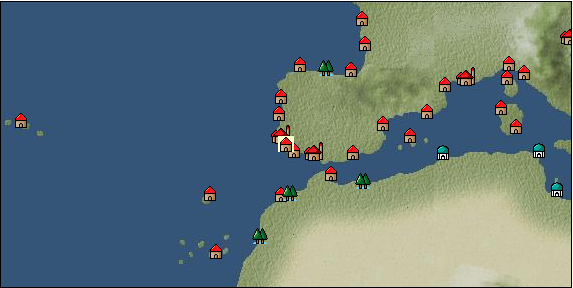

# Port: サグレス

import Tabs from '@theme/Tabs';
import TabItem from '@theme/TabItem';

## General Information

| Attribute | Details |
| :--- | :--- |
| **Port Name** | sagres |
| **Port Type** | port of alliance |
| **Region** | western europe |
| **Sea Area** | off the coast of lisbon |
| **Required Language** |  |
| **Coordinates** | （15781，3244） |
| **Investment Reward** |  |

### Available Facilities

| guild | intermediary | exchange | tool shop | workshop craftsman | Painter | sculptor | peddler |
| --- | --- | --- | --- | --- | --- | --- | --- |
|   | ○ | ○ | ○ |   |   |   | ○ |
| Shipyard Master | Lumbermaker | Sail-maker | weapon craftsman | master | TavernFemale | archive | salesperson |
| --- | --- | --- | --- | --- | --- | --- | --- |
| ○ | ○ | ○ | ○ | ○ |   |   |   |
| Shipwright | 銀行 | street worker | 王宮 | Trading post | church | suburbs | translator |
| --- | --- | --- | --- | --- | --- | --- | --- |
| ○ | ○ |   |   |   | ○ |   |   |

### Description
A village that is said to have been built by a certain Portuguese royal family. Located at the tip of the Iberian Peninsula, it serves as a place to watch over fleets sailing on the open sea, and at the same time serves as an important fortress in times of conflict with other countries. It's on the left side of Faro. *Although there is no guild or intermediary, we have marked it as ○ for convenience in registering school quests. You can change jobs as an instructor.

<Tabs>
  <TabItem value="trade_goods_sales" label="Trade Goods Sales">

| item | group | purchase price | 同盟時 | remarks |
| --- | --- | --- | --- | --- |
| [chicken](Items/Trade Goods/TradeGoods-Livestock/item_252.md) | [Trading Goods (Livestock)](Categories/category_18.md) | 47 | (42) |  |
| [pig](Items/Trade Goods/TradeGoods-Livestock/item_37.md) | [Trading Goods (Livestock)](Categories/category_18.md) | 60 | (53) |  |
| [musket gun](Items/Trade Goods/TradeGoods-Firearms/item_584.md) | [Trading Items (Firearms)](Categories/category_17.md) | 2,670 | (2,336) |  |
| [wine](Items/Trade Goods/TradeGoods-Alcohol/item_11.md) | [交易品（酒類）](Categories/category_9.md) | 406 | (356) |  |
| [salt](Items/Trade Goods/TradeGoods-Seasonings/item_42.md) | [交易品（調味料）](Categories/category_4.md) | 225 | (197) |  |
| [wheat](Items/Trade Goods/TradeGoods-Foodstuffs/item_16.md) | [Trading items (food items)](Categories/category_3.md) | 43 | (38) |  |
| [leather](Items/Trade Goods/TradeGoods-Fibers/item_44.md) | [交易品（繊維）](Categories/category_1.md) | 402 | (352) |  |
| [iron ore](Items/Trade Goods/TradeGoods-Minerals/item_146.md) | [Trading Items (Iron Stone)](Categories/category_7.md) | 614 | (538) |  |
| [魚肉](Items/Trade Goods/TradeGoods-Foodstuffs/item_10.md) | [Trading items (food items)](Categories/category_3.md) | 139 | (122) |  |
  </TabItem>
  <TabItem value="sale_specialty" label="Sale (Specialty)">

| item | group | sale price | 同盟時 | remarks |
| --- | --- | --- | --- | --- |

#### [交易品（繊維）](Categories/category_1.md)

| [cashmere](Items/Trade Goods/TradeGoods-Fibers/item_5560.md) | [交易品（繊維）](Categories/category_1.md) | 3,211 | (3,612) |  |
| [deerskin](Items/Trade Goods/TradeGoods-Fibers/item_3648.md) | [交易品（繊維）](Categories/category_1.md) | 33,800 | (38,028) |  |

#### [Trading Goods (Dye)](Categories/category_2.md)

| [Shorou](Items/Trade Goods/TradeGoods-Dye/item_3691.md) | [Trading Goods (Dye)](Categories/category_2.md) | 24,068 | (27,079) |  |

#### [交易品（雑貨）](Categories/category_5.md)

| [old ink stick](Items/Trade Goods/TradeGoods-Misc/item_3921.md) | [交易品（雑貨）](Categories/category_5.md) | 10,100 | (11,363) |  |

#### [Trading products (precious metals)](Categories/category_8.md)

| [Jinguashijin](Items/Trade Goods/TradeGoods-Metals/item_3693.md) | [Trading products (precious metals)](Categories/category_8.md) | 33,762 | (37,985) |  |

#### [交易品（酒類）](Categories/category_9.md)

| [tequila](Items/Trade Goods/TradeGoods-Alcohol/item_108.md) | [交易品（酒類）](Categories/category_9.md) | 4,627 | (5,205) |  |

#### [Trading goods (hobby goods)](Categories/category_10.md)

| [tobacco](Items/Trade Goods/TradeGoods-Sunddries/item_109.md) | [Trading goods (hobby goods)](Categories/category_10.md) | 5,190 | (5,839) |  |
| [eggplant](Items/Trade Goods/TradeGoods-Sunddries/item_3426.md) | [Trading goods (hobby goods)](Categories/category_10.md) | 27,667 | (31,128) |  |

#### [Trading Goods (Spices)](Categories/category_11.md)

| [Hamanasu](Items/Trade Goods/TradeGoods-Perfume/item_3692.md) | [Trading Goods (Spices)](Categories/category_11.md) | 26,711 | (30,052) |  |

#### [Trading Goods (Spices)](Categories/category_12.md)

| [Grapefruit](Items/Trade Goods/TradeGoods-Spices/item_3422.md) | [Trading Goods (Spices)](Categories/category_12.md) | 260 | (292) |  |

#### [Trading goods (artificial goods)](Categories/category_13.md)

| [Tumbaga](Items/Trade Goods/TradeGoods-Luxuries/item_3028.md) | [Trading goods (artificial goods)](Categories/category_13.md) | 17,242 | (19,399) |  |

#### [Trading Items (Gemstones)](Categories/category_15.md)

| [topaz](Items/Trade Goods/TradeGoods-Gems/item_1097.md) | [Trading Items (Gemstones)](Categories/category_15.md) | 4,254 | (4,786) |  |

#### [Trading Items (Firearms)](Categories/category_17.md)

| [tanegashima gun](Items/Trade Goods/TradeGoods-Firearms/item_3423.md) | [Trading Items (Firearms)](Categories/category_17.md) | 35,667 | (40,129) |  |

#### [Trading Goods (Livestock)](Categories/category_18.md)

| [boar](Items/Trade Goods/TradeGoods-Livestock/item_3476.md) | [Trading Goods (Livestock)](Categories/category_18.md) | 25,445 | (28,628) |  |

#### [交易品（工業品）](Categories/category_19.md)

| [Japanese paper](Items/Trade Goods/TradeGoods-Wares/item_3438.md) | [交易品（工業品）](Categories/category_19.md) | 26,600 | (29,927) |  |
| [paint](Items/Trade Goods/TradeGoods-Wares/item_3411.md) | [交易品（工業品）](Categories/category_19.md) | 2,690 | (3,026) |  |
| [rosewood](Items/Trade Goods/TradeGoods-Wares/item_5559.md) | [交易品（工業品）](Categories/category_19.md) | 11,627 | (13,081) |  |
  </TabItem>
  <TabItem value="sale_no_specialty" label="Sale (No Specialty)">

| item | group | sale price | 同盟時 | remarks |
| --- | --- | --- | --- | --- |

#### [交易品（繊維）](Categories/category_1.md)

| [fur](Items/Trade Goods/TradeGoods-Fibers/item_634.md) | [交易品（繊維）](Categories/category_1.md) | 2,264 | (2,547) |  |

#### [Trading items (food items)](Categories/category_3.md)

| [魚肉](Items/Trade Goods/TradeGoods-Foodstuffs/item_10.md) | [Trading items (food items)](Categories/category_3.md) | 64 | (72) |  |

#### [Trading Items (Iron Stone)](Categories/category_7.md)

| [lead ore](Items/Trade Goods/TradeGoods-Minerals/item_21.md) | [Trading Items (Iron Stone)](Categories/category_7.md) | (424) | 494 |  |
| [copper ore](Items/Trade Goods/TradeGoods-Minerals/item_65.md) | [Trading Items (Iron Stone)](Categories/category_7.md) | (775) | 904 |  |

#### [Trading products (precious metals)](Categories/category_8.md)

| [gold](Items/Trade Goods/TradeGoods-Metals/item_659.md) | [Trading products (precious metals)](Categories/category_8.md) | 8,307 | (9,346) |  |

#### [交易品（酒類）](Categories/category_9.md)

| [sherry](Items/Trade Goods/TradeGoods-Alcohol/item_844.md) | [交易品（酒類）](Categories/category_9.md) | (378) | 440 |  |
| [gin](Items/Trade Goods/TradeGoods-Alcohol/item_291.md) | [交易品（酒類）](Categories/category_9.md) | 838 | (942) |  |
| [wine](Items/Trade Goods/TradeGoods-Alcohol/item_11.md) | [交易品（酒類）](Categories/category_9.md) | 188 | (211) |  |

#### [Trading goods (hobby goods)](Categories/category_10.md)

| [dried strawberries](Items/Trade Goods/TradeGoods-Sunddries/item_36.md) | [Trading goods (hobby goods)](Categories/category_10.md) | 432 | (486) |  |

#### [交易品（美術品）](Categories/category_14.md)

| [wooden statue](Items/Trade Goods/TradeGoods-Art/item_95.md) | [交易品（美術品）](Categories/category_14.md) | 1,245 | (1,400) |  |

#### [Trading Items (Firearms)](Categories/category_17.md)

| [大砲](Items/Trade Goods/TradeGoods-Firearms/item_4.md) | [Trading Items (Firearms)](Categories/category_17.md) | 3,087 | (3,473) |  |

#### [交易品（工業品）](Categories/category_19.md)

| [log](Items/Trade Goods/TradeGoods-Wares/item_846.md) | [交易品（工業品）](Categories/category_19.md) | 139 | (156) |  |
| [iron material](Items/Trade Goods/TradeGoods-Wares/item_268.md) | [交易品（工業品）](Categories/category_19.md) | 1,062 | (1,194) |  |
  </TabItem>
  <TabItem value="guild_&_others" label="Guild & Others">

| item | group | Sales price | Handling NPC | remarks |
| --- | --- | --- | --- | --- |

#### enrique

| [East African culture research book](Items/Recipe Book/item_6236.md) | [recipe book](Categories/category_22.md) | Fixed recipe | enrique |  |
  </TabItem>
  <TabItem value="toolman" label="Toolman">

| item | group | Sales price | Handling NPC | remarks |
| --- | --- | --- | --- | --- |

#### [recipe book](Categories/category_22.md)

| [Fisherman's tips: How to preserve fresh fish](Items/Recipe Book/item_319.md) | [recipe book](Categories/category_22.md) | 5,000 | tool shop owner |  |
| [Livestock secrets/pig chapter](Items/Recipe Book/item_366.md) | [recipe book](Categories/category_22.md) | 8,000 | tool shop owner |  |
| [Book of textile secrets and materials](Items/Recipe Book/item_321.md) | [recipe book](Categories/category_22.md) | 5,000 | tool shop owner |  |
| [Easy recipes anyone can do](Items/Recipe Book/item_554.md) | [recipe book](Categories/category_22.md) | 5,000 | tool shop owner |  |

#### [Equipment (head)](Categories/category_23.md)

| [Restricted cap](Items/Equipment/Equipment-Head/item_2379.md) | [Equipment (head)](Categories/category_23.md) | 1,000 | tool shop owner |  |

#### [Equipment (body)](Categories/category_24.md)

| [uniform](Items/Equipment/Equipment-Body/item_2378.md) | [Equipment (body)](Categories/category_24.md) | 500 | tool shop owner |  |

#### [Consumables (land battle/deck battle)](Categories/category_29.md)

| [傷薬](Items/Consumables/Consumables-Landbattle/item_317.md) | [Consumables (land battle/deck battle)](Categories/category_29.md) | 150 | tool shop owner |  |
| [dart](Items/Consumables/Consumables-Landbattle/item_312.md) | [Consumables (land battle/deck battle)](Categories/category_29.md) | 50 | tool shop owner |  |
| [torch for throwing](Items/Consumables/Consumables-Landbattle/item_313.md) | [Consumables (land battle/deck battle)](Categories/category_29.md) | 150 | tool shop owner |  |
| [explosive powder](Items/Consumables/Consumables-Landbattle/item_230.md) | [Consumables (land battle/deck battle)](Categories/category_29.md) | 150 | tool shop owner |  |

#### [Consumables (skill activation)](Categories/category_31.md)

| [dowsing rod](Items/Consumables/Consumables-Skill/item_304.md) | [Consumables (skill activation)](Categories/category_31.md) | 500 | tool shop owner |  |
| [捕獲網](Items/Consumables/Consumables-Skill/item_315.md) | [Consumables (skill activation)](Categories/category_31.md) | 300 | tool shop owner |  |
| [Traveler's Notes](Items/Consumables/Consumables-Skill/item_305.md) | [Consumables (skill activation)](Categories/category_31.md) | 500 | tool shop owner |  |
| [片眼鏡](Items/Consumables/Consumables-Skill/item_306.md) | [Consumables (skill activation)](Categories/category_31.md) | 500 | tool shop owner |  |
| [簡易望遠鏡](Items/Consumables/Consumables-Skill/item_303.md) | [Consumables (skill activation)](Categories/category_31.md) | 500 | tool shop owner |  |
| [Observation techniques for artists](Items/Consumables/Consumables-Skill/item_1367.md) | [Consumables (skill activation)](Categories/category_31.md) | 300 | tool shop owner |  |
| [釣餌](Items/Consumables/Consumables-Skill/item_307.md) | [Consumables (skill activation)](Categories/category_31.md) | 10 | tool shop owner |  |

#### [Consumables (other)](Categories/category_44.md)

| [Dyed powder](Items/Consumables/Consumables-Other/item_3370.md) | [Consumables (other)](Categories/category_44.md) | 2,000 | tool shop owner |  |
| [Dyeing agent](Items/Consumables/Consumables-Other/item_309.md) | [Consumables (other)](Categories/category_44.md) | 1,000 | tool shop owner |  |
| [sewing tools](Items/Consumables/Consumables-Other/item_310.md) | [Consumables (other)](Categories/category_44.md) | 10,000 | tool shop owner |  |
  </TabItem>
  <TabItem value="peddler" label="peddler">

| item | group | Sales price | Handling NPC | remarks |
| --- | --- | --- | --- | --- |

#### [Consumables (condition recovery)](Categories/category_21.md)

| [Nekoirazu](Items/Consumables/Consumables-Recovery/item_70.md) | [Consumables (condition recovery)](Categories/category_21.md) |  | peddler |  |
| [lime juice](Items/Consumables/Consumables-Recovery/item_121.md) | [Consumables (condition recovery)](Categories/category_21.md) |  | peddler |  |
| [spare sail](Items/Consumables/Consumables-Recovery/item_242.md) | [Consumables (condition recovery)](Categories/category_21.md) |  | peddler |  |
| [carpentry tools](Items/Consumables/Consumables-Recovery/item_271.md) | [Consumables (condition recovery)](Categories/category_21.md) |  | peddler |  |
| [fire extinguishing sand](Items/Consumables/Consumables-Recovery/item_68.md) | [Consumables (condition recovery)](Categories/category_21.md) |  | peddler |  |
| [clean deck brush](Items/Consumables/Consumables-Recovery/item_72.md) | [Consumables (condition recovery)](Categories/category_21.md) |  | peddler |  |

#### [Consumables (land battle/deck battle)](Categories/category_29.md)

| [frankisca](Items/Consumables/Consumables-Landbattle/item_1484.md) | [Consumables (land battle/deck battle)](Categories/category_29.md) |  | peddler |  |

#### [Consumables (skill activation)](Categories/category_31.md)

| [life aid](Items/Consumables/Consumables-Skill/item_67.md) | [Consumables (skill activation)](Categories/category_31.md) |  | peddler |  |
  </TabItem>
  <TabItem value="shipyard" label="Shipyard">

### Shipyard Master

| item | group | Sales price | Handling NPC | remarks |
| --- | --- | --- | --- | --- |

#### [Boat](Categories/category_43.md)

| [Galliot](Items/Ships/item_210.md) | [Boat](Categories/category_43.md) | 156,000 | Shipyard Master |  |
| [galleon](Items/Ships/item_411.md) | [Boat](Categories/category_43.md) | 4,500,000 | Shipyard Master |  |
| [carrack](Items/Ships/item_236.md) | [Boat](Categories/category_43.md) | 720,000 | Shipyard Master |  |
| [caravelle](Items/Ships/item_213.md) | [Boat](Categories/category_43.md) | 285,000 | Shipyard Master |  |
| [Talette](Items/Ships/item_205.md) | [Boat](Categories/category_43.md) | 11,500 | Shipyard Master |  |
| [Nao](Items/Ships/item_355.md) | [Boat](Categories/category_43.md) | 1,250,000 | Shipyard Master |  |
| [Hansa Cog](Items/Ships/item_263.md) | [Boat](Categories/category_43.md) | 24,000 | Shipyard Master |  |
| [Varsha](Items/Ships/item_201.md) | [Boat](Categories/category_43.md) | 2,000 | Shipyard Master |  |
| [frigate](Items/Ships/item_760.md) | [Boat](Categories/category_43.md) | 1,080,000 | Shipyard Master |  |
| [bergantine](Items/Ships/item_208.md) | [Boat](Categories/category_43.md) | 148,800 | Shipyard Master |  |
| [commercial galleon](Items/Ships/item_412.md) | [Boat](Categories/category_43.md) | 4,600,000 | Shipyard Master |  |
| [commercial galley](Items/Ships/item_229.md) | [Boat](Categories/category_43.md) | 650,000 | Shipyard Master |  |
| [commercial carrack](Items/Ships/item_239.md) | [Boat](Categories/category_43.md) | 728,000 | Shipyard Master |  |
| [commercial caravel](Items/Ships/item_215.md) | [Boat](Categories/category_43.md) | 290,000 | Shipyard Master |  |
| [commercial varsha](Items/Ships/item_204.md) | [Boat](Categories/category_43.md) | 5,200 | Shipyard Master |  |
| [commercial large carrack](Items/Ships/item_409.md) | [Boat](Categories/category_43.md) | 1,840,000 | Shipyard Master |  |
| [commercial large caravel](Items/Ships/item_1513.md) | [Boat](Categories/category_43.md) | 1,632,000 | Shipyard Master |  |
| [commercial armed carrack](Items/Ships/item_1502.md) | [Boat](Categories/category_43.md) | 4,000,000 | Shipyard Master |  |
| [large carrack](Items/Ships/item_408.md) | [Boat](Categories/category_43.md) | 1,800,000 | Shipyard Master |  |
| [large caravel](Items/Ships/item_246.md) | [Boat](Categories/category_43.md) | 1,160,000 | Shipyard Master |  |
| [small galleon](Items/Ships/item_406.md) | [Boat](Categories/category_43.md) | 830,000 | Shipyard Master |  |
| [small carrack](Items/Ships/item_219.md) | [Boat](Categories/category_43.md) | 480,000 | Shipyard Master |  |
| [small caravel](Items/Ships/item_206.md) | [Boat](Categories/category_43.md) | 92,000 | Shipyard Master |  |
| [Assault heavy caravel](Items/Ships/item_1512.md) | [Boat](Categories/category_43.md) | 1,872,000 | Shipyard Master |  |
| [battle galleon](Items/Ships/item_413.md) | [Boat](Categories/category_43.md) | 4,600,000 | Shipyard Master |  |
| [combat carrack](Items/Ships/item_238.md) | [Boat](Categories/category_43.md) | 720,000 | Shipyard Master |  |
| [combat caravel](Items/Ships/item_212.md) | [Boat](Categories/category_43.md) | 280,000 | Shipyard Master |  |
| [Battle Barsha](Items/Ships/item_203.md) | [Boat](Categories/category_43.md) | 5,100 | Shipyard Master |  |
| [Nao for exploration](Items/Ships/item_1511.md) | [Boat](Categories/category_43.md) | 1,704,000 | Shipyard Master |  |
| [exploration barsha](Items/Ships/item_202.md) | [Boat](Categories/category_43.md) | 5,000 | Shipyard Master |  |
| [Large exploration carrack](Items/Ships/item_1503.md) | [Boat](Categories/category_43.md) | 3,360,000 | Shipyard Master |  |
| [refurbished heavy carrack](Items/Ships/item_1504.md) | [Boat](Categories/category_43.md) | 7,000,000 | Shipyard Master |  |
| [armed cog](Items/Ships/item_264.md) | [Boat](Categories/category_43.md) | 25,000 | Shipyard Master |  |
| [light galleon](Items/Ships/item_240.md) | [Boat](Categories/category_43.md) | 810,000 | Shipyard Master |  |
| [light galley](Items/Ships/item_209.md) | [Boat](Categories/category_43.md) | 150,000 | Shipyard Master |  |
| [light carrack](Items/Ships/item_218.md) | [Boat](Categories/category_43.md) | 478,000 | Shipyard Master |  |
| [light caravelle](Items/Ships/item_207.md) | [Boat](Categories/category_43.md) | 92,000 | Shipyard Master |  |
| [transport galleon](Items/Ships/item_407.md) | [Boat](Categories/category_43.md) | 840,000 | Shipyard Master |  |
| [transportation galley](Items/Ships/item_211.md) | [Boat](Categories/category_43.md) | 160,000 | Shipyard Master |  |
| [transport carrack](Items/Ships/item_222.md) | [Boat](Categories/category_43.md) | 488,000 | Shipyard Master |  |
| [Small caravel for transport](Items/Ships/item_3674.md) | [Boat](Categories/category_43.md) | 92,000 | Shipyard Master |  |
| [heavy carrack](Items/Ships/item_410.md) | [Boat](Categories/category_43.md) | 3,600,000 | Shipyard Master |  |
| [heavy caravel](Items/Ships/item_248.md) | [Boat](Categories/category_43.md) | 1,250,000 | Shipyard Master |  |

### Lumbermaker

| item | group | Sales price | Handling NPC | remarks |
| --- | --- | --- | --- | --- |

#### [Ship parts (additional armor)](Categories/category_35.md)

| [elm board](Items/Ship Parts/Shipparts-Plates/item_328.md) | [Ship parts (additional armor)](Categories/category_35.md) | 13,000 | Lumbermaker |  |
| [oak board](Items/Ship Parts/Shipparts-Plates/item_354.md) | [Ship parts (additional armor)](Categories/category_35.md) | 34,000 | Lumbermaker |  |
| [cedar board](Items/Ship Parts/Shipparts-Plates/item_353.md) | [Ship parts (additional armor)](Categories/category_35.md) | 800 | Lumbermaker |  |
| [beach board](Items/Ship Parts/Shipparts-Plates/item_327.md) | [Ship parts (additional armor)](Categories/category_35.md) | 6,400 | Lumbermaker |  |
| [red pine board](Items/Ship Parts/Shipparts-Plates/item_326.md) | [Ship parts (additional armor)](Categories/category_35.md) | 2,700 | Lumbermaker |  |
| [iron plate](Items/Ship Parts/Shipparts-Plates/item_921.md) | [Ship parts (additional armor)](Categories/category_35.md) | 130,000 | Lumbermaker |  |
| [銅板](Items/Ship Parts/Shipparts-Plates/item_405.md) | [Ship parts (additional armor)](Categories/category_35.md) | 73,000 | Lumbermaker |  |

### Sail-maker

| item | group | Sales price | Handling NPC | remarks |
| --- | --- | --- | --- | --- |

#### [Ship parts (auxiliary sails)](Categories/category_33.md)

| [outer jib](Items/Ship Parts/Shipparts-Studding-Sail/item_331.md) | [Ship parts (auxiliary sails)](Categories/category_33.md) | 18,000 | Sail-maker |  |
| [Outer & inner jib](Items/Ship Parts/Shipparts-Studding-Sail/item_332.md) | [Ship parts (auxiliary sails)](Categories/category_33.md) | 23,000 | Sail-maker |  |
| [inner jib](Items/Ship Parts/Shipparts-Studding-Sail/item_279.md) | [Ship parts (auxiliary sails)](Categories/category_33.md) | 1,700 | Sail-maker |  |
| [Vorgernstaisl](Items/Ship Parts/Shipparts-Studding-Sail/item_333.md) | [Ship parts (auxiliary sails)](Categories/category_33.md) | 22,000 | Sail-maker |  |
| [Vorgeln bonnet](Items/Ship Parts/Shipparts-Studding-Sail/item_929.md) | [Ship parts (auxiliary sails)](Categories/category_33.md) | 110,000 | Sail-maker |  |
| [Forestaisle](Items/Ship Parts/Shipparts-Studding-Sail/item_280.md) | [Ship parts (auxiliary sails)](Categories/category_33.md) | 8,300 | Sail-maker |  |
| [Foretop Gernsur](Items/Ship Parts/Shipparts-Studding-Sail/item_282.md) | [Ship parts (auxiliary sails)](Categories/category_33.md) | 2,400 | Sail-maker |  |
| [Foretop staysle](Items/Ship Parts/Shipparts-Studding-Sail/item_357.md) | [Ship parts (auxiliary sails)](Categories/category_33.md) | 29,000 | Sail-maker |  |
| [Foretop Royal Sur](Items/Ship Parts/Shipparts-Studding-Sail/item_403.md) | [Ship parts (auxiliary sails)](Categories/category_33.md) | 48,000 | Sail-maker |  |
| [Fore Royal Stains](Items/Ship Parts/Shipparts-Studding-Sail/item_931.md) | [Ship parts (auxiliary sails)](Categories/category_33.md) | 70,000 | Sail-maker |  |
| [flying outer jib](Items/Ship Parts/Shipparts-Studding-Sail/item_400.md) | [Ship parts (auxiliary sails)](Categories/category_33.md) | 49,000 | Sail-maker |  |
| [flying inner jib](Items/Ship Parts/Shipparts-Studding-Sail/item_401.md) | [Ship parts (auxiliary sails)](Categories/category_33.md) | 58,000 | Sail-maker |  |
| [bonnet](Items/Ship Parts/Shipparts-Studding-Sail/item_329.md) | [Ship parts (auxiliary sails)](Categories/category_33.md) | 25,000 | Sail-maker |  |
| [mizungernstaisl](Items/Ship Parts/Shipparts-Studding-Sail/item_334.md) | [Ship parts (auxiliary sails)](Categories/category_33.md) | 22,000 | Sail-maker |  |
| [Mizungern bonnet](Items/Ship Parts/Shipparts-Studding-Sail/item_930.md) | [Ship parts (auxiliary sails)](Categories/category_33.md) | 130,000 | Sail-maker |  |
| [mizzen staple](Items/Ship Parts/Shipparts-Studding-Sail/item_281.md) | [Ship parts (auxiliary sails)](Categories/category_33.md) | 11,000 | Sail-maker |  |
| [mizzen top gelrunsle](Items/Ship Parts/Shipparts-Studding-Sail/item_283.md) | [Ship parts (auxiliary sails)](Categories/category_33.md) | 4,200 | Sail-maker |  |
| [mizzen top staysle](Items/Ship Parts/Shipparts-Studding-Sail/item_402.md) | [Ship parts (auxiliary sails)](Categories/category_33.md) | 35,000 | Sail-maker |  |
| [Mizzen Top Royal Sur](Items/Ship Parts/Shipparts-Studding-Sail/item_404.md) | [Ship parts (auxiliary sails)](Categories/category_33.md) | 45,000 | Sail-maker |  |
| [mizzen royal gelrunsle](Items/Ship Parts/Shipparts-Studding-Sail/item_284.md) | [Ship parts (auxiliary sails)](Categories/category_33.md) | 21,000 | Sail-maker |  |
| [small inner jib](Items/Ship Parts/Shipparts-Studding-Sail/item_278.md) | [Ship parts (auxiliary sails)](Categories/category_33.md) | 500 | Sail-maker |  |
| [wide bonnet](Items/Ship Parts/Shipparts-Studding-Sail/item_356.md) | [Ship parts (auxiliary sails)](Categories/category_33.md) | 38,000 | Sail-maker |  |
  </TabItem>
  <TabItem value="weapon craftsman" label="weapon craftsman">

| item | group | Sales price | Handling NPC | remarks |
| --- | --- | --- | --- | --- |

#### [Ship parts (special weapons)](Categories/category_37.md)

| [Corvus](Items/Ship Parts/Shipparts-Special-Weapons/item_194.md) | [Ship parts (special weapons)](Categories/category_37.md) | 24,000 | weapon craftsman |  |
| [rum](Items/Ship Parts/Shipparts-Special-Weapons/item_191.md) | [Ship parts (special weapons)](Categories/category_37.md) | 4,800 | weapon craftsman |  |
| [medium sized ram](Items/Ship Parts/Shipparts-Special-Weapons/item_192.md) | [Ship parts (special weapons)](Categories/category_37.md) | 31,000 | weapon craftsman |  |
| [small corvus](Items/Ship Parts/Shipparts-Special-Weapons/item_193.md) | [Ship parts (special weapons)](Categories/category_37.md) | 3,000 | weapon craftsman |  |
| [small ram](Items/Ship Parts/Shipparts-Special-Weapons/item_190.md) | [Ship parts (special weapons)](Categories/category_37.md) | 1,000 | weapon craftsman |  |
| [small poop](Items/Ship Parts/Shipparts-Special-Weapons/item_198.md) | [Ship parts (special weapons)](Categories/category_37.md) | 39,000 | weapon craftsman |  |
| [small ship forecastle](Items/Ship Parts/Shipparts-Special-Weapons/item_195.md) | [Ship parts (special weapons)](Categories/category_37.md) | 5,000 | weapon craftsman |  |
| [additional spanker](Items/Ship Parts/Shipparts-Special-Weapons/item_200.md) | [Ship parts (special weapons)](Categories/category_37.md) | 55,000 | weapon craftsman |  |
| [additional split](Items/Ship Parts/Shipparts-Special-Weapons/item_197.md) | [Ship parts (special weapons)](Categories/category_37.md) | 44,000 | weapon craftsman |  |
| [additional small spanker](Items/Ship Parts/Shipparts-Special-Weapons/item_199.md) | [Ship parts (special weapons)](Categories/category_37.md) | 3,500 | weapon craftsman |  |
| [additional small split](Items/Ship Parts/Shipparts-Special-Weapons/item_196.md) | [Ship parts (special weapons)](Categories/category_37.md) | 2,000 | weapon craftsman |  |

#### [Ship parts (cannon)](Categories/category_38.md)

| [4 amfer guns](Items/Ship Parts/Shipparts-Cannons/item_391.md) | [Ship parts (cannon)](Categories/category_38.md) | 26,600 | weapon craftsman |  |
| [6 Amfer cannons](Items/Ship Parts/Shipparts-Cannons/item_392.md) | [Ship parts (cannon)](Categories/category_38.md) | 81,000 | weapon craftsman |  |
| [10 angel cannons](Items/Ship Parts/Shipparts-Cannons/item_853.md) | [Ship parts (cannon)](Categories/category_38.md) | 249,400 | weapon craftsman |  |
| [2 angel cannons](Items/Ship Parts/Shipparts-Cannons/item_382.md) | [Ship parts (cannon)](Categories/category_38.md) | 10,000 | weapon craftsman |  |
| [4 angel cannons](Items/Ship Parts/Shipparts-Cannons/item_383.md) | [Ship parts (cannon)](Categories/category_38.md) | 39,900 | weapon craftsman |  |
| [6 angel cannons](Items/Ship Parts/Shipparts-Cannons/item_388.md) | [Ship parts (cannon)](Categories/category_38.md) | 89,800 | weapon craftsman |  |
| [8 angel cannons](Items/Ship Parts/Shipparts-Cannons/item_389.md) | [Ship parts (cannon)](Categories/category_38.md) | 159,600 | weapon craftsman |  |
| [4 Caprice guns](Items/Ship Parts/Shipparts-Cannons/item_395.md) | [Ship parts (cannon)](Categories/category_38.md) | 18,200 | weapon craftsman |  |
| [6 Caprice guns](Items/Ship Parts/Shipparts-Cannons/item_396.md) | [Ship parts (cannon)](Categories/category_38.md) | 55,500 | weapon craftsman |  |
| [8 Caprice guns](Items/Ship Parts/Shipparts-Cannons/item_397.md) | [Ship parts (cannon)](Categories/category_38.md) | 103,600 | weapon craftsman |  |
| [10 culverines](Items/Ship Parts/Shipparts-Cannons/item_375.md) | [Ship parts (cannon)](Categories/category_38.md) | 136,300 | weapon craftsman |  |
| [12 culverin guns](Items/Ship Parts/Shipparts-Cannons/item_744.md) | [Ship parts (cannon)](Categories/category_38.md) | 196,300 | weapon craftsman |  |
| [4 culverine guns](Items/Ship Parts/Shipparts-Cannons/item_372.md) | [Ship parts (cannon)](Categories/category_38.md) | 21,800 | weapon craftsman |  |
| [6 culverine guns](Items/Ship Parts/Shipparts-Cannons/item_373.md) | [Ship parts (cannon)](Categories/category_38.md) | 49,100 | weapon craftsman |  |
| [8 culverine guns](Items/Ship Parts/Shipparts-Cannons/item_374.md) | [Ship parts (cannon)](Categories/category_38.md) | 87,300 | weapon craftsman |  |
| [4 carronades](Items/Ship Parts/Shipparts-Cannons/item_836.md) | [Ship parts (cannon)](Categories/category_38.md) | 14,500 | weapon craftsman |  |
| [10 Cannon Pedro guns](Items/Ship Parts/Shipparts-Cannons/item_746.md) | [Ship parts (cannon)](Categories/category_38.md) | 190,900 | weapon craftsman |  |
| [12 Cannon Pedro guns](Items/Ship Parts/Shipparts-Cannons/item_834.md) | [Ship parts (cannon)](Categories/category_38.md) | 274,900 | weapon craftsman |  |
| [4 Cannon Pedro guns](Items/Ship Parts/Shipparts-Cannons/item_376.md) | [Ship parts (cannon)](Categories/category_38.md) | 30,500 | weapon craftsman |  |
| [6 Cannon Pedro guns](Items/Ship Parts/Shipparts-Cannons/item_377.md) | [Ship parts (cannon)](Categories/category_38.md) | 68,700 | weapon craftsman |  |
| [8 Cannon Pedro guns](Items/Ship Parts/Shipparts-Cannons/item_745.md) | [Ship parts (cannon)](Categories/category_38.md) | 122,200 | weapon craftsman |  |
| [4 Shumine cannons](Items/Ship Parts/Shipparts-Cannons/item_2967.md) | [Ship parts (cannon)](Categories/category_38.md) | 29,300 | weapon craftsman |  |
| [6 Shumine cannons](Items/Ship Parts/Shipparts-Cannons/item_2968.md) | [Ship parts (cannon)](Categories/category_38.md) | 89,100 | weapon craftsman |  |
| [10 Saker cannons](Items/Ship Parts/Shipparts-Cannons/item_187.md) | [Ship parts (cannon)](Categories/category_38.md) | 79,000 | weapon craftsman |  |
| [2 saker cannons](Items/Ship Parts/Shipparts-Cannons/item_183.md) | [Ship parts (cannon)](Categories/category_38.md) | 3,200 | weapon craftsman |  |
| [4 saker cannons](Items/Ship Parts/Shipparts-Cannons/item_184.md) | [Ship parts (cannon)](Categories/category_38.md) | 12,600 | weapon craftsman |  |
| [6 Saker cannons](Items/Ship Parts/Shipparts-Cannons/item_185.md) | [Ship parts (cannon)](Categories/category_38.md) | 28,400 | weapon craftsman |  |
| [8 Saker cannons](Items/Ship Parts/Shipparts-Cannons/item_186.md) | [Ship parts (cannon)](Categories/category_38.md) | 50,500 | weapon craftsman |  |
| [10 Seraphim cannons](Items/Ship Parts/Shipparts-Cannons/item_2293.md) | [Ship parts (cannon)](Categories/category_38.md) | 269,400 | weapon craftsman |  |
| [4 Seraphim cannons](Items/Ship Parts/Shipparts-Cannons/item_4018.md) | [Ship parts (cannon)](Categories/category_38.md) | 43,100 | weapon craftsman |  |
| [6 Seraphim cannons](Items/Ship Parts/Shipparts-Cannons/item_2291.md) | [Ship parts (cannon)](Categories/category_38.md) | 97,000 | weapon craftsman |  |
| [8 Seraphim cannons](Items/Ship Parts/Shipparts-Cannons/item_2292.md) | [Ship parts (cannon)](Categories/category_38.md) | 172,400 | weapon craftsman |  |
| [10 demi culverin cannons](Items/Ship Parts/Shipparts-Cannons/item_370.md) | [Ship parts (cannon)](Categories/category_38.md) | 101,000 | weapon craftsman |  |
| [12 demi culverin cannons](Items/Ship Parts/Shipparts-Cannons/item_371.md) | [Ship parts (cannon)](Categories/category_38.md) | 145,400 | weapon craftsman |  |
| [2 demi culverin cannons](Items/Ship Parts/Shipparts-Cannons/item_188.md) | [Ship parts (cannon)](Categories/category_38.md) | 4,000 | weapon craftsman |  |
| [4 demi culverin cannons](Items/Ship Parts/Shipparts-Cannons/item_189.md) | [Ship parts (cannon)](Categories/category_38.md) | 16,200 | weapon craftsman |  |
| [6 demi culverin cannons](Items/Ship Parts/Shipparts-Cannons/item_368.md) | [Ship parts (cannon)](Categories/category_38.md) | 36,400 | weapon craftsman |  |
| [8 demi culverin cannons](Items/Ship Parts/Shipparts-Cannons/item_369.md) | [Ship parts (cannon)](Categories/category_38.md) | 64,600 | weapon craftsman |  |
| [10 trench guns](Items/Ship Parts/Shipparts-Cannons/item_835.md) | [Ship parts (cannon)](Categories/category_38.md) | 163,600 | weapon craftsman |  |
| [2 trench guns](Items/Ship Parts/Shipparts-Cannons/item_378.md) | [Ship parts (cannon)](Categories/category_38.md) | 6,500 | weapon craftsman |  |
| [4 trench guns](Items/Ship Parts/Shipparts-Cannons/item_379.md) | [Ship parts (cannon)](Categories/category_38.md) | 26,200 | weapon craftsman |  |
| [6 trench guns](Items/Ship Parts/Shipparts-Cannons/item_380.md) | [Ship parts (cannon)](Categories/category_38.md) | 58,900 | weapon craftsman |  |
| [8 trench guns](Items/Ship Parts/Shipparts-Cannons/item_381.md) | [Ship parts (cannon)](Categories/category_38.md) | 104,700 | weapon craftsman |  |
| [4 Draconis cannons](Items/Ship Parts/Shipparts-Cannons/item_386.md) | [Ship parts (cannon)](Categories/category_38.md) | 18,200 | weapon craftsman |  |
| [6 Draconis cannons](Items/Ship Parts/Shipparts-Cannons/item_387.md) | [Ship parts (cannon)](Categories/category_38.md) | 55,500 | weapon craftsman |  |
| [8 Draconis cannons](Items/Ship Parts/Shipparts-Cannons/item_390.md) | [Ship parts (cannon)](Categories/category_38.md) | 103,600 | weapon craftsman |  |
| [4 Hyperier guns](Items/Ship Parts/Shipparts-Cannons/item_3062.md) | [Ship parts (cannon)](Categories/category_38.md) | 9,200 | weapon craftsman |  |
| [6 Hyperier guns](Items/Ship Parts/Shipparts-Cannons/item_3061.md) | [Ship parts (cannon)](Categories/category_38.md) | 36,800 | weapon craftsman |  |
| [8 Hyperier guns](Items/Ship Parts/Shipparts-Cannons/item_2437.md) | [Ship parts (cannon)](Categories/category_38.md) | 83,100 | weapon craftsman |  |
| [4 pyro cannons](Items/Ship Parts/Shipparts-Cannons/item_384.md) | [Ship parts (cannon)](Categories/category_38.md) | 12,500 | weapon craftsman |  |
| [6 pyro cannons](Items/Ship Parts/Shipparts-Cannons/item_385.md) | [Ship parts (cannon)](Categories/category_38.md) | 38,000 | weapon craftsman |  |
| [2 falcon guns](Items/Ship Parts/Shipparts-Cannons/item_174.md) | [Ship parts (cannon)](Categories/category_38.md) | 500 | weapon craftsman |  |
| [4 falcon guns](Items/Ship Parts/Shipparts-Cannons/item_175.md) | [Ship parts (cannon)](Categories/category_38.md) | 2,000 | weapon craftsman |  |
| [6 falcon guns](Items/Ship Parts/Shipparts-Cannons/item_176.md) | [Ship parts (cannon)](Categories/category_38.md) | 4,600 | weapon craftsman |  |
| [8 falcon guns](Items/Ship Parts/Shipparts-Cannons/item_177.md) | [Ship parts (cannon)](Categories/category_38.md) | 8,100 | weapon craftsman |  |
| [4 frango guns](Items/Ship Parts/Shipparts-Cannons/item_393.md) | [Ship parts (cannon)](Categories/category_38.md) | 12,500 | weapon craftsman |  |
| [6 frango guns](Items/Ship Parts/Shipparts-Cannons/item_394.md) | [Ship parts (cannon)](Categories/category_38.md) | 38,000 | weapon craftsman |  |
| [4 Perrier guns](Items/Ship Parts/Shipparts-Cannons/item_937.md) | [Ship parts (cannon)](Categories/category_38.md) | 26,600 | weapon craftsman |  |
| [6 Perrier guns](Items/Ship Parts/Shipparts-Cannons/item_938.md) | [Ship parts (cannon)](Categories/category_38.md) | 31,200 | weapon craftsman |  |
| [8 Perrier guns](Items/Ship Parts/Shipparts-Cannons/item_1152.md) | [Ship parts (cannon)](Categories/category_38.md) | 70,400 | weapon craftsman |  |
| [10 minion cannons](Items/Ship Parts/Shipparts-Cannons/item_182.md) | [Ship parts (cannon)](Categories/category_38.md) | 34,800 | weapon craftsman |  |
| [2 minion cannons](Items/Ship Parts/Shipparts-Cannons/item_178.md) | [Ship parts (cannon)](Categories/category_38.md) | 1,400 | weapon craftsman |  |
| [4 minion cannons](Items/Ship Parts/Shipparts-Cannons/item_179.md) | [Ship parts (cannon)](Categories/category_38.md) | 5,600 | weapon craftsman |  |
| [6 minion cannons](Items/Ship Parts/Shipparts-Cannons/item_180.md) | [Ship parts (cannon)](Categories/category_38.md) | 12,400 | weapon craftsman |  |
| [8 minion cannons](Items/Ship Parts/Shipparts-Cannons/item_181.md) | [Ship parts (cannon)](Categories/category_38.md) | 22,400 | weapon craftsman |  |
| [4 Meteora cannons](Items/Ship Parts/Shipparts-Cannons/item_398.md) | [Ship parts (cannon)](Categories/category_38.md) | 26,600 | weapon craftsman |  |
| [6 Meteora cannons](Items/Ship Parts/Shipparts-Cannons/item_399.md) | [Ship parts (cannon)](Categories/category_38.md) | 81,000 | weapon craftsman |  |
| [2 motor guns](Items/Ship Parts/Shipparts-Cannons/item_933.md) | [Ship parts (cannon)](Categories/category_38.md) | 15,300 | weapon craftsman |  |
| [4 motor guns](Items/Ship Parts/Shipparts-Cannons/item_934.md) | [Ship parts (cannon)](Categories/category_38.md) | 61,300 | weapon craftsman |  |
| [6 motor guns](Items/Ship Parts/Shipparts-Cannons/item_935.md) | [Ship parts (cannon)](Categories/category_38.md) | 137,900 | weapon craftsman |  |
| [8 motor guns](Items/Ship Parts/Shipparts-Cannons/item_936.md) | [Ship parts (cannon)](Categories/category_38.md) | 245,200 | weapon craftsman |  |
| [4 Volcan guns](Items/Ship Parts/Shipparts-Cannons/item_2965.md) | [Ship parts (cannon)](Categories/category_38.md) | 29,300 | weapon craftsman |  |
| [6 Volcan guns](Items/Ship Parts/Shipparts-Cannons/item_2966.md) | [Ship parts (cannon)](Categories/category_38.md) | 89,100 | weapon craftsman |  |
  </TabItem>
</Tabs>