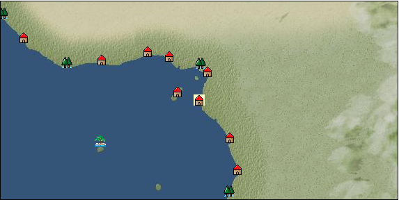

# Port: ガボン

import Tabs from '@theme/Tabs';
import TabItem from '@theme/TabItem';

## General Information

| Attribute | Details |
| :--- | :--- |
| **Port Name** | Gabon |
| **Port Type** | port of alliance |
| **Region** | western africa |
| **Sea Area** | gulf of guinea |
| **Required Language** |  |
| **Coordinates** | （366，4806） |
| **Investment Reward** | [Lot (NO.13)](docs/Items/Consumables/Consumables-Treasure-Chests/item_3021.md) （必要投資額：500,000ドゥカード） |

### Available Facilities

| guild | intermediary | exchange | tool shop | workshop craftsman | Painter | sculptor | peddler |
| --- | --- | --- | --- | --- | --- | --- | --- |
|   |   | ○ | ○ |   |   |   |   |
| Shipyard Master | Lumbermaker | Sail-maker | weapon craftsman | master | TavernFemale | archive | salesperson |
| --- | --- | --- | --- | --- | --- | --- | --- |
| ○ | ○ | ○ | ○ | ○ |   |   |   |
| Shipwright | 銀行 | street worker | 王宮 | Trading post | church | suburbs | translator |
| --- | --- | --- | --- | --- | --- | --- | --- |
| ○ | ○ | ○ |   |   |   |   |   |

<Tabs>
  <TabItem value="trade_goods_sales" label="Trade Goods Sales">

| item | group | purchase price | 同盟時 | remarks |
| --- | --- | --- | --- | --- |
| [coffee](docs/Items/TradeGoods/TradeGoods-Sunddries/item_445.md) | [Trading goods (hobby goods)](docs/Categories/category_10.md) | 428 | (375) |  |
| [sugar cane](docs/Items/TradeGoods/TradeGoods-Foodstuffs/item_93.md) | [Trading items (food items)](docs/Categories/category_3.md) | 219 | (192) |  |
| [coral](docs/Items/TradeGoods/TradeGoods-Gems/item_141.md) | [Trading Items (Gemstones)](docs/Categories/category_15.md) | 3,104 | (2,716) |  |
| [diamond](docs/Items/TradeGoods/TradeGoods-Gems/item_449.md) | [Trading Items (Gemstones)](docs/Categories/category_15.md) | 3,167 | (2,771) |  |
| 要投資（必要投資額：120,000） |
| [Pearl millet](docs/Items/TradeGoods/TradeGoods-Foodstuffs/item_5557.md) | [Trading items (food items)](docs/Categories/category_3.md) | 447 | (392) |  |
| 要投資（必要投資額：180,000） |
| [coconut oil](docs/Items/TradeGoods/TradeGoods-Seasonings/item_446.md) | [交易品（調味料）](docs/Categories/category_4.md) | 210 | (184) |  |
| [malachite](docs/Items/TradeGoods/TradeGoods-Gems/item_679.md) | [Trading Items (Gemstones)](docs/Categories/category_15.md) | 1,883 | (1,648) |  |
| [oil](docs/Items/TradeGoods/TradeGoods-Wares/item_613.md) | [交易品（工業品）](docs/Categories/category_19.md) | 580 | (508) |  |
| [ivory](docs/Items/TradeGoods/TradeGoods-Gems/item_699.md) | [Trading Items (Gemstones)](docs/Categories/category_15.md) | 1,916 | (1,677) |  |
| 要投資（必要投資額：240,000） |
  </TabItem>
  <TabItem value="sale_specialty" label="Sale (Specialty)">

| item | group | sale price | 同盟時 | remarks |
| --- | --- | --- | --- | --- |

#### [Trading products (medical products)](docs/Categories/category_6.md)

| [rooibos](docs/Items/TradeGoods/TradeGoods-Medicine/item_5585.md) | Trading products (medical products) | 1,202 | (1,352) |  |
  </TabItem>
  <TabItem value="sale_no_specialty" label="Sale (No Specialty)">

| item | group | sale price | 同盟時 | remarks |
| --- | --- | --- | --- | --- |
| There is no information on the sale of trade goods. |
  </TabItem>
  <TabItem value="guild_&_others" label="Guild & Others">

| item | group | Sales price | Handling NPC | remarks |
| --- | --- | --- | --- | --- |
| There is no sales information for the item |
| --- |
  </TabItem>
  <TabItem value="toolman" label="Toolman">

| item | group | Sales price | Handling NPC | remarks |
| --- | --- | --- | --- | --- |

#### [Equipment (body)](docs/Categories/category_24.md)

| [Kente](docs/Items/Equipment/Equipment-Body/item_649.md) | Equipment (body) | 53,400 | tool shop owner |  |

#### [装備品（服飾品）](docs/Categories/category_28.md)

| [diamond brooch](docs/Items/Equipment/Equipment-Accessory/item_652.md) | 装備品（服飾品） | 9,000,000 | tool shop owner |  |
| 要投資（必要投資額：120,000） |
| [diamond ring](docs/Items/Equipment/Equipment-Accessory/item_651.md) | 装備品（服飾品） | 10,000,000 | tool shop owner |  |
| 要投資（必要投資額：180,000） |
| [diamond earrings](docs/Items/Equipment/Equipment-Accessory/item_450.md) | 装備品（服飾品） | 7,000,000 | tool shop owner |  |
| [diamond necklace](docs/Items/Equipment/Equipment-Accessory/item_650.md) | 装備品（服飾品） | 11,000,000 | tool shop owner |  |
| 要投資（必要投資額：180,000） |
| [diamond hair ornament](docs/Items/Equipment/Equipment-Accessory/item_653.md) | 装備品（服飾品） | 8,000,000 | tool shop owner |  |
| 要投資（必要投資額：120,000） |
| [補充用漁網](docs/Items/Equipment/Equipment-Accessory/item_2301.md) | 装備品（服飾品） | 1,000 | tool shop owner |  |

#### [Consumables (land battle/deck battle)](docs/Categories/category_29.md)

| [drunken liquor](docs/Items/Consumables/Consumables-Landbattle/item_448.md) | Consumables (land battle/deck battle) | 300 | tool shop owner |  |

#### [Consumables (skill activation)](docs/Categories/category_31.md)

| [card](docs/Items/Consumables/Consumables-Skill/item_855.md) | Consumables (skill activation) | 500 | tool shop owner |  |
| [Card (RANK3)](docs/Items/Consumables/Consumables-Skill/item_1829.md) | Consumables (skill activation) | 2,000 | tool shop owner |  |

#### [Consumables (other)](docs/Categories/category_44.md)

| [Special dye #5](docs/Items/Consumables/Consumables-Other/item_453.md) | Consumables (other) | 5,000 | tool shop owner |  |

#### [Consumables (request documents)](docs/Categories/category_45.md)

| [Industrial product purchase order](docs/Items/Consumables/Consumables-Documents/item_4914.md) | Consumables (request documents) | 40,000 | tool shop owner |  |

#### [Consumables (lots, treasure chests)](docs/Categories/category_50.md)

| [Fun box (NO.1)](docs/Items/Consumables/Consumables-Treasure-Chests/item_4753.md) | Consumables (lots, treasure chests) | 50,000,000 | tool shop owner |  |
  </TabItem>
  <TabItem value="shipyard" label="Shipyard">

### Shipwright

| item | group | Sales price | Handling NPC | remarks |
| --- | --- | --- | --- | --- |

#### [recipe book](docs/Categories/category_22.md)

| [Shipbuilding materials/galley](docs/Items/RecipeBooks/item_1796.md) | recipe book | Fixed recipe | Shipwright |  |

#### [shipbuilding materials](docs/Categories/category_47.md)

| [調理室](docs/Items/ShipbuildingFS/item_1795.md) | shipbuilding materials | Fixed recipe | Shipwright |  |
  </TabItem>
</Tabs>