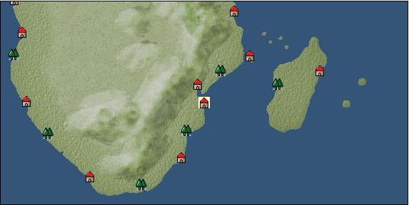

# Port: イニャンバネ

import Tabs from '@theme/Tabs';
import TabItem from '@theme/TabItem';

## General Information

| Attribute | Details |
| :--- | :--- |
| **Port Name** | Inhambane |
| **Port Type** | port of alliance |
| **Region** | southern africa |
| **Sea Area** |  |
| **Required Language** |  |
| **Coordinates** | （1609，5604） |
| **Investment Reward** | [Lot (NO.13)](Items/Consumables/Consumables-Treasure-Chests/item_3021.md) （必要投資額：500,000ドゥカード） |

### Available Facilities

| guild | intermediary | exchange | tool shop | workshop craftsman | Painter | sculptor | peddler |
| --- | --- | --- | --- | --- | --- | --- | --- |
|   |   | ○ | ○ |   |   |   |   |
| Shipyard Master | Lumbermaker | Sail-maker | weapon craftsman | master | TavernFemale | archive | salesperson |
| --- | --- | --- | --- | --- | --- | --- | --- |
| ○ |   |   | ○ | ○ |   |   |   |
| Shipwright | 銀行 | street worker | 王宮 | Trading post | church | suburbs | translator |
| --- | --- | --- | --- | --- | --- | --- | --- |
| ○ | ○ | ○ |   |   |   |   |   |

<Tabs>
  <TabItem value="trade_goods_sales" label="Trade Goods Sales">

| item | group | purchase price | 同盟時 | remarks |
| --- | --- | --- | --- | --- |
| [african wood carving](Items/Trade Goods/TradeGoods-Luxuries/item_5558.md) | [Trading goods (artificial goods)](Categories/category_13.md) | 1,520 | (1,330) |  |
| 要投資（必要投資額：180,000） |
| [emerald](Items/Trade Goods/TradeGoods-Gems/item_777.md) | [Trading Items (Gemstones)](Categories/category_15.md) | (3,451) | 3,020 |  |
| 要投資（必要投資額：600,000） |
| [coffee](Items/Trade Goods/TradeGoods-Sunddries/item_445.md) | [Trading goods (hobby goods)](Categories/category_10.md) | 429 | (376) |  |
| [sugar cane](Items/Trade Goods/TradeGoods-Foodstuffs/item_93.md) | [Trading items (food items)](Categories/category_3.md) | 219 | (192) |  |
| [coral](Items/Trade Goods/TradeGoods-Gems/item_141.md) | [Trading Items (Gemstones)](Categories/category_15.md) | 3,104 | (2,716) |  |
| [rooibos](Items/Trade Goods/TradeGoods-Medicine/item_5585.md) | [Trading products (medical products)](Categories/category_6.md) | 817 | (715) |  |
| 要投資（必要投資額：320,000） |
| [barley](Items/Trade Goods/TradeGoods-Foodstuffs/item_124.md) | [Trading items (food items)](Categories/category_3.md) | 37 | (33) |  |
| [Paddy rice](Items/Trade Goods/TradeGoods-Foodstuffs/item_654.md) | [Trading items (food items)](Categories/category_3.md) | 50 | (44) |  |
| [cotton](Items/Trade Goods/TradeGoods-Fibers/item_610.md) | [交易品（繊維）](Categories/category_1.md) | 306 | (268) |  |
| [silver](Items/Trade Goods/TradeGoods-Metals/item_136.md) | [Trading products (precious metals)](Categories/category_8.md) | 2,860 | (2,503) |  |
  </TabItem>
  <TabItem value="sale_specialty" label="Sale (Specialty)">

| item | group | sale price | 同盟時 | remarks |
| --- | --- | --- | --- | --- |

#### [交易品（工業品）](Categories/category_19.md)

| [rosewood](Items/Trade Goods/TradeGoods-Wares/item_5559.md) | [交易品（工業品）](Categories/category_19.md) | (4,243) | 4,950 |  |
  </TabItem>
  <TabItem value="sale_no_specialty" label="Sale (No Specialty)">

| item | group | sale price | 同盟時 | remarks |
| --- | --- | --- | --- | --- |
| There is no information on the sale of trade goods. |
  </TabItem>
  <TabItem value="guild_&_others" label="Guild & Others">

| item | group | Sales price | Handling NPC | remarks |
| --- | --- | --- | --- | --- |
| There is no sales information for the item |
| --- |
  </TabItem>
  <TabItem value="toolman" label="Toolman">

| item | group | Sales price | Handling NPC | remarks |
| --- | --- | --- | --- | --- |

#### [Equipment (belongings)](Categories/category_27.md)

| [木槍](Items/Equipment/Equipment-Weapon/item_438.md) | [Equipment (belongings)](Categories/category_27.md) | 34,400 | tool shop owner |  |
| [hunter's spear](Items/Equipment/Equipment-Weapon/item_655.md) | [Equipment (belongings)](Categories/category_27.md) | 38,700 | tool shop owner |  |

#### [装備品（服飾品）](Categories/category_28.md)

| [emerald brooch](Items/Equipment/Equipment-Accessory/item_656.md) | [装備品（服飾品）](Categories/category_28.md) | 6,000,000 | tool shop owner |  |
| 要投資（必要投資額：120,000） |
| [emerald ring](Items/Equipment/Equipment-Accessory/item_2634.md) | [装備品（服飾品）](Categories/category_28.md) | 7,000,000 | tool shop owner |  |
| 要投資（必要投資額：180,000） |
| [emerald earrings](Items/Equipment/Equipment-Accessory/item_657.md) | [装備品（服飾品）](Categories/category_28.md) | 4,000,000 | tool shop owner |  |
| [emerald necklace](Items/Equipment/Equipment-Accessory/item_2638.md) | [装備品（服飾品）](Categories/category_28.md) | 8,000,000 | tool shop owner |  |
| 要投資（必要投資額：180,000） |
| [emerald hair ornament](Items/Equipment/Equipment-Accessory/item_658.md) | [装備品（服飾品）](Categories/category_28.md) | 5,000,000 | tool shop owner |  |
| 要投資（必要投資額：120,000） |

#### [Consumables (land battle/deck battle)](Categories/category_29.md)

| [boomerang](Items/Consumables/Consumables-Landbattle/item_454.md) | [Consumables (land battle/deck battle)](Categories/category_29.md) | 150 | tool shop owner |  |
| [Assortment of wound medicine](Items/Consumables/Consumables-Landbattle/item_90.md) | [Consumables (land battle/deck battle)](Categories/category_29.md) | 500 | tool shop owner |  |
| [dart](Items/Consumables/Consumables-Landbattle/item_312.md) | [Consumables (land battle/deck battle)](Categories/category_29.md) | 50 | tool shop owner |  |
| [torch for throwing](Items/Consumables/Consumables-Landbattle/item_313.md) | [Consumables (land battle/deck battle)](Categories/category_29.md) | 150 | tool shop owner |  |
| [therapeutic drug](Items/Consumables/Consumables-Landbattle/item_89.md) | [Consumables (land battle/deck battle)](Categories/category_29.md) | 300 | tool shop owner |  |

#### [Consumables (skill activation)](Categories/category_31.md)

| [捕獲網](Items/Consumables/Consumables-Skill/item_315.md) | [Consumables (skill activation)](Categories/category_31.md) | 300 | tool shop owner |  |

#### [Consumables (request documents)](Categories/category_45.md)

| [Dye purchase order](Items/Consumables/Consumables-Documents/item_4913.md) | [Consumables (request documents)](Categories/category_45.md) | 20,000 | tool shop owner |  |
  </TabItem>
  <TabItem value="shipyard" label="Shipyard">

### Shipyard Master

| item | group | Sales price | Handling NPC | remarks |
| --- | --- | --- | --- | --- |

#### [Boat](Categories/category_43.md)

| [arabian galley](Items/Ships/item_592.md) | [Boat](Categories/category_43.md) | 3,840,000 | Shipyard Master |  |
| [Galliot](Items/Ships/item_210.md) | [Boat](Categories/category_43.md) | 156,000 | Shipyard Master |  |
| [galley](Items/Ships/item_227.md) | [Boat](Categories/category_43.md) | 645,000 | Shipyard Master |  |
| [sambouk](Items/Ships/item_783.md) | [Boat](Categories/category_43.md) | 1,000,000 | Shipyard Master |  |
| [Dow](Items/Ships/item_780.md) | [Boat](Categories/category_43.md) | 360,000 | Shipyard Master |  |
| [Varsha](Items/Ships/item_201.md) | [Boat](Categories/category_43.md) | 2,000 | Shipyard Master |  |
| [commercial galley](Items/Ships/item_229.md) | [Boat](Categories/category_43.md) | 650,000 | Shipyard Master |  |
| [commercial thumb book](Items/Ships/item_785.md) | [Boat](Categories/category_43.md) | 1,100,000 | Shipyard Master |  |
| [commercial dow](Items/Ships/item_782.md) | [Boat](Categories/category_43.md) | 372,000 | Shipyard Master |  |
| [commercial varsha](Items/Ships/item_204.md) | [Boat](Categories/category_43.md) | 5,200 | Shipyard Master |  |
| [assault galley](Items/Ships/item_224.md) | [Boat](Categories/category_43.md) | 640,000 | Shipyard Master |  |
| [Battle Barsha](Items/Ships/item_203.md) | [Boat](Categories/category_43.md) | 5,100 | Shipyard Master |  |
| [exploration barsha](Items/Ships/item_202.md) | [Boat](Categories/category_43.md) | 5,000 | Shipyard Master |  |
| [Armed Sambouk](Items/Ships/item_784.md) | [Boat](Categories/category_43.md) | 1,000,000 | Shipyard Master |  |
| [assault dhow](Items/Ships/item_781.md) | [Boat](Categories/category_43.md) | 365,000 | Shipyard Master |  |
| [light galley](Items/Ships/item_209.md) | [Boat](Categories/category_43.md) | 150,000 | Shipyard Master |  |
| [transportation galley](Items/Ships/item_211.md) | [Boat](Categories/category_43.md) | 160,000 | Shipyard Master |  |

### Shipwright

| item | group | Sales price | Handling NPC | remarks |
| --- | --- | --- | --- | --- |

#### [recipe book](Categories/category_22.md)

| [Processed wood manufacturing method](Items/Recipe Book/item_3097.md) | [recipe book](Categories/category_22.md) | Fixed recipe | Shipwright |  |
  </TabItem>
  <TabItem value="weapon craftsman" label="weapon craftsman">

| item | group | Sales price | Handling NPC | remarks |
| --- | --- | --- | --- | --- |

#### [Ship parts (special weapons)](Categories/category_37.md)

| [Corvus](Items/Ship Parts/Shipparts-Special-Weapons/item_194.md) | [Ship parts (special weapons)](Categories/category_37.md) | 24,000 | weapon craftsman |  |
| [rum](Items/Ship Parts/Shipparts-Special-Weapons/item_191.md) | [Ship parts (special weapons)](Categories/category_37.md) | 4,800 | weapon craftsman |  |
| [medium sized ram](Items/Ship Parts/Shipparts-Special-Weapons/item_192.md) | [Ship parts (special weapons)](Categories/category_37.md) | 31,000 | weapon craftsman |  |
| [large ram](Items/Ship Parts/Shipparts-Special-Weapons/item_788.md) | [Ship parts (special weapons)](Categories/category_37.md) | 100,000 | weapon craftsman |  |
| [small corvus](Items/Ship Parts/Shipparts-Special-Weapons/item_193.md) | [Ship parts (special weapons)](Categories/category_37.md) | 3,000 | weapon craftsman |  |
| [small ram](Items/Ship Parts/Shipparts-Special-Weapons/item_190.md) | [Ship parts (special weapons)](Categories/category_37.md) | 1,000 | weapon craftsman |  |
| [small poop](Items/Ship Parts/Shipparts-Special-Weapons/item_198.md) | [Ship parts (special weapons)](Categories/category_37.md) | 39,000 | weapon craftsman |  |
| [small ship forecastle](Items/Ship Parts/Shipparts-Special-Weapons/item_195.md) | [Ship parts (special weapons)](Categories/category_37.md) | 5,000 | weapon craftsman |  |
| [poop](Items/Ship Parts/Shipparts-Special-Weapons/item_837.md) | [Ship parts (special weapons)](Categories/category_37.md) | 130,000 | weapon craftsman |  |
| [forecastle](Items/Ship Parts/Shipparts-Special-Weapons/item_241.md) | [Ship parts (special weapons)](Categories/category_37.md) | 16,000 | weapon craftsman |  |
| [additional small spanker](Items/Ship Parts/Shipparts-Special-Weapons/item_199.md) | [Ship parts (special weapons)](Categories/category_37.md) | 3,500 | weapon craftsman |  |
| [additional small split](Items/Ship Parts/Shipparts-Special-Weapons/item_196.md) | [Ship parts (special weapons)](Categories/category_37.md) | 2,000 | weapon craftsman |  |

#### [Ship parts (cannon)](Categories/category_38.md)

| [4 amfer guns](Items/Ship Parts/Shipparts-Cannons/item_391.md) | [Ship parts (cannon)](Categories/category_38.md) | 26,600 | weapon craftsman |  |
| [6 Amfer cannons](Items/Ship Parts/Shipparts-Cannons/item_392.md) | [Ship parts (cannon)](Categories/category_38.md) | 81,000 | weapon craftsman |  |
| [4 Caprice guns](Items/Ship Parts/Shipparts-Cannons/item_395.md) | [Ship parts (cannon)](Categories/category_38.md) | 18,200 | weapon craftsman |  |
| [6 Caprice guns](Items/Ship Parts/Shipparts-Cannons/item_396.md) | [Ship parts (cannon)](Categories/category_38.md) | 55,500 | weapon craftsman |  |
| [8 Caprice guns](Items/Ship Parts/Shipparts-Cannons/item_397.md) | [Ship parts (cannon)](Categories/category_38.md) | 103,600 | weapon craftsman |  |
| [10 culverines](Items/Ship Parts/Shipparts-Cannons/item_375.md) | [Ship parts (cannon)](Categories/category_38.md) | 136,300 | weapon craftsman |  |
| [12 culverin guns](Items/Ship Parts/Shipparts-Cannons/item_744.md) | [Ship parts (cannon)](Categories/category_38.md) | 196,300 | weapon craftsman |  |
| [4 culverine guns](Items/Ship Parts/Shipparts-Cannons/item_372.md) | [Ship parts (cannon)](Categories/category_38.md) | 21,800 | weapon craftsman |  |
| [6 culverine guns](Items/Ship Parts/Shipparts-Cannons/item_373.md) | [Ship parts (cannon)](Categories/category_38.md) | 49,100 | weapon craftsman |  |
| [8 culverine guns](Items/Ship Parts/Shipparts-Cannons/item_374.md) | [Ship parts (cannon)](Categories/category_38.md) | 87,300 | weapon craftsman |  |
| [4 carronades](Items/Ship Parts/Shipparts-Cannons/item_836.md) | [Ship parts (cannon)](Categories/category_38.md) | 14,500 | weapon craftsman |  |
| [10 Cannon Pedro guns](Items/Ship Parts/Shipparts-Cannons/item_746.md) | [Ship parts (cannon)](Categories/category_38.md) | 190,900 | weapon craftsman |  |
| [12 Cannon Pedro guns](Items/Ship Parts/Shipparts-Cannons/item_834.md) | [Ship parts (cannon)](Categories/category_38.md) | 274,900 | weapon craftsman |  |
| [4 Cannon Pedro guns](Items/Ship Parts/Shipparts-Cannons/item_376.md) | [Ship parts (cannon)](Categories/category_38.md) | 30,500 | weapon craftsman |  |
| [6 Cannon Pedro guns](Items/Ship Parts/Shipparts-Cannons/item_377.md) | [Ship parts (cannon)](Categories/category_38.md) | 68,700 | weapon craftsman |  |
| [8 Cannon Pedro guns](Items/Ship Parts/Shipparts-Cannons/item_745.md) | [Ship parts (cannon)](Categories/category_38.md) | 122,200 | weapon craftsman |  |
| [4 Shumine cannons](Items/Ship Parts/Shipparts-Cannons/item_2967.md) | [Ship parts (cannon)](Categories/category_38.md) | 29,300 | weapon craftsman |  |
| [6 Shumine cannons](Items/Ship Parts/Shipparts-Cannons/item_2968.md) | [Ship parts (cannon)](Categories/category_38.md) | 89,100 | weapon craftsman |  |
| [2 saker cannons](Items/Ship Parts/Shipparts-Cannons/item_183.md) | [Ship parts (cannon)](Categories/category_38.md) | 3,200 | weapon craftsman |  |
| [4 saker cannons](Items/Ship Parts/Shipparts-Cannons/item_184.md) | [Ship parts (cannon)](Categories/category_38.md) | 12,600 | weapon craftsman |  |
| [6 Saker cannons](Items/Ship Parts/Shipparts-Cannons/item_185.md) | [Ship parts (cannon)](Categories/category_38.md) | 28,400 | weapon craftsman |  |
| [8 Saker cannons](Items/Ship Parts/Shipparts-Cannons/item_186.md) | [Ship parts (cannon)](Categories/category_38.md) | 50,500 | weapon craftsman |  |
| [10 demi culverin cannons](Items/Ship Parts/Shipparts-Cannons/item_370.md) | [Ship parts (cannon)](Categories/category_38.md) | 101,000 | weapon craftsman |  |
| [12 demi culverin cannons](Items/Ship Parts/Shipparts-Cannons/item_371.md) | [Ship parts (cannon)](Categories/category_38.md) | 145,400 | weapon craftsman |  |
| [2 demi culverin cannons](Items/Ship Parts/Shipparts-Cannons/item_188.md) | [Ship parts (cannon)](Categories/category_38.md) | 4,000 | weapon craftsman |  |
| [4 demi culverin cannons](Items/Ship Parts/Shipparts-Cannons/item_189.md) | [Ship parts (cannon)](Categories/category_38.md) | 16,200 | weapon craftsman |  |
| [6 demi culverin cannons](Items/Ship Parts/Shipparts-Cannons/item_368.md) | [Ship parts (cannon)](Categories/category_38.md) | 36,400 | weapon craftsman |  |
| [8 demi culverin cannons](Items/Ship Parts/Shipparts-Cannons/item_369.md) | [Ship parts (cannon)](Categories/category_38.md) | 64,600 | weapon craftsman |  |
| [4 Draconis cannons](Items/Ship Parts/Shipparts-Cannons/item_386.md) | [Ship parts (cannon)](Categories/category_38.md) | 18,200 | weapon craftsman |  |
| [6 Draconis cannons](Items/Ship Parts/Shipparts-Cannons/item_387.md) | [Ship parts (cannon)](Categories/category_38.md) | 55,500 | weapon craftsman |  |
| [8 Draconis cannons](Items/Ship Parts/Shipparts-Cannons/item_390.md) | [Ship parts (cannon)](Categories/category_38.md) | 103,600 | weapon craftsman |  |
| [4 pyro cannons](Items/Ship Parts/Shipparts-Cannons/item_384.md) | [Ship parts (cannon)](Categories/category_38.md) | 12,500 | weapon craftsman |  |
| [6 pyro cannons](Items/Ship Parts/Shipparts-Cannons/item_385.md) | [Ship parts (cannon)](Categories/category_38.md) | 38,000 | weapon craftsman |  |
| [2 falcon guns](Items/Ship Parts/Shipparts-Cannons/item_174.md) | [Ship parts (cannon)](Categories/category_38.md) | 500 | weapon craftsman |  |
| [4 falcon guns](Items/Ship Parts/Shipparts-Cannons/item_175.md) | [Ship parts (cannon)](Categories/category_38.md) | 2,000 | weapon craftsman |  |
| [6 falcon guns](Items/Ship Parts/Shipparts-Cannons/item_176.md) | [Ship parts (cannon)](Categories/category_38.md) | 4,600 | weapon craftsman |  |
| [8 falcon guns](Items/Ship Parts/Shipparts-Cannons/item_177.md) | [Ship parts (cannon)](Categories/category_38.md) | 8,100 | weapon craftsman |  |
| [4 frango guns](Items/Ship Parts/Shipparts-Cannons/item_393.md) | [Ship parts (cannon)](Categories/category_38.md) | 12,500 | weapon craftsman |  |
| [6 frango guns](Items/Ship Parts/Shipparts-Cannons/item_394.md) | [Ship parts (cannon)](Categories/category_38.md) | 38,000 | weapon craftsman |  |
| [10 minion cannons](Items/Ship Parts/Shipparts-Cannons/item_182.md) | [Ship parts (cannon)](Categories/category_38.md) | 34,800 | weapon craftsman |  |
| [2 minion cannons](Items/Ship Parts/Shipparts-Cannons/item_178.md) | [Ship parts (cannon)](Categories/category_38.md) | 1,400 | weapon craftsman |  |
| [4 minion cannons](Items/Ship Parts/Shipparts-Cannons/item_179.md) | [Ship parts (cannon)](Categories/category_38.md) | 5,600 | weapon craftsman |  |
| [6 minion cannons](Items/Ship Parts/Shipparts-Cannons/item_180.md) | [Ship parts (cannon)](Categories/category_38.md) | 12,400 | weapon craftsman |  |
| [8 minion cannons](Items/Ship Parts/Shipparts-Cannons/item_181.md) | [Ship parts (cannon)](Categories/category_38.md) | 22,400 | weapon craftsman |  |
| [4 Meteora cannons](Items/Ship Parts/Shipparts-Cannons/item_398.md) | [Ship parts (cannon)](Categories/category_38.md) | 26,600 | weapon craftsman |  |
| [6 Meteora cannons](Items/Ship Parts/Shipparts-Cannons/item_399.md) | [Ship parts (cannon)](Categories/category_38.md) | 81,000 | weapon craftsman |  |
| [4 Volcan guns](Items/Ship Parts/Shipparts-Cannons/item_2965.md) | [Ship parts (cannon)](Categories/category_38.md) | 29,300 | weapon craftsman |  |
| [6 Volcan guns](Items/Ship Parts/Shipparts-Cannons/item_2966.md) | [Ship parts (cannon)](Categories/category_38.md) | 89,100 | weapon craftsman |  |
  </TabItem>
</Tabs>