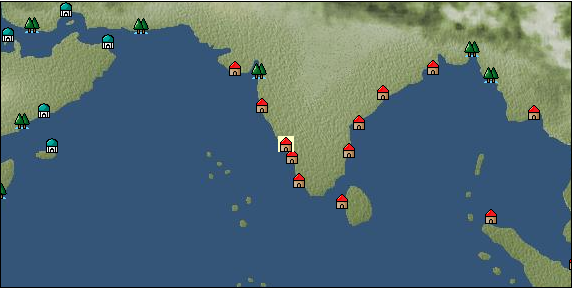

# Port: マンガロール

import Tabs from '@theme/Tabs';
import TabItem from '@theme/TabItem';

## General Information

| Attribute | Details |
| :--- | :--- |
| **Port Name** | Mangalore |
| **Port Type** | port of alliance |
| **Region** | Eastern Africa/India |
| **Sea Area** | Off the west coast of India |
| **Required Language** | Indian languages |
| **Coordinates** | （3410，4270） |
| **Investment Reward** | [Lot (NO.13)](Items/Consumables/Consumables-Treasure-Chests/item_3021.md) （必要投資額：500,000ドゥカード） |

### Available Facilities

| guild | intermediary | exchange | tool shop | workshop craftsman | Painter | sculptor | peddler |
| --- | --- | --- | --- | --- | --- | --- | --- |
|   |   | ○ | ○ |   |   |   |   |
| Shipyard Master | Lumbermaker | Sail-maker | weapon craftsman | master | TavernFemale | archive | salesperson |
| --- | --- | --- | --- | --- | --- | --- | --- |
| ○ | ○ |   | ○ |   |   |   |   |
| Shipwright | 銀行 | street worker | 王宮 | Trading post | church | suburbs | translator |
| --- | --- | --- | --- | --- | --- | --- | --- |
| ○ | ○ | ○ |   |   |   |   |   |

<Tabs>
  <TabItem value="trade_goods_sales" label="Trade Goods Sales">

| item | group | purchase price | 同盟時 | remarks |
| --- | --- | --- | --- | --- |
| [cashmere](Items/Trade Goods/TradeGoods-Fibers/item_5560.md) | [交易品（繊維）](Categories/category_1.md) | 1,184 | (1,036) |  |
| [jasmine](Items/Trade Goods/TradeGoods-Perfume/item_772.md) | [Trading Goods (Spices)](Categories/category_11.md) | 2,958 | (2,588) |  |
| [ginger](Items/Trade Goods/TradeGoods-Spices/item_112.md) | [Trading Goods (Spices)](Categories/category_12.md) | 260 | (228) |  |
| [goat hair](Items/Trade Goods/TradeGoods-Fibers/item_770.md) | [交易品（繊維）](Categories/category_1.md) | 848 | (742) |  |
| [sandalwood](Items/Trade Goods/TradeGoods-Perfume/item_771.md) | [Trading Goods (Spices)](Categories/category_11.md) | 2,063 | (1,805) |  |
| [rosewood](Items/Trade Goods/TradeGoods-Wares/item_5559.md) | [交易品（工業品）](Categories/category_19.md) | 3,981 | (3,483) |  |
| 要投資（必要投資額：240,000） |
| [cotton](Items/Trade Goods/TradeGoods-Fibers/item_610.md) | [交易品（繊維）](Categories/category_1.md) | 306 | (268) |  |
| [iron ore](Items/Trade Goods/TradeGoods-Minerals/item_146.md) | [Trading Items (Iron Stone)](Categories/category_7.md) | 648 | (567) |  |
| 要投資（必要投資額：180,000） |
| [brass work](Items/Trade Goods/TradeGoods-Luxuries/item_5561.md) | [Trading goods (artificial goods)](Categories/category_13.md) | 1,877 | (1,643) |  |
| 要投資（必要投資額：320,000） |
| [jute](Items/Trade Goods/TradeGoods-Fibers/item_128.md) | [交易品（繊維）](Categories/category_1.md) | 141 | (124) |  |
  </TabItem>
  <TabItem value="sale_specialty" label="Sale (Specialty)">

| item | group | sale price | 同盟時 | remarks |
| --- | --- | --- | --- | --- |
| Sales information for trade items with specialty judgment set is not registered. |
  </TabItem>
  <TabItem value="sale_no_specialty" label="Sale (No Specialty)">

| item | group | sale price | 同盟時 | remarks |
| --- | --- | --- | --- | --- |
| There is no information on the sale of trade goods. |
  </TabItem>
  <TabItem value="guild_&_others" label="Guild & Others">

| item | group | Sales price | Handling NPC | remarks |
| --- | --- | --- | --- | --- |
| There is no sales information for the item |
| --- |
  </TabItem>
  <TabItem value="toolman" label="Toolman">

| item | group | Sales price | Handling NPC | remarks |
| --- | --- | --- | --- | --- |

#### [Equipment (body)](Categories/category_24.md)

| [kurta](Items/Equipment/Equipment-Body/item_1334.md) | Equipment (body) | 83,500 | tool shop owner |  |
| [sari](Items/Equipment/Equipment-Body/item_1335.md) | Equipment (body) | 106,100 | tool shop owner |  |

#### [装備品（服飾品）](Categories/category_28.md)

| [emerald earrings](Items/Equipment/Equipment-Accessory/item_657.md) | 装備品（服飾品） | 4,000,000 | tool shop owner |  |

#### [Consumables (land battle/deck battle)](Categories/category_29.md)

| [strong adhesive oil](Items/Consumables/Consumables-Landbattle/item_662.md) | Consumables (land battle/deck battle) | 200 | tool shop owner |  |
| [hellfire torch](Items/Consumables/Consumables-Landbattle/item_233.md) | Consumables (land battle/deck battle) | 300 | tool shop owner |  |
| [Arsenite poison](Items/Consumables/Consumables-Landbattle/item_663.md) | Consumables (land battle/deck battle) | 400 | tool shop owner |  |

#### [Consumables (skill activation)](Categories/category_31.md)

| [enchanting incense](Items/Consumables/Consumables-Skill/item_664.md) | Consumables (skill activation) | 1,000 | tool shop owner |  |

#### [Consumables (request documents)](Categories/category_45.md)

| [Arms purchase order form](Items/Consumables/Consumables-Documents/item_2978.md) | Consumables (request documents) | 30,000 | tool shop owner |  |

#### [Consumables (lots, treasure chests)](Categories/category_50.md)

| [Fun box (NO.6)](Items/Consumables/Consumables-Treasure-Chests/item_4758.md) | Consumables (lots, treasure chests) | 50,000,000 | tool shop owner |  |
  </TabItem>
  <TabItem value="shipyard" label="Shipyard">

### Shipwright

| item | group | Sales price | Handling NPC | remarks |
| --- | --- | --- | --- | --- |

#### [recipe book](Categories/category_22.md)

| [Shipbuilding materials and ropes](Items/Recipe Book/item_1761.md) | recipe book | Fixed recipe | Shipwright |  |

#### [shipbuilding materials](Categories/category_47.md)

| [舫綱](Items/Shipbuilding FS Material/item_1762.md) | shipbuilding materials | Fixed recipe | Shipwright |  |
  </TabItem>
</Tabs>