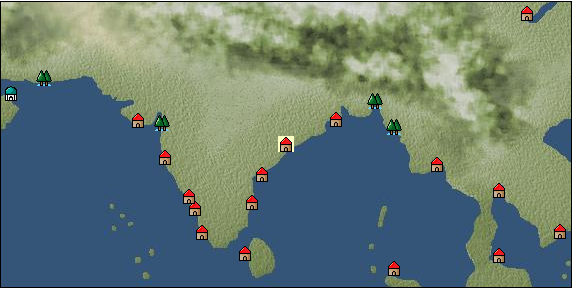

# Port: Visakhapatnam

import Tabs from '@theme/Tabs';
import TabItem from '@theme/TabItem';

## General Information

| Attribute | Details |
| :--- | :--- |
| **Port Name** | Visakhapatnam |
| **Port Type** | port of alliance |
| **Region** | Eastern Africa/India |
| **Sea Area** | bay of bengal |
| **Required Language** | Indian languages |
| **Coordinates** | （3799，4059） |
| **Investment Reward** | [Lot (NO.13)](docs/Items/Consumables/Consumables-Treasure-Chests/item_3021.md) （必要投資額：500,000ドゥカード） |

### Available Facilities

| guild | intermediary | exchange | tool shop | workshop craftsman | Painter | sculptor | peddler |
| --- | --- | --- | --- | --- | --- | --- | --- |
|   |   | ○ | ○ |   |   |   |   |
| Shipyard Master | Lumbermaker | Sail-maker | weapon craftsman | master | TavernFemale | archive | salesperson |
| --- | --- | --- | --- | --- | --- | --- | --- |
| ○ | ○ |   | ○ | ○ |   |   |   |
| Shipwright | 銀行 | street worker | 王宮 | Trading post | church | suburbs | translator |
| --- | --- | --- | --- | --- | --- | --- | --- |
| ○ | ○ | ○ |   |   |   |   |   |

### Description
A port city located on the east coast of India, there are many Buddhist ruins, and the city has prospered under the patronage of King Ashoka of the Mauryan Dynasty, where Buddhist pilgrimages have been conducted since ancient times.The changes in rulers have left traces of the cityscape. Cultural area: India

<Tabs>
  <TabItem value="trade_goods_sales" label="Trade Goods Sales">

| Item | Group | Purchase Price | Allied Price | Remarks |
| --- | --- | --- | --- | --- |
| [Indian indigo](docs/Items/TradeGoods/TradeGoods-Dye/item_157.md) | [Trading Goods (Dye)](docs/Categories/category_2.md) | 352 | (308) |  |
| [pepper](docs/Items/TradeGoods/TradeGoods-Spices/item_58.md) | [Trading Goods (Spices)](docs/Categories/category_12.md) | 268 | (235) |  |
| 要投資（必要投資額：320,000） |
| [cinnamon](docs/Items/TradeGoods/TradeGoods-Spices/item_1432.md) | [Trading Goods (Spices)](docs/Categories/category_12.md) | 436 | (382) |  |
| [sheep](docs/Items/TradeGoods/TradeGoods-Livestock/item_253.md) | [Trading Goods (Livestock)](docs/Categories/category_18.md) | 112 | (98) |  |
| [wood](docs/Items/TradeGoods/TradeGoods-Wares/item_277.md) | [交易品（工業品）](docs/Categories/category_19.md) | 620 | (543) |  |
| [black tea](docs/Items/TradeGoods/TradeGoods-Sunddries/item_675.md) | [Trading goods (hobby goods)](docs/Categories/category_10.md) | 675 | (591) |  |
| [cotton](docs/Items/TradeGoods/TradeGoods-Fibers/item_610.md) | [交易品（繊維）](docs/Categories/category_1.md) | 280 | (245) |  |
| [red ore](docs/Items/TradeGoods/TradeGoods-Minerals/item_887.md) | [Trading Items (Iron Stone)](docs/Categories/category_7.md) | (9,326) | 8,160 |  |
| 要投資（必要投資額：8,500,000） |
| [iron ore](docs/Items/TradeGoods/TradeGoods-Minerals/item_146.md) | [Trading Items (Iron Stone)](docs/Categories/category_7.md) | 648 | (567) |  |
| 要投資（必要投資額：320,000） |
  </TabItem>
  <TabItem value="sale_specialty" label="Sale (Specialty)">

| Item | Group | sale price | Allied Price | Remarks |
| --- | --- | --- | --- | --- |
| Sales information for trade items with specialty judgment set is not registered. |
  </TabItem>
  <TabItem value="sale_no_specialty" label="Sale (No Specialty)">

| Item | Group | sale price | Allied Price | Remarks |
| --- | --- | --- | --- | --- |
| There is no information on the sale of trade goods. |
  </TabItem>
  <TabItem value="guild_&_others" label="Guild & Others">

| Item | Group | Sales price | Handling NPC | Remarks |
| --- | --- | --- | --- | --- |
| There is no sales information for the Item |
| --- |
  </TabItem>
  <TabItem value="toolman" label="Toolman">

| Item | Group | Sales price | Handling NPC | Remarks |
| --- | --- | --- | --- | --- |

#### [Equipment (body)](docs/Categories/category_24.md)

| [salwar](docs/Items/Equipment/Equipment-Body/item_1468.md) | Equipment (body) | 45,600 | tool shop owner |  |
| [Pijamas](docs/Items/Equipment/Equipment-Body/item_1467.md) | Equipment (body) | 284,200 | tool shop owner |  |

#### [Equipment (belongings)](docs/Categories/category_27.md)

| [Narnari](docs/Items/Equipment/Equipment-Weapon/item_1842.md) | Equipment (belongings) | 42,000 | tool shop owner |  |

#### [Consumables (land battle/deck battle)](docs/Categories/category_29.md)

| [strong adhesive oil](docs/Items/Consumables/Consumables-Landbattle/item_662.md) | Consumables (land battle/deck battle) | 200 | tool shop owner |  |
| [hellfire torch](docs/Items/Consumables/Consumables-Landbattle/item_233.md) | Consumables (land battle/deck battle) | 300 | tool shop owner |  |
| [Arsenite poison](docs/Items/Consumables/Consumables-Landbattle/item_663.md) | Consumables (land battle/deck battle) | 400 | tool shop owner |  |

#### [Consumables (skill activation)](docs/Categories/category_31.md)

| [enchanting incense](docs/Items/Consumables/Consumables-Skill/item_664.md) | Consumables (skill activation) | 1,000 | tool shop owner |  |

#### [Consumables (request documents)](docs/Categories/category_45.md)

| [Luxury goods purchase order form](docs/Items/Consumables/Consumables-Documents/item_4778.md) | Consumables (request documents) | 40,000 | tool shop owner |  |
| [Arms purchase order form](docs/Items/Consumables/Consumables-Documents/item_2978.md) | Consumables (request documents) | 30,000 | tool shop owner |  |
  </TabItem>
  <TabItem value="shipyard" label="Shipyard">

### Shipwright

| Item | Group | Sales price | Handling NPC | Remarks |
| --- | --- | --- | --- | --- |

#### [recipe book](docs/Categories/category_22.md)

| [Shipbuilding materials and ropes](docs/Items/RecipeBooks/item_1761.md) | recipe book | Fixed recipe | Shipwright |  |

#### [shipbuilding materials](docs/Categories/category_47.md)

| [舫綱](docs/Items/ShipbuildingFS/item_1762.md) | shipbuilding materials | Fixed recipe | Shipwright |  |
  </TabItem>
</Tabs>