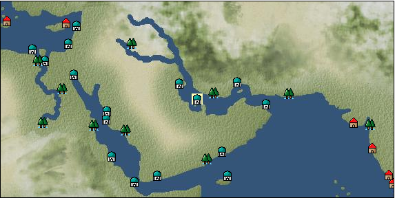

# Port: Manama

import Tabs from '@theme/Tabs';
import TabItem from '@theme/TabItem';

## General Information

| Attribute | Details |
| :--- | :--- |
| **Port Name** | Manama |
| **Port Type** | port of alliance |
| **Region** | Eastern Africa/India |
| **Sea Area** | persian gulf |
| **Required Language** | persian |
| **Coordinates** | （2300，3825） |
| **Investment Reward** | [Lot (NO.13)](docs/Items/Consumables/Consumables-Treasure-Chests/item_3021.md) （必要投資額：500,000ドゥカード） |

### Available Facilities

| guild | intermediary | exchange | tool shop | workshop craftsman | Painter | sculptor | peddler |
| --- | --- | --- | --- | --- | --- | --- | --- |
|   |   | ○ | ○ |   |   |   |   |
| Shipyard Master | Lumbermaker | Sail-maker | weapon craftsman | master | TavernFemale | archive | salesperson |
| --- | --- | --- | --- | --- | --- | --- | --- |
| ○ |   | ○ | ○ | ○ |   |   |   |
| Shipwright | 銀行 | street worker | 王宮 | Trading post | church | suburbs | translator |
| --- | --- | --- | --- | --- | --- | --- | --- |
| ○ | ○ | ○ |   |   |   |   |   |

### Description
A city in the northeast of Bahrain Island, located in the Persian Gulf. Because of its location, it flourished as a hub for maritime transportation. Pearls harvested from nearby waters are of extremely high quality and are prized even in Europe. Cultural area: Persia

<Tabs>
  <TabItem value="trade_goods_sales" label="Trade Goods Sales">

| Item | Group | Purchase Price | Allied Price | Remarks |
| --- | --- | --- | --- | --- |
| [olive oil](docs/Items/TradeGoods/TradeGoods-Seasonings/item_48.md) | [交易品（調味料）](docs/Categories/category_4.md) | 289 | (253) |  |
| [ginger](docs/Items/TradeGoods/TradeGoods-Spices/item_112.md) | [Trading Goods (Spices)](docs/Categories/category_12.md) | 238 | (209) |  |
| [taffeta](docs/Items/TradeGoods/TradeGoods-Fabrics/item_1001.md) | [交易品（織物）](docs/Categories/category_20.md) | 3,121 | (2,731) |  |
| 要投資（必要投資額：500,000） |
| [turquoise](docs/Items/TradeGoods/TradeGoods-Gems/item_1006.md) | [Trading Items (Gemstones)](docs/Categories/category_15.md) | 1,133 | (992) |  |
| 要投資（必要投資額：240,000） |
| [basil](docs/Items/TradeGoods/TradeGoods-Spices/item_126.md) | [Trading Goods (Spices)](docs/Categories/category_12.md) | 108 | (95) |  |
| [persian rug](docs/Items/TradeGoods/TradeGoods-Fabrics/item_606.md) | [交易品（織物）](docs/Categories/category_20.md) | 4,371 | (3,825) |  |
| [pearl](docs/Items/TradeGoods/TradeGoods-Gems/item_769.md) | [Trading Items (Gemstones)](docs/Categories/category_15.md) | 4,458 | (3,901) |  |
| 要投資（必要投資額：320,000） |
| [green ore](docs/Items/TradeGoods/TradeGoods-Minerals/item_886.md) | [Trading Items (Iron Stone)](docs/Categories/category_7.md) | (10,629) | 9,300 |  |
| 要投資（必要投資額：8,500,000） |
| [wool](docs/Items/TradeGoods/TradeGoods-Fibers/item_5.md) | [交易品（繊維）](docs/Categories/category_1.md) | 339 | (297) |  |
| [mutton](docs/Items/TradeGoods/TradeGoods-Foodstuffs/item_33.md) | [Trading items (food items)](docs/Categories/category_3.md) | 355 | (311) |  |
  </TabItem>
  <TabItem value="sale_specialty" label="Sale (Specialty)">

| Item | Group | sale price | Allied Price | Remarks |
| --- | --- | --- | --- | --- |
| Sales information for trade items with specialty judgment set is not registered. |
  </TabItem>
  <TabItem value="sale_no_specialty" label="Sale (No Specialty)">

| Item | Group | sale price | Allied Price | Remarks |
| --- | --- | --- | --- | --- |
| There is no information on the sale of trade goods. |
  </TabItem>
  <TabItem value="guild_&_others" label="Guild & Others">

| Item | Group | Sales price | Handling NPC | Remarks |
| --- | --- | --- | --- | --- |
| There is no sales information for the Item |
| --- |
  </TabItem>
  <TabItem value="toolman" label="Toolman">

| Item | Group | Sales price | Handling NPC | Remarks |
| --- | --- | --- | --- | --- |

#### [Equipment (body)](docs/Categories/category_24.md)

| [persian dress](docs/Items/Equipment/Equipment-Body/item_1372.md) | Equipment (body) | 138,600 | tool shop owner |  |

#### [Consumables (land battle/deck battle)](docs/Categories/category_29.md)

| [numbness medicine](docs/Items/Consumables/Consumables-Landbattle/item_452.md) | Consumables (land battle/deck battle) | 500 | tool shop owner |  |
| [strong adhesive oil](docs/Items/Consumables/Consumables-Landbattle/item_662.md) | Consumables (land battle/deck battle) | 200 | tool shop owner |  |
| [hellfire torch](docs/Items/Consumables/Consumables-Landbattle/item_233.md) | Consumables (land battle/deck battle) | 300 | tool shop owner |  |

#### [Consumables (naval/hand-to-hand combat)](docs/Categories/category_30.md)

| [strange smell](docs/Items/Consumables/Consumables-navalhand-to-hand combat/item_809.md) | Consumables (naval/hand-to-hand combat) | 3,000 | tool shop owner |  |
  </TabItem>
  <TabItem value="shipyard" label="Shipyard">

### Shipwright

| Item | Group | Sales price | Handling NPC | Remarks |
| --- | --- | --- | --- | --- |

#### [recipe book](docs/Categories/category_22.md)

| [Shipbuilding materials and ropes](docs/Items/RecipeBooks/item_1761.md) | recipe book | Fixed recipe | Shipwright |  |

#### [shipbuilding materials](docs/Categories/category_47.md)

| [舫綱](docs/Items/ShipbuildingFS/item_1762.md) | shipbuilding materials | Fixed recipe | Shipwright |  |
  </TabItem>
</Tabs>