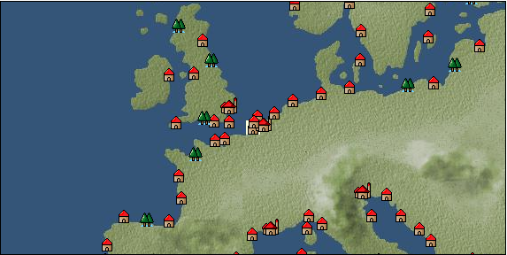

# Port: アントワープ

import Tabs from '@theme/Tabs';
import TabItem from '@theme/TabItem';

## General Information

| Attribute | Details |
| :--- | :--- |
| **Port Name** | antwerp |
| **Port Type** | port of alliance |
| **Region** | northern europe |
| **Sea Area** | North Sea |
| **Required Language** | dutch |
| **Coordinates** | （47，2521） |
| **Investment Reward** | [Adjutant skill development method](Items/Consumables/Consumables-Documents/item_4360.md) （必要投資額：5,000,000ドゥカード） |

### Available Facilities

| guild | intermediary | exchange | tool shop | workshop craftsman | Painter | sculptor | peddler |
| --- | --- | --- | --- | --- | --- | --- | --- |
|   |   | ○ | ○ | ○ |   | ○ | ○ |
| Shipyard Master | Lumbermaker | Sail-maker | weapon craftsman | master | TavernFemale | archive | salesperson |
| --- | --- | --- | --- | --- | --- | --- | --- |
| ○ |   | ○ | ○ | ○ |   |   |   |
| Shipwright | 銀行 | street worker | 王宮 | Trading post | church | suburbs | translator |
| --- | --- | --- | --- | --- | --- | --- | --- |
| ○ | ○ | ○ |   |   | ○ |   |   |

### Description
The most prosperous city in the ten states of the Southern Netherlands. It has a thriving maritime trade and was once the center of Scandinavian trade. In recent years, it has been losing its position to Amsterdam. The store sells lace, high-quality furniture, and oil paintings. Cultural area: Netherlands *Changed from Spanish territory to alliance port in TA Chapter 1

<Tabs>
  <TabItem value="trade_goods_sales" label="Trade Goods Sales">

| item | group | purchase price | 同盟時 | remarks |
| --- | --- | --- | --- | --- |
| [sausage](Items/Trade Goods/TradeGoods-Foodstuffs/item_27.md) | [Trading items (food items)](Categories/category_3.md) | 346 | 324 |  |
| [cheese](Items/Trade Goods/TradeGoods-Foodstuffs/item_20.md) | [Trading items (food items)](Categories/category_3.md) | 347 | 304 |  |
| [race](Items/Trade Goods/TradeGoods-Fabrics/item_59.md) | [交易品（織物）](Categories/category_20.md) | 1,932 | 1,721 |  |
| [wheat](Items/Trade Goods/TradeGoods-Foodstuffs/item_16.md) | [Trading items (food items)](Categories/category_3.md) | 45 | 40 |  |
| [dried strawberries](Items/Trade Goods/TradeGoods-Sunddries/item_36.md) | [Trading goods (hobby goods)](Categories/category_10.md) | 342 | 300 |  |
| 要投資（必要投資額：120,000） |
| [oil painting](Items/Trade Goods/TradeGoods-Art/item_1088.md) | [交易品（美術品）](Categories/category_14.md) | 2,814 | 2,260 |  |
| 要投資（必要投資額：500,000） |
| [pork](Items/Trade Goods/TradeGoods-Foodstuffs/item_41.md) | [Trading items (food items)](Categories/category_3.md) | 325 | 304 |  |
| [luxury furniture](Items/Trade Goods/TradeGoods-Luxuries/item_1048.md) | [Trading goods (artificial goods)](Categories/category_13.md) | 2,807 | 2,458 |  |
| 要投資（必要投資額：360,000） |
| [luxury clothing](Items/Trade Goods/TradeGoods-Luxuries/item_165.md) | [Trading goods (artificial goods)](Categories/category_13.md) | 3,900 | 3,650 |  |
| When in alliance: confirmed at 100% |
  </TabItem>
  <TabItem value="sale_specialty" label="Sale (Specialty)">

| item | group | sale price | 同盟時 | remarks |
| --- | --- | --- | --- | --- |

#### [交易品（繊維）](Categories/category_1.md)

| [Basho](Items/Trade Goods/TradeGoods-Fibers/item_3862.md) | 交易品（繊維） | 27,692 | (31,156) |  |
| [tiger skin](Items/Trade Goods/TradeGoods-Fibers/item_3790.md) | 交易品（繊維） | (43,428) | 50,674 |  |
| [Green ramie](Items/Trade Goods/TradeGoods-Fibers/item_3428.md) | 交易品（繊維） | (44,329) | 51,725 |  |

#### [Trading Goods (Dye)](Categories/category_2.md)

| [Indian indigo](Items/Trade Goods/TradeGoods-Dye/item_157.md) | Trading Goods (Dye) | (1,173) | 1,368 |  |
| [ward](Items/Trade Goods/TradeGoods-Dye/item_57.md) | Trading Goods (Dye) | (1,175) | 1,370 |  |
| [turmeric](Items/Trade Goods/TradeGoods-Dye/item_1433.md) | Trading Goods (Dye) | (678) | 790 |  |
| [Safflower](Items/Trade Goods/TradeGoods-Dye/item_1059.md) | Trading Goods (Dye) | 859 | (966) |  |

#### [Trading items (food items)](Categories/category_3.md)

| [Karasumi](Items/Trade Goods/TradeGoods-Foodstuffs/item_3687.md) | Trading items (food items) | 32,772 | (36,872) |  |
| [taro](Items/Trade Goods/TradeGoods-Foodstuffs/item_1960.md) | Trading items (food items) | (242) | 282 |  |

#### [交易品（調味料）](Categories/category_4.md)

| [apple cider vinegar](Items/Trade Goods/TradeGoods-Seasonings/item_882.md) | 交易品（調味料） | 463 | (520) |  |
| [Sha Cha Ji](Items/Trade Goods/TradeGoods-Seasonings/item_3689.md) | 交易品（調味料） | 32,000 | (36,003) |  |

#### [Trading products (medical products)](Categories/category_6.md)

| [Nothing](Items/Trade Goods/TradeGoods-Medicine/item_1053.md) | Trading products (medical products) | 903 | (1,015) |  |

#### [交易品（酒類）](Categories/category_9.md)

| [sherry](Items/Trade Goods/TradeGoods-Alcohol/item_844.md) | 交易品（酒類） | 601 | 614 |  |
| When in alliance: confirmed at 100% |
| [fruit brandy](Items/Trade Goods/TradeGoods-Alcohol/item_1440.md) | 交易品（酒類） | 655 | (736) |  |
| [Taiwan rice wine](Items/Trade Goods/TradeGoods-Alcohol/item_3672.md) | 交易品（酒類） | 23,085 | (25,973) |  |
| [紹興酒](Items/Trade Goods/TradeGoods-Alcohol/item_3882.md) | 交易品（酒類） | (34,480) | 40,233 |  |

#### [Trading goods (hobby goods)](Categories/category_10.md)

| [almond](Items/Trade Goods/TradeGoods-Sunddries/item_367.md) | Trading goods (hobby goods) | 231 | (259) |  |
| [walnut](Items/Trade Goods/TradeGoods-Sunddries/item_522.md) | Trading goods (hobby goods) | 767 | (862) |  |
| [blueberry](Items/Trade Goods/TradeGoods-Sunddries/item_4657.md) | Trading goods (hobby goods) | 1,231 | (1,385) |  |
| [prune](Items/Trade Goods/TradeGoods-Sunddries/item_523.md) | Trading goods (hobby goods) | 493 | 514 |  |
| [dried figs](Items/Trade Goods/TradeGoods-Sunddries/item_611.md) | Trading goods (hobby goods) | (417) | 486 |  |
| [dried apple](Items/Trade Goods/TradeGoods-Sunddries/item_19.md) | Trading goods (hobby goods) | (345) | 402 |  |
| When in alliance: confirmed at 100% |
| [金針花](Items/Trade Goods/TradeGoods-Sunddries/item_3739.md) | Trading goods (hobby goods) | (9,619) | 11,223 |  |

#### [Trading Goods (Spices)](Categories/category_11.md)

| [oakmoss](Items/Trade Goods/TradeGoods-Perfume/item_819.md) | Trading Goods (Spices) | 1,370 | (1,541) |  |
| [jasmine](Items/Trade Goods/TradeGoods-Perfume/item_772.md) | Trading Goods (Spices) | (6,461) | 7,538 |  |
| [daffodil](Items/Trade Goods/TradeGoods-Perfume/item_612.md) | Trading Goods (Spices) | 1,300 | (1,462) |  |
| [geranium](Items/Trade Goods/TradeGoods-Perfume/item_145.md) | Trading Goods (Spices) | (1,140) | 1,330 |  |
| [lira](Items/Trade Goods/TradeGoods-Perfume/item_30.md) | Trading Goods (Spices) | (698) | 814 |  |
| [sandalwood](Items/Trade Goods/TradeGoods-Perfume/item_771.md) | Trading Goods (Spices) | (4,320) | 5,040 |  |

#### [Trading Goods (Spices)](Categories/category_12.md)

| [cardamom](Items/Trade Goods/TradeGoods-Spices/item_1431.md) | Trading Goods (Spices) | (4,909) | 5,728 |  |
| [garam masala](Items/Trade Goods/TradeGoods-Spices/item_965.md) | Trading Goods (Spices) | 769 | (865) |  |
| [cloves](Items/Trade Goods/TradeGoods-Spices/item_1092.md) | Trading Goods (Spices) | (11,043) | 12,885 |  |
| [pepper](Items/Trade Goods/TradeGoods-Spices/item_58.md) | Trading Goods (Spices) | (12,474) | 14,555 |  |
| [saffron](Items/Trade Goods/TradeGoods-Spices/item_845.md) | Trading Goods (Spices) | (2,928) | 3,416 |  |
| [cinnamon](Items/Trade Goods/TradeGoods-Spices/item_1432.md) | Trading Goods (Spices) | (5,030) | 5,869 |  |
| [nutmeg](Items/Trade Goods/TradeGoods-Spices/item_1969.md) | Trading Goods (Spices) | (11,917) | 13,905 |  |
| [bergamot](Items/Trade Goods/TradeGoods-Spices/item_879.md) | Trading Goods (Spices) | 739 | (831) |  |
| [mace](Items/Trade Goods/TradeGoods-Spices/item_2100.md) | Trading Goods (Spices) | (12,313) | 14,367 |  |

#### [Trading goods (artificial goods)](Categories/category_13.md)

| [glasswork](Items/Trade Goods/TradeGoods-Luxuries/item_60.md) | Trading goods (artificial goods) | (1,457) | 1,700 |  |
| [Tumbaga](Items/Trade Goods/TradeGoods-Luxuries/item_3028.md) | Trading goods (artificial goods) | (20,641) | 24,085 |  |
| [Saori](Items/Trade Goods/TradeGoods-Luxuries/item_3676.md) | Trading goods (artificial goods) | (37,366) | 43,600 |  |

#### [交易品（美術品）](Categories/category_14.md)

| [chinese calligraphy](Items/Trade Goods/TradeGoods-Art/item_3926.md) | 交易品（美術品） | 25,307 | (28,473) |  |

#### [Trading Items (Gemstones)](Categories/category_15.md)

| [jade](Items/Trade Goods/TradeGoods-Gems/item_2015.md) | Trading Items (Gemstones) | (4,971) | 5,800 |  |
| [aventurine](Items/Trade Goods/TradeGoods-Gems/item_678.md) | Trading Items (Gemstones) | (5,400) | 6,300 |  |
| [inca rose](Items/Trade Goods/TradeGoods-Gems/item_3014.md) | Trading Items (Gemstones) | (15,808) | 18,445 |  |
| [opal](Items/Trade Goods/TradeGoods-Gems/item_2006.md) | Trading Items (Gemstones) | 8,500 | 8,190 |  |
| [cat's eye](Items/Trade Goods/TradeGoods-Gems/item_1047.md) | Trading Items (Gemstones) | (9,256) | 10,800 |  |
| [sapphire](Items/Trade Goods/TradeGoods-Gems/item_676.md) | Trading Items (Gemstones) | 11,286 | 13,100 |  |
| [diamond](Items/Trade Goods/TradeGoods-Gems/item_449.md) | Trading Items (Gemstones) | 8,922 | 9,160 |  |
| [topaz](Items/Trade Goods/TradeGoods-Gems/item_1097.md) | Trading Items (Gemstones) | 5,720 | (6,435) |  |
| [lapis lazuli](Items/Trade Goods/TradeGoods-Gems/item_995.md) | Trading Items (Gemstones) | (5,808) | 6,776 |  |
| [ruby](Items/Trade Goods/TradeGoods-Gems/item_773.md) | Trading Items (Gemstones) | 13,334 | (15,002) |  |
| [mutton fat white jade](Items/Trade Goods/TradeGoods-Gems/item_3903.md) | Trading Items (Gemstones) | (44,496) | 51,920 |  |

#### [Trading Items (Arms)](Categories/category_16.md)

| [crossbow](Items/Trade Goods/TradeGoods-Weapons/item_537.md) | Trading Items (Arms) | 1,327 | 1,363 |  |
| [damascus sword](Items/Trade Goods/TradeGoods-Weapons/item_903.md) | Trading Items (Arms) | (6,077) | 7,090 |  |

#### [Trading Items (Firearms)](Categories/category_17.md)

| [musket gun](Items/Trade Goods/TradeGoods-Firearms/item_584.md) | Trading Items (Firearms) | 3,538 | (3,980) |  |

#### [交易品（工業品）](Categories/category_19.md)

| [marble](Items/Trade Goods/TradeGoods-Wares/item_52.md) | 交易品（工業品） | (1,697) | 1,980 |  |
| [rattan](Items/Trade Goods/TradeGoods-Wares/item_3701.md) | 交易品（工業品） | 44,900 | (50,517) |  |
| [羊皮紙](Items/Trade Goods/TradeGoods-Wares/item_53.md) | 交易品（工業品） | 1,630 | (1,833) |  |

#### [交易品（織物）](Categories/category_20.md)

| [Awaiyo](Items/Trade Goods/TradeGoods-Fabrics/item_3002.md) | 交易品（織物） | (9,240) | 10,781 |  |
| [indian chintz](Items/Trade Goods/TradeGoods-Fabrics/item_159.md) | 交易品（織物） | (2,627) | 3,065 |  |
| [gobelin weave](Items/Trade Goods/TradeGoods-Fabrics/item_1276.md) | 交易品（織物） | 3,922 | (4,412) |  |
| [taffeta](Items/Trade Goods/TradeGoods-Fabrics/item_1001.md) | 交易品（織物） | (5,811) | 6,780 |  |
| [velvet](Items/Trade Goods/TradeGoods-Fabrics/item_902.md) | 交易品（織物） | 4,260 | (4,792) |  |
| [Bingata](Items/Trade Goods/TradeGoods-Fabrics/item_3479.md) | 交易品（織物） | 20,129 | (22,647) |  |
| [Nishijin textile](Items/Trade Goods/TradeGoods-Fabrics/item_3431.md) | 交易品（織物） | (45,764) | 53,400 |  |
| [麻織物](Items/Trade Goods/TradeGoods-Fabrics/item_3673.md) | 交易品（織物） | (32,824) | 38,300 |  |
  </TabItem>
  <TabItem value="sale_no_specialty" label="Sale (No Specialty)">

| item | group | sale price | 同盟時 | remarks |
| --- | --- | --- | --- | --- |

#### [交易品（繊維）](Categories/category_1.md)

| [flax](Items/Trade Goods/TradeGoods-Fibers/item_64.md) | 交易品（繊維） | 286 | 301 |  |
| [fur](Items/Trade Goods/TradeGoods-Fibers/item_634.md) | 交易品（繊維） | 1,348 | (1,516) |  |
| [raw silk](Items/Trade Goods/TradeGoods-Fibers/item_677.md) | 交易品（繊維） | (2,267) | 2,645 |  |
| [leather](Items/Trade Goods/TradeGoods-Fibers/item_44.md) | 交易品（繊維） | 770 | (866) |  |
| [cotton](Items/Trade Goods/TradeGoods-Fibers/item_610.md) | 交易品（繊維） | 675 | (759) |  |
| [wool](Items/Trade Goods/TradeGoods-Fibers/item_5.md) | 交易品（繊維） | 442 | 454 |  |
| When in alliance: confirmed at 100% |
| [feather](Items/Trade Goods/TradeGoods-Fibers/item_585.md) | 交易品（繊維） | 620 | (697) |  |
| [numb](Items/Trade Goods/TradeGoods-Fibers/item_900.md) | 交易品（繊維） | (11) | 12 |  |

#### [Trading Goods (Dye)](Categories/category_2.md)

| [貝紫](Items/Trade Goods/TradeGoods-Dye/item_110.md) | Trading Goods (Dye) | (4,685) | 5,466 |  |

#### [Trading items (food items)](Categories/category_3.md)

| [duck meat](Items/Trade Goods/TradeGoods-Foodstuffs/item_32.md) | Trading items (food items) | 440 | (495) |  |
| [sardine](Items/Trade Goods/TradeGoods-Foodstuffs/item_39.md) | Trading items (food items) | 14 | (15) |  |
| [halibut](Items/Trade Goods/TradeGoods-Foodstuffs/item_1040.md) | Trading items (food items) | (686) | 800 |  |
| 同盟時　100% |
| [sturgeon](Items/Trade Goods/TradeGoods-Foodstuffs/item_1667.md) | Trading items (food items) | (857) | 1,000 |  |
| 同盟時　100% |
| [cheese](Items/Trade Goods/TradeGoods-Foodstuffs/item_20.md) | Trading items (food items) | 152 | (171) |  |
| [corn](Items/Trade Goods/TradeGoods-Foodstuffs/item_138.md) | Trading items (food items) | 211 | (237) |  |
| [herring](Items/Trade Goods/TradeGoods-Foodstuffs/item_698.md) | Trading items (food items) | 29 | (32) |  |
| [carrot](Items/Trade Goods/TradeGoods-Foodstuffs/item_2708.md) | Trading items (food items) | (90) | 104 |  |
| When in alliance: confirmed at 100% |
| [ham](Items/Trade Goods/TradeGoods-Foodstuffs/item_290.md) | Trading items (food items) | 420 | 440 |  |
| [puff pastry](Items/Trade Goods/TradeGoods-Foodstuffs/item_874.md) | Trading items (food items) | (144) | 168 |  |
| [bacon](Items/Trade Goods/TradeGoods-Foodstuffs/item_566.md) | Trading items (food items) | 396 | (445) |  |
| [egg](Items/Trade Goods/TradeGoods-Foodstuffs/item_40.md) | Trading items (food items) | 35 | 36 |  |
| [barley](Items/Trade Goods/TradeGoods-Foodstuffs/item_124.md) | Trading items (food items) | 85 | (95) |  |
| [wheat](Items/Trade Goods/TradeGoods-Foodstuffs/item_16.md) | Trading items (food items) | 20 | (22) |  |
| [flour](Items/Trade Goods/TradeGoods-Foodstuffs/item_605.md) | Trading items (food items) | (48) | 56 |  |
| [beef](Items/Trade Goods/TradeGoods-Foodstuffs/item_26.md) | Trading items (food items) | 652 | 676 |  |
| [mutton](Items/Trade Goods/TradeGoods-Foodstuffs/item_33.md) | Trading items (food items) | 555 | (624) |  |
| [taro](Items/Trade Goods/TradeGoods-Foodstuffs/item_3421.md) | Trading items (food items) | 302 | (339) |  |
| [魚肉](Items/Trade Goods/TradeGoods-Foodstuffs/item_10.md) | Trading items (food items) | 205 | (230) |  |
| [chicken meat](Items/Trade Goods/TradeGoods-Foodstuffs/item_29.md) | Trading items (food items) | 431 | (484) |  |

#### [交易品（調味料）](Categories/category_4.md)

| [almond oil](Items/Trade Goods/TradeGoods-Seasonings/item_578.md) | 交易品（調味料） | 797 | (896) |  |
| [olive oil](Items/Trade Goods/TradeGoods-Seasonings/item_48.md) | 交易品（調味料） | (355) | 414 |  |
| [butter](Items/Trade Goods/TradeGoods-Seasonings/item_3.md) | 交易品（調味料） | 356 | 359 |  |
| [lard](Items/Trade Goods/TradeGoods-Seasonings/item_43.md) | 交易品（調味料） | 337 | 342 |  |
| [wine vinegar](Items/Trade Goods/TradeGoods-Seasonings/item_429.md) | 交易品（調味料） | 561 | (631) |  |
| [salt](Items/Trade Goods/TradeGoods-Seasonings/item_42.md) | 交易品（調味料） | 286 | (321) |  |
| [Honey](Items/Trade Goods/TradeGoods-Seasonings/item_49.md) | 交易品（調味料） | 1,066 | (1,199) |  |

#### [交易品（雑貨）](Categories/category_5.md)

| [Western books](Items/Trade Goods/TradeGoods-Misc/item_293.md) | 交易品（雑貨） | 703 | 709 |  |

#### [Trading products (medical products)](Categories/category_6.md)

| [chamomile](Items/Trade Goods/TradeGoods-Medicine/item_292.md) | Trading products (medical products) | 357 | 363 |  |
| [heath](Items/Trade Goods/TradeGoods-Medicine/item_63.md) | Trading products (medical products) | (209) | 243 |  |
| [rose hips](Items/Trade Goods/TradeGoods-Medicine/item_904.md) | Trading products (medical products) | 476 | 487 |  |

#### [Trading Items (Iron Stone)](Categories/category_7.md)

| [tin ore](Items/Trade Goods/TradeGoods-Minerals/item_23.md) | Trading Items (Iron Stone) | 557 | (626) |  |
| [cinnabar](Items/Trade Goods/TradeGoods-Minerals/item_154.md) | Trading Items (Iron Stone) | (811) | 946 |  |
| [iron ore](Items/Trade Goods/TradeGoods-Minerals/item_146.md) | Trading Items (Iron Stone) | 744 | (837) |  |
| [lead ore](Items/Trade Goods/TradeGoods-Minerals/item_21.md) | Trading Items (Iron Stone) | 500 | (562) |  |
| [copper ore](Items/Trade Goods/TradeGoods-Minerals/item_65.md) | Trading Items (Iron Stone) | (772) | 900 |  |

#### [Trading products (precious metals)](Categories/category_8.md)

| [gold](Items/Trade Goods/TradeGoods-Metals/item_659.md) | Trading products (precious metals) | (7,755) | 9,049 |  |

#### [交易品（酒類）](Categories/category_9.md)

| [aquavit](Items/Trade Goods/TradeGoods-Alcohol/item_572.md) | 交易品（酒類） | 595 | 625 |  |
| [whiskey](Items/Trade Goods/TradeGoods-Alcohol/item_1.md) | 交易品（酒類） | 700 | 729 |  |
| [gin](Items/Trade Goods/TradeGoods-Alcohol/item_291.md) | 交易品（酒類） | 593 | (667) |  |
| [Beer](Items/Trade Goods/TradeGoods-Alcohol/item_2.md) | 交易品（酒類） | 298 | 303 |  |
| [brandy](Items/Trade Goods/TradeGoods-Alcohol/item_9.md) | 交易品（酒類） | 892 | (1,003) |  |
| [liqueur](Items/Trade Goods/TradeGoods-Alcohol/item_18.md) | 交易品（酒類） | 681 | (766) |  |
| [wine](Items/Trade Goods/TradeGoods-Alcohol/item_11.md) | 交易品（酒類） | 532 | (598) |  |

#### [Trading Goods (Spices)](Categories/category_11.md)

| [lily of the valley](Items/Trade Goods/TradeGoods-Perfume/item_358.md) | Trading Goods (Spices) | (740) | 863 |  |
| [rose](Items/Trade Goods/TradeGoods-Perfume/item_536.md) | Trading Goods (Spices) | 2,807 | (3,158) |  |

#### [Trading goods (artificial goods)](Categories/category_13.md)

| [dragonfly ball](Items/Trade Goods/TradeGoods-Luxuries/item_294.md) | Trading goods (artificial goods) | 1,200 | 1,220 |  |
| [皮革製品](Items/Trade Goods/TradeGoods-Luxuries/item_12.md) | Trading goods (artificial goods) | 1,274 | (1,433) |  |
| [Ivory work](Items/Trade Goods/TradeGoods-Luxuries/item_1090.md) | Trading goods (artificial goods) | 3,330 | (3,746) |  |
| [goldsmith](Items/Trade Goods/TradeGoods-Luxuries/item_687.md) | Trading goods (artificial goods) | (4,337) | 5,060 |  |
| [silversmith](Items/Trade Goods/TradeGoods-Luxuries/item_619.md) | Trading goods (artificial goods) | (2,854) | 3,330 |  |

#### [交易品（美術品）](Categories/category_14.md)

| [古美術品](Items/Trade Goods/TradeGoods-Art/item_51.md) | 交易品（美術品） | 5,640 | (6,345) |  |
| [青銅像](Items/Trade Goods/TradeGoods-Art/item_148.md) | 交易品（美術品） | 1,350 | (1,518) |  |

#### [Trading Items (Gemstones)](Categories/category_15.md)

| [Agate](Items/Trade Goods/TradeGoods-Gems/item_107.md) | Trading Items (Gemstones) | (4,637) | 5,410 |  |
| [coral](Items/Trade Goods/TradeGoods-Gems/item_141.md) | Trading Items (Gemstones) | 3,753 | 3,810 |  |
| [malachite](Items/Trade Goods/TradeGoods-Gems/item_679.md) | Trading Items (Gemstones) | 1,960 | (2,205) |  |
| [crystal](Items/Trade Goods/TradeGoods-Gems/item_893.md) | Trading Items (Gemstones) | 1,353 | 1,356 |  |
| [pearl](Items/Trade Goods/TradeGoods-Gems/item_769.md) | Trading Items (Gemstones) | (10,308) | 12,028 |  |
| [ivory](Items/Trade Goods/TradeGoods-Gems/item_699.md) | Trading Items (Gemstones) | (3,557) | 4,150 |  |

#### [Trading Items (Arms)](Categories/category_16.md)

| [two-handed sword](Items/Trade Goods/TradeGoods-Weapons/item_24.md) | Trading Items (Arms) | 1,537 | (1,729) |  |
| [scimitar](Items/Trade Goods/TradeGoods-Weapons/item_142.md) | Trading Items (Arms) | 1,020 | (1,147) |  |
| [western armor](Items/Trade Goods/TradeGoods-Weapons/item_6.md) | Trading Items (Arms) | 2,650 | (2,981) |  |

#### [Trading Items (Firearms)](Categories/category_17.md)

| [arquebus gun](Items/Trade Goods/TradeGoods-Firearms/item_14.md) | Trading Items (Firearms) | 1,950 | (2,193) |  |
| [大砲](Items/Trade Goods/TradeGoods-Firearms/item_4.md) | Trading Items (Firearms) | 3,400 | 3,410 |  |
| [cannonball](Items/Trade Goods/TradeGoods-Firearms/item_144.md) | Trading Items (Firearms) | 1,748 | (1,966) |  |

#### [Trading Goods (Livestock)](Categories/category_18.md)

| [duck](Items/Trade Goods/TradeGoods-Livestock/item_38.md) | Trading Goods (Livestock) | 67 | (75) |  |
| [cow](Items/Trade Goods/TradeGoods-Livestock/item_17.md) | Trading Goods (Livestock) | 343 | (385) |  |
| [chicken](Items/Trade Goods/TradeGoods-Livestock/item_252.md) | Trading Goods (Livestock) | 54 | 55 |  |
| [sheep](Items/Trade Goods/TradeGoods-Livestock/item_253.md) | Trading Goods (Livestock) | 131 | (147) |  |

#### [交易品（工業品）](Categories/category_19.md)

| [alabaster](Items/Trade Goods/TradeGoods-Wares/item_1086.md) | 交易品（工業品） | (665) | 775 |  |
| [wax](Items/Trade Goods/TradeGoods-Wares/item_54.md) | 交易品（工業品） | (824) | 961 |  |
| [wood](Items/Trade Goods/TradeGoods-Wares/item_277.md) | 交易品（工業品） | (857) | 1,000 |  |
| When in alliance: confirmed at 100% |
| [vegetable oil](Items/Trade Goods/TradeGoods-Wares/item_842.md) | 交易品（工業品） | 89 | (100) |  |
| [graphite](Items/Trade Goods/TradeGoods-Wares/item_25.md) | 交易品（工業品） | 1,070 | (1,203) |  |
| [Stone](Items/Trade Goods/TradeGoods-Wares/item_276.md) | 交易品（工業品） | 755 | (849) |  |
| [coal](Items/Trade Goods/TradeGoods-Wares/item_359.md) | 交易品（工業品） | 523 | (588) |  |
| [sulfur](Items/Trade Goods/TradeGoods-Wares/item_66.md) | 交易品（工業品） | (409) | 477 |  |
| [iron material](Items/Trade Goods/TradeGoods-Wares/item_268.md) | 交易品（工業品） | (731) | 852 |  |
| When in alliance: confirmed at 100% |
| [青銅](Items/Trade Goods/TradeGoods-Wares/item_7.md) | 交易品（工業品） | 1,083 | (1,218) |  |

#### [交易品（織物）](Categories/category_20.md)

| [dutch calico](Items/Trade Goods/TradeGoods-Fabrics/item_1435.md) | 交易品（織物） | 916 | 918 |  |
| [tweed](Items/Trade Goods/TradeGoods-Fabrics/item_31.md) | 交易品（織物） | 1,390 | (1,563) |  |
| [knit](Items/Trade Goods/TradeGoods-Fabrics/item_164.md) | 交易品（織物） | 615 | (691) |  |
| [flannel](Items/Trade Goods/TradeGoods-Fabrics/item_149.md) | 交易品（織物） | 1,280 | (1,440) |  |
| [race](Items/Trade Goods/TradeGoods-Fabrics/item_59.md) | 交易品（織物） | 860 | (967) |  |
| [woolen fabric](Items/Trade Goods/TradeGoods-Fabrics/item_163.md) | 交易品（織物） | 1,080 | 1,167 |  |
| [cotton fabric](Items/Trade Goods/TradeGoods-Fabrics/item_571.md) | 交易品（織物） | 1,174 | (1,320) |  |
| [linen fabric](Items/Trade Goods/TradeGoods-Fabrics/item_135.md) | 交易品（織物） | 432 | 432 |  |
  </TabItem>
  <TabItem value="guild_&_others" label="Guild & Others">

| item | group | Sales price | Handling NPC | remarks |
| --- | --- | --- | --- | --- |

#### queen maria

| [美術](Skills/Skill-Adventure/item_285.md) | [Skill (adventure)](Categories/category_39.md) | 5,000 | queen maria |  |
| [調教](Skills/Skill-Adventure/item_5426.md) | [Skill (adventure)](Categories/category_39.md) | 100,000 | queen maria |  |
| [Slavic languages](Skills/Skills-Language/item_286.md) | [Skills (language)](Categories/category_42.md) | 4,000 | queen maria |  |

#### others

| [Adjutant skill development method](Items/Consumables/Consumables-Documents/item_4360.md) | [Consumables (request documents)](Categories/category_45.md) |  |  |  |
| [Seasoning purchase order form](Items/Consumables/Consumables-Documents/item_4777.md) | [Consumables (request documents)](Categories/category_45.md) |  |  |  |
  </TabItem>
  <TabItem value="toolman" label="Toolman">

| item | group | Sales price | Handling NPC | remarks |
| --- | --- | --- | --- | --- |

#### [recipe book](Categories/category_22.md)

| [Mode Design Collection Volume 1](Items/Recipe Book/item_92.md) | recipe book | 10,000 | tool shop owner |  |
| [Sword training/application](Items/Recipe Book/item_589.md) | recipe book | 50,000 | tool shop owner |  |
| [Textile secrets/fabric book](Items/Recipe Book/item_91.md) | recipe book | 10,000 | tool shop owner |  |

#### [Equipment (head)](Categories/category_23.md)

| [tricorne](Items/Equipment/Equipment-Head/item_274.md) | Equipment (head) | 23,000 | tool shop owner |  |
| [vermeer's turban](Items/Equipment/Equipment-Head/item_4581.md) | Equipment (head) | 83,500 | tool shop owner |  |
| 【時代限定】17世紀第1,2期 |
| [volendam hat](Items/Equipment/Equipment-Head/item_4562.md) | Equipment (head) | 13,000 | tool shop owner |  |
| 【時代限定】17世紀第1,2期 |
| [Tricorne with wings](Items/Equipment/Equipment-Head/item_1537.md) | Equipment (head) | 33,000 | tool shop owner |  |
| 要投資（必要投資額：120,000） |

#### [Equipment (body)](Categories/category_24.md)

| [buccaneer vest](Items/Equipment/Equipment-Body/item_77.md) | Equipment (body) | 11,800 | tool shop owner |  |
| [felt acton](Items/Equipment/Equipment-Body/item_130.md) | Equipment (body) | 8,300 | tool shop owner |  |
| [linen petticoat](Items/Equipment/Equipment-Body/item_272.md) | Equipment (body) | 8,300 | tool shop owner |  |

#### [Equipment (belongings)](Categories/category_27.md)

| [matchlock shooting gun](Items/Equipment/Equipment-Weapon/item_103.md) | Equipment (belongings) | 3,000 | tool shop owner |  |

#### [装備品（服飾品）](Categories/category_28.md)

| [belgium lace](Items/Equipment/Equipment-Accessory/item_1538.md) | 装備品（服飾品） | 25,000 | tool shop owner |  |
| 要投資（必要投資額：320,000） |

#### [Consumables (land battle/deck battle)](Categories/category_29.md)

| [black kite feather](Items/Consumables/Consumables-Landbattle/item_88.md) | Consumables (land battle/deck battle) | 100 | tool shop owner |  |
| [Assortment of wound medicine](Items/Consumables/Consumables-Landbattle/item_90.md) | Consumables (land battle/deck battle) | 500 | tool shop owner |  |
| [therapeutic drug](Items/Consumables/Consumables-Landbattle/item_89.md) | Consumables (land battle/deck battle) | 300 | tool shop owner |  |
| [antidote](Items/Consumables/Consumables-Landbattle/item_270.md) | Consumables (land battle/deck battle) | 100 | tool shop owner |  |
  </TabItem>
  <TabItem value="kobo_craftsmen" label="Craftsman">

| item | group | Sales price | Handling NPC | remarks |
| --- | --- | --- | --- | --- |

#### [recipe book](Categories/category_22.md)

| [特殊兵装縫製法](Items/Recipe Book/item_1356.md) | recipe book | 50,000 | workshop craftsman |  |
| 要投資（必要投資額：180,000） |
| [Shipwright Introduction/Craft Book](Items/Recipe Book/item_75.md) | recipe book | 10,000 | workshop craftsman |  |
| [Shipwright Introduction/Sewing Book](Items/Recipe Book/item_74.md) | recipe book | 10,000 | workshop craftsman |  |
| [Shipwright Introduction/Casting Book](Items/Recipe Book/item_76.md) | recipe book | 10,000 | workshop craftsman |  |

#### [Consumables (skill activation)](Categories/category_31.md)

| [四分儀](Items/Consumables/Consumables-Skill/item_346.md) | Consumables (skill activation) | 500 | workshop craftsman |  |
| [simple salvage rope](Items/Consumables/Consumables-Skill/item_2294.md) | Consumables (skill activation) | 500 | workshop craftsman |  |
| [Simple towing auxiliary rope](Items/Consumables/Consumables-Skill/item_2295.md) | Consumables (skill activation) | 500 | workshop craftsman |  |

#### [shipbuilding materials](Categories/category_47.md)

| [General purpose small square sail](Items/Shipbuilding FS Material/item_3446.md) | shipbuilding materials | 30,000 | workshop craftsman |  |
| 要投資（必要投資額：300,000） |
| [General purpose small Latin sail](Items/Shipbuilding FS Material/item_3445.md) | shipbuilding materials | 30,000 | workshop craftsman |  |
| 要投資（必要投資額：300,000） |
| [General-purpose small expansion cabin](Items/Shipbuilding FS Material/item_3523.md) | shipbuilding materials | 80,000 | workshop craftsman |  |
| 要投資（必要投資額：680,000） |
| [General-purpose small improved rudder](Items/Shipbuilding FS Material/item_3522.md) | shipbuilding materials | 80,000 | workshop craftsman |  |
| 要投資（必要投資額：680,000） |
| [General-purpose small paddle boat](Items/Shipbuilding FS Material/item_3444.md) | shipbuilding materials | 100,000 | workshop craftsman |  |
| 要投資（必要投資額：320,000） |
| [General-purpose small anti-swaying water tank](Items/Shipbuilding FS Material/item_3525.md) | shipbuilding materials | 80,000 | workshop craftsman |  |
| 要投資（必要投資額：680,000） |
| [General-purpose small gun port](Items/Shipbuilding FS Material/item_3447.md) | shipbuilding materials | 30,000 | workshop craftsman |  |
| 要投資（必要投資額：300,000） |
| [General-purpose small hull](Items/Shipbuilding FS Material/item_3443.md) | shipbuilding materials | 100,000 | workshop craftsman |  |
| 要投資（必要投資額：300,000） |
  </TabItem>
  <TabItem value="sculptor" label="sculptor">

| item | group | Sales price | Handling NPC | remarks |
| --- | --- | --- | --- | --- |

#### [Ship parts (figurehead)](Categories/category_34.md)

| [hawk statue](Items/Ship Parts/Shipparts-Figurehead/item_289.md) | Ship parts (figurehead) | 5,200 | sculptor |  |
| [Tobi statue](Items/Ship Parts/Shipparts-Figurehead/item_287.md) | Ship parts (figurehead) | 500 | sculptor |  |
| [falcon statue](Items/Ship Parts/Shipparts-Figurehead/item_288.md) | Ship parts (figurehead) | 1,800 | sculptor |  |
| [eagle statue](Items/Ship Parts/Shipparts-Figurehead/item_632.md) | Ship parts (figurehead) | 31,000 | sculptor |  |
| [phoenix statue](Items/Ship Parts/Shipparts-Figurehead/item_631.md) | Ship parts (figurehead) | 62,000 | sculptor |  |
| [maiden statue](Items/Ship Parts/Shipparts-Figurehead/item_167.md) | Ship parts (figurehead) | 13,000 | sculptor |  |
| [statue of a great man](Items/Ship Parts/Shipparts-Figurehead/item_717.md) | Ship parts (figurehead) | 60,000 | sculptor |  |
| [statue of the brave](Items/Ship Parts/Shipparts-Figurehead/item_716.md) | Ship parts (figurehead) | 60,000 | sculptor |  |
| [angel statue](Items/Ship Parts/Shipparts-Figurehead/item_168.md) | Ship parts (figurehead) | 13,000 | sculptor |  |
| [statue of tenryu](Items/Ship Parts/Shipparts-Figurehead/item_630.md) | Ship parts (figurehead) | 62,000 | sculptor |  |
| [statue of goddess](Items/Ship Parts/Shipparts-Figurehead/item_721.md) | Ship parts (figurehead) | 60,000 | sculptor |  |
| [sea ​​monster statue](Items/Ship Parts/Shipparts-Figurehead/item_628.md) | Ship parts (figurehead) | 62,000 | sculptor |  |
| [statue of sea god](Items/Ship Parts/Shipparts-Figurehead/item_720.md) | Ship parts (figurehead) | 60,000 | sculptor |  |
| [statue of king](Items/Ship Parts/Shipparts-Figurehead/item_718.md) | Ship parts (figurehead) | 60,000 | sculptor |  |
| [statue of a saint](Items/Ship Parts/Shipparts-Figurehead/item_629.md) | Ship parts (figurehead) | 100,000 | sculptor |  |
| [statue of virgin](Items/Ship Parts/Shipparts-Figurehead/item_719.md) | Ship parts (figurehead) | 60,000 | sculptor |  |
  </TabItem>
  <TabItem value="peddler" label="peddler">

| item | group | Sales price | Handling NPC | remarks |
| --- | --- | --- | --- | --- |

#### [Consumables (condition recovery)](Categories/category_21.md)

| [Nekoirazu](Items/Consumables/Consumables-Recovery/item_70.md) | Consumables (condition recovery) |  | peddler |  |
| [lime juice](Items/Consumables/Consumables-Recovery/item_121.md) | Consumables (condition recovery) |  | peddler |  |
| [spare sail](Items/Consumables/Consumables-Recovery/item_242.md) | Consumables (condition recovery) |  | peddler |  |
| [carpentry tools](Items/Consumables/Consumables-Recovery/item_271.md) | Consumables (condition recovery) |  | peddler |  |
| [fire extinguishing sand](Items/Consumables/Consumables-Recovery/item_68.md) | Consumables (condition recovery) |  | peddler |  |
| [clean deck brush](Items/Consumables/Consumables-Recovery/item_72.md) | Consumables (condition recovery) |  | peddler |  |

#### [Consumables (land battle/deck battle)](Categories/category_29.md)

| [frankisca](Items/Consumables/Consumables-Landbattle/item_1484.md) | Consumables (land battle/deck battle) |  | peddler |  |

#### [Consumables (skill activation)](Categories/category_31.md)

| [life aid](Items/Consumables/Consumables-Skill/item_67.md) | Consumables (skill activation) |  | peddler |  |
  </TabItem>
  <TabItem value="shipyard" label="Shipyard">

### Shipyard Master

| item | group | Sales price | Handling NPC | remarks |
| --- | --- | --- | --- | --- |

#### [Boat](Categories/category_43.md)

| [2 mast cogs](Items/Ships/item_265.md) | Boat | 96,000 | Shipyard Master |  |
| [warwick cog](Items/Ships/item_336.md) | Boat | 230,000 | Shipyard Master |  |
| [galleon](Items/Ships/item_411.md) | Boat | 4,500,000 | Shipyard Master |  |
| [carrack](Items/Ships/item_236.md) | Boat | 720,000 | Shipyard Master |  |
| [caravelle](Items/Ships/item_213.md) | Boat | 285,000 | Shipyard Master |  |
| [Hansa Cog](Items/Ships/item_263.md) | Boat | 24,000 | Shipyard Master |  |
| [Varsha](Items/Ships/item_201.md) | Boat | 2,000 | Shipyard Master |  |
| [pinnace](Items/Ships/item_767.md) | Boat | 950,000 | Shipyard Master |  |
| [flanders galley](Items/Ships/item_1012.md) | Boat | 2,460,000 | Shipyard Master |  |
| [frigate](Items/Ships/item_760.md) | Boat | 1,080,000 | Shipyard Master |  |
| [flute](Items/Ships/item_569.md) | Boat | 410,000 | Shipyard Master |  |
| [Flemish Galleon](Items/Ships/item_4297.md) | Boat |  | Shipyard Master |  |
| [hooker](Items/Ships/item_335.md) | Boat | 220,000 | Shipyard Master |  |
| [commercial galleon](Items/Ships/item_412.md) | Boat | 4,600,000 | Shipyard Master |  |
| [commercial carrack](Items/Ships/item_239.md) | Boat | 728,000 | Shipyard Master |  |
| [commercial caravel](Items/Ships/item_215.md) | Boat | 290,000 | Shipyard Master |  |
| [commercial varsha](Items/Ships/item_204.md) | Boat | 5,200 | Shipyard Master |  |
| [commercial pinnace](Items/Ships/item_768.md) | Boat | 960,000 | Shipyard Master |  |
| [commercial flute](Items/Ships/item_570.md) | Boat | 420,000 | Shipyard Master |  |
| [commercial large carrack](Items/Ships/item_409.md) | Boat | 1,840,000 | Shipyard Master |  |
| [commercial armed carrack](Items/Ships/item_1502.md) | Boat | 4,000,000 | Shipyard Master |  |
| [large carrack](Items/Ships/item_408.md) | Boat | 1,800,000 | Shipyard Master |  |
| [small galleon](Items/Ships/item_406.md) | Boat | 830,000 | Shipyard Master |  |
| [small carrack](Items/Ships/item_219.md) | Boat | 480,000 | Shipyard Master |  |
| [small caravel](Items/Ships/item_206.md) | Boat | 92,000 | Shipyard Master |  |
| [battle galleon](Items/Ships/item_413.md) | Boat | 4,600,000 | Shipyard Master |  |
| [combat carrack](Items/Ships/item_238.md) | Boat | 720,000 | Shipyard Master |  |
| [combat caravel](Items/Ships/item_212.md) | Boat | 280,000 | Shipyard Master |  |
| [Battle Barsha](Items/Ships/item_203.md) | Boat | 5,100 | Shipyard Master |  |
| [combat pinnace](Items/Ships/item_766.md) | Boat | 950,000 | Shipyard Master |  |
| [combat flute](Items/Ships/item_568.md) | Boat | 400,000 | Shipyard Master |  |
| [exploration barsha](Items/Ships/item_202.md) | Boat | 5,000 | Shipyard Master |  |
| [Large exploration carrack](Items/Ships/item_1503.md) | Boat | 3,360,000 | Shipyard Master |  |
| [refurbished heavy carrack](Items/Ships/item_1504.md) | Boat | 7,000,000 | Shipyard Master |  |
| [armed cog](Items/Ships/item_264.md) | Boat | 25,000 | Shipyard Master |  |
| [light galleon](Items/Ships/item_240.md) | Boat | 810,000 | Shipyard Master |  |
| [light carrack](Items/Ships/item_218.md) | Boat | 478,000 | Shipyard Master |  |
| [light caravelle](Items/Ships/item_207.md) | Boat | 92,000 | Shipyard Master |  |
| [transport galleon](Items/Ships/item_407.md) | Boat | 840,000 | Shipyard Master |  |
| [transport carrack](Items/Ships/item_222.md) | Boat | 488,000 | Shipyard Master |  |
| [Small caravel for transport](Items/Ships/item_3674.md) | Boat | 92,000 | Shipyard Master |  |
| [heavy carrack](Items/Ships/item_410.md) | Boat | 3,600,000 | Shipyard Master |  |

### Sail-maker

| item | group | Sales price | Handling NPC | remarks |
| --- | --- | --- | --- | --- |

#### [recipe book](Categories/category_22.md)

| [Book of Shipbuilding Materials and Sewing Volume 2](Items/Recipe Book/item_1686.md) | recipe book | Fixed recipe | Sail-maker |  |

#### [Ship parts (auxiliary sails)](Categories/category_33.md)

| [outer jib](Items/Ship Parts/Shipparts-Studding-Sail/item_331.md) | Ship parts (auxiliary sails) | 18,000 | Sail-maker |  |
| [Outer & inner jib](Items/Ship Parts/Shipparts-Studding-Sail/item_332.md) | Ship parts (auxiliary sails) | 23,000 | Sail-maker |  |
| [inner jib](Items/Ship Parts/Shipparts-Studding-Sail/item_279.md) | Ship parts (auxiliary sails) | 1,700 | Sail-maker |  |
| [Vorgernstaisl](Items/Ship Parts/Shipparts-Studding-Sail/item_333.md) | Ship parts (auxiliary sails) | 22,000 | Sail-maker |  |
| [Vorgeln bonnet](Items/Ship Parts/Shipparts-Studding-Sail/item_929.md) | Ship parts (auxiliary sails) | 110,000 | Sail-maker |  |
| [Forestaisle](Items/Ship Parts/Shipparts-Studding-Sail/item_280.md) | Ship parts (auxiliary sails) | 8,300 | Sail-maker |  |
| [Foretop Gernsur](Items/Ship Parts/Shipparts-Studding-Sail/item_282.md) | Ship parts (auxiliary sails) | 2,400 | Sail-maker |  |
| [Foretop staysle](Items/Ship Parts/Shipparts-Studding-Sail/item_357.md) | Ship parts (auxiliary sails) | 29,000 | Sail-maker |  |
| [Foretop Royal Sur](Items/Ship Parts/Shipparts-Studding-Sail/item_403.md) | Ship parts (auxiliary sails) | 48,000 | Sail-maker |  |
| [Foreroyalgernsl](Items/Ship Parts/Shipparts-Studding-Sail/item_330.md) | Ship parts (auxiliary sails) | 26,000 | Sail-maker |  |
| [flying outer jib](Items/Ship Parts/Shipparts-Studding-Sail/item_400.md) | Ship parts (auxiliary sails) | 49,000 | Sail-maker |  |
| [flying inner jib](Items/Ship Parts/Shipparts-Studding-Sail/item_401.md) | Ship parts (auxiliary sails) | 58,000 | Sail-maker |  |
| [bonnet](Items/Ship Parts/Shipparts-Studding-Sail/item_329.md) | Ship parts (auxiliary sails) | 25,000 | Sail-maker |  |
| [mizungernstaisl](Items/Ship Parts/Shipparts-Studding-Sail/item_334.md) | Ship parts (auxiliary sails) | 22,000 | Sail-maker |  |
| [Mizungern bonnet](Items/Ship Parts/Shipparts-Studding-Sail/item_930.md) | Ship parts (auxiliary sails) | 130,000 | Sail-maker |  |
| [mizzen staple](Items/Ship Parts/Shipparts-Studding-Sail/item_281.md) | Ship parts (auxiliary sails) | 11,000 | Sail-maker |  |
| [mizzen top gelrunsle](Items/Ship Parts/Shipparts-Studding-Sail/item_283.md) | Ship parts (auxiliary sails) | 4,200 | Sail-maker |  |
| [mizzen top staysle](Items/Ship Parts/Shipparts-Studding-Sail/item_402.md) | Ship parts (auxiliary sails) | 35,000 | Sail-maker |  |
| [Mizzen Top Royal Sur](Items/Ship Parts/Shipparts-Studding-Sail/item_404.md) | Ship parts (auxiliary sails) | 45,000 | Sail-maker |  |
| [mizzen royal gelrunsle](Items/Ship Parts/Shipparts-Studding-Sail/item_284.md) | Ship parts (auxiliary sails) | 21,000 | Sail-maker |  |
| [mizzen royal staysle](Items/Ship Parts/Shipparts-Studding-Sail/item_932.md) | Ship parts (auxiliary sails) | 79,000 | Sail-maker |  |
| [small inner jib](Items/Ship Parts/Shipparts-Studding-Sail/item_278.md) | Ship parts (auxiliary sails) | 500 | Sail-maker |  |
| [wide bonnet](Items/Ship Parts/Shipparts-Studding-Sail/item_356.md) | Ship parts (auxiliary sails) | 38,000 | Sail-maker |  |

#### [shipbuilding materials](Categories/category_47.md)

| [medium gaff sail](Items/Shipbuilding FS Material/item_1687.md) | shipbuilding materials | Fixed recipe | Sail-maker |  |
| [medium square sail](Items/Shipbuilding FS Material/item_1797.md) | shipbuilding materials | Fixed recipe | Sail-maker |  |

### Shipwright

| item | group | Sales price | Handling NPC | remarks |
| --- | --- | --- | --- | --- |

#### [recipe book](Categories/category_22.md)

| [Shipbuilding materials/processed iron materials](Items/Recipe Book/item_1735.md) | recipe book | Fixed recipe | Shipwright |  |

#### [shipbuilding materials](Categories/category_47.md)

| [Processing iron materials](Items/Shipbuilding FS Material/item_1722.md) | shipbuilding materials | Fixed recipe | Shipwright |  |
  </TabItem>
  <TabItem value="weapon craftsman" label="weapon craftsman">

| item | group | Sales price | Handling NPC | remarks |
| --- | --- | --- | --- | --- |

#### [recipe book](Categories/category_22.md)

| [Book of Shipbuilding Materials and Casting Volume 2](Items/Recipe Book/item_1723.md) | recipe book | Fixed recipe | weapon craftsman |  |

#### [Ship parts (special weapons)](Categories/category_37.md)

| [small corvus](Items/Ship Parts/Shipparts-Special-Weapons/item_193.md) | Ship parts (special weapons) | 3,000 | weapon craftsman |  |
| [small ram](Items/Ship Parts/Shipparts-Special-Weapons/item_190.md) | Ship parts (special weapons) | 1,000 | weapon craftsman |  |
| [small poop](Items/Ship Parts/Shipparts-Special-Weapons/item_198.md) | Ship parts (special weapons) | 39,000 | weapon craftsman |  |
| [small ship forecastle](Items/Ship Parts/Shipparts-Special-Weapons/item_195.md) | Ship parts (special weapons) | 5,000 | weapon craftsman |  |
| [forecastle](Items/Ship Parts/Shipparts-Special-Weapons/item_241.md) | Ship parts (special weapons) | 16,000 | weapon craftsman |  |
| [additional spanker](Items/Ship Parts/Shipparts-Special-Weapons/item_200.md) | Ship parts (special weapons) | 55,000 | weapon craftsman |  |
| [additional split](Items/Ship Parts/Shipparts-Special-Weapons/item_197.md) | Ship parts (special weapons) | 44,000 | weapon craftsman |  |
| [additional small spanker](Items/Ship Parts/Shipparts-Special-Weapons/item_199.md) | Ship parts (special weapons) | 3,500 | weapon craftsman |  |
| [additional small split](Items/Ship Parts/Shipparts-Special-Weapons/item_196.md) | Ship parts (special weapons) | 2,000 | weapon craftsman |  |

#### [Ship parts (cannon)](Categories/category_38.md)

| [4 amfer guns](Items/Ship Parts/Shipparts-Cannons/item_391.md) | Ship parts (cannon) | 26,600 | weapon craftsman |  |
| [6 Amfer cannons](Items/Ship Parts/Shipparts-Cannons/item_392.md) | Ship parts (cannon) | 81,000 | weapon craftsman |  |
| [10 angel cannons](Items/Ship Parts/Shipparts-Cannons/item_853.md) | Ship parts (cannon) | 249,400 | weapon craftsman |  |
| [2 angel cannons](Items/Ship Parts/Shipparts-Cannons/item_382.md) | Ship parts (cannon) | 10,000 | weapon craftsman |  |
| [4 angel cannons](Items/Ship Parts/Shipparts-Cannons/item_383.md) | Ship parts (cannon) | 39,900 | weapon craftsman |  |
| [6 angel cannons](Items/Ship Parts/Shipparts-Cannons/item_388.md) | Ship parts (cannon) | 89,800 | weapon craftsman |  |
| [8 angel cannons](Items/Ship Parts/Shipparts-Cannons/item_389.md) | Ship parts (cannon) | 159,600 | weapon craftsman |  |
| [4 Caprice guns](Items/Ship Parts/Shipparts-Cannons/item_395.md) | Ship parts (cannon) | 18,200 | weapon craftsman |  |
| [6 Caprice guns](Items/Ship Parts/Shipparts-Cannons/item_396.md) | Ship parts (cannon) | 55,500 | weapon craftsman |  |
| [8 Caprice guns](Items/Ship Parts/Shipparts-Cannons/item_397.md) | Ship parts (cannon) | 103,600 | weapon craftsman |  |
| [10 culverines](Items/Ship Parts/Shipparts-Cannons/item_375.md) | Ship parts (cannon) | 136,300 | weapon craftsman |  |
| [12 culverin guns](Items/Ship Parts/Shipparts-Cannons/item_744.md) | Ship parts (cannon) | 196,300 | weapon craftsman |  |
| [4 culverine guns](Items/Ship Parts/Shipparts-Cannons/item_372.md) | Ship parts (cannon) | 21,800 | weapon craftsman |  |
| [6 culverine guns](Items/Ship Parts/Shipparts-Cannons/item_373.md) | Ship parts (cannon) | 49,100 | weapon craftsman |  |
| [8 culverine guns](Items/Ship Parts/Shipparts-Cannons/item_374.md) | Ship parts (cannon) | 87,300 | weapon craftsman |  |
| [4 carronades](Items/Ship Parts/Shipparts-Cannons/item_836.md) | Ship parts (cannon) | 14,500 | weapon craftsman |  |
| [4 Shumine cannons](Items/Ship Parts/Shipparts-Cannons/item_2967.md) | Ship parts (cannon) | 29,300 | weapon craftsman |  |
| [6 Shumine cannons](Items/Ship Parts/Shipparts-Cannons/item_2968.md) | Ship parts (cannon) | 89,100 | weapon craftsman |  |
| [10 Saker cannons](Items/Ship Parts/Shipparts-Cannons/item_187.md) | Ship parts (cannon) | 79,000 | weapon craftsman |  |
| [2 saker cannons](Items/Ship Parts/Shipparts-Cannons/item_183.md) | Ship parts (cannon) | 3,200 | weapon craftsman |  |
| [4 saker cannons](Items/Ship Parts/Shipparts-Cannons/item_184.md) | Ship parts (cannon) | 12,600 | weapon craftsman |  |
| [6 Saker cannons](Items/Ship Parts/Shipparts-Cannons/item_185.md) | Ship parts (cannon) | 28,400 | weapon craftsman |  |
| [8 Saker cannons](Items/Ship Parts/Shipparts-Cannons/item_186.md) | Ship parts (cannon) | 50,500 | weapon craftsman |  |
| [10 Seraphim cannons](Items/Ship Parts/Shipparts-Cannons/item_2293.md) | Ship parts (cannon) | 269,400 | weapon craftsman |  |
| [4 Seraphim cannons](Items/Ship Parts/Shipparts-Cannons/item_4018.md) | Ship parts (cannon) | 43,100 | weapon craftsman |  |
| [6 Seraphim cannons](Items/Ship Parts/Shipparts-Cannons/item_2291.md) | Ship parts (cannon) | 97,000 | weapon craftsman |  |
| [8 Seraphim cannons](Items/Ship Parts/Shipparts-Cannons/item_2292.md) | Ship parts (cannon) | 172,400 | weapon craftsman |  |
| [10 demi culverin cannons](Items/Ship Parts/Shipparts-Cannons/item_370.md) | Ship parts (cannon) | 10,100 | weapon craftsman |  |
| [12 demi culverin cannons](Items/Ship Parts/Shipparts-Cannons/item_371.md) | Ship parts (cannon) | 145,400 | weapon craftsman |  |
| [2 demi culverin cannons](Items/Ship Parts/Shipparts-Cannons/item_188.md) | Ship parts (cannon) | 4,000 | weapon craftsman |  |
| [4 demi culverin cannons](Items/Ship Parts/Shipparts-Cannons/item_189.md) | Ship parts (cannon) | 16,200 | weapon craftsman |  |
| [6 demi culverin cannons](Items/Ship Parts/Shipparts-Cannons/item_368.md) | Ship parts (cannon) | 36,400 | weapon craftsman |  |
| [8 demi culverin cannons](Items/Ship Parts/Shipparts-Cannons/item_369.md) | Ship parts (cannon) | 64,600 | weapon craftsman |  |
| [10 demi cannons](Items/Ship Parts/Shipparts-Cannons/item_940.md) | Ship parts (cannon) | 99,400 | weapon craftsman |  |
| [4 demi cannons](Items/Ship Parts/Shipparts-Cannons/item_941.md) | Ship parts (cannon) | 6,200 | weapon craftsman |  |
| [6 demi cannons](Items/Ship Parts/Shipparts-Cannons/item_942.md) | Ship parts (cannon) | 24,800 | weapon craftsman |  |
| [8 demi cannons](Items/Ship Parts/Shipparts-Cannons/item_943.md) | Ship parts (cannon) | 55,900 | weapon craftsman |  |
| [4 Draconis cannons](Items/Ship Parts/Shipparts-Cannons/item_386.md) | Ship parts (cannon) | 18,200 | weapon craftsman |  |
| [6 Draconis cannons](Items/Ship Parts/Shipparts-Cannons/item_387.md) | Ship parts (cannon) | 55,500 | weapon craftsman |  |
| [8 Draconis cannons](Items/Ship Parts/Shipparts-Cannons/item_390.md) | Ship parts (cannon) | 103,600 | weapon craftsman |  |
| [4 pyro cannons](Items/Ship Parts/Shipparts-Cannons/item_384.md) | Ship parts (cannon) | 12,500 | weapon craftsman |  |
| [6 pyro cannons](Items/Ship Parts/Shipparts-Cannons/item_385.md) | Ship parts (cannon) | 38,000 | weapon craftsman |  |
| [2 falcon guns](Items/Ship Parts/Shipparts-Cannons/item_174.md) | Ship parts (cannon) | 500 | weapon craftsman |  |
| [4 falcon guns](Items/Ship Parts/Shipparts-Cannons/item_175.md) | Ship parts (cannon) | 2,000 | weapon craftsman |  |
| [6 falcon guns](Items/Ship Parts/Shipparts-Cannons/item_176.md) | Ship parts (cannon) | 4,600 | weapon craftsman |  |
| [8 falcon guns](Items/Ship Parts/Shipparts-Cannons/item_177.md) | Ship parts (cannon) | 8,100 | weapon craftsman |  |
| [4 frango guns](Items/Ship Parts/Shipparts-Cannons/item_393.md) | Ship parts (cannon) | 12,500 | weapon craftsman |  |
| [6 frango guns](Items/Ship Parts/Shipparts-Cannons/item_394.md) | Ship parts (cannon) | 38,000 | weapon craftsman |  |
| [10 minion cannons](Items/Ship Parts/Shipparts-Cannons/item_182.md) | Ship parts (cannon) | 34,800 | weapon craftsman |  |
| [2 minion cannons](Items/Ship Parts/Shipparts-Cannons/item_178.md) | Ship parts (cannon) | 1,400 | weapon craftsman |  |
| [4 minion cannons](Items/Ship Parts/Shipparts-Cannons/item_179.md) | Ship parts (cannon) | 5,600 | weapon craftsman |  |
| [6 minion cannons](Items/Ship Parts/Shipparts-Cannons/item_180.md) | Ship parts (cannon) | 12,400 | weapon craftsman |  |
| [8 minion cannons](Items/Ship Parts/Shipparts-Cannons/item_181.md) | Ship parts (cannon) | 22,400 | weapon craftsman |  |
| [4 Meteora cannons](Items/Ship Parts/Shipparts-Cannons/item_398.md) | Ship parts (cannon) | 26,600 | weapon craftsman |  |
| [6 Meteora cannons](Items/Ship Parts/Shipparts-Cannons/item_399.md) | Ship parts (cannon) | 81,000 | weapon craftsman |  |
| [10 rapid fire cannons](Items/Ship Parts/Shipparts-Cannons/item_1024.md) | Ship parts (cannon) | 123,200 | weapon craftsman |  |
| [2 rapid fire cannons](Items/Ship Parts/Shipparts-Cannons/item_1016.md) | Ship parts (cannon) | 4,900 | weapon craftsman |  |
| [4 rapid fire cannons](Items/Ship Parts/Shipparts-Cannons/item_1017.md) | Ship parts (cannon) | 19,700 | weapon craftsman |  |
| [6 rapid fire cannons](Items/Ship Parts/Shipparts-Cannons/item_1022.md) | Ship parts (cannon) | 44,400 | weapon craftsman |  |
| [8 rapid fire cannons](Items/Ship Parts/Shipparts-Cannons/item_1023.md) | Ship parts (cannon) | 78,900 | weapon craftsman |  |
| [4 Volcan guns](Items/Ship Parts/Shipparts-Cannons/item_2965.md) | Ship parts (cannon) | 29,300 | weapon craftsman |  |
| [6 Volcan guns](Items/Ship Parts/Shipparts-Cannons/item_2966.md) | Ship parts (cannon) | 89,100 | weapon craftsman |  |

#### [shipbuilding materials](Categories/category_47.md)

| [改良中型砲門](Items/Shipbuilding FS Material/item_1724.md) | shipbuilding materials | Fixed recipe | weapon craftsman |  |
  </TabItem>
</Tabs>