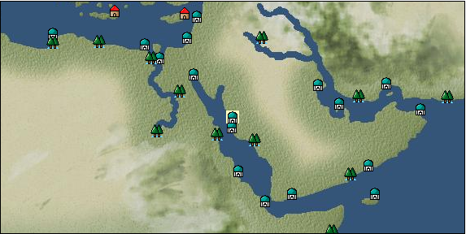

# Port: Yanbu

import Tabs from '@theme/Tabs';
import TabItem from '@theme/TabItem';

## General Information

| Attribute | Details |
| :--- | :--- |
| **Port Name** | Yanbu |
| **Port Type** | port of alliance |
| **Region** | Eastern Africa/India |
| **Sea Area** | 紅海 |
| **Required Language** | arabic |
| **Coordinates** | （1776，3895） |
| **Investment Reward** | [Lot (NO.13)](docs/Items/Consumables/Consumables-Treasure-Chests/item_3021.md) （必要投資額：500,000ドゥカード） |

### Available Facilities

| guild | intermediary | exchange | tool shop | workshop craftsman | Painter | sculptor | peddler |
| --- | --- | --- | --- | --- | --- | --- | --- |
|   |   | ○ | ○ |   |   |   |   |
| Shipyard Master | Lumbermaker | Sail-maker | weapon craftsman | master | TavernFemale | archive | salesperson |
| --- | --- | --- | --- | --- | --- | --- | --- |
| ○ | ○ |   | ○ | ○ |   |   |   |
| Shipwright | 銀行 | street worker | 王宮 | Trading post | church | suburbs | translator |
| --- | --- | --- | --- | --- | --- | --- | --- |
| ○ | ○ | ○ |   |   |   |   |   |

### Description
A port town facing the Red Sea. Since ancient times, it has connected the Mediterranean world with Egypt and other countries. It flourished as a transit trading port for spices and spices. To the northeast of the city are steep mountains, and the scenery is fantastic. Cultural area: Arab

<Tabs>
  <TabItem value="trade_goods_sales" label="Trade Goods Sales">

| Item | Group | Purchase Price | Allied Price | Remarks |
| --- | --- | --- | --- | --- |
| [coffee](docs/Items/TradeGoods/TradeGoods-Sunddries/item_445.md) | [Trading goods (hobby goods)](docs/Categories/category_10.md) | 394 | (345) |  |
| [coral](docs/Items/TradeGoods/TradeGoods-Gems/item_141.md) | [Trading Items (Gemstones)](docs/Categories/category_15.md) | 2,854 | (2,497) |  |
| 要投資（必要投資額：500,000） |
| [onion](docs/Items/TradeGoods/TradeGoods-Foodstuffs/item_28.md) | [Trading items (food items)](docs/Categories/category_3.md) | 75 | (66) |  |
| [camel hair](docs/Items/TradeGoods/TradeGoods-Fibers/item_577.md) | [交易品（繊維）](docs/Categories/category_1.md) | 360 | (315) |  |
| [wheat](docs/Items/TradeGoods/TradeGoods-Foodstuffs/item_16.md) | [Trading items (food items)](docs/Categories/category_3.md) | 41 | (36) |  |
| [gunpowder](docs/Items/TradeGoods/TradeGoods-Firearms/item_352.md) | [Trading Items (Firearms)](docs/Categories/category_17.md) | 805 | (705) |  |
| 要投資（必要投資額：240,000） |
| [oil](docs/Items/TradeGoods/TradeGoods-Wares/item_613.md) | [交易品（工業品）](docs/Categories/category_19.md) | 533 | (467) |  |
| [black ore](docs/Items/TradeGoods/TradeGoods-Minerals/item_890.md) | [Trading Items (Iron Stone)](docs/Categories/category_7.md) | (9,326) | 8,160 |  |
| Investment required (Required investment amount: 8,500,000) Purchase amount of 9 pieces at R7 ore from alliance territory (with honorary mayor grant) |
  </TabItem>
  <TabItem value="sale_specialty" label="Sale (Specialty)">

| Item | Group | sale price | Allied Price | Remarks |
| --- | --- | --- | --- | --- |
| Sales information for trade items with specialty judgment set is not registered. |
  </TabItem>
  <TabItem value="sale_no_specialty" label="Sale (No Specialty)">

| Item | Group | sale price | Allied Price | Remarks |
| --- | --- | --- | --- | --- |

#### [Trading goods (hobby goods)](docs/Categories/category_10.md)

| [raisins](docs/Items/TradeGoods/TradeGoods-Sunddries/item_35.md) | Trading goods (hobby goods) | 321 | (361) |  |
  </TabItem>
  <TabItem value="guild_&_others" label="Guild & Others">

| Item | Group | Sales price | Handling NPC | Remarks |
| --- | --- | --- | --- | --- |
| There is no sales information for the Item |
| --- |
  </TabItem>
  <TabItem value="toolman" label="Toolman">

| Item | Group | Sales price | Handling NPC | Remarks |
| --- | --- | --- | --- | --- |

#### [Equipment (body)](docs/Categories/category_24.md)

| [damask dolman](docs/Items/Equipment/Equipment-Body/item_795.md) | Equipment (body) | 181,700 | tool shop owner |  |

#### [Consumables (land battle/deck battle)](docs/Categories/category_29.md)

| [numbness medicine](docs/Items/Consumables/Consumables-Landbattle/item_452.md) | Consumables (land battle/deck battle) | 500 | tool shop owner |  |
| [strong adhesive oil](docs/Items/Consumables/Consumables-Landbattle/item_662.md) | Consumables (land battle/deck battle) | 200 | tool shop owner |  |
| [hellfire torch](docs/Items/Consumables/Consumables-Landbattle/item_233.md) | Consumables (land battle/deck battle) | 300 | tool shop owner |  |
| [explosive drug](docs/Items/Consumables/Consumables-Landbattle/item_558.md) | Consumables (land battle/deck battle) | 300 | tool shop owner |  |
  </TabItem>
  <TabItem value="shipyard" label="Shipyard">

### Shipwright

| Item | Group | Sales price | Handling NPC | Remarks |
| --- | --- | --- | --- | --- |

#### [recipe book](docs/Categories/category_22.md)

| [Shipbuilding materials and ropes](docs/Items/RecipeBooks/item_1761.md) | recipe book | Fixed recipe | Shipwright |  |

#### [shipbuilding materials](docs/Categories/category_47.md)

| [舫綱](docs/Items/ShipbuildingFS/item_1762.md) | shipbuilding materials | Fixed recipe | Shipwright |  |
  </TabItem>
</Tabs>