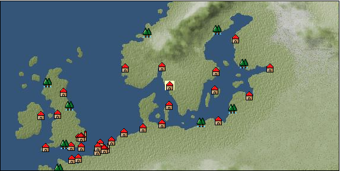

# Port: ヨーテボリ

import Tabs from '@theme/Tabs';
import TabItem from '@theme/TabItem';

## General Information

| Attribute | Details |
| :--- | :--- |
| **Port Name** | gothenburg |
| **Port Type** | port of alliance |
| **Region** | northern europe |
| **Sea Area** | Off the coast of Jutland |
| **Required Language** | Norse |
| **Coordinates** | （535，2077） |
| **Investment Reward** | [Lot (NO.16)](docs/Items/Consumables/Consumables-Treasure-Chests/item_6191.md) （必要投資額：500,000ドゥカード） |

### Available Facilities

| guild | intermediary | exchange | tool shop | workshop craftsman | Painter | sculptor | peddler |
| --- | --- | --- | --- | --- | --- | --- | --- |
|   |   | ○ | ○ | ○ |   |   |   |
| Shipyard Master | Lumbermaker | Sail-maker | weapon craftsman | master | TavernFemale | archive | salesperson |
| --- | --- | --- | --- | --- | --- | --- | --- |
| ○ | ○ |   | ○ | ○ |   |   |   |
| Shipwright | 銀行 | street worker | 王宮 | Trading post | church | suburbs | translator |
| --- | --- | --- | --- | --- | --- | --- | --- |
| ○ | ○ | ○ |   |   | ○ |   |   |

### Description
A city at the mouth of the Göta River on the Scandinavian Peninsula. It is thriving as a trading base. It was built by Gustav II Adolf and is lined with Dutch-style buildings. Gothenburg means "City of the Goths". Cultural area: Northern Europe

<Tabs>
  <TabItem value="trade_goods_sales" label="Trade Goods Sales">

| item | group | purchase price | 同盟時 | remarks |
| --- | --- | --- | --- | --- |
| [nettle](docs/Items/TradeGoods/TradeGoods-Medicine/item_6189.md) | [Trading products (medical products)](docs/Categories/category_6.md) | (443) | 388 |  |
| [Oat](docs/Items/TradeGoods/TradeGoods-Foodstuffs/item_275.md) | [Trading items (food items)](docs/Categories/category_3.md) | 33 | 32 |  |
| [Darla Hest](docs/Items/TradeGoods/TradeGoods-Luxuries/item_6190.md) | [Trading goods (artificial goods)](docs/Categories/category_13.md) | 1,782 | 1,680 |  |
| [european crayfish](docs/Items/TradeGoods/TradeGoods-Foodstuffs/item_6188.md) | [Trading items (food items)](docs/Categories/category_3.md) | 2,586 | 2,440 |  |
| [rye](docs/Items/TradeGoods/TradeGoods-Foodstuffs/item_61.md) | [Trading items (food items)](docs/Categories/category_3.md) | 33 | 32 |  |
| [flax](docs/Items/TradeGoods/TradeGoods-Fibers/item_64.md) | [交易品（繊維）](docs/Categories/category_1.md) | 177 | 168 |  |
| [wood](docs/Items/TradeGoods/TradeGoods-Wares/item_277.md) | [交易品（工業品）](docs/Categories/category_19.md) | 627 | 592 |  |
| [fur](docs/Items/TradeGoods/TradeGoods-Fibers/item_634.md) | [交易品（繊維）](docs/Categories/category_1.md) | 1,205 | 1,140 |  |
| 要投資（必要投資額：320,000） |
| [leather](docs/Items/TradeGoods/TradeGoods-Fibers/item_44.md) | [交易品（繊維）](docs/Categories/category_1.md) | 394 | 372 |  |
| 要投資（必要投資額：180,000） |
| [luxury furniture](docs/Items/TradeGoods/TradeGoods-Luxuries/item_1048.md) | [Trading goods (artificial goods)](docs/Categories/category_13.md) | 2,608 | 2,460 |  |
| 要投資（必要投資額：400,000） |
  </TabItem>
  <TabItem value="sale_specialty" label="Sale (Specialty)">

| item | group | sale price | 同盟時 | remarks |
| --- | --- | --- | --- | --- |

#### [Trading Goods (Spices)](docs/Categories/category_12.md)

| [cloves](docs/Items/TradeGoods/TradeGoods-Spices/item_1092.md) | Trading Goods (Spices) | (19,540) | 22,800 |  |
| [Kouzuku](docs/Items/TradeGoods/TradeGoods-Spices/item_3690.md) | Trading Goods (Spices) | (23,654) | 27,600 |  |
| [pepper](docs/Items/TradeGoods/TradeGoods-Spices/item_58.md) | Trading Goods (Spices) | 14,272 | (16,057) |  |
| [bergamot](docs/Items/TradeGoods/TradeGoods-Spices/item_879.md) | Trading Goods (Spices) | (796) | 928 |  |
| [mace](docs/Items/TradeGoods/TradeGoods-Spices/item_2100.md) | Trading Goods (Spices) | (19,369) | 22,600 |  |
| [Grapefruit](docs/Items/TradeGoods/TradeGoods-Spices/item_3422.md) | Trading Goods (Spices) | (25,625) | 29,900 |  |
| [Special selection Kouzuku](docs/Items/TradeGoods/TradeGoods-Spices/item_6481.md) | Trading Goods (Spices) | (47,307) | 55,200 |  |

#### [Trading goods (artificial goods)](docs/Categories/category_13.md)

| [glasswork](docs/Items/TradeGoods/TradeGoods-Luxuries/item_60.md) | Trading goods (artificial goods) | 2,043 | (2,298) |  |

#### [交易品（美術品）](docs/Categories/category_14.md)

| [oil painting](docs/Items/TradeGoods/TradeGoods-Art/item_1088.md) | 交易品（美術品） | (2,426) | 2,830 |  |
  </TabItem>
  <TabItem value="sale_no_specialty" label="Sale (No Specialty)">

| item | group | sale price | 同盟時 | remarks |
| --- | --- | --- | --- | --- |

#### [交易品（繊維）](docs/Categories/category_1.md)

| [flax](docs/Items/TradeGoods/TradeGoods-Fibers/item_64.md) | 交易品（繊維） | (72) | 84 |  |
| [fur](docs/Items/TradeGoods/TradeGoods-Fibers/item_634.md) | 交易品（繊維） | (489) | 570 |  |
| 要投資（必要投資額：320,000） |
| [leather](docs/Items/TradeGoods/TradeGoods-Fibers/item_44.md) | 交易品（繊維） | (160) | 186 |  |
| 要投資（必要投資額：180,000） |
| [wool](docs/Items/TradeGoods/TradeGoods-Fibers/item_5.md) | 交易品（繊維） | (422) | 492 |  |

#### [Trading items (food items)](docs/Categories/category_3.md)

| [Oat](docs/Items/TradeGoods/TradeGoods-Foodstuffs/item_275.md) | Trading items (food items) | (14) | 16 |  |
| [bacon](docs/Items/TradeGoods/TradeGoods-Foodstuffs/item_566.md) | Trading items (food items) | (390) | 454 |  |
| [european crayfish](docs/Items/TradeGoods/TradeGoods-Foodstuffs/item_6188.md) | Trading items (food items) | (1,046) | 1,220 |  |
| [rye](docs/Items/TradeGoods/TradeGoods-Foodstuffs/item_61.md) | Trading items (food items) | (14) | 16 |  |

#### [交易品（調味料）](docs/Categories/category_4.md)

| [butter](docs/Items/TradeGoods/TradeGoods-Seasonings/item_3.md) | 交易品（調味料） | (350) | 408 |  |

#### [Trading products (medical products)](docs/Categories/category_6.md)

| [nettle](docs/Items/TradeGoods/TradeGoods-Medicine/item_6189.md) | Trading products (medical products) | (167) | 194 |  |

#### [交易品（酒類）](docs/Categories/category_9.md)

| [whiskey](docs/Items/TradeGoods/TradeGoods-Alcohol/item_1.md) | 交易品（酒類） | (672) | 784 |  |
| [Beer](docs/Items/TradeGoods/TradeGoods-Alcohol/item_2.md) | 交易品（酒類） | (281) | 327 |  |

#### [Trading Goods (Spices)](docs/Categories/category_12.md)

| [garlic](docs/Items/TradeGoods/TradeGoods-Spices/item_526.md) | Trading Goods (Spices) | (314) | 366 |  |

#### [Trading goods (artificial goods)](docs/Categories/category_13.md)

| [Darla Hest](docs/Items/TradeGoods/TradeGoods-Luxuries/item_6190.md) | Trading goods (artificial goods) | (720) | 840 |  |
| [goldsmith](docs/Items/TradeGoods/TradeGoods-Luxuries/item_687.md) | Trading goods (artificial goods) | 5,847 | (6,578) |  |
| [luxury furniture](docs/Items/TradeGoods/TradeGoods-Luxuries/item_1048.md) | Trading goods (artificial goods) | (1,055) | 1,230 |  |
| 要投資（必要投資額：400,000） |

#### [交易品（美術品）](docs/Categories/category_14.md)

| [古美術品](docs/Items/TradeGoods/TradeGoods-Art/item_51.md) | 交易品（美術品） | 5,185 | (5,833) |  |
| [marble statue](docs/Items/TradeGoods/TradeGoods-Art/item_50.md) | 交易品（美術品） | 3,721 | (4,186) |  |

#### [Trading Items (Arms)](docs/Categories/category_16.md)

| [western armor](docs/Items/TradeGoods/TradeGoods-Weapons/item_6.md) | Trading Items (Arms) | (2,503) | 2,920 |  |

#### [Trading Items (Firearms)](docs/Categories/category_17.md)

| [大砲](docs/Items/TradeGoods/TradeGoods-Firearms/item_4.md) | Trading Items (Firearms) | 3,634 | (4,088) |  |

#### [交易品（工業品）](docs/Categories/category_19.md)

| [wood](docs/Items/TradeGoods/TradeGoods-Wares/item_277.md) | 交易品（工業品） | (254) | 296 |  |
| [Stone](docs/Items/TradeGoods/TradeGoods-Wares/item_276.md) | 交易品（工業品） | (588) | 686 |  |
| [coal](docs/Items/TradeGoods/TradeGoods-Wares/item_359.md) | 交易品（工業品） | (465) | 542 |  |
| [paper](docs/Items/TradeGoods/TradeGoods-Wares/item_625.md) | 交易品（工業品） | (313) | 365 |  |
| [iron material](docs/Items/TradeGoods/TradeGoods-Wares/item_268.md) | 交易品（工業品） | (857) | 1,000 |  |
| [青銅](docs/Items/TradeGoods/TradeGoods-Wares/item_7.md) | 交易品（工業品） | (969) | 1,130 |  |

#### [交易品（織物）](docs/Categories/category_20.md)

| [satin](docs/Items/TradeGoods/TradeGoods-Fabrics/item_996.md) | 交易品（織物） | 4,224 | (4,752) |  |
| [race](docs/Items/TradeGoods/TradeGoods-Fabrics/item_59.md) | 交易品（織物） | 2,017 | (2,269) |  |
  </TabItem>
  <TabItem value="guild_&_others" label="Guild & Others">

| item | group | Sales price | Handling NPC | remarks |
| --- | --- | --- | --- | --- |

#### others

| [Nordic wooden shoe making method](docs/Items/RecipeBooks/item_4516.md) | [recipe book](docs/Categories/category_22.md) | Fixed recipe |  |  |
| Period limited (17th century 3rd period) Resident (next to Tavern) |
  </TabItem>
  <TabItem value="toolman" label="Toolman">

| item | group | Sales price | Handling NPC | remarks |
| --- | --- | --- | --- | --- |

#### [recipe book](docs/Categories/category_22.md)

| [ancient cuisine](docs/Items/RecipeBooks/item_6192.md) | recipe book | 100,000 | tool shop owner |  |
| 要投資（必要投資額：8,000,000） |
| [Spear training/application](docs/Items/RecipeBooks/item_1141.md) | recipe book | 50,000 | tool shop owner |  |

#### [Equipment (body)](docs/Categories/category_24.md)

| [apron dress](docs/Items/Equipment/Equipment-Body/item_620.md) | Equipment (body) | 5,100 | tool shop owner |  |
| [Swedish folk clothes♀](docs/Items/Equipment/Equipment-Body/item_4437.md) | Equipment (body) | 76,000 | tool shop owner |  |
| 時代限定（17世紀第1期、17世紀第2期、17世紀第3期、17世紀第4期、17世紀第5期、18世紀第1期） |
| [Swedish folk clothes♂](docs/Items/Equipment/Equipment-Body/item_4438.md) | Equipment (body) | 76,000 | tool shop owner |  |
| 時代限定（17世紀第1期、17世紀第2期、17世紀第3期、17世紀第4期、17世紀第5期、18世紀第1期） |

#### [Equipment (legs)](docs/Categories/category_26.md)

| [clogs](docs/Items/Equipment/Equipment-Feet/item_4736.md) | Equipment (legs) | 18,600 | tool shop owner |  |
| 時代限定（17世紀第1期、17世紀第2期、17世紀第3期、17世紀第4期、17世紀第5期、18世紀第1期） |

#### [Equipment (belongings)](docs/Categories/category_27.md)

| [snap lock shooting gun](docs/Items/Equipment/Equipment-Weapon/item_267.md) | Equipment (belongings) | 8,000 | tool shop owner |  |

#### [Consumables (land battle/deck battle)](docs/Categories/category_29.md)

| [poison](docs/Items/Consumables/Consumables-Landbattle/item_269.md) | Consumables (land battle/deck battle) | 250 | tool shop owner |  |
| [antidote](docs/Items/Consumables/Consumables-Landbattle/item_270.md) | Consumables (land battle/deck battle) | 100 | tool shop owner |  |

#### [Consumables (skill activation)](docs/Categories/category_31.md)

| [fishing gear](docs/Items/Consumables/Consumables-Skill/item_79.md) | Consumables (skill activation) | 2,500 | tool shop owner |  |
  </TabItem>
  <TabItem value="kobo_craftsmen" label="Craftsman">

| item | group | Sales price | Handling NPC | remarks |
| --- | --- | --- | --- | --- |

#### [Consumables (condition recovery)](docs/Categories/category_21.md)

| [Nostalgic carillon bell](docs/Items/Consumables/Consumables-Recovery/item_245.md) | Consumables (condition recovery) | 200 | workshop craftsman |  |
| [Ship song sheet music](docs/Items/Consumables/Consumables-Recovery/item_247.md) | Consumables (condition recovery) | 200 | workshop craftsman |  |

#### [recipe book](docs/Categories/category_22.md)

| [Furniture Manufacturing/North Sea Volume 1](docs/Items/RecipeBooks/item_2002.md) | recipe book | Fixed recipe | workshop craftsman |  |
| [Marine life sculpture](docs/Items/RecipeBooks/item_273.md) | recipe book | 10,000 | workshop craftsman |  |

#### [Consumables (skill activation)](docs/Categories/category_31.md)

| [四分儀](docs/Items/Consumables/Consumables-Skill/item_346.md) | Consumables (skill activation) | 500 | workshop craftsman |  |
  </TabItem>
  <TabItem value="shipyard" label="Shipyard">

### Shipyard Master

| item | group | Sales price | Handling NPC | remarks |
| --- | --- | --- | --- | --- |

#### [Boat](docs/Categories/category_43.md)

| [2 mast cogs](docs/Items/Ships/item_265.md) | Boat | 96,000 | Shipyard Master |  |
| [warwick cog](docs/Items/Ships/item_336.md) | Boat | 230,000 | Shipyard Master |  |
| [carrack](docs/Items/Ships/item_236.md) | Boat | 720,000 | Shipyard Master |  |
| [Hansa Cog](docs/Items/Ships/item_263.md) | Boat | 24,000 | Shipyard Master |  |
| [Varsha](docs/Items/Ships/item_201.md) | Boat | 2,000 | Shipyard Master |  |
| [pinnace](docs/Items/Ships/item_767.md) | Boat | 950,000 | Shipyard Master |  |
| [flute](docs/Items/Ships/item_569.md) | Boat | 410,000 | Shipyard Master |  |
| [hooker](docs/Items/Ships/item_335.md) | Boat | 220,000 | Shipyard Master |  |
| [commercial carrack](docs/Items/Ships/item_239.md) | Boat | 728,000 | Shipyard Master |  |
| [commercial pinnace](docs/Items/Ships/item_768.md) | Boat | 960,000 | Shipyard Master |  |
| [commercial flute](docs/Items/Ships/item_570.md) | Boat | 420,000 | Shipyard Master |  |
| [commercial large carrack](docs/Items/Ships/item_409.md) | Boat | 1,840,000 | Shipyard Master |  |
| [commercial armed carrack](docs/Items/Ships/item_1502.md) | Boat | 4,000,000 | Shipyard Master |  |
| [large carrack](docs/Items/Ships/item_408.md) | Boat | 1,800,000 | Shipyard Master |  |
| [small carrack](docs/Items/Ships/item_219.md) | Boat | 480,000 | Shipyard Master |  |
| [small caravel](docs/Items/Ships/item_206.md) | Boat | 92,000 | Shipyard Master |  |
| [combat carrack](docs/Items/Ships/item_238.md) | Boat | 720,000 | Shipyard Master |  |
| [combat pinnace](docs/Items/Ships/item_766.md) | Boat | 950,000 | Shipyard Master |  |
| [combat flute](docs/Items/Ships/item_568.md) | Boat | 400,000 | Shipyard Master |  |
| [Large exploration carrack](docs/Items/Ships/item_1503.md) | Boat | 3,360,000 | Shipyard Master |  |
| [armed cog](docs/Items/Ships/item_264.md) | Boat | 25,000 | Shipyard Master |  |
| [light carrack](docs/Items/Ships/item_218.md) | Boat | 478,000 | Shipyard Master |  |
| [light caravelle](docs/Items/Ships/item_207.md) | Boat | 92,000 | Shipyard Master |  |
| [transport carrack](docs/Items/Ships/item_222.md) | Boat | 488,000 | Shipyard Master |  |
| [Small caravel for transport](docs/Items/Ships/item_3674.md) | Boat | 92,000 | Shipyard Master |  |

### Lumbermaker

| item | group | Sales price | Handling NPC | remarks |
| --- | --- | --- | --- | --- |

#### [Ship parts (additional armor)](docs/Categories/category_35.md)

| [elm board](docs/Items/ShipParts/Shipparts-Plates/item_328.md) | Ship parts (additional armor) | 13,000 | Lumbermaker |  |
| [Simple iron plate](docs/Items/ShipParts/Shipparts-Plates/item_1389.md) | Ship parts (additional armor) | 80,000 | Lumbermaker |  |
| [簡易銅板](docs/Items/ShipParts/Shipparts-Plates/item_617.md) | Ship parts (additional armor) | 41,000 | Lumbermaker |  |
| [lightweight oak board](docs/Items/ShipParts/Shipparts-Plates/item_533.md) | Ship parts (additional armor) | 38,000 | Lumbermaker |  |
| [lightweight cedar board](docs/Items/ShipParts/Shipparts-Plates/item_325.md) | Ship parts (additional armor) | 880 | Lumbermaker |  |
| [lightweight beach board](docs/Items/ShipParts/Shipparts-Plates/item_532.md) | Ship parts (additional armor) | 7,000 | Lumbermaker |  |
| [Lightweight red pine board](docs/Items/ShipParts/Shipparts-Plates/item_531.md) | Ship parts (additional armor) | 3,000 | Lumbermaker |  |
  </TabItem>
  <TabItem value="weapon craftsman" label="weapon craftsman">

| item | group | Sales price | Handling NPC | remarks |
| --- | --- | --- | --- | --- |

#### [recipe book](docs/Categories/category_22.md)

| [Shipbuilding materials/casting nets](docs/Items/RecipeBooks/item_1760.md) | recipe book | Fixed recipe | weapon craftsman |  |

#### [Ship parts (special weapons)](docs/Categories/category_37.md)

| [small corvus](docs/Items/ShipParts/Shipparts-Special-Weapons/item_193.md) | Ship parts (special weapons) | 3,000 | weapon craftsman |  |
| [small ram](docs/Items/ShipParts/Shipparts-Special-Weapons/item_190.md) | Ship parts (special weapons) | 1,000 | weapon craftsman |  |
| [small poop](docs/Items/ShipParts/Shipparts-Special-Weapons/item_198.md) | Ship parts (special weapons) | 39,000 | weapon craftsman |  |
| [small ship forecastle](docs/Items/ShipParts/Shipparts-Special-Weapons/item_195.md) | Ship parts (special weapons) | 5,000 | weapon craftsman |  |
| [poop](docs/Items/ShipParts/Shipparts-Special-Weapons/item_837.md) | Ship parts (special weapons) | 130,000 | weapon craftsman |  |
| [forecastle](docs/Items/ShipParts/Shipparts-Special-Weapons/item_241.md) | Ship parts (special weapons) | 16,000 | weapon craftsman |  |
| [additional spanker](docs/Items/ShipParts/Shipparts-Special-Weapons/item_200.md) | Ship parts (special weapons) | 55,000 | weapon craftsman |  |
| [additional split](docs/Items/ShipParts/Shipparts-Special-Weapons/item_197.md) | Ship parts (special weapons) | 44,000 | weapon craftsman |  |
| [additional small spanker](docs/Items/ShipParts/Shipparts-Special-Weapons/item_199.md) | Ship parts (special weapons) | 3,500 | weapon craftsman |  |
| [additional small split](docs/Items/ShipParts/Shipparts-Special-Weapons/item_196.md) | Ship parts (special weapons) | 2,000 | weapon craftsman |  |

#### [Ship parts (cannon)](docs/Categories/category_38.md)

| [4 amfer guns](docs/Items/ShipParts/Shipparts-Cannons/item_391.md) | Ship parts (cannon) | 26,600 | weapon craftsman |  |
| [6 Amfer cannons](docs/Items/ShipParts/Shipparts-Cannons/item_392.md) | Ship parts (cannon) | 81,000 | weapon craftsman |  |
| [4 Caprice guns](docs/Items/ShipParts/Shipparts-Cannons/item_395.md) | Ship parts (cannon) | 18,200 | weapon craftsman |  |
| [6 Caprice guns](docs/Items/ShipParts/Shipparts-Cannons/item_396.md) | Ship parts (cannon) | 55,500 | weapon craftsman |  |
| [8 Caprice guns](docs/Items/ShipParts/Shipparts-Cannons/item_397.md) | Ship parts (cannon) | 103,600 | weapon craftsman |  |
| [10 culverines](docs/Items/ShipParts/Shipparts-Cannons/item_375.md) | Ship parts (cannon) | 136,300 | weapon craftsman |  |
| [12 culverin guns](docs/Items/ShipParts/Shipparts-Cannons/item_744.md) | Ship parts (cannon) | 196,300 | weapon craftsman |  |
| [4 culverine guns](docs/Items/ShipParts/Shipparts-Cannons/item_372.md) | Ship parts (cannon) | 21,800 | weapon craftsman |  |
| [6 culverine guns](docs/Items/ShipParts/Shipparts-Cannons/item_373.md) | Ship parts (cannon) | 49,100 | weapon craftsman |  |
| [8 culverine guns](docs/Items/ShipParts/Shipparts-Cannons/item_374.md) | Ship parts (cannon) | 87,300 | weapon craftsman |  |
| [4 carronades](docs/Items/ShipParts/Shipparts-Cannons/item_836.md) | Ship parts (cannon) | 14,500 | weapon craftsman |  |
| [4 Shumine cannons](docs/Items/ShipParts/Shipparts-Cannons/item_2967.md) | Ship parts (cannon) | 29,300 | weapon craftsman |  |
| [6 Shumine cannons](docs/Items/ShipParts/Shipparts-Cannons/item_2968.md) | Ship parts (cannon) | 89,100 | weapon craftsman |  |
| [10 Saker cannons](docs/Items/ShipParts/Shipparts-Cannons/item_187.md) | Ship parts (cannon) | 79,000 | weapon craftsman |  |
| [2 saker cannons](docs/Items/ShipParts/Shipparts-Cannons/item_183.md) | Ship parts (cannon) | 3,200 | weapon craftsman |  |
| [4 saker cannons](docs/Items/ShipParts/Shipparts-Cannons/item_184.md) | Ship parts (cannon) | 12,600 | weapon craftsman |  |
| [6 Saker cannons](docs/Items/ShipParts/Shipparts-Cannons/item_185.md) | Ship parts (cannon) | 28,400 | weapon craftsman |  |
| [8 Saker cannons](docs/Items/ShipParts/Shipparts-Cannons/item_186.md) | Ship parts (cannon) | 50,500 | weapon craftsman |  |
| [10 demi culverin cannons](docs/Items/ShipParts/Shipparts-Cannons/item_370.md) | Ship parts (cannon) | 101,000 | weapon craftsman |  |
| [12 demi culverin cannons](docs/Items/ShipParts/Shipparts-Cannons/item_371.md) | Ship parts (cannon) | 145,400 | weapon craftsman |  |
| [2 demi culverin cannons](docs/Items/ShipParts/Shipparts-Cannons/item_188.md) | Ship parts (cannon) | 4,000 | weapon craftsman |  |
| [4 demi culverin cannons](docs/Items/ShipParts/Shipparts-Cannons/item_189.md) | Ship parts (cannon) | 16,200 | weapon craftsman |  |
| [6 demi culverin cannons](docs/Items/ShipParts/Shipparts-Cannons/item_368.md) | Ship parts (cannon) | 36,400 | weapon craftsman |  |
| [8 demi culverin cannons](docs/Items/ShipParts/Shipparts-Cannons/item_369.md) | Ship parts (cannon) | 64,600 | weapon craftsman |  |
| [4 Draconis cannons](docs/Items/ShipParts/Shipparts-Cannons/item_386.md) | Ship parts (cannon) | 18,200 | weapon craftsman |  |
| [6 Draconis cannons](docs/Items/ShipParts/Shipparts-Cannons/item_387.md) | Ship parts (cannon) | 55,500 | weapon craftsman |  |
| [8 Draconis cannons](docs/Items/ShipParts/Shipparts-Cannons/item_390.md) | Ship parts (cannon) | 103,600 | weapon craftsman |  |
| [4 pyro cannons](docs/Items/ShipParts/Shipparts-Cannons/item_384.md) | Ship parts (cannon) | 12,500 | weapon craftsman |  |
| [6 pyro cannons](docs/Items/ShipParts/Shipparts-Cannons/item_385.md) | Ship parts (cannon) | 38,000 | weapon craftsman |  |
| [2 falcon guns](docs/Items/ShipParts/Shipparts-Cannons/item_174.md) | Ship parts (cannon) | 500 | weapon craftsman |  |
| [4 falcon guns](docs/Items/ShipParts/Shipparts-Cannons/item_175.md) | Ship parts (cannon) | 2,000 | weapon craftsman |  |
| [6 falcon guns](docs/Items/ShipParts/Shipparts-Cannons/item_176.md) | Ship parts (cannon) | 4,600 | weapon craftsman |  |
| [8 falcon guns](docs/Items/ShipParts/Shipparts-Cannons/item_177.md) | Ship parts (cannon) | 8,100 | weapon craftsman |  |
| [4 frango guns](docs/Items/ShipParts/Shipparts-Cannons/item_393.md) | Ship parts (cannon) | 12,500 | weapon craftsman |  |
| [6 frango guns](docs/Items/ShipParts/Shipparts-Cannons/item_394.md) | Ship parts (cannon) | 38,000 | weapon craftsman |  |
| [10 Heitzer guns](docs/Items/ShipParts/Shipparts-Cannons/item_947.md) | Ship parts (cannon) | 226,800 | weapon craftsman |  |
| [2 Heutzer guns](docs/Items/ShipParts/Shipparts-Cannons/item_633.md) | Ship parts (cannon) | 9,100 | weapon craftsman |  |
| [4 Heitzer guns](docs/Items/ShipParts/Shipparts-Cannons/item_1390.md) | Ship parts (cannon) | 36,300 | weapon craftsman |  |
| [6 Heutzer guns](docs/Items/ShipParts/Shipparts-Cannons/item_945.md) | Ship parts (cannon) | 81,700 | weapon craftsman |  |
| [8 Heutzer guns](docs/Items/ShipParts/Shipparts-Cannons/item_946.md) | Ship parts (cannon) | 145,200 | weapon craftsman |  |
| [10 minion cannons](docs/Items/ShipParts/Shipparts-Cannons/item_182.md) | Ship parts (cannon) | 34,800 | weapon craftsman |  |
| [2 minion cannons](docs/Items/ShipParts/Shipparts-Cannons/item_178.md) | Ship parts (cannon) | 1,400 | weapon craftsman |  |
| [4 minion cannons](docs/Items/ShipParts/Shipparts-Cannons/item_179.md) | Ship parts (cannon) | 5,600 | weapon craftsman |  |
| [6 minion cannons](docs/Items/ShipParts/Shipparts-Cannons/item_180.md) | Ship parts (cannon) | 12,400 | weapon craftsman |  |
| [8 minion cannons](docs/Items/ShipParts/Shipparts-Cannons/item_181.md) | Ship parts (cannon) | 22,400 | weapon craftsman |  |
| [4 Meteora cannons](docs/Items/ShipParts/Shipparts-Cannons/item_398.md) | Ship parts (cannon) | 26,600 | weapon craftsman |  |
| [6 Meteora cannons](docs/Items/ShipParts/Shipparts-Cannons/item_399.md) | Ship parts (cannon) | 81,000 | weapon craftsman |  |
| [4 Volcan guns](docs/Items/ShipParts/Shipparts-Cannons/item_2965.md) | Ship parts (cannon) | 29,300 | weapon craftsman |  |
| [6 Volcan guns](docs/Items/ShipParts/Shipparts-Cannons/item_2966.md) | Ship parts (cannon) | 89,100 | weapon craftsman |  |
  </TabItem>
</Tabs>